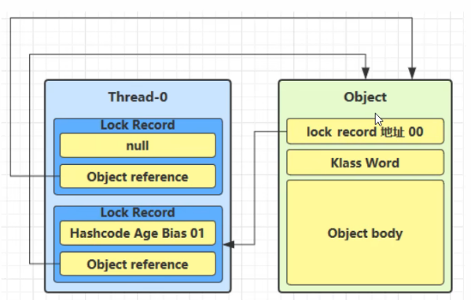

## 进程和线程

进程：

- 程序由指令和数据组成，但这些指令要运行，数据要读写，就必须将指令加载至CPU，数据加载至内存。在指令运行过程中还需要用到磁盘、网络等设备。进程就是用来加载指令、管理内存、管理IO的
- 当一个程序被运行，从磁盘加载这个程序的代码至内存，这时就开启了一个进程
- 进程可以视为程序的一个实例


线程：

- 一个进程之内可以分为一到多个线程
- 一个线程就是一个指令流，将指令流中的一条条指令以一定的顺序交给CPU执行
- java中，线程作为最小调度单位，进程作为资源分配的最小单位。在windows中进程是不活动的，只是作为线程的容器


二者对比


## 异步调用

从方法调用的角度来说，如果：

- 需要等待结果返回，才能继续运行就是同步
- 不需要等待结果返回，就能继续运行就是异步


多线程可以让方法执行变为异步的


## 查看、杀死进程

window:
`tasklist`

`taskkill`


`jps`查看所有java进程

`jstack <PID>`查看某个java进程（PID）的所有线程状态

`jconsole`查看某个java进程中线程的运行情况（图形界面）


## 线程运行原理

### 栈与栈帧

Java Virtual Machine Stacks（java虚拟机栈）

JVM中由堆、栈、方法区组成，栈内存就是给线程进行使用的，每个线程启动后，虚拟机就会为其分配一块栈内存。

- 每个栈由多个栈帧（frame）组成，对应着每次方法调用时所占用的内存
- 每个线程只能有一个活动栈帧，对应着当前正在执行的方法


### 线程上下文切换

Thread Context Switch

  因为以下一些原因导致cpu不再执行当前的线程，转而执行另一个线程的代码

- 线程的cpu时间片用完
- 垃圾回收
- 有更高优先级的线程需要运行
- 线程自己调用了sleep、yield、wait、join、park、synchronized、lock等方法

当Context Switch发生时，需要由操作系统保存当前线程的状态，并恢复另一个线程的状态，java中对应概念就是程序计数器（Program Conuter Register），它的作用是记住下一条jvm指令的执行地址，是线程私有的

- 状态包括程序计数器、虚拟机栈中每个栈帧的而信息，如局部变量、操作数栈、返回地址等
- Context Switch频繁发生会影响性能


# 常见方法 


- start VS run

  直接调用run不会开启新线程

- sleep

  - sleep会让线程从running到timed waitting状态
- 其他线程可以使用interrupt方法打断正在睡眠的线程，这时sleep方法会抛出InterruptedExcepttion异常
  
- TimeUnit类中的sleep也可以使用
  
- yield

  - 礼让，不一定成功，取决于繁忙程度。

- 线程优先级

  如果cpu比较忙，优先级高的线程会获得更多时间片，但cpu闲时，优先级几乎没有作用。

- join

  - 调用此方法的线程等待被调用此方法的线程执行完毕（thread.join()，其中thread是被调用join的线程）
  - 带参数的join，最多等待参数时间

- interrupt

  - 打断 sleep，wait，join （这几个方法都会让线程进入阻塞状态）的线程。
  - isInterrupt方法获取是否被打断。打断被阻塞的线程会以异常的形式出现，然后把打断标记置为false；打断正常线程，打断标记为true，不会抛异常。
  - 打断park状态方法，不会清除打断标记。打断标记为true时，park不能正常执行
  - interrupted：判断是否被打断，并清除打断标记

### **设计模式--两阶段终止**

Two PhaseTermination

在线程T1中优雅的终止线程T2，这里的优雅是指给T2一个料理后事的机会（比如释放锁）


模拟编写一个监控线程，用监控系统健康状态：

```java
public class Test3 {
    public static void main(String[] args) {
        TwoPhaseTermination tpt = new TwoPhaseTermination();
        tpt.start();
        try {
            Thread.sleep(3500);
        } catch (InterruptedException e) {
            throw new RuntimeException(e);
        }
        tpt.stop();
    }
}
class TwoPhaseTermination{
    private Thread monitor;
    //启动监控线程
    public void start(){
        monitor=new Thread(()->{
           while(true){
               Thread currentThread=Thread.currentThread();
               boolean interrupted = currentThread.isInterrupted();
               if(interrupted){
                   System.out.println("料理后事");
                   break;
               }
               try {
                   Thread.sleep(1000);
                   System.out.println("执行监控");
               } catch (InterruptedException e) {
                   e.printStackTrace();
                   //由于sleep状态下被打断会重置打断标记为false，
                   // 如果不重新设置打断标记，while会一直执行
                   currentThread.interrupt();
               }
           }
        });
        monitor.start();
    }
    //停止监控线程
    public void stop(){
        monitor.interrupt();
    }
}
```

此处只是编写了简单逻辑，后面会用volatile进行优化


### 过时方法

容易破坏同步代码块，造成线程死锁
`stop()`

`suspend()`

`resume()`


### 守护线程

默认情况下，java进程需要等待所有线程都运行结束，才会结束。有一种特殊的线程叫做守护线程，只要其他非守护线程运行结束了，即使守护线程的代码没有执行完，也会强制结束。

`t1.setDaemon(true)`

垃圾回收器线程就是一种守护线程

tomcat中的Acceptor和poller线程都是守护线程，所以tomcat接收到shutdown命令后，不会等待它们处理完当前请求。


# 线程状态 

五种：

这是从操作系统层面来描述的

- 初始状态：仅在语言层面创建了线程对象，还未与操作系统线程关联
- 可运行状态（就绪状态）：指该线程以及该被创建（与操作系统线程关联），可以由CPU调度执行
- 运行状态：获取了CPU时间片运行中的状态
  - 当cpu时间片用完，会从【运行状态】转换至【可运行状态】，会导致线程的上下文切换
- 阻塞状态：
  - 如果调用了阻塞API，如BIO读写文件，这时该线程实际不会用到cpu，会让出cpu，导致线程上下文切换，进入阻塞状态
  - 等BIO操作完毕，会由操作系统唤醒阻塞的线程，转换至【可运行状态】
  - 与【可运行状态】的区别是，对【阻塞状态】的线程来说只要它们一直不被唤醒，调度器就一直不会考虑调度它们
- 终止状态：线程执行完毕，生命周期结束，不会再转换为其他状态


六种：

这是从java api层面来描述的

根据Thread.State枚举，分为六种状态

- new：刚被创建，没有调用start方法

- Runnable：调用了start方法之后,线程进入可运行状态。这意味着线程可以被调度执行，但实际上是否正在运行取决于操作系统的线程调度器。

  在这个状态下，线程可能正在运行，也可能在等待CPU时间片。

- Blocked：当线程试图获取某个锁（例如，在同步方法或代码块中），而该锁已经被其他线程持有时，当前线程会进入阻塞状态。

  线程将一直保持在这个状态直到获得了所需的锁。

- Waiting：线程可能会因为调用了某些方法（如 Object.wait(), Thread.join(), 或者 LockSupport.park()）而进入等待状态。这些方法会使线程暂停执行，直到另一个线程显式地唤醒它（通过 notify(), notifyAll() 或者 unpark()）。

- Timed Waiting：类似于等待状态，但是有一个超时限制。当线程调用了带有超时参数的方法（如 Thread.sleep(long millis), Object.wait(long timeout), Thread.join(long millis)）时，它会进入计时等待状态。

  即使没有其他线程唤醒它，到达指定的时间后，线程也会自动恢复为可运行状态。

- Terminated：当线程正常完成其 run() 方法或者由于未捕获的异常导致线程结束时，它进入终止状态。终止后的线程不能再重启或再次使用。


# 共享模型之Monitor

临界区Critical Section

一段代码块如果存在对共享资源的多线程读写操作，称其为临界区

竞态条件：Race Condition

多线程在临界区执行，由于代码的执行序列不同而导致结果无法预测，称之为发生了竞态条件


为了避免临界区的竞态条件发生，有多种手段可以达到目的：

- 阻塞式的解决方案：synchronized、lock
- 非阻塞式的解决方案：原子变量


## 线程安全分析

### 局部变量的线程安全

局部变量是线程安全的，但是局部变量引用的对象则未必。（局部变量引用的对象的地址不会发生改变，所以它线程安全，但对象内容不一定不变）

比如：

如果我在一个类的method1方法中创建一个局部变量，然后再此方法中调用本类的另一个方法method2，并在method2中开启新线程对局部变量进行操作，那么这个局部变量引用的对象就是不安全的了。

此外，即使我在method2方法中没有开启新线程，但是method2方法是public的，那么子类在重写method2的时候，可以覆盖method2，如果在覆盖的方法中开启了新线程，那么也会导致子类局部变量引用的对象线程不安全。

method2被称为**外星方法**


### 线程安全的类

- String
- Integer
- StringBuffer
- Vector
- Hashtable
- juc包下的类

这里说的线程安全是指，多个线程调用同一个实例的某一个方法时，是线程安全的。也可以理解为它们的每个方法是原子的。


**引用类即使加了final也不是线程安全的，除非它是不可变的。（final只是让它的引用地址不可变，不代表值不可变）**


**没有成员变量的类一般线程安全**


## Monitor（锁）

### 对象头

以32位虚拟机为例


64 位虚拟机 Mark Word:


### 工作原理

Monitor被称为监视器或管程

每个java对象都可以关联一个Monitor对象，如果使用synchronized给对象加上重锁之后，该对象头的Mark Word中就被设置指向Monitor对象的指针

加锁示意图:


Monitor结构如下：


- 刚开始Monitor中owner为null
- 当Thread-2执行synchronized(obj)就会将Monitor的所有者owner置为Thread-2，Monitor中只能有一个owner
- 在Thread-2上锁的过程中，如果Thread-3，Thread-4,Thread-5也来执行synchronized(obj)，就会进入EntryList，状态为BLOCKED
- Thread-2执行完同步代码块的内容，然后唤醒EntryList中等待的线程来竞争锁，竞争是非公平的
- 图中WaitSet中的Thread-0，Thread-1是之前获得过锁，但条件不满足而进入WAITING状态的线程，后面讲wait-notify时会分析


## synchronized优化原理

### 轻量级锁

轻量级锁的使用场景：如果一个对象虽然有多线程访问，但多线程访问的时间是错开的（也就是没有竞争），那么可以使用轻量级锁来优化。

轻量级锁对使用者是透明的，即语法仍然是synchronized

```java
static final Object obj=new Object();
public static void method1(){
	synchronized(obj){
		//同步块A
		method2();
	}
}
public static void method2(){
	synchronized(obj){
		//同步块B
	}
}
```

- 创建锁记录（Lock Record）对象，每个线程的栈帧都会包含一个锁记录的结构，内部可以存储锁定对象的Mark Word


- 让锁记录中Object reference指向锁对象，并尝试用cas操作交换Object的Mark Word和上图中Lock Record的第一条信息，将Mark Word的值存入锁记录(00表示轻量级锁，01表示未加锁)

  

- 如果使用cas操作交换成功，对象头中存储了`锁记录地址和状态00`，表示由该线程给对象加锁：


- 如果cas交换失败，有两种情况

  - 如果是其他线程已经持有了该Object的轻量级锁，这时表明有竞争，进入**锁膨胀**过程

  - 如果是自己执行了synchronized锁重入，那么再添加一条Lock Record作为重入的计数

    第二种情况示意图



- 当退出synchronized代码块（解锁）时，如果有取值为null的锁记录，表示有重入，这时重置锁记录，表示重入计数减一

- 当退出synchronized代码块（解锁）时，如果没有取值为null的锁记录，这时使用cas将Mark Word的值恢复给对象头
  - 成功，则解锁成功
  - 失败，说明轻量级锁进行了锁膨胀或已经升级为重量级锁，进入重量级锁解锁流程


### 锁膨胀

如果在尝试加轻量级锁的过程中，CAS操作无法成功，这时一种情况就是有其他线程为此对象加上了轻量级锁（有竞争），这时需要进行锁膨胀，将轻量级锁变为重量级锁。


- 当Thread-1进行轻量级加锁时，Thread-0已经对该对象加了轻量级锁

  

- 这时Thread-1加轻量级锁失败，进入锁膨胀流程

  - 即为Object对象申请Monitor锁，让Object指向重量级锁地址
  - 然后自己进入Monitor的EntryList，状态为BLOCKED

  

- 当Thread-0退出同步块解锁时，使用cas将Mark Word的值恢复给对象头，失败。这时会进入重量级解锁流程，即按照Monitor地址找到Monitor对象，设置Owner为null，唤醒EntryList中的BLOCKED线程


### 自旋优化

重量级锁竞争的时候，还可以使用自旋来进行优化，如果当前线程自旋成功（即重试几次后持锁线程已经退出同步块，释放了锁），这时当前线程就可以避免阻塞。


- 在java6之后自旋锁是自适应的，比如对象刚刚一次的自旋操作成功过，那么认为这次自旋成功的可能性会很高，就多自旋几次；反之，就少自旋甚至不自旋。
- 自旋会占用CPU时间，单核CPU自旋就浪费，多核CPU自旋才能发挥优势
- java7之后不能控制是否开启自旋功能


### 偏向锁(新版jdk已废弃)

本线程在持有某个轻量级锁时，每次重入仍然要执行CAS操作。

java6中引入了偏向锁来做进一步优化：只有第一次使用CAS将线程ID设置到对象的Mark Word头，之后发现这个线程ID是自己的就表示没有竞争，不用重新CAS。


#### 状态


一个对象创建时：

- 如果开启了偏向锁（java15后默认关闭），那么对象创建后，markword值为0x05即最后三位为101，这时它的thread、epoch、age都为0。
- 偏向锁是延迟的，不会在程序启动时立即生效，如果向避免延迟，可以加VM参数`-XX:BiasedLockingStartupDelay=0`来禁用延迟
- 如果没有开启偏向锁，那么对象创建后，markword值为0x01即最后三位为001，这时它的hashcode、age都为0，第一次用到hashcode才会赋值


当一个对象处于偏向锁状态时，调用hashcode方法会取消这个对象的偏向锁状态


偏向锁的应用场景是单个线程重复访问某个对象时，如果该对象就是用在多线程场景下的，那么就不适合用偏向锁了。

#### 撤销

刚才说了撤销偏向锁的一种情况：

当一个对象处于偏向锁状态时，调用hashcode方法会取消这个对象的偏向锁状态.


第二种情况：

当其他线程使用偏向锁对象时，会将偏向锁改变为轻量级锁（注意是使用，如果出现竞争就不是轻量级锁了，而是重量级锁）


第三种情况：

调用wait/notify会撤销偏向锁--wait/notify只有重量级锁有

#### 批量重偏向

#### 批量撤销


### 锁消除

锁消除（Lock Elimination）是 Java 虚拟机（JVM）中的一种优化技术，旨在通过分析程序的运行时行为，识别并移除那些实际上不会发生竞争的同步块或方法。这种优化可以减少不必要的同步开销，从而提高程序的执行效率。


`-XX:-EliminateLocks`：禁用锁消除


## wait/notify


- Onwer线程发现条件不满足，就调用锁对象的wait方法进入WaitSet变为WAITING状态
- BLOCKED和WAITING的线程都处于阻塞状态，不占用CPU时间片
- BLOCKED线程会在Owner线程释放锁时唤醒
- WAITING线程会在Owner线程调用notify或notifyAll时唤醒，但唤醒后并不意味着立刻获取锁，仍需进入EntryList重新竞争


`obj.wait()`让进入object监视器的线程到WaitSet等待

`obj.wait(long n)`如果时间内没有被唤醒，时间到后自动被唤醒

`obj.notify()`在object上正在WaitSet等待的线程中挑一个唤醒

`obj.notifyAll()`全部唤醒

它们都是线程间进行协作的手段，都属于Object对象的方法。必须获得此对象的锁，才能调用这几个方法


### 正确使用方式

**sleep(long n)和wait(long n)的区别**

1）sleep是thread的静态方法，wait是Object的方法

2）sleep不需要和synchronized配合使用，但wait需要和synchronized一起用

3）sleep在睡眠的同时，不会释放锁对象，但wait在等待的时候会释放锁对象


虚假唤醒（Spurious Wakeup)是指一个线程在没有其他线程对它发出明确通知的情况下从 `wait()` 方法中醒来。虽然这种情况很少发生，但在设计多线程程序时必须考虑到这种可能性，以避免逻辑错误。

为了避免因虚假唤醒而导致的逻辑错误，建议在使用 `wait()` 方法时总是结合一个循环来检查等待条件是否真正满足。这是因为 `wait()` 方法返回时，并不能保证之前设置的条件仍然成立。如果仅依赖一次性的条件判断，则可能会因为虚假唤醒而做出不正确的决策。

```java
synchronized(lock){
	while(条件不成立){
		lock.wait();
	}
}

//另一个线程
synchronized(lock){
	lock.notifyAll();
}
```


## 设计模式--保护性暂停

即 Guarded Suspension，用在一个线程等待另一个线程的执行结果

要点

- 有一个结果需要从一个线程传递到另一个线程，让他们关联同一个 GuardedObject

- 如果有结果不断从一个线程到另一个线程那么可以使用消息队列（见生产者/消费者）

- JDK 中，join 的实现、Future 的实现，采用的就是此模式

- 因为要等待另一方的结果，因此归类到同步模式


### **实现**

```java
class GuardedObject {
	private Object response;
 	private final Object lock = new Object();
	public Object get() {
		synchronized (lock) {
			// 条件不满足则等待
			while (response == null) {
				try {
					lock.wait();
				} catch (InterruptedException e) {
					e.printStackTrace();
				}
            }
		return response;
		}
	}
	public void complete(Object response) {
		synchronized (lock) {
			// 条件满足，通知等待线程
			this.response = response;
			lock.notifyAll();
		}
 	}
}
```

### **测试**

一个线程等待另一个线程的执行结果

```java
public static void main(String[] args) {
	GuardedObject guardedObject = new GuardedObject();
	new Thread(() -> {
		try {
			// 子线程执行下载
			List<String> response = download();
			log.debug("download complete...");
			guardedObject.complete(response);
		} catch (IOException e) {
			e.printStackTrace();
		}
	}).start();
	log.debug("waiting...");
	// 主线程阻塞等待
	Object response = guardedObject.get();
	log.debug("get response: [{}] lines", ((List<String>) response).size());
}
```

执行结果

```
08:42:18.568 [main] c.TestGuardedObject - waiting...
08:42:23.312 [Thread-0] c.TestGuardedObject - download complete...
08:42:23.312 [main] c.TestGuardedObject - get response: [3] lines
```


### 带超时版GuardedObject

如果要控制超时时间呢

```java
class GuardedObjectV2 {
	private Object response;
	private final Object lock = new Object();
	public Object get(long millis) {
		synchronized (lock) {
			// 1) 记录最初时间
			long begin = System.currentTimeMillis();
			// 2) 已经经历的时间
			long timePassed = 0;
			while (response == null) {
				// 4) 假设 millis 是 1000，结果在 400 时唤醒了，那么还有 600 要等
				long waitTime = millis - timePassed;
				log.debug("waitTime: {}", waitTime);
				if (waitTime <= 0) {
					log.debug("break...");
					break;
				}
				try {
					lock.wait(waitTime);
				} catch (InterruptedException e) {
					e.printStackTrace();
				}
				// 3) 如果提前被唤醒，这时已经经历的时间假设为 400
				timePassed = System.currentTimeMillis() - begin;
				log.debug("timePassed: {}, object is null {}", 
							timePassed, response == null);
			}
			return response;
		}
	}
	public void complete(Object response) {
		synchronized (lock) {
			// 条件满足，通知等待线程
			this.response = response;
			log.debug("notify...");
			lock.notifyAll();
		}
	}
}
```

测试，没有超时

```java
public static void main(String[] args) {
	GuardedObjectV2 v2 = new GuardedObjectV2();
	new Thread(() -> {
		sleep(1);
		v2.complete(null);
		sleep(1);
		v2.complete(Arrays.asList("a", "b", "c"));
	}).start();
	
	Object response = v2.get(2500);
	if (response != null) {
		log.debug("get response: [{}] lines", 
				((List<String>) response).size());
	} else {
		log.debug("can't get response");
	}
}
```

输出

```
08:49:39.917 [main] c.GuardedObjectV2 - waitTime: 2500
08:49:40.917 [Thread-0] c.GuardedObjectV2 - notify...
08:49:40.917 [main] c.GuardedObjectV2 - timePassed: 1003, object is null true
08:49:40.917 [main] c.GuardedObjectV2 - waitTime: 1497
08:49:41.918 [Thread-0] c.GuardedObjectV2 - notify...
08:49:41.918 [main] c.GuardedObjectV2 - timePassed: 2004, object is null false
08:49:41.918 [main] c.TestGuardedObjectV2 - get response: [3] lines
```

测试，超时

```java
// 等待时间不足
List<String> lines = v2.get(1500);
```

输出

```
08:47:54.963 [main] c.GuardedObjectV2 - waitTime: 1500
08:47:55.963 [Thread-0] c.GuardedObjectV2 - notify...
08:47:55.963 [main] c.GuardedObjectV2 - timePassed: 1002, object is null true
08:47:55.963 [main] c.GuardedObjectV2 - waitTime: 498
08:47:56.461 [main] c.GuardedObjectV2 - timePassed: 1500, object is null true
08:47:56.461 [main] c.GuardedObjectV2 - waitTime: 0
08:47:56.461 [main] c.GuardedObjectV2 - break...
08:47:56.461 [main] c.TestGuardedObjectV2 - can't get response
08:47:56.963 [Thread-0] c.GuardedObjectV2 - notify...
```


### join原理

join 体现的是【保护性暂停】模式


是调用者轮询检查线程 alive 状态

```
t1.join();
```

等价于下面的代码

```java
synchronized (t1) {
	// 调用者线程进入 t1 的 waitSet 等待, 直到 t1 运行结束
	while (t1.isAlive()) {
		t1.wait(0);
	}
}
```


### 多任务版**GuardedObject**

图中 Futures 就好比居民楼一层的信箱（每个信箱有房间编号），左侧的 t0，t2，t4 就好比等待邮件的居民，右侧的 t1，t3，t5 就好比邮递员

如果需要在多个类之间使用 GuardedObject 对象，作为参数传递不是很方便，因此设计一个用来解耦的中间类，这样不仅能够解耦【结果等待者】和【结果生产者】，还能够同时支持多个任务的管理。


新增 id 用来标识 Guarded Object

```java
class GuardedObject {
	// 标识 Guarded Object
	private int id;
	public GuardedObject(int id) {
		this.id = id;
	}
	
	public int getId() {
		return id;
	}
	
	// 结果
	private Object response;
	
	// 获取结果
	// timeout 表示要等待多久 2000
	public Object get(long timeout) {
		synchronized (this) {
			// 开始时间 15:00:00
			long begin = System.currentTimeMillis();
			// 经历的时间
			long passedTime = 0;
			while (response == null) {
				// 这一轮循环应该等待的时间
				long waitTime = timeout - passedTime;
				// 经历的时间超过了最大等待时间时，退出循环
				if (timeout - passedTime <= 0) {
					break;
				}
				try {
					this.wait(waitTime); // 虚假唤醒 15:00:01
				} catch (InterruptedException e) {
					e.printStackTrace();
				}
				// 求得经历时间
				passedTime = System.currentTimeMillis() - begin; // 15:00:02 1s
			}
			return response;
		}
	}
	// 产生结果
	public void complete(Object response) {
		synchronized (this) {
			// 给结果成员变量赋值
			this.response = response;
			this.notifyAll();
		}
	}
}
```

中间解耦类

```java
class Mailboxes {
	private static Map<Integer, GuardedObject> boxes = new Hashtable<>();
	private static int id = 1;
	// 产生唯一 id
	private static synchronized int generateId() {
		return id++;
	}
	public static GuardedObject getGuardedObject(int id) {
		return boxes.remove(id);
	}
	public static GuardedObject createGuardedObject() {
		GuardedObject go = new GuardedObject(generateId());
		boxes.put(go.getId(), go);
		return go;
	}
	public static Set<Integer> getIds() {
		return boxes.keySet();
	}
}
```

业务相关类

````java
class People extends Thread{
	@Override
	public void run() {
		// 收信
		GuardedObject guardedObject = Mailboxes.createGuardedObject();
		log.debug("开始收信 id:{}", guardedObject.getId());
		Object mail = guardedObject.get(5000);
		log.debug("收到信 id:{}, 内容:{}", guardedObject.getId(), mail);
	}
}
````

```java
class Postman extends Thread {
	private int id;
	private String mail;
	public Postman(int id, String mail) {
		this.id = id;
		this.mail = mail;
	}
	@Override
	public void run() {
		GuardedObject guardedObject = Mailboxes.getGuardedObject(id);
		log.debug("送信 id:{}, 内容:{}", id, mail);
		guardedObject.complete(mail);
	}
}
```


测试

```java
public static void main(String[] args) throws InterruptedException {
	for (int i = 0; i < 3; i++) {
		new People().start();
	}
	Sleeper.sleep(1);
	for (Integer id : Mailboxes.getIds()) {
		new Postman(id, "内容" + id).start();
	}
}
```

某次运行结果

```
10:35:05.689 c.People [Thread-1] - 开始收信 id:3
10:35:05.689 c.People [Thread-2] - 开始收信 id:1
10:35:05.689 c.People [Thread-0] - 开始收信 id:2
10:35:06.688 c.Postman [Thread-4] - 送信 id:2, 内容:内容2
10:35:06.688 c.Postman [Thread-5] - 送信 id:1, 内容:内容1
10:35:06.688 c.People [Thread-0] - 收到信 id:2, 内容:内容2
10:35:06.688 c.People [Thread-2] - 收到信 id:1, 内容:内容1
10:35:06.688 c.Postman [Thread-3] - 送信 id:3, 内容:内容3
10:35:06.689 c.People [Thread-1] - 收到信 id:3, 内容:内容3
```


## 设计模式--生产者消费者

### 定义


**简单实现**

```java
class Message {
	private int id;
	private Object message;
	public Message(int id, Object message) {
		this.id = id;
		this.message = message;
	}
	public int getId() {
		return id;
	}
	public Object getMessage() {
		return message;
	}
}

class MessageQueue {
	private LinkedList<Message> queue;
	private int capacity;
	public MessageQueue(int capacity) {
		this.capacity = capacity;
		queue = new LinkedList<>();
	}
	public Message take() {
		synchronized (queue) {
			while (queue.isEmpty()) {
				log.debug("没货了, wait");
				try {
					queue.wait();
				} catch (InterruptedException e) {
					e.printStackTrace();
				}
			}
			Message message = queue.removeFirst();
			queue.notifyAll();
			return message;
		}
	}
	public void put(Message message) {
		synchronized (queue) {
			while (queue.size() == capacity) {
				log.debug("库存已达上限, wait");
				try {
					queue.wait();
				} catch (InterruptedException e) {
					e.printStackTrace();
				}
			}
			queue.addLast(message);
			queue.notifyAll();
		}
	}
}
```


## park&unpark（LockSupport 的方法）

### 基本使用

```java
// 暂停当前线程
LockSupport.park(); 
// 恢复某个线程的运行
LockSupport.unpark(暂停线程对象)
```


特点：

与 Object 的 wait & notify 相比

- wait，notify 和 notifyAll 必须配合 Object Monitor 一起使用，而 park，unpark 不必

- park & unpark 是以线程为单位来【阻塞】和【唤醒】线程，而 notify 只能随机唤醒一个等待线程，notifyAll 是唤醒所有等待线程，就不那么【精确】
- park & unpark 可以先 unpark，而 wait & notify 不能先 notify


### 原理

每个线程都有自己的一个 Parker 对象，由三部分组成 _counter ， _cond 和 _mutex 打个比喻

- 线程就像一个旅人，Parker 就像他随身携带的背包，_cond就好比背包中的帐篷。_counter 就好比背包中的备用干粮（0 为耗尽，1 为充足）
- 调用 park 就是要看需不需要停下来歇息
  - 如果备用干粮耗尽，那么钻进帐篷歇息
  - 如果备用干粮充足，那么不需停留，继续前进
- 调用 unpark，就好比令干粮充足
  - 如果这时线程还在帐篷，就唤醒让他继续前进
  - 如果这时线程还在运行，那么下次他调用 park 时，仅是消耗掉备用干粮，不需停留继续前进
    - 因为背包空间有限，多次调用 unpark 仅会补充一份备用干粮


1. 当前线程调用 Unsafe.park() 方法

2. 检查 _counter ，本情况为 0，这时，获得 _mutex 互斥锁

3. 线程进入 _cond 条件变量阻塞

4. 设置 _counter = 0


线程park时使用unpark


1. 调用 Unsafe.unpark(Thread_0) 方法，设置 _counter 为 1

2. 唤醒 _cond 条件变量中的 Thread_0

3. Thread_0 恢复运行

4. 设置 _counter 为 0


线程未park时使用unpark


1. 调用 Unsafe.unpark(Thread_0) 方法，设置 _counter 为 1

2. 当前线程调用 Unsafe.park() 方法

3. 检查 _counter ，本情况为 1，这时线程无需阻塞，继续运行

4. 设置 _counter 为 0


## 重新理解线程状态转换


假设有线程 Thread t

**情况** **1** `NEW--> RUNNABLE`

- 当调用 t.start() 方法时，由 `NEW --> RUNNABLE`


**情况** **2** `RUNNABLE <--> WAITING`

**t** **线程**用 synchronized(obj) 获取了对象锁后

- 调用 obj.wait() 方法时，**t** **线程**从 `RUNNABLE --> WAITING`

- 调用 `obj.notify()` ， `obj.notifyAll()` ， `t.interrupt()` 时
  - 竞争锁成功，**t** **线程**从 `WAITING --> RUNNABLE`
  - 竞争锁失败，**t** **线程**从 `WAITING --> BLOCKED`


**情况** **3** `RUNNABLE <--> WAITING`

- **当前线程**调用 t.join() 方法时，**当前线程**从 `RUNNABLE --> WAITING`
  - 注意是**当前线程**在**t** **线程对象**的监视器上等待

- **t** **线程**运行结束，或调用了**当前线程**的 interrupt() 时，**当前线程**从 `WAITING --> RUNNABLE`


**情况** **4** `RUNNABLE <--> WAITING`

- 当前线程调用 `LockSupport.park()` 方法会让当前线程从 `RUNNABLE --> WAITING`

- 调用 `LockSupport.unpark(目标线程)` 或调用了线程 的 `interrupt()` ，会让目标线程从 `WAITING --> RUNNABLE`


**情况** **5** `RUNNABLE <--> TIMED_WAITING`

**t** **线程**用 synchronized(obj) 获取了对象锁后

- 调用 obj.wait(long n) 方法时，**t** **线程**从 RUNNABLE --> TIMED_WAITING

- **t** **线程**等待时间超过了 n 毫秒，或调用 obj.notify() ， obj.notifyAll() ， t.interrupt() 时
  - 竞争锁成功，**t** **线程**从 TIMED_WAITING --> RUNNABLE
  - 竞争锁失败，**t** **线程**从 TIMED_WAITING --> BLOCKED


**情况** **6** RUNNABLE <--> TIMED_WAITING

- **当前线程**调用 t.join(long n) 方法时，**当前线程**从 RUNNABLE --> TIMED_WAITING
  - 注意是**当前线程**在**t** **线程对象**的监视器上等待

- **当前线程**等待时间超过了 n 毫秒，或**t** **线程**运行结束，或调用了**当前线程**的 interrupt() 时，**当前线程**从TIMED_WAITING --> RUNNABLE


**情况** **7** RUNNABLE <--> TIMED_WAITING

- 当前线程调用 Thread.sleep(long n) ，当前线程从 RUNNABLE --> TIMED_WAITING

- **当前线程**等待时间超过了 n 毫秒，**当前线程**从 TIMED_WAITING --> RUNNABLE


**情况** **8** RUNNABLE <--> TIMED_WAITING

- 当前线程调用 LockSupport.parkNanos(long nanos) 或 LockSupport.parkUntil(long millis) 时，**当前线****程**从 RUNNABLE --> TIMED_WAITING

- 调用 LockSupport.unpark(目标线程) 或调用了线程 的 interrupt() ，或是等待超时，会让目标线程从TIMED_WAITING--> RUNNABLE


**情况** **9** RUNNABLE <--> BLOCKED

- **t** **线程**用 synchronized(obj) 获取了对象锁时如果竞争失败，从 RUNNABLE --> BLOCKED

- 持 obj 锁线程的同步代码块执行完毕，会唤醒该对象上所有 BLOCKED 的线程重新竞争，如果其中 **t** **线程**竞争成功，从 BLOCKED --> RUNNABLE ，其它失败的线程仍然 BLOCKED


**情况** **10** RUNNABLE <--> TERMINATED

当前线程所有代码运行完毕，进入 TERMINATED


## 活跃性

### 死锁

有这样的情况：一个线程需要同时获取多把锁，这时就容易发生死锁

t1 线程 获得 A对象 锁，接下来想获取 B对象 的锁 t2 线程 获得 B对象 锁，接下来想获取 A对象 的锁

#### 定位死锁

- 检测死锁可以使用 jconsole工具，或者使用 jps 定位进程 id，再用 jstack 定位死锁：


### 活锁

活锁出现在两个线程互相改变对方的结束条件，最后谁也无法结束，例如

```java
public class TestLiveLock {
	static volatile int count = 10;
	static final Object lock = new Object();
	
 	public static void main(String[] args) {
		 new Thread(() -> {
			 // 期望减到 0 退出循环
 			while (count > 0) {
 				sleep(0.2);
 				count--;
 				log.debug("count: {}", count);
 			}
 		}, "t1").start();
		 new Thread(() -> {
			 // 期望超过 20 退出循环
 			while (count < 20) {
 				sleep(0.2);
                count++;
 				log.debug("count: {}", count);
			}
		}, "t2").start();
 	}
}
```


### 饥饿

很多教程中把饥饿定义为，一个线程由于优先级太低，始终得不到 CPU 调度执行，也不能够结束，饥饿的情况不易演示，讲读写锁时会涉及饥饿问题


### 解决

活锁可以使线程交叉执行来解决

死锁和饥饿可以使用接下来的可重入锁解决


## ReentrantLock

相对于 synchronized 它具备如下特点

- 可中断

- 可以设置超时时间

- 可以设置为公平锁

- 支持多个条件变量

与 synchronized 一样，都支持可重入


基本语法

```java
// 获取锁
private static ReentrantLock lock=new ReentrantLock();
lock.lock();
try {
	// 临界区
} finally {
	// 释放锁
	lock.unlock();
}
```


### 可重入

可重入是指同一个线程如果首次获得了这把锁，那么因为它是这把锁的拥有者，因此有权利再次获取这把锁如果是不可重入锁，那么第二次获得锁时，自己也会被锁挡住


### 可打断

将`lock.lock()`换成`lock.lockInterruptibly()`

其他线程可以用`interrupt()`方法打断处于阻塞队列的线程。

利用可打断的特点可以解决死锁问题。


### 锁超时

线程在获取锁时，如果其他线程持有锁对象，不会死等，会在超时后自动放弃获取锁，可以解决死锁问题

`lock.tryLock()`，不带参数是立即失败


### 公平锁

synchronized不会按照进入阻塞队列的顺序给线程分配锁，这是非公平锁。
ReentrantLock默认也是不公平锁，但可以通过构造方法设置其未公平锁。
`ReentrantLock lock=new ReentrantLock(true);`

公平锁一般没有必要，会降低并发度


### *条件变量

synchronized 中也有条件变量，就是我们讲原理时那个 waitSet 休息室，当条件不满足时进入 waitSet 等待

ReentrantLock 的条件变量比 synchronized 强大之处在于，它是支持多个条件变量的，这就好比

- synchronized 是那些不满足条件的线程都在一间休息室等消息

- 而 ReentrantLock 支持多间休息室，有专门等烟的休息室、专门等早餐的休息室、唤醒时也是按休息室来唤醒


使用要点：

- await 前需要获得锁

- await 执行后，会释放锁，进入 conditionObject 等待

- await 的线程被唤醒（或打断、或超时）取重新竞争 lock 锁

- 竞争 lock 锁成功后，从 await 后继续执行


```java
public class Test4 {
    static ReentrantLock lock = new ReentrantLock();
    public static void main(String[] args) {
        //创建一个新的条件变量
        Condition condition1 = lock.newCondition();
        Condition condition2 = lock.newCondition();
        lock.lock();
        //进入条件变量等待
        try {
            condition1.await();
        } catch (InterruptedException e) {
            throw new RuntimeException(e);
        }
        //叫醒某个线程
        condition1.signal();
        //叫醒全部
        condition1.signalAll();
    }
}
```


当一个线程在 `Condition` 对象上调用了 `await()` 方法后，这个线程会被挂起，并且会释放与此 `Condition` 相关联的锁。该线程将会保持等待状态直到其他某个线程调用同一个 `Condition` 对象上的 `signal()` 或 `signalAll()` 方法来唤醒它。

一旦被唤醒，线程不会立即继续执行，而是首先重新获取它之前持有的锁。成功获取锁之后，线程将从 `await()` 调用的地方继续执行后续代码。如果多个线程因为调用了 `await()` 而等待同一个条件变量，则只有那些通过 `signal()`（单个唤醒）或 `signalAll()`（全部唤醒）明确唤醒的线程有机会重新尝试获取锁并继续执行。


使用示例：

```java
static ReentrantLock lock = new ReentrantLock();
static Condition waitCigaretteQueue = lock.newCondition();
static Condition waitbreakfastQueue = lock.newCondition();
static volatile boolean hasCigrette = false;
static volatile boolean hasBreakfast = false;

public static void main(String[] args) {
	new Thread(() -> {
		try {
			lock.lock();
			while (!hasCigrette) {
				try {
					waitCigaretteQueue.await();
				} catch (InterruptedException e) {
					e.printStackTrace();
				}
			}
            log.debug("等到了它的烟");
		} finally {
			lock.unlock();
		}		
	}).start();
	new Thread(() -> {
		try {
			lock.lock();
			while (!hasBreakfast) {
				try {
					waitbreakfastQueue.await();
				} catch (InterruptedException e) {
					e.printStackTrace();
				}
			}
			log.debug("等到了它的早餐");
		} finally {
			lock.unlock();
		}
	}).start();
	sleep(1);
	sendBreakfast();
	sleep(1);
	sendCigarette();
}

private static void sendCigarette() {
	lock.lock();
	try {
		log.debug("送烟来了");
		hasCigrette = true;
		waitCigaretteQueue.signal();
	} finally {
		lock.unlock();
	}
}

private static void sendBreakfast() {
	lock.lock();
	try {
		log.debug("送早餐来了");
		hasBreakfast = true;
		waitbreakfastQueue.signal();
	} finally {
		lock.unlock();
	}
}
```

输出

```
18:52:27.680 [main] c.TestCondition - 送早餐来了
18:52:27.682 [Thread-1] c.TestCondition - 等到了它的早餐
18:52:28.683 [main] c.TestCondition - 送烟来了
18:52:28.683 [Thread-0] c.TestCondition - 等到了它的烟
```


# 共享模型之内存

上一章讲解的 Monitor 主要关注的是访问共享变量时，保证临界区代码的原子性

这一章我们进一步深入学习共享变量在多线程间的【可见性】问题与多条指令执行时的【有序性】问题


## java内存模型

JMM 即 Java Memory Model，它定义了主存、工作内存抽象概念，底层对应着 CPU 寄存器、缓存、硬件内存、CPU 指令优化等。

JMM 体现在以下几个方面

- 原子性 - 保证指令不会受到线程上下文切换的影响

- 可见性 - 保证指令不会受 cpu 缓存的影响

- 有序性 - 保证指令不会受 cpu 指令并行优化的影响


## 可见性

先来看一个现象，main 线程对 run 变量的修改对于 t 线程不可见，导致了 t 线程无法停止：

```java
static boolean run = true;
public static void main(String[] args) throws InterruptedException {
	Thread t = new Thread(()->{
		while(run){
			// ....
		}
	});
	t.start();
	sleep(1);
	run = false; // 线程t不会如预想的停下来
}
```


**可见性问题**指的是一个线程对共享变量所做的更新，可能不会立即或根本不会被其他线程看到。这种现象通常是由现代处理器和编译器为了优化性能而进行的指令重排序、缓存机制等原因导致的。Java 提供了几种机制来确保多个线程之间的可见性，主要包括使用 `volatile` 关键字、`synchronized` 同步块/方法以及显式锁（如 `ReentrantLock`）。


1. **可见性问题的原因**

- **处理器缓存**：现代多核处理器都有自己的缓存（L1, L2, L3）。当一个线程修改了某个共享变量的值时，这个修改可能只会更新到该线程所在核心的缓存中，而不会立即写回到主内存。因此，其他核心上的线程可能读取不到最新的值。
- **编译器优化**：编译器可能会对代码进行重排序以提高执行效率，但这种重排序可能会改变程序的实际执行顺序，从而影响多线程环境下的可见性。
- **指令重排序**：处理器为了提高性能也会对指令进行重排序，这也可能导致多线程环境下某些操作的可见性问题。


2. **解决可见性问题的方法**

**a. 使用 `volatile` 关键字**

`volatile` 是一种轻量级的同步机制，它可以保证变量的可见性和禁止指令重排序。具体来说：

- **可见性**：当一个线程修改了 `volatile` 变量的值，这个修改会立即刷新到主内存，并且其他线程访问该变量时会直接从主内存中读取最新值。
- **禁止指令重排序**：`volatile` 变量的读写不能与其他普通变量的操作进行重排序，这有助于保持程序逻辑的正确性。

**b. 使用 `synchronized` 关键字**

`synchronized` 不仅提供了互斥访问的功能，还能保证可见性。当一个线程退出同步块或方法时，它对共享变量的所有修改都会刷新到主内存；当另一个线程进入同一个同步块或方法时，它会从主内存中重新加载这些变量的最新值。

**c. 使用显式锁（如 `ReentrantLock`）**

`ReentrantLock` 提供了与 `synchronized` 类似的功能，包括可见性保证。当你调用 `lock()` 方法获取锁并修改共享变量，然后调用 `unlock()` 释放锁时，这些修改会被刷新到主内存，确保其他线程可以看到最新的值。

**d. 使用 `java.util.concurrent.atomic` 包中的原子类**

对于简单的变量类型（如 `int`, `long`, `boolean` 等），可以使用 `AtomicInteger`, `AtomicLong`, `AtomicBoolean` 等原子类。它们提供了无锁的线程安全操作，并且能够保证可见性。


### 可见性VS原子性

前面例子体现的实际就是可见性，它保证的是在多个线程之间，一个线程对 volatile 变量的修改对另一个线程可见， 不能保证原子性，适用于一个写线程，多个读线程的情况


**注意** synchronized 语句块既可以保证代码块的原子性，也同时保证代码块内变量的可见性。但缺点是synchronized 是属于重量级操作，性能相对更低

如果在前面示例的死循环中加入 System.out.println() 会发现即使不加 volatile 修饰符，线程 t 也能正确看到对 run 变量的修改了


### 改进两阶段终止模式

```java
// 停止标记用 volatile 是为了保证该变量在多个线程之间的可见性
// 我们的例子中，即主线程把它修改为 true 对 t1 线程可见
class TPTVolatile {
	private Thread thread;
	private volatile boolean stop = false;
    
	public void start(){
		thread = new Thread(() -> {
			while(true) {
				Thread current = Thread.currentThread();
				if(stop) {
					log.debug("料理后事");
					break;
				}
				try {
					Thread.sleep(1000);
					log.debug("将结果保存");
				} catch (InterruptedException e) {
				}
				// 执行监控操作
			}
		},"监控线程");
		thread.start();
	}
    
	public void stop() {
		stop = true;
		thread.interrupt();
	}
}
```

调用

```java
TPTVolatile t = new TPTVolatile();
t.start();
Thread.sleep(3500);
log.debug("stop");
t.stop()
```

结果

```
11:54:52.003 c.TPTVolatile [监控线程] - 将结果保存
11:54:53.006 c.TPTVolatile [监控线程] - 将结果保存
11:54:54.007 c.TPTVolatile [监控线程] - 将结果保存
11:54:54.502 c.TestTwoPhaseTermination [main] - stop 
11:54:54.502 c.TPTVolatile [监控线程] - 料理后事
```


### 设计模式--犹豫模式

Balking （犹豫）模式用在一个线程发现另一个线程或本线程已经做了某一件相同的事，那么本线程就无需再做了，直接结束返回

**举例：**两阶段终止模式中的监控线程修改

```java
public class MonitorService {
	// 用来表示是否已经有线程已经在执行启动了
	private volatile boolean starting;
	public void start() {
		log.info("尝试启动监控线程...");
		synchronized (this) {
            //这里使用了balking模式
			if (starting) {
				return;
			}
			starting = true;
		}
 
		// 真正启动监控线程...
	}
}
```

只会启动一个监控线程


它还经常用来实现线程安全的单例

```java
public final class Singleton {
	private Singleton() {
	}
	private static Singleton INSTANCE = null;
	public static synchronized Singleton getInstance() {
		if (INSTANCE != null) {
			return INSTANCE;
		}
 
		INSTANCE = new Singleton();
		return INSTANCE;
	}
}
```


## 有序性

### 指令重排

JVM 会在不影响正确性的前提下，可以调整语句的执行顺序，思考下面一段代码

```java
static int i;
static int j;
// 在某个线程内执行如下赋值操作
i = ...; 
j = ...;
```

可以看到，至于是先执行 i 还是 先执行 j ，对最终的结果不会产生影响。所以，上面代码真正执行时，既可以是

```
i = ...; 
j = ...;
```

也可以是

```
j = ...;
i = ...;
```

这种特性称之为『指令重排』，多线程下『指令重排』会影响正确性。为什么要有重排指令这项优化呢？从 CPU执行指令的原理来理解一下吧


事实上，现代处理器会设计为一个时钟周期完成一条执行时间最长的 CPU 指令。为什么这么做呢？可以想到指令还可以再划分成一个个更小的阶段，例如，每条指令都可以分为： 取指令 - 指令译码 - 执行指令 - 内存访问 - 数据写回 这 5 个阶段

**术语参考：**

instruction fetch (IF)

instruction decode (ID)

execute (EX)

memory access (MEM)

register write back (WB)

在不改变程序结果的前提下，这些指令的各个阶段可以通过**重排序**和**组合**来实现**指令级并行**


现代 CPU 支持**多级指令流水线**，例如支持同时执行 取指令 - 指令译码 - 执行指令 - 内存访问 - 数据写回 的处理器，就可以称之为**五级指令流水线**。这时 CPU 可以在一个时钟周期内，同时运行五条指令的不同阶段（相当于一条执行时间最长的复杂指令），IPC = 1，本质上，流水线技术并不能缩短单条指令的执行时间，但它变相地提高了指令地吞吐率。


#### **1. 指令重排序的原因**

指令重排序的主要目的是为了提高程序的执行效率，原因包括以下几点：

- **处理器流水线优化**：现代处理器通常采用流水线技术来并行执行多条指令。如果某些指令之间存在依赖关系，可能会导致流水线停滞。通过重排序，可以减少这种停滞。
- **内存访问延迟**：访问主存的速度远低于处理器的运算速度。为了隐藏内存访问的延迟，处理器可能会优先执行其他不依赖内存的指令。
- **编译器优化**：编译器在生成机器码时，会尝试重新排列指令以减少不必要的操作或提高缓存命中率。

------

#### **2. 指令重排序的影响**

虽然指令重排序在单线程环境中不会改变程序的最终结果，但在多线程环境中，它可能会破坏程序的逻辑，导致数据竞争、可见性问题或不一致的状态。

#### **3. 如何避免指令重排序**

为了避免指令重排序带来的问题，Java 提供了几种机制来控制指令的执行顺序。

**a. 使用 `volatile`**

`volatile` 关键字不仅可以保证变量的可见性，还可以防止指令重排序。具体来说：

- 对于 `volatile` 变量的写操作会在其之前的任何读/写操作完成后执行。
- 对于 `volatile` 变量的读操作会在其之后的任何读/写操作开始前执行。

**b. 使用 `synchronized`**

`synchronized` 不仅提供了互斥访问的功能，还能禁止指令重排序。当一个线程进入同步块时，它会从主内存中加载最新值；当退出同步块时，它会将所有修改刷新到主内存。

**c. 使用显式锁（如 `ReentrantLock`）**

显式锁也可以提供与 `synchronized` 类似的功能，确保指令顺序和可见性。

#### **4.  Happens-Before规则**

Java 内存模型（JMM）定义了一组规则，用于描述多线程之间的可见性和顺序性。其中，**Happens-Before 规则**是核心概念，用于确保某些操作在其他操作之前完成。常见的 Happens-Before 规则包括：

1. **程序顺序规则**：同一个线程内的代码无论它们如何被重排序，最终的结果必须与按照代码书写顺序执行的结果一致。。(但它并不保证单条语句内部的具体操作顺序，比如new)
2. **监视器锁规则**：解锁操作发生在后续加锁操作之前。
3. **volatile 规则**：对 `volatile` 变量的写操作发生在后续对该变量的读操作之前。
4. **线程启动规则**：线程的启动操作发生在该线程的所有操作之前。
5. **线程终止规则**：线程的所有操作发生在其他线程检测到该线程已终止之前。（包括线程解锁m对象之前的写，对于接下来对m加锁的线程可见）
6. **打断规则**：线程t1打断t2（interrupt）前对变量的写，对于其他线程得知t2被打断后对变量的读可见（通过t2.interrupted或t2.isInterrupted得知t2是否被打断）
7. **默认值规则**：对变量默认值的写，对其它线程对改变量的读可见

遵循这些规则可以帮助开发者避免指令重排序带来的问题。


## volatile原理

volatile 的底层实现原理是内存屏障，Memory Barrier（Memory Fence）

- 对 volatile 变量的写指令后会加入写屏障

- 对 volatile 变量的读指令前会加入读屏障

### 保证可见性

- 写屏障（sfence）保证在该屏障**之前**的，对共享变量的改动，都同步到主存当中

  ```java
  public void actor2(I_Result r) {
  	num = 2;
  	ready = true; // ready 是 volatile 赋值带写屏障
  	// 写屏障
  }
  ```

- 而读屏障（lfence）保证在该屏障**之后**，对共享变量的读取，加载的是主存中最新数据

  ```java
  public void actor1(I_Result r) {
  	// 读屏障
  	// ready 是 volatile 读取值带读屏障
  	if(ready) {
  		r.r1 = num + num;
  	} else {
  		r.r1 = 1;
  	}
  }
  ```

  

### 保证有序性

- 写屏障会确保指令重排序时，不会将写屏障之前的代码排在写屏障之后

  ```java
  public void actor2(I_Result r) {
  	num = 2;
  	ready = true; // ready 是 volatile 赋值带写屏障
  	// 写屏障
  }
  ```

- 读屏障会确保指令重排序时，不会将读屏障之后的代码排在读屏障之前

  ```java
  public void actor1(I_Result r) {
  	// 读屏障
  	// ready 是 volatile 读取值带读屏障
  	if(ready) {
  		r.r1 = num + num;
  	} else {
  		r.r1 = 1;
  	}
  }
  ```

  

### dcl

```java
public class Singleton {
	private Singleton(){}
    private static Singleton instance;
    public static Singleton getInstance() {
        if (instance == null) { 
            synchronized (Singleton.class) {
                if (instance == null) { 
                    instance = new Singleton();
                }
            }
        }
        return instance;
    }
}
```

- 为什么要加`volatile`

  在上述代码中，如果没有将`instance`变量声明为`volatile`，可能会遇到指令重排序带来的问题。具体来说，在Java内存模型中，编译器和处理器可以对指令进行重排序以优化性能，只要这种重排序不会改变程序的执行结果（即遵循as-if-serial语义）。然而，在某些情况下，这种重排序可能会破坏多线程程序的正确性。

- 指令重排序的问题

  当执行`instance = new Singleton();`这行代码时，实际上发生了三个步骤：

  - 分配内存空间。

  - 初始化对象。

  - 将`instance`指向分配的内存地址。

  由于重排序的存在，步骤2和步骤3可能被重新排序，导致其他线程在第一个线程尚未完成对象初始化之前就能看到`instance`不为`null`，从而可能导致未完全初始化的对象被访问。

- 使用`volatile`解决重排序问题

  通过将`instance`声明为`volatile`，可以防止步骤2和步骤3之间的重排序，因为`volatile`变量具有两个重要特性：

  - **可见性**：确保一个线程对`volatile`变量的修改对其他线程是立即可见的。

  - **禁止重排序**：禁止对`volatile`变量的读写操作与其它变量的操作进行重排序，确保了特定顺序的执行。

  因此，正确的双重检查锁定应该如下所示：

```java
public class Singleton {
    private static volatile Singleton instance;

    public static Singleton getInstance() {
        if (instance == null) {
            synchronized (Singleton.class) {
                if (instance == null) {
                    instance = new Singleton();
                }
            }
        }
        return instance;
    }
```


# 共享模型之无锁并发

## 保护共享资源

有如下需求，保证 `account.withdraw` 取款方法的线程安全

```java
 package cn.itcast;
 import java.util.ArrayList;
 import java.util.List;
 interface Account {
 	// 获取余额
 	Integer getBalance();
 	// 取款
 	void withdraw(Integer amount);
	 /**
	 * 方法内会启动 1000 个线程，每个线程做 -10 元 的操作
	 * 如果初始余额为 10000 那么正确的结果应当是 0
	 */
 	static void demo(Account account) {
		List<Thread> ts = new ArrayList<>();
 		long start = System.nanoTime();
 		for (int i = 0; i < 1000; i++) {
 			ts.add(new Thread(() -> {
			account.withdraw(10);
 			}));
 		}
 		ts.forEach(Thread::start);
 		ts.forEach(t -> {
 			try {
 				t.join();
 			} catch (InterruptedException e) {
 				e.printStackTrace();
 			}
 		});
 		long end = System.nanoTime();
 		System.out.println(account.getBalance() 
 							+ " cost: " + (end-start)/1000_000 + " ms");
 	}
 }
```

原有实现并不是线程安全的

```java
 class AccountUnsafe implements Account {
 	private Integer balance;
 	public AccountUnsafe(Integer balance) {
 		this.balance = balance;
 	}
 	@Override
 	public Integer getBalance() {
 		return balance;
 	}
 	@Override
 	public void withdraw(Integer amount) {
 		balance -= amount;
 	}
 }
```

执行测试代码

```java
 public static void main(String[] args) {
 	Account.demo(new AccountUnsafe(10000));
 }
```

某次的执行结果

```java
330 cost: 306 ms
```


为什么不安全：

- 单核的指令交错
- 多核的指令交错


### 加锁实现

首先想到的是给 Account 对象加锁

```java
 class AccountUnsafe implements Account {
 	private Integer balance;
 	public AccountUnsafe(Integer balance) {
 		this.balance = balance;
 	}
 	@Override
 	public synchronized Integer getBalance() {
 		return balance;
 	}
 	@Override
 	public synchronized void withdraw(Integer amount) {
 		balance -= amount;
 	}
 }
```

结果为

```
0 cost: 399 ms
```


### 无锁实现

```java
 class AccountSafe implements Account {
 	private AtomicInteger balance;
 	public AccountSafe(Integer balance) {
 		this.balance = new AtomicInteger(balance);
 	}
 	@Override
 	public Integer getBalance() {
 		return balance.get();
 	}
 	@Override
 	public void withdraw(Integer amount) {
 		while (true) {
            //获取余额最新值
 			int prev = balance.get();
            //修改后的余额
 			int next = prev - amount;
            //真正修改
 			if (balance.compareAndSet(prev, next)) {
 				break;
 			}
 		}
 		// 下面的方法
        //读取 balance 当前的值。
        //将当前值减去 amount。
		//将计算结果写回 balance，并且这个过程是原子性的（即不会被其他线程干扰）。
		//返回更新后的值。
 		// balance.addAndGet(-1 * amount);
 	}
 }
```

执行测试代码

```java
public static void main(String[] args) {
	Account.demo(new AccountSafe(10000));
}
```

某次的执行结果

```
0 cost: 302 ms
```


## CAS **与** volatile

### cas工作方式

cas（compare and set/compare and swap）是 Java 中 `java.util.concurrent.atomic` 包下原子类（如 `AtomicInteger`, `AtomicLong`, `AtomicReference` 等）提供的一个方法，用于实现无锁的线程安全操作。它通过比较当前值与预期值是否相等来决定是否更新值，这一过程是原子性的。


`compareAndSet(expectedValue, newValue)` 方法尝试将变量的当前值与预期值 `expectedValue` 进行比较：

- 如果当前值等于 `expectedValue`，则将变量更新为 `newValue` 并返回 `true`。
- 如果当前值不等于 `expectedValue`，则不进行任何修改并返回 `false`。

这个方法通常用于在并发环境下确保数据的一致性和正确性，而无需使用传统的锁机制。


**为什么需要 `compareAndSet`？**

在多线程环境中，多个线程可能同时对同一个共享变量进行读写操作。如果不采取适当的同步措施，可能会导致数据竞争和不一致的问题。传统的方法是使用锁（如 `synchronized` 或 `ReentrantLock`），但这种方式可能导致性能瓶颈和死锁问题。

相比之下，`compareAndSet` 提供了一种更细粒度的控制方式，允许在没有锁定的情况下实现高效的并发操作。它的核心思想是基于**乐观锁**，即假设大多数情况下不会发生冲突，在实际发生冲突时再进行重试或处理。


### volatile

 AtomicInteger中的值是用volatile修饰的。

因为：

获取共享变量时，为了保证该变量的可见性，需要使用 volatile 修饰。

它可以用来修饰成员变量和静态成员变量，他可以避免线程从自己的工作缓存中查找变量的值，必须到主存中获取它的值，线程操作 volatile 变量都是直接操作主存。即一个线程对 volatile 变量的修改，对另一个线程可见。

**CAS 必须借助 volatile 才能读取到共享变量的最新值来实现【比较并交换】的效果**


### 特点

结合 CAS 和 volatile 可以实现无锁并发，适用于线程数少、多核 CPU 的场景下。

- CAS 是基于乐观锁的思想：最乐观的估计，不怕别的线程来修改共享变量，就算改了也没关系，我吃亏点再重试呗。

- synchronized 是基于悲观锁的思想：最悲观的估计，得防着其它线程来修改共享变量，我上了锁你们都别想改，我改完了解开锁，你们才有机会。

- CAS 体现的是无锁并发、无阻塞并发，请仔细体会这两句话的意思
  - 因为没有使用 synchronized，所以线程不会陷入阻塞，这是效率提升的因素之一
  - 但如果竞争激烈，可以想到重试必然频繁发生，反而效率会受影响


## 原子整数

J.U.C 并发包提供了：

- AtomicBoolean

- AtomicInteger

- AtomicLong

以 AtomicInteger 为例:

```java
//参数为默认值，不写默认值为0
AtomicInteger i = new AtomicInteger(0);

//获取
i.get();

// 获取并自增（i = 0, 结果 i = 1, 返回 0），类似于 i++
System.out.println(i.getAndIncrement());

// 自增并获取（i = 1, 结果 i = 2, 返回 2），类似于 ++i
System.out.println(i.incrementAndGet());

// 自减并获取（i = 2, 结果 i = 1, 返回 1），类似于 --i
System.out.println(i.decrementAndGet());

// 获取并自减（i = 1, 结果 i = 0, 返回 1），类似于 i--
System.out.println(i.getAndDecrement());

// 获取并加值（i = 0, 结果 i = 5, 返回 0）
System.out.println(i.getAndAdd(5));

// 加值并获取（i = 5, 结果 i = 0, 返回 0）
System.out.println(i.addAndGet(-5));

// 获取并更新（i = 0, p 为 i 的当前值, 结果 i = -2, 返回 0）
// 其中函数中的操作能保证原子，但函数需要无副作用
System.out.println(i.getAndUpdate(p -> p - 2));

// 更新并获取（i = -2, p 为 i 的当前值, 结果 i = 0, 返回 0）
// 其中函数中的操作能保证原子，但函数需要无副作用
System.out.println(i.updateAndGet(p -> p + 2));

// 获取并计算（i = 0, p 为 i 的当前值, x 为参数1, 结果 i = 10, 返回 0）
// 其中函数中的操作能保证原子，但函数需要无副作用
// getAndUpdate 如果在 lambda 中引用了外部的局部变量，要保证该局部变量是 final 的
// getAndAccumulate 可以通过 参数1 来引用外部的局部变量，但因为其不在 lambda 中因此不必是 final
System.out.println(i.getAndAccumulate(10, (p, x) -> p + x));

// 计算并获取（i = 10, p 为 i 的当前值, x 为参数1, 结果 i = 0, 返回 0）
// 其中函数中的操作能保证原子，但函数需要无副作用
System.out.println(i.accumulateAndGet(-10, (p, x) -> p + x));
```

其中`updateAndGet（）`方法的参数是一个函数式接口，所以可以用lambda表达式传递此参数。

 

## 原子引用

- AtomicReference

- AtomicMarkableReference

- AtomicStampedReference

泛型表示存储的对象类型

### AtomicReference

有如下方法

```java
 public interface DecimalAccount {
 	// 获取余额
	BigDecimal getBalance();
 	// 取款
 	void withdraw(BigDecimal amount);
 	
 	/**
 	* 方法内会启动 1000 个线程，每个线程做 -10 元 的操作
 	* 如果初始余额为 10000 那么正确的结果应当是 0
	*/
 	static void demo(DecimalAccount account) {
 	List<Thread> ts = new ArrayList<>();
 	for (int i = 0; i < 1000; i++) {
 		ts.add(new Thread(() -> {
 		account.withdraw(BigDecimal.TEN);
 		}));
 	}
 	ts.forEach(Thread::start);
 	ts.forEach(t -> {
 		try {
 			t.join();
 		} catch (InterruptedException e) {
 			e.printStackTrace();
 		}
 	});
 	System.out.println(account.getBalance());
 	}
 }
```

试着提供不同的 DecimalAccount 实现，实现安全的取款操作


**不安全实现**

```java
 class DecimalAccountUnsafe implements DecimalAccount {
 	BigDecimal balance;
 	
 	public DecimalAccountUnsafe(BigDecimal balance) {
 		this.balance = balance;
 	}
 	@Override
 	public BigDecimal getBalance() {
 		return balance;
 	}
 	@Override
 	public void withdraw(BigDecimal amount) {
 		BigDecimal balance = this.getBalance();
 		this.balance = balance.subtract(amount);
 	}
 }
```


**安全实现-使用锁**

```java
 class DecimalAccountSafeLock implements DecimalAccount {
 	private final Object lock = new Object();
 	BigDecimal balance;
 
 	public DecimalAccountSafeLock(BigDecimal balance) {
 		this.balance = balance;
 	}
 	@Override
 	public BigDecimal getBalance() {
 		return balance;
 	}
 	@Override
	public void withdraw(BigDecimal amount) {
 		synchronized (lock) {
 			BigDecimal balance = this.getBalance();
 			this.balance = balance.subtract(amount);
 		}
 	}
 }
```


**安全实现-使用CAS**

```java
 class DecimalAccountSafeCas implements DecimalAccount {
 	AtomicReference<BigDecimal> ref;
     
 	public DecimalAccountSafeCas(BigDecimal balance) {
 		ref = new AtomicReference<>(balance);
 	}
 	@Override
 	public BigDecimal getBalance() {
 		return ref.get();
 	}
 	@Override
 	public void withdraw(BigDecimal amount) {
 		while (true) {
 			BigDecimal prev = ref.get();
 			BigDecimal next = prev.subtract(amount);
 			if (ref.compareAndSet(prev, next)) {
 				break;
 			}
 		}
 	}
 }
```


测试代码

```java
DecimalAccount.demo(new DecimalAccountUnsafe(new BigDecimal("10000")));
DecimalAccount.demo(new DecimalAccountSafeLock(new BigDecimal("10000")));
DecimalAccount.demo(new DecimalAccountSafeCas(new BigDecimal("10000")));
```

运行结果

```
4310 cost: 425 ms 
0 cost: 285 ms 
0 cost: 274 ms
```


### ABA问题

主线程仅能判断出共享变量的值与最初值 A 是否相同，不能感知到这种从 A 改为 B 又 改回 A 的情况，如果主线程希望：

只要有其它线程【动过了】共享变量，那么自己的 cas 就算失败，这时，仅比较值是不够的，需要再加一个版本号


### AtomicStampedReference

```java
 static AtomicStampedReference<String> ref = new AtomicStampedReference<>("A",   0);
 public static void main(String[] args) throws InterruptedException {
 	log.debug("main start...");
 	// 获取值 A
 	String prev = ref.getReference();
 	// 获取版本号
 	int stamp = ref.getStamp();
 	log.debug("版本 {}", stamp);
 	// 如果中间有其它线程干扰，发生了 ABA 现象
 	other();
 	sleep(1);
 	// 尝试改为 C
 	log.debug("change A->C {}", ref.compareAndSet(prev, "C", stamp, stamp + 1));
 }
 
 private static void other() {
 	new Thread(() -> {
 		log.debug("change A->B {}", ref.compareAndSet(ref.getReference(), "B", 
 					ref.getStamp(), ref.getStamp() + 1));
 		log.debug("更新版本为 {}", ref.getStamp());
 	}, "t1").start();
 	sleep(0.5);
 	new Thread(() -> {
 		log.debug("change B->A {}", ref.compareAndSet(ref.getReference(), "A", 
 					ref.getStamp(), ref.getStamp() + 1));
 		log.debug("更新版本为 {}", ref.getStamp());
 	}, "t2").start();
 }
```

输出为

```
15:41:34.891 c.Test36 [main] - main start... 
15:41:34.894 c.Test36 [main] - 版本 0 
15:41:34.956 c.Test36 [t1] - change A->B true 
15:41:34.956 c.Test36 [t1] - 更新版本为 1 
15:41:35.457 c.Test36 [t2] - change B->A true 
15:41:35.457 c.Test36 [t2] - 更新版本为 2 
15:41:36.457 c.Test36 [main] - change A->C false
```


### AtomicStampedReference

AtomicStampedReference 可以给原子引用加上版本号，追踪原子引用整个的变化过程，如： A -> B -> A ->C ，通过AtomicStampedReference，我们可以知道，引用变量中途被更改了几次。

但是有时候，并不关心引用变量更改了几次，只是单纯的关心**是否更改过**，所以就有了AtomicMarkableReference


```java
//创建
AtomicMarkableReference<GarbageBag> ref = new AtomicMarkableReference<>(bag, true);
```


```java
boolean success = ref.compareAndSet(prev, new GarbageBag("空垃圾袋"), true, false);
//第三个参数表示当prev的标记为true时才进行替换，并且将标记设置为第四个参数
```


## 原子数组

- AtomicIntegerArray

- AtomicLongArray

- AtomicReferenceArray

有如下方法

```java
/**
 参数1，提供数组、可以是线程不安全数组或线程安全数组
 参数2，获取数组长度的方法
 参数3，自增方法，回传 array, index
 参数4，打印数组的方法
*/
// supplier 提供者 无中生有 ()->结果
// function 函数 一个参数一个结果 (参数)->结果 , BiFunction (参数1,参数2)->结果
// consumer 消费者 一个参数没结果 (参数)->void, BiConsumer (参数1,参数2)->
 private static <T> void demo(
 	Supplier<T> arraySupplier,
 	Function<T, Integer> lengthFun,
 	BiConsumer<T, Integer> putConsumer,
 	Consumer<T> printConsumer ) {
 	List<Thread> ts = new ArrayList<>();
 	T array = arraySupplier.get();
 	int length = lengthFun.apply(array);
 	for (int i = 0; i < length; i++) {
 		// 每个线程对数组作 10000 次操作
 		ts.add(new Thread(() -> {
 			for (int j = 0; j < 10000; j++) {
 				putConsumer.accept(array, j%length);
 			}
 		}));
 	}
 	
 	ts.forEach(t -> t.start()); // 启动所有线程
 	ts.forEach(t -> {
 		try {
 			t.join();
 		} catch (InterruptedException e) {
 			e.printStackTrace();
 		}
	}); // 等所有线程结束
 	printConsumer.accept(array);
 }
```


**不安全的数组**

```java
 demo(
 	()->new int[10],
 	(array)->array.length,
 	(array, index) -> array[index]++,
 	array-> System.out.println(Arrays.toString(array))
 );
```

结果

```
[9870, 9862, 9774, 9697, 9683, 9678, 9679, 9668, 9680, 9698]
```


**安全的数组**

```java
 demo(
 	()-> new AtomicIntegerArray(10),
 	(array) -> array.length(),
 	(array, index) -> array.getAndIncrement(index),
 	array -> System.out.println(array)
 );
```

结果

```
[10000, 10000, 10000, 10000, 10000, 10000, 10000, 10000, 10000, 10000]
```


## 原子更新器

- AtomicReferenceFieldUpdater 

- AtomicIntegerFieldUpdater

- AtomicLongFieldUpdater

利用字段更新器，可以针对对象的某个域（Field）进行原子操作，只能配合 volatile 修饰的字段使用，否则会出现异常

```
Exception in thread "main" java.lang.IllegalArgumentException: Must be volatile type
```


```java
 public class Test5 {
 	private volatile int field;
 	public static void main(String[] args) {
 		AtomicIntegerFieldUpdater fieldUpdater=
        AtomicIntegerFieldUpdater.newUpdater(Test5.class, "field");
 		Test5 test5 = new Test5();
 		fieldUpdater.compareAndSet(test5, 0, 10);
 		// 修改成功 field = 10
 		System.out.println(test5.field);
 		// 修改成功 field = 20
 		fieldUpdater.compareAndSet(test5, 10, 20);
 		System.out.println(test5.field);
 		// 修改失败 field = 20
 		fieldUpdater.compareAndSet(test5, 10, 30);
 		System.out.println(test5.field);
 	}
 }
```

输出

```
10 
20 
20
```


## 原子累加器

LongAdder累加器的increment方法和AtomicLong的getAndIncrement方法性能比较

```java
 private static <T> void demo(Supplier<T> adderSupplier, Consumer<T> action) {
 	T adder = adderSupplier.get();
 	long start = System.nanoTime();
 	List<Thread> ts = new ArrayList<>();
 	// 4 个线程，每人累加 50 万
 	for (int i = 0; i < 40; i++) {
 		ts.add(new Thread(() -> {
 			for (int j = 0; j < 500000; j++) {
 				action.accept(adder);
 			}
 		}));
 	}
 	ts.forEach(t -> t.start());
 	ts.forEach(t -> {
 		try {
 			t.join();
 		} catch (InterruptedException e) {
 			e.printStackTrace();
 		}
 	});
 	
 	long end = System.nanoTime();
 	System.out.println(adder + " cost:" + (end - start)/1000_000);
 }
```

比较

```java
for (int i = 0; i < 5; i++) {
	demo(() -> new LongAdder(), adder -> adder.increment());
}
for (int i = 0; i < 5; i++) {
	demo(() -> new AtomicLong(), adder -> adder.getAndIncrement());
}
```

输出

```
1000000 cost:43 
1000000 cost:9 
1000000 cost:7 
1000000 cost:7 
1000000 cost:7 
1000000 cost:31 
1000000 cost:27 
1000000 cost:28 
1000000 cost:24 
1000000 cost:22
```

性能提升的原因很简单，就是在有竞争时，设置多个累加单元，Therad-0 累加 Cell[0]，而 Thread-1 累加Cell[1]... 最后将结果汇总。这样它们在累加时操作的不同的 Cell 变量，因此减少了 CAS 重试失败，从而提高性能。


### LongAdder底层解析

LongAdder 类有几个关键域

```java
// 累加单元数组, 懒惰初始化
transient volatile Cell[] cells;
// 基础值, 如果没有竞争, 则用 cas 累加这个域
transient volatile long base;
// 在 cells 创建或扩容时, 置为 1, 表示加锁
//类似于接下来要讲的cas加锁
transient volatile int cellsBusy;
```


#### 原理之cas用来加锁

下面演示一下如何用cas实现加锁操作。

```java
 // 不要用于实践！！！
 public class LockCas {
 	private AtomicInteger state = new AtomicInteger(0);
 	public void lock() {
 		while (true) {
 			if (state.compareAndSet(0, 1)) {
 				break;
 			}
 		}
 	}
 	
 	public void unlock() {
 		log.debug("unlock...");
 		state.set(0);
 	}
 }
```

测试

```java
 LockCas lock = new LockCas();
 new Thread(() -> {
 	log.debug("begin...");
 	lock.lock();
 	try {
 		log.debug("lock...");
 		sleep(1);
 	} finally {
 		lock.unlock();
 	}
 }).start();
 
 new Thread(() -> {
 	log.debug("begin...");
 	lock.lock();
 	try {
 		log.debug("lock...");
 	} finally {
 		lock.unlock();
 	}
 }).start();
```

输出

```
18:27:07.198 c.Test42 [Thread-0] - begin... 
18:27:07.202 c.Test42 [Thread-0] - lock... 
18:27:07.198 c.Test42 [Thread-1] - begin... 
18:27:08.204 c.Test42 [Thread-0] - unlock... 
18:27:08.204 c.Test42 [Thread-1] - lock... 
18:27:08.204 c.Test42 [Thread-1] - unlock...
```


#### 原理之缓存行伪共享

其中 Cell 即为累加单元

当多个线程尝试同时更新计数器时，它们被分散到不同的 `Cell` 上进行更新，从而减少了线程之间的竞争。

```java
// 防止缓存行伪共享
@sun.misc.Contended
static final class Cell {
	volatile long value;
	Cell(long x) { value = x; }
 
	// 最重要的方法, 用来 cas 方式进行累加, prev 表示旧值, next 表示新值
	final boolean cas(long prev, long next) {
		return UNSAFE.compareAndSwapLong(this, valueOffset, prev,  next);
	}
	// 省略不重要代码
}
```

得从缓存说起

缓存与内存的速度比较


因为 CPU 与 内存的速度差异很大，需要靠预读数据至缓存来提升效率。

而缓存以缓存行为单位，每个缓存行对应着一块内存，一般是 64 byte（8 个 long）

缓存的加入会造成数据副本的产生，即同一份数据会缓存在不同核心的缓存行中

CPU 要保证数据的一致性，如果某个 CPU 核心更改了数据，其它 CPU 核心对应的整个缓存行必须失效


因为 Cell 是数组形式，在内存中是连续存储的，一个 Cell 为 24 字节（16 字节的对象头和 8 字节的 value），因此缓存行可以存下 2 个的 Cell 对象。这样问题来了：

Core-0 要修改 Cell[0]

Core-1 要修改 Cell[1]

无论谁修改成功，都会导致对方 Core 的缓存行失效，比如 Core-0 中 Cell[0]=6000, Cell[1]=8000 要累加Cell[0]=6001, Cell[1]=8000 ，这时会让 Core-1 的缓存行失效

@sun.misc.Contended 用来解决这个问题，它的原理是在使用此注解的对象或字段的前后各增加 128 字节大小的padding，从而让 CPU 将对象预读至缓存时占用不同的缓存行，这样，不会造成对方缓存行的失效


将Cell数组的不同元素放入同一个缓存行，就出现了缓存行伪共享。

而`@sun.misc.Contended`注解就是用来解决缓存行伪共享的。


#### 源码

cell数组是懒惰创建的，只有发生竞争了，才会考虑去创建

longadder的increment()方法，在源码内部调用了add()方法：

```java
 public void add(long x) {
 	// as 为累加单元数组
 	// b 为基础值
 	// x 为累加值(这里是1)
 	Cell[] as; long b, v; int m; Cell a;
 	// 进入 if 的两个条件
 	
 	// 1. as 有值, 表示已经发生过竞争, 进入 if
 	// 2. cas 给 base 累加时失败了, 表示 base 发生了竞争, 进入 if
 	if ((as = cells) != null || !casBase(b = base, b + x)) {
 		// uncontended 表示 cell 没有竞争
 		boolean uncontended = true;
 		if (
 			// as 还没有创建
 			as == null || (m = as.length - 1) < 0 ||
            // 当前线程对应的 cell 还没有
 			(a = as[getProbe() & m]) == null ||
 			// cas 给当前线程的 cell 累加失败 uncontended=false(a为当前线程的 cell)
 			!(uncontended = a.cas(v = a.value, v + x))
 		) {
 			// 进入 cell 数组创建、cell 创建的流程
 			longAccumulate(x, null, uncontended);
 		}
 	}
 }
```

add 流程图


longAccumulate方法源码：

```java
 final void longAccumulate(long x, LongBinaryOperator fn,
 							boolean wasUncontended) {
 	int h;
 	// 当前线程还没有对应的 cell, 需要随机生成一个 h 值用来将当前线程绑定到 cell
 	if ((h = getProbe()) == 0) {
 		// 初始化 probe
 		ThreadLocalRandom.current();
 		// h 对应新的 probe 值, 用来对应 cell
 		h = getProbe();
 		wasUncontended = true;
 	}
 	// collide 为 true 表示需要扩容
 	boolean collide = false; 
    //循环入口
 	for (;;) {
 		Cell[] as; Cell a; int n; long v;
 		
 		// 已经有了 cells
 		if ((as = cells) != null && (n = as.length) > 0) {
 			// 还没有 cell
 			if ((a = as[(n - 1) & h]) == null) {
 				// 为 cellsBusy 加锁, 创建 cell, cell 的初始累加值为 x
 				// 成功则 break, 否则继续 continue 循环
 			}
 			// 有竞争, 改变线程对应的 cell 来重试 cas
 			else if (!wasUncontended)
 				wasUncontended = true;
 			// cas 尝试累加, fn 配合 LongAccumulator 不为 null, 配合 LongAdder 为 null
 			else if (a.cas(v = a.value, ((fn == null) ? v + x : fn.applyAsLong(v, x))))
 				break;
 			// 如果 cells 长度已经超过了最大长度, 或者已经扩容, 改变线程对应的 cell 来重试 cas
 			else if (n >= NCPU || cells != as)
 				collide = false;
 			// 确保 collide 为 false 进入此分支, 就不会进入下面的 else if 进行扩容了
 			else if (!collide)
 				collide = true;
 			// 加锁
 			else if (cellsBusy == 0 && casCellsBusy()) {
 				// 加锁成功, 扩容
 				continue;
 			}
 			// 改变线程对应的 cell
 			h = advanceProbe(h);
 		}
 		
 		// 还没有 cells, 尝试给 cellsBusy 加锁
        else if (cellsBusy == 0 && cells == as && casCellsBusy()) {
 			// 加锁成功, 初始化 cells, 最开始长度为 2, 并填充一个 cell
 			// 成功则 break;
 		}
 		// 上两种情况失败, 尝试给 base 累加
 		else if (casBase(v = base, ((fn == null) ? v + x : fn.applyAsLong(v, x))))
 			break;
 	}
 }
```

longAccumulate 流程图


每个线程刚进入 longAccumulate 时，会尝试对应一个 cell 对象（找到一个坑位）


获取最终结果通过 sum 方法，将所有累加单元的结果求和

```java
 public long sum() {
 	Cell[] as = cells; Cell a;
 	long sum = base;
 	if (as != null) {
 		for (int i = 0; i < as.length; ++i) {
 			if ((a = as[i]) != null)
 				sum += a.value;
 		}
 	}
 	return sum;
 }
```


## Unsafe对象

### 获取

Unsafe 对象提供了非常底层的，操作内存、线程的方法，Unsafe 对象不能直接调用，只能通过反射获得

```java
 public class UnsafeAccessor {
 	static Unsafe unsafe;
 	static {
 	try { 
 		Field theUnsafe = Unsafe.class.getDeclaredField("theUnsafe");
 		theUnsafe.setAccessible(true);
 		unsafe = (Unsafe) theUnsafe.get(null);
 	} catch (NoSuchFieldException | IllegalAccessException e) {
 		throw new Error(e);
 	}
 }
 
 	static Unsafe getUnsafe() {
 		return unsafe;
 	}
 }
```


### cas操作

```java
@Data
class Student {	
	volatile int id;
	volatile String name;
}
```


```java
Unsafe unsafe = UnsafeAccessor.getUnsafe();
Field id = Student.class.getDeclaredField("id");
Field name = Student.class.getDeclaredField("name");
// 获得成员变量的偏移量
long idOffset = UnsafeAccessor.unsafe.objectFieldOffset(id);
long nameOffset = UnsafeAccessor.unsafe.objectFieldOffset(name);

Student student = new Student();
// 使用 cas 方法替换成员变量的值
UnsafeAccessor.unsafe.compareAndSwapInt(student, idOffset, 0, 20); // 返回 true
UnsafeAccessor.unsafe.compareAndSwapObject(student, nameOffset, null, "张三");// 返回 true

System.out.println(student);
```

输出

```
Student(id=20, name=张三)
```


### 自实现简单的AtomicIteger类

```java
class MyAtomicInteger{
	private volatile int value;
    private static final long  valueOffset;
	private static final Unsafe UNSAFE;
	
	static {
		//在【获取】中定义了获得unsafe对象的方法
		UNSAFE=UnsafeAccessor.getUnsafe();
		try{
			valueOffset=UNSAFE
						.objectFieldOffset(MyAtomicInteger.calss
												.getDeclaredField("value"));
		} catch (NoSuchFieldException e){
			e.printStackTrace();
			throw new RuntimeException(e);
		}
	}
	
	public int getValue(){
		return value;
	}
	
	public void decrement(int amount){
		while(true){
			int prev=this.value;
			int next=prev-amount;
			if(UNSAFE.compareAndSwapInt(this,valueOffset,prev,next)){
				break;
			}
		}
	}
}
```


# 不可变

## 问题引入

下面的代码在运行时，由于 SimpleDateFormat 不是线程安全的

```java
SimpleDateFormat sdf = new SimpleDateFormat("yyyy-MM-dd");
for (int i = 0; i < 10; i++) {
	new Thread(() -> {
		try {
			log.debug("{}", sdf.parse("1951-04-21"));
		} catch (Exception e) {
			log.error("{}", e);
		}
	}).start();
}
```

有很大几率出现 java.lang.NumberFormatException 或者出现不正确的日期解析结果


### 解决--同步锁

这样虽能解决问题，但带来的是性能上的损失，并不算很好：

```java
SimpleDateFormat sdf = new SimpleDateFormat("yyyy-MM-dd");
for (int i = 0; i < 50; i++) {
	new Thread(() -> {
		synchronized (sdf) {
			try {
				log.debug("{}", sdf.parse("1951-04-21"));
			} catch (Exception e) {
				log.error("{}", e);
			}
		}
	}).start();
}
```


### 解决--不可变

如果一个对象不能够修改其内部状态（属性），那么它就是线程安全的，因为不存在并发修改啊！这样的对象在Java 中有很多，例如在 Java 8 后，提供了一个新的日期格式化类：

```java
DateTimeFormatter dtf = DateTimeFormatter.ofPattern("yyyy-MM-dd");
for (int i = 0; i < 10; i++) {
	new Thread(() -> {
		LocalDate date = dtf.parse("2018-10-01", LocalDate::from);
		log.debug("{}", date);
	}).start();
}
```

不可变对象，实际是另一种避免竞争的方式。


## 不可变设计

另一个大家更为熟悉的 String 类也是不可变的，以它为例，说明一下不可变设计的要素

```java
public final class String
 	implements java.io.Serializable, Comparable<String>, CharSequence {
 	/** The value is used for character storage. */
 	private final char value[];
 	/** Cache the hash code for the string */
    private int hash; // Default to 0
 
 	// ...
 
}
```


### **final的使用**

发现该类、类中所有属性都是 final 的

- 属性用 final 修饰保证了该属性是只读的，不能修改

- 类用 final 修饰保证了该类中的方法不能被覆盖，防止子类无意间破坏不可变性


### **保护性拷贝**

但有同学会说，使用字符串时，也有一些跟修改相关的方法啊，比如 substring 等，那么下面就看一看这些方法是如何实现的，就以 substring 为例：

```java
public String substring(int beginIndex) {
	if (beginIndex < 0) {
		throw new StringIndexOutOfBoundsException(beginIndex);
	}
	int subLen = value.length - beginIndex;
	if (subLen < 0) {
		throw new StringIndexOutOfBoundsException(subLen);
	}
	return (beginIndex == 0) ? this : new String(value, beginIndex, subLen);
}
```

发现其内部是调用 String 的构造方法创建了一个新字符串，再进入这个构造看看，是否对 final char[] value 做出了修改：

```java
 public String(char value[], int offset, int count) {
 	if (offset < 0) {
 		throw new StringIndexOutOfBoundsException(offset);
 	}
 	if (count <= 0) {
 		if (count < 0) {
 			throw new StringIndexOutOfBoundsException(count);
 		}
 		if (offset <= value.length) {
 			this.value = "".value;
 			return;
 		}
 	}
 	if (offset > value.length - count) {
 		throw new StringIndexOutOfBoundsException(offset + count);
 	}
 	this.value = Arrays.copyOfRange(value, offset, offset+count);
 }
```

结果发现也没有，构造新字符串对象时，会生成新的 char[] value，对内容进行复制 。（防止外界持有相同引用）这种通过创建副本对象来避免共享的手段称之为【保护性拷贝（defensive copy）】。


## 享元模式

**定义** 英文名称：Flyweight pattern. 当需要重用数量有限的同一类对象时


### 体现

#### 包装类

在JDK中 Boolean，Byte，Short，Integer，Long，Character 等包装类提供了 valueOf 方法，例如 Long 的valueOf 会缓存 -128~127 之间的 Long 对象，在这个范围之间会重用对象，大于这个范围，才会新建 Long 对象：

```java
public static Long valueOf(long l) {
	final int offset = 128;
	if (l >= -128 && l <= 127) { // will cache
		return LongCache.cache[(int)l + offset];
	}
	return new Long(l);
}
```


> **注意：**
>
> - Byte, Short, Long 缓存的范围都是 -128~127
>
> - Character 缓存的范围是 0~127
>
> - Integer的默认范围是 -128~127
>   - 最小值不能变
>
>   - 但最大值可以通过调整虚拟机参数 ` 
>
>     -Djava.lang.Integer.IntegerCache.high` 来改变
>
> - Boolean 缓存了 TRUE 和 FALSE


#### String串池

#### BigDecimal、BigInteger

BigDecimal也是线程安全的（某些方法比如add中也是用了不可变的模式，创建新对象来实现计算），那为什么在上面的代码中要用AtomicReference来保护呢：

```java
 class DecimalAccountSafeCas implements DecimalAccount {
 	AtomicReference<BigDecimal> ref;
     
 	public DecimalAccountSafeCas(BigDecimal balance) {
 		ref = new AtomicReference<>(balance);
 	}
 	@Override
 	public BigDecimal getBalance() {
 		return ref.get();
 	}
 	@Override
 	public void withdraw(BigDecimal amount) {
 		while (true) {
 			BigDecimal prev = ref.get();
 			BigDecimal next = prev.subtract(amount);
 			if (ref.compareAndSet(prev, next)) {
 				break;
 			}
 		}
 	}
 }
```

这是因为不可变类的线程安全性是指单个方法运行时是线程安全的，并不能保证多个方法组合时的线程安全。所以要使用AtomicReference进行保护


### 自定义连接池

例如：一个线上商城应用，QPS 达到数千，如果每次都重新创建和关闭数据库连接，性能会受到极大影响。 这时预先创建好一批连接，放入连接池。一次请求到达后，从连接池获取连接，使用完毕后再还回连接池，这样既节约了连接的创建和关闭时间，也实现了连接的重用，不至于让庞大的连接数压垮数据库。

来实现简单的连接池（很多地方没有优化）

```java
class pool{
    //1.指定连接池大小
    private final int poolSize;
    //2.连接对象数组
    private Connection[] connections;
    //3.连接状态数组 0表示空闲，1表示繁忙
    private AtomicIntegerArray states;

    //4.构造方法
    public pool(int poolSize) {
        this.poolSize = poolSize;
        this.connections=new Connection[poolSize];
        this.states=new AtomicIntegerArray(new int[poolSize]);
        for (int i = 0; i < poolSize; i++) {
            connections[i]=new MockConnection("连接"+(i+1));
        }
    }

    //5.获得连接
    public Connection getConnection(){
        while(true){
            //获取空闲连接
            for (int i = 0; i < poolSize; i++) {
                if (states.get(i)==0) {
                    if (states.compareAndSet(i, 0, 1)) {
                        return connections[i];
                    }
                }
            }
            //如果没有空闲连接，当前线程进入等待
            synchronized (this) {
                try{
                    this.wait();
                } catch (InterruptedException e) {
                    e.printStackTrace();
                }
            }
        }
    }
    
    //6.归还连接
    public void free(Connection conn){
        for (int i = 0; i < poolSize; i++) {
            if (connections[i]==conn) {
                states.set(i,0);
                synchronized (this) {
                    this.notifyAll();
                }
                break;
            }
        }
    }
}

class MockConnection implements Connection {
 	// 实现略
}
```


使用连接池：

```java
 public static void main(String[] args) {
        Pool pool = new Pool(2);
        for (int i = 0; i < 5; i++) {
            new Thread(() -> {
                Connection connection = pool.getConnection();
                try {
                    Thread.sleep(new Random().nextInt(1000));
                } catch (InterruptedException e) {
                    throw new RuntimeException(e);
                }
                pool.free(connection);
            }).start();
        }
}
```

以上实现没有考虑：

- 连接池的动态增长与收缩

- 连接保活（可用性检测）

- 等待超时处理

- 分布式 hash

对于关系型数据库，有比较成熟的连接池实现，例如c3p0, druid等 对于更通用的对象池，可以考虑使用apachecommons pool，例如redis连接池可以参考jedis中关于连接池的实现。


## 无状态

在 web 阶段学习时，设计 Servlet 时为了保证其线程安全，都会有这样的建议，不要为 Servlet 设置成员变量，这种没有任何成员变量的类是线程安全的

> 因为成员变量保存的数据也可以称为状态信息，因此没有成员变量就称之为【无状态】


