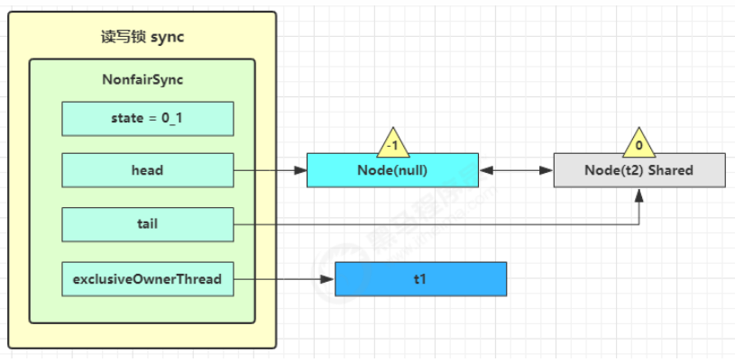

# 并发工具

## 线程池

### 自定义线程池

**阻塞队列（任务队列）：**

```java
@Slf4j(topic="c.BlockingQueue")
class BlockingQueue<T>{
    //1.任务队列
    private Deque<T> queue=new ArrayDeque<T>();
    //2.锁，防止一个任务被多个线程持有
    private ReentrantLock lock=new ReentrantLock();
    //3.生产者条件变量
    private Condition fullWaitSet=lock.newCondition();
    //4.消费者条件变量
    private Condition emptyWaitSet=lock.newCondition();
    //5.容量
    private int capacity;

    public BlockingQueue(int capacity){
        this.capacity=capacity;
    }

    //有超时时间的获取
    public T take(long timeout, TimeUnit unit){
        lock.lock();
        try{
            //将超时时间统一转换为纳秒
            long nanos = unit.toNanos(timeout);
            while(queue.isEmpty()){
                try {
                    if(nanos<=0){
                        return null;
                    }
                    //返回的是剩余时间
                    nanos = emptyWaitSet.awaitNanos(nanos);
                } catch (InterruptedException e) {
                    throw new RuntimeException(e);
                }
            }
            T t = queue.removeFirst();
            fullWaitSet.signal();
            return t;
        } finally {
            lock.unlock();
        }
    }


    //阻塞获取
    public T take(){
        lock.lock();
        try{
            while(queue.isEmpty()){
                try {
                    emptyWaitSet.await();
                } catch (InterruptedException e) {
                    throw new RuntimeException(e);
                }
            }
            T t = queue.removeFirst();
            fullWaitSet.signal();
            return t;
        } finally {
            lock.unlock();
        }
    }

    //阻塞添加
    public void put(T task){
        lock.lock();
        try{
            while(queue.size()==capacity){
                try {
                    log.debug("等待加入任务队列{}...",task);
                    fullWaitSet.await();
                } catch (InterruptedException e) {
                    throw new RuntimeException(e);
                }
            }
            log.debug("加入任务队列{}",task);
            queue.addLast(task);
            emptyWaitSet.signal();
        } finally {
            lock.unlock();
        }
    }

    //带超时时间添加
    public boolean put(T task, long timeout, TimeUnit unit){
        lock.lock();
        try{
            long nanos = unit.toNanos(timeout);
            while(queue.size()==capacity){
                try {
                    log.debug("等待加入任务队列{}...",task);
                    if(nanos<=0){
                        return false;
                    }
                    nanos=fullWaitSet.awaitNanos(nanos);
                } catch (InterruptedException e) {
                    throw new RuntimeException(e);
                }
            }
            log.debug("加入任务队列{}",task);
            queue.addLast(task);
            emptyWaitSet.signal();
            return true;
        } finally {
            lock.unlock();
        }
    }

    //获取大小
    public int size(){
        lock.lock();
        try{
            return queue.size();
        } finally {
            lock.unlock();
        }
    }

    //带拒绝策略的put
    public void tryPut(RejectPolicy<T> rejectPolicy,T task){
        lock.lock();
        try{
            //判断队列是否已满
            if(queue.size()==capacity){
                rejectPolicy.reject(this,task);
            } else{ //队列有空闲
                log.debug("加入任务队列{}",task);
                queue.addLast(task);
                emptyWaitSet.signal();
            }
        } finally {
            lock.unlock();
        }
    }
}
```


**自定义线程池：**

```java
@Slf4j(topic="c.ThreadPool")
class ThreadPool{
    //任务队列
    private BlockingQueue<Runnable> taskQueue;
    //线程集合
    private HashSet<Worker> workers=new HashSet<>();
    //核心线程数
    private int coreSize;
    //获取任务的超时时间
    private long timeout;
    private TimeUnit timeUnit;

    private RejectPolicy<Runnable> rejectPolicy;

    //执行任务
    public void execute(Runnable task){
        synchronized (workers){
            //当任务数没有超过核心线程数，直接交给worker对象执行
            if(workers.size()<coreSize){
                Worker worker = new Worker(task);
                log.debug("新增 worker{},{}",worker,task);
                workers.add(worker);
                worker.start();
            }
            //当任务数超过核心线程数，加入任务队列暂存
            else{
                //taskQueue.put(task);
                taskQueue.tryPut(rejectPolicy,task);
            }
        }
    }

    public ThreadPool(int coreSize, long timeout, TimeUnit timeUnit,int queueCapacity,RejectPolicy<Runnable> rejectPolicy){
        this.coreSize=coreSize;
        this.timeout=timeout;
        this.timeUnit=timeUnit;
        this.taskQueue=new BlockingQueue<>(queueCapacity);
        this.rejectPolicy=rejectPolicy;
    }

    class Worker extends Thread{
        private Runnable task;
        public Worker(Runnable task){
            this.task=task;
        }
        @Override
        public void run(){
            //执行任务
            //1)当task不为空，执行任务
            //2)当task执行完毕，再接着从任务队列获取任务并执行
            //这里的take也可以使用无参，二者表示不同策略
            while(task!=null||(task=taskQueue.take(timeout,timeUnit))!=null){
                try{
                    log.debug("正在执行..{}",task);
                    task.run();
                } catch (Exception e){

                } finally {
                    task=null;
                }
            }
            synchronized (workers){
                log.debug("worker被移除{}",this);
                workers.remove(this);
            }
        }

    }
}
```


**拒绝策略;**

```java
@FunctionalInterface
interface RejectPolicy<T>{
    void reject(BlockingQueue<T> queue,T task);
}
```


**测试：**

```java
@Slf4j(topic="c.TestPool")
public class TestPool {
    public static void main(String[] args) {
        ThreadPool threadPool = new ThreadPool(1,
                1000, TimeUnit.MILLISECONDS, 1,
                (queue,task)->{
            	//拒绝策略
            	//1.死等
            	//queue.put(task);
            	//2.带超时等待
            	//queue.put(task,500,TimeUnit.MILLISECONDS);
            	//3.放弃任务执行
            	//log.debug("放弃{}",task);
            	//4.抛出异常
            	//throw new RuntimeException("任务执行失败"+task);
            	//5.让调用者(这里是主线程)自己执行任务
            	task.run();
        		});
        for (int i = 0; i < 4; i++) {
            int j=i;
            threadPool.execute(()->{
                try {
                    Thread.sleep(1000L);
                } catch (InterruptedException e) {
                    throw new RuntimeException(e);
                }
                log.debug("{}",j);
            });
        }
    }
}
```


### ThreadPoolExecutor


**1)** **线程池状态**

ThreadPoolExecutor 使用 int 的高 3 位来表示线程池状态，低 29 位表示线程数量


从数字上比较，TERMINATED > TIDYING > STOP > SHUTDOWN > RUNNING（因为最高位是符号）

这些信息存储在一个原子变量 ctl 中，目的是将线程池状态与线程个数合二为一，这样就可以用一次 cas 原子操作进行赋值

```java
// c 为旧值， ctlOf 返回结果为新值
ctl.compareAndSet(c, ctlOf(targetState, workerCountOf(c))));

// rs 为高 3 位代表线程池状态， wc 为低 29 位代表线程个数，ctl 是合并它们
private static int ctlOf(int rs, int wc) { return rs | wc; }
```


**2)** **构造方法**

```java
public ThreadPoolExecutor(int corePoolSize,
 						int maximumPoolSize,
 						long keepAliveTime,
 						TimeUnit unit,
 						BlockingQueue<Runnable> workQueue,
 						ThreadFactory threadFactory,
 						RejectedExecutionHandler handler)
```

- corePoolSize 核心线程数目 (最多保留的线程数)

- maximumPoolSize 最大线程数目

- keepAliveTime 生存时间 - 针对救急线程(空闲最大时间)

- unit 时间单位 - 针对救急线程

- workQueue 阻塞队列

- threadFactory 线程工厂 - 可以为线程创建时起个好名字

- handler 拒绝策略


- 线程池中刚开始没有线程，当一个任务提交给线程池后，线程池会创建一个新线程来执行任务。

- 当线程数达到 corePoolSize 并没有线程空闲，这时再加入任务，新加的任务会被加入workQueue 队列排队，直到有空闲的线程。

- 如果队列选择了有界队列，那么任务超过了队列大小时，会创建 maximumPoolSize - corePoolSize 数目的线程来救急。

- 如果线程到达 maximumPoolSize 仍然有新任务这时会执行拒绝策略。拒绝策略 jdk 提供了 4 种实现，其它著名框架也提供了实现

  - AbortPolicy 让调用者抛出 RejectedExecutionException 异常，这是默认策略
  - CallerRunsPolicy 让调用者运行任务
  - DiscardPolicy 放弃本次任务
  - DiscardOldestPolicy 放弃队列中最早的任务，本任务取而代之

  

  - Dubbo 的实现，在抛出 RejectedExecutionException 异常之前会记录日志，并 dump 线程栈信息，方便定位问题
  - Netty 的实现，是创建一个新线程来执行任务
  - ActiveMQ 的实现，带超时等待（60s）尝试放入队列，类似我们之前自定义的拒绝策略
  - PinPoint 的实现，它使用了一个拒绝策略链，会逐一尝试策略链中每种拒绝策略

- 当高峰过去后，超过corePoolSize 的救急线程如果一段时间没有任务做，需要结束节省资源，这个时间由keepAliveTime 和 unit 来控制。


根据这个构造方法，JDK Executors 类中提供了众多工厂方法来创建各种用途的线程池


**3) newFixedThreadPool**

```java
public static ExecutorService newFixedThreadPool(int nThreads) {
	return new ThreadPoolExecutor(nThreads, nThreads,
								0L, TimeUnit.MILLISECONDS,
								new LinkedBlockingQueue<Runnable>());
}
```

特点

- 核心线程数 == 最大线程数（没有救急线程被创建），因此也无需超时时间

- 阻塞队列是无界的，可以放任意数量的任务

> **评价** 适用于任务量已知，相对耗时的任务


使用示例：

```java
@Slf4j(topic = "c.Test7")
public class Test7 {
    public static void main(String[] args) {
        ExecutorService pool= Executors.newFixedThreadPool(5,
                new ThreadFactory() {
                    private AtomicInteger t = new AtomicInteger(1);
                    @Override
                    public Thread newThread(Runnable r) {
                        return new Thread(r, "test" + t.getAndIncrement());
                    }
                });
        
        pool.execute(()->{
            log.debug("1");
        });
        pool.execute(()->{
            log.debug("2");
        });
        pool.execute(()->{
            log.debug("3");
        });
    }
}
```


**4) newCachedThreadPool**

```java
public static ExecutorService newCachedThreadPool() {
	return new ThreadPoolExecutor(0, Integer.MAX_VALUE,
								60L, TimeUnit.SECONDS,
								new SynchronousQueue<Runnable>());
}
```

特点

- 核心线程数是 0， 最大线程数是 Integer.MAX_VALUE，救急线程的空闲生存时间是 60s，意味着
  - 全部都是救急线程（60s 后可以回收）
  - 救急线程可以无限创建

- 队列采用了 SynchronousQueue 实现特点是，它没有容量，没有线程来取是放不进去的（一手交钱、一手交货）


测试：

```java
SynchronousQueue<Integer> integers = new SynchronousQueue<>();
new Thread(() -> {
    try {
        log.debug("putting {} ", 1);
        integers.put(1);
        log.debug("{} putted...", 1);
        log.debug("putting...{} ", 2);
        integers.put(2);
        log.debug("{} putted...", 2);
    } catch (InterruptedException e) {
        e.printStackTrace();
    }
},"t1").start();

sleep(1);

new Thread(() -> {
    try {
        log.debug("taking {}", 1);
        integers.take();
    } catch (InterruptedException e) {
        e.printStackTrace();
    }
},"t2").start();

sleep(1);

new Thread(() -> {
    try {
        log.debug("taking {}", 2);
        integers.take();
    } catch (InterruptedException e) {
        e.printStackTrace();
    }
},"t3").start();
```

输出

```
11:48:15.500 c.TestSynchronousQueue [t1] - putting 1 
11:48:16.500 c.TestSynchronousQueue [t2] - taking 1 
11:48:16.500 c.TestSynchronousQueue [t1] - 1 putted... 
11:48:16.500 c.TestSynchronousQueue [t1] - putting...2 
11:48:17.502 c.TestSynchronousQueue [t3] - taking 2 
11:48:17.503 c.TestSynchronousQueue [t1] - 2 putted...
```

> **评价** 整个线程池表现为线程数会根据任务量不断增长，没有上限，当任务执行完毕，空闲 1分钟后释放线程。 适合任务数比较密集，但每个任务执行时间较短的情况


**5) newSingleThreadExecutor**

```java
public static ExecutorService newSingleThreadExecutor() {
	return new FinalizableDelegatedExecutorService
		(new ThreadPoolExecutor(1, 1,
								0L, TimeUnit.MILLISECONDS,
								new LinkedBlockingQueue<Runnable>()));
}
```

使用场景：

希望多个任务排队执行。线程数固定为 1，任务数多于 1 时，会放入无界队列排队。任务执行完毕，这唯一的线程也不会被释放。


和自己创建单线程执行任务的区别：

- 自己创建一个单线程串行执行任务，如果任务执行失败而终止那么没有任何补救措施，而线程池还会新建一个线程，保证池的正常工作


newSingleThreadExecutor() 和newFixedThreadPool(1)的区别:

- Executors.newSingleThreadExecutor() 线程个数始终为1，不能修改
  - FinalizableDelegatedExecutorService 应用的是代理模式（保护代理），只对外暴露了 ExecutorService 接口，因此不能调用 ThreadPoolExecutor 中特有的方法（比如修改线程数）

- Executors.newFixedThreadPool(1) 初始时为1，以后还可以修改
  - 对外暴露的是 ThreadPoolExecutor 对象，可以强转后调用 setCorePoolSize 等方法进行修改


**6)** **提交任务**

```java
// 执行任务
void execute(Runnable command);
```


submit:

```
// 提交任务 task，用返回值 Future 获得任务执行结果
<T> Future<T> submit(Callable<T> task);
```

```java
 ExecutorService pool= Executors.newFixedThreadPool(2);
 Future<String> future=pool.submit(()->{
    log.debug("hello");
    Thread.sleep(1000);
    return "ok";
 });
 log.debug("{}",future.get());
```


invokeAll：

```java
// 提交 tasks 中所有任务
<T> List<Future<T>> invokeAll(Collection<? extends Callable<T>> tasks)
 			throws InterruptedException;
// 提交 tasks 中所有任务，带超时时间
<T> List<Future<T>> invokeAll(Collection<? extends Callable<T>> tasks,
 long timeout, TimeUnit unit) throws InterruptedException;
```


invokeAny:

```java
// 提交 tasks 中所有任务，哪个任务先成功执行完毕，返回此任务执行结果，其它任务取消
<T> T invokeAny(Collection<? extends Callable<T>> tasks)
 throws InterruptedException, ExecutionException;
 
 // 提交 tasks 中所有任务，哪个任务先成功执行完毕，返回此任务执行结果，其它任务取消，带超时时间
<T> T invokeAny(Collection<? extends Callable<T>> tasks,
 long timeout, TimeUnit unit) throws InterruptedException, ExecutionException, TimeoutException;
```


**7)** **关闭线程池**

shutdown:

```java
/*
线程池状态变为 SHUTDOWN
	- 不会接收新任务
	- 但已提交任务会执行完
	- 此方法不会阻塞调用线程的执行（比如主线程不会等待线程池中所有线程执行完毕）
*/
void shutdown();
```

```java
public void shutdown() {
    final ReentrantLock mainLock = this.mainLock;
    mainLock.lock();
    try {
        checkShutdownAccess();
        // 修改线程池状态
        advanceRunState(SHUTDOWN);
        // 仅会打断空闲线程
        interruptIdleWorkers();
        onShutdown(); // 扩展点 ScheduledThreadPoolExecutor
    } finally {
        mainLock.unlock();
    }
    // 尝试终结(没有运行的线程可以立刻终结)
    tryTerminate();
}
```


shutdownNow

```java
/*
线程池状态变为 STOP
- 不会接收新任务
- 会将队列中的任务返回
- 并用 interrupt 的方式中断正在执行的任务
*/
List<Runnable> shutdownNow();
```

```java
public List<Runnable> shutdownNow() {
    List<Runnable> tasks;
    final ReentrantLock mainLock = this.mainLock;
    mainLock.lock();
    try {
        checkShutdownAccess();
        // 修改线程池状态
        advanceRunState(STOP);
        // 打断所有线程
        interruptWorkers();
        // 获取队列中剩余任务
        tasks = drainQueue();
    } finally {
        mainLock.unlock();
    }
    // 尝试终结
    tryTerminate();
    return tasks;
}
```


**其他方法**

```java
// 不在 RUNNING 状态的线程池，此方法就返回 true
boolean isShutdown();

// 线程池状态是否是 TERMINATED
boolean isTerminated();

// 调用 shutdown 后，由于调用线程并不会等待所有任务运行结束，因此如果它想在线程池 TERMINATED 后做些事情，可以利用此方法等待
boolean awaitTermination(long timeout, TimeUnit unit) throws InterruptedException;
```


**8)** **任务调度线程池**

在『任务调度线程池』功能加入之前，可以使用 java.util.Timer 来实现定时功能，Timer 的优点在于简单易用，但由于所有任务都是由同一个线程来调度，因此所有任务都是串行执行的，同一时间只能有一个任务在执行，前一个任务的延迟或异常都将会影响到之后的任务。

```java
public static void main(String[] args) {
    Timer timer = new Timer();
    TimerTask task1 = new TimerTask() {
        @Override
        public void run() {
            log.debug("task 1");
            sleep(2);
        }
    };

    TimerTask task2 = new TimerTask() {
        @Override
        public void run() {
            log.debug("task 2");
        }
    };
    // 使用 timer 添加两个任务，希望它们都在 1s 后执行
    // 但由于 timer 内只有一个线程来顺序执行队列中的任务，因此『任务1』的延时，影响了【任务2】的执行
    timer.schedule(task1, 1000);
    timer.schedule(task2, 1000);
}
```

输出

```
20:46:09.444 c.TestTimer [main] - start... 
20:46:10.447 c.TestTimer [Timer-0] - task 1 
20:46:12.448 c.TestTimer [Timer-0] - task 2
```

并且如果任务一出现了异常，任务二也不会执行

使用 ScheduledExecutorService 改写：

```java
ScheduledExecutorService executor = Executors.newScheduledThreadPool(2);
// 添加两个任务，希望它们都在 1s 后执行
executor.schedule(() -> {
 	System.out.println("任务1，执行时间：" + new Date());
 	try { Thread.sleep(2000); } catch (InterruptedException e) { }
}, 1000, TimeUnit.MILLISECONDS);
executor.schedule(() -> {
 	System.out.println("任务2，执行时间：" + new Date());
}, 1000, TimeUnit.MILLISECONDS);
```

输出

```
任务1，执行时间：Thu Jan 03 12:45:17 CST 2019 
任务2，执行时间：Thu Jan 03 12:45:17 CST 2019
```

有异常不会报错，即使只设置了一个线程，再出现异常时也能将所有任务执行完毕


scheduleAtFixedRate 例子：

```java
ScheduledExecutorService pool = Executors.newScheduledThreadPool(1);
log.debug("start...");
pool.scheduleAtFixedRate(() -> {
    log.debug("running...");
}, 1, 1, TimeUnit.SECONDS);
```

输出

```
21:45:43.167 c.TestTimer [main] - start... 
21:45:44.215 c.TestTimer [pool-1-thread-1] - running... 
21:45:45.215 c.TestTimer [pool-1-thread-1] - running... 
21:45:46.215 c.TestTimer [pool-1-thread-1] - running... 
21:45:47.215 c.TestTimer [pool-1-thread-1] - running...
```

scheduleAtFixedRate 例子（任务执行时间超过了间隔时间）：

```java
ScheduledExecutorService pool = Executors.newScheduledThreadPool(1);
log.debug("start...");
pool.scheduleAtFixedRate(() -> {
    log.debug("running...");
    sleep(2);
}, 1, 1, TimeUnit.SECONDS);
```

输出分析：一开始，延时 1s，接下来，由于任务执行时间 > 间隔时间，间隔被『撑』到了 2s

```java
21:44:30.311 c.TestTimer [main] - start... 
21:44:31.360 c.TestTimer [pool-1-thread-1] - running... 
21:44:33.361 c.TestTimer [pool-1-thread-1] - running... 
21:44:35.362 c.TestTimer [pool-1-thread-1] - running... 
21:44:37.362 c.TestTimer [pool-1-thread-1] - running...
```

scheduleWithFixedDelay 例子：

```java
ScheduledExecutorService pool = Executors.newScheduledThreadPool(1);
log.debug("start...");
pool.scheduleWithFixedDelay(()-> {
    log.debug("running...");
    sleep(2);
}, 1, 1, TimeUnit.SECONDS);
```

输出分析：一开始，延时 1s，scheduleWithFixedDelay 的间隔是 上一个任务结束 <-> 延时 <-> 下一个任务开始 所以间隔都是 3s

```
21:40:55.078 c.TestTimer [main] - start... 
21:40:56.140 c.TestTimer [pool-1-thread-1] - running... 
21:40:59.143 c.TestTimer [pool-1-thread-1] - running... 
21:41:02.145 c.TestTimer [pool-1-thread-1] - running... 
21:41:05.147 c.TestTimer [pool-1-thread-1] - running...
```

> **评价** 整个线程池表现为：线程数固定，任务数多于线程数时，会放入无界队列排队。任务执行完毕，这些线程也不会被释放。用来执行延迟或反复执行的任务


**9)正确处理 执行任务异常**

方法1：主动捉异常

```java
ExecutorService pool = Executors.newFixedThreadPool(1);
pool.submit(() -> {
    try {
        log.debug("task1");
        int i = 1 / 0;
    } catch (Exception e) {
        log.error("error:", e);
    }
});
```

输出

```
21:59:04.558 c.TestTimer [pool-1-thread-1] - task1 
21:59:04.562 c.TestTimer [pool-1-thread-1] - error: 
java.lang.ArithmeticException: / by zero 
 at cn.itcast.n8.TestTimer.lambda$main$0(TestTimer.java:28) 
 at java.util.concurrent.Executors$RunnableAdapter.call(Executors.java:511) 
 at java.util.concurrent.FutureTask.run(FutureTask.java:266) 
 at java.util.concurrent.ThreadPoolExecutor.runWorker(ThreadPoolExecutor.java:1149) 
 at java.util.concurrent.ThreadPoolExecutor$Worker.run(ThreadPoolExecutor.java:624) 
 at java.lang.Thread.run(Thread.java:748)
```


方法2：使用 Future

```java
ExecutorService pool = Executors.newFixedThreadPool(1);
Future<Boolean> f = pool.submit(() -> {
    log.debug("task1");
    int i = 1 / 0;
    return true;
});
log.debug("result:{}", f.get());
```

输出

```
21:54:58.208 c.TestTimer [pool-1-thread-1] - task1 
Exception in thread "main" java.util.concurrent.ExecutionException: 
java.lang.ArithmeticException: / by zero 
 at java.util.concurrent.FutureTask.report(FutureTask.java:122) 
 at java.util.concurrent.FutureTask.get(FutureTask.java:192) 
 at cn.itcast.n8.TestTimer.main(TestTimer.java:31) 
Caused by: java.lang.ArithmeticException: / by zero 
 at cn.itcast.n8.TestTimer.lambda$main$0(TestTimer.java:28) 
 at java.util.concurrent.FutureTask.run(FutureTask.java:266) 
 at java.util.concurrent.ThreadPoolExecutor.runWorker(ThreadPoolExecutor.java:1149) 
 at java.util.concurrent.ThreadPoolExecutor$Worker.run(ThreadPoolExecutor.java:624) 
 at java.lang.Thread.run(Thread.java:748)
```


**10)任务调度线程池应用**

如何让每周四 18:00:00 定时执行任务？

```java
// 获得当前时间
LocalDateTime now = LocalDateTime.now();
// 获取本周四 18:00:00.000
LocalDateTime thursday =  now.with(DayOfWeek.THURSDAY).withHour(18).withMinute(0).withSecond(0).withNano(0);
// 如果当前时间已经超过 本周四 18:00:00.000， 那么找下周四 18:00:00.000
if(now.compareTo(thursday) >= 0) {
    thursday = thursday.plusWeeks(1);
}
// 计算时间差，即延时执行时间
long initialDelay = Duration.between(now, thursday).toMillis();
// 计算间隔时间，即 1 周的毫秒值
long oneWeek = 7 * 24 * 3600 * 1000;
ScheduledExecutorService executor = Executors.newScheduledThreadPool(2);
System.out.println("开始时间：" + new Date());
executor.scheduleAtFixedRate(() -> {
    System.out.println("执行时间：" + new Date());
}, initialDelay, oneWeek, TimeUnit.MILLISECONDS);
```


**11)tomcat线程池**


- LimitLatch 用来限流，可以控制最大连接个数，类似 J.U.C 中的 Semaphore 后面再讲

- Acceptor 只负责【接收新的 socket 连接】

- Poller 只负责监听 socket channel 是否有【可读的 I/O 事件】

- 一旦可读，封装一个任务对象（socketProcessor），提交给 Executor 线程池处理

- Executor 线程池中的工作线程最终负责【处理请求】


Tomcat 线程池扩展了 ThreadPoolExecutor，行为稍有不同

- 如果总线程数达到 maximumPoolSize
  - 这时不会立刻抛 RejectedExecutionException 异常

  - 而是再次尝试将任务放入队列，如果还失败，才抛出 RejectedExecutionException 异常

源码 tomcat-7.0.42

```java
public void execute(Runnable command, long timeout, TimeUnit unit) {
    submittedCount.incrementAndGet();
    try {
        super.execute(command);
    } catch (RejectedExecutionException rx) {
        if (super.getQueue() instanceof TaskQueue) {
            final TaskQueue queue = (TaskQueue)super.getQueue();
            try {
                if (!queue.force(command, timeout, unit)) {
                    submittedCount.decrementAndGet();
                    throw new RejectedExecutionException("Queue capacity is full.");
                }
            } catch (InterruptedException x) {
                submittedCount.decrementAndGet();
                Thread.interrupted();
                throw new RejectedExecutionException(x);
            }
        } else {
            submittedCount.decrementAndGet();
            throw rx;
        }
    }
}
```

TaskQueue.java

```java
public boolean force(Runnable o, long timeout, TimeUnit unit) throws InterruptedException {
    if ( parent.isShutdown() ) 
        throw new RejectedExecutionException(
        "Executor not running, can't force a command into the queue"
    );
    return super.offer(o,timeout,unit); //forces the item onto the queue, to be used if the task is rejected
}
```


**Connector 配置**


**Executor 配置**


此图的下半部分是tomcat对于线程池机制做出的改进。


### 异步模式之工作线程

#### 定义

让有限的工作线程（Worker Thread）来轮流异步处理无限多的任务。也可以将其归类为分工模式，它的典型实现就是线程池，也体现了经典设计模式中的享元模式。

注意，不同任务类型应该使用不同的线程池，这样能够避免饥饿，并能提升效率


#### 饥饿

固定大小线程池会有饥饿现象

举例：

```java
public class TestDeadLock {
    static final List<String> MENU = Arrays.asList("地三鲜", "宫保鸡丁", "辣子鸡丁", "烤鸡翅");
    static Random RANDOM = new Random();
    static String cooking() {
        return MENU.get(RANDOM.nextInt(MENU.size()));
    }

    public static void main(String[] args) {
        ExecutorService executorService = Executors.newFixedThreadPool(2);
        executorService.execute(() -> {
            log.debug("处理点餐...");
            Future<String> f = executorService.submit(() -> {
                log.debug("做菜");
                return cooking();
            });
            try {
                log.debug("上菜: {}", f.get());
            } catch (InterruptedException | ExecutionException e) {
                e.printStackTrace();
            }
        });

        /*executorService.execute(() -> {
            log.debug("处理点餐...");
            Future<String> f = executorService.submit(() -> {
                log.debug("做菜");
                return cooking();
            });
            try {
                log.debug("上菜: {}", f.get());
            } catch (InterruptedException | ExecutionException e) {
                e.printStackTrace();
            }
        });*/
    }
}
```

输出

```
17:21:27.883 c.TestDeadLock [pool-1-thread-1] - 处理点餐...
17:21:27.891 c.TestDeadLock [pool-1-thread-2] - 做菜
17:21:27.891 c.TestDeadLock [pool-1-thread-1] - 上菜: 烤鸡翅
```

当注释取消后，可能的输出

```
17:08:41.339 c.TestDeadLock [pool-1-thread-2] - 处理点餐... 
17:08:41.339 c.TestDeadLock [pool-1-thread-1] - 处理点餐..
```

解决方法可以增加线程池的大小，不过不是根本解决方案，还是前面提到的，不同的任务类型，采用不同的线程池，例如：

```java
public class TestDeadLock {
    static final List<String> MENU = Arrays.asList("地三鲜", "宫保鸡丁", "辣子鸡丁", "烤鸡翅");
    static Random RANDOM = new Random();
    static String cooking() {
        return MENU.get(RANDOM.nextInt(MENU.size()));
    }

    public static void main(String[] args) {
        ExecutorService waiterPool = Executors.newFixedThreadPool(1);
        ExecutorService cookPool = Executors.newFixedThreadPool(1);
        waiterPool.execute(() -> {
            log.debug("处理点餐...");
            Future<String> f = cookPool.submit(() -> {
                log.debug("做菜");
                return cooking();
            });
            try {
                log.debug("上菜: {}", f.get());
            } catch (InterruptedException | ExecutionException e) {
                e.printStackTrace();
            }
        });
        waiterPool.execute(() -> {
            log.debug("处理点餐...");
            Future<String> f = cookPool.submit(() -> {
                log.debug("做菜");
                return cooking();
            });
            try {
                log.debug("上菜: {}", f.get());
            } catch (InterruptedException | ExecutionException e) {
                e.printStackTrace();
            }
        });
    }
}
```

输出

```
17:25:14.626 c.TestDeadLock [pool-1-thread-1] - 处理点餐... 
17:25:14.630 c.TestDeadLock [pool-2-thread-1] - 做菜
17:25:14.631 c.TestDeadLock [pool-1-thread-1] - 上菜: 地三鲜
17:25:14.632 c.TestDeadLock [pool-1-thread-1] - 处理点餐... 
17:25:14.632 c.TestDeadLock [pool-2-thread-1] - 做菜
17:25:14.632 c.TestDeadLock [pool-1-thread-1] - 上菜: 辣子鸡丁
```


#### 创建多少线程池合适

1.最大并行数：（与CPU的型号有关）
以四核八线程为例：
四核：能同时做四件事情
但是因为超线程技术，原本的四核虚拟成八个
所以最大并行数为8

2.如果一个项目是计算任务比较多，就是CPU密集型运算，
如果一个项目是读取本地文件操作或读取数据库操作比较多，就是I/O密集型运算。
目前较多的是I/O密集型运算

3.


可以用thread dump来计算CPU的计算时间和等待时间


### Fork/Join线程池

**1)** **概念**

Fork/Join 是 JDK 1.7 加入的新的线程池实现，它体现的是一种分治思想，适用于能够进行任务拆分的 cpu 密集型运算

所谓的任务拆分，是将一个大任务拆分为算法上相同的小任务，直至不能拆分可以直接求解。跟递归相关的一些计算，如归并排序、斐波那契数列、都可以用分治思想进行求解

Fork/Join 在分治的基础上加入了多线程，可以把每个任务的分解和合并交给不同的线程来完成，进一步提升了运算效率

Fork/Join 默认会创建与 cpu 核心数大小相同的线程池


**2)** **使用**

提交给 Fork/Join 线程池的任务需要继承 RecursiveTask（有返回值）或 RecursiveAction（没有返回值），例如下面定义了一个对 1~n 之间的整数求和的任务

```java
@Slf4j(topic = "c.AddTask")
class AddTask1 extends RecursiveTask<Integer> {
    int n;

    public AddTask1(int n) {
        this.n = n;
    }


    @Override
    public String toString() {
        return "{" + n + '}';
    }
    @Override
    protected Integer compute() {
        // 如果 n 已经为 1，可以求得结果了
        if (n == 1) {
            log.debug("join() {}", n);
            return n;
        }

        // 将任务进行拆分(fork)
        AddTask1 t1 = new AddTask1(n - 1);
        t1.fork();
        log.debug("fork() {} + {}", n, t1);

        // 合并(join)结果
        int result = n + t1.join();
        log.debug("join() {} + {} = {}", n, t1, result);
        return result;
    }
}
```

然后提交给 ForkJoinPool 来执行

```java
public static void main(String[] args) {
 	ForkJoinPool pool = new ForkJoinPool(4);
 	System.out.println(pool.invoke(new AddTask1(5)));
}
```

结果

```
[ForkJoinPool-1-worker-0] - fork() 2 + {1} 
[ForkJoinPool-1-worker-1] - fork() 5 + {4} 
[ForkJoinPool-1-worker-0] - join() 1 
[ForkJoinPool-1-worker-0] - join() 2 + {1} = 3 
[ForkJoinPool-1-worker-2] - fork() 4 + {3} 
[ForkJoinPool-1-worker-3] - fork() 3 + {2} 
[ForkJoinPool-1-worker-3] - join() 3 + {2} = 6 
[ForkJoinPool-1-worker-2] - join() 4 + {3} = 10 
[ForkJoinPool-1-worker-1] - join() 5 + {4} = 15 
15
```

用图来表示


**改进(类似二分的思想去拆分任务)**

```java
class AddTask3 extends RecursiveTask<Integer> {

    int begin;
    int end;
    public AddTask3(int begin, int end) {
        this.begin = begin;
        this.end = end;
    }

    @Override
    public String toString() {
        return "{" + begin + "," + end + '}';
    }
    @Override
    protected Integer compute() {
        //两个终止条件
        if (begin == end) {
            log.debug("join() {}", begin);
            return begin;
        }
        if (end - begin == 1) {
            log.debug("join() {} + {} = {}", begin, end, end + begin);
            return end + begin;
        }

        // 1 5
        int mid = (end + begin) / 2; // 3
        AddTask3 t1 = new AddTask3(begin, mid); // 1,3
        t1.fork();
        AddTask3 t2 = new AddTask3(mid + 1, end); // 4,5
        t2.fork();
        log.debug("fork() {} + {} = ?", t1, t2);
        int result = t1.join() + t2.join();
        log.debug("join() {} + {} = {}", t1, t2, result);
        return result;
    }
}
```

然后提交给 ForkJoinPool 来执行

```java
public static void main(String[] args) {
    ForkJoinPool pool = new ForkJoinPool(4);
    System.out.println(pool.invoke(new AddTask3(1, 5)));
}
```

结果

```
[ForkJoinPool-1-worker-0] - join() 1 + 2 = 3 
[ForkJoinPool-1-worker-3] - join() 4 + 5 = 9 
[ForkJoinPool-1-worker-0] - join() 3 
[ForkJoinPool-1-worker-1] - fork() {1,3} + {4,5} = ? 
[ForkJoinPool-1-worker-2] - fork() {1,2} + {3,3} = ? 
[ForkJoinPool-1-worker-2] - join() {1,2} + {3,3} = 6 
[ForkJoinPool-1-worker-1] - join() {1,3} + {4,5} = 15 
15
```

用图来表示


## JUC

### aqs原理


全称是 AbstractQueuedSynchronizer，是阻塞式锁和相关的同步器工具的框架(公共基础部分的抽象实现)，主要用于解决锁分配给谁的问题

整体就是一个抽象的FIFO队列来完成资源获取线程的排队工作，并通过一个valotile的int类型变量(state)表示持有锁的状态(同步状态)。


#### 特点

- 用 state 属性来表示资源的状态（分独占模式和共享模式），子类需要定义如何维护这个状态，控制如何获取锁和释放锁
  - getState - 获取 state 状态
  - setState - 设置 state 状态

  - compareAndSetState - cas 机制设置 state 状态

  - 独占模式是只有一个线程能够访问资源，而共享模式可以允许多个线程访问资源

- 提供了基于 FIFO 的等待队列，类似于 Monitor 的 EntryList

- 条件变量来实现等待、唤醒机制，支持多个条件变量，类似于 Monitor 的 WaitSet


子类主要实现这样一些方法（默认抛出 UnsupportedOperationException）

- tryAcquire

- tryRelease

- tryAcquireShared

- tryReleaseShared

- isHeldExclusively


#### 锁和同步器的关系

锁：

面向使用者，定义了程序员和锁交互的使用层API，隐藏了实现细节，调用即可。


同步器：
面向锁的实现者。

是根据统一规范简化了锁的实现，将其抽象出来对外屏蔽了同步状态管理、同步队列的管理和维护、阻塞线程排队和通知、唤醒机制等，是一切锁和同步组件实现的**公共基础部分**。


#### 能干嘛

有阻塞就需要排队，实现排队必然需要队列

如果共享资源被占用，**就需要一定的阻塞等待唤醒机制来保证锁的分配**。这个机制主要用的是CLH队列的变体实现的，将暂时获取不到锁的线程加入到队列中，这个队列就是**AQS**同步队列的抽象表现。他将要请求共享资源的线程以及自身的等待状态封装成队列的节点对象（**Node**），通过**CAS**、自旋以及**LockSupport.park()**方式，维护**state**变量的状态，使并发达到同步的效果。


AQS使用一个valotile的int类型变量(state)表示持有锁的状态(同步状态)，通过内置的FIFO队列来完成资源获取的排队工作，将每条要去抢占资源的线程封装成一个Node节点来实现锁的分配，通过CAS完成对State值的修改。


#### State和CLH队列

state为0表示空闲，大于0表示被占用

CLH是一个双向队列


#### Node

```java
    abstract static class Node {
        volatile Node prev;       // initially attached via casTail
        volatile Node next;       // visibly nonnull when signallable
        Thread waiter;            // visibly nonnull when enqueued
        volatile int status;      // written by owner, atomic bit ops by others

        // methods for atomic operations
        final boolean casPrev(Node c, Node v) {  // for cleanQueue
            return U.weakCompareAndSetReference(this, PREV, c, v);
        }
        final boolean casNext(Node c, Node v) {  // for cleanQueue
            return U.weakCompareAndSetReference(this, NEXT, c, v);
        }
        final int getAndUnsetStatus(int v) {     // for signalling
            return U.getAndBitwiseAndInt(this, STATUS, ~v);
        }
        final void setPrevRelaxed(Node p) {      // for off-queue assignment
            U.putReference(this, PREV, p);
        }
        final void setStatusRelaxed(int s) {     // for off-queue assignment
            U.putInt(this, STATUS, s);
        }
        final void clearStatus() {               // for reducing unneeded signals
            U.putIntOpaque(this, STATUS, 0);
        }

        private static final long STATUS
            = U.objectFieldOffset(Node.class, "status");
        private static final long NEXT
            = U.objectFieldOffset(Node.class, "next");
        private static final long PREV
            = U.objectFieldOffset(Node.class, "prev");
    }
```

status用于表示线程等待锁的情况，有如下几种情况:

- CANCELLED (1)：值为1，表示该节点由于超时或中断等原因已经被取消。一旦一个节点的状态变为CANCELLED，它就不会再改变，并且会被从队列中移除。
- SIGNAL (-1)：值为-1，表示当前节点的后继节点需要被唤醒。即当当前节点释放锁或者取消时，它应该唤醒它的后继节点以允许其继续执行。
- CONDITION (-2)：值为-2，表示该节点处于条件队列中，等待某个条件满足。这种状态下，节点不会参与同步队列的竞争直到相应的条件得到满足并调用Condition.signal()方法。
- PROPAGATE (-3)：值为-3，在共享模式下使用，表示下一个获取应该无条件传播下去。这是为了处理某些特殊情况下共享锁的连续获取问题。
- 0：默认状态，表示没有任何特殊标记。通常用于初始化一个新的节点。


#### 原理

以下面的ReentrantLock为例

### ReentrantLock


#### 非公平锁实现原理

**加锁解锁流程**

先从构造器开始看，默认为非公平锁实现

```java
public ReentrantLock() {
    sync = new NonfairSync();
}
```

NonfairSync 继承自 AQS

没有竞争时


第一个竞争出现时


Thread-1 执行了

1. CAS 尝试将 state 由 0 改为 1，结果失败

2. 进入 tryAcquire 逻辑，这时 state 已经是1，结果仍然失败

3. 接下来进入 addWaiter 逻辑，构造 Node 队列
   - 图中黄色三角表示该 Node 的 waitStatus 状态，其中 0 为默认正常状态
   - Node 的创建是懒惰的
   - 其中第一个 Node 称为 Dummy（哑元）或哨兵，用来占位，并不关联线程


当前线程进入 acquireQueued 逻辑

1. acquireQueued 会在一个死循环中不断尝试获得锁，失败后进入 park 阻塞

2. 如果自己是紧邻着 head（排第二位），那么再次 tryAcquire 尝试获取锁，当然这时 state 仍为 1，失败

3. 进入 shouldParkAfterFailedAcquire 逻辑，将前驱 node，即 head 的 waitStatus 改为 -1，这次返回 false


4. shouldParkAfterFailedAcquire 执行完毕回到 acquireQueued ，再次 tryAcquire 尝试获取锁，当然这时state 仍为 1，失败

5. 当再次进入 shouldParkAfterFailedAcquire 时，这时因为其前驱 node 的 waitStatus 已经是 -1，这次返回true

6. 进入 parkAndCheckInterrupt， Thread-1 park（灰色表示）


再次有多个线程经历上述过程竞争失败，变成这个样子


Thread-0 释放锁，进入 tryRelease 流程，如果成功

- 设置 exclusiveOwnerThread 为 null

- state = 0


当前队列不为 null，并且 head 的 waitStatus = -1，进入 unparkSuccessor 流程

找到队列中离 head 最近的一个 Node（没取消的），unpark 恢复其运行，本例中即为 Thread-1

回到 Thread-1 的 acquireQueued 流程


如果加锁成功（没有竞争），会设置

- exclusiveOwnerThread 为 Thread-1，state = 1

- head 指向刚刚 Thread-1 所在的 Node，该 Node 清空 Thread

- 原本的 head 因为从链表断开，而可被垃圾回收

如果这时候有其它线程来竞争（非公平的体现），例如这时有 Thread-4 来了


如果不巧又被 Thread-4 占了先

- Thread-4 被设置为 exclusiveOwnerThread，state = 1

- Thread-1 再次进入 acquireQueued 流程，获取锁失败，重新进入 park 阻塞


**加锁源码**

```java
// Sync 继承自 AQS
static final class NonfairSync extends Sync {
    private static final long serialVersionUID = 7316153563782823691L;

    // 加锁实现
    final void lock() {
        // 首先用 cas 尝试（仅尝试一次）将 state 从 0 改为 1, 如果成功表示获得了独占锁
        if (compareAndSetState(0, 1))
            setExclusiveOwnerThread(Thread.currentThread());
        else
            // 如果尝试失败，进入 ㈠
            acquire(1);
    }

    // ㈠ AQS 继承过来的方法, 方便阅读, 放在此处
    public final void acquire(int arg) {
        // ㈡ tryAcquire 
        if (
            !tryAcquire(arg) &&
            // 当 tryAcquire 返回为 false 时, 先调用 addWaiter ㈣, 接着 acquireQueued ㈤
            acquireQueued(addWaiter(Node.EXCLUSIVE), arg)
        ) {
            selfInterrupt();
        }
    }

    // ㈡ 进入 ㈢
    protected final boolean tryAcquire(int acquires) {
        return nonfairTryAcquire(acquires);
    }

    // ㈢ Sync 继承过来的方法, 方便阅读, 放在此处
    final boolean nonfairTryAcquire(int acquires) {
        final Thread current = Thread.currentThread();
        int c = getState();
        // 如果还没有获得锁
        if (c == 0) {
            // 尝试用 cas 获得, 这里体现了非公平性: 不去检查 AQS 队列
            if (compareAndSetState(0, acquires)) {
                setExclusiveOwnerThread(current);
                return true;
            }
        }
        // 如果已经获得了锁, 线程还是当前线程, 表示发生了锁重入
        else if (current == getExclusiveOwnerThread()) {
            // state++
            int nextc = c + acquires;
            if (nextc < 0) // overflow
                throw new Error("Maximum lock count exceeded");
            setState(nextc);
            return true;
        }
        // 获取失败, 回到调用处
        return false;
    }

    // ㈣ AQS 继承过来的方法, 方便阅读, 放在此处
    private Node addWaiter(Node mode) {

        // 将当前线程关联到一个 Node 对象上, 模式为独占模式
        Node node = new Node(Thread.currentThread(), mode);
        // 如果 tail 不为 null, cas 尝试将 Node 对象加入 AQS 队列尾部
        Node pred = tail;
        if (pred != null) {
            node.prev = pred;
            if (compareAndSetTail(pred, node)) {
                // 双向链表
                pred.next = node;
                return node;
            }
        }
        // 尝试将 Node 加入 AQS, 进入 ㈥
        enq(node);
        return node;
    }

    // ㈥ AQS 继承过来的方法, 方便阅读, 放在此处
    private Node enq(final Node node) {
        for (;;) {
            Node t = tail;
            if (t == null) {
                // 还没有, 设置 head 为哨兵节点（不对应线程，状态为 0）
                if (compareAndSetHead(new Node())) {
                    tail = head;
                }
            } else {
                // cas 尝试将 Node 对象加入 AQS 队列尾部
                node.prev = t;
                if (compareAndSetTail(t, node)) {
                    t.next = node;
                    return t;
                }
            }
        }
    }

    // ㈤ AQS 继承过来的方法, 方便阅读, 放在此处
    final boolean acquireQueued(final Node node, int arg) {
        boolean failed = true;
        try {
            boolean interrupted = false;
            for (;;) {
                final Node p = node.predecessor();
                // 上一个节点是 head, 表示轮到自己（当前线程对应的 node）了, 尝试获取
                if (p == head && tryAcquire(arg)) {
                    // 获取成功, 设置自己（当前线程对应的 node）为 head
                    setHead(node);
                    // 上一个节点 help GC
                    p.next = null;
                    failed = false;
                    // 返回中断标记 false
                    return interrupted;
                }
                if (
                    // 判断是否应当 park, 进入 ㈦
                    shouldParkAfterFailedAcquire(p, node) &&
                    // park 等待, 此时 Node 的状态被置为 Node.SIGNAL ㈧
                    parkAndCheckInterrupt()
                ) {
                    interrupted = true;
                }
            }
        } finally {
            if (failed)
                cancelAcquire(node);
        }
    }

    // ㈦ AQS 继承过来的方法, 方便阅读, 放在此处
    private static boolean shouldParkAfterFailedAcquire(Node pred, Node node) {
        // 获取上一个节点的状态
        int ws = pred.waitStatus;
        if (ws == Node.SIGNAL) {
            // 上一个节点都在阻塞, 那么自己也阻塞好了
            return true;
        }
        // > 0 表示取消状态
        if (ws > 0) {
            // 上一个节点取消, 那么重构删除前面所有取消的节点, 返回到外层循环重试
            do {
                node.prev = pred = pred.prev;
            } while (pred.waitStatus > 0);
            pred.next = node;
        } else {
            // 这次还没有阻塞
            // 但下次如果重试不成功, 则需要阻塞，这时需要设置上一个节点状态为 Node.SIGNAL
            compareAndSetWaitStatus(pred, ws, Node.SIGNAL);
        }
        return false;
    }

    // ㈧ 阻塞当前线程
    private final boolean parkAndCheckInterrupt() {
        LockSupport.park(this);
        return Thread.interrupted();
    }
}
```

> **注意**
>
> - 是否需要 unpark 是由当前节点的前驱节点的 waitStatus == Node.SIGNAL 来决定，而不是本节点的waitStatus 决定


**解锁源码**

```java
// Sync 继承自 AQS
static final class NonfairSync extends Sync {
    // 解锁实现
    public void unlock() {
        sync.release(1);
    }

    // AQS 继承过来的方法, 方便阅读, 放在此处
    public final boolean release(int arg) {
        // 尝试释放锁, 进入 ㈠
        if (tryRelease(arg)) {
            // 队列头节点 unpark
            Node h = head; 
            if (
                // 队列不为 null
                h != null &&
                // waitStatus == Node.SIGNAL 才需要 unpark
                h.waitStatus != 0
            ) {
                // unpark AQS 中等待的线程, 进入 ㈡
                unparkSuccessor(h);
            }
            return true;
        }
        return false;
    }

    // ㈠ Sync 继承过来的方法, 方便阅读, 放在此处
    protected final boolean tryRelease(int releases) {
        // state--
        int c = getState() - releases;
        if (Thread.currentThread() != getExclusiveOwnerThread())
            throw new IllegalMonitorStateException();
        boolean free = false;
        // 支持锁重入, 只有 state 减为 0, 才释放成功
        if (c == 0) {
            free = true;
            setExclusiveOwnerThread(null);
        }
        setState(c);
        return free;
    }

    // ㈡ AQS 继承过来的方法, 方便阅读, 放在此处
    private void unparkSuccessor(Node node) {
        // 如果状态为 Node.SIGNAL 尝试重置状态为 0
        // 不成功也可以
        int ws = node.waitStatus;
        if (ws < 0) {
            compareAndSetWaitStatus(node, ws, 0);
        }
        // 找到需要 unpark 的节点, 但本节点从 AQS 队列中脱离, 是由唤醒节点完成的
        Node s = node.next;
        // 不考虑已取消的节点, 从 AQS 队列从后至前找到队列最前面需要 unpark 的节点
        if (s == null || s.waitStatus > 0) {
            s = null;
            for (Node t = tail; t != null && t != node; t = t.prev)
                if (t.waitStatus <= 0)
                    s = t;
        }
        if (s != null)
            LockSupport.unpark(s.thread);
    }
}
```


#### 可重入原理

```java
static final class NonfairSync extends Sync {
    // ...

    // Sync 继承过来的方法, 方便阅读, 放在此处
    final boolean nonfairTryAcquire(int acquires) {
        final Thread current = Thread.currentThread();
        int c = getState();
        if (c == 0) {
            if (compareAndSetState(0, acquires)) {
                setExclusiveOwnerThread(current);
                return true;
            }
        }
        // 如果已经获得了锁, 线程还是当前线程, 表示发生了锁重入
        else if (current == getExclusiveOwnerThread()) {
            // state++
            int nextc = c + acquires;
            if (nextc < 0) // overflow
                throw new Error("Maximum lock count exceeded");
            setState(nextc);
            return true;
        }
        return false;
    }

    // Sync 继承过来的方法, 方便阅读, 放在此处
    protected final boolean tryRelease(int releases) {
        // state-- 
        int c = getState() - releases;
        if (Thread.currentThread() != getExclusiveOwnerThread())
            throw new IllegalMonitorStateException();
        boolean free = false;
        // 支持锁重入, 只有 state 减为 0, 才释放成功
        if (c == 0) {
            free = true;
            setExclusiveOwnerThread(null);
        }
        setState(c);
        return free;
    }
}
```


#### 可打断原理

**不可打断模式**

在此模式下，即使它被打断，仍会驻留在 AQS 队列中，一直要等到获得锁后方能得知自己被打断了

```java
// Sync 继承自 AQS
static final class NonfairSync extends Sync {
    // ...

    private final boolean parkAndCheckInterrupt() {
        // 如果打断标记已经是 true, 则 park 会失效
        LockSupport.park(this);
        // interrupted 会清除打断标记
        return Thread.interrupted();
    }

    final boolean acquireQueued(final Node node, int arg) {
        boolean failed = true;
        try {
            boolean interrupted = false;
            for (;;) {
                final Node p = node.predecessor();
                if (p == head && tryAcquire(arg)) {
                    setHead(node);
                    p.next = null;
                    failed = false;
                    // 还是需要获得锁后, 才能返回打断状态
                    return interrupted;
                }
                if (
                    shouldParkAfterFailedAcquire(p, node) &&
                    parkAndCheckInterrupt()
                ) {
                    // 如果是因为 interrupt 被唤醒, 返回打断状态为 true
                    interrupted = true;
                }
            }
        } finally {
            if (failed)
                cancelAcquire(node);
        }
    }

    public final void acquire(int arg) {
        if (
            !tryAcquire(arg) &&
            acquireQueued(addWaiter(Node.EXCLUSIVE), arg)
        ) {
            // 如果打断状态为 true
            selfInterrupt();
        }
    }

    static void selfInterrupt() {
        // 重新产生一次中断
        Thread.currentThread().interrupt();
    }
}
```


**可打断模式**

```java
static final class NonfairSync extends Sync {
    public final void acquireInterruptibly(int arg) throws InterruptedException {
        if (Thread.interrupted())
            throw new InterruptedException();
        // 如果没有获得到锁, 进入 ㈠
        if (!tryAcquire(arg))
            doAcquireInterruptibly(arg);
    }

    // ㈠ 可打断的获取锁流程
    private void doAcquireInterruptibly(int arg) throws InterruptedException {
        final Node node = addWaiter(Node.EXCLUSIVE);
        boolean failed = true;
        try {
            for (;;) {
                final Node p = node.predecessor();
                if (p == head && tryAcquire(arg)) {
                    setHead(node);
                    p.next = null; // help GC
                    failed = false;
                    return;
                }
                if (shouldParkAfterFailedAcquire(p, node) &&
                    parkAndCheckInterrupt()) {
                    // 在 park 过程中如果被 interrupt 会进入此
                    // 这时候抛出异常, 而不会再次进入 for (;;)
                    throw new InterruptedException();
                }
            }
        } finally {
            if (failed)
                cancelAcquire(node);
        }
    }
}
```


#### 公平锁原理

```java
static final class FairSync extends Sync {
    private static final long serialVersionUID = -3000897897090466540L;
    final void lock() {
        acquire(1);
    }

    // AQS 继承过来的方法, 方便阅读, 放在此处
    public final void acquire(int arg) {
        if (
            !tryAcquire(arg) &&
            acquireQueued(addWaiter(Node.EXCLUSIVE), arg)
        ) {
            selfInterrupt();
        }
    }
    // 与非公平锁主要区别在于 tryAcquire 方法的实现
    protected final boolean tryAcquire(int acquires) {
        final Thread current = Thread.currentThread();
        int c = getState();
        if (c == 0) {
            // 先检查 AQS 队列中是否有前驱节点, 没有才去竞争
            if (!hasQueuedPredecessors() &&
                compareAndSetState(0, acquires)) {
                setExclusiveOwnerThread(current);
                return true;
            }
        }
        else if (current == getExclusiveOwnerThread()) {
            int nextc = c + acquires;
            if (nextc < 0)
                throw new Error("Maximum lock count exceeded");
            setState(nextc);
            return true;
        }
        return false;
    }

    // ㈠ AQS 继承过来的方法, 方便阅读, 放在此处
    public final boolean hasQueuedPredecessors() {
        Node t = tail;
        Node h = head;
        Node s;
        // h != t 时表示队列中有 Node
        return h != t &&
            (
            // (s = h.next) == null 表示队列中还有没有老二
            (s = h.next) == null ||
            // 或者队列中老二线程不是此线程
            s.thread != Thread.currentThread()
        );
    }
}
```


#### 条件变量实现原理

每个条件变量其实就对应着一个等待队列，其实现类是 ConditionObject

**await** **流程**

开始 Thread-0 持有锁，调用 await，进入 ConditionObject 的 addConditionWaiter 流程

创建新的 Node 状态为 -2（Node.CONDITION），关联 Thread-0，加入等待队列尾部


接下来进入 AQS 的 fullyRelease 流程，释放同步器上的锁


unpark AQS 队列中的下一个节点，竞争锁，假设没有其他竞争线程，那么 Thread-1 竞争成功


park 阻塞 Thread-0


**signal** **流程**

假设 Thread-1 要来唤醒 Thread-0


进入 ConditionObject 的 doSignal 流程，取得等待队列中第一个 Node，即 Thread-0 所在 Node


执行 transferForSignal 流程，将该 Node 加入 AQS 队列尾部，将 Thread-0 的 waitStatus 改为 0，Thread-3 的waitStatus 改为 -1


Thread-1 释放锁，进入 unlock 流程，略


**源码**

```java
public class ConditionObject implements Condition, java.io.Serializable {
    private static final long serialVersionUID = 1173984872572414699L;

    // 第一个等待节点
    private transient Node firstWaiter;

    // 最后一个等待节点
    private transient Node lastWaiter;
    public ConditionObject() { }
    // ㈠ 添加一个 Node 至等待队列
    private Node addConditionWaiter() {
        Node t = lastWaiter;
        // 所有已取消的 Node 从队列链表删除, 见 ㈡
        if (t != null && t.waitStatus != Node.CONDITION) {
            unlinkCancelledWaiters();
            t = lastWaiter;
        }
        // 创建一个关联当前线程的新 Node, 添加至队列尾部
        Node node = new Node(Thread.currentThread(), Node.CONDITION);
        if (t == null)
            firstWaiter = node;
        else
            t.nextWaiter = node;
        lastWaiter = node;
        return node;
    }
    // 唤醒 - 将没取消的第一个节点转移至 AQS 队列
    private void doSignal(Node first) {
        do {
            // 已经是尾节点了
            if ( (firstWaiter = first.nextWaiter) == null) {
                lastWaiter = null;
            }
            first.nextWaiter = null;
        } while (
            // 将等待队列中的 Node 转移至 AQS 队列, 不成功且还有节点则继续循环 ㈢
            !transferForSignal(first) &&
            // 队列还有节点
            (first = firstWaiter) != null
        );
    }

    // 外部类方法, 方便阅读, 放在此处
    // ㈢ 如果节点状态是取消, 返回 false 表示转移失败, 否则转移成功
    final boolean transferForSignal(Node node) {
        // 如果状态已经不是 Node.CONDITION, 说明被取消了
        if (!compareAndSetWaitStatus(node, Node.CONDITION, 0))
            return false;
        // 加入 AQS 队列尾部
        Node p = enq(node);
        int ws = p.waitStatus;
        if (
            // 上一个节点被取消
            ws > 0 ||
            // 上一个节点不能设置状态为 Node.SIGNAL
            !compareAndSetWaitStatus(p, ws, Node.SIGNAL) 
        ) {
            // unpark 取消阻塞, 让线程重新同步状态
            LockSupport.unpark(node.thread);
        }
        return true;
    }
    // 全部唤醒 - 等待队列的所有节点转移至 AQS 队列
    private void doSignalAll(Node first) {
        lastWaiter = firstWaiter = null;
        do {
            Node next = first.nextWaiter;
            first.nextWaiter = null;
            transferForSignal(first);
            first = next;
        } while (first != null);
    }

    // ㈡
    private void unlinkCancelledWaiters() {
        // ...
    }
    // 唤醒 - 必须持有锁才能唤醒, 因此 doSignal 内无需考虑加锁
    public final void signal() {
        if (!isHeldExclusively())
            throw new IllegalMonitorStateException();
        Node first = firstWaiter;
        if (first != null)
            doSignal(first);
    }
    // 全部唤醒 - 必须持有锁才能唤醒, 因此 doSignalAll 内无需考虑加锁
    public final void signalAll() {
        if (!isHeldExclusively())
            throw new IllegalMonitorStateException();
        Node first = firstWaiter;
        if (first != null)
            doSignalAll(first);
    }
    // 不可打断等待 - 直到被唤醒
    public final void awaitUninterruptibly() {
        // 添加一个 Node 至等待队列, 见 ㈠
        Node node = addConditionWaiter();
        // 释放节点持有的锁, 见 ㈣
        int savedState = fullyRelease(node);
        boolean interrupted = false;
        // 如果该节点还没有转移至 AQS 队列, 阻塞
        while (!isOnSyncQueue(node)) {
            // park 阻塞
            LockSupport.park(this);
            // 如果被打断, 仅设置打断状态
            if (Thread.interrupted())
                interrupted = true;
        }
        // 唤醒后, 尝试竞争锁, 如果失败进入 AQS 队列
        if (acquireQueued(node, savedState) || interrupted)
            selfInterrupt();
    }
    // 外部类方法, 方便阅读, 放在此处
    // ㈣ 因为某线程可能重入，需要将 state 全部释放
    final int fullyRelease(Node node) {
        boolean failed = true;
        try {
            int savedState = getState();
            if (release(savedState)) {
                failed = false;
                return savedState;
            } else {
                throw new IllegalMonitorStateException();
            }
        } finally {
            if (failed)
                node.waitStatus = Node.CANCELLED;
        }
    }
    // 打断模式 - 在退出等待时重新设置打断状态
    private static final int REINTERRUPT = 1;
    // 打断模式 - 在退出等待时抛出异常
    private static final int THROW_IE = -1;
    // 判断打断模式
    private int checkInterruptWhileWaiting(Node node) {
        return Thread.interrupted() ?
            (transferAfterCancelledWait(node) ? THROW_IE : REINTERRUPT) :
        0;
    }
    // ㈤ 应用打断模式
    private void reportInterruptAfterWait(int interruptMode)
        throws InterruptedException {
        if (interruptMode == THROW_IE)
            throw new InterruptedException();
        else if (interruptMode == REINTERRUPT)
            selfInterrupt();
    }
    // 等待 - 直到被唤醒或打断
    public final void await() throws InterruptedException {
        if (Thread.interrupted()) {
            throw new InterruptedException();
        }
        // 添加一个 Node 至等待队列, 见 ㈠
        Node node = addConditionWaiter();
        // 释放节点持有的锁
        int savedState = fullyRelease(node);
        int interruptMode = 0;
        // 如果该节点还没有转移至 AQS 队列, 阻塞
        while (!isOnSyncQueue(node)) {
            // park 阻塞
            LockSupport.park(this);
            // 如果被打断, 退出等待队列
            if ((interruptMode = checkInterruptWhileWaiting(node)) != 0)
                break;
        }
        // 退出等待队列后, 还需要获得 AQS 队列的锁
        if (acquireQueued(node, savedState) && interruptMode != THROW_IE)
            interruptMode = REINTERRUPT;
        // 所有已取消的 Node 从队列链表删除, 见 ㈡
        if (node.nextWaiter != null) 
            unlinkCancelledWaiters();
        // 应用打断模式, 见 ㈤
        if (interruptMode != 0)
            reportInterruptAfterWait(interruptMode);
    }
    // 等待 - 直到被唤醒或打断或超时
    public final long awaitNanos(long nanosTimeout) throws InterruptedException {
        if (Thread.interrupted()) {
            throw new InterruptedException();
        }
        // 添加一个 Node 至等待队列, 见 ㈠
        Node node = addConditionWaiter();
        // 释放节点持有的锁
        int savedState = fullyRelease(node);
        // 获得最后期限
        final long deadline = System.nanoTime() + nanosTimeout;
        int interruptMode = 0;
        // 如果该节点还没有转移至 AQS 队列, 阻塞
        while (!isOnSyncQueue(node)) {
            // 已超时, 退出等待队列
            if (nanosTimeout <= 0L) {
                transferAfterCancelledWait(node);
                break;
            }
            // park 阻塞一定时间, spinForTimeoutThreshold 为 1000 ns
            if (nanosTimeout >= spinForTimeoutThreshold)
                LockSupport.parkNanos(this, nanosTimeout);
            // 如果被打断, 退出等待队列
            if ((interruptMode = checkInterruptWhileWaiting(node)) != 0)
                break;
            nanosTimeout = deadline - System.nanoTime();
        }
        // 退出等待队列后, 还需要获得 AQS 队列的锁
        if (acquireQueued(node, savedState) && interruptMode != THROW_IE)
            interruptMode = REINTERRUPT;
        // 所有已取消的 Node 从队列链表删除, 见 ㈡
        if (node.nextWaiter != null)
            unlinkCancelledWaiters();
        // 应用打断模式, 见 ㈤
        if (interruptMode != 0)
            reportInterruptAfterWait(interruptMode);
        return deadline - System.nanoTime();
    }
    // 等待 - 直到被唤醒或打断或超时, 逻辑类似于 awaitNanos
    public final boolean awaitUntil(Date deadline) throws InterruptedException {
        // ...
    }
    // 等待 - 直到被唤醒或打断或超时, 逻辑类似于 awaitNanos
    public final boolean await(long time, TimeUnit unit) throws InterruptedException {
        // ...
    }
    // 工具方法 省略 ...
}
```


### 读写锁

#### ReentrantReadWriteLock

因为读不涉及修改操作，完全可以使用读写锁来允许读操作并行，提高性能。


**使用:**

提供一个 数据容器类 内部分别使用读锁保护数据的 read() 方法，写锁保护数据的 write() 方法

```java
class DataContainer {
    private Object data;
    private ReentrantReadWriteLock rw = new ReentrantReadWriteLock();
    private ReentrantReadWriteLock.ReadLock r = rw.readLock();
    private ReentrantReadWriteLock.WriteLock w = rw.writeLock();
    public Object read() {
        log.debug("获取读锁...");
        r.lock();
        try {
            log.debug("读取");
            sleep(1);
            return data;
        } finally {
            log.debug("释放读锁...");
            r.unlock();
        }
    }
    public void write() {
        log.debug("获取写锁...");
        w.lock();
        try {
            log.debug("写入");
            sleep(1);
        } finally {
            log.debug("释放写锁...");
            w.unlock();
        }
    }
}
```

测试 `读锁-读锁` 可以并发

```java
DataContainer dataContainer = new DataContainer();
new Thread(() -> {
    dataContainer.read();
}, "t1").start();
new Thread(() -> {
    dataContainer.read();
}, "t2").start();
```

输出结果，从这里可以看到 Thread-0 锁定期间，Thread-1 的读操作不受影响

```
14:05:14.341 c.DataContainer [t2] - 获取读锁... 
14:05:14.341 c.DataContainer [t1] - 获取读锁... 
14:05:14.345 c.DataContainer [t1] - 读取
14:05:14.345 c.DataContainer [t2] - 读取
14:05:15.365 c.DataContainer [t2] - 释放读锁... 
14:05:15.386 c.DataContainer [t1] - 释放读锁...
```

测试 `读锁-写锁` 相互阻塞

```java
DataContainer dataContainer = new DataContainer();
new Thread(() -> {
    dataContainer.read();
}, "t1").start();
Thread.sleep(100);
new Thread(() -> {
    dataContainer.write();
}, "t2").start();
```

输出结果

```
14:04:21.838 c.DataContainer [t1] - 获取读锁... 
14:04:21.838 c.DataContainer [t2] - 获取写锁... 
14:04:21.841 c.DataContainer [t2] - 写入
14:04:22.843 c.DataContainer [t2] - 释放写锁... 
14:04:22.843 c.DataContainer [t1] - 读取
14:04:23.843 c.DataContainer [t1] - 释放读锁...
```

类似的，`写锁-写锁` 也是相互阻塞的


##### 应用之缓存

缓存更新策略：

先更新数据库，再删缓存（详见redis笔记）


**读写锁实现一致性缓存**

使用读写锁实现一个简单的按需加载缓存

```java
class GenericCachedDao<T> {
    // HashMap 作为缓存非线程安全, 需要保护
    HashMap<SqlPair, T> map = new HashMap<>();

    ReentrantReadWriteLock lock = new ReentrantReadWriteLock(); 
    GenericDao genericDao = new GenericDao();
    public int update(String sql, Object... params) {
        SqlPair key = new SqlPair(sql, params);
        // 加写锁, 防止其它线程对缓存读取和更改
        lock.writeLock().lock();
        try {
            int rows = genericDao.update(sql, params);
            map.clear();
            return rows;
        } finally {
            lock.writeLock().unlock();
        }
    }
    public T queryOne(Class<T> beanClass, String sql, Object... params) {
        SqlPair key = new SqlPair(sql, params);
        // 加读锁, 防止其它线程对缓存更改
        lock.readLock().lock();
        try {
            T value = map.get(key);
            if (value != null) {
                return value;
            }
        } finally {
            lock.readLock().unlock();
        }
        // 加写锁, 防止其它线程对缓存读取和更改
        lock.writeLock().lock();
        try {
            // get 方法上面部分是可能多个线程进来的, 可能已经向缓存填充了数据
            // 为防止重复查询数据库, 再次验证
            T value = map.get(key);
            if (value == null) {
                // 如果没有, 查询数据库
                value = genericDao.queryOne(beanClass, sql, params);
                map.put(key, value);
            }
            return value;
        } finally {
            lock.writeLock().unlock();
        }
    }
    // 作为 key 保证其是不可变的
    class SqlPair {
        private String sql;
        private Object[] params;
        public SqlPair(String sql, Object[] params) {
            this.sql = sql;
            this.params = params;
        }
        @Override
        public boolean equals(Object o) {
            if (this == o) {
                return true;
            }
            if (o == null || getClass() != o.getClass()) {
                return false;
            }
            SqlPair sqlPair = (SqlPair) o;
            return sql.equals(sqlPair.sql) &&
                Arrays.equals(params, sqlPair.params);
        }
        @Override
        public int hashCode() {
            int result = Objects.hash(sql);
            result = 31 * result + Arrays.hashCode(params);
            return result;
        }
    }
}
```

> **注意**
>
> - 以上实现体现的是读写锁的应用，保证缓存和数据库的一致性，但有下面的问题没有考虑
>
>   - 适合读多写少，如果写操作比较频繁，以上实现性能低
>   - 没有考虑缓存容量
>   - 没有考虑缓存过期
>
>   - 只适合单机
>   - 并发性还是低，目前只会用一把锁
>   - 更新方法太过简单粗暴，清空了所有 key（考虑按类型分区或重新设计 key）
>
> - 乐观锁实现：用 CAS 去更新


##### 原理

读写锁用的是同一个 Sycn 同步器，因此等待队列、state 等也是同一个

**t1 w.lock，t2 r.lock**

1） t1 成功上锁，流程与 ReentrantLock 加锁相比没有特殊之处，不同是写锁状态占了 state 的低 16 位，而读锁使用的是 state 的高 16 位


2）t2 执行 r.lock，这时进入读锁的 sync.acquireShared(1) 流程，首先会进入 tryAcquireShared 流程。如果有写锁占据，那么 tryAcquireShared 返回 -1 表示失败

> tryAcquireShared 返回值表示
>
> - -1 表示失败
>
> - 0 表示成功，但后继节点不会继续唤醒
>
> - 正数表示成功，而且数值是还有几个后继节点需要唤醒
>
> 读写锁的此方法只返回1或-1


3）这时会进入 sync.doAcquireShared(1) 流程，首先调用 addWaiter 添加节点，节点被设置为Node.SHARED 模式，注意此时 t2 仍处于活跃状态


4）t2 会看看自己的节点是不是老二，如果是，还会再次调用 tryAcquireShared(1) 来尝试获取锁

5）如果没有成功，在 doAcquireShared 内 for (;;) 循环一次，把前驱节点的 waitStatus 改为 -1，再 for (;;) 循环一次尝试 tryAcquireShared(1) 如果还不成功，那么在 parkAndCheckInterrupt() 处 park




**t3 r.lock，t4 w.lock**

这种状态下，假设又有 t3 加读锁和 t4 加写锁，这期间 t1 仍然持有锁，就变成了下面的样子


**t1 w.unlock**

这时会走到写锁的 sync.release(1) 流程，调用 sync.tryRelease(1) 成功，变成下面的样子


接下来执行唤醒流程 sync.unparkSuccessor，即让老二恢复运行，这时 t2 在 doAcquireShared 内

parkAndCheckInterrupt() 处恢复运行

这回再来一次 for (;;) 执行 tryAcquireShared 成功则让读锁计数加一


这时 t2 已经恢复运行，接下来 t2 调用 setHeadAndPropagate(node, 1)，它原本所在节点被置为头节点


事情还没完，在 setHeadAndPropagate 方法内还会检查下一个节点是否是 shared，如果是则调用

doReleaseShared() 将 head 的状态从 -1 改为 0 并唤醒老二，这时 t3 在 doAcquireShared 内

parkAndCheckInterrupt() 处恢复运行


这回再来一次 for (;;) 执行 tryAcquireShared 成功则让读锁计数加一


这时 t3 已经恢复运行，接下来 t3 调用 setHeadAndPropagate(node, 1)，它原本所在节点被置为头节点


下一个节点不是 shared 了，因此不会继续唤醒 t4 所在节点

**t2 r.unlock，t3 r.unlock**

t2 进入 sync.releaseShared(1) 中，调用 tryReleaseShared(1) 让计数减一，但由于计数还不为零


t3 进入 sync.releaseShared(1) 中，调用 tryReleaseShared(1) 让计数减一，这回计数为零了，进入

doReleaseShared() 将头节点从 -1 改为 0 并唤醒老二，即


之后 t4 在 acquireQueued 中 parkAndCheckInterrupt 处恢复运行，再次 for (;;) 这次自己是老二，并且没有其他竞争，tryAcquire(1) 成功，修改头结点，流程结束


**源码分析**

写锁上锁流程

```java
static final class NonfairSync extends Sync {
    // ... 省略无关代码

    // 外部类 WriteLock 方法, 方便阅读, 放在此处
    public void lock() {
        sync.acquire(1);
    }

    // AQS 继承过来的方法, 方便阅读, 放在此处
    public final void acquire(int arg) {
        if (
            // 尝试获得写锁失败
            !tryAcquire(arg) &&
            // 将当前线程关联到一个 Node 对象上, 模式为独占模式
            // 进入 AQS 队列阻塞
            acquireQueued(addWaiter(Node.EXCLUSIVE), arg)
        ) {
            selfInterrupt();
        }
    }

    // Sync 继承过来的方法, 方便阅读, 放在此处
    protected final boolean tryAcquire(int acquires) {
        // 获得低 16 位, 代表写锁的 state 计数
        Thread current = Thread.currentThread();
        int c = getState();
        int w = exclusiveCount(c);

        if (c != 0) {
            if (
                // c != 0 and w == 0 表示有读锁, 或者
                w == 0 ||
                // 如果 exclusiveOwnerThread 不是自己
                current != getExclusiveOwnerThread()
            ) {
                // 获得锁失败
                return false;
            }
            // 写锁计数超过低 16 位, 报异常
            if (w + exclusiveCount(acquires) > MAX_COUNT)
                throw new Error("Maximum lock count exceeded");
            // 写锁重入, 获得锁成功
            setState(c + acquires);
            return true;
        } 
        if (
            // 判断写锁是否该阻塞, 或者
            writerShouldBlock() ||
            // 尝试更改计数失败
            !compareAndSetState(c, c + acquires)
        ) {
            // 获得锁失败
            return false;
        }
        // 获得锁成功
        setExclusiveOwnerThread(current);
        return true;
    }

    // 非公平锁 writerShouldBlock 总是返回 false, 无需阻塞
    final boolean writerShouldBlock() {
        return false;
    }
}
```

写锁释放流程

```java
static final class NonfairSync extends Sync {
    // ... 省略无关代码

    // WriteLock 方法, 方便阅读, 放在此处
    public void unlock() {
        sync.release(1);
    }

    // AQS 继承过来的方法, 方便阅读, 放在此处
    public final boolean release(int arg) {
        // 尝试释放写锁成功
        if (tryRelease(arg)) {
            // unpark AQS 中等待的线程
            Node h = head;
            if (h != null && h.waitStatus != 0)
                unparkSuccessor(h);
            return true;
        }
        return false;
    }

    // Sync 继承过来的方法, 方便阅读, 放在此处
    protected final boolean tryRelease(int releases) {
        if (!isHeldExclusively())
            throw new IllegalMonitorStateException();
        int nextc = getState() - releases;
        // 因为可重入的原因, 写锁计数为 0, 才算释放成功
        boolean free = exclusiveCount(nextc) == 0;
        if (free) {
            setExclusiveOwnerThread(null);
        }
        setState(nextc);
        return free;
    }
}
```

读锁上锁流程

```java
static final class NonfairSync extends Sync {

    // ReadLock 方法, 方便阅读, 放在此处
    public void lock() {
        sync.acquireShared(1);
    }

    // AQS 继承过来的方法, 方便阅读, 放在此处
    public final void acquireShared(int arg) {
        // tryAcquireShared 返回负数, 表示获取读锁失败
        if (tryAcquireShared(arg) < 0) {
            doAcquireShared(arg);
        }
    }

    // Sync 继承过来的方法, 方便阅读, 放在此处
    protected final int tryAcquireShared(int unused) {
        Thread current = Thread.currentThread();
        int c = getState();
        // 如果是其它线程持有写锁, 获取读锁失败
        if ( 
            exclusiveCount(c) != 0 &&
            getExclusiveOwnerThread() != current
        ) {
            return -1;
        }
        int r = sharedCount(c);
        if (
            // 读锁不该阻塞(如果老二是写锁，读锁该阻塞), 并且
            !readerShouldBlock() &&
            // 小于读锁计数, 并且
            r < MAX_COUNT &&
            // 尝试增加计数成功
            compareAndSetState(c, c + SHARED_UNIT)
        ) {
            // ... 省略不重要的代码
            return 1;
        }
        return fullTryAcquireShared(current);
    }

    // 非公平锁 readerShouldBlock 看 AQS 队列中第一个节点是否是写锁
    // true 则该阻塞, false 则不阻塞
    final boolean readerShouldBlock() {
        return apparentlyFirstQueuedIsExclusive();
    }

    // AQS 继承过来的方法, 方便阅读, 放在此处
    // 与 tryAcquireShared 功能类似, 但会不断尝试 for (;;) 获取读锁, 执行过程中无阻塞
    final int fullTryAcquireShared(Thread current) {
        HoldCounter rh = null;
        for (;;) {
            int c = getState();
            if (exclusiveCount(c) != 0) {
                if (getExclusiveOwnerThread() != current)
                    return -1;
            } else if (readerShouldBlock()) {
                // ... 省略不重要的代码
            }
            if (sharedCount(c) == MAX_COUNT)
                throw new Error("Maximum lock count exceeded");
            if (compareAndSetState(c, c + SHARED_UNIT)) {
                // ... 省略不重要的代码
                return 1;
            }
        }
    }

    // AQS 继承过来的方法, 方便阅读, 放在此处
    private void doAcquireShared(int arg) {
        // 将当前线程关联到一个 Node 对象上, 模式为共享模式
        final Node node = addWaiter(Node.SHARED);
        boolean failed = true;
        try {
            boolean interrupted = false;
            for (;;) {
                final Node p = node.predecessor();
                if (p == head) {
                    // 再一次尝试获取读锁
                    int r = tryAcquireShared(arg);
                    // 成功
                    if (r >= 0) {
                        // ㈠
                        // r 表示可用资源数, 在这里总是 1 允许传播
                        //（唤醒 AQS 中下一个 Share 节点）
                        setHeadAndPropagate(node, r);
                        p.next = null; // help GC
                        if (interrupted)
                            selfInterrupt();
                        failed = false;
                        return;
                    }
                }
                if (
                    // 是否在获取读锁失败时阻塞（前一个阶段 waitStatus == Node.SIGNAL）
                    shouldParkAfterFailedAcquire(p, node) &&
                    // park 当前线程
                    parkAndCheckInterrupt()
                ) {
                    interrupted = true;
                }
            }
        } finally {
            if (failed)
                cancelAcquire(node);
        }
    }

    // ㈠ AQS 继承过来的方法, 方便阅读, 放在此处
    private void setHeadAndPropagate(Node node, int propagate) {
        Node h = head; // Record old head for check below
        // 设置自己为 head
        setHead(node);

        // propagate 表示有共享资源（例如共享读锁或信号量）
        // 原 head waitStatus == Node.SIGNAL 或 Node.PROPAGATE
        // 现在 head waitStatus == Node.SIGNAL 或 Node.PROPAGATE
        if (propagate > 0 || h == null || h.waitStatus < 0 ||
            (h = head) == null || h.waitStatus < 0) {
            Node s = node.next;
            // 如果是最后一个节点或者是等待共享读锁的节点
            if (s == null || s.isShared()) {
                // 进入 ㈡
                doReleaseShared();
            }
        }
    }

    // ㈡ AQS 继承过来的方法, 方便阅读, 放在此处
    private void doReleaseShared() {
        // 如果 head.waitStatus == Node.SIGNAL ==> 0 成功, 下一个节点 unpark
        // 如果 head.waitStatus == 0 ==> Node.PROPAGATE, 为了解决 bug, 见后面分析
        for (;;) {
            Node h = head;
            // 队列还有节点
            if (h != null && h != tail) {
                int ws = h.waitStatus;
                if (ws == Node.SIGNAL) {
                    if (!compareAndSetWaitStatus(h, Node.SIGNAL, 0))
                        continue; // loop to recheck cases
                    // 下一个节点 unpark 如果成功获取读锁
                    // 并且下下个节点还是 shared, 继续 doReleaseShared
                    unparkSuccessor(h);
                }
                else if (ws == 0 &&
                         !compareAndSetWaitStatus(h, 0, Node.PROPAGATE))
                    continue; // loop on failed CAS
            }
            if (h == head) // loop if head changed
                break;
        }
    }
}
```


读锁释放流程

```java
static final class NonfairSync extends Sync {

    // ReadLock 方法, 方便阅读, 放在此处
    public void unlock() {
        sync.releaseShared(1);
    }

    // AQS 继承过来的方法, 方便阅读, 放在此处
    public final boolean releaseShared(int arg) {
        if (tryReleaseShared(arg)) {
            doReleaseShared();
            return true;
        }
        return false;
    }

    // Sync 继承过来的方法, 方便阅读, 放在此处
    protected final boolean tryReleaseShared(int unused) {
        // ... 省略不重要的代码
        for (;;) {
            int c = getState();
            int nextc = c - SHARED_UNIT;
            if (compareAndSetState(c, nextc)) {
                // 读锁的计数不会影响其它获取读锁线程, 但会影响其它获取写锁线程
                // 计数为 0 才是真正释放
                return nextc == 0;
            }
        }
    }

    // AQS 继承过来的方法, 方便阅读, 放在此处
    private void doReleaseShared() {
        // 如果 head.waitStatus == Node.SIGNAL ==> 0 成功, 下一个节点 unpark
        // 如果 head.waitStatus == 0 ==> Node.PROPAGATE 
        for (;;) {
            Node h = head;
            if (h != null && h != tail) {
                int ws = h.waitStatus;
                // 如果有其它线程也在释放读锁，那么需要将 waitStatus 先改为 0
                // 防止 unparkSuccessor 被多次执行
                if (ws == Node.SIGNAL) {
                    if (!compareAndSetWaitStatus(h, Node.SIGNAL, 0))
                        continue; // loop to recheck cases
                    unparkSuccessor(h);
                }
                // 如果已经是 0 了，改为 -3，用来解决传播性，见后文信号量 bug 分析
                else if (ws == 0 &&
                         !compareAndSetWaitStatus(h, 0, Node.PROPAGATE))
                    continue; // loop on failed CAS
            }
            if (h == head) // loop if head changed
                break;
        }
    } 
}
```


### StampedLock

该类自 JDK 8 加入，是为了进一步优化读性能，它的特点是在使用读锁、写锁时都必须配合【戳】使用

```
long stamp = lock.readLock();
lock.unlockRead(stamp);

long stamp = lock.writeLock();
lock.unlockWrite(stamp);
```


乐观读，StampedLock 支持 `tryOptimisticRead()` 方法（乐观读），读取完毕后需要做一次 `戳校验` 如果校验通过，表示这期间确实没有写操作，数据可以安全使用，如果校验没通过，需要重新获取读锁，保证数据安全。

```java
long stamp = lock.tryOptimisticRead();
// 验戳
if(!lock.validate(stamp)){
 // 锁升级
}
```


提供一个 数据容器类 内部分别使用读锁保护数据的 read() 方法，写锁保护数据的 write() 方法

```java
class DataContainerStamped {
    private int data;
    private final StampedLock lock = new StampedLock();
    public DataContainerStamped(int data) {
        this.data = data;
    }
    public int read(int readTime) {
        long stamp = lock.tryOptimisticRead();
        log.debug("optimistic read locking...{}", stamp);
        sleep(readTime);
        if (lock.validate(stamp)) {
            log.debug("read finish...{}, data:{}", stamp, data);
            return data;
        }
        // 锁升级 - 读锁
        log.debug("updating to read lock... {}", stamp);
        try {
            stamp = lock.readLock();
            log.debug("read lock {}", stamp);
            sleep(readTime);
            log.debug("read finish...{}, data:{}", stamp, data);
            return data;
        } finally {
            log.debug("read unlock {}", stamp);
            lock.unlockRead(stamp);
        }
    }
    public void write(int newData) {
        long stamp = lock.writeLock();
        log.debug("write lock {}", stamp);
        try {
            sleep(2);
            this.data = newData;
        } finally {
            log.debug("write unlock {}", stamp);
            lock.unlockWrite(stamp);
        }
    }
}
```

测试 `读-读` 可以优化

```java
public static void main(String[] args) {
    DataContainerStamped dataContainer = new DataContainerStamped(1);
    new Thread(() -> {
        dataContainer.read(1);
    }, "t1").start();
    sleep(0.5);
    new Thread(() -> {
        dataContainer.read(0);
    }, "t2").start();
}
```

输出结果，可以看到实际没有加读锁

```
15:58:50.217 c.DataContainerStamped [t1] - optimistic read locking...256 
15:58:50.717 c.DataContainerStamped [t2] - optimistic read locking...256 
15:58:50.717 c.DataContainerStamped [t2] - read finish...256, data:1 
15:58:51.220 c.DataContainerStamped [t1] - read finish...256, data:1
```

测试 `读-写` 时优化读补加读锁

```java
public static void main(String[] args) {
    DataContainerStamped dataContainer = new DataContainerStamped(1);
    new Thread(() -> {
        dataContainer.read(1);
    }, "t1").start();
    sleep(0.5);
    new Thread(() -> {
        dataContainer.write(100);
    }, "t2").start();
}
```

输出结果

```
15:57:00.219 c.DataContainerStamped [t1] - optimistic read locking...256 
15:57:00.717 c.DataContainerStamped [t2] - write lock 384 
15:57:01.225 c.DataContainerStamped [t1] - updating to read lock... 256 
15:57:02.719 c.DataContainerStamped [t2] - write unlock 384 
15:57:02.719 c.DataContainerStamped [t1] - read lock 513 
15:57:03.719 c.DataContainerStamped [t1] - read finish...513, data:1000 
15:57:03.719 c.DataContainerStamped [t1] - read unlock 513
```


> **注意**
>
> StampedLock 不支持条件变量
>
> StampedLock 不支持可重入


### Semaphore（信号量）

用来限制能同时访问共享资源的线程上限

```java
public static void main(String[] args) {
    // 1. 创建 semaphore 对象，有第二个参数表示公平/非公平
    Semaphore semaphore = new Semaphore(3);
    // 2. 10个线程同时运行
    for (int i = 0; i < 10; i++) {
        new Thread(() -> {
            // 3. 获取许可
            try {
                semaphore.acquire();
            } catch (InterruptedException e) {
                e.printStackTrace();
            }
            try {
                log.debug("running...");
                sleep(1);
                log.debug("end...");
            } finally {
                // 4. 释放许可
                semaphore.release();
            }
        }).start();
    }
}
```

输出

```
07:35:15.485 c.TestSemaphore [Thread-2] - running... 
07:35:15.485 c.TestSemaphore [Thread-1] - running... 
07:35:15.485 c.TestSemaphore [Thread-0] - running... 
07:35:16.490 c.TestSemaphore [Thread-2] - end... 
07:35:16.490 c.TestSemaphore [Thread-0] - end... 
07:35:16.490 c.TestSemaphore [Thread-1] - end... 
07:35:16.490 c.TestSemaphore [Thread-3] - running... 
07:35:16.490 c.TestSemaphore [Thread-5] - running... 
07:35:16.490 c.TestSemaphore [Thread-4] - running... 
07:35:17.490 c.TestSemaphore [Thread-5] - end... 
07:35:17.490 c.TestSemaphore [Thread-4] - end... 
07:35:17.490 c.TestSemaphore [Thread-3] - end... 
07:35:17.490 c.TestSemaphore [Thread-6] - running... 
07:35:17.490 c.TestSemaphore [Thread-7] - running... 
07:35:17.490 c.TestSemaphore [Thread-9] - running... 
07:35:18.491 c.TestSemaphore [Thread-6] - end... 
07:35:18.491 c.TestSemaphore [Thread-7] - end... 
07:35:18.491 c.TestSemaphore [Thread-9] - end... 
07:35:18.491 c.TestSemaphore [Thread-8] - running... 
07:35:19.492 c.TestSemaphore [Thread-8] - end...
```


##### 原理

Semaphore 有点像一个停车场，permits 就好像停车位数量，当线程获得了 permits 就像是获得了停车位，然后停车场显示空余车位减一

刚开始，permits（state）为 3，这时 5 个线程来获取资源


假设其中 Thread-1，Thread-2，Thread-4 cas 竞争成功，而 Thread-0 和 Thread-3 竞争失败，进入 AQS 队列park 阻塞


这时 Thread-4 释放了 permits，状态如下


接下来 Thread-0 竞争成功，permits 再次设置为 0，设置自己为 head 节点，断开原来的 head 节点，unpark 接下来的 Thread-3 节点，但由于 permits 是 0，因此 Thread-3 在尝试不成功后再次进入 park 状态


**源码**

```java
static final class NonfairSync extends Sync {
    private static final long serialVersionUID = -2694183684443567898L;
    NonfairSync(int permits) {
        // permits 即 state
        super(permits);
    }

    // Semaphore 方法, 方便阅读, 放在此处
    public void acquire() throws InterruptedException {
        sync.acquireSharedInterruptibly(1);
    }
    // AQS 继承过来的方法, 方便阅读, 放在此处
    public final void acquireSharedInterruptibly(int arg)
        throws InterruptedException {
        if (Thread.interrupted())
            throw new InterruptedException();
        if (tryAcquireShared(arg) < 0)
            doAcquireSharedInterruptibly(arg);
    }

    // 尝试获得共享锁
    protected int tryAcquireShared(int acquires) {
        return nonfairTryAcquireShared(acquires);
    }

    // Sync 继承过来的方法, 方便阅读, 放在此处
    final int nonfairTryAcquireShared(int acquires) {
        for (;;) {
            int available = getState();
            int remaining = available - acquires; 
            if (
                // 如果许可已经用完, 返回负数, 表示获取失败, 进入 doAcquireSharedInterruptibly
                remaining < 0 ||
                // 如果 cas 重试成功, 返回正数, 表示获取成功
                compareAndSetState(available, remaining)
            ) {
                return remaining;
            }
        }
    }

    // AQS 继承过来的方法, 方便阅读, 放在此处
    private void doAcquireSharedInterruptibly(int arg) throws InterruptedException {
        final Node node = addWaiter(Node.SHARED);
        boolean failed = true;
        try {
            for (;;) {
                final Node p = node.predecessor();
                if (p == head) {
                    // 再次尝试获取许可
                    int r = tryAcquireShared(arg);
                    if (r >= 0) {
                        // 成功后本线程出队（AQS）, 所在 Node设置为 head
                        // 如果 head.waitStatus == Node.SIGNAL ==> 0 成功, 下一个节点 unpark
                        // 如果 head.waitStatus == 0 ==> Node.PROPAGATE 
                        // r 表示可用资源数, 为 0 则不会继续传播
                        setHeadAndPropagate(node, r);
                        p.next = null; // help GC
                        failed = false;
                        return;
                    }
                }
                // 不成功, 设置上一个节点 waitStatus = Node.SIGNAL, 下轮进入 park 阻塞
                if (shouldParkAfterFailedAcquire(p, node) &&
                    parkAndCheckInterrupt())
                    throw new InterruptedException();
            }
        } finally {
            if (failed)
                cancelAcquire(node);
        }
    }

    // Semaphore 方法, 方便阅读, 放在此处
    public void release() {
        sync.releaseShared(1);
    }

    // AQS 继承过来的方法, 方便阅读, 放在此处
    public final boolean releaseShared(int arg) {
        if (tryReleaseShared(arg)) {
            doReleaseShared();
            return true;
        }
        return false;
    }

    // Sync 继承过来的方法, 方便阅读, 放在此处
    protected final boolean tryReleaseShared(int releases) {
        for (;;) {
            int current = getState();
            int next = current + releases;
            if (next < current) // overflow
                throw new Error("Maximum permit count exceeded");
            if (compareAndSetState(current, next))
                return true;
        }
    }
}
```


**为什么要有propagate**


### CountdownLatch

`CountDownLatch` 是 Java 并发包（`java.util.concurrent`）中的一个同步工具类，它允许一个或多个线程等待，直到一组在其他线程中执行的操作完成。简单来说，`CountDownLatch` 通过一个计数器来实现，该计数器初始化为一个正整数，表示需要等待的事件数量。每当一个事件完成时，计数器就会减一。当计数器达到零时，表示所有事件都已完成，所有因调用 `await()` 方法而等待的线程将被释放继续执行。

#### 主要方法

- **`CountDownLatch(int count)`**：构造方法，参数 `count` 是计数器的初始值。
- **`void await()` throws InterruptedException**：使当前线程等待直到计数器值为零，或者当前线程被中断。
- **`boolean await(long timeout, TimeUnit unit)` throws InterruptedException**：使当前线程等待直到计数器值为零，或者当前线程被中断，或者经过了指定的等待时间。
- **`void countDown()`**：递减计数器，如果计数器值在调用前已经是零，则什么都不做。
- **`long getCount()`**：返回当前计数器的值。

#### 使用场景

`CountDownLatch` 可以用于多种并发场景，比如：

- 实现多线程任务的**并行处理**，主线程等待所有子线程完成后再继续执行。
- 模拟阻塞，直到某个特定的操作完成。
- 在测试中，确保所有的准备工作都已经完成再开始测试。

#### 示例代码

以下是一个简单的例子，演示如何使用 `CountDownLatch` 来让主线程等待两个工作线程完成它们的任务：

```java
import java.util.concurrent.CountDownLatch;

public class CountDownLatchDemo {

    public static void main(String[] args) throws InterruptedException {
        // 初始化CountDownLatch，计数器值为2
        CountDownLatch latch = new CountDownLatch(2);

        // 创建并启动第一个工作线程
        Thread worker1 = new Thread(new Worker(latch), "Worker 1");
        worker1.start();

        // 创建并启动第二个工作线程
        Thread worker2 = new Thread(new Worker(latch), "Worker 2");
        worker2.start();

        // 主线程等待直到latch的计数器变为0
        System.out.println("Waiting for workers to finish...");
        latch.await();
        System.out.println("All workers have finished.");
    }

    static class Worker implements Runnable {
        private final CountDownLatch latch;

        public Worker(CountDownLatch latch) {
            this.latch = latch;
        }

        @Override
        public void run() {
            try {
                System.out.println(Thread.currentThread().getName() + " is working...");
                // 模拟工作过程
                Thread.sleep(1000);
            } catch (InterruptedException e) {
                e.printStackTrace();
            } finally {
                // 工作完成后，减少latch的计数器
                latch.countDown();
                System.out.println(Thread.currentThread().getName() + " has finished and counted down.");
            }
        }
    }
}
```

在这个示例中，`CountDownLatch` 被用来确保主线程只有在两个工作线程都完成其任务后才会继续执行。每个工作线程在完成任务后都会调用 `countDown()` 方法，这会使 `CountDownLatch` 的计数器减一。当计数器的值变为零时，主线程从 `await()` 方法返回，然后打印出 "All workers have finished."。


#### 应用

1.**同步等待多线程准备完毕**

```java
public class TestCountdownLatch {
    public static void main(String[] args) throws InterruptedException {
        ExecutorService service = Executors.newFixedThreadPool(10);
        CountDownLatch latch = new CountDownLatch(10);
        Random r=new Random();
        String[] all=new String[10];
        for (int i = 0; i < 10; i++) {
            int k=i;
            service.submit(()->{
                for (int j = 0; j <= 100; j++) {
                    try {
                        Thread.sleep(r.nextInt(100));
                    } catch (InterruptedException e) {
                        throw new RuntimeException(e);
                    }
                    all[k]=j+"%";
                    System.out.print("\r"+Arrays.toString(all));
                }
                latch.countDown();
            });
        }
        latch.await();
        System.out.println("\n游戏开始");
        service.shutdown();
    }
}
```

输出

```
[t0(100%), t1(100%), t2(100%), t3(100%), t4(100%), t5(100%), t6(100%), t7(100%), t8(100%), t9(100%)] 
游戏开始...
```


2.**同步等待多个远程调用结束**

countdownlatch+future

```java
@RestController
public class TestCountDownlatchController {
    @GetMapping("/order/{id}")
    public Map<String, Object> order(@PathVariable int id) {
        HashMap<String, Object> map = new HashMap<>();
        map.put("id", id);
        map.put("total", "2300.00");
        sleep(2000);
        return map;
    }
    @GetMapping("/product/{id}")
    public Map<String, Object> product(@PathVariable int id) {
        HashMap<String, Object> map = new HashMap<>();
        if (id == 1) {
            map.put("name", "小爱音箱");
            map.put("price", 300);
        } else if (id == 2) {
            map.put("name", "小米手机");
            map.put("price", 2000);
        }
        map.put("id", id);
        sleep(1000);
        return map;
    }
    @GetMapping("/logistics/{id}")
    public Map<String, Object> logistics(@PathVariable int id) {
        HashMap<String, Object> map = new HashMap<>();
        map.put("id", id);
        map.put("name", "中通快递");
        sleep(2500);
        return map;
    }
    private void sleep(int millis) {
        try {
            Thread.sleep(millis);
        } catch (InterruptedException e) {
            e.printStackTrace();
        }
    }
}
```

rest 远程调用

```java
RestTemplate restTemplate = new RestTemplate();
log.debug("begin");
ExecutorService service = Executors.newCachedThreadPool();
CountDownLatch latch = new CountDownLatch(4);
Future<Map<String,Object>> f1 = service.submit(() -> {
    Map<String, Object> r =
        restTemplate.getForObject("http://localhost:8080/order/{1}", Map.class, 1);
    return r;
});
Future<Map<String, Object>> f2 = service.submit(() -> {
    Map<String, Object> r =
        restTemplate.getForObject("http://localhost:8080/product/{1}", Map.class, 1);
    return r;
});
Future<Map<String, Object>> f3 = service.submit(() -> {
    Map<String, Object> r =
        restTemplate.getForObject("http://localhost:8080/product/{1}", Map.class, 2);
    return r;
});
Future<Map<String, Object>> f4 = service.submit(() -> {
    Map<String, Object> r =
        restTemplate.getForObject("http://localhost:8080/logistics/{1}", Map.class, 1);
    return r;
});
System.out.println(f1.get());
System.out.println(f2.get());
System.out.println(f3.get());
System.out.println(f4.get());
log.debug("执行完毕");
service.shutdown();
```

执行结果

```
19:51:39.711 c.TestCountDownLatch [main] - begin 
{total=2300.00, id=1} 
{price=300, name=小爱音箱, id=1} 
{price=2000, name=小米手机, id=2} 
{name=中通快递, id=1} 
19:51:42.407 c.TestCountDownLatch [main] - 执行完毕
```


### CyclicBarrier

CountdownLatch对象是不能重用的，计数不能重置。

而CyclicBarrier能够重用（计数为0会重置）

```java
CyclicBarrier barrier=new CyclicBarrier(2);
barrier.await();
//调用await时，会将计数减一，减一后不为0，则阻塞等待计数为0
```


```java
CyclicBarrier cb = new CyclicBarrier(2); // 个数为2时才会继续执行
new Thread(()->{
    System.out.println("线程1开始.."+new Date());
    try {
        cb.await(); // 当个数不足时，等待
    } catch (InterruptedException | BrokenBarrierException e) {
        e.printStackTrace();
    }
    System.out.println("线程1继续向下运行..."+new Date());
}).start();
new Thread(()->{
    System.out.println("线程2开始.."+new Date());
    try { Thread.sleep(2000); } catch (InterruptedException e) { }
    try {
        cb.await(); // 2 秒后，线程个数够2，继续运行
    } catch (InterruptedException | BrokenBarrierException e) {
        e.printStackTrace();
    }
    System.out.println("线程2继续向下运行..."+new Date());
}).start();
```

**同时CyclicBarrier有第二个参数，会在计数为0后执行。**

**注意：**线程池大小和CyclicBarrier大小一样才能达到效果


### 线程安全集合类


线程安全集合类可以分为三大类：

- 遗留的线程安全集合如 `Hashtable` ， `Vector`

- 使用 Collections 装饰的线程安全集合，如：
  - `Collections.synchronizedCollection`

  - `Collections.synchronizedList`

  - `Collections.synchronizedMap`
  - `Collections.synchronizedSet`
  - `Collections.synchronizedNavigableMap`

  - `Collections.synchronizedNavigableSet` 

  - `Collections.synchronizedSortedMap`
  - `Collections.synchronizedSortedSet`

- `java.util.concurrent.*`

重点介绍 `java.util.concurrent.*` 下的线程安全集合类，可以发现它们有规律，里面包含三类关键词：Blocking、CopyOnWrite、Concurrent

- Blocking 大部分实现基于锁，并提供用来阻塞的方法

- CopyOnWrite 之类容器修改开销相对较重
- Concurrent 类型的容器
  
- 内部很多操作使用 cas 优化，一般可以提供较高吞吐量
  
- 弱一致性

- 遍历时弱一致性，例如，当利用迭代器遍历时，如果容器发生修改，迭代器仍然可以继续进行遍

  历，这时内容是旧的

- 求大小弱一致性，size 操作未必是 100% 准确

- 读取弱一致性

> 遍历时如果发生了修改，对于非安全容器来讲，使用 **fail-fast** 机制也就是让遍历立刻失败，抛出ConcurrentModificationException，不再继续遍历


### ConcurrentHashMap

`ConcurrentHashMap` 是 Java 中的一个线程安全的哈希表实现，位于 `java.util.concurrent` 包中。它提供了比同步的 `Hashtable` 或用 `Collections.synchronizedMap()` 包装的 `HashMap` 更好的并发性能，尤其是在读操作远多于写操作的情况下。

**特点**

1. **分段锁（Segment Locking）**：在早期版本（Java 7及之前），`ConcurrentHashMap` 使用了分段锁技术来减少锁争用。它将整个哈希表划分为多个段（segments），每个段都可以独立锁定。因此，在理想情况下，多个线程可以同时对不同的段进行读写操作而不会相互阻塞。
2. **无锁化读取**：对于大多数读取操作来说，`ConcurrentHashMap` 不需要加锁，这使得读取操作非常高效。
3. **弱一致性迭代器**：迭代器不会抛出 `ConcurrentModificationException`，它们保证能遍历所有已经存在的元素，并可能（但不一定）包含一些已经被删除或添加的元素。
4. **原子操作方法**：提供了一系列原子操作方法，如 `putIfAbsent`、`remove(Object key, Object value)` 和 `replace(K key, V oldValue, V newValue)` 等，这些方法能够以原子的方式执行更新操作，确保并发环境下的数据一致性。
5. **Java 8 及之后的变化**：从 Java 8 开始，`ConcurrentHashMap` 放弃了分段锁机制，转而使用一种更加细粒度的锁机制，即CAS（Compare-And-Swap）和 synchronized 结合的方式，进一步提高了并发性能。此外，还引入了新的并行计算支持，比如 `forEach`, `search`, `reduce` 方法等，用于简化并行编程模型。

**常见方法**

- **`V put(K key, V value)`**：插入一个键值对。
- **`V get(Object key)`**：根据键获取对应的值。
- **`V remove(Object key)`**：移除指定键的映射关系。
- **`boolean containsKey(Object key)`**：判断是否包含指定键。
- **`V putIfAbsent(K key, V value)`**：如果不存在该键，则插入；如果存在，则不改变原有值并返回旧值。
- **`void forEach(BiConsumer<? super K,? super V> action)`**：对每个键值对应用给定的动作，适合并行处理。


**练习：单词计数**

生成测试数据

```java
static final String ALPHA = "abcedfghijklmnopqrstuvwxyz";
public static void main(String[] args) {
    int length = ALPHA.length();
    int count = 200;
    List<String> list = new ArrayList<>(length * count);
    for (int i = 0; i < length; i++) {
        char ch = ALPHA.charAt(i);
        for (int j = 0; j < count; j++) {
            list.add(String.valueOf(ch));
        }
    }
    Collections.shuffle(list);
    for (int i = 0; i < 26; i++) {
        try (PrintWriter out = new PrintWriter(
            new OutputStreamWriter(
                new FileOutputStream("tmp/" + (i+1) + ".txt")))) {
            String collect = list.subList(i * count, (i + 1) * count).stream()
                .collect(Collectors.joining("\n"));
            out.print(collect);
        } catch (IOException e) {
        }
    }
}
```

模版代码，模版代码中封装了多线程读取文件的代码

```java
private static <V> void demo(Supplier<Map<String,V>> supplier, 
                             BiConsumer<Map<String,V>,List<String>> consumer) {
    Map<String, V> counterMap = supplier.get();
    List<Thread> ts = new ArrayList<>();
    for (int i = 1; i <= 26; i++) {
        int idx = i;
        Thread thread = new Thread(() -> {
            List<String> words = readFromFile(idx);
            consumer.accept(counterMap, words);
        });
        ts.add(thread);
    }
    ts.forEach(t->t.start());
    ts.forEach(t-> {
        try {
            t.join();
        } catch (InterruptedException e) {
            e.printStackTrace();
        }
    });
    System.out.println(counterMap);
}
public static List<String> readFromFile(int i) {
    ArrayList<String> words = new ArrayList<>();
    try (BufferedReader in = new BufferedReader(new InputStreamReader(new FileInputStream("tmp/"
                                                                                          + i +".txt")))) {
        while(true) {
            String word = in.readLine();
            if(word == null) {
                break;
            }
            words.add(word);
        }
        return words;
    } catch (IOException e) {
        throw new RuntimeException(e);
    }
}
```

你要做的是实现两个参数

- 一是提供一个 map 集合，用来存放每个单词的计数结果，key 为单词，value 为计数

- 二是提供一组操作，保证计数的安全性，会传递 map 集合以及 单词 List

正确结果输出应该是每个单词出现 200 次

```
{a=200, b=200, c=200, d=200, e=200, f=200, g=200, h=200, i=200, j=200, k=200, l=200, m=200, n=200, o=200, p=200, q=200, r=200, s=200, t=200, u=200, v=200, w=200, x=200, y=200, z=200}
```

实现为：

```java
demo(
    // 创建 map 集合
    // 创建 ConcurrentHashMap 对不对？
    () -> new HashMap<String, Integer>(),
    // 进行计数
    (map, words) -> {
        for (String word : words) {
            Integer counter = map.get(word);
            int newValue = counter == null ? 1 : counter + 1;
            map.put(word, newValue);
        }
    }
);
```

有没有问题？请改进

参考解答1

```java
demo(
    () -> new ConcurrentHashMap<String, LongAdder>(),
    (map, words) -> {
        for (String word : words) {
            // 注意不能使用 putIfAbsent，此方法返回的是上一次的 value，首次调用返回 null
            map.computeIfAbsent(word, (key) -> new LongAdder()).increment();
        }
    }
);
```

参考解答2

```java
demo(
    () -> new ConcurrentHashMap<String, Integer>(),
    (map, words) -> {
        for (String word : words) {
            // 函数式编程，无需原子变量
            map.merge(word, 1, Integer::sum);
        }
    }
);
```


### ConcurrentHashMap原理

#### JDK 7 HashMap 并发死链

注意

要在 JDK 7 下运行，否则扩容机制和 hash 的计算方法都变了

```java
public static void main(String[] args) {
    // 测试 java 7 中哪些数字的 hash 结果相等
    System.out.println("长度为16时，桶下标为1的key");
    for (int i = 0; i < 64; i++) {
        if (hash(i) % 16 == 1) {
            System.out.println(i);
        }
    }
    System.out.println("长度为32时，桶下标为1的key");
    for (int i = 0; i < 64; i++) {
        if (hash(i) % 32 == 1) {
            System.out.println(i);
        }
    }
    // 1, 35, 16, 50 当大小为16时，它们在一个桶内
    final HashMap<Integer, Integer> map = new HashMap<Integer, Integer>();
    // 放 12 个元素
    map.put(2, null);
    map.put(3, null);
    map.put(4, null);
    map.put(5, null);
    map.put(6, null);
    map.put(7, null);
    map.put(8, null);
    map.put(9, null);
    map.put(10, null);
    map.put(16, null);
    map.put(35, null);
    map.put(1, null);
    System.out.println("扩容前大小[main]:"+map.size());
    new Thread() {
        @Override
        public void run() {
            // 放第 13 个元素, 发生扩容
            map.put(50, null);
            System.out.println("扩容后大小[Thread-0]:"+map.size());
        }
    }.start();
    new Thread() {
        @Override
        public void run() {
            // 放第 13 个元素, 发生扩容
            map.put(50, null);
            System.out.println("扩容后大小[Thread-1]:"+map.size());
        }
    }.start();
}
final static int hash(Object k) {
    int h = 0;if (0 != h && k instanceof String) {
        return sun.misc.Hashing.stringHash32((String) k);
    }
    h ^= k.hashCode();
    h ^= (h >>> 20) ^ (h >>> 12);
    return h ^ (h >>> 7) ^ (h >>> 4);
}
```

**死链复现**

调试工具使用 idea

在 HashMap 源码 590 行加断点

```
int newCapacity = newTable.length;
```

断点的条件如下，目的是让 HashMap 在扩容为 32 时，并且线程为 Thread-0 或 Thread-1 时停下来

```java
newTable.length==32 &&
 (
 Thread.currentThread().getName().equals("Thread-0")||
 Thread.currentThread().getName().equals("Thread-1")
 )
```

断点暂停方式选择 Thread，否则在调试 Thread-0 时，Thread-1 无法恢复运行

运行代码，程序在预料的断点位置停了下来，输出

```
长度为16时，桶下标为1的key 
1 
16 
35 
50 
长度为32时，桶下标为1的key 
1 
35 
扩容前大小[main]:12
```

接下来进入扩容流程调试

在 HashMap 源码 594 行加断点

```
Entry<K,V> next = e.next; // 593
if (rehash) // 594
// ...
```

这是为了观察 e 节点和 next 节点的状态，Thread-0 单步执行到 594 行，再 594 处再添加一个断点（条件`Thread.currentThread().getName().equals("Thread-0")`）

这时可以在 Variables 面板观察到 e 和 next 变量，使用 `view as -> Object` 查看节点状态

```
e (1)->(35)->(16)->null 
next (35)->(16)->null
```

在 Threads 面板选中 Thread-1 恢复运行，可以看到控制台输出新的内容如下，Thread-1 扩容已完成

```
newTable[1] (35)->(1)->null
```

```
扩容后大小:13
```

这时 Thread-0 还停在 594 处， Variables 面板变量的状态已经变化为

```
e (1)->null 
next (35)->(1)->null
```

为什么呢，因为 Thread-1 扩容时链表也是后加入的元素放入链表头，因此链表就倒过来了，但 Thread-1 虽然结果正确，但它结束后 Thread-0 还要继续运行

接下来就可以单步调试（F8）观察死链的产生了

下一轮循环到 594，将 e 搬迁到 newTable 链表头

```
newTable[1] (1)->null 
e (35)->(1)->null 
next (1)->null
```

下一轮循环到 594，将 e 搬迁到 newTable 链表头

```
newTable[1] (35)->(1)->null 
e (1)->null 
next null
```

再看看源码

```java
e.next = newTable[1];
// 这时 e (1,35)
// 而 newTable[1] (35,1)->(1,35) 因为是同一个对象
newTable[1] = e; 
// 再尝试将 e 作为链表头, 死链已成
e = next;
// 虽然 next 是 null, 会进入下一个链表的复制, 但死链已经形成了
```


**源码分析**

HashMap 的并发死链发生在扩容时

```java
// 将 table 迁移至 newTable
void transfer(Entry[] newTable, boolean rehash) { 
    int newCapacity = newTable.length;
    for (Entry<K,V> e : table) {
        while(null != e) {
            Entry<K,V> next = e.next;
            // 1 处
            if (rehash) {
                e.hash = null == e.key ? 0 : hash(e.key);
            }
            int i = indexFor(e.hash, newCapacity);
            // 2 处
            // 将新元素加入 newTable[i], 原 newTable[i] 作为新元素的 next
            e.next = newTable[i];
            newTable[i] = e;
            e = next;
        }
    }
}
```

假设 map 中初始元素是

```java
原始链表，格式：[下标] (key,next)
[1] (1,35)->(35,16)->(16,null)
线程 a 执行到 1 处 ，此时局部变量 e 为 (1,35)，而局部变量 next 为 (35,16) 线程 a 挂起
线程 b 开始执行
第一次循环
[1] (1,null)
第二次循环
[1] (35,1)->(1,null)
第三次循环
[1] (35,1)->(1,null)
[17] (16,null)
切换回线程 a，此时局部变量 e 和 next 被恢复，引用没变但内容变了：e 的内容被改为 (1,null)，而 next 的内
容被改为 (35,1) 并链向 (1,null)
第一次循环
[1] (1,null)
第二次循环，注意这时 e 是 (35,1) 并链向 (1,null) 所以 next 又是 (1,null)
[1] (35,1)->(1,null)
第三次循环，e 是 (1,null)，而 next 是 null，但 e 被放入链表头，这样 e.next 变成了 35 （2 处）
[1] (1,35)->(35,1)->(1,35)
已经是死链了
```


**小结**

- 究其原因，是因为在多线程环境下使用了非线程安全的 map 集合

- JDK 8 虽然将扩容算法做了调整，不再将元素加入链表头（而是保持与扩容前一样的顺序），但仍不意味着能够在多线程环境下能够安全扩容，还会出现其它问题（如扩容丢数据）


#### JDK 8 ConcurrentHashMap

**重要属性和内部类**

```java
// 默认为 0
// 当初始化时, 为 -1
// 当扩容时, 为 -(1 + 扩容线程数)
// 当初始化或扩容完成后，为 下一次的扩容的阈值大小
private transient volatile int sizeCtl;
// 整个 ConcurrentHashMap 就是一个 Node[]
static class Node<K,V> implements Map.Entry<K,V> {}
// hash 表
transient volatile Node<K,V>[] table;
// 扩容时的 新 hash 表
private transient volatile Node<K,V>[] nextTable;
// 扩容时如果某个 bin 迁移完毕, 用 ForwardingNode 作为旧 table bin 的头结点
static final class ForwardingNode<K,V> extends Node<K,V> {}
// 用在 compute 以及 computeIfAbsent 时, 用来占位, 计算完成后替换为普通 Node
static final class ReservationNode<K,V> extends Node<K,V> {}
// 作为 treebin 的头节点, 存储 root 和 first
static final class TreeBin<K,V> extends Node<K,V> {}
// 作为 treebin 的节点, 存储 parent, left, right
static final class TreeNode<K,V> extends Node<K,V> {}
```


**重要方法**

```java
// 获取 Node[] 中第 i 个 Node
static final <K,V> Node<K,V> tabAt(Node<K,V>[] tab, int i)
 
// cas 修改 Node[] 中第 i 个 Node 的值, c 为旧值, v 为新值
static final <K,V> boolean casTabAt(Node<K,V>[] tab, int i, Node<K,V> c, Node<K,V> v)
 
// 直接修改 Node[] 中第 i 个 Node 的值, v 为新值
static final <K,V> void setTabAt(Node<K,V>[] tab, int i, Node<K,V> v)
```


**构造器分析**

可以看到实现了懒惰初始化，在构造方法中仅仅计算了 table 的大小，以后在第一次使用时才会真正创建

```java
public ConcurrentHashMap(int initialCapacity, float loadFactor, int concurrencyLevel) {
    if (!(loadFactor > 0.0f) || initialCapacity < 0 || concurrencyLevel <= 0)
        throw new IllegalArgumentException();
    if (initialCapacity < concurrencyLevel) // Use at least as many bins
        initialCapacity = concurrencyLevel; // as estimated threads
    long size = (long)(1.0 + (long)initialCapacity / loadFactor);
    // tableSizeFor 仍然是保证计算的大小是 2^n, 即 16,32,64 ... 
    int cap = (size >= (long)MAXIMUM_CAPACITY) ?
        MAXIMUM_CAPACITY : tableSizeFor((int)size);
    this.sizeCtl = cap;
}
```


**get** **流程**

```java
public V get(Object key) {
    Node<K,V>[] tab; Node<K,V> e, p; int n, eh; K ek;
    // spread 方法能确保返回结果是正数
    int h = spread(key.hashCode());
    if ((tab = table) != null && (n = tab.length) > 0 &&
        (e = tabAt(tab, (n - 1) & h)) != null) {
        // 如果头结点已经是要查找的 key
        if ((eh = e.hash) == h) {
            if ((ek = e.key) == key || (ek != null && key.equals(ek)))
                return e.val;
        }
        // hash 为负数表示该 bin 在扩容中或是 treebin, 这时调用 find 方法来查找
        else if (eh < 0)
            return (p = e.find(h, key)) != null ? p.val : null;
        // 正常遍历链表, 用 equals 比较
        while ((e = e.next) != null) {
            if (e.hash == h &&
                ((ek = e.key) == key || (ek != null && key.equals(ek))))
                return e.val;
        }
    }
    return null;
}
```


**put** **流程**

以下数组简称（table），链表简称（bin）

```java
public V put(K key, V value) {
    return putVal(key, value, false);
}
final V putVal(K key, V value, boolean onlyIfAbsent) {
    if (key == null || value == null) throw new NullPointerException();
    // 其中 spread 方法会综合高位低位, 具有更好的 hash 性
    int hash = spread(key.hashCode());
    int binCount = 0;
    for (Node<K,V>[] tab = table;;) {
        // f 是链表头节点
        // fh 是链表头结点的 hash
        // i 是链表在 table 中的下标
        Node<K,V> f; int n, i, fh;
        // 要创建 table
        if (tab == null || (n = tab.length) == 0)
            // 初始化 table 使用了 cas, 无需 synchronized 创建成功, 进入下一轮循环
            tab = initTable();
        // 要创建链表头节点
        else if ((f = tabAt(tab, i = (n - 1) & hash)) == null) {
            // 添加链表头使用了 cas, 无需 synchronized
            if (casTabAt(tab, i, null,
                         new Node<K,V>(hash, key, value, null)))
                break;
        }
        // 帮忙扩容
        else if ((fh = f.hash) == MOVED)
            // 帮忙之后, 进入下一轮循环
            tab = helpTransfer(tab, f);
        else {
            V oldVal = null;
            // 锁住链表头节点
            synchronized (f) {
                // 再次确认链表头节点没有被移动
                if (tabAt(tab, i) == f) {
                    // 链表
                    if (fh >= 0) {
                        binCount = 1;
                        // 遍历链表
                        for (Node<K,V> e = f;; ++binCount) {
                            K ek;
                            // 找到相同的 key
                            if (e.hash == hash &&
                                ((ek = e.key) == key ||
                                 (ek != null && key.equals(ek)))) {
                                oldVal = e.val;
                                // 更新
                                if (!onlyIfAbsent)
                                    e.val = value;
                                break;
                            }
                            Node<K,V> pred = e;
                            // 已经是最后的节点了, 新增 Node, 追加至链表尾
                            if ((e = e.next) == null) {
                                pred.next = new Node<K,V>(hash, key,
                                                          value, null);
                                break;
                            }
                        }
                    }
                    // 红黑树
                    else if (f instanceof TreeBin) {
                        Node<K,V> p;
                        binCount = 2;
                        // putTreeVal 会看 key 是否已经在树中, 是, 则返回对应的 TreeNode
                        if ((p = ((TreeBin<K,V>)f).putTreeVal(hash, key,
                                                              value)) != null) {
                            oldVal = p.val;
                            if (!onlyIfAbsent)
                                p.val = value;
                        }
                    }
                }
                // 释放链表头节点的锁
            }

            if (binCount != 0) { 
                if (binCount >= TREEIFY_THRESHOLD)
                    // 如果链表长度 >= 树化阈值(8), 进行链表转为红黑树
                    treeifyBin(tab, i);
                if (oldVal != null)
                    return oldVal;
                break;
            }
        }
    }
    // 增加 size 计数
    addCount(1L, binCount);
    return null;
}
private final Node<K,V>[] initTable() {
    Node<K,V>[] tab; int sc;
    while ((tab = table) == null || tab.length == 0) {
        if ((sc = sizeCtl) < 0)
            Thread.yield();
        // 尝试将 sizeCtl 设置为 -1（表示初始化 table）
        else if (U.compareAndSwapInt(this, SIZECTL, sc, -1)) {
            // 获得锁, 创建 table, 这时其它线程会在 while() 循环中 yield 直至 table 创建
            try {
                if ((tab = table) == null || tab.length == 0) {
                    int n = (sc > 0) ? sc : DEFAULT_CAPACITY;
                    Node<K,V>[] nt = (Node<K,V>[])new Node<?,?>[n];
                    table = tab = nt;
                    sc = n - (n >>> 2);
                }
            } finally {
                sizeCtl = sc;
            }
            break;
        }
    }
    return tab;
}
// check 是之前 binCount 的个数
private final void addCount(long x, int check) {
    CounterCell[] as; long b, s;
    if (
        // 已经有了 counterCells, 向 cell 累加
        (as = counterCells) != null ||
        // 还没有, 向 baseCount 累加
        !U.compareAndSwapLong(this, BASECOUNT, b = baseCount, s = b + x)
    ) {
        CounterCell a; long v; int m;
        boolean uncontended = true;
        if (
            // 还没有 counterCells
            as == null || (m = as.length - 1) < 0 ||
            // 还没有 cell
            (a = as[ThreadLocalRandom.getProbe() & m]) == null ||
            // cell cas 增加计数失败
            !(uncontended = U.compareAndSwapLong(a, CELLVALUE, v = a.value, v + x))
        ) {
            // 创建累加单元数组和cell, 累加重试
            fullAddCount(x, uncontended);
            return;
        }
        if (check <= 1)
            return;
        // 获取元素个数
        s = sumCount();
    }
    if (check >= 0) {
        Node<K,V>[] tab, nt; int n, sc;
        while (s >= (long)(sc = sizeCtl) && (tab = table) != null &&
               (n = tab.length) < MAXIMUM_CAPACITY) {
            int rs = resizeStamp(n);
            if (sc < 0) {
                if ((sc >>> RESIZE_STAMP_SHIFT) != rs || sc == rs + 1 ||
                    sc == rs + MAX_RESIZERS || (nt = nextTable) == null ||
                    transferIndex <= 0)
                    break;
                // newtable 已经创建了，帮忙扩容
                if (U.compareAndSwapInt(this, SIZECTL, sc, sc + 1))
                    transfer(tab, nt);
            }
            // 需要扩容，这时 newtable 未创建
            else if (U.compareAndSwapInt(this, SIZECTL, sc,
                                         (rs << RESIZE_STAMP_SHIFT) + 2))
                transfer(tab, null);
            s = sumCount();
        }
    }
}
```


**size** **计算流程**

size 计算实际发生在 put，remove 改变集合元素的操作之中

- 没有竞争发生，向 baseCount 累加计数

- 有竞争发生，新建 counterCells，向其中的一个 cell 累加计数

  - counterCells 初始有两个 cell

  - 如果计数竞争比较激烈，会创建新的 cell 来累加计数

```java
public int size() {
    long n = sumCount();
    return ((n < 0L) ? 0 :
            (n > (long)Integer.MAX_VALUE) ? Integer.MAX_VALUE :
            (int)n);
}
final long sumCount() {
    CounterCell[] as = counterCells; CounterCell a;
    // 将 baseCount 计数与所有 cell 计数累加
    long sum = baseCount;
    if (as != null) {
        for (int i = 0; i < as.length; ++i) {
            if ((a = as[i]) != null)
                sum += a.value;
        }
    }
    return sum;
}
```

**Java 8** 数组（Node） +（ 链表 Node | 红黑树 TreeNode ） 以下数组简称（table），链表简称（bin）

- 初始化，使用 cas 来保证并发安全，懒惰初始化 table

- 树化，当 table.length < 64 时，先尝试扩容，超过 64 时，并且 bin.length > 8 时，会将链表树化，树化过程会用 synchronized 锁住链表头

- put，如果该 bin 尚未创建，只需要使用 cas 创建 bin；如果已经有了，锁住链表头进行后续 put 操作，元素添加至 bin 的尾部

- get，无锁操作仅需要保证可见性，扩容过程中 get 操作拿到的是 ForwardingNode 它会让 get 操作在新table 进行搜索

- 扩容，扩容时以 bin 为单位进行，需要对 bin 进行 synchronized，但这时妙的是其它竞争线程也不是无事可做，它们会帮助把其它 bin 进行扩容，扩容时平均只有 1/6 的节点会把复制到新 table 中

- size，元素个数保存在 baseCount 中，并发时的个数变动保存在 CounterCell[] 当中。最后统计数量时累加即可


**源码分析** http://www.importnew.com/28263.html

**其它实现** [Cliff Click's high scale lib]()


#### **JDK 7 ConcurrentHashMap**

它维护了一个 segment 数组，每个 segment 对应一把锁

- 优点：如果多个线程访问不同的 segment，实际是没有冲突的，这与 jdk8 中是类似的

- 缺点：Segments 数组默认大小为16，这个容量初始化指定后就不能改变了，并且不是懒惰初始化


**构造器分析**

```java
public ConcurrentHashMap(int initialCapacity, float loadFactor, int concurrencyLevel) {
    if (!(loadFactor > 0) || initialCapacity < 0 || concurrencyLevel <= 0)
        throw new IllegalArgumentException();
    if (concurrencyLevel > MAX_SEGMENTS)
        concurrencyLevel = MAX_SEGMENTS;
    // ssize 必须是 2^n, 即 2, 4, 8, 16 ... 表示了 segments 数组的大小
    int sshift = 0;
    int ssize = 1;
    while (ssize < concurrencyLevel) {
        ++sshift;
        ssize <<= 1;
    }
    // segmentShift 默认是 32 - 4 = 28
    this.segmentShift = 32 - sshift;
    // segmentMask 默认是 15 即 0000 0000 0000 1111
    this.segmentMask = ssize - 1;
    if (initialCapacity > MAXIMUM_CAPACITY)
        initialCapacity = MAXIMUM_CAPACITY;
    int c = initialCapacity / ssize;
    if (c * ssize < initialCapacity)
        ++c;
    int cap = MIN_SEGMENT_TABLE_CAPACITY;
    while (cap < c)
        cap <<= 1;
    // 创建 segments and segments[0]
    Segment<K,V> s0 =
        new Segment<K,V>(loadFactor, (int)(cap * loadFactor),
                         (HashEntry<K,V>[])new HashEntry[cap]);
    Segment<K,V>[] ss = (Segment<K,V>[])new Segment[ssize];
    UNSAFE.putOrderedObject(ss, SBASE, s0); // ordered write of segments[0]
    this.segments = ss;
}
```

构造完成，如下图所示


可以看到 ConcurrentHashMap 没有实现懒惰初始化，空间占用不友好

其中 this.segmentShift 和 this.segmentMask 的作用是决定将 key 的 hash 结果匹配到哪个 segment

例如，根据某一 hash 值求 segment 位置，先将高位向低位移动 this.segmentShift 位


结果再与 this.segmentMask 做位于运算，最终得到 1010 即下标为 10 的 segment


**put** **流程**

```java
public V put(K key, V value) {
    Segment<K,V> s;
    if (value == null)
        throw new NullPointerException();
    int hash = hash(key);
    // 计算出 segment 下标
    int j = (hash >>> segmentShift) & segmentMask;

    // 获得 segment 对象, 判断是否为 null, 是则创建该 segment
    if ((s = (Segment<K,V>)UNSAFE.getObject 
         (segments, (j << SSHIFT) + SBASE)) == null) {
        // 这时不能确定是否真的为 null, 因为其它线程也发现该 segment 为 null,
        // 因此在 ensureSegment 里用 cas 方式保证该 segment 安全性
        s = ensureSegment(j);
    }
    // 进入 segment 的put 流程
    return s.put(key, hash, value, false);
}
```

segment 继承了可重入锁（ReentrantLock），它的 put 方法为

```java
final V put(K key, int hash, V value, boolean onlyIfAbsent) {
    // 尝试加锁
    HashEntry<K,V> node = tryLock() ? null :
    // 如果不成功, 进入 scanAndLockForPut 流程
    // 如果是多核 cpu 最多 tryLock 64 次, 进入 lock 流程
    // 在尝试期间, 还可以顺便看该节点在链表中有没有, 如果没有顺便创建出来
    scanAndLockForPut(key, hash, value);

    // 执行到这里 segment 已经被成功加锁, 可以安全执行
    V oldValue;
    try {
        HashEntry<K,V>[] tab = table;
        int index = (tab.length - 1) & hash;
        HashEntry<K,V> first = entryAt(tab, index);
        for (HashEntry<K,V> e = first;;) {
            if (e != null) {
                // 更新
                K k;
                if ((k = e.key) == key ||
                    (e.hash == hash && key.equals(k))) { 
                    oldValue = e.value;
                    if (!onlyIfAbsent) {
                        e.value = value;
                        ++modCount;
                    }
                    break;
                }
                e = e.next;
            }
            else {
                // 新增
                // 1) 之前等待锁时, node 已经被创建, next 指向链表头
                if (node != null)
                    node.setNext(first);
                else
                    // 2) 创建新 node
                    node = new HashEntry<K,V>(hash, key, value, first);
                int c = count + 1; 
                // 3) 扩容
                if (c > threshold && tab.length < MAXIMUM_CAPACITY)
                    rehash(node);
                else
                    // 将 node 作为链表头
                    setEntryAt(tab, index, node);
                ++modCount;
                count = c;
                oldValue = null;
                break;
            }
        }
    } finally {
        unlock();
    }
    return oldValue;
}
```

**rehash** **流程**

发生在 put 中，因为此时已经获得了锁，因此 rehash 时不需要考虑线程安全

```java
private void rehash(HashEntry<K,V> node) {
    HashEntry<K,V>[] oldTable = table;
    int oldCapacity = oldTable.length;
    int newCapacity = oldCapacity << 1;
    threshold = (int)(newCapacity * loadFactor);
    HashEntry<K,V>[] newTable =
        (HashEntry<K,V>[]) new HashEntry[newCapacity];
    int sizeMask = newCapacity - 1;
    for (int i = 0; i < oldCapacity ; i++) {
        HashEntry<K,V> e = oldTable[i];
        if (e != null) {
            HashEntry<K,V> next = e.next;
            int idx = e.hash & sizeMask;
            if (next == null) // Single node on list
                newTable[idx] = e;
            else { // Reuse consecutive sequence at same slot
                HashEntry<K,V> lastRun = e;
                int lastIdx = idx;
                // 过一遍链表, 尽可能把 rehash 后 idx 不变的节点重用
                for (HashEntry<K,V> last = next;
                     last != null;
                     last = last.next) {
                    int k = last.hash & sizeMask;
                    if (k != lastIdx) {
                        lastIdx = k;
                        lastRun = last;
                    }
                }
                newTable[lastIdx] = lastRun;
                // 剩余节点需要新建
                for (HashEntry<K,V> p = e; p != lastRun; p = p.next) {
                    V v = p.value;
                    int h = p.hash;
                    int k = h & sizeMask;
                    HashEntry<K,V> n = newTable[k];
                    newTable[k] = new HashEntry<K,V>(h, p.key, v, n);
                }
            }
        }
    }
    // 扩容完成, 才加入新的节点
    int nodeIndex = node.hash & sizeMask; // add the new node
    node.setNext(newTable[nodeIndex]);
    newTable[nodeIndex] = node;

    // 替换为新的 HashEntry table
    table = newTable;
}
```

附，调试代码

```java
public static void main(String[] args) {
    ConcurrentHashMap<Integer, String> map = new ConcurrentHashMap<>();
    for (int i = 0; i < 1000; i++) {
        int hash = hash(i);
        int segmentIndex = (hash >>> 28) & 15;
        if (segmentIndex == 4 && hash % 8 == 2) {
            System.out.println(i + "\t" + segmentIndex + "\t" + hash % 2 + "\t" + hash % 4 +
                               "\t" + hash % 8);
        }
    }
    map.put(1, "value");
    map.put(15, "value"); // 2 扩容为 4 15 的 hash%8 与其他不同
    map.put(169, "value");
    map.put(197, "value"); // 4 扩容为 8
    map.put(341, "value");
    map.put(484, "value");
    map.put(545, "value"); // 8 扩容为 16
    map.put(912, "value");
    map.put(941, "value");
    System.out.println("ok");
}
private static int hash(Object k) {
    int h = 0;
    if ((0 != h) && (k instanceof String)) {
        return sun.misc.Hashing.stringHash32((String) k);
    }
    h ^= k.hashCode();
    // Spread bits to regularize both segment and index locations,
    // using variant of single-word Wang/Jenkins hash.
    h += (h << 15) ^ 0xffffcd7d;
    h ^= (h >>> 10);
    h += (h << 3);
    h ^= (h >>> 6);
    h += (h << 2) + (h << 14);
    int v = h ^ (h >>> 16);
    return v;
}
```


**get** **流程**

get 时并未加锁，用了 UNSAFE 方法保证了可见性，扩容过程中，get 先发生就从旧表取内容，get 后发生就从新表取内容

```java
public V get(Object key) {
    Segment<K,V> s; // manually integrate access methods to reduce overhead
    HashEntry<K,V>[] tab;
    int h = hash(key);
    // u 为 segment 对象在数组中的偏移量
    long u = (((h >>> segmentShift) & segmentMask) << SSHIFT) + SBASE;
    // s 即为 segment
    if ((s = (Segment<K,V>)UNSAFE.getObjectVolatile(segments, u)) != null &&
        (tab = s.table) != null) {
        for (HashEntry<K,V> e = (HashEntry<K,V>) UNSAFE.getObjectVolatile
             (tab, ((long)(((tab.length - 1) & h)) << TSHIFT) + TBASE);
             e != null; e = e.next) {
            K k;
            if ((k = e.key) == key || (e.hash == h && key.equals(k)))
                return e.value;
        }
    }
    return null;
}
```


**size** **计算流程**

- 计算元素个数前，先不加锁计算两次，如果前后两次结果如一样，认为个数正确返回

- 如果不一样，进行重试，重试次数超过 3，将所有 segment 锁住，重新计算个数返回


```java
public int size() {
    // Try a few times to get accurate count. On failure due to
    // continuous async changes in table, resort to locking.
    final Segment<K,V>[] segments = this.segments;
    int size;
    boolean overflow; // true if size overflows 32 bits
    long sum; // sum of modCounts
    long last = 0L; // previous sum
    int retries = -1; // first iteration isn't retry
    try {
        for (;;) {
            if (retries++ == RETRIES_BEFORE_LOCK) {
                // 超过重试次数, 需要创建所有 segment 并加锁
                for (int j = 0; j < segments.length; ++j)
                    ensureSegment(j).lock(); // force creation
            }
            sum = 0L;
            size = 0;
            overflow = false;
            for (int j = 0; j < segments.length; ++j) {
                Segment<K,V> seg = segmentAt(segments, j);
                if (seg != null) {
                    sum += seg.modCount;
                    int c = seg.count;
                    if (c < 0 || (size += c) < 0)
                        overflow = true;
                }
            }
            if (sum == last)
                break;
            last = sum;
        }
    } finally {
        if (retries > RETRIES_BEFORE_LOCK) {
            for (int j = 0; j < segments.length; ++j)
                segmentAt(segments, j).unlock();
        }
    }
    return overflow ? Integer.MAX_VALUE : size;
}
```


### **LinkedBlockingQueue** **原理**

**基本的入队出队**

```java
public class LinkedBlockingQueue<E> extends AbstractQueue<E>
    implements BlockingQueue<E>, java.io.Serializable {
    static class Node<E> {
        E item;
        /**
 * 下列三种情况之一
 * - 真正的后继节点
 * - 自己, 发生在出队时
 * - null, 表示是没有后继节点, 是最后了
 */
        Node<E> next;
        Node(E x) { item = x; }
    }
}
```

初始化链表 `last = head = new Node<E>(null); Dummy` 节点用来占位，item 为 null


当一个节点入队 `last = last.next = node;`


再来一个节点入队 last = last.next = node;


出队

```java
Node<E> h = head;
Node<E> first = h.next;
h.next = h; // help GC
head = first;
E x = first.item;
first.item = null;
return x;
```

`h = head`


`first = h.next`


`h.next = h`


`head = first`


```java
E x = first.item;
first.item = null;
return x;
```


**加锁分析**

==高明之处==在于用了两把锁和 dummy 节点

- 用一把锁，同一时刻，最多只允许有一个线程（生产者或消费者，二选一）执行

- 用两把锁，同一时刻，可以允许两个线程同时（一个生产者与一个消费者）执行
  - 消费者与消费者线程仍然串行
  - 生产者与生产者线程仍然串行

线程安全分析

- 当节点总数大于 2 时（包括 dummy 节点），putLock 保证的是 last 节点的线程安全，takeLock 保证的是head 节点的线程安全。两把锁保证了入队和出队没有竞争

- 当节点总数等于 2 时（即一个 dummy 节点，一个正常节点）这时候，仍然是两把锁锁两个对象，不会竞争

- 当节点总数等于 1 时（就一个 dummy 节点）这时 take 线程会被 notEmpty 条件阻塞，有竞争，会阻塞

```java
// 用于 put(阻塞) offer(非阻塞)
private final ReentrantLock putLock = new ReentrantLock();
// 用户 take(阻塞) poll(非阻塞)
private final ReentrantLock takeLock = new ReentrantLock();
```

**put 操作**

```java
public void put(E e) throws InterruptedException {
    if (e == null) throw new NullPointerException();
    int c = -1;
    Node<E> node = new Node<E>(e);
    final ReentrantLock putLock = this.putLock;
    // count 用来维护元素计数
    final AtomicInteger count = this.count;
    putLock.lockInterruptibly();
    try {
        // 满了等待
        while (count.get() == capacity) {
            // 倒过来读就好: 等待 notFull
            notFull.await();
        }
        // 有空位, 入队且计数加一
        enqueue(node);
        c = count.getAndIncrement(); 
        // 除了自己 put 以外, 队列还有空位, 由自己叫醒其他 put 线程
        if (c + 1 < capacity)
            notFull.signal();
    } finally {
        putLock.unlock();
    }
    // 如果队列中有一个元素, 叫醒 take 线程
    if (c == 0)
        // 这里调用的是 notEmpty.signal() 而不是 notEmpty.signalAll() 是为了减少竞争
        signalNotEmpty();
}
```

take 操作

```java
public E take() throws InterruptedException {
    E x;
    int c = -1;
    final AtomicInteger count = this.count;
    final ReentrantLock takeLock = this.takeLock;
    takeLock.lockInterruptibly();
    try {
        while (count.get() == 0) {
            notEmpty.await();
        }
        x = dequeue();
        c = count.getAndDecrement();
        if (c > 1)
            notEmpty.signal();
    } finally {
        takeLock.unlock();
    }
    // 如果队列中只有一个空位时, 叫醒 put 线程
    // 如果有多个线程进行出队, 第一个线程满足 c == capacity, 但后续线程 c < capacity
    if (c == capacity)
        // 这里调用的是 notFull.signal() 而不是 notFull.signalAll() 是为了减少竞争
        signalNotFull()
        return x;
}
```

> 由 put 唤醒 put 是为了避免信号不足


**性能比较**

主要列举 LinkedBlockingQueue 与 ArrayBlockingQueue 的性能比较

Linked 支持有界，Array 强制有界

Linked 实现是链表，Array 实现是数组

Linked 是懒惰的，而 Array 需要提前初始化 Node 数组

Linked 每次入队会生成新 Node，而 Array 的 Node 是提前创建好的

Linked 两把锁，Array 一把锁


### **ConcurrentLinkedQueue**

ConcurrentLinkedQueue 的设计与 LinkedBlockingQueue 非常像，也是

- 两把【锁】，同一时刻，可以允许两个线程同时（一个生产者与一个消费者）执行

- dummy 节点的引入让两把【锁】将来锁住的是不同对象，避免竞争

- 只是这【锁】使用了 cas 来实现

事实上，ConcurrentLinkedQueue 应用还是非常广泛的

例如之前讲的 Tomcat 的 Connector 结构时，Acceptor 作为生产者向 Poller 消费者传递事件信息时，正是采用了ConcurrentLinkedQueue 将 SocketChannel 给 Poller 使用


### **CopyOnWriteArrayList**

`CopyOnWriteArraySet` 是它的马甲 底层实现采用了 `写入时拷贝` 的思想，增删改操作会将底层数组拷贝一份，更改操作在新数组上执行，这时不影响其它线程的**并发读**，**读写分离**。 以新增为例：

```JAVA
public boolean add(E e) {
    synchronized (lock) {
        // 获取旧的数组
        Object[] es = getArray();
        int len = es.length;
        // 拷贝新的数组（这里是比较耗时的操作，但不影响其它读线程）
        es = Arrays.copyOf(es, len + 1);
        // 添加新元素
        es[len] = e;
        // 替换旧的数组
        setArray(es);
        return true;
    }
}
```

> 这里的源码版本是 Java 11，在 Java 1.8 中使用的是可重入锁而不是 synchronized

其它读操作并未加锁，例如：

```java
public void forEach(Consumer<? super E> action) {
    Objects.requireNonNull(action);
    for (Object x : getArray()) {
        @SuppressWarnings("unchecked") E e = (E) x;
        action.accept(e);
    }
}
```

适合『读多写少』的应用场景


**get** **弱一致性**


> 不容易测试，但问题确实存在


**迭代器弱一致性**

```java
CopyOnWriteArrayList<Integer> list = new CopyOnWriteArrayList<>();
list.add(1);
list.add(2);
list.add(3);
Iterator<Integer> iter = list.iterator();
new Thread(() -> {
    list.remove(0);
    System.out.println(list);
}).start();
sleep1s();
while (iter.hasNext()) {
    System.out.println(iter.next());
}
```

> 不要觉得弱一致性就不好
>
> - 数据库的 MVCC 都是弱一致性的表现
>
> - 并发高和一致性是矛盾的，需要权衡


