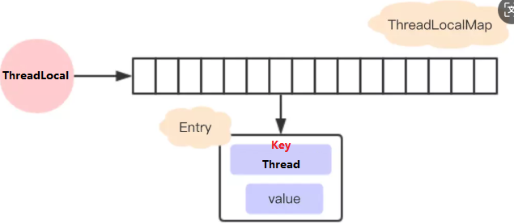
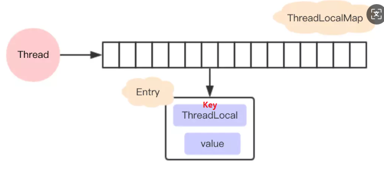
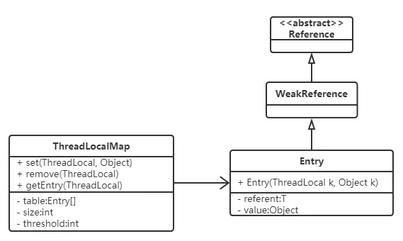
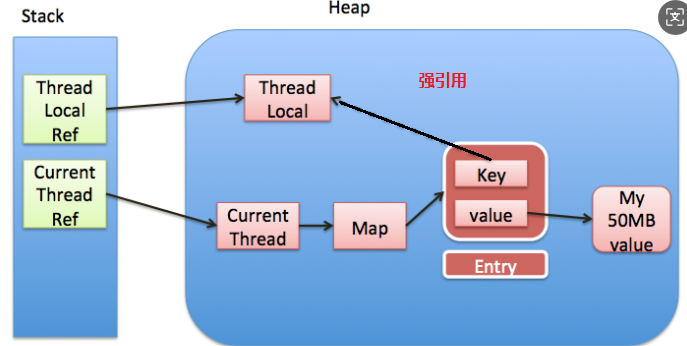
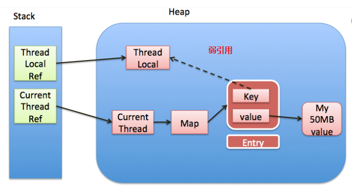

# ThreadLocal

官方文档中的描述：

ThreadLocal类用来提供线程内部的局部变量。这种变量在多线程环境下访问（通过get和set方法访问）时能保证各个线程的变量相对独立于其他线程内的变量。ThreadLocal实例通常来说都是private static类型的，用于关联线程和线程上下文。


我们可以得知 ThreadLocal 的作用是：

提供线程内的局部变量，**不同的线程之间不会相互干扰**，这种变量在线程的生命周期内起作用，减少**同一个线程内**多个函数或组件之间一些**公共变量传递**的复杂度。

```
总结:
1. 线程并发: 在多线程并发的场景下
2. 传递数据: 我们可以通过ThreadLocal在同一线程，不同组件中传递公共变量
3. 线程隔离: 每个线程的变量都是独立的，不会互相影响
```


## 主要特点

- **线程隔离**：每个线程内部都有一个对该 `ThreadLocal` 变量的独立副本，线程之间互不影响。
- **自动垃圾回收**：当线程结束时，该线程所对应的 `ThreadLocal` 实例的所有副本都会被垃圾回收，无需手动清理。
- **简单易用**：通过 `set()` 方法设置值，通过 `get()` 方法获取值，易于集成到现有的代码中。


## 工作原理

每个 `ThreadLocal` 实例为每个使用它的线程提供一个独立的值副本。换句话说，是每个 `ThreadLocal` 对象在每个线程中维护了一个独立的变量副本。

1. **`ThreadLocal` 实例**：你创建的一个或多个 `ThreadLocal` 实例是共享的，可以被多个线程访问。但是，每个 `ThreadLocal` 实例为每个线程存储不同的值。
2. **线程局部变量**：对于每个使用特定 `ThreadLocal` 实例的线程，都会在这个线程内部维护一个对该 `ThreadLocal` 实例的映射（实际上是通过 `Thread` 类中的 `threadLocals` 变量实现的）。这意味着即使所有线程都使用同一个 `ThreadLocal` 实例，它们也会拥有各自独立的值副本。
3. **初始化**：当一个线程首次调用某个 `ThreadLocal` 实例的 `get()` 方法时，如果没有预先设置过值，则会调用该实例的 `initialValue()` 方法来初始化这个线程对应的值。你可以重写 `initialValue()` 来指定默认值。
4. **隔离性**：由于每个线程都有自己的值副本，因此在一个线程中对 `ThreadLocal` 变量所做的更改不会影响其他线程中的相同 `ThreadLocal` 变量的值。


## 基本使用

### 常用方法

| 方法声明                  | 描述                       |
| ------------------------- | -------------------------- |
| ThreadLocal()             | 创建ThreadLocal对象        |
| public void set( T value) | 设置当前线程绑定的局部变量 |
| public T get()            | 获取当前线程绑定的局部变量 |
| public void remove()      | 移除当前线程绑定的局部变量 |


### 使用案例

我们来看下面这个案例, 感受一下ThreadLocal 线程隔离的特点： 

```java
public class MyDemo {
    private String content;

    private String getContent() {
        return content;
    }

    private void setContent(String content) {
        this.content = content;
    }

    public static void main(String[] args) {
        MyDemo demo = new MyDemo();
        for (int i = 0; i < 5; i++) {
            Thread thread = new Thread(new Runnable() {
                @Override
                public void run() {
                    demo.setContent(Thread.currentThread().getName() + "的数据");
                    System.out.println("-----------------------");
             		System.out.println(Thread.currentThread().getName() + "--->" + demo.getContent());
                }
            });
            thread.setName("线程" + i);
            thread.start();
        }
    }
}
```

打印结果:


从结果可以看出多个线程在访问同一个变量的时候出现的异常，线程间的数据没有隔离。下面我们来看下采用 ThreadLocal 的方式来解决这个问题的例子。

```java
public class MyDemo {

    private static ThreadLocal<String> tl = new ThreadLocal<>();

    private String content;

    private String getContent() {
        return tl.get();
    }

    private void setContent(String content) {
         tl.set(content);
    }

    public static void main(String[] args) {
        MyDemo demo = new MyDemo();
        for (int i = 0; i < 5; i++) {
            Thread thread = new Thread(new Runnable() {
                @Override
                public void run() {
                    demo.setContent(Thread.currentThread().getName() + "的数据");
                    System.out.println("-----------------------");
                    System.out.println(Thread.currentThread().getName() + "--->" + demo.getContent());
                }
            });
            thread.setName("线程" + i);
            thread.start();
        }
    }
}
```


### ThreadLocal类与synchronized关键字

这里可能有的朋友会觉得在上述例子中我们完全可以通过加锁来实现这个功能。我们首先来看一下用synchronized代码块实现的效果:

```java
public class Demo02 {
    
    private String content;

    public String getContent() {
        return content;
    }

    public void setContent(String content) {
        this.content = content;
    }

    public static void main(String[] args) {
        Demo02 demo02 = new Demo02();
        
        for (int i = 0; i < 5; i++) {
            Thread t = new Thread(){
                @Override
                public void run() {
                    synchronized (Demo02.class){
                        demo02.setContent(Thread.currentThread().getName() + "的数据");
                        System.out.println("-------------------------------------");
                        String content = demo02.getContent();
                        System.out.println(Thread.currentThread().getName() + "--->" + content);
                    }
                }
            };
            t.setName("线程" + i);
            t.start();
        }
    }
}
```


**区别：**

|        | synchronized                                                 | ThreadLocal                                                  |
| ------ | ------------------------------------------------------------ | ------------------------------------------------------------ |
| 原理   | 同步机制采用'以时间换空间'的方式, 只提供了一份变量,让不同的线程排队访问 | ThreadLocal采用'以空间换时间'的方式, 为每一个线程都提供了一份变量的副本,从而实现同时访问而相不干扰 |
| 侧重点 | 多个线程之间访问资源的同步                                   | 多线程中让每个线程之间的数据相互隔离                         |


## 运用场景_事务案例

这里我们先构建一个简单的转账场景： 有一个数据表account，里面有两个用户Jack和Rose，用户Jack  给用户Rose 转账。 

​	案例的实现主要用mysql数据库，JDBC 和 C3P0 框架。以下是详细代码 ： 

（2） 数据准备

```sql
-- 使用数据库
use test;
-- 创建一张账户表
create table account(
	id int primary key auto_increment,
	name varchar(20),
	money double
);
-- 初始化数据
insert into account values(null, 'Jack', 1000);
insert into account values(null, 'Rose', 0);
```

​	（3） C3P0配置文件和工具类

   ```xml
   <c3p0-config>
     <!-- 使用默认的配置读取连接池对象 -->
     <default-config>
     	<!--  连接参数 -->
       <property name="driverClass">com.mysql.jdbc.Driver</property>
       <property name="jdbcUrl">jdbc:mysql://localhost:3306/test</property>
       <property name="user">root</property>
       <property name="password">1234</property>
       
       <!-- 连接池参数 -->
       <property name="initialPoolSize">5</property>
       <property name="maxPoolSize">10</property>
       <property name="checkoutTimeout">3000</property>
     </default-config>
   
   </c3p0-config>
   ```

​    	（4） 工具类 ： JdbcUtils

```java
package com.itheima.transfer.utils;

import com.mchange.v2.c3p0.ComboPooledDataSource;
import java.sql.Connection;
import java.sql.SQLException;

public class JdbcUtils {
    // c3p0 数据库连接池对象属性
    private static final ComboPooledDataSource ds = new ComboPooledDataSource();
    // 获取连接
    public static Connection getConnection() throws SQLException {
        return ds.getConnection();
    }
    //释放资源
    public static void release(AutoCloseable... ios){
        for (AutoCloseable io : ios) {
            if(io != null){
                try {
                    io.close();
                } catch (Exception e) {
                    e.printStackTrace();
                }
            }
        }
    }
    
    
    public static void commitAndClose(Connection conn) {
        try {
            if(conn != null){
                //提交事务
                conn.commit();
                //释放连接
                conn.close();
            }
        } catch (SQLException e) {
            e.printStackTrace();
        }
    }

    public static void rollbackAndClose(Connection conn) {
        try {
            if(conn != null){
                //回滚事务
                conn.rollback();
                //释放连接
                conn.close();
            }
        } catch (SQLException e) {
            e.printStackTrace();
        }
    }
}
```

​	（5） dao层代码 ： AccountDao

```java
package com.itheima.transfer.dao;

import com.itheima.transfer.utils.JdbcUtils;

import java.sql.Connection;
import java.sql.PreparedStatement;
import java.sql.SQLException;

public class AccountDao {

    public void out(String outUser, int money) throws SQLException {
        String sql = "update account set money = money - ? where name = ?";

        Connection conn = JdbcUtils.getConnection();
        PreparedStatement pstm = conn.prepareStatement(sql);
        pstm.setInt(1,money);
        pstm.setString(2,outUser);
        pstm.executeUpdate();

        JdbcUtils.release(pstm,conn);
    }

    public void in(String inUser, int money) throws SQLException {
        String sql = "update account set money = money + ? where name = ?";

        Connection conn = JdbcUtils.getConnection();
        PreparedStatement pstm = conn.prepareStatement(sql);
        pstm.setInt(1,money);
        pstm.setString(2,inUser);
        pstm.executeUpdate();

        JdbcUtils.release(pstm,conn);
    }
}
```

​	（6） service层代码 ： AccountService

```java
package com.itheima.transfer.service;

import com.itheima.transfer.dao.AccountDao;
import java.sql.SQLException;

public class AccountService {

    public boolean transfer(String outUser, String inUser, int money) {
        AccountDao ad = new AccountDao();
        try {
            // 转出
            ad.out(outUser, money);
            // 转入
            ad.in(inUser, money);
        } catch (Exception e) {
            e.printStackTrace();
            return false;
        }
        return true;
    }
}
```

​	（7） web层代码 ： AccountWeb

```java
package com.itheima.transfer.web;

import com.itheima.transfer.service.AccountService;

public class AccountWeb {

    public static void main(String[] args) {
        // 模拟数据 : Jack 给 Rose 转账 100
        String outUser = "Jack";
        String inUser = "Rose";
        int money = 100;

        AccountService as = new AccountService();
        boolean result = as.transfer(outUser, inUser, money);

        if (result == false) {
            System.out.println("转账失败!");
        } else {
            System.out.println("转账成功!");
        }
    }
}
```

###  引入事务

​	案例中的转账涉及两个DML操作： 一个转出，一个转入。这些操作是需要具备原子性的，不可分割。不然就有可能出现数据修改异常情况。  

```java
public class AccountService {
    public boolean transfer(String outUser, String inUser, int money) {
        AccountDao ad = new AccountDao();
        try {
            // 转出
            ad.out(outUser, money);
            // 模拟转账过程中的异常
            int i = 1/0;
            // 转入
            ad.in(inUser, money);
        } catch (Exception e) {
            e.printStackTrace();
            return false;
        }
        return true;
    }
}
```


​	所以这里就需要操作事务，来保证转出和转入操作具备原子性，要么同时成功，要么同时失败。

 （1） JDBC中关于事务的操作的api

| Connection接口的方法       | 作用                         |
| -------------------------- | ---------------------------- |
| void  setAutoCommit(false) | 禁用事务自动提交（改为手动） |
| void  commit();            | 提交事务                     |
| void rollback();           | 回滚事务                     |

  **（2） 开启事务的注意点:**

  - 为了保证所有的操作在一个事务中,案例中使用的连接必须是同一个:  service层开启事务的connection需要跟dao层访问数据库的connection保持一致

  - 线程并发情况下, 每个线程只能操作各自的 connection


###  常规解决方案

####  常规方案的实现

基于上面给出的前提， 大家通常想到的解决方案是 ： 

- 传参: 从service层将connection对象向dao层传递 
- 加锁

以下是代码实现修改的部分： 

​	（1 ) AccountService 类 

```java
package com.itheima.transfer.service;

import com.itheima.transfer.dao.AccountDao;
import com.itheima.transfer.utils.JdbcUtils;
import java.sql.Connection;

public class AccountService {

    public boolean transfer(String outUser, String inUser, int money) {
        AccountDao ad = new AccountDao();
        //线程并发情况下,为了保证每个线程使用各自的connection,故加锁
        synchronized (AccountService.class) {

            Connection conn = null;
            try {
                conn = JdbcUtils.getConnection();
                //开启事务
                conn.setAutoCommit(false);
                // 转出
                ad.out(conn, outUser, money);
                // 模拟转账过程中的异常
//            int i = 1/0;
                // 转入
                ad.in(conn, inUser, money);
                //事务提交
                JdbcUtils.commitAndClose(conn);
            } catch (Exception e) {
                e.printStackTrace();
                //事务回滚
                JdbcUtils.rollbackAndClose(conn);
                return false;
            }
            return true;
        }
    }
}
```

​	（2) AccountDao 类 （这里需要注意的是： connection不能在dao层释放，要在service层，不然在dao层释放，service层就无法使用了）

```java
package com.itheima.transfer.dao;

import com.itheima.transfer.utils.JdbcUtils;
import java.sql.Connection;
import java.sql.PreparedStatement;
import java.sql.SQLException;

public class AccountDao {

    public void out(Connection conn, String outUser, int money) throws SQLException{
        String sql = "update account set money = money - ? where name = ?";
        //注释从连接池获取连接的代码,使用从service中传递过来的connection
//        Connection conn = JdbcUtils.getConnection();
        PreparedStatement pstm = conn.prepareStatement(sql);
        pstm.setInt(1,money);
        pstm.setString(2,outUser);
        pstm.executeUpdate();
        //连接不能在这里释放,service层中还需要使用
//        JdbcUtils.release(pstm,conn);
        JdbcUtils.release(pstm);
    }

    public void in(Connection conn, String inUser, int money) throws SQLException {
        String sql = "update account set money = money + ? where name = ?";
//        Connection conn = JdbcUtils.getConnection();
        PreparedStatement pstm = conn.prepareStatement(sql);
        pstm.setInt(1,money);
        pstm.setString(2,inUser);
        pstm.executeUpdate();
//        JdbcUtils.release(pstm,conn);
        JdbcUtils.release(pstm);
    }
}
```


#### 常规方案的弊端

上述方式我们看到的确按要求解决了问题，但是仔细观察，会发现这样实现的弊端： 

1. 直接从service层传递connection到dao层, 造成代码耦合度提高

2. 加锁会造成线程失去并发性，程序性能降低


### ThreadLocal解决方案

#### ThreadLocal方案的实现

像这种需要在项目中进行**数据传递**和**线程隔离**的场景，我们不妨用ThreadLocal来解决： 

​	（1） 工具类的修改： 加入ThreadLocal

```java
package com.itheima.transfer.utils;

import com.mchange.v2.c3p0.ComboPooledDataSource;
import java.sql.Connection;
import java.sql.SQLException;

public class JdbcUtils {
    //ThreadLocal对象 : 将connection绑定在当前线程中
    private static final ThreadLocal<Connection> tl = new ThreadLocal();

    // c3p0 数据库连接池对象属性
    private static final ComboPooledDataSource ds = new ComboPooledDataSource();

    // 获取连接
    public static Connection getConnection() throws SQLException {
        //取出当前线程绑定的connection对象
        Connection conn = tl.get();
        if (conn == null) {
            //如果没有，则从连接池中取出
            conn = ds.getConnection();
            //再将connection对象绑定到当前线程中
            tl.set(conn);
        }
        return conn;
    }

    //释放资源
    public static void release(AutoCloseable... ios) {
        for (AutoCloseable io : ios) {
            if (io != null) {
                try {
                    io.close();
                } catch (Exception e) {
                    e.printStackTrace();
                }
            }
        }
    }

    public static void commitAndClose() {
        try {
            Connection conn = getConnection();
            //提交事务
            conn.commit();
            //解除绑定
            tl.remove();
            //释放连接
            conn.close();
        } catch (SQLException e) {
            e.printStackTrace();
        }
    }

    public static void rollbackAndClose() {
        try {
            Connection conn = getConnection();
            //回滚事务
            conn.rollback();
            //解除绑定
            tl.remove();
            //释放连接
            conn.close();
        } catch (SQLException e) {
            e.printStackTrace();
        }
    }
}
```

​	（2） AccountService类的修改：不需要传递connection对象

```java
package com.itheima.transfer.service;

import com.itheima.transfer.dao.AccountDao;
import com.itheima.transfer.utils.JdbcUtils;
import java.sql.Connection;

public class AccountService {

    public boolean transfer(String outUser, String inUser, int money) {
        AccountDao ad = new AccountDao();

        try {
            Connection conn = JdbcUtils.getConnection();
            //开启事务
            conn.setAutoCommit(false);
            // 转出 ： 这里不需要传参了 ！
            ad.out(outUser, money);
            // 模拟转账过程中的异常
//            int i = 1 / 0;
            // 转入
            ad.in(inUser, money);
            //事务提交
            JdbcUtils.commitAndClose();
        } catch (Exception e) {
            e.printStackTrace();
            //事务回滚
           JdbcUtils.rollbackAndClose();
            return false;
        }
        return true;
    }
}
```

​	（3） AccountDao类的修改：照常使用

```java
package com.itheima.transfer.dao;

import com.itheima.transfer.utils.JdbcUtils;

import java.sql.Connection;
import java.sql.PreparedStatement;
import java.sql.SQLException;

public class AccountDao {

    public void out(String outUser, int money) throws SQLException {
        String sql = "update account set money = money - ? where name = ?";
        Connection conn = JdbcUtils.getConnection();
        PreparedStatement pstm = conn.prepareStatement(sql);
        pstm.setInt(1,money);
        pstm.setString(2,outUser);
        pstm.executeUpdate();
        //照常使用
//        JdbcUtils.release(pstm,conn);
        JdbcUtils.release(pstm);
    }

    public void in(String inUser, int money) throws SQLException {
        String sql = "update account set money = money + ? where name = ?";
        Connection conn = JdbcUtils.getConnection();
        PreparedStatement pstm = conn.prepareStatement(sql);
        pstm.setInt(1,money);
        pstm.setString(2,inUser);
        pstm.executeUpdate();
//        JdbcUtils.release(pstm,conn);
        JdbcUtils.release(pstm);
    }
}
```


#### ThreadLocal方案的好处

从上述的案例中我们可以看到， 在一些特定场景下，ThreadLocal方案有两个突出的优势： 

1. 传递数据 ： 保存每个线程绑定的数据，在需要的地方可以直接获取, 避免参数直接传递带来的代码耦合问题

2. 线程隔离 ： 各线程之间的数据相互隔离却又具备并发性，避免同步方式带来的性能损失


## ThreadLocal的内部结构

通过以上的学习，我们对ThreadLocal的作用有了一定的认识。现在我们一起来看一下ThreadLocal的内部结构，探究它能够实现线程数据隔离的原理。

###  常见的误解

​	如果我们不去看源代码的话，可能会猜测`ThreadLocal`是这样子设计的：每个`ThreadLocal`都创建一个`Map`，然后用线程作为`Map`的`key`，要存储的局部变量作为`Map`的`value`，这样就能达到各个线程的局部变量隔离的效果。这是最简单的设计方法，JDK最早期的`ThreadLocal` 确实是这样设计的，但现在早已不是了。



### 现在的设计

​	但是，JDK后面优化了设计方案，在JDK8中 `ThreadLocal`的设计是：每个`Thread`维护一个`ThreadLocalMap`，这个Map的`key`是`ThreadLocal`实例本身，`value`才是真正要存储的值`Object`。

具体的过程是这样的：

​	（1） 每个Thread线程内部都有一个Map (ThreadLocalMap)
​	（2） Map里面存储ThreadLocal对象（key）和线程的变量副本（value）
​	（3）Thread内部的Map是由ThreadLocal维护的，由ThreadLocal负责向map获取和设置线程的变量值。
​	（4）对于不同的线程，每次获取副本值时，别的线程并不能获取到当前线程的副本值，形成了副本的隔离，互不干扰。	



### 这样设计的好处

​	这个设计与我们一开始说的设计刚好相反，这样设计有如下两个优势：

（1） 这样设计之后每个`Map`存储的`Entry`数量就会变少。因为之前的存储数量由`Thread`的数量决定，现在是由`ThreadLocal`的数量决定。在实际运用当中，往往ThreadLocal的数量要少于Thread的数量。

（2） 当`Thread`销毁之后，对应的`ThreadLocalMap`也会随之销毁，能减少内存的使用。


## ThreadLocal的核心方法源码

基于ThreadLocal的内部结构，我们继续分析它的核心方法源码，更深入的了解其操作原理。

除了构造方法之外， ThreadLocal对外暴露的方法有以下4个：

| 方法声明                   | 描述                         |
| -------------------------- | ---------------------------- |
| protected T initialValue() | 返回当前线程局部变量的初始值 |
| public void set( T value)  | 设置当前线程绑定的局部变量   |
| public T get()             | 获取当前线程绑定的局部变量   |
| public void remove()       | 移除当前线程绑定的局部变量   |

​	以下是这4个方法的详细源码分析(为了保证思路清晰, ThreadLocalMap部分暂时不展开,下一个知识点详解)

### set方法

**（1 ) 源码和对应的中文注释**

```java
  /**
     * 设置当前线程对应的ThreadLocal的值
     *
     * @param value 将要保存在当前线程对应的ThreadLocal的值
     */
    public void set(T value) {
        // 获取当前线程对象
        Thread t = Thread.currentThread();
        // 获取此线程对象中维护的ThreadLocalMap对象
        ThreadLocalMap map = getMap(t);
        // 判断map是否存在
        if (map != null)
            // 存在则调用map.set设置此实体entry
            map.set(this, value);
        else
            // 1）当前线程Thread 不存在ThreadLocalMap对象
            // 2）则调用createMap进行ThreadLocalMap对象的初始化
            // 3）并将 t(当前线程)和value(t对应的值)作为第一个entry存放至ThreadLocalMap中
            createMap(t, value);
    }

 /**
     * 获取当前线程Thread对应维护的ThreadLocalMap 
     * 
     * @param  t the current thread 当前线程
     * @return the map 对应维护的ThreadLocalMap 
     */
    ThreadLocalMap getMap(Thread t) {
        return t.threadLocals;
    }
	/**
     *创建当前线程Thread对应维护的ThreadLocalMap 
     *
     * @param t 当前线程
     * @param firstValue 存放到map中第一个entry的值
     */
	void createMap(Thread t, T firstValue) {
        //这里的this是调用此方法的threadLocal
        t.threadLocals = new ThreadLocalMap(this, firstValue);
    }
```

**（2 )  代码执行流程**

​	A. 首先获取当前线程，并根据当前线程获取一个Map

​	B. 如果获取的Map不为空，则将参数设置到Map中（当前ThreadLocal的引用作为key）

​	C. 如果Map为空，则给该线程创建 Map，并设置初始值

### get方法

**（1 ) 源码和对应的中文注释**

```java
    /**
     * 返回当前线程中保存ThreadLocal的值
     * 如果当前线程没有此ThreadLocal变量，
     * 则它会通过调用{@link #initialValue} 方法进行初始化值
     *
     * @return 返回当前线程对应此ThreadLocal的值
     */
    public T get() {
        // 获取当前线程对象
        Thread t = Thread.currentThread();
        // 获取此线程对象中维护的ThreadLocalMap对象
        ThreadLocalMap map = getMap(t);
        // 如果此map存在
        if (map != null) {
            // 以当前的ThreadLocal 为 key，调用getEntry获取对应的存储实体e
            ThreadLocalMap.Entry e = map.getEntry(this);
            // 对e进行判空 
            if (e != null) {
                @SuppressWarnings("unchecked")
                // 获取存储实体 e 对应的 value值
                // 即为我们想要的当前线程对应此ThreadLocal的值
                T result = (T)e.value;
                return result;
            }
        }
        /*
        	初始化 : 有两种情况有执行当前代码
        	第一种情况: map不存在，表示此线程没有维护的ThreadLocalMap对象
        	第二种情况: map存在, 但是没有与当前ThreadLocal关联的entry
         */
        return setInitialValue();
    }

    /**
     * 初始化
     *
     * @return the initial value 初始化后的值
     */
    private T setInitialValue() {
        // 调用initialValue获取初始化的值
        // 此方法可以被子类重写, 如果不重写默认返回null
        T value = initialValue();
        // 获取当前线程对象
        Thread t = Thread.currentThread();
        // 获取此线程对象中维护的ThreadLocalMap对象
        ThreadLocalMap map = getMap(t);
        // 判断map是否存在
        if (map != null)
            // 存在则调用map.set设置此实体entry
            map.set(this, value);
        else
            // 1）当前线程Thread 不存在ThreadLocalMap对象
            // 2）则调用createMap进行ThreadLocalMap对象的初始化
            // 3）并将 t(当前线程)和value(t对应的值)作为第一个entry存放至ThreadLocalMap中
            createMap(t, value);
        // 返回设置的值value
        return value;
    }
```

**（2 )  代码执行流程** 

​	A. 首先获取当前线程, 根据当前线程获取一个Map

​	B. 如果获取的Map不为空，则在Map中以ThreadLocal的引用作为key来在Map中获取对应的Entry e，否则转到D

​	C. 如果e不为null，则返回e.value，否则转到D

​	D. Map为空或者e为空，则通过initialValue函数获取初始值value，然后用ThreadLocal的引用和value作为firstKey和firstValue创建一个新的Map

总结:  **先获取当前线程的 ThreadLocalMap 变量，如果存在则返回值，不存在则创建并返回初始值。**

### remove方法

**（1 ) 源码和对应的中文注释**

```java
 /**
     * 删除当前线程中保存的ThreadLocal对应的实体entry
     */
     public void remove() {
        // 获取当前线程对象中维护的ThreadLocalMap对象
         ThreadLocalMap m = getMap(Thread.currentThread());
        // 如果此map存在
         if (m != null)
            // 存在则调用map.remove
            // 以当前ThreadLocal为key删除对应的实体entry
             m.remove(this);
     }
```

**（2 )  代码执行流程**

​	A. 首先获取当前线程，并根据当前线程获取一个Map

​	B. 如果获取的Map不为空，则移除当前ThreadLocal对象对应的entry

### initialValue方法

```java
/**
  * 返回当前线程对应的ThreadLocal的初始值
  
  * 此方法的第一次调用发生在，当线程通过get方法访问此线程的ThreadLocal值时
  * 除非线程先调用了set方法，在这种情况下，initialValue 才不会被这个线程调用。
  * 通常情况下，每个线程最多调用一次这个方法。
  *
  * <p>这个方法仅仅简单的返回null {@code null};
  * 如果程序员想ThreadLocal线程局部变量有一个除null以外的初始值，
  * 必须通过子类继承{@code ThreadLocal} 的方式去重写此方法
  * 通常, 可以通过匿名内部类的方式实现
  *
  * @return 当前ThreadLocal的初始值
  */
protected T initialValue() {
    return null;
}

```

​	此方法的作用是 返回该线程局部变量的初始值。

（1） 这个方法是一个延迟调用方法，从上面的代码我们得知，在set方法还未调用而先调用了get方法时才执行，并且仅执行1次。

（2）这个方法缺省实现直接返回一个``null``。

（3）如果想要一个除null之外的初始值，可以重写此方法。（备注： 该方法是一个``protected``的方法，显然是为了让子类覆盖而设计的）


## ThreadLocalMap源码分析

在分析ThreadLocal方法的时候，我们了解到ThreadLocal的操作实际上是围绕ThreadLocalMap展开的。ThreadLocalMap的源码相对比较复杂, 我们从以下三个方面进行讨论。

### 基本结构

​	ThreadLocalMap是ThreadLocal的内部类，没有实现Map接口，用独立的方式实现了Map的功能，其内部的Entry也是独立实现。



**（1） 成员变量**

```java
    /**
     * 初始容量 —— 必须是2的整次幂
     */
    private static final int INITIAL_CAPACITY = 16;

    /**
     * 存放数据的table，Entry类的定义在下面分析
     * 同样，数组长度必须是2的整次幂。
     */
    private Entry[] table;

    /**
     * 数组里面entrys的个数，可以用于判断table当前使用量是否超过阈值。
     */
    private int size = 0;

    /**
     * 进行扩容的阈值，表使用量大于它的时候进行扩容。
     */
    private int threshold; // Default to 0
    
```

​	跟HashMap类似，INITIAL_CAPACITY代表这个Map的初始容量；table 是一个Entry 类型的数组，用于存储数据；size 代表表中的存储数目； threshold 代表需要扩容时对应 size 的阈值。

链接：https://www.jianshu.com/p/acfd2239c9f4

**（2） 存储结构 - Entry**

```java
/*
 * Entry继承WeakReference，并且用ThreadLocal作为key.
 * 如果key为null(entry.get() == null)，意味着key不再被引用，
 * 因此这时候entry也可以从table中清除。
 */
static class Entry extends WeakReference<ThreadLocal<?>> {
    /** The value associated with this ThreadLocal. */
    Object value;

    Entry(ThreadLocal<?> k, Object v) {
        super(k);
        value = v;
    }
}
```

​	 在ThreadLocalMap中，也是用Entry来保存K-V结构数据的。不过Entry中的key只能是ThreadLocal对象，这点在构造方法中已经限定死了。

​	另外，Entry继承WeakReference，也就是key（ThreadLocal）是弱引用，其目的是将ThreadLocal对象的生命周期和线程生命周期解绑。

### 弱引用和内存泄漏

​	有些程序员在使用ThreadLocal的过程中会发现有内存泄漏的情况发生，就猜测这个内存泄漏跟Entry中使用了弱引用的key有关系。这个理解其实是不对的。

​	我们先来回顾这个问题中涉及的几个名词概念，再来分析问题。

   **（1） 内存泄漏相关概念**

- Memory overflow:内存溢出，没有足够的内存提供申请者使用。
- Memory leak: 内存泄漏是指程序中己动态分配的堆内存由于某种原因程序未释放或无法释放，造成系统内存的浪费，导致程序运行速度减慢甚至系统崩溃等严重后果。内存泄漏的堆积终将导致内存溢出。	

**（2）  弱引用相关概念**

​	Java中的引用有4种类型： 强、软、弱、虚。当前这个问题主要涉及到强引用和弱引用：

​	**强引用（“Strong” Reference）**，就是我们最常见的普通对象引用，只要还有强引用指向一个对象，就能表明对象还“活着”，垃圾回收器就不会回收这种对象。

​	**弱引用（WeakReference）**，垃圾回收器一旦发现了只具有弱引用的对象，不管当前内存空间足够与否，都会回收它的内存。

  	

**（3） 如果key使用强引用**

​	假设ThreadLocalMap中的key使用了强引用，那么会出现内存泄漏吗？

​	此时ThreadLocal的内存图（实线表示强引用）如下： 



​	假设在业务代码中使用完ThreadLocal ，threadLocal Ref被回收了。

​	但是因为threadLocalMap的Entry强引用了threadLocal，造成threadLocal无法被回收。

​	在没有手动删除这个Entry以及CurrentThread依然运行的前提下，始终有强引用链 threadRef->currentThread->threadLocalMap->entry，Entry就不会被回收（Entry中包括了ThreadLocal实例和value），导致Entry内存泄漏。

​	也就是说，ThreadLocalMap中的key使用了强引用， 是无法完全避免内存泄漏的。

**（5）如果key使用弱引用**

​	那么ThreadLocalMap中的key使用了弱引用，会出现内存泄漏吗？

​	此时ThreadLocal的内存图（实线表示强引用，虚线表示弱引用）如下： 



​	同样假设在业务代码中使用完ThreadLocal ，threadLocal Ref被回收了。

​	由于ThreadLocalMap只持有ThreadLocal的弱引用，没有任何强引用指向threadlocal实例, 所以threadlocal就可以顺利被gc回收，此时Entry中的key=null。

​	但是在没有手动删除这个Entry以及CurrentThread依然运行的前提下，也存在有强引用链 threadRef->currentThread->threadLocalMap->entry -> value ，value不会被回收， 而这块value永远不会被访问到了，导致value内存泄漏。

​	也就是说，ThreadLocalMap中的key使用了弱引用， 也有可能内存泄漏。

**（6）出现内存泄漏的真实原因**

​	比较以上两种情况，我们就会发现，内存泄漏的发生跟ThreadLocalMap中的key是否使用弱引用是没有关系的。那么内存泄漏的的真正原因是什么呢？

​	细心的同学会发现，在以上两种内存泄漏的情况中，都有两个前提：

   	1. 没有手动删除这个Entry
      	2. CurrentThread依然运行

​        第一点很好理解，只要在使用完ThreadLocal，调用其remove方法删除对应的Entry，就能避免内存泄漏。

​	第二点稍微复杂一点， 由于ThreadLocalMap是Thread的一个属性，被当前线程所引用，所以它的生命周期跟Thread一样长。那么在使用完ThreadLocal的使用，如果当前Thread也随之执行结束，ThreadLocalMap自然也会被gc回收，从根源上避免了内存泄漏。

​	综上，**ThreadLocal内存泄漏的根源是**：由于ThreadLocalMap的生命周期跟Thread一样长，如果没有手动删除对应key就会导致内存泄漏。


**（7） 为什么使用弱引用**

​	根据刚才的分析, 我们知道了： 无论ThreadLocalMap中的key使用哪种类型引用都无法完全避免内存泄漏，跟使用弱引用没有关系。

​	要避免内存泄漏有两种方式：

  1. 使用完ThreadLocal，调用其remove方法删除对应的Entry

  2. 使用完ThreadLocal，当前Thread也随之运行结束


    相对第一种方式，第二种方式显然更不好控制，特别是使用线程池的时候，线程结束是不会销毁的。

​	也就是说，只要记得在使用完ThreadLocal及时的调用remove，无论key是强引用还是弱引用都不会有问题。那么为什么key要用弱引用呢？

​	事实上，在ThreadLocalMap中的set/getEntry方法中，会对key为null（也即是ThreadLocal为null）进行判断，如果为null的话，那么是会对value置为null的。

​	这就意味着使用完ThreadLocal，CurrentThread依然运行的前提下，就算忘记调用remove方法，**弱引用比强引用可以多一层保障**：弱引用的ThreadLocal会被回收，对应的value在下一次ThreadLocalMap调用set,get,remove中的任一方法的时候会被清除，从而避免内存泄漏。


###       hash冲突的解决

​	hash冲突的解决是Map中的一个重要内容。我们以hash冲突的解决为线索，来研究一下ThreadLocalMap的核心源码。

**（1） 首先从ThreadLocal的set() 方法入手**

```java
  public void set(T value) {
        Thread t = Thread.currentThread();
        ThreadLocal.ThreadLocalMap map = getMap(t);
        if (map != null)
            //调用了ThreadLocalMap的set方法
            map.set(this, value);
        else
            createMap(t, value);
    }
    
    ThreadLocal.ThreadLocalMap getMap(Thread t) {
        return t.threadLocals;
    }

    void createMap(Thread t, T firstValue) {
        	//调用了ThreadLocalMap的构造方法
        t.threadLocals = new ThreadLocal.ThreadLocalMap(this, firstValue);
    }
```

这个方法我们刚才分析过, 其作用是设置当前线程绑定的局部变量 : 

​	A. 首先获取当前线程，并根据当前线程获取一个Map

​	B. 如果获取的Map不为空，则将参数设置到Map中（当前ThreadLocal的引用作为key）

​		**(这里调用了ThreadLocalMap的set方法)**

​	C. 如果Map为空，则给该线程创建 Map，并设置初始值

​		**(这里调用了ThreadLocalMap的构造方法)**


这段代码有两个地方分别涉及到ThreadLocalMap的两个方法, 我们接着分析这两个方法。


**（2）构造方法`ThreadLocalMap(ThreadLocal<?> firstKey, Object firstValue)**`

```java
 /*
  * firstKey : 本ThreadLocal实例(this)
  * firstValue ： 要保存的线程本地变量
  */
ThreadLocalMap(ThreadLocal<?> firstKey, Object firstValue) {
        //初始化table
        table = new ThreadLocal.ThreadLocalMap.Entry[INITIAL_CAPACITY];
        //计算索引(重点代码）
        int i = firstKey.threadLocalHashCode & (INITIAL_CAPACITY - 1);
        //设置值
        table[i] = new ThreadLocal.ThreadLocalMap.Entry(firstKey, firstValue);
        size = 1;
        //设置阈值
        setThreshold(INITIAL_CAPACITY);
    }
```

​	构造函数首先创建一个长度为16的Entry数组，然后计算出firstKey对应的索引，然后存储到table中，并设置size和threshold。

​	**重点分析**： `int i = firstKey.threadLocalHashCode & (INITIAL_CAPACITY - 1)`。

a. 关于`firstKey.threadLocalHashCode`：

```java
 	private final int threadLocalHashCode = nextHashCode();
    
    private static int nextHashCode() {
        return nextHashCode.getAndAdd(HASH_INCREMENT);
    }
//AtomicInteger是一个提供原子操作的Integer类，通过线程安全的方式操作加减,适合高并发情况下的使用
    private static AtomicInteger nextHashCode =  new AtomicInteger();
     //特殊的hash值
    private static final int HASH_INCREMENT = 0x61c88647;
```

​	这里定义了一个AtomicInteger类型，每次获取当前值并加上HASH_INCREMENT，`HASH_INCREMENT = 0x61c88647`,这个值跟斐波那契数列（黄金分割数）有关，其主要目的就是为了让哈希码能均匀的分布在2的n次方的数组里, 也就是Entry[] table中，这样做可以尽量避免hash冲突。

b. 关于`& (INITIAL_CAPACITY - 1)`

​	计算hash的时候里面采用了hashCode & (size - 1)的算法，这相当于取模运算hashCode % size的一个更高效的实现。正是因为这种算法，我们要求size必须是2的整次幂，这也能保证在索引不越界的前提下，使得hash发生冲突的次数减小。

**（3） ThreadLocalMap中的set方法**

```java
private void set(ThreadLocal<?> key, Object value) {
        ThreadLocal.ThreadLocalMap.Entry[] tab = table;
        int len = tab.length;
        //计算索引(重点代码，刚才分析过了）
        int i = key.threadLocalHashCode & (len-1);
        /**
         * 使用线性探测法查找元素（重点代码）
         */
        for (ThreadLocal.ThreadLocalMap.Entry e = tab[i];
             e != null;
             e = tab[i = nextIndex(i, len)]) {
            ThreadLocal<?> k = e.get();
            //ThreadLocal 对应的 key 存在，直接覆盖之前的值
            if (k == key) {
                e.value = value;
                return;
            }
            // key为 null，但是值不为 null，说明之前的 ThreadLocal 对象已经被回收了，
           // 当前数组中的 Entry 是一个陈旧（stale）的元素
            if (k == null) {
                //用新元素替换陈旧的元素，这个方法进行了不少的垃圾清理动作，防止内存泄漏
                replaceStaleEntry(key, value, i);
                return;
            }
        }
    
    	//ThreadLocal对应的key不存在并且没有找到陈旧的元素，则在空元素的位置创建一个新的Entry。
            tab[i] = new Entry(key, value);
            int sz = ++size;
            /**
             * cleanSomeSlots用于清除那些e.get()==null的元素，
             * 这种数据key关联的对象已经被回收，所以这个Entry(table[index])可以被置null。
             * 如果没有清除任何entry,并且当前使用量达到了负载因子所定义(长度的2/3)，那么进行				 * rehash（执行一次全表的扫描清理工作）
             */
            if (!cleanSomeSlots(i, sz) && sz >= threshold)
                rehash();
}

 /**
     * 获取环形数组的下一个索引
     */
    private static int nextIndex(int i, int len) {
        return ((i + 1 < len) ? i + 1 : 0);
    }

```

​	代码执行流程：

A. 首先还是根据key计算出索引 i，然后查找i位置上的Entry，

B. 若是Entry已经存在并且key等于传入的key，那么这时候直接给这个Entry赋新的value值,

C. 若是Entry存在，但是key为null，则调用replaceStaleEntry来更换这个key为空的Entry,

D. 不断循环检测，直到遇到为null的地方，这时候要是还没在循环过程中return，那么就在这个null的位置新建一个Entry，并且插入，同时size增加1。

​    最后调用cleanSomeSlots，清理key为null的Entry，最后返回是否清理了Entry，接下来再判断sz 是否>= thresgold达到了rehash的条件，达到的话就会调用rehash函数执行一次全表的扫描清理。


**重点分析** ： ThreadLocalMap使用`线性探测法`来解决哈希冲突的。

​	该方法一次探测下一个地址，直到有空的地址后插入，若整个空间都找不到空余的地址，则产生溢出。

​	举个例子，假设当前table长度为16，也就是说如果计算出来key的hash值为14，如果table[14]上已经有值，并且其key与当前key不一致，那么就发生了hash冲突，这个时候将14加1得到15，取table[15]进行判断，这个时候如果还是冲突会回到0，取table[0],以此类推，直到可以插入。

​	按照上面的描述，可以把Entry[]  table看成一个环形数组。


# CompletableFuture

是对 `Future` 接口的扩展。


## 特点：

- **非阻塞**：与传统的 `Future` 不同，`CompletableFuture` 提供了无需显式阻塞等待结果的方法来获取计算结果。
- **链式调用**：可以方便地将多个异步任务链接起来，形成复杂的异步流程。
- **异常处理**：支持在异步执行过程中处理异常，并提供回调机制。
- **组合任务**：能够组合多个 `CompletableFuture` 对象，以并行或顺序的方式执行它们。


## 方法

**`supplyAsync(Supplier<U> supplier)`**

使用默认线程池（ForkJoinPool.commonPool()）异步执行提供的供给者函数，并返回结果。这个结果可以通过 `CompletableFuture` 的 `get()` 方法或者其他处理方法（`thenApply`,`thenAccept` 等）来获取。

**`supplyAsync(Supplier<U> supplier, Executor executor)`**

使用指定的执行器异步执行提供的供给者函数，并返回结果。其主要目的是执行某些不需要返回结果的操作，比如记录日志、更新状态等。


**`thenCompose(Function<T,CompletionStage<U>> fn)`**

把前面任务的结果交给下一个异步任务，在前一个任务完成有结果之后，下一个任务才会触发。

```java
public static void main(String[] args) {
    SmallTool.printTimeAndThread("小白进入餐厅");
    SmallTool.printTimeAndThread("小白点了 番茄炒蛋 + 一碗米饭");

    CompletableFuture<String> cf1 = CompletableFuture.supplyAsync(() -> {
        SmallTool.printTimeAndThread("厨师炒菜");
        SmallTool.sleepMillis(200);
        return "番茄炒蛋";
    }).thenCompose(dish -> CompletableFuture.supplyAsync(() -> {
        SmallTool.printTimeAndThread("服务员打饭");
        SmallTool.sleepMillis(100);
        return dish + " + 米饭";
    }));

    SmallTool.printTimeAndThread("小白在打王者");
    SmallTool.printTimeAndThread(String.format("%s 好了,小白开吃", cf1.join()));
}
```


**`thenCombine(CompletionStage<? extends U> other, BiFunction<? super T,? super U,? extends V> fn)`**

将接收到的结果和本方法的第一个参数执行的结果，共两个结果作为第二个参数的两个形参，最终返回一个新的结果。

```java
public static void main(String[] args) {
    SmallTool.printTimeAndThread("小白进入餐厅");
    SmallTool.printTimeAndThread("小白点了 番茄炒蛋 + 一碗米饭");

    CompletableFuture<String> cf1 = CompletableFuture.supplyAsync(() -> {
        SmallTool.printTimeAndThread("厨师炒菜");
        SmallTool.sleepMillis(200);
        return "番茄炒蛋";
    }).thenCombine(CompletableFuture.supplyAsync(() -> {
        SmallTool.printTimeAndThread("服务员蒸饭");
        SmallTool.sleepMillis(300);
        return "米饭";
    }), (dish, rice) -> {
        SmallTool.printTimeAndThread("服务员打饭");
        SmallTool.sleepMillis(100);
        return String.format("%s + %s 好了", dish, rice);
    });

    SmallTool.printTimeAndThread("小白在打王者");
    SmallTool.printTimeAndThread(String.format("%s ,小白开吃", cf1.join()));

}
```


`thenApply(Function<T,U> fn)`

在前一个异步任务完成后，对其结果进行一些转换或处理，不会启动新的异步任务。

`thenApplyAsync(Function<T,U> fn)`

`thenApplyAsync` 方法会接受一个 `Function` 作为参数，并在提供的函数中对当前 `CompletableFuture` 完成后的结果进行转换。不同之处在于，`thenApplyAsync` 保证了这个转换操作会在一个独立的线程（通常是 ForkJoinPool.commonPool() 中的一个线程，除非你提供了自定义的 `Executor`）中异步执行，而不是直接在调用 `thenApplyAsync` 的线程上执行。

```java
public static void main(String[] args) {
    SmallTool.printTimeAndThread("小白吃好了");
    SmallTool.printTimeAndThread("小白 结账、要求开发票");

    CompletableFuture<String> invoice = CompletableFuture.supplyAsync(() -> {
        SmallTool.printTimeAndThread("服务员收款 500元");
        SmallTool.sleepMillis(100);
        return "500";
    }).thenApplyAsync(money -> {
        SmallTool.printTimeAndThread(String.format("服务员开发票 面额 %s元", money));
        SmallTool.sleepMillis(200);
        return String.format("%s元发票", money);
    });

    SmallTool.printTimeAndThread("小白 接到朋友的电话，想一起打游戏");

    SmallTool.printTimeAndThread(String.format("小白拿到%s，准备回家", invoice.join()));
}
```


`applyToEither(CompletionStage<? extends T> other, Function<? super T, U> fn)`

上个任务和这个任务异步运行，哪个先完成，就把结果交给function

```java
public static void main(String[] args) {
    SmallTool.printTimeAndThread("张三走出餐厅，来到公交站");
    SmallTool.printTimeAndThread("等待 700路 或者 800路 公交到来");

    CompletableFuture<String> bus = CompletableFuture.supplyAsync(() -> {
        SmallTool.printTimeAndThread("700路公交正在赶来");
        SmallTool.sleepMillis(100);
        return "700路到了";
    }).applyToEither(CompletableFuture.supplyAsync(() -> {
        SmallTool.printTimeAndThread("800路公交正在赶来");
        SmallTool.sleepMillis(200);
        return "800路到了";
    }), firstComeBus -> firstComeBus);

    SmallTool.printTimeAndThread(String.format("%s,小白坐车回家", bus.join()));
}
```


**`exceptionally(Function<Throwable,? extends T> fn)`**

提供异常处理器，如果发生异常，则根据异常生成一个新的结果，返回一个新的 `CompletableFuture<T>`。

```java
public static void main(String[] args) {
    SmallTool.printTimeAndThread("张三走出餐厅，来到公交站");
    SmallTool.printTimeAndThread("等待 700路 或者 800路 公交到来");

    CompletableFuture<String> bus = CompletableFuture.supplyAsync(() -> {
        SmallTool.printTimeAndThread("700路公交正在赶来");
        SmallTool.sleepMillis(100);
        return "700路到了";
    }).applyToEither(CompletableFuture.supplyAsync(() -> {
        SmallTool.printTimeAndThread("800路公交正在赶来");
        SmallTool.sleepMillis(200);
        return "800路到了";
    }), firstComeBus -> {
        SmallTool.printTimeAndThread(firstComeBus);
        if (firstComeBus.startsWith("700")) {
            throw new RuntimeException("撞树了……");
        }
        return firstComeBus;
    }).exceptionally(e -> {
        SmallTool.printTimeAndThread(e.getMessage());
        SmallTool.printTimeAndThread("小白叫出租车");
        return "出租车 叫到了";
    });

    SmallTool.printTimeAndThread(String.format("%s,小白坐车回家", bus.join()));
}
```


## 扩展

**`runAsync(Runnable runnable)`** 和 **`runAsync(Runnable runnable, Executor executor)`**

- 返回一个不带结果的 `CompletableFuture<Void>`。
- 如果指定了 `executor`，则使用该执行器来运行 `runnable`。


**`thenAccept(Consumer<? super T> action)`**

接收前面任务的结果，但是不产出结果(返回CompletableFuture<Void>)

`thenAcceptBoth(CompletionStage<? extends U> other,BiConsumer<? super T, ? super U> action)`

接收当前CompletableFuture的结果以及第一个参数执行的结果，但不产出结果。

`acceptEither(CompletionStage<? extends T> other,Consumer<? super T> action)`

当前CompletableFuture和第一个参数的任务，哪个先完成就接受它的结果，但不产出结果。


**`thenRun(Runnable action)`**

不接受前面任务的结果，也不产出结果

`runAfterBoth(CompletionStage<?> other, Runnable action)`

比thenrun多执行了一个异步任务，但是也不接受结果，不产出结果

`runAfterEither(CompletionStage<?> other,Runnable action)`

两个任务有一个执行完毕就触发action。仍然不接受任何结果，也不产出结果。


`handle(BiFunction<? super T, Throwable, ? extends U> fn)`

- **参数**：`fn`: 这是一个函数，接受两个参数：第一个是当前 `CompletableFuture` 的结果（类型为 `T`），第二个是可能发生的异常（类型为 `Throwable`）。无论操作是否成功完成，这个函数都会被调用。

- **返回值**：一个新的 `CompletableFuture<U>`，其结果取决于提供的 `fn` 函数的结果。即使原始的 `CompletableFuture` 抛出了异常，你也可以通过这个方法来提供一个默认值或进行错误恢复。

- **用途**：当你需要同时处理正常结果和异常情况，并且想要基于这两种情况生成新的结果时使用。


`whenComplete(BiConsumer<? super T, ? super Throwable> action)`

- **参数**：`action`: 这是一个消费者函数，接受两个参数：一个是当前 `CompletableFuture` 的结果（类型为 `T`），另一个是可能发生的异常（类型为 `Throwable`）。无论操作是否成功完成，这个函数都会被调用。
- **返回值**：一个新的 `CompletableFuture<T>`，它与原始的 `CompletableFuture` 具有相同的结果或异常。也就是说，`whenComplete` 不会改变结果或异常，只是提供了处理它们的机会。
- **用途**：当你只关心处理操作完成后的结果或异常，而不需要基于这些信息生成新的结果时使用。


上面的方法中除了supplyAsync方法和runAsync方法，其他方法都有`xxx(arg...)`、`xxxAsync(arg...)`、`xxxAsync(arg...，Executor)`三个形式。而supplyAsync和runAsync有两种形式。加上join共42个方法(cf中还有很多)。


