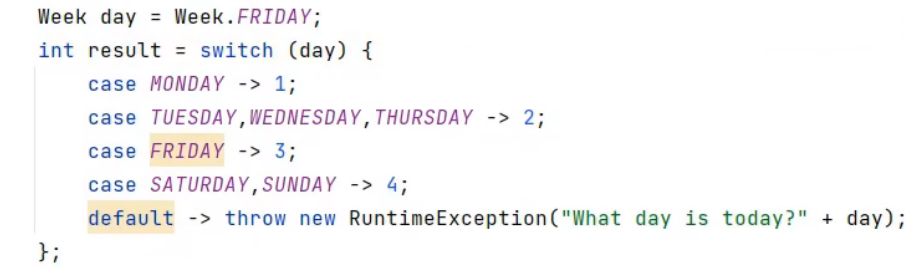
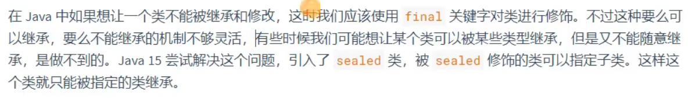
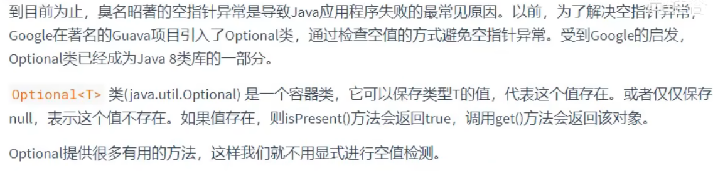
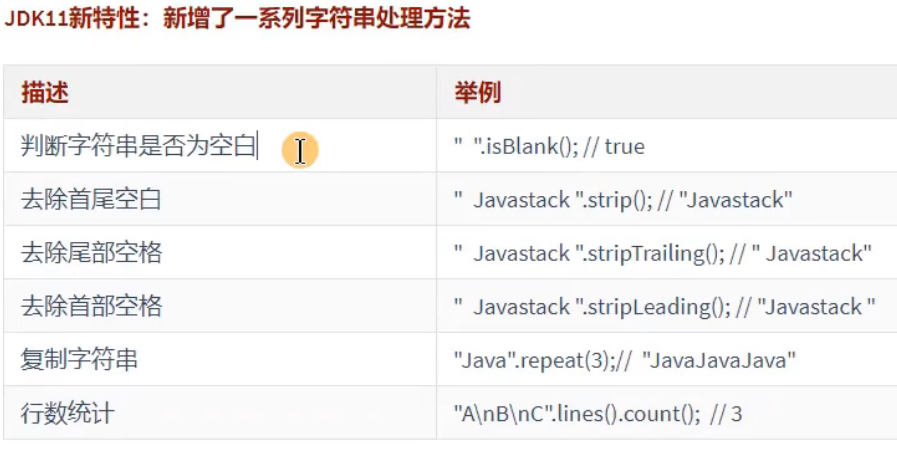

# Lambda表达式

lambda表达式适用于函数式接口

1. Lambda表达式的使用举例

   `(o1,o2)->Integer.compare(o1,o2);`

2. Lambda表达式的格式

- ->：lambda操作符（箭头操作符）
- ->的左边：lambda形参列表，对应着要重写的接口中的抽象方法的形参列表
- ->的右边：lambda体，对应着接口的实现类要重写的方法的方法体


可以省略参数类型，是因为可以进行类型推断，包括数组、集合都使用了类型推断。


lambda表达式的本质：

- 一方面，lambda表达式作为接口的实现类的对象
- 另一方面，lambda是一个匿名函数

由此可以看出，java中万物皆对象


**函数式接口**：
只有一个抽象方法的接口

jdk8中声名的函数式接口在`java.util.Function`包下


演示：

```java
public static void main(String[] args){
	//1.定义和数据供给者函数
	Supplier<String> supplier=()->"42";
	//2.断言：验证是否是一个数字
	Predicate<String> isNumber=str->str.matches("-?\\d+(\\.\\d+)?");
	//3.转换器：把字符串变成数字
	Function<String,Integer> change=Integer::parseInt;
	
	//4.消费者：打印数字
	Consumer<Integer> consumer=integer->{
		if(integer%2==0){
			System.out.println("偶数"+integer);
		} else{
			System.out.println("奇数"+integer);
		}		
	};
    
    if(isNumber.test(supplier.get())){
		//是一个数字
		consumer.accept(change.apply(supplier.get()));
	} else{
		//不是数字
		System.out.println("非法的数字");
	}
} 
```


封装成方法：

```java
public static void main(String[] args){
	//1.定义和数据供给者函数
	Supplier<String> supplier=()->"42";
	//2.断言：验证是否是一个数字
	Predicate<String> isNumber=str->str.matches("-?\\d+(\\.\\d+)?");
	//3.转换器：把字符串变成数字
	Function<String,Integer> change=Integer::parseInt;
	
	//4.消费者：打印数字
	Consumer<Integer> consumer=integer->{
		if(integer%2==0){
			System.out.println("偶数"+integer);
		} else{
			System.out.println("奇数"+integer);
		}		
	};
    
    mymethod(supplier,isNumber,change,consumer);
}

private static void mymethod(Supplier<String> supplier,
                            Predicate<String> isNumber,
                            Function<String,Integer> change,
                            Consumer<Integer>,consumer){
      if(isNumber.test(supplier.get())){
		  //是一个数字
		  consumer.accept(change.apply(supplier.get()));
	  } else{
		  //不是数字
		  System.out.println("非法的数字");
	  }
}
```

或：

```java
public static void main(String[] args){
    mymethod(()->"777",
            str->str.matches("-?\\d+(\\.\\d+)?"),
            Integer::parseInt,
            integer->{
				if(integer%2==0){
					System.out.println("偶数"+integer);
				} else{
					System.out.println("奇数"+integer);
				}		
			};
}

private static void mymethod(Supplier<String> supplier,
                            Predicate<String> isNumber,
                            Function<String,Integer> change,
                            Consumer<Integer>,consumer){
      if(isNumber.test(supplier.get())){
		  //是一个数字
		  consumer.accept(change.apply(supplier.get()));
	  } else{
		  //不是数字
		  System.out.println("非法的数字");
	  }
}
```


# 方法引用与构造器引用

## 方法引用

举例：

`Integer : : compare`


方法引用的理解：

- 方法引用，可以看作是基于lambda表达式的进一步刻画
- 当需要提供一个函数式接口实例时，我们可以使用lambda表达式提供此实例
  - 当满足一定条件的情况下，我们还可以使用方法引用或构造器引用替换lambda表达式


方法引用的本质

方法引用作为了函数式接口的实例 --->万物皆对象


格式：

`类(或对象)：：方法名`


**具体使用情况说明**

- 情况一：对象：：实例方法

  - 要求：函数式接口中的抽象方法a与其内部调用的**对象**的某个方法b的形参列表和返回值类型都相同（或一致）（这里的一致指的是基本类与包装类、或子类与父类）。此时可以考虑使用方法b实现对方法a的替换、覆盖，此替换或覆盖即为方法引用

  - 注意：此方法b是非静态的方法，需要对象调用

    举例：

    ```java
    PrintStream ps=System.out;
    Consumer<String> con=ps::println;
    或
    Consumer<String> con=System.out::println;
    //调用
con.accept（"hello"）;
    ```
    

- 情况二：类：：静态方法
  - 要求：函数式接口中的抽象方法a与其内部调用的**类**的某个**静态**方法b的形参列表和返回值类型都相同（或一致）。此时可以考虑使用方法b实现对方法a的替换、覆盖，此替换或覆盖即为方法引用

  - 注意：此方法b是静态的方法，需要类调用

  - 举例：

    ```java
    Function<Double,Long> fun=Math::round;
    ```

    


- 情况三：类：：实例方法

  - 要求：函数式接口中的抽象方法a与其内部调用的**对象**的某个方法b的形参列表和返回值类型都相同。

    同时，抽象方法a中有n个参数，方法b中有n-1个参数；且抽象方法a的第一个参数作为方法b的调用者；且抽象方法a的后n-1个参数与方法b的n-1个参数的类型相同（或一致）。则可以考虑使用方法b实现对方法a的替换、覆盖，此替换或覆盖即为方法引用。

  - 注意：此方法b是非静态的方法，需要对象调用。但是形式上，使用方法a第一个参数所属的类作为方法引用的左边部分。
  
  - 举例：
  
    ```java
    Comparator<String> com=String::compareTo;
    ```
  
    相当于
  
    ```java
    Comparator<String> com=(s1,s2)->s1.compareTo(s2);
    ```
  
    

## 构造器引用

格式：

`类名::new`

```java
//空参构造器
Function<Employee> func=Employee::new;
Employee emp=func.apply();
//带参构造器（此处为调用只带Integer类型的参数的构造方法）
Function<Integer,Employee> func2=Employee::new;
Employee emp2=func2.apply(12);
```


说明：

- 调用了类名对应类中的某一个构造器
- 具体调用哪一个构造器？取决于函数式接口的泛型类型及个数（也就是接口实现类重写方法的参数类型和个数）


## 数组引用

格式

`数组中元素类名[]::new`

```java
Function<Integer,Employee[]> func=Employee[]::new;
```


# Stream API

Stream的执行流程

- Stream的实例化
- 一系列中间操作
- 执行终止操作


## 创建Stream

第一种：通过集合

```java
//这里是提前定义好的一个list集合
List<Employee> list=EmployeeData.getEmployees();
// default Stream<E> stream()：返回一个顺序流
Stream<Employee> stream=list.stream();
// default parallelStream<E> stream()：返回一个并行流
Stream<Employee> stream1=list.parallelStream();
```


第二种：通过数组

```java
/调用Arrays类的static <T> Stream<T> stream(T[] array)
Integer[] arr=new Integer[]{1,2,3,4,5};
Stream<Integer> s=Arrays.stream(arr);
```


第三种：通过Stream的of()

```java
Stream<String> s=Stream.of("AA","BB","CC");
```


## 中间操作（方法）

**如果没有终止操作，中间操作不执行**


### 筛选与切片

1.`filter(Predicate p) --接收lambda作为参数，从流中排除某些元素`

```java
List<Employee> list=EmployeeData.getEmployees();
Stream<Employee> stream=list.stream();
//如果没有终止操作，中间操作不执行
//查询薪资大于7000的员工
stream.filter(emp->emp.getSalary()>7000);
```


2.`limit(n) --截断流，使其元素不超过给定数量`

```java
//forEach是终止方法
stream.limit(2).forEach(System.out::println);
```


3.`skip(n) --跳过元素，返回一个扔掉前n个元素的流，若流中元素不超过n个，则返回一个空流`

```java
stream.skip(5);
```


4.`distinct()--筛选，通过流所生成元素的hashCode()和equals()去除重复元素`

```java
stream.distinct().forEach(System.out::println);
```


### 映射

`map(Function f)--接收一个函数作为参数，将元素转换成其他形式或提取信息，该函数会被应用到每个元素上`

练习：转换为大写

``` java
List<String> list=Arrays.aslist("aa","bb","cc","dd");
list.stream().map(str->str.toUpperCase()).forEach(System.out::println);
//方法引用情况3
list.stream().map(String::toUpperCase()).forEach(System.out::println);
```


练习：获取员工姓名长度大于3的员工的姓名

```java
List<Employee> employees=EmployeeData.getEmployees();
employees.stream()
			.filter(emp->emp.getName().length()>3)	
            .map(Employee::getName)
			.forEach(System.out::println);
```


### 排序

1.`sorted()--自然排序`

对于没有实现自然排序相关接口(Comparable)，不能自然排序

```java
Integer[] arr=new Integer[]{1,4,2,6,8};
Arrays.stream(arr).sorted().forEach(System.out::println);
```


2.`sorted(Comparator com)--定制排序`

```java
List<Employee> employees=EmployeeData.getEmployees();
list.stream()
    .sorted((e1,e2)->e1.getAge()-e2.getAge())
    .forEach(System.out::println);
```


## 终止操作

### 匹配与查找

1.`allMatch(Predicate p)--检查是否匹配所有元素`

```java
List<Employee> employees=EmployeeData.getEmployees();
sout(list.stream().allMatch(emp->emp.getAge()>18));
```


2.`anyMatch(Predicate p)--是否存在`

返回值也为布尔类型


3.`findFirst()--返回第一个元素`

返回值为Optional类型，用.get()获取具体对象


4.`count()--返回个数`


5.`max(Comparator c)--返回最大值`


6.`min(Comparator c)--返回最小值`


7.`forEach(Consumer c)--内部迭代`


### 归约

1.`reduce(T identity,BinaryOperator)--将流中元素反复结合起来，得到一个值。返回T`

BinaryOperator继承于BiFunction，BiFunction是两个形参、一个返回值的函数

第一个参数是初始值

```java
List<Integer> list=Arrays.asList(1,2,3,4,5,6,7);
sout(list.stream().reduce(0,(x1,x2)->x1+x2));
sout(list.stream().reduce(0,(x1,x2)->Integer.sum(x1,x2)));
sout(list.stream().reduce(0,Integer::sum));
```


2.`reduce(BinaryOperator)--将流中元素反复结合起来，得到一个值。返回Oprional<T>`

```java
List<Employee> employeeList=EmployeeData.getEmployees();
sout(employeeList.stream()
			.map(emp->emp.getSalary())
			.reduce((salary1,salary2)->Double.sum(salary1,salary2));

sout(employeeList.stream()
			.map(emp->emp.getSalary())
			.reduce(Double:sum);
```


### 收集

1.`collect(Collector c)--将流转换为其他形式。接受一个Collector接口的实现，用于给Stream中元素做汇总的方法`

```
List<Employee> employeeList=EmployeeData.getEmployees();

List<Employee> list1=list.stream()
						.filter(emp->emp.getSalary()>6000)
						.collect(Collectors.toList());
```


# 8之后

## try-catch资源关闭

JDK7:

在try后面可以加一个（），在括号中可以声名流对象并初始化。try中代码执行完毕，会自动把流释放，就不用写finally了。


- 在try（）中声名的资源，无论是否发生异常，无论是否处理异常，都会自动关闭资源对象，不用手动关闭了。

- 写到try后括号中的资源默认是final修饰的，不能 修改。

  

JDK9：

try的前面可以定义流对象，try后面的（）中可以直接引用流对象的名称。在try代码执行完毕后，流对象也可以自动释放。


## instanceof

`if(obj instanceof String str){}`

jdk14之前在判断后需要自己强转，这里可以直接判断并声明为变量名str的字符串


## switch

- 可以省略`break`，写成`case L->执行语句;`或`case L ->{}`


- 可以返回结果




- yield

  

YIELD相当于return，但只是跳出当前switch块。


- 模式匹配

  


## 文本块

可以实现文本段落自动换行：


## record

record不需要编写构造器、get、equals、hashcode、string

格式：

```java
public record Person(int id,String name){}
```


- 可以在record声名的类中定义静态字段、静态方法、构造器或实例方法
- 不能在record声名的类中定义实例变量；类不能声名为abstract；不能显式声名父类(因为父类为record)


## sealed



要求子类必须是final或也指定为sealed、non-sealed

```java
public sealed class Person permits Student,Teacher,Worker{

}
```


## API变化

### Optional



```java
String star="迪丽热巴";
star=null;
//使用Oprional避免空指针
//1.实例化
//ofNullable(T value)：用来创建一个Optional实例，value可能空或非空
Oprional<String> oprional=Optional.ofNullable(star);
//orElse(T other)：如果optional内部的实例为null，返回other
String otherStar="杨幂";
String finalStar=optional.orElse(otherStar);
```


取出内部value：

```java
optional.get();
```


### String

String用byte[]存储而不是char[]，节省空间

