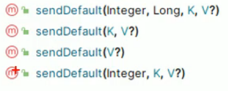
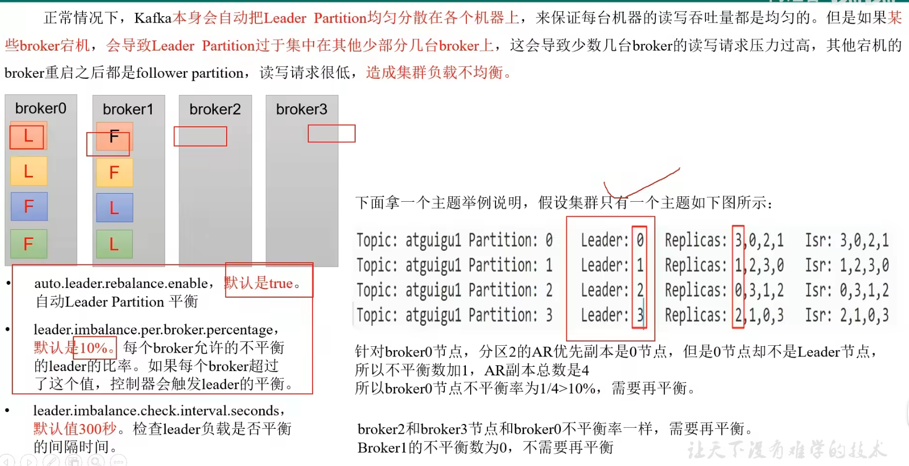
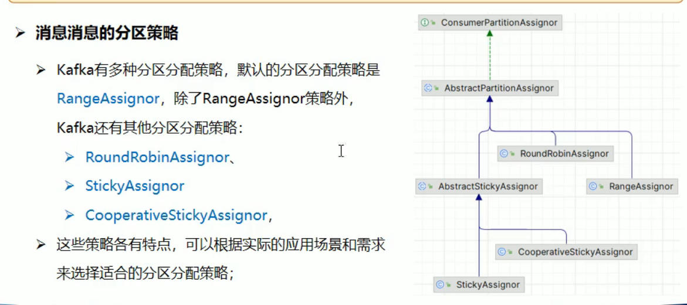
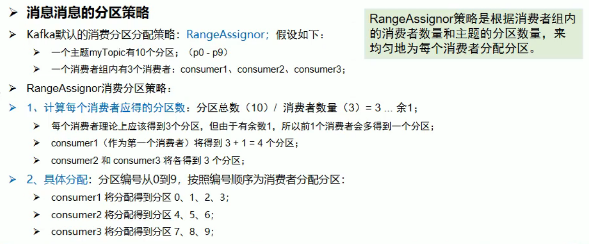
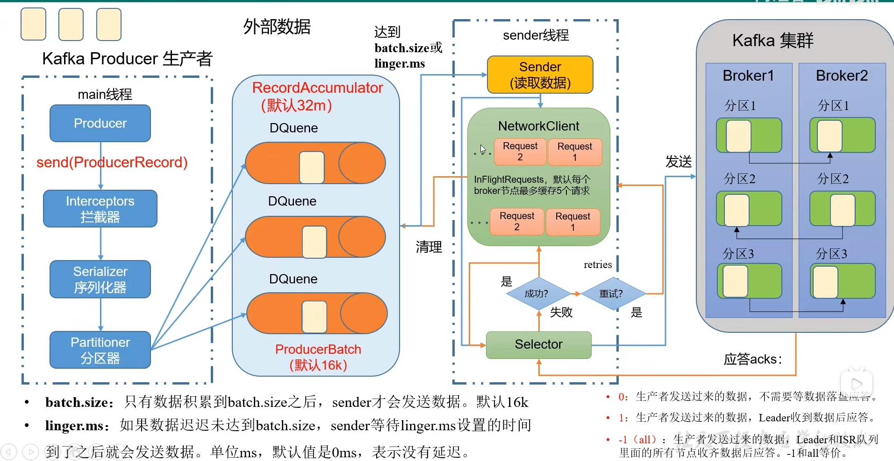
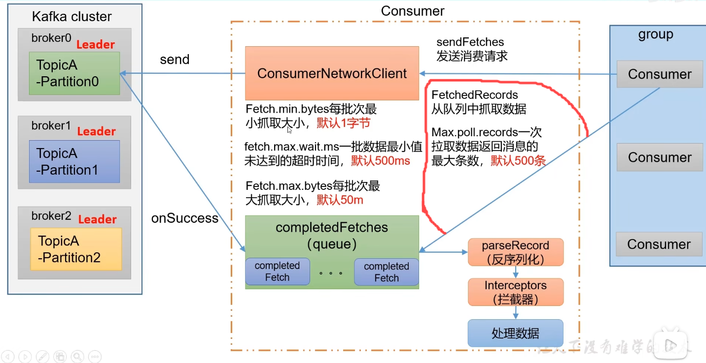

# 运行启动Kafka

java8+

kafka可以使用zookeeper或kraft启动，但只能使用其中一种方式，不能同时使用；

kraft是kafka的内置共识机制，用于取代zookeeper


下载kafka完成后：

- 使用zookeeper启动kafka：

进入kafka的bin目录中，

`zookeeper-server-start.sh ../config/zookeeper.properties &`：启动zookeeper（因为kafka安装包自带zookeeper的jar包），可以在不安装zookeeper的情况下运行zookeeper。`&`表示后台运行。

`kafka-server-start.sh ../config/server.properties &`：启动kafka

`kafka-server-stop.sh ../config/server.properties`：关闭kafka

`zookeeper-server-start.sh ../config/zookeeper.properties`：关闭zookeeper

- 使用kraft启动kafka

  进入kafka的bin目录中，

1. 生成 Cluster UUID（集群UUID）：`kafka-storage.sh random-uuid`
2. `kafka-storage.sh format -t 生成的uuid -c ../config/kraft/server.properties`
3. 启动kafka：`kafka-server.start.sh ../config/kraft/server.properties &`
4. 关闭kafka：`kafka-server.stop.sh ../config/kraft/server.properties `


- docker:

1. 拉取kafka的镜像：`docker pull apache/kafka:3.7.0`
2. 启动kafka的docker容器：`docker run -p 9092:9092 apache/kafka:3.7.0`


# 以下均基于kraft启动

# 外部连接kafka

在idea中下载插件kafka，启动kafka后测试连接发现连接不上。这是由于配置的问题。

Docker容器的kafka有三种配置启动方式：

- 默认配置：使用kafka容器的默认配置，外部是连接不上的
- 文件输入：提供一个本地kafka属性配置文件，覆盖docker容器中的默认配置文件
- 环境变量：通过env变量定义kafka属性，覆盖默认配置中对应该属性的值


### 文件覆盖：

进入kafka：

`docker exec -it 容器id /bin/bash`

配置文件`server.properties`就在`/etc/kafka/docker`目录下


将容器中的配置文件复制一份到宿主机上:

`docker cp 容器id:/etc/kafka/docker/server.properties 目的地目录`

将复制的配置文件进行修改：

`listeners=PLAINTEXT://0.0.0.0:9092`

`advertised.listeners=PLAINTEXT://<宿主机IP>:9092`

(其实这两者如果采用 本笔记启动-(1)方法启动，自动就会设置这两个配置 )


配置文件映射:
某些 Kafka 镜像（例如官方镜像或其他流行的社区镜像）会在启动脚本中检查特定路径（如 /mnt/shared/config）是否存在配置文件。

`docker run -v /home/mutesniper/code/docker:/mnt/shared/config -p 9092:9092 apache/kafka:3.7.0`

再进行远程连接就成功了。


# Springboot集成kafka

在springboot项目创建好后，需要进行相关配置。

- 服务器连接:`spring.kafka.bootstrap-servers:宿主机IP：端口`
- 生产者（配置项参考KafkaProperties.java）:后面根据需要进行配置
- 消费者（配置项参考KafkaProperties.java）:后面根据需要进行配置

## 生产者

### *Kaka几个概念

主题Topic

- **定义**：主题是 Kafka 中消息的分类或名称。生产者将消息发布到特定的主题，而消费者订阅这些主题以接收消息。
- 特点
  - 每个消息都属于一个特定的主题。
  - 主题可以有多个分区（Partition），这有助于并行处理和扩展性。

分区Partition

- **定义**：每个主题可以分为多个分区，这是 Kafka 实现高吞吐量和水平扩展的关键机制。
- 特点
  - 分区内的消息是有序的，但跨分区的消息顺序不保证。
  - 每个分区可以被复制（Replication）以提高容错能力。
  - 消费者组中的消费者实例会分配到不同的分区上进行消费，实现负载均衡。

偏移量Offset

- **定义**：偏移量是每个分区中每条消息的唯一标识符，表示消息在分区中的位置。
- 用途
  - 消费者通过记录偏移量来追踪已经消费的消息，以便于从上次停止的地方继续消费。
  - 偏移量由消费者提交给 Kafka 或外部存储系统（如 Zookeeper）。

生产者Producer

- **定义**：生产者是向 Kafka 主题发送消息的应用程序。
- 功能
  - 生产者可以选择将消息发送到特定的分区，也可以让 Kafka 根据某种策略（如哈希算法）自动选择分区。
  - 生产者还可以配置消息的确认机制（如是否等待副本同步完成）。

消费者Consumer

- **定义**：消费者是从 Kafka 主题读取消息的应用程序。
- 功能
  - 消费者通常以消费者组的形式工作，同一组内的消费者不会重复消费相同的消息。
  - 消费者需要管理自己的偏移量，并决定何时提交偏移量。

消费者组Consumer Group

- **定义**：消费者组是一组共同消费某个或某些主题的消费者的集合。
- 特点
  - 同一消费者组内的消费者之间实现负载均衡，即每个分区只能被同一个消费者组内的一个消费者消费。
  - 不同消费者组之间的消费者可以独立消费相同的消息。

Broker

- **定义**：Broker 是 Kafka 集群中的一个节点，负责存储数据、处理客户端请求（生产和消费）以及集群间的数据复制。
- 特点
  - Kafka 集群由多个 Broker 组成，提供高可用性和扩展性。
  - 每个 Broker 可以持有多个主题的不同分区。

日志Log

- **定义**：在 Kafka 中，主题的每个分区实际上是一个分布式的提交日志。
- 特性
  - 日志是一种持久化、有序且不可变的序列，新的消息不断追加到日志末尾。
  - 日志支持长时间保存，具体时长取决于配置的保留策略。

Zookeeper

- **定义**：尽管较新版本的 Kafka 已经开始减少对 Zookeeper 的依赖，传统上，Kafka 使用 Zookeeper 来管理和协调 Kafka 集群的状态。
- 功能
  - 维护 Kafka Broker 的元数据信息（如主题、分区等）。
  - 协助选举领导者分区（Leader Partition）。
  - 管理消费者组的偏移量。

### Event生产

```java
@Component
public class EventProducer {
    //加入spring-kafka依赖，并且我们配置好了yml，
    // springboot自动配置好了kafka，自动装配好了kafkaTemplate这个Bean
    @Autowired
    private KafkaTemplate<String, String> kafkaTemplate;

    public void sendEvent() {
        kafkaTemplate.send("hello-topic", "hello kafka!");
    }
}
```

测试：

```java
@Autowired
private EventProducer eventProducer;

@Test
void test01() {
    eventProducer.sendEvent();
}
```

发送成功

### Event消费

```java
@Component
public class EventConsumer {
    //采用监听的方式接收事件（消息）
    //指定订阅的topic和消费者所在消费者组
    @KafkaListener(topics="hello-topic",groupId = "hello-group")
    public void onEvent(String message) {
        System.out.println("读取到的消息:"+message);
    }
}
```

通过这种方式，在springboot项目启动后，此consumer就能自动监听hello-topic主题发送的消息。

**但是这种方式仅仅只能监听项目启动后发送的消息，那么要怎么获取之前已经发送的消息呢。**

也就是：
默认情况下，当启动一个新的消费者组时，它会从每个分区的最新偏移量（即该分区中最后一条消息的下一个位置）开始消费。如果希望从第一条消息开始消费，需要将消费者的`auto.offset.reset`设置为earlist

```yml
spring:
  kafka:
    consumer:
        auto-offset-reset: earliest
```


但是，我们在启动主程序后发现并没有读到，这是因为

如果之前已经用相同的消费者组id消费过该Topic , 并且kafka已经保存了该消费者组的偏移量，即使设置了auto..配置，该设置也不会产生实际效果，因为kafka只会在找不到偏移量时使用这个配置。在这种情况下，需要手动重置偏移量或使用一个新的消费者组id。

先使用第二种方法：

`groupid="hello-group-02"`，发现可以从头读取


观察一下kafka插件显示的信息:

hello-topic:

hello-group:

hello-group-02:


再使用第一种方法

- 防火墙开启9092端口

- 进入docker容器

- 使用命令`/opt/kafka/bin/kafka-consumer-groups.sh --bootstrap-server localhost:9092 --describe --group 组名`查看消费者组情况。

- `/opt/kafka/bin/kafka-consumer-groups.sh --bootstrap-server localhost:9092 \                      `

  `--group 组名 \
  `

  `--reset-offsets \
  `

  `--to-earliest \
  `

  `--execute \
  `

  `--topic  topic名`

  可以将偏移量重置到开头。（还可以重置到最新、按偏移量重置、按时间重置）


#### 消费时偏移量策略的配置

```
spring:
  kafka:
    consumer:
        auto-offset-reset: 
```

取值：

- earlist：当各分区没有初始偏移量或当前偏移量无效时，自动将偏移量重置为最早的偏移量

- latest：如果没有找到初始偏移量或当前偏移量无效，自动将偏移量重置为最新的偏移量

- none：如果没有找到初始偏移量或当前偏移量无效，则抛出异常。

  


### 发送Message对象消息

```java
public void sendEvent2() {
    //通过构建器模式创建Message对象(springframework包下的)
    Message message = MessageBuilder.withPayload("hello kafka!")
            //在header中放置topic的名字
            .setHeader(KafkaHeaders.TOPIC, "hello-topic-02")
            .build();
    kafkaTemplate.send(message);
}
```

```java
@Test
void test02() {
    eventProducer.sendEvent2();
}
```


### 发送ProducerRecord对象消息

```java
public void sendEvent3() {
    //消息头,允许你附加一些元数据信息到消息上(key-value)
    //消费者接收到该消息后，可以拿到消息头信息
    Headers headers=new RecordHeaders();
    headers.add("phone","11111111".getBytes(StandardCharsets.UTF_8));
    //第一个泛型是key，第二个泛型是value
    //这里采用最全的构造函数对参数进行示范
    //还有其他更简单的构造函数
    ProducerRecord<String, String> record = new ProducerRecord<>(
            "hello-topic-03", //topic
            0,  //partition
            System.currentTimeMillis(), //时间戳
            "key1", //key
            "hello kafka!", //value
            headers); //消息头
    kafkaTemplate.send(record);
}
```


### 发送指定分区的消息

```java
public void sendEvent4() {
    kafkaTemplate.send("hello-topic-02", 0,System.currentTimeMillis(),"key2","hello kafka!");
}
```


send方法有6个重载的方法，上面仅讲了一部分


### 发送默认topic消息

```java
public void sendEvent5() {
    kafkaTemplate.sendDefault(0,System.currentTimeMillis(),"key3","hello kafka!");
}
```

这是参数最全的方法，但是sendDefault方法的所有重载方法都没有指定topic，所以腰要在配置文件中进行配置

```java
spring:
  kafka:
  	template:
  		default-topic: default-topic
```

那么就会发送到default-topic





### send和sendDefaut方法的区别


### 获取生产者消息发送结果


为什么使用异步编程：


#### 阻塞式

使用CompletableFuture的get()方法，同步阻塞等待发送结果

```java
public void sendEvent6() {
    CompletableFuture<SendResult<String, String>> completableFuture
            = kafkaTemplate.sendDefault(0, System.currentTimeMillis(), "key3", "hello kafka!");

    //通过CompletableFuture这个类拿结果，这个类里面有很多方法
    //1.阻塞等待的方法拿结果
    try {
        SendResult<String, String> sendResult = completableFuture.get();
        if(sendResult.getRecordMetadata()!=null) {
            //如果以上判断成立（元数据不为空）Kafka服务器接收到了消息
            //以拿topic信息为例
            System.out.println("消息发送成功："+sendResult.getRecordMetadata().topic());
        }
        System.out.println("producerRecord："+sendResult.getProducerRecord());
    } catch (Exception e) {
        throw new RuntimeException(e);
    }
}
```

#### 非阻塞式

使用thenAccept()，thenApply()，thenRun()等方法来注册回调函数，回调函数将在CompletableFuture完成时被执行

```java
public void sendEvent7() {
    CompletableFuture<SendResult<String, String>> completableFuture
            = kafkaTemplate.sendDefault(0, System.currentTimeMillis(), "key3", "hello kafka!");

    //通过CompletableFuture这个类拿结果，这个类里面有很多方法
    //2.非阻塞的方法拿结果
    try {

        completableFuture.thenAccept(sendResult->{
            if(sendResult.getRecordMetadata()!=null) {
                //如果以上判断成立（元数据不为空）Kafka服务器接收到了消息
                //以拿topic信息为例
                System.out.println("消息发送成功："+sendResult.getRecordMetadata().topic());
            }
            System.out.println("producerRecord："+sendResult.getProducerRecord());
        })
             .exceptionally(t->{
                t.printStackTrace();
                //做消息发送失败处理
                 return null;
        });
    } catch (Exception e) {
        throw new RuntimeException(e);
    }
}
```


### *发送对象消息(序列化器)

在前面的测试中，发的消息都是字符串，下面演示发送对象的操作方法

```java
@NoArgsConstructor
@AllArgsConstructor
@Builder
@Data
public class User {
    private int id;
    private String phone;
    private Date birthday;
}
```

```java
public void sendEvent8() {
    User user= User.builder().id(1208).phone("111111111").birthday(new Date()).build();
    //分区为null，让kafka自己决定把消息发到哪个分区
    kafkaTemplate2.sendDefault(null,System.currentTimeMillis(),"key4",user);
}
```

但是发现报序列化异常错误，所以加上配置:

```yml
spring:
  kafka:
  producer:
    #默认是StringSerializer.class序列化
    value-serializer: org.springframework.kafka.support.serializer.JsonSerializer
```


### *Replica副本

在 Apache Kafka 中，"replica"（副本）是指分区（Partition）的一个精确复制。Kafka 使用副本机制来提高消息的可靠性和系统的容错能力。每个主题的分区可以有多个副本，其中一个作为领导者（Leader），其余的作为追随者（Follower）。以下是关于 Kafka 副本的一些关键点：

副本的作用

1. **数据冗余**：通过在多个 broker 上存储相同的数据副本来防止数据丢失。
2. **高可用性**：如果某个 broker 宕机，其上的分区副本可以在其他 broker 上找到，并且其中的一个副本会被选举为新的领导者，从而保证服务不中断。
3. **负载均衡**：读请求可以被分发到不同的副本上，减轻领导者的负担。

相关概念

- **Leader 副本**：每个分区都有一个领导者副本，它负责处理所有的读写请求。
- **Follower 副本**：除了 Leader 之外的所有副本都是 Follower。它们从 Leader 同步数据，并准备在需要时成为新的 Leader。
- **ISR (In-Sync Replicas)**：表示与 Leader 保持同步的副本集合。只有 ISR 集合中的副本才有资格被选举为新的 Leader。

注意事项

- **副本的数量不应超过 broker 的数量**：因为副本必须分布在不同的 broker 上，所以 `replication.factor` 不能大于集群中 broker 的总数。
- **ISR 与数据一致性**：为了确保数据的一致性，生产者通常会等待 ISR 中的所有副本都确认收到了消息。这可以通过调整生产者的 `acks` 配置来实现。

总结

副本是 Kafka 实现高可用性和数据持久性的核心机制之一。通过合理配置副本因子和了解 ISR 的工作机制，可以有效地提高 Kafka 集群的可靠性和稳定性。对于大多数生产环境来说，推荐至少使用 `replication.factor=3` 来保证足够的容错能力。


#### leader副本的分配



一般不建议开启`auto.leader.rebalance.enable`，如果要开启，建议将不平衡比例阈值增大。


### 创建topic并指定分区和副本

#### 命令行

`kafka-topics.sh --create --topic my-topic --bootstrap-server localhost:9092 --partitions 1 --replication-factor 3`

replica不能超过broker数量，也不能为0（最少为1--自己）

#### springboot

在执行代码时指定分区和副本

直接使用send方法发送消息时，如果topic不存在，kafka会帮我们自动完成topic的创建工作，但这种情况下创建的topic默认只有一个分区，分区有一个副本。


我们可以在项目中新建一个配置类专门用来初始化topic

```java
@Configuration
public class KafkaConfig {

    @Bean
    public NewTopic newTopic() {
        //名字、partition、副本
        return new NewTopic("He-topic",5,(short) 1);
    }

}
```

如果topic存在(topic名相同)，不会创建（所以重启主程序，不会丢失"He-topic"中的信息）

但是在修改时，虽然也不会弄丢数据，但是分区只能增多不能减少。


### 生产者发送消息的分区策略(分区器)

在发送时，如果不指定放到哪个分区，那么消息放置在哪个分区采用什么策略呢？


据源码分析可知，未指定分区的消息是根据其key使用murmur2哈希算法计算出的分区进行发送的。没有key则采用另外的方法。


#### RoundRobinPartitioner

这种分区策略虽然名为轮询，但是并不是严格遵照轮询策略把消息进行分区的。

下面用代码实现使用这种分区策略


在配置类中写入：

```java
@Value("${spring.kafka.bootstrap-servers}")
private String bootstrapServers;
@Value("${spring.kafka.producer.value-serializer}")
private String valueSerializer;
@Value("${spring.kafka.producer.key-serializer}")
private String keySerializer;

//生产者相关配置信息
public Map<String,Object> producerConfigs(){
    Map<String, Object> props = new HashMap<>();
    props.put(ProducerConfig.BOOTSTRAP_SERVERS_CONFIG,bootstrapServers);
    props.put(ProducerConfig.KEY_SERIALIZER_CLASS_CONFIG, keySerializer);
    props.put(ProducerConfig.VALUE_SERIALIZER_CLASS_CONFIG, valueSerializer);
    props.put(ProducerConfig.PARTITIONER_CLASS_CONFIG, RoundRobinPartitioner.class);
    return props;
}

//生产者工厂
public ProducerFactory<String,?> producerFactory() {
    //这里的泛型也是消息的键和值
    return new DefaultKafkaProducerFactory<String,Object>(producerConfigs());
}

//kafkaTemplate 覆盖默认配置类中的kafkaTemplate
@Bean
public KafkaTemplate<String,?> kafkaTemplate() {
    return new KafkaTemplate<>(producerFactory());
}
```

用我们自定义的kafkaTemplate覆盖了容器中原有的kafkaTemplate，让它使用RoundRobinPartitioner。


#### (问题待解决)自定义分配策略

自定义XxxPartitioner类继承Partitioner

```java
public class CustomPartitioner implements Partitioner {

    private AtomicInteger nextPartition=new AtomicInteger(0);
    @Override
    public int partition(String topic, Object key, byte[] keyBytes, Object value, byte[] valueBytes, Cluster cluster) {
        //通过kafka集群信息获取此topic的partitions
        List<PartitionInfo> partitions = cluster.partitionsForTopic(topic);
        int numPartitions = partitions.size();

        if(key==null) {
            //使用轮询方法选择分区
            int next = nextPartition.getAndIncrement();
            if (next >= numPartitions) {
                nextPartition.compareAndSet(next, 0);
            }
            System.out.println("分区值：" + next);
            return next;
        } else {
            //如果key不为null，则使用默认的分区策略
            return Utils.toPositive(Utils.murmur2(keyBytes))%numPartitions;
        }
    }

    @Override
    public void close() {

    }

    @Override
    public void configure(Map<String, ?> map) {

    }
}
```

然后再将上一章采用RoundRobinPartitioner的分区策略改成运用我们自定义的分区策略:

```java
props.put(ProducerConfig.PARTITIONER_CLASS_CONFIG, CustomPartitioner.class);
```


但是partition方法（计算出要放入的分区的方法）会调用两次，可能达不到我们想要的效果。（待解决）


### 生产者发送消息的流程


其中分区器的方法会执行两次，也就是上一章未解决的问题

简略源码阅读：https://www.bilibili.com/video/BV14J4m187jz?p=86&vd_source=c054be8430afebb3d00e5f2d0b77f9fc


### *自定义消息发送的拦截器

```java
public class CustomProducerIntercepter implements ProducerInterceptor<String,Object> {
    //发送消息时会先调用该方法，对消息进行拦截
    //可以在拦截中对消息进行一些处理，比如记录日志等操作
    @Override
    public ProducerRecord<String,Object> onSend(ProducerRecord producerRecord) {
        System.out.println("拦截消息："+producerRecord.toString());
        return producerRecord;
    }

    //服务器收到消息后的确认
    @Override
    public void onAcknowledgement(RecordMetadata recordMetadata, Exception e) {
        if(recordMetadata != null){
            System.out.println("服务器收到该消息："+recordMetadata.offset());
        } else {
            System.out.println("消息发送失败:"+e.getMessage());
        }
    }
    @Override
    public void close() {

    }
    @Override
    public void configure(Map<String, ?> map) {

    }
}
```

给自定义的kafkaTemplate添加拦截器：

```java
  props.put(ProducerConfig.INTERCEPTOR_CLASSES_CONFIG,CustomProducerIntercepter.class.getName());
```

#### RecordMetadata

`RecordMetadata` 是 Kafka 生产者拦截器中一个重要的对象，它记录了消息发送成功后的元数据信息。


**`RecordMetadata` 的主要字段**

**(1) `topic()`**

- **含义**：消息被发送到的主题名称。
- **用途**：用于确认消息被发送到哪个主题。

**(2) `partition()`**

- **含义**：消息被分配到的分区编号。
- **用途**：用于确认消息被发送到哪个分区。

**(3) `offset()`**

- **含义**：消息在分区中的偏移量（Offset）。
- 用途
  - 偏移量是 Kafka 中消息的唯一标识符，表示该消息在分区中的位置。
  - 可以用于追踪消息的位置，或者在消费者端定位消息。

**(4) `timestamp()`**

- **含义**：消息的时间戳。
- 用途
  - 如果 Kafka 主题启用了时间戳功能，时间戳可以表示消息的创建时间或日志追加时间。
  - 时间戳对于基于时间的处理（如窗口操作、延迟消息等）非常有用。

**(5) `serializedKeySize()` 和 `serializedValueSize()`**

- 含义
  - `serializedKeySize()`：消息键的序列化大小（以字节为单位）。
  - `serializedValueSize()`：消息值的序列化大小（以字节为单位）。
- 用途
  - 用于监控消息的大小，帮助优化性能或排查问题。


**`RecordMetadata` 的作用**

`RecordMetadata` 提供了关于消息发送结果的详细信息，主要用于以下场景：

**(1) 确认消息发送成功**

- 当生产者成功将消息发送到 Kafka 集群后，Kafka 会返回 `RecordMetadata` 对象，表示消息已经成功写入某个分区。
- 这是生产者确认消息发送成功的标志。

**(2) 消息追踪**

- `RecordMetadata` 中的 `topic`、`partition` 和 `offset` 信息可以用来唯一标识一条消息。
- 在分布式系统中，这些信息可以帮助你追踪消息的流向和状态。

**(3) 性能监控**

- `serializedKeySize` 和 `serializedValueSize` 可以用来监控消息的大小，帮助识别潜在的性能瓶颈（例如消息过大导致网络传输变慢）。

**(4) 自定义逻辑**

- 在拦截器中，你可以基于`RecordMetadata`实现自定义逻辑。例如：
  - 记录消息发送的日志。
  - 统计每个主题或分区的消息发送量。
  - 根据偏移量实现幂等性检查。


如果消息发送失败,metadata为null


## 消费者

在上面已经简单使用了KafkaListener进行消息的消费

```java
@Component
public class EventConsumer {
    //采用监听的方式接收事件（消息）
    //指定订阅的topic和消费者所在消费者组
    @KafkaListener(topics="helloTopic",groupId = "helloGroup")
    public void onEvent(@Payload String message) {
        System.out.println("读取到的消息:"+message);
    }
}
```

采用kafkaListener的消费者，其监听的topic如果不存在，在启动项目时会自动创建


`@Payload` 注解可以用来标记一个参数作为从 Kafka 接收到的消息体（即有效负载）的映射目标。这样做的好处是提高了代码的可读性和清晰度，明确指出哪些参数是用来处理消息内容的。

虽然也可以标记在ConsumerRecord参数上，但是最好就标注在消息体对应的参数上。


### 接收消息

#### 接收消息头内容

```java
@Component
public class EventConsumer {
    //采用监听的方式接收事件（消息）
    //指定订阅的topic和消费者所在消费者组
    @KafkaListener(topics="helloTopic",groupId = "helloGroup")
    public void onEvent(@Payload String message,
                        @Header(value= KafkaHeaders.RECEIVED_TOPIC) String topic,
                        @Header(value= KafkaHeaders.RECEIVED_KEY) String key,
                        @Header(value= KafkaHeaders.RECEIVED_PARTITION) String partition) {
        System.out.println("读取到的消息:"+message+",topic:"+topic+",key:"+key+",partition:"+partition);
    }
}
```

通过@Header注解获取消息头信息


#### 接收消息所有内容(ConsumerRecord)

```java
 @KafkaListener(topics="helloTopic",groupId = "helloGroup")
 public void onEvent(ConsumerRecord<Object, Object> record) {
     System.out.println(record.toString());
     System.out.println(record.key()+" "+record.value()+" "+
             record.partition()+" "+record.offset());
 }
```


#### *接收对象消息

直接在参数中写User类的参数，无法获得发送的User对象


```yml
producer:
  value-serializer: org.springframework.kafka.support.serializer.JsonSerializer
 
consumer:
  value-serializer: org.springframework.kafka.support.serializer.JsonDeserializer
```

```xml
<dependency>
    <groupId>org.springframework.boot</groupId>
    <artifactId>spring-boot-starter-json</artifactId>
</dependency>
```


即便这样，还是报错，原因是user不受信任，在序列化、反序列化时出错。


那我们只能采用转化为String再发送的策略

上面两个序列化配置就可以删掉了,但还是要引入依赖

```java
public class JSONUtils {

    private static final ObjectMapper mapper = new ObjectMapper();

    public static String toJSON(Object obj) {
        try {
            return mapper.writeValueAsString(obj);
        } catch (JsonProcessingException e) {
            throw new RuntimeException(e);
        }
    }

    public static <T> T toBean(String json, Class<T> clazz) {
        try {
            return mapper.readValue(json,clazz);
        } catch (JsonProcessingException e) {
            throw new RuntimeException(e);
        }
    }

}

```

```java
public void sendEvent2() {
    User user= new User();
    user.setBirthday(new Date());
    user.setId(1208);
    user.setPhone("111111111");
    String userJSON= JSONUtils.toJSON(user);
    kafkaTemplate2.send("helloTopic",userJSON);
}
```

```java
@KafkaListener(topics="helloTopic",groupId = "helloGroup")
public void onEvent(String userJSON) {
    User user= JSONUtils.toBean(userJSON, User.class);
    System.out.println(user.toString());
}
```


#### 监听器参数引用配置文件的配置

```yml
spring:
  kafka:
    topic:
      name: helloTopic
    group:
      name: helloGroup
```


```java
@KafkaListener(topics="${spring.kafka.topic.name}",groupId = "${spring.kafka.group.name}")
public void onEvent4(String userJSON) {
    User user= JSONUtils.toBean(userJSON, User.class);
    System.out.println(user.toString());
}
```


#### 监听器手动确认消息

```yml
#开启消息监听的手动确认模式
listener:
  ack-mode: manual
```


```java
@KafkaListener(topics="${spring.kafka.topic.name}",groupId = "${spring.kafka.group.name}")
public void onEvent4(String userJSON,
                     Acknowledgment ack) {
    //收到消息后，处理业务
    User user= JSONUtils.toBean(userJSON, User.class);
    System.out.println(user.toString());
    //业务处理完成，给kafka服务器手动确认
    //手动确认消息，就是告诉kafka服务器，消息已经收到，默认情况下kafka是自动确认
    ack.acknowledge();
}
```

如果开启手动确认模式后，没有进行手动确认，那么就会出现`offset`未更新的情况，可能会导致消息重复消费。

利用这种性质，我们可以将接收到消息之后的业务处理和确认消息放在try中，如果在消息处理的时候出现异常，将不会确认消息。这样下次还能接收消息并进行业务处理。

```java
    @KafkaListener(topics="${spring.kafka.topic.name}",groupId = "${spring.kafka.group.name}")
    public void onEvent4(String userJSON,
                         Acknowledgment ack) {
        try {
            //收到消息后，处理业务
            User user= JSONUtils.toBean(userJSON, User.class);
            System.out.println(user.toString());
            //业务处理完成，给kafka服务器手动确认
            //手动确认消息，就是告诉kafka服务器，消息已经收到，默认情况下kafka是自动确认
            ack.acknowledge();
        } catch (Exception e) {
            throw new RuntimeException(e);
        }
    }
}
```


#### 指定topic,partition,offset

```java
@KafkaListener(groupId = "${spring.kafka.group.name}",
        topicPartitions = {
                @TopicPartition(
                        topic="${spring.kafka.topic.name}",
                        partitions = {"0","1","2"},
                        partitionOffsets = {
                                @PartitionOffset(partition = "3",initialOffset = "3"),
                                @PartitionOffset(partition = "4",initialOffset = "3")
                        })
        })
public void onEvent5(String userJSON,
                     Acknowledgment ack) {
    try {
        //收到消息后，处理业务
        User user= JSONUtils.toBean(userJSON, User.class);
        System.out.println(user.toString());
        //业务处理完成，给kafka服务器手动确认
        //手动确认消息，就是告诉kafka服务器，消息已经收到，默认情况下kafka是自动确认
        ack.acknowledge();
    } catch (Exception e) {
        throw new RuntimeException(e);
    }
}
```

这个注解指定了消费者的组名，并监听这个topic中的0,1,2分区的所有消息，监听3,4分区从offset3开始的消息。

如果先开启监听，再发送消息，012分区能被消费所有的消息，34分区从3开始消费。

如果先发送消息，再开启监听，此时如果没设置auto-offset-reset=earlist，那么012不会消费消息，因为默认从最新开始消费。而34分区能消费3offset后的消息。

而这五个分区仍然遵守消息确认就移动该消费者组的offset，offset前的消息该消费者组中的消费者就不再消费了。


#### 批量消费信息

- 设置配置文件开启批量消费

  - 设置批量消费

    `spring.kafka.listener.type=batch`

  - 批量消费每次最多消费多少条消息

    `spring.kafka.consumer.max-poll-records=100`

- 接收消息时用List来接收

```java
@Component
public class EventConsumer {

    @KafkaListener(topics = "batchTopic",groupId = "batchGroup")
    public void onEvent(List<ConsumerRecord<String,String>> records) {
        System.out.println("批量消费，records="+records+"size="+records.size());
    }
    
}
```


#### *消息拦截器

在消息消费之前，我们可以通过配置拦截器对消息进行拦截，在消息被实际处理之前对其进行一些操作，例如日志记录、修改消息内容或安全检查。


1.实现kafka的ConsumerInterceptor拦截器接口

```java
public class CustomConsumerInterceptor implements ConsumerInterceptor<String, String> {

    //在拿到消息后、消费者拿到消息前执行
    //主要用于对即将返回给消费者的记录进行预处理或修改
    @Override
    public ConsumerRecords<String, String> onConsume(ConsumerRecords<String, String> consumerRecords) {
        System.out.println("onConsume执行"+consumerRecords);
        return consumerRecords;
    }
    //在提交偏移量后调用该方法
    //onCommit 方法的作用是用来处理提交后的逻辑，例如记录日志、更新监控指标等。
    @Override
    public void onCommit(Map<TopicPartition, OffsetAndMetadata> map) {
        System.out.println("onCommit执行"+map);
    }

    @Override
    public void close() {

    }
    @Override
    public void configure(Map<String, ?> map) {

    }
}
```


2.在kafka消费者的ConsumerFactory配置中注册这个拦截器:

`props.put(ConsumerConfig.INTERCEPTOR_CLASSES_CONFIG,CustomConsumerInterceptor.class.getName())`

因为spring容器中由默认的consumerFactory和ListenerFactory

这就需要配置一个ConsumerFactory覆盖容器中默认的ConsumerFactory。并向其添加拦截器。

再配置一个自定义的ListenerFactory（需要用到ConsumerFactory），但我们却发现容器中就会出现两个ListenerFactory。解决方法是在@KafkaListener注解中指定ListenerFactory

```yml
spring:
  kafka:
    consumer:
      key-deserializer: org.apache.kafka.common.serialization.StringDeserializer
      value-deserializer:  org.apache.kafka.common.serialization.StringDeserializer
```

自定义ConsumerFactory和ListenerFactory：

```java
@Configuration
public class KafkaConfig {
    @Value("${spring.kafka.bootstrap-servers}")
    private String bootstrapServers;
    @Value("${spring.kafka.consumer.value-deserializer}")
    private String valueSerializer;
    @Value("${spring.kafka.consumer.key-deserializer}")
    private String keySerializer;
    
    //消费者相关配置信息
    public Map<String,Object> consumerConfigs(){
        Map<String, Object> props = new HashMap<>();
        props.put(ConsumerConfig.BOOTSTRAP_SERVERS_CONFIG,bootstrapServers);
        props.put(ConsumerConfig.KEY_DESERIALIZER_CLASS_CONFIG, keySerializer);
        props.put(ConsumerConfig.VALUE_DESERIALIZER_CLASS_CONFIG, valueSerializer);
        props.put(ConsumerConfig.INTERCEPTOR_CLASSES_CONFIG, CustomConsumerInterceptor.class.getName());
        return props;
    }
    
    //消费者工厂
    @Bean
    public ConsumerFactory<String,String> ourConsumerFactory() {
        //这里的泛型也是消息的键和值
        return new DefaultKafkaConsumerFactory<>(consumerConfigs());
    }
    @Bean
    public KafkaListenerContainerFactory<?> ourKafkaListenerContainerFactory(ConsumerFactory<String,String> ourConsumerFactory) {
        ConcurrentKafkaListenerContainerFactory<String, String> listenerContainerFactory = new ConcurrentKafkaListenerContainerFactory<>();
        listenerContainerFactory.setConsumerFactory(ourConsumerFactory);
        return listenerContainerFactory;
    }
}
```

消费者使用自定义ListenerFactory

```java
@Component
public class EventConsumer {
   @KafkaListener(topics = "interceptorTopic",groupId = "interceptorGroup",containerFactory = "ourKafkaListenerContainerFactory")
    public void onEvent(ConsumerRecord<String,String> record) {
        System.out.println("消息消费"+record);
    }
}
```


测试:

生产者：

```java
@Component
public class EventProducer {
    @Autowired
    private KafkaTemplate<String, Object> kafkaTemplate2;

    public void sendEvent3() {
            User user= new User();
            user.setBirthday(new Date());
            user.setId(1208);
            user.setPhone("111111111");
            String userJSON= JSONUtils.toJSON(user);
            kafkaTemplate2.send("interceptorTopic","key"+i,userJSON);    
    }
}
```

测试方法：

```java
@SpringBootTest
class SpringBoot03KafkaBaseApplicationTests {
    @Autowired
    private EventProducer eventProducer;
    @Test
    void test01() {
        eventProducer.sendEvent3();
    }
}
```


#### 消息转发

消息转发就是应用A从TopicA收到消息，经过处理后转发到TopicB，再由应用B监听接收该消息，即一个应用处理完成后将该消息转发至其他应用处理，这在实际开发中，是可能存在的

使用@SendTo注解实现

```java
@Component
public class EventConsumer {
   @KafkaListener(topics = "topicA",groupId = "aGroup")
   @SendTo(value="topicB")
   public String onEventA(ConsumerRecord<String,String> record) {
       System.out.println("A消息消费"+record);
       return record.value()+"--forward message";
   }

    @KafkaListener(topics = "topicB",groupId = "bGroup")
    public void onEventB(ConsumerRecord<String,String> record) {
        System.out.println("B消息消费"+record);
    }
}
```


#### 消息消费时的分区策略

指的是Topic中哪些分区由哪些消费者来消费




##### 默认分区策略



**不同的消费者组之间是相互独立的**，它们会各自独立地消费 Topic 中的所有分区消息。也就是说，一个消费者组内的消费者只会与该组内的其他消费者共享分区，而不会与其他消费者组发生冲突或竞争。


代码演示:

```java
@Configuration
public class KafkaConfig {
    @Bean
    public NewTopic newTopic() {
        return new NewTopic("myTopic",10,(short) 1);
    }
}
```

```java
@Component
public class EventConsumer {
    //concurrency参数代表消费者组中消费者个数,
    @KafkaListener(topics = "myTopic", groupId = "myGroup3",concurrency = "3")
    public void onEvent(ConsumerRecord<String, String> record) {
        //这里可以把每个消费者当作一个线程
        System.out.println(Thread.currentThread().getId()+"------消费消息-----" + record);
    }

}
```

```java
@Component
public class EventProducer {
    @Autowired
    private KafkaTemplate<String, Object> kafkaTemplate2;
    public void sendEvent3() {
        for (int i = 0; i < 100; i++) {
            User user= new User();
            user.setBirthday(new Date());
            user.setId(1208);
            user.setPhone("111111111");
            String userJSON= JSONUtils.toJSON(user);
            kafkaTemplate2.send("myTopic","key"+i,userJSON);
            //注意这里key要不同，否则会发到一个分区内
        }
    }
}
```

经测试上面图片中的方法是正确的。


##### RoundRobinAssignor

```java
@Configuration
public class KafkaConfig {
    @Value("${spring.kafka.bootstrap-servers}")
    private String bootstrapServers;
    @Value("${spring.kafka.consumer.value-deserializer}")
    private String valueSerializer;
    @Value("${spring.kafka.consumer.key-deserializer}")
    private String keySerializer;
    @Value("${spring.kafka.consumer.auto-offset-reset}")
    private String autoOffsetReset;

    //消费者相关配置信息
    public Map<String,Object> consumerConfigs(){
        Map<String, Object> props = new HashMap<>();
        props.put(ConsumerConfig.BOOTSTRAP_SERVERS_CONFIG,bootstrapServers);
        props.put(ConsumerConfig.KEY_DESERIALIZER_CLASS_CONFIG, keySerializer);
        props.put(ConsumerConfig.VALUE_DESERIALIZER_CLASS_CONFIG, valueSerializer);
        props.put(ConsumerConfig.AUTO_OFFSET_RESET_CONFIG,autoOffsetReset);
        //指定使用轮询分区器
        props.put(ConsumerConfig.PARTITION_ASSIGNMENT_STRATEGY_CONFIG, RoundRobinAssignor.class.getName());
        return props;
    }
    //消费者工厂
    @Bean
    public ConsumerFactory<String,String> ourConsumerFactory() {
        return new DefaultKafkaConsumerFactory<>(consumerConfigs());
    }

    @Bean
    public KafkaListenerContainerFactory<?> ourKafkaListenerContainerFactory(ConsumerFactory<String,String> ourConsumerFactory) {
        ConcurrentKafkaListenerContainerFactory<String, String> listenerContainerFactory = new ConcurrentKafkaListenerContainerFactory<>();
        listenerContainerFactory.setConsumerFactory(ourConsumerFactory);
        return listenerContainerFactory;
    }

    @Bean
    public NewTopic newTopic() {
        return new NewTopic("myTopic",10,(short) 1);
    }
}
```


```java
@Component
public class EventConsumer {
    //concurrency参数代表消费者组中消费者个数,并指定自定义的ListenerFactory
    @KafkaListener(topics = "myTopic", groupId = "myGroup3",concurrency = "3",containerFactory = "ourKafkaListenerContainerFactory")
    public void onEvent(ConsumerRecord<String, String> record) {
        //这里可以把每个消费者当作一个线程
        System.out.println(Thread.currentThread().getId()+"------消费消息-----" + record);
    }
}
```

经测试，这是完全符合轮询策略的。


##### 两个sticky分区策略


##### 建议

建议使用两个粘性分区策略中的一种


### 消息的存储


这里我用的是docker启动的，存储的目录需要进入docker容器后，进入/tmp/kraft-combined-logs文件夹

#### 日志段segment

Kafka将每个分区的日志（Partition Log）分割成多个较小的文件，这些文件就是所谓的日志段文件。


- 每个分区的日志实际上是由一系列的日志段文件组成的。每当有新的消息被写入Kafka时，这些消息会被追加到当前活跃的日志段文件中。
- 组成
  - **.log文件**：包含实际的消息数据。
  - **.index文件**：为.log文件中的消息提供索引，帮助快速定位特定偏移量的消息。
  - **timeindex文件（可选）**：一些版本的Kafka支持基于时间戳的索引，以加速根据时间戳检索消息的过程。


日志段管理

- **大小限制**：可以通过配置`log.segment.bytes`来设置单个日志段的最大大小，默认值通常是1GB。当日志段达到这个大小后，它将被关闭，并创建一个新的日志段用于后续的消息记录。
- **时间限制**：也可以通过`log.roll.ms`或`log.roll.hours`配置项指定基于时间的日志段滚动策略，即使日志段未达到设定的大小，也会根据时间条件进行滚动。
- **清理策略**：Kafka支持多种日志保留策略，如基于时间和基于大小的策略，用于控制何时删除旧的日志段文件以释放磁盘空间。


使用场景和优势

- **提高性能**：通过将日志分成多个小段，可以有效地管理和优化读写操作，特别是在处理大量数据和高吞吐量的情况下。
- **便于维护**：允许对日志的不同部分执行不同的维护任务，例如压缩、归档或者删除过期的数据。
- **恢复机制**：在发生故障时，可以根据现有的日志段快速恢复状态，保证系统的可靠性和数据的一致性。


#### __consumer_offsets内部主题

刚才的目录中，除了有存储消息相关数据的文件夹，还有`__consumer_offsets`文件夹。它是自动创建的内部主题`__consumer_offsets`对应的文件夹。用来存放各消费者组的offset信息。

这个文件夹默认有50个。


每次消费一个消息并提交后，会保存当前消费消息的下一个offset。

消费者提交的offset信息会写入该消费者组对应的__consumer_offsets目录中。

消费者组的offset信息存放在哪个__consumer_offsets文件夹的计算公式：

`Math.abs("groupid".hashCode())%50`


在idea的kafka插件中打开`显示内部主题`选项即可显示此内部主题。但是要真正查看文件内容还是要用命令行


## offset

### 生产者offset

生产者发送一条消息到kafka的broker的某个topic的某个partition中

kafka内部会为每条消息分配一个唯一的offset，该offset就是该消息在partition中的位置

生产者的offset不用进行设置，由服务器端自动管理

### 消费者组offset

每个消费者组会独立的维护自己的offset，当消费者从某个partition读取消息时，它会记录当前读取到的offset。这样即使崩溃或重启，也可以从上次读取的位置继续读取，而不会重复读取或遗漏消息。

消费者消费消息后，如果不提交确认（ack），则offset不更新。


可以通过`/opt/kafka/bin/kafka-consumer-groups.sh --bootstrap-server localhost:9092 --describe --group 组名`命令查看消费者组的offset。


#### 自动提交offset

`enable.auto.commit`：是否开启自动提交功能，默认为true

`auto.commit.interval.ms`：自动提交的间隔(ms)


#### 手动offset


```java
props.put(ConsumerConfig.ENABLE_AUTO_COMMIT_CONFIG,"false");
```

```java
kafkaConsumer.commitSync();
kafkaConsumer.commitAsync();
```

#### 指定offset

见 【指定topic、partition、offset】笔记


# Kafka集群

## Kafka集群架构


副本个数不能为0，也不要能大于broker个数

主副本和从副本不能在同一个broker上，主副本加从副本=replica个数

主副本在哪个broker上，是由kafka内部机制决定的


## 概念

- broker：kafka服务器
- Topic：主题
- event：消息（message、事件、数据）
- 生产者：producer
- 消费者：consumer
- 消费者组：consumer group
- 分区：partition
- 偏移量：offset
- replica：副本（leader replica 和follower replica）
- ISR副本（In-Sync Replicas）：
- LEO：
- HW：


### ISR副本

In-Sync Replicas 在同步中的副本，包含了Leader副本和所有与Leader副本保持同步的Follower副本。


### LEO

Log End Offset  日志末端偏移量 ，指的是某个副本（无论是主副本还是跟随副本）当前日志末尾的消息偏移量。换句话说，它是该副本上最新写入的消息的下一个位置。LEO 标识了每个副本当前已写入的最大偏移量。也就是说，如果LEO=10，那么该副本保存了[0,9]的10条消息。


### HW

High Watermark  高水位值 ,  HW 是所有 **ISR 成员副本中最小的 LEO**。这意味着 HW 表示的是消费者可以安全读取的最大偏移量。只有当 ISR 中的所有副本都确认接收到某条消息时，这条消息的偏移量才会被包含在 HW 中。


## 基于Kraft搭建kafka集群

controller节点：

- **Broker 角色**：处理客户端请求（生产者和消费者的请求），负责存储和管理分区数据。
- **Controller 角色**：负责管理集群的元数据（如主题、分区、副本分配等），协调分区的领导者选举和故障恢复。


zookeeper搭建集群的controller选举方式：


kraft搭建集群的controller选举方式：

**kraft建议选举三个controller节点**


### docker-compose.yml文件

`kafka-kraft-cluster`目录下创建data目录，创建docker-compose.yml文件

```yml
services:
  kafka1:
    image: bitnami/kafka:3.7
    container_name: kafka1
    hostname: kafka1
    ports:
      - "19092:9092"
    environment:
      - KAFKA_KRAFT_CLUSTER_ID=kraft-cluster-id
      - KAFKA_CFG_NODE_ID=1
      - KAFKA_CFG_PROCESS_ROLES=broker,controller
      - KAFKA_CFG_CONTROLLER_QUORUM_VOTERS=1@kafka1:9093,2@kafka2:9093,3@kafka3:9093
      - KAFKA_CFG_LISTENERS=INTERNAL://:9092,CONTROLLER://:9093
      - KAFKA_CFG_ADVERTISED_LISTENERS=INTERNAL://192.168.14.128:19092
      - KAFKA_CFG_LISTENER_SECURITY_PROTOCOL_MAP=INTERNAL:PLAINTEXT,CONTROLLER:PLAINTEXT
      - KAFKA_CFG_CONTROLLER_LISTENER_NAMES=CONTROLLER
      - KAFKA_CFG_INTER_BROKER_LISTENER_NAME=INTERNAL
    volumes:
      - ./data/kafka1:/bitnami/kafka
    networks:
      - kafka-net

  kafka2:
    image: bitnami/kafka:3.7
    container_name: kafka2
    hostname: kafka2
    ports:
      - "19093:9092"
    environment:
      - KAFKA_KRAFT_CLUSTER_ID=kraft-cluster-id
      - KAFKA_CFG_NODE_ID=2
      - KAFKA_CFG_PROCESS_ROLES=broker,controller
      - KAFKA_CFG_CONTROLLER_QUORUM_VOTERS=1@kafka1:9093,2@kafka2:9093,3@kafka3:9093
      - KAFKA_CFG_LISTENERS=INTERNAL://:9092,CONTROLLER://:9093
      - KAFKA_CFG_ADVERTISED_LISTENERS=INTERNAL://192.168.14.128:19093
      - KAFKA_CFG_LISTENER_SECURITY_PROTOCOL_MAP=INTERNAL:PLAINTEXT,CONTROLLER:PLAINTEXT
      - KAFKA_CFG_CONTROLLER_LISTENER_NAMES=CONTROLLER
      - KAFKA_CFG_INTER_BROKER_LISTENER_NAME=INTERNAL
    volumes:
      - ./data/kafka2:/bitnami/kafka
    networks:
      - kafka-net

  kafka3:
    image: bitnami/kafka:3.7
    container_name: kafka3
    hostname: kafka3
    ports:
      - "19094:9092"
    environment:
      - KAFKA_KRAFT_CLUSTER_ID=kraft-cluster-id
      - KAFKA_CFG_NODE_ID=3
      - KAFKA_CFG_PROCESS_ROLES=broker,controller
      - KAFKA_CFG_CONTROLLER_QUORUM_VOTERS=1@kafka1:9093,2@kafka2:9093,3@kafka3:9093
      - KAFKA_CFG_LISTENERS=INTERNAL://:9092,CONTROLLER://:9093
      - KAFKA_CFG_ADVERTISED_LISTENERS=INTERNAL://192.168.14.128:19094
      - KAFKA_CFG_LISTENER_SECURITY_PROTOCOL_MAP=INTERNAL:PLAINTEXT,CONTROLLER:PLAINTEXT
      - KAFKA_CFG_CONTROLLER_LISTENER_NAMES=CONTROLLER
      - KAFKA_CFG_INTER_BROKER_LISTENER_NAME=INTERNAL
    volumes:
      - ./data/kafka3:/bitnami/kafka
    networks:
      - kafka-net

networks:
  kafka-net:
    driver: bridge
```

记得要让防护墙开放端口。

远程就可以通过`192.168.14.128:19094/192.168.14.128:19093/192.168.14.128:19092`连接上kafka集群。


# 补充

## 自定义生产者和消费者

自定义生产者和消费者能够使我们**更灵活的进行生产者和消费者的配置**。能够满足不同目的（提高性能、减少出错等）

自定义生产者见  【生产者-- 自定义消息发送的拦截器】 笔记。

自定义消费者见  【消费者 -- 消息拦截器】笔记。


## 生产者

### 提高生产者吞吐量（数据收集器）

`RecordAccumulator` 是 Apache Kafka 生产者（Producer）中的一个核心组件，它负责临时存储从应用发送过来的消息，并将这些消息组织成批次（batch），以便更高效地发送到 Kafka 集群。通过这种方式，`RecordAccumulator` 可以减少网络请求的数量，从而提高生产者的性能和吞吐量。

- 当你调用 `send()` 方法发送一条消息时，这条消息会被序列化并放入 `RecordAccumulator` 中**对应的主题和分区队列**里。

- `RecordAccumulator` 不断检查各个队列中的消息数量和大小。如果某个队列中的消息满足了发送条件（如达到了 `batch.size` 或者超过了 `linger.ms` 时间），那么它就会创建一个新的批次并将这些消息加入其中。

- 一旦批次准备好，`RecordAccumulator` 会通知 Sender 线程，后者负责将批次发送到对应的 Kafka Broker。
- 一旦批次成功发送并且收到确认（根据 `acks` 参数），`RecordAccumulator` 就会释放这部分内存，以便后续消息可以使用。




`ProducerConfig.BUFFER_MEMORY_CONFIG`：缓冲区大小

`ProducerConfig.BATCH_SIZE_CONFIG`：批次大小

`ProducerConfig.LINGER_MS_CONFIG`：linger.ms

`ProducerConfig.COMPRESSION_TYPE_CONFIG`：压缩

```java
@Configuration
public class KafkaConfig {
    @Value("${spring.kafka.bootstrap-servers}")
    private String bootstrapServers;
    //生产者相关配置信息
    public Map<String,Object> producerConfigs(){
        Map<String, Object> props = new HashMap<>();
        props.put(ProducerConfig.BOOTSTRAP_SERVERS_CONFIG,bootstrapServers);
        props.put(ProducerConfig.KEY_SERIALIZER_CLASS_CONFIG, StringSerializer.class.getName());
        props.put(ProducerConfig.VALUE_SERIALIZER_CLASS_CONFIG, StringSerializer.class.getName());
        //缓冲区大小
        props.put(ProducerConfig.BUFFER_MEMORY_CONFIG, 33554432);
        //批次大小
        props.put(ProducerConfig.BATCH_SIZE_CONFIG, 16384);
        //linger.ms
        props.put(ProducerConfig.LINGER_MS_CONFIG, 1);
        //压缩
        props.put(ProducerConfig.COMPRESSION_TYPE_CONFIG, "snappy");
        return props;
    }

    //生产者工厂
    public ProducerFactory<String,?> producerFactory() {
        return new DefaultKafkaProducerFactory<String,Object>(producerConfigs());
    }

    //kafkaTemplate 覆盖默认配置类中的kafkaTemplate
    @Bean
    public KafkaTemplate<String,?> kafkaTemplate() {
        return new KafkaTemplate<>(producerFactory());
    }
}
```


### Sender线程

在 Apache Kafka 的生产者（Producer）实现中，`Sender` 是一个后台线程，负责从 `RecordAccumulator` 中取出消息批次，并通过网络将它们发送到 Kafka 集群。`Sender` 线程是确保消息能够高效、可靠地传递到 Kafka Broker 的关键组件之一。


主要职责

1. **Metadata 管理**：
   - `Sender` 会定期或根据需要更新 Kafka 集群的元数据（如 Broker 列表、主题分区信息等）。这有助于确保消息被发送到正确的 Broker 上。
2. **Batch 获取与发送**：
   - `Sender` 线程会从 `RecordAccumulator` 中获取已经准备好的消息批次（batch），然后将其封装成请求（通常是 Produce 请求），并发送给相应的 Kafka Broker。
3. **网络请求处理**：
   - 负责建立和维护与 Kafka Broker 的网络连接，并处理各种网络请求和响应。
   - 根据 Broker 的响应结果决定是否需要重试发送失败的消息。
4. **重试机制**：
   - 当遇到临时性错误时（例如网络超时、Broker 不可用等），`Sender` 会按照配置的策略进行重试。
5. **关闭逻辑**：
   - 在关闭 Producer 实例时，`Sender` 线程需要确保所有待发送的消息都被成功发送出去，并妥善地关闭与 Kafka 集群的所有连接。


工作流程

以下是 `Sender` 线程的工作流程概述：

1. 初始化
   - 当 Kafka 生产者实例启动时，`Sender` 线程也随之启动，并开始监听来自 `RecordAccumulator` 的消息批次。
2. 获取 Metadata
   - 如果需要，`Sender` 会首先获取最新的集群元数据，以确定每个主题的分区及其对应的 Leader Broker。
3. 构建请求
   - `Sender` 线程从 `RecordAccumulator` 中取出已经准备好发送的消息批次，并为每个批次构建一个 Produce 请求。
4. 发送请求
   - 将构建好的请求发送给目标 Broker。Kafka 使用高效的二进制协议来序列化这些请求和响应。
5. 处理响应
   - 接收并解析来自 Broker 的响应。根据响应内容判断消息是否成功发送。如果某个请求失败，则根据配置决定是否重试。
6. 管理连接
   - 维护与各个 Broker 的连接状态，处理连接建立、断开以及重连等操作。
7. 资源清理
   - 在 Producer 关闭时，确保所有未完成的消息都已发送，并且所有的网络连接都被正确关闭。


相关配置参数

为了优化 `Sender` 的行为，你可以调整一些相关的配置参数：

- **`retries`**：指定当发送失败时尝试重新发送的最大次数。默认值Integer.MAX_VALUE
- **`retry.backoff.ms`**：每次重试之前的等待时间（毫秒）。默认值通常较小，以便快速重试。
- **`acks`**：详见下面的  “数据可靠性”
- **`connections.max.idle.ms`**：设置空闲连接在被关闭前可以保持打开的最大时间。
- **`request.timeout.ms`**：设置等待请求响应的最大时间。如果超过这个时间仍未收到响应，则认为请求失败。


### 数据可靠性（含acks应答）

在 Apache Kafka 中，`acks` 是一个关键配置参数，用于控制消息发送的确认机制。它决定了生产者（Producer）在认为一条消息“已发送”之前需要从 Kafka Broker 接收到多少确认。不同的 `acks` 设置可以在消息可靠性和吞吐量(效率)之间进行权衡。

配置选项：

**默认为all**

1. **`acks=0`**
   - **描述**：生产者不会等待任何来自 Broker 的确认。消息一旦被发送出去，就认为发送成功。
   - **优点**：性能最高，因为不需要等待任何响应。
   - **缺点**：最低的消息可靠性。如果发生错误（例如网络故障或 Broker 故障），消息可能会丢失且生产者不会知道。
2. **`acks=1`**
   - **描述**：生产者会等待 Leader Broker 的确认。这意味着消息已经被写入 Leader 的日志中，但尚未复制到其他副本。
   - **优点**：提供了一定程度的可靠性，确保至少 Leader 已经接收到消息。
   - **缺点**：如果 Leader 在将消息复制到副本之前失败，则该消息可能会丢失。
3. **`acks=all` 或 `acks=-1`**
   - **描述**：生产者会等待所有同步副本（in-sync replicas, ISR）确认接收了消息。这提供了最高的消息可靠性，因为即使 Leader 发生故障，ISR 中的某个副本也能接管并包含这条消息。
   - **优点**：最高的消息持久性保证，适合对数据丢失零容忍的应用场景。
   - **缺点**：由于需要等待多个副本确认，因此会增加延迟，降低吞吐量。

但是，就算设置了acks=all也可能有丢数的风险。比如分区副本设置为1，那么此时和acks=1效果是一样的。


数据完全可靠条件：

- ACK级别设置为all
- 分区副本大于等于2
- ISR里应答的最小副本数量大于等于2


场景：

- acks=0，很少使用
- acks=1，一般用于普通日志传输，允许丢失个别数据
- acks=-1，一般用于传输和钱相关的数据，对可靠性要求较高


- **`acks`**

- **`retries`**：指定当发送失败时尝试重新发送的最大次数。结合适当的重试策略可以提高消息的成功率。默认值Integer.MAX_VALUE
- **`retry.backoff.ms`**：每次重试之前的等待时间（毫秒）。合理设置这个值可以帮助避免频繁重试导致的资源浪费。
- **`request.timeout.ms`**：设置等待请求响应的最大时间。过长可能导致不必要的延迟，过短则可能引发不必要的重试。

代码演示：

```java
props.put(ProducerConfig.RETRIES_CONFIG,"3");
props.put(ProducerConfig.ACKS_CONFIG,"1");
props.put(ProducerConfig.RETRY_BACKOFF_MS_CONFIG,"100");
props.put(ProducerConfig.REQUEST_TIMEOUT_MS_CONFIG,"30000");
```


### 数据重复（含生产者事务）


如何实现精确一次？

--要用到**幂等性和事务**。


- 幂等性

  幂等性就是Producer不论向Broker发送多少次重复数据，Broker端都只会持久化一条，保证了不重复。

  **精确一次=幂等性+至少一次**

  

  重复数据的判断标准:具有<PID,Partition,SeqNumber>相同主键的消息提交时，Broker只会持久化一条。其中PID（producer id）是每次重启都会分配一个新的；Partition是分区号，Sequence Number是单调自增的。

  所以幂等性保证的是在**单分区、单会话**内不重复。


​		使用`enable.idempotence`开启幂等性（默认开启）


- 生产者事务

  **开启事务，必须开启幂等性**

  虽然 PID 是每次会话事务协调器进行动态分配的，而 TID 是固定的，但 Kafka 使用了一种机制将两者绑定在一起，从而实现了事务的持久性和一致性。以下是具体的工作原理：

  **(1) 第一次初始化事务**

  当生产者第一次使用某个 TID 初始化事务时：

  - 生产者向 Kafka 集群的事务协调器注册该 TID。
  - 事务协调器为该 TID 分配一个 PID，并将其存储在内部的状态存储中（通常是 Kafka 的内部主题 `__transaction_state`）。
  - 此后，这个 PID 就与该 TID 绑定在一起。

  **(2) 后续会话中的事务恢复**

  如果生产者崩溃并重启，或者新的生产者实例使用同一个 TID 初始化事务：

  - 新的生产者实例会向事务协调器发送请求，提供相同的 TID。

  - 事务协调器会根据 TID 找到之前绑定的 PID，并将该 PID 重新分配给新的生产者实例。

  - 这样，即使生产者实例发生了变化，事务的状态仍然可以通过 TID 和 PID 的绑定关系得以恢复。

    

    （上图只需要看1-9过程）


- 代码演示

kafka的事务共5个API：初始化事务、开启事务、在事务内提交已经消费的偏移量（主要用于消费者）、提交事务、放弃事务（类似于回滚事务的操作）

```java
props.put(ProducerConfig.TRANSACTIONAL_ID_CONFIG,"t1");
KafkaProducer kafkaProducer = new KafkaProducer<>(props);
kafkaProducer.initTransactions();
kafkaProducer.beginTransaction();
try{
    //发送数据
    //....
    kafkaProducer.commitTransaction();
} catch (Exception e){
    kafkaProducer.abortTransaction();
} finally {
    kafkaProducer.close();
}
```


### 数据有序、InFlightRequests

`InFlightRequests` 是 Apache Kafka 客户端（包括生产者和消费者）内部用于管理当前正在发送到 Kafka 集群但尚未收到响应的请求的一个概念。这些请求被视为“在飞行中”，它们已经被发送出去，但是客户端还在等待来自 Kafka Broker 的确认或响应。

**`max.in.flight.requests.per.connection`**表示每个broker上最多有多少消息没有响应。


由于数据发送可能失败，会造成单分区内数据有序性破坏。（比如发送数据12345，但是在发送数据3时发送失败，然后发送4成功，后来发送3成功，这就造成了3和4的乱序）。

为了保证单分区内数据的有序性：
kafka1.x版本之前只能设置`max.in.flight.requests.per.connection=1`（无需考虑幂等性）

kafka1.x版本之后：

- 未开启幂等性：

  需要设置为1

- 开启幂等性：

  设置小于等于5

  因为在启动幂等后，kafka会缓存producer发送来的最近5个request的元数据（按顺序来的可以落盘（存储起来），没按顺序的加入InFlightRequests）。用Sequence Number标记顺序，即使发送失败也会有Sequence Number，直到失败数据重新发送成功使序号能够连续，kafka会将数据按sn排序后落盘。

  ifr中有多于5的数据，就不能保证有序了。


### Selector

`Selector` 是一个核心组件，用于处理底层的网络通信。它是基于 Java NIO（非阻塞 I/O）实现的一个封装类，负责管理与 Kafka Broker 之间的连接、读写操作以及事件监听。`Selector` 在 Kafka 客户端（包括生产者和消费者）中扮演着关键角色，是 `NetworkClient` 的底层依赖。


**Selector 的主要职责**

1. **连接管理**：
   - `Selector` 负责建立和维护与 Kafka Broker 的 TCP 连接。
   - 它支持异步连接（非阻塞模式），可以同时处理多个连接。
2. **读写操作**：
   - `Selector` 使用 NIO 的 `Channel` 和 `ByteBuffer` 来高效地进行数据的读取和写入。
   - 它会将从 Kafka Broker 接收到的数据解码为 Kafka 请求/响应对象，并将要发送的数据编码为字节流。
3. **事件监听**：
   - `Selector` 监听每个连接上的事件（如可读、可写、连接完成等），并根据事件类型触发相应的操作。
4. **超时管理**：
   - `Selector` 支持对连接和请求设置超时时间，确保不会因为某个连接或请求长时间无响应而导致整个客户端阻塞。
5. **多路复用**：
   - 借助 Java NIO 的 `Selector`（注意这里的 `Selector` 是指 Java NIO 的 `java.nio.channels.Selector`，Kafka 的 `Selector` 是对其的封装），它可以同时处理多个连接的事件，从而提高并发性能。


**Selector 的工作流程**

以下是 `Selector` 的典型工作流程：

1. **注册连接**：
   - 当需要与某个 Kafka Broker 建立连接时，`Selector` 会创建一个 `SocketChannel` 并将其注册到内部的 NIO `Selector` 上。
   - 注册时会指定感兴趣的事件类型（如连接完成、可读、可写等）。
2. **事件轮询**：
   - `Selector` 使用 Java NIO 的 `select()` 方法轮询所有注册的连接，检查是否有事件发生。
   - 如果有事件发生（如某个连接可读或可写），`Selector` 会触发相应的回调函数。
3. **数据读写**：
   - 对于可写的连接，`Selector` 会将待发送的数据写入通道。
   - 对于可读的连接，`Selector` 会从通道中读取数据，并将其传递给上层组件（如 `NetworkClient`）进行处理。
4. **超时检测**：
   - `Selector` 会定期检查每个连接的状态。如果某个连接在指定时间内没有活动，可能会被关闭以释放资源。
5. **断开连接**：
   - 如果某个连接发生错误（如网络中断），`Selector` 会将其标记为无效，并通知上层组件进行重连或其他处理。


**Selector 的实现细节**

Kafka 的 `Selector` 是对 Java NIO 的封装，其内部使用了以下几个关键组件：

1. **Java NIO Selector**：
   - Kafka 的 `Selector` 底层依赖于 Java NIO 的 `java.nio.channels.Selector`，用于多路复用网络连接。
2. **KafkaChannel**：
   - `KafkaChannel` 是 Kafka 对 `SocketChannel` 的封装，提供了更高层次的抽象，便于管理和操作。
3. **Send 和 Receive**：
   - `Send` 表示要发送的数据，`Receive` 表示接收到的数据。它们是对网络数据的封装。
4. **ByteBuffer**：
   - `Selector` 使用 `ByteBuffer` 来存储待发送和接收到的数据。


**Selector 的优势**

- **高性能**：通过使用 Java NIO，`Selector` 能够高效地处理多个连接，避免了传统阻塞 I/O 的线程开销。
- **低延迟**：由于是非阻塞模式，`Selector` 可以快速响应网络事件，减少延迟。
- **灵活性**：支持动态添加和移除连接，能够适应 Kafka 集群的动态变化。


**Selector 的配置参数**

以下是一些与 `Selector` 相关的配置参数：

1. **`connections.max.idle.ms`**：
   - 设置空闲连接在被关闭前可以保持打开的最大时间。
2. **`reconnect.backoff.ms` 和 `reconnect.backoff.max.ms`**：
   - 控制重新连接尝试之间的等待时间和最大等待时间。
3. **`request.timeout.ms`**：
   - 设置等待请求响应的最大时间。
4. **`socket.connection.setup.timeout.ms`**：
   - 设置建立连接的超时时间。


## *高效读写数据


采用零拷贝(sendfile):


非零拷贝（Traditional I/O）

传统的文件读取或网络传输操作通常涉及多次数据复制。以从磁盘读取文件并通过网络发送为例，这个过程可能包括以下步骤：

1. **从磁盘读取数据到内核空间缓冲区**。
2. **将数据从内核空间复制到用户空间缓冲区**（应用程序层面）。
3. **处理数据**（例如，打包成网络包）。
4. **将处理后的数据再次从用户空间复制回内核空间**，这次是为网络接口准备的。
5. **通过网络接口发送数据**，这可能还需要额外的数据复制。

这种模式下，每次数据都需要经过多次复制才能最终到达目的地，这就是所谓的“非零拷贝”。


零拷贝（Zero-Copy）

零拷贝技术旨在减少或者完全消除上述过程中不必要的数据复制，从而提高效率、降低延迟并减少 CPU 使用率。在实现零拷贝时，目标是从磁盘直接读取数据到网卡，而无需经过用户空间的应用程序。

Kafka 实现了部分零拷贝功能，主要是通过利用操作系统提供的支持来实现这一点，如 Linux 上的 `sendfile()` 系统调用。`sendfile()` 允许服务器上的一个文件直接传输给客户端，而不需要先将文件内容加载到应用层再发送出去。


在 Kafka 中的应用

- **文件通道传输**：当消费者拉取消息时，如果消息存储在磁盘上，Kafka 可以使用 Java NIO 的 FileChannel.transferTo 方法，该方法底层会调用操作系统的 `sendfile()`，从而避免了数据在内核态和用户态之间的来回拷贝。
- **减少内存占用**：通过零拷贝，可以显著减少内存占用，因为数据不必在多个地方被重复存储。
- **提升性能**：减少了CPU参与数据复制的过程，使得整个系统更加高效。

然而，需要注意的是，虽然 Kafka 支持零拷贝特性，但它并不能完全消除所有场景下的数据复制。例如，在某些情况下，比如需要对消息进行压缩或解压缩时，仍然不可避免地会有额外的数据处理步骤，这些步骤可能会引入新的数据复制。


## 消费者

### 注意点

一个消费者可以消费多个分区的数据，一个消费者组不允许出现两个消费者消费同一个分区的情况。

**一个消费者不能同时属于多个消费者组**。


### 消费者组消费流程




### 按指定时间消费

```java
import org.apache.kafka.clients.consumer.Consumer;
import org.apache.kafka.clients.consumer.KafkaConsumer;
import org.apache.kafka.clients.consumer.OffsetAndTimestamp;
import org.apache.kafka.common.TopicPartition;
import org.springframework.kafka.core.DefaultKafkaConsumerFactory;
import org.springframework.kafka.core.KafkaTemplate;
import org.springframework.kafka.listener.ContainerProperties;
import org.springframework.kafka.listener.KafkaMessageListenerContainer;
import org.springframework.kafka.listener.MessageListener;
import org.springframework.stereotype.Service;

import java.time.Duration;
import java.time.Instant;
import java.util.*;

@Service
public class KafkaManualOffsetService {

    private final DefaultKafkaConsumerFactory<String, String> consumerFactory;

    public KafkaManualOffsetService(DefaultKafkaConsumerFactory<String, String> consumerFactory) {
        this.consumerFactory = consumerFactory;
    }

    public void startConsumingFromTime(String topic, Instant startTime) {
        Map<String, Object> configs = consumerFactory.getConfigurationProperties();
        try (Consumer<String, String> consumer = new KafkaConsumer<>(configs)) {
            consumer.subscribe(Collections.singletonList(topic));
            // 获取分区信息
            List<PartitionInfo> partitions = consumer.partitionsFor(topic);
            Map<TopicPartition, Long> timestampsToSearch = new HashMap<>();
            for (PartitionInfo partition : partitions) {
                timestampsToSearch.put(new TopicPartition(partition.topic(), partition.partition()), startTime.toEpochMilli());
            }
            // 根据时间戳获取偏移量
            Map<TopicPartition, OffsetAndTimestamp> offsets = consumer.offsetsForTimes(timestampsToSearch);
            // 设置消费者偏移量
            offsets.forEach((tp, offsetAndTimestamp) -> {
                if (offsetAndTimestamp != null) {
                    //将消费者分配到指定的分区（tp）。Kafka 消费者可以手动分配分区而不是通过订阅主题（subscribe）。
					//Collections.singletonList(tp) 表示只分配一个分区。
                    consumer.assign(Collections.singletonList(tp));
                    //将消费者的偏移量设置到指定位置（offsetAndTimestamp.offset()）。
                    consumer.seek(tp, offsetAndTimestamp.offset());
                }
            });

            // 开始监听消息
            while (true) {
                //poll 是 Kafka 消费者的拉取消息方法。它会向 Kafka Broker 发起请求，获取当前分配给消费者的分区中的可用消息。如果没有新消息，poll 方法会阻塞一段时间（由参数决定）后返回一个空的结果。
                var records = consumer.poll(Duration.ofMillis(100));
                for (var record : records) {
                    System.out.printf("Consumed message: key = %s, value = %s, partition = %d, offset = %d%n",
                            record.key(), record.value(), record.partition(), record.offset());
                }
            }
        }
    }
}
```


### 消费者事务

在 Kafka 中，消费者事务的概念与生产者的事务机制有所不同。Kafka 的事务主要设计用于生产者端，以确保消息的原子性写入（即要么所有消息都成功写入，要么都不写入）。然而，对于消费者来说，Kafka 提供了一些机制来支持“幂等性”消费和确保消息被正确处理，但并不直接支持像生产者那样的事务管理。

不过，Kafka 消费者可以通过一些特定的方式实现类似事务的效果，确保消息的精确一次处理（exactly-once semantics, EOS）。下面介绍如何在消费者端实现这种效果：


实现精确一次处理

为了实现精确一次处理，通常需要结合 Kafka 的以下特性：

1. **幂等性和事务（Idempotence and Transactions）**：虽然这主要是针对生产者的，但是它也是消费者EOS的一部分，因为消费者需要能够正确处理已经被事务性地写入的消息。
2. **偏移量提交控制（Offset Commit Control）**：通过手动管理偏移量的提交，可以确保只有当消息被成功处理后，才会提交对应的偏移量。这样即使处理过程中出现故障，也不会丢失或重复处理消息。
3. **Exactly-Once Semantics (EOS)**：从 Kafka 0.11.0 版本开始，Kafka 支持精确一次语义。这包括了对生产者端的支持以及允许消费者在读取时配合使用事务来达到EOS。


在 Spring Kafka 中启用精确一次处理

要在 Spring Kafka 中启用精确一次处理，你可以采取如下步骤：

1. 配置消费者的自动偏移量提交为 `false`

```java
spring.kafka.consumer.enable-auto-commit=false
```

这意味着你需要手动管理偏移量的提交，以便更好地控制何时确认消息已被成功处理。

2. 使用 `AckMode` 来手动提交偏移量

Spring Kafka 提供了几种不同的 `AckMode` 来控制偏移量的提交时机。例如，使用 `MANUAL_IMMEDIATE` 模式可以让开发者在代码中明确指出何时提交偏移量。

```java
@Bean
public ConcurrentKafkaListenerContainerFactory<String, String> kafkaListenerContainerFactory(
        ConsumerFactory<String, String> consumerFactory) {
    ConcurrentKafkaListenerContainerFactory<String, String> factory =
            new ConcurrentKafkaListenerContainerFactory<>();
    factory.setConsumerFactory(consumerFactory);
    factory.getContainerProperties().setAckMode(ContainerProperties.AckMode.MANUAL_IMMEDIATE);
    return factory;
}
```

然后，在你的监听器方法中，你可以根据业务逻辑的结果决定是否提交偏移量：

```java
@KafkaListener(topics = "myTopic", groupId = "myGroup")
public void listen(ConsumerRecord<String, String> record, Acknowledgment ack) {
    try {
        // 处理消息
        processMessage(record.value());
        // 如果处理成功，则提交偏移量
        ack.acknowledge();
    } catch (Exception e) {
        // 如果处理失败，则不提交偏移量，从而允许重新消费该消息
        log.error("Failed to process message: {}", record, e);
    }
}
```


### 数据积压

数据积压（也称为滞后或lag）是指消费者组处理消息的速度跟不上生产者生成消息的速度，导致未消费的消息数量增加。这种情况可能会导致延迟增加，甚至影响到系统的实时性要求。


当发现数据积压时，可能的原因包括但不限于：

- **消费者处理速度慢**：可能是由于消费者端逻辑复杂或者资源限制（如CPU、内存不足）导致处理效率低下。
- **网络问题**：网络延迟可能导致消费者接收消息变慢。
- **Kafka 集群负载高**：如果 Kafka 集群本身处于高负载状态，也可能影响消息的传输速率。
- **不合理的配置**：例如，`fetch.max.bytes`, `max.poll.records` 等参数设置不当，可能导致每次拉取的数据量过大或过小，影响消费速度。


针对不同的原因，可以采取相应的措施：

1. **优化消费者逻辑**：
   - 检查并优化消费者端代码，减少不必要的计算和I/O操作。
   - 增加并发度，比如通过增加消费者实例数（确保不超过分区总数），利用多线程提高处理能力。
2. **调整 Kafka 配置**：
   - 调整 `fetch.min.bytes`, `fetch.max.wait.ms`, `max.poll.records` 等参数，平衡单次请求获取的消息数量和等待时间。
   - 对于大消息场景，适当增大 `fetch.max.bytes` 和 `replica.fetch.max.bytes` 的值。
3. **扩展 Kafka 集群**：
   - 如果集群整体负载过高，考虑增加 Broker 数量或分区数量，分散负载。