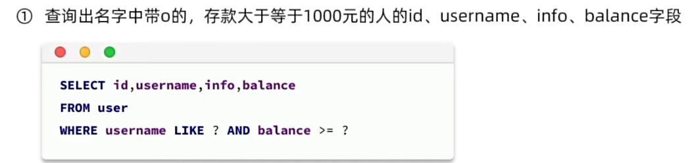

# 入门

### 使用MybatisPlus的基本步骤

- 引入MybatisPls依赖，代替Mybatis依赖

  ```xml
  <dependency>
      <groupId>com.baomidou</groupId>
      <artifactId>mybatis-plus-boot-starter</artifactId>
      <version>3.5.3.1</version>
  </dependency>
  ```

- 定义Mapper接口并继承BaseMapper

  ```java
  public interface UserMapper extends BaseMapper<User>{
  }
  ```

  泛型为与数据库记录类型相对应的bean。

- 在实体类上添加注解声名表信息

- 在`applicaton.yml`中根据需要添加配置


## 常见注解

在了解常用注解之前，我们先来看看MybatisPlus是如何直到我们要访问哪张表，又是怎么知道表中有哪些信息的呢？

其实，我们由于指定了泛型，所以MybatisPlus可以通过扫描实体类，并基于反射获取实体类信息作为数据库表信息。

规则如下：

- 类名驼峰转下划线作为表名
- 名为id的字段作为主键
- 变量名驼峰转下划线作为表的字段名

（约定大于配置）


但当我们没有遵守约定时，要怎么定义表名、字段名、主键名呢？

那么就需要用到注解。


常见注解：

- @TableName：用来指定表名

- @Tabled：用来指定表中主键字段信息（一定要有一个主键）

  主键还可以指定类型（自增长等），使用@Tabled注解中的type参数。(不指定默认为雪花算法生成的long类型值)

  - AUTO：数据库对id进行自增长
  - INPUT：通过set方法自行输入
  - ASSIGN_ID：分配ID，接口IdentifierGenerator的方法nextId来生成id，默认实现类为DefaultIdentifierGenerator雪花算法

  ```java
  @TableId(value="id"  ,type=IdType.AUTO )
           //数据库主键名       //枚举类IdType
  ```

- @TableField：用来指定表中普通字段信息

  使用@TableField的场景：

  - 成员变量名与数据库字段名不一致
  - 成员变量名以is开头，且是布尔值（这种情况经过反射处理会把is去掉，以后面的名称作为字段名，导致映射失败）
  - 成员变量名与数据库关键字冲突，（例如order指定为@TableField("\`order\`")）
  - 成员变量不是数据库字段（ @TableField(exist=false) ）


更多注解参考[注解配置 | MyBatis-Plus](https://baomidou.com/reference/annotation/)


## 常见配置


- 别名扫描包指定的包应为pojo所在包，其中包的别名默认为类名（不包含包的全路径）。这样在使用时会方便很多。


其他配置参考[使用配置 | MyBatis-Plus](https://baomidou.com/reference/#_top)


# 核心功能

## 条件构造器

MybatisPlus支持各种复杂的where条件，可以满足日常开发的所有需求。

wrapper的体系结构：


下面来演示其中UpdateWrapper和QueryWrapper两个条件构造器的使用

- QueryWrapper

需求以及原本的sql语句实现：



使用mp：

```java
//1.构建查询条件
QueryWrapper<User> wrapper =new QueryWrapper<User>()
        .select("id","username","info","balance")
        .like("username","o")
        .ge("balance",1000);
//2.查询：
List<User> users=userMapper.selectList(wrapper);
users.forEach(System.out::println);
```


使用mp：

```java
//1.要更新的数据：
User user = new User();
user.setBalance(2000);
//2.更新的条件：
QueryWrapper<User> wrapper =new QueryWrapper<User>()
        .eq("username","jack");
//3.执行更新
userMapper.update(user,wrapper);
```


- UpdateWrapper


使用mp：

```java
List<Long> ids=List.of(1L,2L,4L);
UpdateWrapper<User> wrapper =new UpdateWrapper<User>()
        .setSql("balance=balance-200")
        .in("id",ids);
userMapper.update(null,wrapper);
```


除了这两wrapper之外，还有lambda的wrapper，这是由于比如说在上面的演示中，我们把字段名都写死了，造成了硬编码的问题。lambda的wrapper就是用来解决这种问题的。

演示lambdaQueryWrapper:

例如使用lambdaQueryWrapper来代替上面演示的第一种QueryWrapper的用法：

```java
//1.构建查询条件
LambdaQueryWrapper<User> wrapper =new LambdaQueryWrapper<User>()
        .select(User::getId,User::getUsername,User::getInfo,User::getBalance)
        .like(User::getUsername,"o")
        .ge(User::getBalance,1000);
//2.查询：
List<User> users=userMapper.selectList(wrapper);
users.forEach(System.out::println);
```

| 特性         | `QueryWrapper`       | `LambdaQueryWrapper` |
| ------------ | -------------------- | -------------------- |
| 字段引用方式 | 字符串               | Lambda 表达式        |
| 拼写错误风险 | 高                   | 低                   |
| IDE 支持     | 不支持自动补全和重构 | 支持自动补全和重构   |
| 编译期检查   | 无                   | 有                   |
| 适用场景     | 动态字段名           | 静态字段名           |


- QueryWrapper和lambdaQueryWrapper通常用来构建select、delete、update、where条件部分
- UpdateWrapper和LambdaUpdateWrapper通常只有在set语句比较特殊时才使用

- 在开发过程中，尽量使用lambdaQueryWrapper和lambdaUpdateWrapper，避免硬编码


## 自定义SQL

我们可以利用mp的wrapper来构建复杂的where条件，然后自己定义sql语句剩下的部分。

示例：


这就保证了不在业务层编写sql，遵循了企业规范，同时又用mp简化了代码开发。


```java
//1.模拟前端传给我们的更新条件
List<Long> ids=List.of(1L,2L,4L);
int amount=200;
//2.定义条件
QueryWrapper<User> wrapper =new QueryWrapper<User>().in("id",ids);
//3.调用自定义方法
userMapper.updateBalanceByIds(wrapper,amount);
```

mapper接口中方法：

```java
void updateBalanceByIds(@Param("ew") QueryWrapper<User> wrapper,
                        @Param("amount") int amount);
```

mapper.xml中的sql拼接：

```xml
<update id="updateBlanceByIds">
    update user set balance=balance-#{amount} ${ew.customSqlSegment}
</update>
```


还可以将sql拼接直接写在方法上：

```java
@Update(" update user set balance=balance-#{amount} ${ew.customSqlSegment}")
void updateBalanceByIds(@Param("ew") QueryWrapper<User> wrapper,
                        @Param("amount") int amount);
```


## Service接口

service接口中有更多的方法。

在使用时，我们需要让UserService接口继承IService接口，并且mp给我们提供了一个IService的实现类ServiceImpl，我们的UserServiceImpl不仅要实现UserService，还要继承ServiceImpl。（因为如果仅仅让UserService继承IService接口，再让UserServiceImpl实现UserService接口，那么就需要重写IService中的很多方法，达不到简化代码编写的目的）


举例：

自定义service接口：

```java
public interface IUserService implements IService<User>{
}
```

service实现类：

```java
@Service
public class UserServiceImpl extends ServiceImpl<UserMapper, User> implements IUserService {
}
```

测试：

```java
@Autowired
private IUserService userService;
@Test
void testSaveUser(){
    User user = new User();
    user.setId(5L);
    user.setUsername("Lucy");
    user.setPassword("123");
    user.setPhone("18688990011");
    user.setBalance(200);
    user.setInfo("{\"age\": 24, \"intro\": \"英文老师\", \"gender\": \"female\"}");
    user.setCreateTime(LocalDateTime.now());
    user.setUpdateTime(LocalDateTime.now());
    userService.save(user);
}
```


### 怎么选择使用service还是mapper中的方法

业务较为简单，只需要基础的增删改查时，直接调用mp在service中提供的方法即可。

如果需要执行一些业务，可以自定义service，在里面定义一些业务逻辑。

如果baseMapper和IService中的方法不足以满足增删改查需求了，就需要自定义mapper并定义方法以自定义sql语句。

综上，其实basemapper中的方法用到的比较少。


## Lambda方法

x示例：


mybatis原生写法:


lambda查询写法：


定义UserQuery类来接收过滤条件：

```java
@Data
public class UserQuery {
    private String name;
    private Integer status;
    private Integer minBalance;
    private Integer maxBalance;
}
```

controller：

```java
@GetMapping("/list")
public List<UserVO> queryUsers(UserQuery query){
    List<User> users=userService.queryUsers(query.getName(),query.getStatus(),query.getMaxBalance(),query.getMinBalance());
}
```

在service接口中定义方法：

```java
List<User> queryUsers(String name,Integer status,Integer minBalance,Integer MaxBalace);
```

实现方法：

```java
@Override
List<User> queryUsers(String name,Integer status,Integer minBalance,Integer maxBalance){
    return lambdaQuery()
            .like(name!=null,User::getUsername,name)
            .eq(status!=null,User::getStatus,status)
            .ge(minBalance!=null,User::getMinBalance,minBalance)
            .le(maxBalance!=null,User::getMaxBalance,maxBalance)
            .list();
}
```


同时还有lambdaUpdate()，参考[持久层接口 | MyBatis-Plus](https://baomidou.com/guides/data-interface/#chain)


lambda主要用于复杂条件。


## Iservice批量新增

需求：

批量插入10万条用户数据

- 普通for循环插入

  

  这种方法每插入一条都要发一次网络请求，但网络请求是比较慢的，就造成了这种方式很慢

- 默认情况下mp的批量新增：

  

  ​	这样虽然1000条才发一次网络请求，但每次新增仍然是一条sql语句。

  ​	我们想要如下格式来增加性能：

  ​	

- 在jdbc的url中添加参数`rewriteBatchedStatements=true`即可


# 扩展功能

## 代码生成器

MybatisX或MyBatisPlus


## Db静态工具

 Db静态工具中的方法基本与IService中的方法一致，但其都是静态方法，无法指定泛型，为了获取器操作的对象的类型，传参时某些方法就需要传入class。

既然Db静态工具与IService中的方法大致相同，那为什么还需要Db呢？


为了对数据库表进行操作，我们需要针对其定义Mapper、Service。但由于Iservice中的方法功能更加强大，我们更倾向于使用Service。但如果我们在一个Service中需要查到另一张表中的数据，就要注入另一张表的Service。那么如果出现双向注入的情况，就会产生循环依赖的问题。

因此，Db的产生还是很有必要的。


举例：

编写根据id批量查询用户的接口，查询用户，并查询出用户对应的所有地址

controller的代码省略，重点不在这。

UserServiceImpl中的方法：

```java
    @Override
    public List<UserVO> queryUserAndAddressByIds(List<Long> ids){
        //1.查询用户
        List<User> users=listByIds(ids);//listByIds也是本类方法
        if(CollUtil.isEmpty(users)){
            return Collections.emptyList();
        }
        //2.查询地址
        //2.1获取用户id集合
        List<Long> userIds=users.stream().map(User::getId).collect(Collectors.toList());
        //2.2根据用户id查询地址
        List<Address> addresses= Db.lambdaQuery(Address.class).in(Address::getUserId,userIds).list();
        //2.3转换地址VO
        List<AddressVO> addressVOList=BeanUtil.copyToList(addresses,AddressVO.class);
        //2.4用户地址集合分组处理，相同用户的分为一组
        Map<Long,List<AddressVO>> addressMap=new HashMap<>(0);
        if(CollUtil.isNotEmpty(addressVOList)){
            addressMap=addressVOList.stream().collect(Collectors.groupingBy(AddressVO::getUserId));
        }

        //3.转换VO返回
        List<UserVO> list=new ArrayList<>(users.size());
        for(User user:users){
            //3.1转换User的PO为VO
            UserVO vo= BeanUtil.copyProperties(user,UserVO.class);
            list.add(vo);
            //3.2转换地址VO
            vo.setAddresses(addressMap.get(user.getId()));
        }
        return list;
    }
```

这种方法是比拿到每个用户的id , 顺便用这个id查询地址的效率要高的。


## 逻辑删除

逻辑删除就是基于代码逻辑模拟删除的效果，但并不会真正的删除数据。思路如下：

- 在表中添加一个字段标记数据是否被删除
- 当删除数据时把标记设置为1
- 查询时只查询标记为0的数据


我们发现如果这样，那增删改查都需要加上deleted条件，而mp本身并没有给我们提供加上了deleted条件的方法。那这样mp就不能用了吗？


接下来再调用removeById方法，执行的就是将flag改为1，而不是直接删除记录。

以上进行的配置是全局配置，我们还可以单独针对某一张表实现逻辑删除，只需要在表对应的实体类的对应成员变量上添加`@TableLogic`注解。


**此外，我们还可以自定义注解实现逻辑删除：**

如果你没有使用 MyBatis-Plus，或者需要更灵活的逻辑删除功能，可以通过自定义注解和 AOP（面向切面编程）来实现。

(1) 定义逻辑删除注解

创建一个自定义注解 `@LogicalDelete`：

java深色版本

```
import java.lang.annotation.ElementType;
import java.lang.annotation.Retention;
import java.lang.annotation.RetentionPolicy;
import java.lang.annotation.Target;

@Target(ElementType.METHOD)
@Retention(RetentionPolicy.RUNTIME)
public @interface LogicalDelete {
    String value(); // 删除条件字段名
}
```

(2) 编写 AOP 切面

使用 AOP 拦截带有 `@LogicalDelete` 注解的方法，并执行逻辑删除操作：

java深色版本

```
import org.aspectj.lang.annotation.Aspect;
import org.aspectj.lang.annotation.Before;
import org.springframework.stereotype.Component;

@Aspect
@Component
public class LogicalDeleteAspect {

    @Before("@annotation(logicalDelete)")
    public void handleLogicalDelete(LogicalDelete logicalDelete) {
        String field = logicalDelete.value();
        System.out.println("执行逻辑删除，更新字段: " + field + " = 1");
        // 在这里编写实际的 SQL 更新逻辑
    }
}
```

(3) 在 Service 方法上使用注解

在需要逻辑删除的地方，添加 `@LogicalDelete` 注解：

java深色版本

```
import org.springframework.stereotype.Service;

@Service
public class UserService {

    @LogicalDelete("is_deleted")
    public void deleteUser(Long userId) {
        // 这里的方法体可以为空，AOP 会拦截并执行逻辑删除
    }
}
```


逻辑删除本身也有自己的问题，比如：

- 会导致数据库表垃圾数据越来越多，影响查询效率
- SQL中全都需要对逻辑删除字段做判断，影响查询效率


## 枚举处理器

当有一些成员变量的取值是有限的时候，比如说用户状态，这时如果用0，1等数字去表示，不仅在开发时会造成不便，也会使代码可读性变得很差。那么这时可以使用枚举类型，枚举类型的成员变量包括int类型的value，还有String类型的描述。然后我们就可以把原本类型是int的成员变量改为类型为枚举类型。（如果存在VO也要改）


但这又造成了一个问题，java代码中此变量是枚举类型的，但是在数据库中定义的是int类型的。

在之前，如果java和数据库中的类型是不一样的，是由mybatis在底层给我们进行转换的（见`org.apache.ibatis.type`包下的BaseTypeHandler）。但是它定义的Enum类型相关的转换不能满足我们的要求。

但是mp又给我们定义了一个更强大的关于enum类型转换的handler，叫做MybatisEnumTypeHandler。


如何使用：

- 给枚举类型中的int变量加上@EnumValue注解，这样就知道是将这个值存入数据库。

- 加上配置启用handler。

  

- 在给前端返回时，默认返回的时枚举项的名字，要想返回枚举项的某一个成员变量，给枚举类中的对应成员变量加上`@JsonValue`注解。


## Json处理器

除了上面的枚举处理器之外，mp还定义了一个AbstractJsonTypeHandler，用于将数据库中json类型的字段转换。

默认数据库中的json字段能够转成java中的string对象，但这样想要取出此json字段里面的某个值，就很不方便。


于是我们自定义一个对象，对象的成员变量去对应json里的key，并使用JacksonTypeHandler（AbstractJsonTypeHandler的实现类），进行json和对象之间的转化。

使用方法：

- 此处理器没有全局配置来开启。只能使用注解。
- 在po（和vo）中对应的变量的类型改为对应json的类型。
- 在po的成员变量上加上注解`@TableField(value="",TypeHandler=JacksonTypeHandler.class)`
- 因为实体类中存在复杂类型字段（自定义的类型），需要开启自动结果集映射。在实体类上加上`@TableName(value="user",autoResultMap=true)`


# 插件功能


## 分页插件

### 使用

在配置类中注册MyBatisPlus的核心插件，同时添加分页插件：

```java
@Configuration
public class MyBatisConfig {
    @Bean
    public MybatisPlusInterceptor mybatisPlusInterceptor() {
        MybatisPlusInterceptor interceptor = new MybatisPlusInterceptor();
        //1.创建分页插件
        PaginationInnerInterceptor paginationInnerInterceptor = new PaginationInnerInterceptor();
        paginationInnerInterceptor.setMaxLimit(1000L);
        //2.添加分页插件
        interceptor.addInnerInterceptor(paginationInnerInterceptor);
        return interceptor;
    }
}
```

实现分页功能：

```java
@Test
void testPageQuery(){
    int pageNo=1;
    int pageSize=2;
    //1.准备分页条件
    //1.1分页条件
    Page<User> page=Page.of(pageNo,pageSize);
    //1.2排序条件
    //可以多个参数排序，第一个相等就用第二个比较
    //false代表降序
    page.addOrder(new OrderItem("balance",false));
    page.addOrder(new OrderItem("createTime",false));
    //2.分页查询
    uuserService.page(page);
    //3.解析
    long total=page.getTotal();
    long pages = page.getPages();
    List<User> users=page.getRecords();
}
```


### 实例：通用分页实体

统一查询条件及返回值的结构。 


需求：


返回值：


**先定义查询条件的实体**

UserQuery:

```java
@Data
public class UserQuery {
    private String name;
    private Integer status;
    private Integer minBalance;
    private Integer maxBalance;
}
```

根据需求，我们还需要封装一些page相关的参数，虽然可以直接封装在此类中，但是在实际业务中，不只是查询user时需要这些page相关的参数，所以定义一个单独的分页查询实体类

PageQuery:

```java
@Data
public class PageQuery {
    private Integer pageNo;
    private Integer pageSize;
    private String SortBy;
    private Boolean isAsc;
}
```

那么就需要让UserQuery继承PageQuery。


返回值结构：

PageDTO:

```java
@Data
public class PageDTO {
    private Long total;
    private Long pages;
    private List<?> list;
}
```


controller:

```java
   @GetMapping("/page")
    public PageDTO<UserVO> queryUsersPage(UserQuery query){
        return userService.queryUserPage(query);
    }
```

UserServiceImpl:

```java
    @Override
    public PageDTO<UserVO> queryUsersPage(UserQuery query){
        String name=query.getName();
        Integer status =query.getStatus();
        //1.构建查询条件
        //1.1分页条件
        Page<User> page= Page.of(query.getPageNo(),query.getPageSize());
        //1.2排序条件
        if(StrUtil.isNotBlank(query.getSortBy())){
            page.addOrder(new OrderItem(query.getSortBy(),query.getIsAsc()));
        } else{
            page.addOrder(new OrderItem("update_time",false));
        }
        //2.分页查询
        lambdaQuery()
                .like(name!=null,User::getUsername,name)
                .eq(status!=null,User::getStatus,status)
                .page(page);
        //3.封装VO结果
        PageDTO<UserVO> dto=new PageDTO<>();
        //3.1总条数
        dto.setTotal(page.getTotal());
        //3.2总页数
        dto.setPages(page.getPages());
        //3.3当前页数据
        List<User> records =page.getRecords();
        if(CollUtil.isNotEmpty(records)) {
            dto.setList(Collections.emptyList());
            return dto;
        }
        //3.4拷贝user的VO
        dto.setList(BeanUtil.copyToList(records,UserVO.class));
        //4.返回
        return dto;
    }
```


### 通用分页实体改进

发现在如上UserServiceImpl中，将query条件封装成page对象的过程（即1过程）比较麻烦，且跟业务没什么关系（逻辑是通用的），最好把它做成一个工具。

并且3过程也可以封装。

所以需求如下：


PageQuery：

```java
@Data
public class PageQuery {
    //给默认值，前端提交则覆盖。访问空指针报错
    private Integer pageNo=1;
    private Integer pageSize=5;
    private String SortBy;
    private Boolean isAsc=true;

    public <T> Page<T> toMpPage(OrderItem ... items) {
        //1分页条件
        Page<T> page= Page.of(pageNo,pageSize);
        //2排序条件
        if(StrUtil.isNotBlank(SortBy)){
            page.addOrder(new OrderItem(SortBy,isAsc);
        } else if(items!=null){
            page.addOrder(items);
        }
        return page;
    }
    //常用createTime作为SortBy为空时的默认排序，所以单独再写一个方法
    public <T> Page<T> toMpPageDefaultSortByCreateTime(){
        return toMpPage(new OrderItem("createTime",false));
    }
    //常用UpdateTime作为SortBy为空时的默认排序，所以单独再写一个方法
    public <T> Page<T> toMpPageDefaultSortByUpdateTime(){
        return toMpPage(new OrderItem("updateTime",false));
    }
}
```

PageDTO:

```java
@Data
public class PageDTO {
    private Long total;
    private Long pages;
    private List<?> list;

    public static <PO,VO>  PageDTO<VO> of(Page<PO> page, Class<VO> clazz){
        PageDTO<VO> dto=new PageDTO<>();
        //1总条数
        dto.setTotal(page.getTotal());
        //2总页数
        dto.setPages(page.getPages());
        //3当前页数据
        List<PO> records =page.getRecords();
        if(CollUtil.isNotEmpty(records)) {
            dto.setList(Collections.emptyList());
            return dto;
        }
        //4拷贝user的VO
        dto.setList(BeanUtil.copyToList(records,clazz));
        //5.返回
        return dto;
    }
}
```

UserServiceImpl:

```java
@Override
public PageDTO<UserVO> queryUsersPage(UserQuery query){
    String name=query.getName();
    Integer status =query.getStatus();
    //1.构建分页条件
    Page<User> page=query.toMpPageDefaultSortByUpdateTime();

    //2.分页查询
    lambdaQuery()
            .like(name!=null,User::getUsername,name)
            .eq(status!=null,User::getStatus,status)
            .page(page);
    //3.封装VO结果
    return PageDTO.of(page,UserVO.class);
}
```


以上工具类的PO转VO是调用copyToList方法自动转化的，如果想要自己转化（方便执行一些业务逻辑），可以如下来做：

将上面PageDTO中的of方法的形参改为：

`public static <PO,VO>  PageDTO<VO> of(Page<PO> page, Function<PO,VO> convertor)`

第4步拷贝语句改为：

`dto.setList(records.stream().map(convertor).collect(Collectors.toList()));`

接着UserServiceImpl中方法的返回值可以改为：

```java
return PageDTO.of(page,user -> {
	//1.拷贝基础属性
	UserVO vo=BeanUtil.copyProperties(user,UserVO.class);
	//2.处理特殊逻辑，比如将用户名后两位隐藏，改为**。
	vo.setUsername(vo.getUsername().subString(0,vo.getUsername().length()-2)+"**");
	return vo;
})
```


但是这样封装工具方法都封装到了实体类内部，与mp耦合度很高。所以可以单独定义工具类，负责书写mp的page相关转换的方法。

要是不用mp，可以再定义其他工具类封装和其他工具的page转换相关的方法。