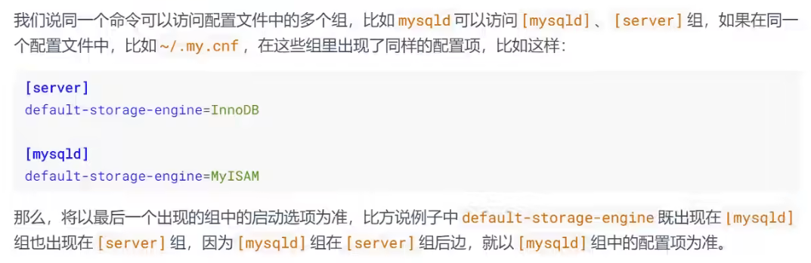

# 前置

## 远程连接mysql

- `telnet ip port`从windows检测能否连接至linux上的mysql。

- 防火墙开放linux3306端口

- 修改linux上mysql中mysql数据库user表中的**root**用户对应的host，使root用户能够在windows上进行登录，这里为了方便使用通配符改为`%`

- `flush privileges`刷新权限

- `ALTER USER 'root'@'%' IDENTIFIED BY 'abc123';`

- 修改`/etc/mysql/my.cnf`下的配置

  ```
  //修改密码的要求等级
  [mysqld]
  validate_password.policy=LOW
  validate_password.length=6
  //设置mysql监听所有ip
  bind-address = 0.0.0.0
  ```

- 在`/var/run`下创建mysqld目录

然后就可以远程连接了。


## 字符集

`show variables like '%char%'`查看相关配置

`show create table/database 名`可以查看表或数据库使用的字符集

mysql8中默认使用的是utf8mb4，默认情况下不会进行更改


### 各级别字符集

MySQL有4个级别的字符集和比较规则，分别是：

- 服务器级别
- 数据库级别
- 表级别
- 列(字段)级别

`show variables like '%char%'`查看相关配置


- character_set_server：服务器级别的字符集
- character_set_database：当前数据库的字符集
- character_set_client：服务器解码请求时使用的字符集
- character_set_connection：服务器处理请求时会把请求字符串从character_set_client转为character_set_connection
- character_set_results：服务器向客户端返回数据时使用的字符集


1.utf8与utf8mb4


### 请求到响应过程中字符集的变化


流程：


所以操作系统的字符集要和character_set_client、character_set_results一样


## sql大小写规范

### win和linux区别

windows系统默认大小写不敏感，linux系统是大小写敏感的

通过如下命令查看：

```
show variables like '%lower_case_table_names%';
```

linux下显示为0，win为1

- 默认为0，大小写敏感
- 1，大小写不敏感；创建的表、数据库都是以小写的形式存放在磁盘上，对于sql语句都是转换为小写
- 2，创建的表和数据库根据操作语句中的大小写存放，凡是查找都转换为小写进行


### 建议

1. 关键字和函数名全部大写
2. 数据库名、表名、表别名、字段名、字段别名等全部小写
3. sql语句分别以分号结尾


## sql_mode

### 宽松模式、严格模式


### 模式查看和设置

查看：

```mysql
select @@session.sql_mode
select @@global.sql_mode
show variables like 'sql_mode';
```

临时设置：

```mysql
set session sql_mode='';# 会话，会话结束失效
set global sql_mode='';# 全局，重启后失效
```

永久设置：

```
在/etc/mysql/my.cnf中配置sql_mode，然后重启
```

生产环境是进制重启的，所以采用`临时设置方式+永久设置方式`来解决线上的问题


# mysql数据目录

## MySQL8的主要目录结构

```bash
find / -name mysql
#查看mysql各种目录
```

我们查看到的各种目录如下:

### 数据库文件的存放路径

MySQL数据库文件的存放路径：`/var/lib/mysql/`

```bash
mysql> show variables like 'datadir';
+---------------+-----------------+
| Variable_name | Value |
+---------------+-----------------+
| datadir | /var/lib/mysql/ |
+---------------+-----------------+
1 row in set (0.04 sec)
```

从结果中可以看出，在我的计算机上MySQL的数据目录就是 `/var/lib/mysql/` 。


### 相关命令目录

相关命令目录：`/usr/bin`（mysqladmin、mysqlbinlog、mysqldump等命令）和`/usr/sbin`。


### 配置文件目录

配置文件目录：`/usr/share/mysql-8.0`（命令及配置文件），`/etc/mysql`（如my.cnf）


## 数据库和文件系统的关系


### 查看默认数据库

查看一下在我的计算机上当前有哪些数据库：

```mysql
mysql> SHOW DATABASES;
```

可以看到有4个数据库是属于MySQL自带的系统数据库。

- mysql

  MySQL 系统自带的核心数据库，它存储了MySQL的用户账户和权限信息，一些存储过程、事件的定义信息，一些运行过程中产生的日志信息，一些帮助信息以及时区信息等。

- information_schema

  MySQL 系统自带的数据库，这个数据库保存着MySQL服务器 维护的所有其他数据库的信息 ，比如有哪些表、哪些视图、哪些触发器、哪些列、哪些索引。这些信息并不是真实的用户数据，而是一些描述性信息，有时候也称之为 元数据 。在系统数据库 information_schema 中提供了一些以innodb_sys 开头的表，用于表示内部系统表。

  ```
  mysql> USE information_schema;
  Database changed
  mysql> SHOW TABLES LIKE 'innodb_sys%';
  +--------------------------------------------+
  | Tables_in_information_schema (innodb_sys%) |
  +--------------------------------------------+
  | INNODB_SYS_DATAFILES 						 |
  | INNODB_SYS_VIRTUAL 						 |
  | INNODB_SYS_INDEXES 						 |
  | INNODB_SYS_TABLES 						 |
  | INNODB_SYS_FIELDS 						 |
  | INNODB_SYS_TABLESPACES 					 |
  | INNODB_SYS_FOREIGN_COLS 					 |
  | INNODB_SYS_COLUMNS 						 |
  | INNODB_SYS_FOREIGN 						 |
  | INNODB_SYS_TABLESTATS 					 |
  +--------------------------------------------+
  10 rows in set (0.00 sec)
  ```

- performance_schema

  MySQL 系统自带的数据库，这个数据库里主要保存MySQL服务器运行过程中的一些状态信息，可以用来 监控 MySQL 服务的各类性能指标 。包括统计最近执行了哪些语句，在执行过程的每个阶段都花费了多长时间，内存的使用情况等信息。

- sys

  MySQL 系统自带的数据库，这个数据库主要是通过 视图 的形式把 information_schema 和performance_schema 结合起来，帮助系统管理员和开发人员监控 MySQL 的技术性能。


### 数据库在文件系统的表示

看一下我的计算机上的数据目录下的内容：

```bash
[root@atguigu01 mysql]# cd /var/lib/mysql
[root@atguigu01 mysql]# ll
总用量 189980
-rw-r-----. 1 mysql mysql 56 7月 28 00:27 auto.cnf
-rw-r-----. 1 mysql mysql 179 7月 28 00:27 binlog.000001
-rw-r-----. 1 mysql mysql 820 7月 28 01:00 binlog.000002
-rw-r-----. 1 mysql mysql 179 7月 29 14:08 binlog.000003
-rw-r-----. 1 mysql mysql 582 7月 29 16:47 binlog.000004
-rw-r-----. 1 mysql mysql 179 7月 29 16:51 binlog.000005
-rw-r-----. 1 mysql mysql 179 7月 29 16:56 binlog.000006
-rw-r-----. 1 mysql mysql 179 7月 29 17:37 binlog.000007
-rw-r-----. 1 mysql mysql 24555 7月 30 00:28 binlog.000008
-rw-r-----. 1 mysql mysql 179 8月 1 11:57 binlog.000009
-rw-r-----. 1 mysql mysql 156 8月 1 23:21 binlog.000010
-rw-r-----. 1 mysql mysql 156 8月 2 09:25 binlog.000011
-rw-r-----. 1 mysql mysql 1469 8月 4 01:40 binlog.000012
-rw-r-----. 1 mysql mysql 156 8月 6 00:24 binlog.000013
-rw-r-----. 1 mysql mysql 179 8月 6 08:43 binlog.000014
-rw-r-----. 1 mysql mysql 156 8月 6 10:56 binlog.000015
-rw-r-----. 1 mysql mysql 240 8月 6 10:56 binlog.index
-rw-------. 1 mysql mysql 1676 7月 28 00:27 ca-key.pem
-rw-r--r--. 1 mysql mysql 1112 7月 28 00:27 ca.pem
-rw-r--r--. 1 mysql mysql 1112 7月 28 00:27 client-cert.pem
-rw-------. 1 mysql mysql 1676 7月 28 00:27 client-key.pem
drwxr-x---. 2 mysql mysql 4096 7月 29 16:34 dbtest
-rw-r-----. 1 mysql mysql 196608 8月 6 10:58 #ib_16384_0.dblwr
-rw-r-----. 1 mysql mysql 8585216 7月 28 00:27 #ib_16384_1.dblwr
-rw-r-----. 1 mysql mysql 3486 8月 6 08:43 ib_buffer_pool
-rw-r-----. 1 mysql mysql 12582912 8月 6 10:56 ibdata1
-rw-r-----. 1 mysql mysql 50331648 8月 6 10:58 ib_logfile0
-rw-r-----. 1 mysql mysql 50331648 7月 28 00:27 ib_logfile1
-rw-r-----. 1 mysql mysql 12582912 8月 6 10:56 ibtmp1
drwxr-x---. 2 mysql mysql 4096 8月 6 10:56 #innodb_temp
drwxr-x---. 2 mysql mysql 4096 7月 28 00:27 mysql
-rw-r-----. 1 mysql mysql 26214400 8月 6 10:56 mysql.ibd
srwxrwxrwx. 1 mysql mysql 0 8月 6 10:56 mysql.sock
-rw-------. 1 mysql mysql 5 8月 6 10:56 mysql.sock.lock
drwxr-x---. 2 mysql mysql 4096 7月 28 00:27 performance_schema
-rw-------. 1 mysql mysql 1680 7月 28 00:27 private_key.pem
-rw-r--r--. 1 mysql mysql 452 7月 28 00:27 public_key.pem
-rw-r--r--. 1 mysql mysql 1112 7月 28 00:27 server-cert.pem
-rw-------. 1 mysql mysql 1680 7月 28 00:27 server-key.pem
drwxr-x---. 2 mysql mysql 4096 7月 28 00:27 sys
drwxr-x---. 2 mysql mysql 4096 7月 29 23:10 temp
-rw-r-----. 1 mysql mysql 16777216 8月 6 10:58 undo_001
-rw-r-----. 1 mysql mysql 16777216 8月 6 10:58 undo_002
```

这个数据目录下的文件和子目录比较多，除了 information_schema 这个系统数据库外，其他的数据库在 数据目录 下都有对应的子目录。

以我的 temp 数据库为例，在MySQL5.7 中打开：

```
[root@atguigu02 mysql]# cd ./temp
[root@atguigu02 temp]# ll
总用量 1144
-rw-r-----. 1 mysql mysql 8658 8月 18 11:32 countries.frm
-rw-r-----. 1 mysql mysql 114688 8月 18 11:32 countries.ibd
-rw-r-----. 1 mysql mysql 61 8月 18 11:32 db.opt
-rw-r-----. 1 mysql mysql 8716 8月 18 11:32 departments.frm
-rw-r-----. 1 mysql mysql 147456 8月 18 11:32 departments.ibd
-rw-r-----. 1 mysql mysql 3017 8月 18 11:32 emp_details_view.frm
-rw-r-----. 1 mysql mysql 8982 8月 18 11:32 employees.frm
-rw-r-----. 1 mysql mysql 180224 8月 18 11:32 employees.ibd
-rw-r-----. 1 mysql mysql 8660 8月 18 11:32 job_grades.frm
-rw-r-----. 1 mysql mysql 98304 8月 18 11:32 job_grades.ibd
-rw-r-----. 1 mysql mysql 8736 8月 18 11:32 job_history.frm
-rw-r-----. 1 mysql mysql 147456 8月 18 11:32 job_history.ibd
-rw-r-----. 1 mysql mysql 8688 8月 18 11:32 jobs.frm
-rw-r-----. 1 mysql mysql 114688 8月 18 11:32 jobs.ibd
-rw-r-----. 1 mysql mysql 8790 8月 18 11:32 locations.frm
-rw-r-----. 1 mysql mysql 131072 8月 18 11:32 locations.ibd
-rw-r-----. 1 mysql mysql 8614 8月 18 11:32 regions.frm
-rw-r-----. 1 mysql mysql 114688 8月 18 11:32 regions.ibd
```

在MySQL8.0中打开：

```
[root@atguigu01 mysql]# cd ./temp
[root@atguigu01 temp]# ll
总用量 1080
-rw-r-----. 1 mysql mysql 131072 7月 29 23:10 countries.ibd
-rw-r-----. 1 mysql mysql 163840 7月 29 23:10 departments.ibd
-rw-r-----. 1 mysql mysql 196608 7月 29 23:10 employees.ibd
-rw-r-----. 1 mysql mysql 114688 7月 29 23:10 job_grades.ibd
-rw-r-----. 1 mysql mysql 163840 7月 29 23:10 job_history.ibd
-rw-r-----. 1 mysql mysql 131072 7月 29 23:10 jobs.ibd
-rw-r-----. 1 mysql mysql 147456 7月 29 23:10 locations.ibd
-rw-r-----. 1 mysql mysql 131072 7月 29 23:10 regions.ibd
```


### 表在文件系统中的表示

#### InnoDB存储引擎模式

##### 表结构

为了保存表结构， InnoDB 在 数据目录 下对应的数据库子目录下创建了一个专门用于 描述表结构的文件 ，文件名是这样：

```
表名.frm
```

比方说我们在 atguigu 数据库下创建一个名为 test 的表：

```
mysql> USE atguigu;
Database changed

mysql> CREATE TABLE test (
	-> c1 INT
	-> );
Query OK, 0 rows affected (0.03 sec)
```

那在数据库 atguigu 对应的子目录下就会创建一个名为 test.frm 的用于描述表结构的文件。.frm文件的格式在不同的平台上都是相同的。这个后缀名为.frm是以 二进制格式 存储的，我们直接打开是乱码的。


##### 表中数据和索引

1. **系统表空间（system tablespace）**

默认情况下，InnoDB会在数据目录下创建一个名为 ibdata1 、大小为 12M 的文件，这个文件就是对应的 系统表空间 在文件系统上的表示。怎么才12M？注意这个文件是 自扩展文件 ，当不够用的时候它会自己增加文件大小。

当然，如果你想让系统表空间对应文件系统上多个实际文件，或者仅仅觉得原来的 ibdata1 这个文件名难听，那可以在MySQL启动时配置对应的文件路径以及它们的大小，比如我们这样修改一下my.cnf 配置文件：

```
[server]
innodb_data_file_path=data1:512M;data2:512M:autoextend
```


2. **独立表空间（file-per-table tablespace）**

在MySQL5.6.6以及之后的版本中，InnoDB并不会默认的把各个表的数据存储到系统表空间中，而是为 每一个表建立一个独立表空间 ，也就是说我们创建了多少个表，就有多少个独立表空间。使用 独立表空间 来存储表数据的话，会在该表所属数据库对应的子目录下创建一个表示该独立表空间的文件，文件名和表名相同，只不过添加了一个 .ibd 的扩展名而已，所以完整的文件名称长这样：

```
表名.ibd
```

比如：我们使用了 独立表空间 去存储 atguigu 数据库下的 test 表的话，那么在该表所在数据库对应的 atguigu 目录下会为 test 表创建这两个文件：

```
test.frm
test.ibd
```

其中 test.ibd 文件就用来存储 test 表中的数据和索引。


3. **系统表空间和独立表空间的设置**

我们可以自己指定使用 系统表空间 还是 独立表空间 来存储数据，这个功能由启动参数innodb_file_per_table 控制，比如说我们想刻意将表数据都存储到 系统表空间 时，可以在启动MySQL服务器的时候这样配置：

```
[server]
innodb_file_per_table=0 # 0：代表使用系统表空间； 1：代表使用独立表空间
```

默认情况：

```
mysql> show variables like 'innodb_file_per_table';
+-----------------------+-------+
| Variable_name | Value |
+-----------------------+-------+
| innodb_file_per_table | ON |
+-----------------------+-------+
1 row in set (0.01 sec)
```


4. **其他类型的表空间**

随着MySQL的发展，除了上述两种老牌表空间之外，现在还新提出了一些不同类型的表空间，比如通用表空间（general tablespace）、临时表空间（temporary tablespace）等。


5.**疑问**

.frm在mysql8中不存在了？

这就需要解析.ibd文件。Oracle官方将frm文件的信息及更多信息移动到叫做序列化字典信息（Serialized Dictionary Information,SDI），SDI被写在ibd文件内部。MySQL8.0同属于Oracle旗下，同理。

为了从IBD文件中提取SDI信息，Oracle官方提供了一个应用程序ibd2sdi。

===ibd2sdi官方文档===

这个工具不需要下载，mysql8自带，只要配好环境变量就能到处用。

(1)查看表结构

到存储Ibd文件的目录下，执行下面命令：

```
ibd2sdi --dump-file=student.txt student.ibd
```

结果如图所示：


通过上面的测试结果可以发现：mysql8把之前版本的frm文件合并到ibd文件中了。


#### MyISAM存储引擎模式

##### 表结构

在存储表结构方面， MyISAM 和 InnoDB 一样，也是在 数据目录 下对应的数据库子目录下创建了一个专门用于描述表结构的文件：

```
表名.frm
```


##### 表中数据和索引

在MyISAM中的索引全部都是 二级索引 ，该存储引擎的 数据和索引是分开存放 的。所以在文件系统中也是使用不同的文件来存储数据文件和索引文件，同时表数据都存放在对应的数据库子目录下。假如 test表使用MyISAM存储引擎的话，那么在它所在数据库对应的 atguigu 目录下会为 test 表创建这三个文件：

```
test.frm 存储表结构
test.MYD 存储数据 (MYData)
test.MYI 存储索引 (MYIndex)
```

举例：创建一个 MyISAM 表，使用 ENGINE 选项显式指定引擎。因为 InnoDB 是默认引擎。

```mysql
CREATE TABLE `student_myisam` (
`id` bigint NOT NULL AUTO_INCREMENT,
`name` varchar(64) DEFAULT NULL,
`age` int DEFAULT NULL,
`sex` varchar(2) DEFAULT NULL,
PRIMARY KEY (`id`)
)ENGINE=MYISAM AUTO_INCREMENT=0 DEFAULT CHARSET=utf8mb3;
```


**mysql8：**


**mysql5.7：**


## 小结

举例： `数据库a ， 表b` 。

1、如果表b采用 `InnoDB` ，data\a中会产生1个或者2个文件：

- `b.frm` ：描述表结构文件，字段长度等

- 如果采用 `系统表空间` 模式的，数据信息和索引信息都存储在 `ibdata1` 中

- 如果采用 `独立表空间` 存储模式，data\a中还会产生 `b.ibd` 文件（存储数据信息和索引信息）

此外：

① MySQL5.7 中会在data/a的目录下生成 `db.opt` 文件用于保存数据库的相关配置。比如：字符集、比较规则。而MySQL8.0不再提供db.opt文件。

② MySQL8.0中不再单独提供b.frm，而是合并在b.ibd文件中。

2、如果表b采用 `MyISAM` ，data\a中会产生3个文件：

- MySQL5.7 中： `b.frm` ：描述表结构文件，字段长度等。

  MySQL8.0 中 `b.xxx.sdi` ：描述表结构文件，字段长度等

- `b.MYD` (MYData)：数据信息文件，存储数据信息(如果采用独立表存储模式)

- `b.MYI` (MYIndex)：存放索引信息文件


## 视图在文件系统中的表示


## 其他的文件


# 用户与权限管理

## 用户管理

### 登录mysql服务器

启动MySQL服务后，可以通过mysql命令来登录MySQL服务器，命令如下：

```mysql
mysql –h hostname|hostIP –P port –u username –p DatabaseName –e "SQL语句"
```

下面详细介绍命令中的参数：

- -h参数 后面接主机名或者主机IP，hostname为主机，hostIP为主机IP。

- -P参数 后面接MySQL服务的端口，通过该参数连接到指定的端口。MySQL服务的默认端口是3306，不使用该参数时自动连接到3306端口，port为连接的端口号。

- -u参数 后面接用户名，username为用户名。

- -p参数 会提示输入密码。

- DatabaseName参数 指明登录到哪一个数据库中。如果没有该参数，就会直接登录到MySQL数据库中，然后可以使用USE命令来选择数据库。

- -e参数 后面可以直接加SQL语句。登录MySQL服务器以后即可执行这个SQL语句，然后退出MySQL服务器。

一般简写为`mysql -u用户名 -p`然后再输入密码即可。


### 创建用户

用户信息存储在**mysql的user表**下，**以host和user为联合主键**

CREATE USER语句的基本语法形式如下：

```
CREATE USER 用户名 [IDENTIFIED BY '密码'][,用户名 [IDENTIFIED BY '密码']];
```

- 用户名参数表示新建用户的账户，由 用户（User） 和 主机名（Host） 构成；格式为`'user'@'host'`

- “[ ]”表示可选，也就是说，可以指定用户登录时需要密码验证，也可以不指定密码验证，这样用户可以直接登录。不过，不指定密码的方式不安全，不推荐使用。如果指定密码值，这里需要使用IDENTIFIED BY指定明文密码值。

- CREATE USER语句可以同时创建多个用户。

举例：

```mysql
CREATE USER zhang3 IDENTIFIED BY '123123'; # 默认host是 %
```

```mysql
CREATE USER 'kangshifu'@'localhost' IDENTIFIED BY '123456';
```


### 修改用户

修改用户名：

```mysql
UPDATE mysql.user SET USER='li4' WHERE USER='wang5';

FLUSH PRIVILEGES;
```


### 删除用户

**使用drop方式删除（推荐）**

使用DROP USER语句来删除用户时，必须用于DROP USER权限。DROP USER语句的基本语法形式如下：

```mysql
DROP USER user[,user]…;
```

举例：

```mysql
DROP USER li4 ; # 默认删除host为%的用户
```

```mysql
DROP USER 'kangshifu'@'localhost';
```

**使用delete删除**

```mysql
DELETE FROM mysql.user WHERE Host=’hostname’ AND User=’username’;
```

执行完DELETE命令后要使用FLUSH命令来使用户生效，命令如下：

```
FLUSH PRIVILEGES;
```


> 注意：不推荐通过 DELETE FROM USER u WHERE USER='li4' 进行删除，系统会有残留信息保留。而drop user命令会删除用户以及对应的权限，执行命令后你会发现mysql.user表和mysql.db表的相应记录都消失了


### 设置当前用户密码

**1.** **使用ALTER USER命令来修改当前用户密码**

```
ALTER USER USER() IDENTIFIED BY 'new_password';
```

**2.** **使用SET语句来修改当前用户密码**

```
SET PASSWORD='new_password';
```


### 修改其他用户密码

**1.** **使用ALTER语句来修改普通用户的密码**

```
ALTER USER user [IDENTIFIED BY '新密码'] 
[,user[IDENTIFIED BY '新密码']]…;
```

**2.** **使用SET命令来修改普通用户的密码**

```
SET PASSWORD FOR 'username'@'hostname'='new_password';
```


## 权限管理

### 权限列表

```
show privileges;
```

下面是一部分权限：

- `CREATE和DROP权限`，可以创建新的数据库和表，或删除（移掉）已有的数据库和表。如果将MySQL数据库中的DROP权限授予某用户，用户就可以删除MySQL访问权限保存的数据库。
- `SELECT、INSERT、UPDATE和DELETE权限`允许在一个数据库现有的表上实施操作。
- `SELECT权限`只有在它们真正从一个表中检索行时才被用到。
- `INDEX权限`允许创建或删除索引，INDEX适用于已有的表。如果具有某个表的CREATE权限，就可以在CREATE TABLE语句中包括索引定义。
- `ALTER权限`可以使用ALTER TABLE来更改表的结构和重新命名表。
- `CREATE ROUTINE权限`用来创建保存的程序（函数和程序），`ALTER ROUTINE权限`用来更改和删除保存的程序，`EXECUTE权限`用来执行保存的程序。
- `GRANT权限`允许授权给其他用户，可用于数据库、表和保存的程序。
- `FILE权限`使用户可以使用LOAD DATA INFILE和SELECT ... INTO OUTFILE语句读或写服务器上的文件，任何被授予FILE权限的用户都能读或写MySQL服务器上的任何文件（说明用户可以读任何数据库目录下的文件，因为服务器可以访问这些文件）。


### 授予权限的规则

权限控制主要是出于安全因素，因此需要遵循以下几个`经验原则`：

1、只授予能`满足需要的最小权限`，防止用户干坏事。比如用户只是需要查询，那就只给select权限就可以了，不要给用户赋予update、insert或者delete权限。

2、创建用户的时候`限制用户的登录主机`，一般是限制成指定IP或者内网IP段。

3、为每个用户`设置满足密码复杂度的密码`。

4、`定期清理不需要的用户`，回收权限或者删除用户。


### 授予权限

```
GRANT 权限1,权限2,…权限n ON 数据库名称.表名称 TO 用户名@用户地址 [IDENTIFIED BY ‘密码口令’];
```

- 该权限如果发现没有该用户，**则会直接新建一个用户。**
- 给li4用户用本地命令行方式，授予atguigudb这个库下的所有表的插删改查的权限。

```
GRANT SELECT,INSERT,DELETE,UPDATE ON atguigudb.* TO li4@localhost;
```

- 授予通过网络方式登录的joe用户 ，对所有库所有表的全部权限，密码设为123。注意这里**唯独不包括grant的权限**

  ```
  GRANT ALL PRIVILEGES ON *.* TO joe@'%' IDENTIFIED BY '123';
  ```

  - 如果需要赋予包括`grant`的权限，添加参数`with grant option`，表示用户可以将自己拥有的权限授予别人。


> 我们在开发应用的时候，经常会遇到一种需求，就是要根据用户的不同，对数据进行横向和纵向的分组。
>
> - 所谓横向的分组，就是指用户可以接触到的数据的范围，比如可以看到哪些表的数据；
>
> - 所谓纵向的分组，就是指用户对接触到的数据能访问到什么程度，比如能看、能改，甚至是删除。

### 查看权限

- 查看当前用户权限

```
SHOW GRANTS; 
# 或 
SHOW GRANTS FOR CURRENT_USER; 
# 或 
SHOW GRANTS FOR CURRENT_USER();
```

- 查看某用户的全局权限

```
SHOW GRANTS FOR 'user'@'host';
```


### 收回权限

**注意：在将用户账户从user表删除之前，应该收回相应用户的所有权限。**

- 收回权限命令

```
REVOKE 权限1,权限2,…权限n ON 数据库名称.表名称 FROM 用户名@用户地址;
```

- 举例

```
#收回全库全表的所有权限 
REVOKE ALL PRIVILEGES ON *.* FROM joe@'%'; 
#收回mysql库下的所有表的插删改查权限 
REVOKE SELECT,INSERT,UPDATE,DELETE ON mysql.* FROM joe@localhost;
```

- 注意：`须用户重新登录后才能生效`


- 能不使用root就不适用

## 权限表

mysql服务器通过`权限表`**来控制用户对数据库的访问**，权限存放在mysql数据库中。mysql数据库系统会根据这些权限表的内容为每个用户赋予相应的权限。这些权限表中最重要的是`user表`、`db表`。除此之外，还有`tables_priv表`、`column_priv表`和`proc_priv表`等。在mysql启动时，服务器将这些数据库表中权限信息的内容读入内存。


### **user表**

记录用户及其权限信息，字段可以分为4类，分别是范围列（或用户列）、权限列、安全列和资源控制列。

**1.范围列（或用户列）**

- host ： 表示连接类型

  - % 表示所有远程通过 TCP方式的连接

  - IP 地址 如 (192.168.1.2、127.0.0.1) 通过制定ip地址进行的TCP方式的连接

  - 机器名 通过制定网络中的机器名进行的TCP方式的连接
  - ::1 IPv6的本地ip地址，等同于IPv4的 127.0.0.1

  - localhost 本地方式通过命令行方式的连接 ，比如mysql -u xxx -p xxx 方式的连接。

- user ： 表示用户名，同一用户通过不同方式链接的权限是不一样的。

- password ： 密码
  - 所有密码串通过 password(明文字符串) 生成的密文字符串。MySQL 8.0 在用户管理方面增加了角色管理，默认的密码加密方式也做了调整，由之前的 SHA1 改为了 SHA2 ，不可逆 。同时加上 MySQL 5.7 的禁用用户和用户过期的功能，MySQL 在用户管理方面的功能和安全性都较之前版本大大的增强了。
  - mysql 5.7 及之后版本的密码保存到 authentication_string 字段中不再使用password 字段。

**2.** **权限列**

-  Grant_priv字段
  - 表示是否拥有GRANT权限

- Shutdown_priv字段
  - 表示是否拥有停止MySQL服务的权限

- Super_priv字段
  - 表示是否拥有超级权限

- Execute_priv字段
  - 表示是否拥有EXECUTE权限。拥有EXECUTE权限，可以执行存储过程和函数。

- Select_priv , Insert_priv等
  - 为该用户所拥有的权限。

**3.** **安全列** 

安全列只有6个字段，其中两个是ssl相关的（ssl_type、ssl_cipher），用于 加密 ；两个是x509相关的（x509_issuer、x509_subject），用于 标识用户 ；另外两个Plugin字段用于 验证用户身份 的插件，该字段不能为空。如果该字段为空，服务器就使用内建授权验证机制验证用户身份。


**4.** **资源控制列** 资源控制列的字段用来 限制用户使用的资源 ，包含4个字段，分别为：

①max_questions，用户每小时允许执行的查询操作次数； ②max_updates，用户每小时允许执行的更新操作次数； ③max_connections，用户每小时允许执行的连接操作次数； ④max_user_connections，用户允许同时建立的连接次数。


### **db表**

以user、host、db为主键，记录权限信息

**1.** **用户列** db表用户列有3个字段，分别是Host、User、Db。这3个字段分别表示主机名、用户名和数据库名。表示从某个主机连接某个用户对某个数据库的操作权限，这3个字段的组合构成了db表的主键。

**2.** **权限列**

Create_routine_priv和Alter_routine_priv这两个字段决定用户是否具有创建和修改存储过程的权限。


### **tables_priv表**

以user、host、db、Table_name为主键，记录权限信息


### **column_priv表**

以user、host、db、Table_name、Column_name为主键，记录权限信息


### **procs_priv表**

可以对`存储过程和存储函数设置操作权限`


## 访问控制（了解）

### 连接核实阶段

当用户试图连接MySQL服务器时，服务器基于用户的身份以及用户是否能提供正确的密码验证身份来确定接受或者拒绝连接。即客户端用户会在连接请求中提供用户名、主机地址、用户密码，MySQL服务器接收到用户请求后，会**使用user表中的host、user和authentication_string这3个字段匹配客户端提供信息。**

服务器只有在user表记录的Host和User字段匹配客户端主机名和用户名，并且提供正确的密码时才接受连接**。如果连接核实没有通过，服务器就完全拒绝访问；否则，服务器接受连接，然后进入阶段2等待用户请求。**


### 请求核实阶段

一旦建立了连接，服务器就进入了访问控制的阶段2，也就是请求核实阶段。对此连接上进来的每个请求，服务器检查该请求要执行什么操作、是否有足够的权限来执行它，这正是需要授权表中的权限列发挥作用的地方。这些权限可以来自user、db、table_priv和column_priv表。

确认权限时，MySQL首先 **检查user表** ，如果指定的权限没有在user表中被授予，那么MySQL就会继续 **检查db表** ，db表是下一安全层级，其中的权限限定于数据库层级，在该层级的SELECT权限允许用户查看指定数据库的所有表中的数据；如果在该层级没有找到限定的权限，则MySQL继续 **检查tables_priv表** 以及 **columns_priv表** ，如果所有权限表都检查完毕，但还是没有找到允许的权限操作，MySQL将 **返回错误信息** ，用户请求的操作不能执行，操作失败。


> 提示： MySQL通过向下层级的顺序（从user表到columns_priv表）检查权限表，但并不是所有的权限都要执行该过程。例如，一个用户登录到MySQL服务器之后只执行对MySQL的管理操作，此时只涉及管理权限，因此MySQL只检查user表。另外，如果请求的权限操作不被允许，MySQL也不会继续检查下一层级的表。


## 角色管理

### 创建角色

```
CREATE ROLE 'role_name'[@'host_name'] [,'role_name'[@'host_name']]...
```

角色名称的命名规则和用户名类似。如果`host_name省略，默认为%`，`role_name不可省略`，不可为空。


### 给角色赋予权限

```
GRANT privileges ON table_name TO 'role_name'[@'host_name'];
```

上述语句中privileges代表权限的名称，多个权限以逗号隔开。可使用SHOW语句查询权限名称

```
SHOW PRIVILEGES\G
```


### 查看角色的权限

```
SHOW GRANTS FOR 'role_name';
```

只要你创建了一个角色，系统就会自动给你一个“`USAGE`”权限，意思是`连接登录数据库的权限`。


### 回收角色的权限

```
REVOKE privileges ON tablename FROM 'rolename';
```


### 删除角色

```
DROP ROLE role [,role2]...
```

注意，`如果你删除了角色，那么用户也就失去了通过这个角色所获得的所有权限`。

### 给用户赋予角色

角色创建并授权后，要赋给用户并处于`激活状态`才能发挥作用。

```
GRANT role [,role2,...] TO user [,user2,...];
```

查询当前已激活的角色

```
SELECT CURRENT_ROLE();
```

### 激活角色

**方式1：使用set default role 命令激活角色**

```
SET DEFAULT ROLE [role] ALL TO 'kangshifu'@'localhost';
```

**方式2：将activate_all_roles_on_login设置为ON**

```
SET GLOBAL activate_all_roles_on_login=ON;
```

这条 SQL 语句的意思是，对`所有角色永久激活`。


### 撤销用户的角色

```
REVOKE role FROM user;
```


### 设置强制角色（mandatory role）

强制角色是给每个创建账户的默认角色，不需要手动设置。强制角色无法被REVOKE或者DROP。

方式1：服务启动前设置

```
[mysqld] 
mandatory_roles='role1,role2@localhost,r3@%.atguigu.com'
```

方式2：运行时设置

```
SET PERSIST mandatory_roles = 'role1,role2@localhost,r3@%.example.com'; #系统重启后仍然有效
SET GLOBAL mandatory_roles = 'role1,role2@localhost,r3@%.example.com'; #系统重启后失效
```


## 配置文件的使用

### 配置文件格式


像这个配置文件中就定义了许多个组，组名分别是`server`,`mysqld`,`mysqld_safe`,`client`,`mysql`,`mysqladmin`。


### 启动命令与选项组


### 同一个配置文件中多个组的优先级




### 命令行和配置文件冲突选项


## 系统变量（复习）

可以通过配置文件设置，或用命令行在启动时进行设置

关于系统变量参考Mysql基础


# 逻辑架构

## 逻辑架构剖析

### 服务器处理客户端请求

首先mysql是典型的C/S架构，服务端程序使用的是mysqld。

不论客户端进程和服务器进程使用的是哪种方式进行通信，最后实现的效果都是：**客户端进程向服务器发送一段文本（sql语句），服务器进程处理后再向再向客户端进程发送一段文本（处理结果）**

那服务器进程对客户端进程发送的请求做了什么处理，才能产生最后的处理结果呢？这里以查询请求为例展示：


下面具体展开看一下：


（8版本中有所更新，此图可能某些地方不适用，比方说`caches&buffers`）


### Connectors

指的是不同语言中与sql的交互。mysql首先是一个网络程序，在TCP之上定义了自己的应用层协议。所以要使用mysql，我们可以编写代码，跟mysql server**建立TCP连接**，之后按照其定义好的协议进行交互。

或者比较方便的办法是调用SDK，比如JDBC，或者通过ODBC。但**通过SDK来访问mysql，本质上还是在TCP连接上通过mysql协议跟mysql进行交互**。

接下来的mysql server结构可以分为以下三层（不包括文件系统和日志文件）

### 第一层：连接层

系统（客户端）访问`MySQL`服务器前，做的第一件事就是建立`TCP`连接。

经过三次握手建立连接成功后，`MySQL`服务器对`TCP`传输过来的账号密码做身份认证、权限获取。

- **用户名或密码不对，会收到一个Access denied for user错误，客户端程序结束执行**
- **用户名密码认证通过，会从权限表查出账号拥有的权限与连接关联，之后的权限判断逻辑，都将依赖于此时读到的权限**

`TCP`连接收到请求后，必须要分配给一个线程专门与这个客户端的交互。所以还会有个线程池，去走后面的流程。每一个连接从线程池中获取线程，省去了创建和销毁线程的开销。


### 第二层：服务层(sql层)

- **SQL Interface: SQL接口**

  - 接收用户的SQL命令，并且返回用户需要查询的结果。比如SELECT ... FROM就是调用SQL Interface
  - MySQL支持DML（数据操作语言）、DDL（数据定义语言）、存储过程、视图、触发器、自定义函数等多种SQL语言接口

- **Parser:** **解析器**

  - 在解析器中对 SQL 语句进行语法分析、语义分析。将SQL语句分解成数据结构，并将这个结构传递到后续步骤，以后SQL语句的传递和处理就是基于这个结构的。如果在分解构成中遇到错误，那么就说明这个SQL语句是不合理的。
  - 在SQL命令传递到解析器的时候会被解析器验证和解析，并为其创建`语法树`，并根据数据字典丰富查询语法树，会`验证该客户端是否具有执行该查询的权限`。创建好语法树后，MySQL还会对SQL查询进行语法上的优化，进行查询重写。

- **Optimizer:** **查询优化器**

  - SQL语句在语法解析之后、查询之前会使用查询优化器确定 SQL 语句的执行路径，生成一个`执行计划`。
  - 这个执行计划表明应该`使用哪些索引`进行查询（全表检索还是使用索引检索），表之间的连接顺序如何，最后会按照执行计划中的步骤调用存储引擎提供的方法来真正的执行查询，并将查询结果返回给用户。
  - 它使用“`选取-投影-连接`”策略进行查询。例如：

  ```
  SELECT id,name FROM student WHERE gender = '女';
  ```

  这个SELECT查询先根据WHERE语句进行`选取`，而不是将表全部查询出来以后再进行gender过滤。 这个SELECT查询先根据id和name进行属性`投影`，而不是将属性全部取出以后再进行过滤，将这两个查询条件`连接`起来生成最终查询结果。

- **Caches & Buffers： 查询缓存组件**

  - MySQL内部维持着一些Cache和Buffer，比如Query Cache用来缓存一条SELECT语句的执行结果，如果能够在其中找到对应的查询结果，那么就不必再进行查询解析、优化和执行的整个过程了，直接将结果反馈给客户端。
  - 这个缓存机制是由一系列小缓存组成的。比如表缓存，记录缓存，key缓存，权限缓存等 。
  - 这个查询缓存可以在`不同客户端之间共享`。
  - 从MySQL 5.7.20开始，不推荐使用查询缓存（命中率低），并在`MySQL 8.0中删除`。


### 第三层：引擎层

插件式存储引擎层（ Storage Engines），**真正的负责了MySQL中数据的存储和提取，对物理服务器级别维护的底层数据执行操作**，服务层通过API与存储引擎进行通信。


### 存储层

所有的数据，数据库、表的定义，表的每一行的内容，索引，都是存在 文件系统 上，以 文件 的方式存在的，并完成与存储引擎的交互。当然有些存储引擎比如InnoDB，也支持不使用文件系统直接管理裸设备，但现代文件系统的实现使得这样做没有必要了。在文件系统之下，可以使用本地磁盘，可以使用DAS、NAS、SAN等各种存储系统。


### 小结


## sql执行流程

### mysql中的sql执行流程


**MySQL的查询流程：**

**1.** **查询缓存**：Server 如果在查询缓存中发现了这条 SQL 语句，就会直接将结果返回给客户端；如果没有，就进入到解析器阶段。需要说明的是，因为查询缓存往往效率不高，所以在 MySQL8.0 之后就抛弃了这个功能。

查询缓存是提前把查询结果缓存起来，这样下次不需要执行就可以直接拿到结果。需要说明的是，在MySQL 中的查询缓存，不是缓存查询计划，而是查询对应的结果。这就意味着查询匹配的`鲁棒性大大降低`，只有`相同的查询操作才会命中查询缓存`。两个查询请求在任何字符上的不同（例如：空格、注释、大小写），都会导致缓存不会命中。因此 MySQL 的 查询缓存命中率不高 。

同时，如果查询请求中包含某些系统函数、用户自定义变量和函数、一些系统表，如 mysql、 information_schema、 performance_schema 数据库中的表，那这个请求就不会被缓存。以某些系统函数举例，可能同样的函数的两次调用会产生不一样的结果，比如函数 NOW ，每次调用都会产生最新的当前时间，如果在一个查询请求中调用了这个函数，那即使查询请求的文本信息都一样，那不同时间的两次查询也应该得到不同的结果，如果在第一次查询时就缓存了，那第二次查询的时候直接使用第一次查询的结果就是错误的！

此外，既然是缓存，那就有它`缓存失效的时候`。MySQL的缓存系统会监测涉及到的每张表，只要该表的结构或者数据被修改，如对该表使用了`INSERT`、`UPDATE`、`DELETE`、`TRUNCATE TABLE`、`ALTER TABLE`、`DROP TABLE`或`DROP DATABASE`语句，那使用该表的所有高速缓存查询都将变为无效并从高速缓存中删除！对于`更新压力大的数据库`来说，查询缓存的命中率会非常低。

**2.** **解析器**：在解析器中对 SQL 语句进行语法分析、语义分析。


分析器先做“`词法分析`”。你输入的是由多个字符串和空格组成的一条 SQL 语句，MySQL 需要识别出里面的字符串分别是什么，代表什么。 MySQL 从你输入的"select"这个关键字识别出来，这是一个查询语句。它也要把字符串“T”识别成“表名 T”，把字符串“ID”识别成“列 ID”。

接着，要做“`语法分析`”。根据词法分析的结果，语法分析器（比如：Bison）会根据语法规则，判断你输入的这个 SQL 语句是否`满足 MySQL 语法`。如果SQL语句正确，则会生成一个语法树。


**3.** **优化器**：在优化器中会确定 SQL 语句的执行路径，比如是根据`全表检索`，还是根据`索引检索`等。

举例：如下语句是执行两个表的 join：

```mysql
select * from test1 join test2 using(ID)
where test1.name='zhangwei' and test2.name='mysql高级课程';
```

```
方案1：可以先从表 test1 里面取出 name='zhangwei'的记录的 ID 值，再根据 ID 值关联到表 test2，再判断 test2 里面 name的值是否等于 'mysql高级课程'。

方案2：可以先从表 test2 里面取出 name='mysql高级课程' 的记录的 ID 值，再根据 ID 值关联到 test1，再判断 test1 里面 name的值是否等于 zhangwei。
这两种执行方法的逻辑结果是一样的，但是执行的效率会有不同，而优化器的作用就是决定选择使用哪一个方案。优化器阶段完成后，这个语句的执行方案就确定下来了，然后进入执行器阶段。

如果你还有一些疑问，比如优化器是怎么选择索引的，有没有可能选择错等。后面讲到索引我们再谈
```

在查询优化器中，可以分为`逻辑查询`优化阶段和`物理查询`优化阶段。

**4.** **执行器**：

截止到现在，还没有真正去读写真实的表，仅仅只是产出了一个执行计划。于是就进入了 **执行器阶段** 。


在执行之前需要判断该用户是否`具备权限`。如果没有，就会返回权限错误。如果具备权限，就执行 SQL查询并返回结果。在 MySQL8.0 以下的版本，如果设置了查询缓存，这时会将查询结果进行缓存。

```sql
select * from test where id=1;
```

比如：表 test 中，ID 字段没有索引，那么执行器的执行流程是这样的：

```
调用 InnoDB 引擎接口取这个表的第一行，判断 ID 值是不是1，如果不是则跳过，如果是则将这行存在结果集中；调用引擎接口取“下一行”，重复相同的判断逻辑，直到取到这个表的最后一行。

执行器将上述遍历过程中所有满足条件的行组成的记录集作为结果集返回给客户端。
```

至此，这个语句就执行完成了。对于有索引的表，执行的逻辑也差不多。

SQL 语句在 MySQL 中的流程是： `SQL语句→查询缓存→解析器→优化器→执行器 。`


### mysql8中sql执行原理

#### 开启profiling记录执行流程

```
mysql> select @@profiling;
mysql> show variables like 'profiling';
查询
```

开启：

```
mysql> set profiling=1;
```


#### 多次执行相同sql查询

```
mysql> select * from employees;
```


#### 查看profiles

```
mysql> show profiles; # 显示最近的几次查询
```


#### 查看profile

```
show profile for query 7;
```

```
show profile for query 6;
```

**发现mysql8中确实不存在缓存**


此外，还可以查询更丰富的内容：

```mysql
show profile cpu,block io for query 6;
```


### mysql5.7中sql执行原理

同样需要开启profiling

并且需要在配置文件中设置`query_cache_type=1`开启缓存，重启Mysql

结论不言而喻。执行编号2时，比执行编号1时少了很多信息，从截图中可以看出查询语句直接从缓存中获取数据。


## 数据库缓冲池(buffer pool)

`InnoDB`存储引擎是以页为单位来管理存储空间的，我们进行的增删改查操作其实本质上都是在访问页面（包括读页面、写页面、创建新页面等操作）。而磁盘 I/O 需要消耗的时间很多，而在内存中进行操作，效率则会高很多，为了能让数据表或者索引中的数据随时被我们所用，DBMS 会申请`占用内存来作为数据缓冲池`，在真正访问页面之前，需要把在磁盘上的页缓存到内存中的`Buffer Pool`之后才可以访问。

这样做的好处是可以让磁盘活动最小化，从而`减少与磁盘直接进行 I/O 的时间`。要知道，这种策略对提升 SQL 语句的查询性能来说至关重要。如果索引的数据在缓冲池里，那么访问的成本就会降低很多。

### 缓冲池vs查询缓存

**1. 缓冲池（Buffer Pool）**

首先我们需要了解在 InnoDB 存储引擎中，缓冲池都包括了哪些。

在 InnoDB 存储引擎中有一部分数据会放到内存中，缓冲池则占了这部分内存的大部分，它用来存储各种数据的缓存，如下图所示：


从图中，你能看到 InnoDB 缓冲池包括了数据页、索引页、插入缓冲、锁信息、自适应 Hash 和数据字典信息等。

**缓存池的重要性**


**缓存原则：**

“`位置 * 频次`”这个原则，可以帮我们对 I/O 访问效率进行优化。

首先，位置决定效率，提供缓冲池就是为了在内存中可以直接访问数据。

其次，频次决定优先级顺序。因为缓冲池的大小是有限的，比如磁盘有 200G，但是内存只有 16G，缓冲池大小只有 1G，就无法将所有数据都加载到缓冲池里，这时就涉及到优先级顺序，会`优先对使用频次高的热数据进行加载`。

**缓冲池的预读特性**


**2.** **查询缓存**

查询缓存是提前把`查询结果缓存`起来，这样下次不需要执行就可以直接拿到结果。需要说明的是，在MySQL 中的查询缓存，不是缓存查询计划，而是查询对应的结果。因为命中条件苛刻，而且只要数据表发生变化，查询缓存就会失效，因此命中率低。


### **缓冲池如何读取数据**

缓冲池管理器会尽量将经常使用的数据保存起来，在数据库进行页面读操作的时候，首先会判断该页面是否在缓冲池中，如果存在就直接读取，如果不存在，就会通过内存或磁盘将页面存放到缓冲池中再进行读取。

缓存在数据库中的结构和作用如下图所示：


### *更新策略

**如果我们执行 SQL 语句的时候更新了缓存池中的数据，那么这些数据会马上同步到磁盘上吗？**

当我们进行修改时，**首先会修改缓冲池中页里面的记录信息**，然后数据库会**以一定的频率刷新**到磁盘上。注意不是每次发生更新操作，都会立刻进行磁盘回写。缓冲池会采用一种叫做`checkpoint的机制`将数据回写到磁盘上，这样做的好处就是提升了数据库的整体性能。

比如，当`缓冲池`不够用时，需要释放掉一些不常用的页，此时就可以强行采用checkpoint的方式，将不常用的脏页回写到磁盘上，然后再将这些页释放掉。这里**脏页(dirty page)**指的是缓冲池被修改过的页，与磁盘上的数据页不一致。


### **查看/设置缓冲池的大小**

查看缓冲池的大小

```
show variables like 'innodb_buffer_pool_size';
```

设置缓冲池的大小为256mb

```
set global innodb_buffer_pool_size = 268435456;
```

或者修改配置文件

```
[server] 
innodb_buffer_pool_size = 268435456
```


### 多个buffer pool实例

```
[server] 
innodb_buffer_pool_instances = 2
```

这样就表明我们要创建2个 Buffer Pool 实例。

我们看下如何查看缓冲池的个数

```mysql
show variables like 'innodb_buffer_pool_instances';
```

每个`Buffer Pool`实例实际占内存空间

```
innodb_buffer_pool_size/innodb_buffer_pool_instances
```

也就是总共的大小除以实例的个数，结果就是每个 Buffer Pool 实例占用的大小。

不过也不是实例越多越好，**管理多个实例也需要性能开销**，InnoDB规定：当size小于1G时设置多个实例是无效的。


### 引申问题

 更新数据流程：


过程看似没问题，但是如果修改pool数据成功，还没来得及将数据刷入磁盘mysql就挂了怎么办？按照上图的逻辑，此时更新后的数据只存在于buffer pool中，如果此时mysql宕机，这部分数据会永久消失。

再者，我更新到一半突然发生错误了，想要回滚到更新之前的版本，该怎么办？连数据持久化的保证、事务回滚都做不到还谈什么崩溃恢复？

答案：**Redo Log & Undo Log**


# 存储引擎

为了管理方便，把`连接管理`、`查询缓存`、`语法解析`、`查询优化`这些并不涉及真实数据存储的功能划分为`MySQL server`的功能，把真实存取数据的功能划分为**存储引擎**的功能。所以在`MySQL server`完成了查询优化后，只需按照生成的`执行计划`调用底层存储引擎提供的API，获取到数据后返回给客户端就好了。

简而言之，`存储引擎就是指表的类型`。其实存储引擎以前叫做`表处理器`，后来改名，它的功能就是接收上层传下来的指令，然后对表中的数据进行提取或写入操作。

## 操作

### **查看存储引擎**

```
show engines;
# 或
show engines\G
```


transactions表示是否支持事务，XA表示分布式事务，savepoints表示是否支持部分回滚.


### 设置系统默认存储引擎

- 查看默认的存储引擎：

```
show variables like '%storage_engine%'; 
#或
SELECT @@default_storage_engine;
```

- 修改默认的存储引擎

如果在创建表的语句中没有显式指定表的存储引擎的话，那就会默认使用`InnoDB`作为表的存储引擎。如果我们想改变表的默认存储引擎的话，可以这样写启动服务器的命令行：

```
SET DEFAULT_STORAGE_ENGINE=MyISAM;
```

或者修改`my.cnf`文件：

```
default-storage-engine=MyISAM 
# 重启服务 
systemctl restart mysqld.service
```


### 设置表的存储引擎

存储引擎是负责对表中的数据进行提取和写入工作的，我们可以为`不同的表设置不同的存储引擎`，也就是说不同的表可以有不同的物理存储结构，不同的提取和写入方式。

**创建表时指定存储引擎**

```
CREATE TABLE 表名(
    建表语句; 
) ENGINE = 存储引擎名称;
```

**修改表的存储引擎**

```
ALTER TABLE 表名 ENGINE = 存储引擎名称;
```


## 引擎介绍

### InnoDB 引擎

**具备外键支持功能的事务存储引擎。**

- MySQL从3.23.34a开始就包含InnoDB存储引擎。`大于等于5.5之后，默认采用InnoDB引擎`。

- InnoDB是MySQL的`默认事务型引擎`，它被设计用来处理大量的短期(short-lived)事务。可以确保事务的完整提交(Commit)和回滚(Rollback)。

- 除了增加和查询外，还需要更新、删除操作，那么，应优先选择InnoDB存储引擎。

- **除非有非常特别的原因需要使用其他的存储引擎，否则应该优先考虑InnoDB引擎。**

- 数据文件结构：

  - 表名.frm 存储表结构（MySQL8.0时，合并在表名.ibd中）
  - 表名.ibd 存储数据和索引

- InnoDB是

  ```
  为处理巨大数据量的最大性能设计
  ```

  - 在以前的版本中，字典数据以元数据文件、非事务表等来存储。现在这些元数据文件被删除了。比如：`.frm`，`.par`，`.trn`，`.isl`，`.db.opt`等都在MySQL8.0中不存在了。

- 对比MyISAM的存储引擎，`InnoDB写的处理效率差一些`，并且会占用更多的磁盘空间以保存数据和索引。

- 由于数据文件结构的不同，MyISAM只缓存索引，不缓存真实数据；InnoDB不仅缓存索引还要缓存真实数据，`对内存要求较高`，而且内存大小对性能有决定性的影响。


### MyISAM引擎

**主要的非事务处理存储引擎**

- MyISAM提供了大量的特性，包括全文索引、压缩、空间函数(GIS)等，但MyISAM`不支持事务、行级锁、外键`，有一个毫无疑问的缺陷就是`崩溃后无法安全恢复`。
- `5.5之前默认的存储引擎`
- 优势是访问的`速度快`，对事务完整性没有要求或者以SELECT、INSERT为主的应用
- 针对数据统计有额外的常数存储。故而 count(*) 的查询效率很高
- 数据文件结构：
  - 表名.frm 存储表结构
  - 表名.MYD 存储数据 (MYData)
  - 表名.MYI 存储索引 (MYIndex)
- 应用场景：只读应用或者以读为主的业务


### Archive引擎

**用于数据存档**


下表展示了ARCHIVE存储引擎功能


### Blackhole引擎

**丢弃写操作，读操作会返回空内容**

- Blackhole引擎没有实现任何存储机制，他会`丢弃所有插入的数据`，不做任何保存
- 但服务器会记录Blackhole表的日志，所以可以用于复制数据到备库，或者简单地记录到日志。但这种应用方式会碰到很多问题，不推荐


### CSV引擎

**存储数据时，以逗号分割各个数据项**


使用案例如下

```mysql
mysql> CREATE TABLE test (i INT NOT NULL, c CHAR(10) NOT NULL) ENGINE = CSV;
Query OK, 0 rows affected (0.06 sec)
mysql> INSERT INTO test VALUES(1,'record one'),(2,'record two');
Query OK, 2 rows affected (0.05 sec)
Records: 2 Duplicates: 0 Warnings: 0
mysql> SELECT * FROM test;
+---+------------+
| i | c 		 |
+---+------------+
| 1 | record one |
| 2 | record two |
+---+------------+
2 rows in set (0.00 sec)
```

创建CSV表还会创建相应的 `元文件` ，用于 `存储表的状态` 和 `表中存在的行数` 。此文件的名称与表的名称相同，后缀为 `CSM` 。如图所示


如果检查 `test.CSV` 通过执行上述语句创建的数据库目录中的文件，其内容使用Notepad++打开如下：

```
"1","record one"
"2","record two"
```

这种格式可以被 Microsoft Excel 等电子表格应用程序读取，甚至写入。使用Microsoft Excel打开如图所示


### Memory引擎

**置于内存的表**

**概述：**

Memory采用的逻辑介质是 `内存` ， `响应速度很快` ，但是当mysqld守护进程崩溃的时候 `数据会丢失` 。另外，要求存储的数据是数据长度不变的格式，比如，Blob和Text类型的数据不可用(长度不固定的)。

**主要特征：**

- Memory同时 `支持哈希（HASH）索引` 和 `B+树索引` 。

- Memory表至少比MyISAM表要 `快一个数量级` 。

- MEMORY `表的大小是受到限制` 的。表的大小主要取决于两个参数，分别是 `max_rows` 和`max_heap_table_size` 。其中，max_rows可以在创建表时指定；max_heap_table_size的大小默认为16MB，可以按需要进行扩大。

- 数据文件与索引文件分开存储。

- 缺点：其数据易丢失，生命周期短。基于这个缺陷，选择MEMORY存储引擎时需要特别小心。

**使用Memory存储引擎的场景：**

1. `目标数据比较小` ，而且非常 `频繁的进行访问` ，在内存中存放数据，如果太大的数据会造成 `内存溢出` 。可以通过参数 `max_heap_table_size` 控制Memory表的大小，限制Memory表的最大的大小。

2. 如果 `数据是临时的` ，而且 `必须立即可用` 得到，那么就可以放在内存中。

3. 存储在Memory表中的数据如果突然间 `丢失的话也没有太大的关系` 。


### Federated引擎

**访问远程表**

- Federated引擎是访问其他MySQL服务器的一个 `代理` ，尽管该引擎看起来提供了一种很好的 `跨服务器的灵活性` ，但也经常带来问题，因此 `默认是禁用的` 。


### Merge引擎

**管理多个MyISAM表构成的表集合**


### NDB引擎

**mysql集群专用存储引擎**

也叫做 NDB Cluster 存储引擎，主要用于 `MySQL Cluster 分布式集群` 环境，类似于 Oracle 的 RAC 集群。


### 引擎对比

MySQL中同一个数据库，不同的表可以选择不同的存储引擎。如下表对常用存储引擎做出了对比。


其实这些东西大家没必要立即就给记住，列出来的目的就是想让大家明白不同的存储引擎支持不同的功能。

其实我们最常用的就是 `InnoDB` 和 `MyISAM` ，有时会提一下 `Memory` 。其中 `InnoDB` 是 `MySQL` 默认的存储引擎。


## MyISAM和InnoDB

**很多人对** **InnoDB** **和** **MyISAM** **的取舍存在疑问，到底选择哪个比较好呢？**

MySQL5.5之前的默认存储引擎是MyISAM，5.5之后改为了InnoDB。


## 补充

### InnoDB的优势

InnoDB存储引擎在实际应用中拥有诸多优势，比如操作便利、提高了数据库的性能、维护成本低等。如果由于硬件或软件的原因导致服务器崩溃，那么在重启服务器之后不需要进行额外的操作。InnoDB崩溃恢复功能自动将之前提交的内容定型，然后撤销没有提交的进程，重启之后继续从崩溃点开始执行。

InnoDB存储引擎在主内存中维护缓冲池，高频率使用的数据将在内存中直接被处理。这种缓存方式应用于多种信息，加速了处理进程。

在专用服务器上，物理内存中高达80%的部分被应用于缓冲池。如果需要将数据插入不同的表中，可以设置外键加强数据的完整性。更新或者删除数据，关联数据将会被自动更新或删除。如果试图将数据插入从表，但在主表中没有对应的数据，插入的数据将被自动移除。如果磁盘或内存中的数据出现崩溃，在使用脏数据之前，校验和机制会发出警告。当每个表的主键都设置合理时，与这些列有关的操作会被自动优化。插入、更新和删除操作通过做改变缓冲自动机制进行优化。 **InnoDB不仅支持当前读写，也会缓冲改变的数据到数据流磁盘 。**

InnoDB的性能优势不只存在于长时运行查询的大型表。在同一列多次被查询时，自适应哈希索引会提高查询的速度。使用InnoDB可以压缩表和相关的索引，可以 **在不影响性能和可用性的情况下创建或删除索引 。**对于大型文本和BLOB数据，使用动态行形式，这种存储布局更高效。通过查询INFORMATION_SCHEMA库中的表可以监控存储引擎的内部工作。在同一个语句中，InnoDB表可以与其他存储引擎表混用。即使有些操作系统限制文件大小为2GB，InnoDB仍然可以处理。 **当处理大数据量时，InnoDB兼顾CPU，以达到最大性能 。**


### InnoDB和ACID模型

ACID模型是一系列数据库设计规则，这些规则着重强调可靠性，而可靠性对于商业数据和任务关键型应用非常重要。MySQL包含类似InnoDB存储引擎的组件，与ACID模型紧密相连，这样出现意外时，数据不会崩溃，结果不会失真。如果依赖ACID模型，可以不使用一致性检查和崩溃恢复机制。如果拥有额外的软件保护，极可靠的硬件或者应用可以容忍一小部分的数据丢失和不一致，可以将MySQL设置调整为只依赖部分ACID特性，以达到更高的性能。下面讲解InnoDB存储引擎与ACID模型相同作用的四个方面。

**1.** **原子方面** ACID的原子方面主要涉及InnoDB事务，与MySQL相关的特性主要包括：

- 自动提交设置。

- COMMIT语句。

- ROLLBACK语句。

- 操作INFORMATION_SCHEMA库中的表数据。

**2.** **一致性方面** ACID模型的一致性主要涉及保护数据不崩溃的内部InnoDB处理过程，与MySQL相关的特性主要包括：

- InnoDB双写缓存。

- InnoDB崩溃恢复。

**3.** **隔离方面** 隔离是应用于事务的级别，与MySQL相关的特性主要包括：

- 自动提交设置。

- SET ISOLATION LEVEL语句。

- InnoDB锁的低级别信息。

**4.** **耐久性方面** ACID模型的耐久性主要涉及与硬件配置相互影响的MySQL软件特性。由于硬件复杂多样化，耐久性方面没有具体的规则可循。与MySQL相关的特性有：

- InnoDB双写缓存，通过innodb_doublewrite配置项配置。

- 配置项innodb_flush_log_at_trx_commit。

- 配置项sync_binlog。

- 配置项innodb_file_per_table。

- 存储设备的写入缓存。

- 存储设备的备用电池缓存。

- 运行MySQL的操作系统。

- 持续的电力供应。

- 备份策略。

- 对分布式或托管的应用，最主要的在于硬件设备的地点以及网络情况。


### InnoDB架构

**1.** **缓冲池** 缓冲池是主内存中的一部分空间，用来缓存已使用的表和索引数据。缓冲池使得经常被使用的数据能够直接在内存中获得，从而提高速度。

**2.** **更改缓存** 更改缓存是一个特殊的数据结构，当受影响的索引页不在缓存中时，更改缓存会缓存辅助索引页的更改。索引页被其他读取操作时会加载到缓存池，缓存的更改内容就会被合并。不同于集群索引，辅助索引并非独一无二的。当系统大部分闲置时，清除操作会定期运行，将更新的索引页刷入磁盘。更新缓存合并期间，可能会大大降低查询的性能。在内存中，更新缓存占用一部分InnoDB缓冲池。在磁盘中，更新缓存是系统表空间的一部分。更新缓存的数据类型由innodb_change_buffering配置项管理。

**3.** **自适应哈希索引** 自适应哈希索引将负载和足够的内存结合起来，使得InnoDB像内存数据库一样运行，不需要降低事务上的性能或可靠性。这个特性通过innodb_adaptive_hash_index选项配置，或者通过--skip-innodb_adaptive_hash_index命令行在服务启动时关闭。

**4.** **重做日志缓存** 重做日志缓存存放要放入重做日志的数据。重做日志缓存大小通过innodb_log_buffer_size配置项配置。重做日志缓存会定期地将日志文件刷入磁盘。大型的重做日志缓存使得大型事务能够正常运行而不需要写入磁盘。

**5.** **系统表空间** 系统表空间包括InnoDB数据字典、双写缓存、更新缓存和撤销日志，同时也包括表和索引数据。多表共享，系统表空间被视为共享表空间。

**6.** **双写缓存** 双写缓存位于系统表空间中，用于写入从缓存池刷新的数据页。只有在刷新并写入双写缓存后，InnoDB才会将数据页写入合适的位置。

**7.** **撤销日志** 撤销日志是一系列与事务相关的撤销记录的集合，包含如何撤销事务最近的更改。如果其他事务要查询原始数据，可以从撤销日志记录中追溯未更改的数据。撤销日志存在于撤销日志片段中，这些片段包含于回滚片段中。

**8.** **每个表一个文件的表空间** 每个表一个文件的表空间是指每个单独的表空间创建在自身的数据文件中，而不是系统表空间中。这个功能通过innodb_file_per_table配置项开启。每个表空间由一个单独的.ibd数据文件代表，该文件默认被创建在数据库目录中。

**9.** **通用表空间** 使用CREATE TABLESPACE语法创建共享的InnoDB表空间。通用表空间可以创建在MySQL数据目录之外能够管理多个表并支持所有行格式的表。

**10.** **撤销表空间** 撤销表空间由一个或多个包含撤销日志的文件组成。撤销表空间的数量由innodb_undo_tablespaces配置项配置。

**11.** **临时表空间** 用户创建的临时表空间和基于磁盘的内部临时表都创建于临时表空间。innodb_temp_data_file_path配置项定义了相关的路径、名称、大小和属性。如果该值为空，默认会在innodb_data_home_dir变量指定的目录下创建一个自动扩展的数据文件。

**12.** **重做日志** 重做日志是基于磁盘的数据结构，在崩溃恢复期间使用，用来纠正数据。正常操作期间，重做日志会将请求数据进行编码，这些请求会改变InnoDB表数据。遇到意外崩溃后，未完成的更改会自动在初始化期间重新进行。


# 索引的存储结构

## 索引及其优缺点

### 索引概述

索引的目的是为了**减少磁盘IO的次数，加快查询效率。**

mysql官方对索引的定义为：**索引是帮助mysql高效获取数据的数据结构**

**索引的本质：**索引是数据结构。你可以简单理解为“排好序的快速查找数据结构”，满足特定查找算法。这些数据结构以某种方式指向数据， 这样就可以在这些数据结构的基础上实现`高级查找算法`。

`索引是在存储引擎种实现的`，因此每种存储引擎的索引不一定完全相同，并且每种存储引擎不一定支持所有索引种类。同时，每个存储引擎的`最大索引数`和`最大索引长度`也不同。


### 优点

（1）类似大学图书馆建书目索引，提高数据检索的效率，降低`数据库的IO成本`，这也是创建索引最主要的原因。

（2）通过创建唯一索引，可以保证数据库表中每一行`数据的唯一性`。

（3）在实现数据的参考完整性方面，可以`加速表和表之间的连接`。换句话说，对于有依赖关系的子表和父表联合查询时，可以提高查询速度。

（4）在使用分组和排序子句进行数据查询时，可以显著`减少查询中分组和排序的时间`，降低了CPU的消耗。


### 缺点

（1）创建索引和维护索引要`耗费时间`，并且随着数据量的增加，所耗费的时间也会增加。

（2）索引需要占`磁盘空间`，除了数据表占数据空间之外，每一个索引还要占一定的物理空间`存储在磁盘上`，如果有大量的索引，索引文件就可能比数据文件更快达到最大文件尺寸。

（3）虽然索引大大提高了查询速度，同时却会`降低更新表的速度`。当对表中的数据进行增加、删除和修改的时候，索引也要动态地维护，这样就降低了数据的维护速度。


## InnoDB中索引的推演

### 没有索引的查找

```
SELECT [列名列表] FROM 表名 WHERE 列名 = xxx;
```

**1.在一个页中的查找**

假设目前表中的记录比较少，所有的记录都可以被存放在一个页中，在查找记录的时候可以根据搜索条件的不同分为两种情况：

- 以主键为搜索条件
  - 可以在页目录中使用`二分法`快速定位到对应的槽，然后再遍历该槽对应分组中的记录即可快速找到指定的记录。
- 以其他列作为搜索条件
  - 因为在数据页中并没有对非主键建立所谓的页目录，所以我们无法通过二分法快速定位相应的槽。这种情况下只能从最小记录开始依次遍历单链表中的每条记录，然后对比每条记录是不是符合搜索条件。很显然，这种查找的效率是非常低的。

**2.在很多页中查找**

大部分情况下我们表中存放的记录都是非常多的，需要好多的数据页来存储这些记录。在很多页中查找记录的话可以分为两个步骤：

1. 定位到记录所在的页。
2. 从所在的页内查找相应的记录。

在没有索引的情况下，不论是根据主键列或者其他列的值进行查找，由于我们并不能快速的定位到记录所在的页，所以只能`从第一个页`沿着`双向链表`一直往下找，在每一个页中根据我们上面的查找方式去查找指定的记录。因为要遍历所有的数据页，所以这种方式显然是`超级耗时`的。


### 设计索引

```
mysql> CREATE TABLE index_demo(
    -> c1 INT,
    -> c2 INT,
    -> c3 CHAR(1),
    -> PRIMARY KEY(c1)
    -> ) ROW_FORMAT = Compact;
```

这个新建的`index_demo`表中有2个INT类型的列，1个CHAR(1)类型的列，而且我们规定了c1列为主键，这个表使用`Compact`行格式来实际存储记录的。这里我们简化了index_demo表的`compact`行格式示意图：


- `record_type`：记录头信息的一项属性，表示记录的类型，`0`表示普通记录、`1`表示目录项记录、`2`表示最小记录、`3`表示最大记录。
- `next_record`：记录头信息的一项属性，表示下一条地址相对于本条记录的地址偏移量，我们用箭头来表明下一条记录是谁。
- `各个列的值`：这里只记录在`index_demo`表中的三个列，分别是`c1`、`c2`和`c3`。
- `其他信息`：除了上述3种信息以外的所有信息，包括其他隐藏列的值以及记录的额外信息。


将记录格式示意图的其他信息项暂时去掉并把它竖起来的效果就是这样：


把一些记录放到页里的示意图就是：


#### 一个简单的索引设计方案

我们在根据某个搜索条件查找一些记录时为什么要遍历所有的数据页呢？因为各个页中的记录并没有规律，我们并不知道我们的搜索条件匹配哪些页中的记录，所以不得不依次遍历所有的数据页。所以如果我们 **想快速的定位到需要查找的记录在哪些数据页** 中该咋办？我们可以为了快速定位记录所在的数据页而 **建立一个目录** ，建这个目录必须完成下边这些事：

- **下一个数据页中用户记录的主键值必须大于上一个页中用户记录的主键值。**

  

  


​	

- **给所有的页建立一个目录项。**


所以我们为上边几个页做好的目录就像这样子：


以`页28`为例，它对应`目录项2`，这个目录项中包含着该页的页号`28`以及该页中用户记录的最小主键值`5`。我们只需要把几个目录项在物理存储器上连续存储（比如：数组），就可以实现根据主键值快速查找某条记录的功能了。比如：查找主键值为`20`的记录，具体查找过程分两步：

1. 先从目录项中根据`二分法`快速确定出主键值为`20`的记录在`目录项3`中（因为 12 < 20 < 209 ），它对应的页是`页9`。
2. 再根据前边说的在页中查找记录的方式去`页9`中定位具体的记录。

至此，针对数据页做的简易目录就搞定了。这个目录有一个别名，称为`索引`。


####  **InnoDB中的索引方案**

##### 迭代一次:目录项记录的页

随着数据页的不断增多，目录项也会不断增多，如果连续存储可能占用连续空间较大，不现实；

且在删除数据页、新增数据时可能会要使大量目录项发生前后移动，成本较高。

**所以我们不妨也将目录项记录之间设置成单向链表的形式，并将它们也构成页。(目录页）**

那么InnoDB怎么区分一条记录是普通的`用户记录`还是`目录项记录`呢？**使用记录头信息里的`record_type`属性，它的各个取值代表的意思如下:**

- 0:普通的用户记录
- 1:目录项记录
- 2:最小记录
- 3:最大记录

我们把前边使用到的目录项放到数据页中的样子就是这样：


从图中可以看出来，我们新分配了一个编号为30的页来专门存储目录项记录。这里再次强调`目录项记录`和普通的`用户记录`的**不同点**：

- `目录项记录`的`record_type`值是1，而`普通用户记录`的`record_type`值是0。
- 目录项记录只有`主键值和页的编号`两个列，而普通的用户记录的列是用户自己定义的，可能包含`很多列`，另外还有InnoDB自己添加的隐藏列。
- 了解：记录头信息里还有一个叫`min_rec_mask`的属性，**只有在存储`目录项记录`的页中的主键值最小的`目录项记录`的`min_rec_mask`值为`1`，其他别的记录的`min_rec_mask`值都是`0`。**

**相同点：**两者用的是一样的数据页，都会为主键值生成`Page Directory`（页目录）（排序过的），从而在按照主键值进行查找时可以使用`二分法`来加快查询速度。

现在以查找主键为`20`的记录为例，根据某个主键值去查找记录的步骤就可以大致拆分成下边两步：

1. 先到存储`目录项记录`的页，也就是页30中通过`二分法`快速定位到对应目录项，因为 12 < 20 < 209 ，所以定位到对应的记录所在的页就是页9。
2. 再到存储用户记录的页9中根据`二分法`快速定位到主键值为`20`的用户记录。


##### 迭代两次：多个目录项记录的页


从图中可以看出，我们插入了一条主键值为320的用户记录之后需要两个新的数据页：

- 为存储该用户记录而新生成了`页31`。
- 因为原先存储目录项记录的`页30的容量已满`（我们前边假设只能存储4条目录项记录），所以不得不需要一个新的`页32`来存放`页31`对应的目录项。

现在因为存储目录项记录的页不止一个，所以如果我们想根据主键值查找一条用户记录大致需要3个步骤，以查找主键值为`20`的记录为例：

1. 确定`目录项记录页`我们现在的存储目录项记录的页有两个，即`页30`和`页32`，又因为页30表示的目录项的主键值的范围是 [1, 320) ，页32表示的目录项的主键值不小于 320 ，所以主键值为`20`的记录对应的目录项记录在`页30`中。
2. 通过目录项记录页`确定用户记录真实所在的页`。在一个存储`目录项记录`的页中通过主键值定位一条目录项记录的方式说过了。
3. 在真实存储用户记录的页中定位到具体的记录。


##### 迭代三次：目录项记录页的目录页


如图，我们生成了一个存储更高级目录项的`页33`，这个页中的两条记录分别代表页30和页32，如果用户记录的主键值在`[1, 320)`之间，则到页30中查找更详细的目录项记录，如果主键值`不小于320`的话，就到页32中查找更详细的目录项记录。

我们可以用下边这个图来描述它：


这个数据结构，它的名称是 **B+树** 。

最下面的`叶子节点`（数据页）中存储的是具体的数据库记录，记录之间为**单向链表**，数据页之间为**双向链表**。

上面的`非叶子节点（内节点）`其实也叫数据页，但为了区分叫做`目录页`。

其中最上面那个节点叫做`根节点`。


##### B+树

一个B+树的节点其实可以分成好多层，规定最下边的那层，也就是存放我们用户记录的那层为第`0`层，之后依次往上加。之前我们做了一个非常极端的假设：存放用户记录的页`最多存放3条记录`，存放目录项记录的页`最多存放4条记录`。其实真实环境中一个页存放的记录数量是非常大的，假设所有存放用户记录的叶子节点代表的数据页可以存放`100条用户记录`，所有存放目录项记录的内节点代表的数据页可以存放`1000条目录项记录`，那么：

- 如果B+树只有1层，也就是只有1个用于存放用户记录的节点，最多能存放`100`条记录。
- 如果B+树有2层，最多能存放`1000×100=10,0000`条记录。
- 如果B+树有3层，最多能存放`1000×1000×100=1,0000,0000`条记录。
- 如果B+树有4层，最多能存放`1000×1000×1000×100=1000,0000,0000`条记录。相当多的记录！！！

你的表里能存放`100000000000`条记录吗？所以一般情况下，我们`用到的B+树都不会超过4层`，那我们通过主键值去查找某条记录最多只需要做4个页面内的查找（查找3个目录项页和一个用户记录页），又因为在每个页面内有所谓的`Page Directory`（页目录），所以在页面内也可以通过`二分法`实现快速定位记录。


### 常见索引概念

索引按照物理实现方式，索引可以分为 2 种：聚簇（聚集）和非聚簇（非聚集）索引。我们也把非聚集索引称为二级索引或者辅助索引。

#### 聚簇索引

聚簇索引不是一种单独的索引类型，而是**一种数据存储方式**（所有的用户记录都存储在了叶子节点），也就是`索引即数据，数据即索引`。


**特点：**

1. 使用记录主键值的大小进行记录和页的排序，这包括三个方面的含义：

   - `页内`的记录是按照主键的大小顺序排成一个`单向链表`。
   - 各个存放`用户记录的页`也是根据页中用户记录的主键大小顺序排成一个`双向链表`。
   - 存放`目录项记录的页`分为不同的层次，在同一层次中的页也是根据页中目录项记录的主键大小顺序排成一个`双向链表`。

2. B+树的`叶子节点`存储的是完整的用户记录。

   所谓完整的用户记录，就是指这个记录中存储了所有列的值（包括隐藏列）。

**优点：**

- `数据访问更快`，因为聚簇索引将索引和数据保存在同一个B+树中，因此从聚簇索引中获取数据比非聚簇索引更快
- 聚簇索引对于主键的`排序查找`和`范围查找`速度非常快
- 按照聚簇索引排列顺序，查询显示一定范围数据的时候，由于数据都是紧密相连，数据库不用从多个数据块中提取数据，所以`节省了大量的io操作`。

**缺点：**

- `插入速度严重依赖于插入顺序`，按照主键的顺序插入是最快的方式，否则将会出现页分裂，严重影响性能。因此，对于InnoDB表，我们一般都会定义一个**自增ID列为主键**
- `更新主键的代价很高`，因为将会导致被更新的行移动。因此，对于InnoDB表，我们一般定义**主键为不可更新**
- `二级索引访问需要两次索引查找`，第一次找到主键值，第二次根据主键值找到行数据

**限制：**


#### 二级索引

**又称辅助索引、非聚簇索引**


与聚簇索引的不同之处：


**概念：回表** 我们根据这个以c2列大小排序的B+树只能确定我们要查找记录的主键值，所以如果我们想根据c2列的值查找到完整的用户记录的话，仍然需要到`聚簇索引`中再查一遍，这个过程称为`回表`。也就是根据c2列的值查询一条完整的用户记录需要使用到`2`棵B+树！

**问题：**为什么我们还需要一次 回表 操作呢？直接把完整的用户记录放到叶子节点不OK吗？


#### 联合索引

我们也可以同时以多个列的大小作为排序规则，也就是同时为多个列建立索引，比方说我们想让B+树按照`c2和c3列`的大小进行排序，这个包含两层含义：

- 先把各个记录和页按照c2列进行排序。
- 在记录的c2列相同的情况下，采用c3列进行排序


注意一点，以c2和c3列的大小为排序规则建立的B+树称为`联合索引`，本质上也是一个二级索引。它的意思与分别为c2和c3列分别建立索引的表述是不同的，不同点如下：

- 建立`联合索引`只会建立如上图一样的1棵B+树。
- 为c2和c3列分别建立索引会分别以c2和c3列的大小为排序规则建立2棵B+树。


### B+树索引注意事项

#### 根页面位置万年不动(B+树创建从上向下)

我们前边介绍B+索引的时候，为了大家理解上的方便，先把存储用户记录的叶子节点都画出来，然后接着画存储目录项记录的内节点，实际上B+树的形成过程是这样的：

- 每当为某个表创建一个B+树索引（聚簇索引不是人为创建的，默认就有）的时候，都会为这个索引创建一个`根节点`页面。最开始表中没有数据的时候，每个B+树索引对应的`根节点`中既没有用户记录，也没有目录项记录。
- 随后向表中插入用户记录时，先把用户记录存储到这个`根节点`中。
- 当根节点中的可用`空间用完时`继续插入记录，此时会将根节点中的所有记录复制到一个新分配的页，比如`页a`中，然后对这个新页进行`页分裂`的操作，得到另一个新页，比如`页b`。这时新插入的记录根据键值（也就是聚簇索引中的主键值，二级索引中对应的索引列的值）的大小就会被分配到`页a`或者`页b`中，而`根节点`便升级为存储目录项记录的页。

这个过程特别注意的是：一个B+树索引的根节点自诞生之日起，便不会再移动。这样只要我们对某个表建立一个索引，那么它的根节点的页号便会被记录到某个地方，然后凡是`InnoDB`存储引擎需要用到这个索引的时候，都会从那个固定的地方取出根节点的页号，从而来访问这个索引。


#### **内节点中目录项记录的唯一性**

我们知道B+树索引的内节点中目录项记录的内容是`索引列+页号`的搭配，但是这个搭配对于二级索引来说有点不严谨。还拿`index_demo`表为例，假设这个表中的数据是这样的：

| c1   | c2   | c3   |
| ---- | ---- | ---- |
| 1    | 1    | 'u'  |
| 3    | 1    | 'd'  |
| 5    | 1    | 'y'  |
| 7    | 1    | 'a'  |

如果二级索引中目录项的内容只是`索引号+页号`的搭配的话，那么为`c2`列建立索引后的B+树应该长这样：


如果我们想要新插入一行记录，其中`c1`、`c2`、`c3`的值分别是：`9`、`1`、`c`，那么在修改这个为c2列建立的二级索引对应的B+树时便碰到了个大问题：由于`页3`中存储的目录项记录是由`c2列+页号`的值构成的，`页3`中的两条目录项记录对应的c2列的值都是`1`，那么我们这条新插入的记录到底应该放在`页4`中，还是应该放在`页5`中啊？答案是：对不起，懵了。

为了让新插入记录能找到自己在哪个页里，我们需要**保证在B+树的同一层内节点的目录项记录除页号这个字段以外是唯一的。**所以对于二级索引的内节点的目录项记录的内容实际上是由三个部分构成的：

- 索引列的值
- 主键值
- 页号

也就是我们把主键值也添加到二级索引内节点中的目录项记录了，这样就能保证B+树每一层节点中各条目录项记录除页号这个字段外是唯一的，所以我们为c2列建立二级索引后的示意图实际上应该是这样子的：


这样我们再插入记录`(9, 1, 'c')`时，由于`页3`中存储的目录项记录是由`c2列+主键+页号`的值构成的，可以先把新记录的`c2`列的值和`页3`中各目录项记录的`c2`列的值作比较，如果`c2`列的值相同的话，可以接着比较主键值，因为B+树同一层中不同目录项记录的`c2列+主键`的值肯定是不一样的，所以最后肯定能定位唯一的一条目录项记录，在本例中最后确定新记录应该被插入到`页5`中。


#### **一个页面最少可以存储2条记录**

一个B+树只需要很少的层级就可以轻松存储数亿条记录，查询速度相当不错！这是因为B+树本质上就是一个大的多层级目录，每经过一个目录时都会过滤掉许多无效的子目录，直到最后访问的存储真实数据的目录。那如果一个大的目录中只存放一个子目录是个啥效果呢？那就是目录层级非常非常非常多，而且最后的那个存放真实数据的目录中存放一条记录。费了半天劲只能存放一条真实的用户记录？所以`InnoDB的一个数据页至少可以存放两条记录`


## **MyISAM中的索引方案**

**B树索引适用存储引擎如表所示：**

| 索引/存储引擎 | MyISAM | InnoDB | Memory |
| ------------- | ------ | ------ | ------ |
| B-Tree索引    | 支持   | 支持   | 支持   |

即使多个存储引擎支持同一种类型的索引，但是他们的实现原理也是不同的。MyISAM默认的索引是Btree索引；而Memory默认的索引是Hash索引。

MyISAM引擎使用`B-Tree`作为索引结构，叶子节点的data域存放的是`数据记录的地址`。


###  **MyISAM索引的原理**


### **MyISAM** **与** **InnoDB对比**

**MyISAM的索引方式都是“非聚簇”的，与InnoDB包含1个聚簇索引是不同的。**

**小结两种引擎中索引的区别：**

① 在InnoDB存储引擎中，我们只需要根据主键值对`聚簇索引`进行一次查找就能找到对应的记录，而在`MyISAM`中却需要进行一次`回表`操作，意味着MyISAM中建立的索引相当于全部都是`二级索引`。

② InnoDB的数据文件本身就是索引文件，而MyISAM索引文件和数据文件是`分离的`，索引文件仅保存数据记录的地址。

③ InnoDB的非聚簇索引data域存储相应记录`主键的值`，而MyISAM索引记录的是`地址`。换句话说，InnoDB的所有非聚簇索引都引用主键作为data域。

④ MyISAM的**回表操作**是十分`快速`的，因为是拿着地址偏移量直接到文件中取数据的，反观InnoDB是通过获取主键之后再去聚簇索引里找记录，虽然说也不慢，但还是比不上直接用地址去访问。

⑤ InnoDB要求表`必须有主键`（`MyISAM可以没有`）。如果没有显式指定，则MySQL系统会自动选择一个可以非空且唯一标识数据记录的列作为主键。如果不存在这种列，则MySQL自动为InnoDB表生成一个隐含字段作为主键，这个字段长度为6个字节，类型为长整型。


## 索引的代价

索引是个好东西，可不能乱建，它在空间和时间上都会有消耗：

- **空间上的代价**

每建立一个索引都要为它建立一棵B+树，每一棵B+树的每一个节点都是一个数据页，一个页默认会占用`16KB`的存储空间，一棵很大的B+树由许多数据页组成，那就是很大的一片存储空间。

- **时间上的代价**

每次对表中的数据进行`增、删、改`操作时，都需要去修改各个B+树索引。而且我们讲过，B+树每层节点都是按照索引列的值`从小到大的顺序排序`而组成了`双向链表`。不论是叶子节点中的记录，还是内节点中的记录（也就是不论是用户记录还是目录项记录）都是按照索引列的值从小到大的顺序而形成了一个单向链表。而增、删、改操作可能会对节点和记录的排序造成破坏，所以存储引擎需要额外的时间进行一些`记录移位`，`页面分裂`、`页面回收`等操作来维护好节点和记录的排序。如果我们建了许多索引，每个索引对应的B+树都要进行相关的维护操作，会给性能拖后腿。


## MySQL数据结构选择的合理性


### 全表遍历

这里都懒得说了。


### Hash结构


采用hash进行检索效率非常高，基本上一次检索就可以找到数据，而B+树需要自顶向下依次查找，多次访问节点才能找到数据，中间需要多次I/O操作，`从效率来说，Hash比B+树更快`


采用自适应 Hash 索引目的是方便根据 SQL 的查询条件加速定位到叶子节点，特别是当 B+ 树比较深的时候，通过自适应 Hash 索引可以明显提高数据的检索效率。

我们可以通过 `innodb_adaptive_hash_index` 变量来查看是否开启了自适应 Hash，比如:

```mysql
mysql> show variables like '%adaptive_hash_index';
```


### 二叉搜索树

如果我们利用二叉树作为索引结构，那么磁盘的IO次数和索引树的高度是相关的。

为了提高查询效率，就需要`减少磁盘IO数`。为了减少磁盘IO的次数，就需要尽量`降低树的高度`，需要把原来“瘦高”的树结构变的“矮胖”，树的每层的分叉越多越好。


### AVL树

平衡二叉搜索树


### B-tree

Balance tree，**多路平衡查找树**。它的高度远小于平衡二叉树的高度

B 树的结构如下图所示：


它的每个节点最多可以包含M个子节点，**M称为B树的阶**。每个磁盘块包括了`关键字`和`子节点的指针`。

一个 M 阶的 B 树（M>2）有以下的特性：

1. 根节点的儿子数的范围是 [2,M]。
2. 每个中间节点包含 k-1 个关键字和 k 个孩子，孩子的数量 = 关键字的数量 +1，k 的取值范围为[ceil(M/2), M]。
3. 叶子节点包括 k-1 个关键字（叶子节点没有孩子），k 的取值范围为 [ceil(M/2), M]。
4. 假设中间节点节点的关键字为：Key[1], Key[2], …, Key[k-1]，且关键字按照升序排序，即 Key[i] <Key[i+1]。此时 k-1 个关键字相当于划分了 k 个范围，也就是对应着 k 个指针，即为：P[1], P[2], …,P[k]，其中 P[1] 指向关键字小于 Key[1] 的子树，P[i] 指向关键字属于 (Key[i-1], Key[i]) 的子树，P[k]指向关键字大于 Key[k-1] 的子树。
5. 所有叶子节点位于同一层。

上面那张图所表示的 B 树就是一棵 3 阶的 B 树。我们可以看下磁盘块 2，里面的关键字为（8，12），它有 3 个孩子 (3，5)，(9，10) 和 (13，15)，你能看到 (3，5) 小于 8，(9，10) 在 8 和 12 之间，而 (13，15)大于 12，刚好符合刚才我们给出的特征。

然后我们来看下如何用 B 树进行查找。假设我们想要`查找的关键字是 9`，那么步骤可以分为以下几步：

1. 我们与根节点的关键字 (17，35）进行比较，9 小于 17 那么得到指针 P1；
2. 按照指针 P1 找到磁盘块 2，关键字为（8，12），因为 9 在 8 和 12 之间，所以我们得到指针 P2；
3. 按照指针 P2 找到磁盘块 6，关键字为（9，10），然后我们找到了关键字 9。

你能看出来在 B 树的搜索过程中，我们比较的次数并不少，但如果把数据读取出来然后在内存中进行比较，这个时间就是可以忽略不计的。而读取磁盘块本身需要进行 I/O 操作，消耗的时间比在内存中进行比较所需要的时间要多，是数据查找用时的重要因素。`B 树相比于平衡二叉树来说磁盘 I/O 操作要少`，在数据查询中比平衡二叉树效率要高。所以`只要树的高度足够低，IO次数足够少，就可以提高查询性能`。


### B+Tree

B+树也是一种多路搜索树，`基于B树做出了改进`，主流的DBMS都支持B+树的索引方式，比如MySQL。相比于B-Tree，`B+树更适合文件索引系统`。

**B+** **树和** **B** **树的差异：**

1. 有 k 个孩子的节点就有 k 个关键字。也就是孩子数量 = 关键字数，而 B 树中，孩子数量 = 关键字数+1。
2. 非叶子节点的关键字也会同时存在在子节点中，并且是在子节点中所有关键字的最大（或最小）。而B树虽然也可能出现这种情况，但是重复的数据一定是两条数据。
3. 非叶子节点仅用于索引，不保存数据记录，跟记录有关的信息都放在叶子节点中。而 B 树中， `非叶子节点既保存索引，也保存数据记录`。
4. 所有关键字都在叶子节点出现，叶子节点构成一个有序链表，而且叶子节点本身按照关键字的大小从小到大顺序链接。


**B+树的中间节点不直接存储数据的好处？**


**思考题：为了减少IO，索引树会一次性加载吗？**

> 1、数据库索引是存储在磁盘上的，如果数据量很大，必然导致索引的大小也会很大，超过几个G。
>
> 2、当我们利用索引查询时候，是不可能将全部几个G的索引都加载进内存的，我们能做的只能是：逐一加载每一个磁盘页，因为磁盘页对应着索引树的节点。

**思考题：B+树的存储能力如何？为何说一般查找行记录，最多只需1~3次磁盘IO**

> InnoDB存储引擎中页的大小为16KB，一般表的主键类型为INT(占用4个字节)或BIGINT(占用8个字节)，指针类型也一般为4或8个字节，也就是说一个页（B+Tree中的一个节点）中大概存储16KB/(8B+8B)=1K个键值，因为是估算，为了方便计算，这里的K取值为10^3。也就是说一个深度为3的B+Tree索引可以维护10^3 * 10^3 * 10^3 = 10亿条记录。（这里假定一个数据页也存储10^3条行记录数据了）
>
> 实际情况中每个节点可能不能填充满，因此在数据库中，`B+Tree的高度一般都在2~4层`。MySQL的InnoDB存储引擎在设计时是将根节点常驻内存的，也就是说查找某一键值的行记录时最多只需要1~3次磁盘I/O操作

**思考题：为什么说B+树比B-树更适合实际应用中操作系统的文件索引和数据库索引？**

> 1.B+树的磁盘读写代价更低
>
> B+树的内部结点并没有指向关键字具体信息的指针。因此其内部结点相对于B树更小。如果把所有同一内部结点的关键字存放在同一盘块中，那么盘块所能容纳的关键字数量也越多。一次性读入内存中的需要查找的关键字也就越多。相对来说IO读写次数也就降低了。
>
> 2、B+树的查询效率更加稳定
>
> 由于非终结点并不是最终指向文件内容的节点，而只是叶子结点中关键字的索引。所有任何关键字的查找必须走一条从根结点到叶子结点的路。所有关键字查询的路径长度相同，导致每一个数据的查询效率相当。

**思考题：Hash索引与B+树索引的区别**

> 1、Hash索引`不能进行范围查询`，而B+树可以。这是因为Hash索引指向的数据是无序的，而B+树的叶子节点是个有序的链表。
>
> 2、Hash索引`不支持联合索引的最左侧原则`（即联合索引的部分索引无法使用），而B+树可以。对于联合索引来说，Hash索引在计算Hash值的时候是将索引键合并后再一起计算Hash值，所以不会针对每个索引单独计算Hash值。因此如果用到联合索引的一个或者几个索引时，联合索引无法被利用。
>
> 3、Hash索引`不支持 ORDER BY 排序`，因为Hash索引指向的数据是无序的，因此无法起到排序优化的作用，而B+树索引数据是有序的，可以起到对该字段ORDER BY 排序优化的作用。同理，我们也无法用Hash索引进行`模糊查询`，而B+树使用LIKE进行模糊查询的时候，LIKE后面后模糊查询（比如%结尾）的话就可以起到优化作用。
>
> 4、`InnoDB不支持哈希索引`


### R树

R-Tree在MySQL很少使用，仅支持 **geometry数据类型** ，支持该类型的存储引擎只有myisam、bdb、innodb、ndb、archive几种。举个R树在现实领域中能够解决的例子：查找20英里以内所有的餐厅。如果没有R树你会怎么解决？一般情况下我们会把餐厅的坐标(x,y)分为两个字段存放在数据库中，一个字段记录经度，另一个字段记录纬度。这样的话我们就需要遍历所有的餐厅获取其位置信息，然后计算是否满足要求。如果一个地区有100家餐厅的话，我们就要进行100次位置计算操作了，如果应用到谷歌、百度地图这种超大数据库中，这种方法便必定不可行了。R树就很好的 **解决了这种高维空间搜索问题** 。它把B树的思想很好的扩展到了多维空间，采用了B树分割空间的思想，并在添加、删除操作时采用合并、分解结点的方法，保证树的平衡性。因此，R树就是一棵用来 **存储高维数据的平衡树** 。相对于B-Tree，R-Tree的优势在于范围查找。

