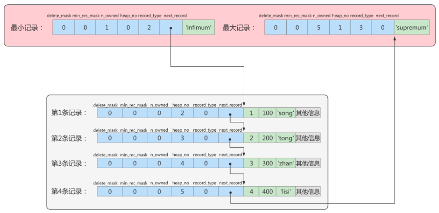
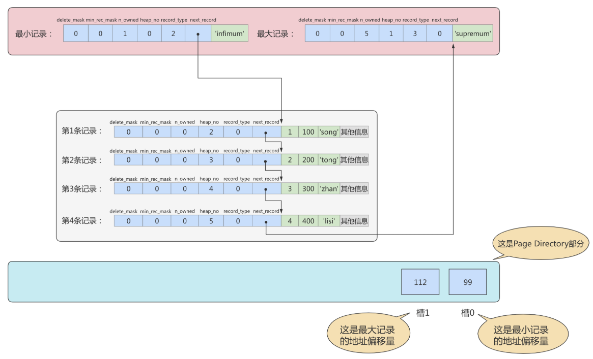
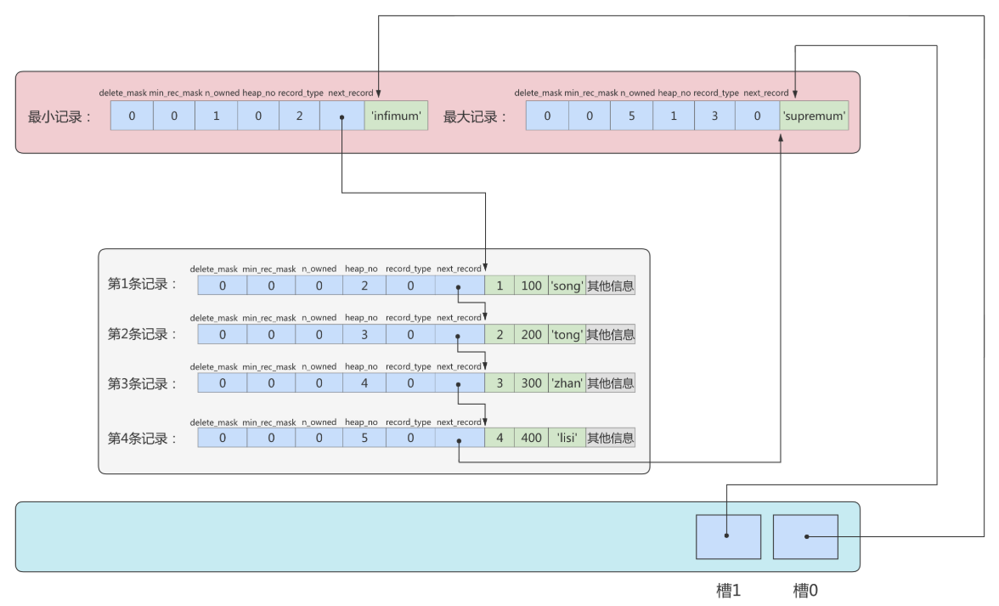
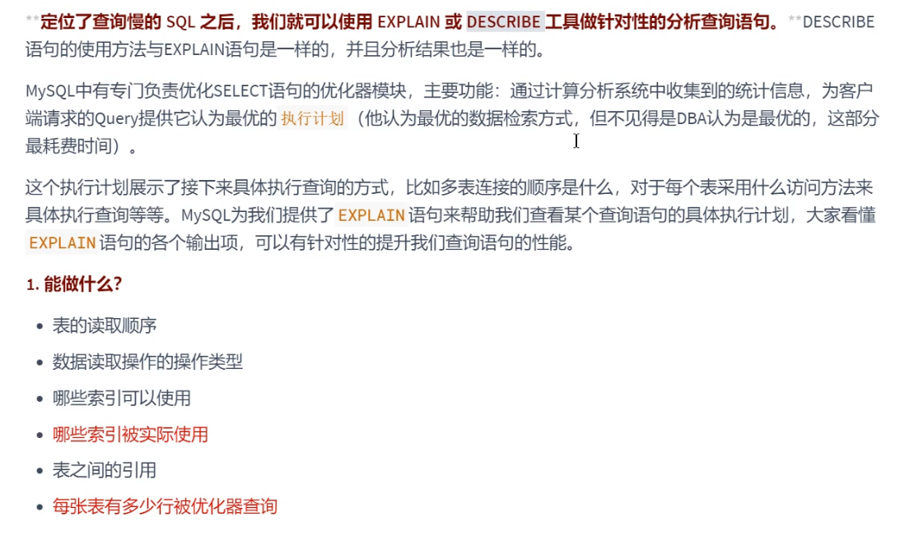

#  InnoDB数据存储结构

## 数据库的存储结构：页

索引结构给我们提供了高效的索引方式，不过索引信息以及数据记录都保存在文件上的，确切说是存储在页结构中。另一方面，索引是在存储引擎中实现的，MySQL服务器上的`存储引擎`负责对表中数据的读取和写入工作。不同存储引擎中`存放的格式`一般不同的，甚至有的存储引擎比如Memory都不用磁盘来存储数据。

由于`InnoDB`是MySQL的`默认存储引擎`，所以本章剖析InooDB存储引擎的数据存储结构。


### 磁盘与内存交互的基本单位：页

InnoDB将数据划分为若干个页，InnoDB中页的大小默认为`16KB`。

以`页`作为磁盘和内存之间交互的基本单位，也就是一次最少从磁盘中读取16KB的内容到内存中，一次最少把内存中的16KB内容刷新到磁盘中。也就是说，**在数据库中，不论读一行，还是读多行，都是将这些行所在的页进行加载。也就是说，数据库管理存储空间的基本单位是页（Page），数据库I/O操作的最小单位是页。**一个页中可以存储多个行记录。

> 记录是按照行来存储的，但是数据库的读取并不以行为单位，否则一次读取（也就是一次I/O操作）只能处理一行数据，效率会非常低。


### 页结构概述

页a、页b、页c...页n这些页可以`不在物理结构上相连`，只要通过`双向链表`相关联即可。每个数据页中的记录会按照主键值从小到大的顺序组成一个`单向链表`，每个数据页都会为存储在它里边的记录生成一个`页目录`，在通过主键查找某条记录的时候可以在页目录中`使用二分法`快速定位到对应的槽，然后再遍历该槽对应的分组中的记录即可快速找到指定的记录。

```mysql
show variables like '%innodb_page_size%';
#查看页大小
```


### 页的上层结构


区（Extent）是比页大一级的存储结构，在InnoDB存储引擎中，一个区会分配`64个连续的页`。因为InnoDB中的页大小默认是16KB，所以一个区的大小是64*16KB=`1MB`。

段（Segment）由一个或多个区组成，区在文件系统是一个连续分配的空间（在InnoDB中是连续的64个页），不过在段中不要求区与区之间是相邻的。`段是数据库中的分配单位，不同类型的数据库对象以不同的段形式存在。`当我们创建数据表、索引的时候，就会相应创建对应的段，比如创建一张表时会创建一个表段，创建一个索引时会创建一个索引段。

表空间（Tablespace）是一个逻辑容器，表空间存储的对象是段，在一个表空间中可以有一个或多个段，但是一个段只能属于一个表空间。数据库由一个或多个表空间组成，表空间从管理上可以划分为`系统表空间`、`用户表空间`、`撤销表空间`、`临时表空间`等。


## 页的内部结构

脑图：


页结构示意图如下：


**我们可以把这7个结构分成三个部分**


### 第1部分：文件头部和文件尾部

#### file header

**作用**： 描述各种页的通用信息。（比如页的编号、其上一页、下一页是谁等）

**大小**：38字节

| 名称                               | 占用空间大小 | 描述                                                         |
| ---------------------------------- | ------------ | ------------------------------------------------------------ |
| `FIL_PAGE_SPACE_OR_CHKSUM`         | `4`字节      | 页的校验和（checksum值）                                     |
| `FIL_PAGE_OFFSET`                  | `4`字节      | 页号                                                         |
| `FIL_PAGE_PREV`                    | `4`字节      | 上一个页的页号                                               |
| `FIL_PAGE_NEXT`                    | `4`字节      | 下一个页的页号                                               |
| FIL_PAGE_LSN                       | `8`字节      | 页面被最后修改时对应的日志序列位置                           |
| `FIL_PAGE_TYPE`                    | `2`字节      | 该页的类型                                                   |
| FIL_PAGE_FILE_FLUSH_LSN            | `8`字节      | 仅在系统表空间的一个页中定义，代表文件至少被刷新到了对应的LSN值 |
| `FIL_PAGE_ARCH_LOG_NO_OR_SPACE_ID` | `4`字节      | 页属于哪个表空间                                             |

- `FIL_PAGE_OFFSET（4字节）`：每一个页都有一个单独的页号，就跟你的身份证号码一样，InnoDB通过页号可以唯一定位一个页。
- `FIL_PAGE_TYPE（2字节）`：这个代表当前页的类型。

| 类型名称                | 十六进制 | 描述                             |
| ----------------------- | -------- | -------------------------------- |
| FIL_PAGE_TYPE_ALLOCATED | 0x0000   | 最新分配，还没有使用             |
| `FIL_PAGE_UNDO_LOG`     | 0x0002   | Undo日志页                       |
| FIL_PAGE_INODE          | 0x0003   | 段信息节点                       |
| FIL_PAGE_IBUF_FREE_LIST | 0x0004   | Insert Buffer空闲列表            |
| FIL_PAGE_IBUF_BITMAP    | 0x0005   | Insert Buffer位图                |
| `FIL_PAGE_TYPE_SYS`     | 0x0006   | 系统页                           |
| FIL_PAGE_TYPE_TRX_SYS   | 0x0007   | 事务系统数据                     |
| FIL_PAGE_TYPE_FSP_HDR   | 0x0008   | 表空间头部信息                   |
| FIL_PAGE_TYPE_XDES      | 0x0009   | 扩展描述页                       |
| FIL_PAGE_TYPE_BLOB      | 0x000A   | 溢出页                           |
| `FIL_PAGE_INDEX`        | 0x45BF   | 索引页，也就是我们所说的`数据页` |

- `FIL_PAGE_PREV（4字节）和FIL_PAGE_NEXT（4字节）`：InnoDB都是以页为单位存放数据的，如果数据分散到多个不连续的页中存储的话需要把这些页关联起来，FIL_PAGE_PREV和FIL_PAGE_NEXT就分别代表本页的上一个和下一个页的页号。这样通过建立一个双向链表把许许多多的页就都串联起来了，保证这些页之间**不需要是物理上的连续，而是逻辑上的连续。**


- `FIL_PAGE_SPACE_OR_CHKSUM（4字节）`：代表当前页面的校验和（checksum）。

**什么是校验和?**


文件头部和文件尾部都有属性：`FIL_PAGE_SPACE_OR_CHKSUM`

**作用：**

InnoDB存储引擎以页为单位把数据加载到内存中处理，如果该页中的数据在内存中被修改了，那么`在修改后的某个时间需要把数据同步到磁盘中。`但是在同步了一半的时候断电了，造成了该页传输的不完整。

为了检测一个页是否完整（也就是在同步的时候有没有发生只同步一半的尴尬情况），这时可以通过文件尾的校验和（checksum 值）与文件头的校验和做比对，如果两个值不相等则证明页的传输有问题，需要重新进行传输，否则认为页的传输已经完成。


- `FIL_PAGE_LSN（8字节）`：页面被最后修改时对应的日志序列位置（英文名是：Log Sequence Number）


#### file trailer

- 前4个字节代表页的校验和：这个部分是和File Header中的校验和相对应的。
- 后4个字节代表页面被最后修改时对应的日志序列位置（LSN）：这个部分也是为了校验页的完整性的，如果首部和尾部的LSN值校验不成功的话，就说明同步过程出现了问题。

这个部分也是为了校验页的完整性的，如果首部和尾部的LSN值校验不成功的话，就说明同步过程出现了问题。

### 第2部分：空闲空间、用户记录和最小最大记录

  


#### free space

我们自己存储的记录会按照指定的`行格式`存储到`User Records`部分。但是在一开始生成页的时候，其实并没有User Records这个部分，`每当我们插入一条记录，都会从Free Space部分，也就是尚未使用的存储空间中申请一个记录大小的空间划分到User Records部分`，当Free Space部分的空间全部被User Records部分替代掉之后，也就意味着这个页使用完了，如果还有新的记录插入的话，就需要去`申请新的页`了。


#### User records

User Records中的这些记录按照`指定的行格式`一条一条摆在User Records部分，相互之间形成`单链表`。


**一条条数据如何记录？**

这里需要讲讲行格式的`记录头信息`


#### 记录头信息

以如下方式创建一个表：

```mysql
mysql> CREATE TABLE page_demo(
    ->     c1 INT,
    ->     c2 INT,
    ->     c3 VARCHAR(10000),
    ->     PRIMARY KEY (c1)
    -> ) CHARSET=ascii ROW_FORMAT=Compact;
Query OK, 0 rows affected (0.03 sec)
```

这个表中记录的行格式示意图：


这些记录头信息中各个属性如下：


简化后的行格式示意图：


插入数据：

```mysql
INSERT INTO page_demo 
VALUES
(1, 100, 'song'), 
(2, 200, 'tong'), 
(3, 300, 'zhan'), 
(4, 400, 'lisi');
```

图示如下：


**属性如下:**

- delete_mask

  这个属性标记着当前记录是否被删除，占用1个二进制位。

  - 值为0：代表记录并没有被删除

  - 值为1：代表记录被删除掉了

  **被删除的记录为什么还在页中存储呢？**
  你以为它删除了，可它还在真实的磁盘上。这些被删除的记录之所以不立即从磁盘上移除，是因为移除它们之后其他的记录在磁盘上需要`重新排列，导致性能消耗。`所以只是打一个删除标记而已，所有被删除掉的记录都会组成一个所谓的`垃圾链表`，在这个链表中的记录占用的空间称之为`可重用空间`，之后如果有新记录插入到表中的话，可能把这些被删除的记录占用的存储空间覆盖掉。

- min_rec_mask

  B+树的每层**非叶子节点**中的最小记录都会添加该标记，min_rec_mask值为1。
  我们自己插入的四条记录的min_rec_mask值都是0，意味着它们都不是B+树的非叶子节点中的最小记录。

- record_type

  这个属性表示当前记录的类型，一共有4种类型的记录：
     0：表示普通记录
     1：表示B+树非叶节点记录
     2：表示最小记录
     3：表示最大记录

  从图中我们也可以看出来，我们自己插入的记录就是普通记录，它们的record_type值都是0，而最小记录和最大记录的record_type值分别为2和3。至于record_type为1的情况，我们在索引的数据结构章节讲过。

- heap_no

  这个属性表示当前记录在本页中的位置。

  从图中可以看出来，我们插入的4条记录在本页中的位置分别是：2、3、4、5。

  **怎么不见heap_no值为0和1的记录呢？**
  MySQL会自动给每个页里加了两个记录，由于这两个记录并不是我们自己插入的，所以有时候也称为`伪记录`或者`虚拟记录`。这两个伪记录一个代表`最小记录`，一个代表`最大记录`。最小记录和最大记录的heap_no值分别是0和1，也就是说它们的位置最靠前。

- n_owned

  页目录中**每个组**中最后一条记录的头信息中会存储该组一共有多少条记录，作为 n_owned 字段。

  详情见page directory（页目录）。

- next_record

  记录头信息里该属性非常重要，它表示从当前记录的真实数据到下一条记录的真实数据的地址偏移量。
  比如：第一条记录的next_record值为32，意味着从第一条记录的真实数据的地址处向后找32个字节便是下一条记录的真实数据。

  注意，下一条记录指得并不是按照我们插入顺序的下一条记录，而是按照主键值由小到大的顺序的下一条记录。而且规定Infimum记录（也就是最小记录）的下一条记录就是本页中主键值最小的用户记录，而本页中主键值最大的用户记录的下一条记录就是 Supremum记录（也就是最大记录）。下图用箭头代替偏移量表示next_record。

  

  - **演示:删除操作**

    删除操作：
    从表中删除掉一条记录，这个链表也是会跟着变化：

    ```mysql
    mysql> DELETE FROM page_demo WHERE c1 = 2;
    Query OK, 1 row affected (0.02 sec)
    ```

    删掉第2条记录后的示意图就是：

    

    从图中可以看出来，删除第2条记录前后主要发生了这些变化：

    - 第2条记录并没有从存储空间中移除，而是把该条记录的delete_mask值设置为1。
    - 第2条记录的next_record值变为了0，意味着该记录没有下一条记录了。
    - 第1条记录的next_record指向了第3条记录。
    - 最大记录的n_owned值从 5 变成了 4 。

    所以，不论我们怎么对页中的记录做增删改操作，InnoDB始终会维护一条记录的单链表，链表中的各个节点是按照主键值由小到大的顺序连接起来的。

    

  - **演示:添加操作**

    添加操作：
    主键值为2的记录被我们删掉了，但是存储空间却没有回收，如果我们再次把这条记录插入到表中，会发生什么事呢？

    ```mysql
    mysql> INSERT INTO page_demo VALUES(2, 200, 'tong');
    Query OK, 1 row affected (0.00 sec)
    ```

    我们看一下记录的存储情况：

    

    直接复用了原来被删除记录的存储空间。

    说明：
    当数据页中存在多条被删除掉的记录时，这些记录的next_record属性将会把这些被删除掉的记录组成一个垃圾链表，以备之后重用这部分存储空间。


#### infimum+Supremum

MySQL会自动给每个页里加了两个记录，由于这两个记录并不是我们自己插入的，所以有时候也称为`伪记录`或者`虚拟记录`。这两个伪记录一个代表`最小记录`，一个代表`最大记录`。最小记录和最大记录的heap_no值分别是0和1，也就是说它们的位置最靠前。

**记录可以比较大小吗？**
是的，记录可以比大小，对于一条完整的记录来说，比较记录的大小就是**比较主键的大小**。比方说我们插入的4行记录的主键值分别是：1、2、3、4，这也就意味着这4条记录是从小到大依次递增。


InnoDB规定的最小记录与最大记录这两条记录的构造十分简单，都是由5字节大小的记录头信息和8字节大小的一个固定的部分组成的，如图所示：


这两条记录不是我们自己定义的记录，所以它们并不存放在页的User Records部分，他们被单独放在一个称为Infimum + Supremum的部分，如图所示：


### 第3部分：页目录和页面头部

#### 页目录

为什么需要页目录？
在页中，记录是以**单向链表**的形式进行存储的。单向链表的特点就是插入、删除非常方便，但是**检索效率不高**，最差的情况下需要遍历链表上的所有节点才能完成检索。因此在页结构中专门设计了页目录这个模块，**专门给记录做一个目录**，通过**二分查找法**的方式进行检索，提升效率。


**需求：根据主键值查找页中的某条记录，如何实现快速查找呢？**

**方式1：顺序查找**
从Infimum记录（最小记录）开始，沿着链表一直往后找，总有一天会找到（或者找不到），在找的时候还能投机取巧，因为链表中各个记录的值是按照从小到大顺序排列的，所以当链表的某个节点代表的记录的主键值大于你想要查找的主键值时，你就可以停止查找了，因为该节点后边的节点的主键值依次递增。

如果一个页中存储了非常多的记录，这么查找性能很差。


**方式2：使用页目录，二分法查找**

1. 将所有的记录**分成几个组**，这些记录包括最小记录和最大记录，但不包括标记为“已删除”的记录。
2. 第 1 组，也就是最小记录所在的分组只有 1 个记录；
   最后一组，就是最大记录所在的分组，会有 1-8 条记录；
   其余的组记录数量在 4-8 条之间。
   这样做的好处是，除了第 1 组（最小记录所在组）以外，其余组的记录数会**尽量平分。**
3. 在每个组中最后一条记录的头信息中会存储该组一共有多少条记录，作为 n_owned 字段。
4. **页目录用来存储每组最后一条记录的地址偏移量**，这些地址偏移量会按照**先后顺序存储起来**，每组的地址偏移量也被称之为**槽（slot）**，每个槽相当于指针指向了不同组的最后一个记录。

`为什么要分组？`

```
为了能够实现二分查找，需要将主键抽取出来进行排序（链表无法进行二分查找），但如果将每个记录的主键都抽取出来进行排序，占用空间太大了，于是进行分组，将每组最大的主键抽取出来进行排序。
```


举例1：


举例2：
现在的page_demo表中正常的记录共有6条，InnoDB会把它们分成两组，第一组中只有一个最小记录，第二组中是剩余的5条记录。如下图：



从这个图中我们需要注意这么几点：

- 现在页目录部分中有两个槽，也就意味着我们的记录被分成了两个组，槽1中的值是112，代表最大记录的地址偏移量（就是从页面的0字节开始数，数112个字节）；槽0中的值是99，代表最小记录的地址偏移量。
- 注意最小和最大记录的头信息中的n_owned属性
  - 最小记录的n_owned值为1，这就代表着以最小记录结尾的这个分组中只有1条记录，也就是最小记录本身。
  - 最大记录的n_owned值为5，这就代表着以最大记录结尾的这个分组中只有5条记录，包括最大记录本身还有我们自己插入的4条记录。

用箭头指向的方式替代数字，这样更易于我们理解，修改后如下：



再换个角度看一下：（单纯从逻辑上看一下这些记录和页目录的关系）


##### 页目录分组的个数如何确定

为什么最小记录的n_owned值为1，而最大记录的n_owned值为5呢？

InnoDB规定：对于最小记录所在的分组只能有1条记录，最大记录所在的分组拥有的记录条数只能在1~8条之间，剩下的分组中记录的条数范围只能在是 4~8 条之间。

分组是按照下边的步骤进行的：

- 初始情况下一个数据页里只有最小记录和最大记录两条记录，它们分属于两个分组。
- 之后每插入一条记录，都会从页目录中找到主键值比本记录的主键值大并且差值最小的槽，然后把该槽对应的记录的n_owned值加1，表示本组内又添加了一条记录，直到该组中的记录数等于8个。
- 在一个组中的记录数等于8个后再插入一条记录时，会将组中的记录拆分成两个组，一个组中4条记录，另一个5条记录。这个过程会在页目录中新增一个槽来记录这个新增分组中最大的那条记录的偏移量。


##### 页目录结构下如何快速查找记录

现在向page_demo表中添加更多的数据。如下：

```mysql
INSERT INTO page_demo 
VALUES
(5, 500, 'zhou'), 
(6, 600, 'chen'), 
(7, 700, 'deng'), 
(8, 800, 'yang'), 
(9, 900, 'wang'), 
(10, 1000, 'zhao'), 
(11, 1100, 'qian'), 
(12, 1200, 'feng'), 
(13, 1300, 'tang'), 
(14, 1400, 'ding'), 
(15, 1500, 'jing'), 
(16, 1600, 'quan');
```

添加了12条记录，现在页里一共有18条记录了（包括最小和最大记录），这些记录被分成了5个组，如图所示：


这里只保留了16条记录的记录头信息中的n_owned和next_record属性，省略了各个记录之间的箭头。
现在看怎么从这个页目录中查找记录。因为各个槽代表的记录的主键值都是从小到大排序的，所以我们可以使用二分法来进行快速查找。5个槽的编号分别是：0、1、2、3、4，所以初始情况下最低的槽就是low=0，最高的槽就是high=4。比方说我们想**找主键值为6的记录**，过程是这样的：

1. 计算中间槽的位置：(0+4)/2=2，所以查看槽2对应记录的主键值为8，又因为8 > 6，所以设置high=2，low保持不变。
2. 重新计算中间槽的位置：(0+2)/2=1，所以查看槽1对应的主键值为4，又因为4 < 6，所以设置low=1，high保持不变。
3. 因为high - low的值为1，所以确定主键值为6的记录在槽2对应的组中。此刻我们需要找到槽2中主键值最小的那条记录，然后沿着单向链表遍历槽2中的记录。
   但是我们前边又说过，每个槽对应的记录都是该组中主键值最大的记录，这里槽2对应的记录是主键值为8的记录，怎么定位一个组中最小的记录呢？别忘了各个槽都是挨着的，我们可以很轻易的拿到槽1对应的记录（主键值为4），该条记录的下一条记录就是槽2中主键值最小的记录，该记录的主键值为5。所以我们可以从这条主键值为5的记录出发，遍历槽2中的各条记录，直到找到主键值为6的那条记录即可。
   由于一个组中包含的记录条数只能是1~8条，所以遍历一个组中的记录的代价是很小的。

**小结：**
在一个数据页中查找指定主键值的记录的过程分为两步：

1. 通过二分法确定该记录所在的槽，并找到该槽所在分组中主键值最小的那条记录。
2. 通过记录的next_record属性遍历该槽所在的组中的各个记录。


#### 页面头部

为了能得到一个数据页中存储的记录的状态信息，比如本页中已经存储了多少条记录，第一条记录的地址是什么，页目录中存储了多少个槽等等，特意在页中定义了一个叫Page Header的部分，这个部分占用固定的56个字节，专门存储各种状态信息。


##### Page_direction

假如新插入的一条记录的主键值比上一条记录的主键值大，我们说这条记录的插入方向是右边，反之则是左边。用来表示最后一条记录插入方向的状态就是PAGE_DIRECTION。


##### page_n_direction

假设连续几次插入新记录的方向都是一致的，InnoDB会把沿着同一个方向插入记录的条数记下来，这个条数就用PAGE_N_DIRECTION这个状态表示。当然，如果最后一条记录的插入方向改变了的话，这个状态的值会被清零重新统计。


### 从数据页的角度看B+树如何查询


## InnoDB行格式（记录格式）

脑图：


###  指定行格式的语法

```mysql
CREATE TABLE 表名 (列的信息) ROW_FORMAT=行格式名称
ALTER TABLE 表名 ROW_FORMAT=行格式名称
```


### Compact（紧凑）行格式

一条完整的记录其实可以被分为记录的额外信息和记录的真实数据两大部分。


#### 变长字段长度列表

MySQL支持一些变长的数据类型，比如VARCHAR(M)、VARBINARY(M)、TEXT类型，BLOB类型，这些数据类型修饰列称为**变长字段**，变长字段中存储多少字节的数据不是固定的，所以我们在存储真实数据的时候需要顺便把这些数据占用的字节数也存起来。**在Compact行格式中，把所有变长字段的真实数据占用的字节长度都存放在记录的开头部位，从而形成一个变长字段长度列表。**


注意：这里面存储的变长长度和字段**顺序是反过来的**。比如两个varchar字段在表结构的顺序是a(10)，b(15)。那么在变长字段长度列表中存储的长度顺序就是15，10，是反过来的。


以record_test_table表中的第一条记录举例：因为record_test_table表的col1、col2、col4列都是VARCHAR(8)类型的，所以这三个列的值的长度都需要保存在记录开头处，注意record_test_table表中的各个列都使用的是ascii字符集（每个字符只需要1个字节来进行编码）。


又因为这些长度值需要按照列的逆序存放，所以最后变长字段长度列表的字节串用十六进制表示的效果就是（各个字节之间实际上没有空格，用空格隔开只是方便理解）：
06 04 08 

把这个字节串组成的变长字段长度列表填入上边的示意图中的效果就是：


#### NULL值列表

Compact行格式会把可以为NULL的列统一管理起来，存在一个标记为NULL值列表中。如果表中没有允许存储 NULL 的列，则 NULL值列表也不存在了。
**为什么定义NULL值列表？**
之所以要存储NULL是因为数据都是需要对齐的，如果**没有标注出来NULL值**的位置，就有可能在查询数据的时候**出现混乱**。如果使**用一个特定的符号**放到相应的数据位表示空置的话，虽然能达到效果，但是这样很**浪费空间**，所以直接就在行数据得头部开辟出一块空间专门用来记录该行数据哪些是非空数据，哪些是空数据，格式如下：

1. 二进制位的值为1时，代表该列的值为NULL。
2. 二进制位的值为0时，代表该列的值不为NULL。

例如：字段 a、b、c，其中a是主键，在某一行中存储的数依次是 a=1、b=null、c=2。那么Compact行格式中的NULL值列表中存储：01（仍然倒序）。第一个0表示c不为null，第二个1表示b是null。这里之所以没有a是因为数据库会自动跳过主键，因为主键肯定是非NULL且唯一的，在NULL值列表的数据中就会自动跳过主键。


#### 记录头信息

见【页的内部结构--第二部分】

#### 记录的真实数据

记录的真实数据除了我们自己定义的列的数据以外，还会有三个隐藏列：


实际上这几个列的真正名称其实是：DB_ROW_ID、DB_TRX_ID、DB_ROLL_PTR。

- 一个表没有手动定义主键，则会选取一个Unique键作为主键，如果连Unique键都没有定义的话，则会为表默认添加一个名为row_id的隐藏列作为主键。所以row_id是在没有自定义主键以及Unique键的情况下才会存在的。(比如在聚簇索引那儿就有用)
- 事务ID和回滚指针在后面的《第14章_MySQL事务日志》章节中讲解。


#### 举例

```mysql
CREATE TABLE mytest(
col1 VARCHAR(10),
col2 VARCHAR(10),
col3 CHAR(10),
col4 VARCHAR(10)
)ENGINE=INNODB CHARSET=LATIN1 ROW_FORMAT=COMPACT;
 
 
INSERT INTO mytest
VALUES('a','bb','bb','ccc');
 
INSERT INTO mytest
VALUES('d','ee','ee','fff');
 
INSERT INTO mytest
VALUES('d',NULL,NULL,'fff');
```

在Windows操作系统下，可以选择通过程序UltraEdit打开表空间文件mytest.ibd这个二进制文件。内容如下：

```
0000c070 73 75 70 72 65 6d 75 6d 03 02 01 00 00 00 10 00|supremum........|
0000c080 2c 00 00 00 2b 68 00 00 00 00 00 06 05 80 00 00|,...+h..........|
0000c090 00 32 01 10 61 62 62 62 62 20 20 20 20 20 20 20|.2..abbbb|
0000c0a0 20 63 63 63 03 02 01 00 00 00 18 00 2b 00 00 00|ccc........+...|
0000c0b0 2b 68 01 00 00 00 00 06 06 80 00 00 00 32 01 10|+h...........2..|
0000c0c0 64 65 65 65 65 20 20 20 20 20 20 20 20 66 66 66|deeeefff|
0000c0d0 03 01 06 00 00 20 ff 98 00 00 00 2b 68 02 00 00|..........+h...|
0000c0e0 00 00 06 07 80 00 00 00 32 01 10 64 66 66 66 00|........2..dfff.|
```

下面分析插入的第一条记录

```
03 02 01                     /*变长字段长度列表，逆序*/
00                              /*NULL标志位，第一行没有NULL值*/
00 00 10 00 2c            /*Record Header，固定5字节长度*/
00 00 00 2b 68 00       /*RowID InnoDB自动创建，6字节*/
00 00 00 00 06 05       /*TransactionID*/
80 00 00 00 32 01 10   /*Roll Pointer*/
61                               /*列1数据'a'*/
62 62                          /*列2数据'bb'*/
62 62 20 20 20 20 20 20 20 20/*列3数据'bb'*/
63 63 63                     /*列4数据'ccc'*/
```

注意1：InnoDB每行有隐藏列TransactionID和Roll Pointer。:
注意2：固定长度CHAR字段在未能完全占用其长度空间时，会用0x20来进行填充。

接着再来分析下Record Header的最后两个字节，这两个字节代表next_recorder，0x2c代表下一个记录的偏移量，即当前记录的位置加上偏移量0x2c就是下条记录的起始位置。


插入的第三条记录：

```
03 01                               /*变长字段长度列表，逆序*/
06                                   /*NULL标志位，第三行有NULL值*/
00 00 20 ff 98                  /*Record Header*/
00 00 00 2b 68 02           /*RowID*/
00 00 00 00 06 07           /*TransactionID*/
80 00 00 00 32 01 10       /*Roll Pointer*/
64                                   /*列1数据'd'*/
66 66 66                         /*列4数据'fff'*/
```

第三行有NULL值，因此NULL标志位不再是00而是06，转换成二进制为00000110，为1的值代表第2列和第3列的数据为NULL。在其后存储列数据的部分，用户会发现没有存储NULL列，而只存储了第1列和第4列非NULL的值。

因此这个例子很好地说明了：不管是CHAR类型还是VARCHAR类型，在compact格式下NULL值都不占用任何存储空间。


### 行溢出

**InnoDB存储引擎可以将一条记录中的某些数据存储在真正的数据页面之外。**

很多DBA喜欢MySQL数据库提供的VARCHAR(M)类型，认为可以存放65535字节。这是真的吗？如果我们使用 ascii字符集的话，一个字符就代表一个字节，我们看看VARCHAR(65535)是否可用。

```mysql
CREATE  TABLE  varchar_size_demo(
 c  VARCHAR(65535)
 )  CHARSET=ascii  ROW_FORMAT=Compact;
```

结果如下：

```
ERROR 1118 (42000): Row size too large. The maximum row size for the used table type, not counting BLOBs, is 65535. This includes storage overhead, check the manual. You have  to  change  some  columns  to  TEXT or  BLOBs
```

报错信息表达的意思是：MySQL对一条记录占用的最大存储空间是有限制的，除BLOB或者TEXT类型的列之外， 其他所有的列（不包括隐藏列和记录头信息）占用的字节长度加起来不能超过65535个字节。

这个65535个字节除了列本身的数据之外，还包括一些其他的数据，以Compact行格式为例，比如说我们为了存储一个VARCHAR(M)类型的列，除了真实数据占有空间以外，还需要记录的额外信息。

如果该VARCHAR类型的列没有NOT NULL属性，那最多只能存储65532个字节的数据，因为变长字段的长度占用 2个字节，NULL值标识需要占用1个字节。

```mysql
CREATE  TABLE  varchar_size_demo(
    c  VARCHAR(65532)
)  CHARSET=ascii  ROW_FORMAT=Compact;
```

#如果有not null属性，那么就不需要NULL值标识，也就可以多存储一个字节，即65533个字节

```mysql
CREATE  TABLE  varchar_size_demo( 
  c  VARCHAR(65533)  not  null
)  CHARSET=ascii  ROW_FORMAT=Compact; 
```


通过上面的案例，我们可以知道一个页的大小一般是16KB，也就是16384字节，而一个VARCHAR(M)类型的列就最多可以存储65533个字节，这样就可能出现一个页存放不了一条记录，这种现象称为**行溢出**。 
`在Compact和Reduntant行格式中`，对于占用存储空间非常大的列，在记录的真实数据处只会存储该列的一部分数据，把剩余的数据分散存储在几个其他的页中进行**分页存储**，然后记录的真实数据处用20个字节存储指向这些页的地址（当然这20个字节中还包括这些分散在其他页面中的数据的占用的字节数），从而可以找到剩余数据所在的页。
这称为页的扩展，举例如下：


### Dynamic和Compressed行格式

默认为dynamic

在MySQL 8.0中，默认行格式就是Dynamic，Dynamic、Compressed行格式和Compact行格式挺像，只不过在处理行溢出数据时有分歧：

Compressed和Dynamic两种记录格式对于存放在BLOB中的数据采用了完全的行溢出的方式。如图，在数据页中只存放20个字节的指针（溢出页的地址），实际的数据都存放在Off Page（溢出页）中。
Compact和Redundant两种格式会在记录的真实数据处存储一部分数据（存放768个前缀字节）。

Compressed行记录格式的另一个功能就是，存储在其中的行数据会以zlib的算法进行压缩，因此对于BLOB、TEXT、VARCHAR这类大长度类型的数据能够进行非常有效的存储。


### Redundant行格式

Redundant是MySQL 5.0版本之前InnoDB的行记录存储方式，MySQL 5.0支持Redundant是为了兼容之前版本的页格式。

现在我们把表record_test_table的行格式修改为Redundant：

```mysql
ALTER TABLE record_test_table ROW_FORMAT=Redundant;
Query OK, 0 rows affected (0.05 sec)
Records: 0  Duplicates: 0  Warnings: 0
```


从上图可以看到，不同于Compact行记录格式，Redundant行格式的首部是一个字段长度偏移列表，同样是按照列的顺序逆序放置的。

下边我们从各个方面看一下Redundant行格式有什么不同的地方。


#### 字段长度偏移列表

注意Compact行格式的开头是变长字段长度列表，而Redundant行格式的开头是字段长度偏移列表，与变长字段长度列表有两处不同：

- 少了“变长”两个字：Redundant行格式会把该条记录中所有列（包括隐藏列）的**已用**长度信息都按照逆序存储到字段长度偏移列表。
- 多了“偏移”两个字：这意味着计算列值长度的方式不像Compact行格式那么直观，它是采用两个相邻数值的差值来计算各个列值的长度。


举例：比如第一条记录的字段长度偏移列表就是：
2B 25 1F 1B 13 0C 06

因为它是逆序排放的，所以按照列的顺序排列就是：
06 0C 13 17 1A 24 25
按照两个相邻数值的差值来计算各个列值的长度的意思就是：

第一列(row_id)的长度就是 0x06个字节，也就是6个字节。
第二列(transaction_id)的长度就是 (0x0C - 0x06)个字节，也就是6个字节。
第三列(roll_pointer)的长度就是 (0x13 - 0x0C)个字节，也就是7个字节。
第四列(col1)的长度就是 (0x1B - 0x13)个字节，也就是8个字节。
第五列(col2)的长度就是 (0x1F - 0x1B)个字节，也就是4个字节。
第六列(col3)的长度就是 (0x25 - 0x1F)个字节，也就是6个字节。
第七列(col4)的长度就是 (0x2B - 0x25)个字节，也就是6个字节。


#### 记录头信息

不同于Compact行格式，Redundant行格式中的记录头信息固定占用6个字节（48位）

与Compact行格式的记录头信息对比来看，有两处不同：

- Redundant行格式多了n_field和1byte_offs_flag这两个属性。
- Redundant行格式没有record_type这个属性。


## 区、段与碎片区

### 为什么要有区(extent)

`B+`树的每一层中的页都会形成一个双向链表，如果是以`页为单位`来分配存储空间的话，双向链表相邻的两个页之间的`物理位置可能离得非常远`。我们介绍B+树索引的使用场景的时候特别提到范围查询只需要定位到最左边的记录和最右边的记录，然后沿着双向链表一直扫描就可以了，而如果链表中相邻的两个页物理位置离得非常远，就是所谓的`随机I/O`。再一次强调，磁盘的速度和内存的速度差了好几个数量级，`随机I/O是非常慢`的，所以我们应该尽量让链表中相邻的页的物理位置也相邻，这样进行范围查询的时候才可以使用所谓的`顺序I/O`。

引入`区`的概念，一个区就是物理位置上连续的`64个页`。因为InnoDB中的页的大小默认是16KB，所以一个区的大小是64*16KB=`1MB`。在表中`数据量大`的时候，为某个索引分配空间的时候就不再按照页的单位分配了，而是按照`区为单位分配`，甚至在表中的数据特别多的时候，可以一次性分配多个连续的区。虽然可能造成`一点点空间的浪费`（数据不足以填充满整个区），但是从性能角度看，可以消除很多的随机I/O，`功大于过`！


### 为什么要有段(segment)

对于范围查询，其实是对B+树叶子节点中的记录进行顺序扫描，而如果不区分叶子节点和非叶子节点，统统把节点代表的页面放到申请到的区中的话，进行范围扫描的效果就大打折扣了。所以InnoDB对B+树的`叶子节点`和`非叶子节点`进行了区别对待，也就是说叶子节点有自己独有的区，非叶子节点也有自己独有的区。存放叶子节点的区的集合就算是一个`段（segment）`，存放非叶子节点的区的集合也算是一个段。也就是说一个索引会生成2个段，一个`叶子节点段`，一个`非叶子节点段`。

除了索引的叶子节点段和非叶子节点段之外，InnoDB中还有为存储一些特殊的数据而定义的段，比如回滚段。所以，常见的段有`数据段(叶子节点)`、`索引段（非叶子节点）`、`回滚段（讲到事务再说）`。数据段即为B+树的叶子节点，索引段即为B+树的非叶子节点。

在InnoDB存储引擎中，对段的管理都是由引擎自身所完成，DBA不能也没有必要对其进行控制。这从一定程度上简化了DBA对于段的管理。

**段其实不对应表空间中的某一个连续的物理区域，而是一个逻辑上的概念，由若干个零散的页面以及一些完整的区组成。**


### 为什么要有碎片区

默认情况下，一个使用InnoDB存储引擎的表只有一个聚簇索引，一个索引会生成2个段，而段是以区为单位申请存储空间的，一个区默认占用1M（64*16KB=1024KB）存储空间，所以**默认情况下一个只存在几条记录的小表也需要2M的存储空间么？**以后每次添加一个索引都要多申请2M的存储空间么？这对于存储记录比较少的表简直是天大的浪费。这个问题的症结在于到现在为止我们介绍的区都是非常`纯粹`的，也就是一个区被整个分配给某一个段，或者说区中的所有页面都是为了存储同一个段的数据而存在的，即使段的数据填不满区中所有的页面，那余下的页面也不能挪作他用。

为了考虑以完整的区为单位分配给某个段对于`数据量较小`的表太浪费存储空间的这种情况，InnoDB提出了一个`碎片（fragment）区`的概念。在一个碎片区中，并不是所有的页都是为了存储同一个段的数据而存在的，而是碎片区中的页可以用于不同的目的，比如有些页面用于段A，有些页面用于段B，有些页甚至哪个段都不属于。`碎片区直属于表空间`，并不属于任何一个段。

所以此后为某个段分配存储空间的策略是这样的：

- 在刚开始向表中插入数据的时候，段是从某个碎片区以单个页面为单位来分配存储空间的。（这些页面不一定属于同一个区）
- 一旦这个段占用的单独页面数量达到了32个，后续的空间分配就会申请以完整的区（即默认64个连续页面）为单位来分配存储空间。

所以现在段不能仅定义为是某些区的集合，更精确的应该是`某些零散的页面`已经`一些完整的区`的集合。


### 区的分类

区大体上可以分为4种类型：

- `空闲的区(FREE)`：现在还没有用到这个区中的任何页面。
- `有剩余空间的碎片区(FREE_FRAG)`：表示碎片区中还有可用的页面。
- `没有剩余空间的碎片区(FULL_FRAG)`：表示碎片区中的所有页面都被使用，没有空闲页面。
- `附属于某个段的区(FSEG)`：每一索引都可以分为叶子节点段和非叶子节点段

处于`FREE`、`FREE_FRAG`以及`FULL_FRAG`这三种状态的区都是独立的，直属于表空间。而处于`FSEG`状态的区是附属于某个段的。


## 表空间


### 独立表空间


看到`innodb_file_per_table=ON`，表明每张表会单独保存一个`.ibd`文件

### 系统表空间


结构略


## 附录：数据页加载的三种方式


# *索引的创建与设计原则

## 索引的声名与使用

### 索引的分类

- 从`功能逻辑`上说，索引主要有 4 种，分别是普通索引、唯一索引、主键索引、全文索引。
- 按照`物理实现方式`，索引可以分为 2 种：聚簇索引和非聚簇索引。
- 按照`作用字段个数`进行划分，分成单列索引和联合索引。


### 创建索引

隐式的创建索引：
在声名有主键约束、唯一性约束、外键约束的字段上，会自动添加相关索引。

#### **在创建表时创建索引**

```mysql
CREATE TABLE table_name [col_name data_type] 
[UNIQUE | FULLTEXT | SPATIAL] [INDEX | KEY] [index_name] (col_name [length]) [ASC | DESC]
```

- `UNIQUE`、`FULLTEXT`和`SPATIAL`为可选参数，分别表示唯一索引、全文索引和空间索引；
- `INDEX`与`KEY`为同义词，两者的作用相同，用来指定创建索引；
- `index_name`指定索引的名称，为可选参数，如果不指定，那么MySQL默认col_name为索引名；
- `col_name`为需要创建索引的字段列，该列必须从数据表中定义的多个列中选择；
- `length`为可选参数，表示索引的长度，只有字符串类型的字段才能指定索引长度；指定索引长度后在排序时只比较前`length`的字符串
- `ASC`或`DESC`指定升序或者降序的索引值存储。


`show index from 表`查看索引

**1.** **创建普通索引**

```mysql
CREATE TABLE book( 
    book_id INT , 
    book_name VARCHAR(100), 
    authors VARCHAR(100), 
    info VARCHAR(100) , 
    comment VARCHAR(100), 
    year_publication YEAR, 
    INDEX(year_publication) 
);
```

**2.** **创建唯一索引**

加唯一性约束会自动创建索引，同时创建唯一性索引也会自动加唯一性约束

```mysql
CREATE TABLE test1( 
    id INT NOT NULL, 
    name varchar(30) NOT NULL, 
    UNIQUE INDEX uk_idx_id(id) 
);
```

**3.** **主键索引**

设定为主键后数据库会自动建立索引，innodb中为聚簇索引

```mysql
CREATE TABLE student ( 
    id INT(10) UNSIGNED AUTO_INCREMENT, 
    student_no VARCHAR(200),
    student_name VARCHAR(200), 
    PRIMARY KEY(id) 
);
# 删除主键索引
ALTER TABLE student drop PRIMARY KEY ;
```

**4.** **创建单列索引**

```mysql
CREATE TABLE test2( 
    id INT NOT NULL, 
    name CHAR(50) NULL, 
    INDEX single_idx_name(name(20)) 
);
```

**5.** **创建组合索引**

```mysql
CREATE TABLE test3( 
    id INT(11) NOT NULL, 
    name CHAR(30) NOT NULL, 
    age INT(11) NOT NULL, 
    info VARCHAR(255), 
    INDEX multi_idx(id,name,age) 
);
```

    #按照这些字段的顺序进行排序，前一个一样，比较后一个
    #遵循最左前缀原则
**6.** **创建全文索引**

可以用于全文搜索，并且只能为`CHAR`、`VARCHAR`、`TEXT`列创建索引。不支持局部（前缀）索引。

```mysql
CREATE TABLE `papers` ( 
    id` int(10) unsigned NOT NULL AUTO_INCREMENT, 
    `title` varchar(200) DEFAULT NULL, 
    `content` text, PRIMARY KEY (`id`), 
    FULLTEXT KEY `title` (`title`,`content`) 
) DEFAULT CHARSET=utf8;

```

全文检索使用

```mysql
SELECT * FROM papers WHERE MATCH(title,content) AGAINST (‘查询字符串’);
```

查询效率明显高于

```mysql
select * from papers where content like '%查询字符串%';
```


**7.** **创建空间索引**

空间索引创建中，要求空间类型的字段必须为 **非空**

```mysql
CREATE TABLE test5( 
    geo GEOMETRY NOT NULL, 
    SPATIAL INDEX spa_idx_geo(geo) 
) ENGINE=MyISAM;
```


#### **已经存在的表上添加索引**

**1.** **使用ALTER TABLE语句创建索引**

```mysql
ALTER TABLE table_name 
ADD [UNIQUE | FULLTEXT | SPATIAL] [INDEX | KEY] [index_name] (col_name[length],...) [ASC | DESC]
```

**2.** **使用CREATE INDEX创建索引**

```mysql
CREATE [UNIQUE | FULLTEXT | SPATIAL] INDEX index_name 
ON table_name (col_name[length],...) [ASC | DESC]
```


### 删除索引

**1.** **使用ALTER TABLE删除索引**

```
ALTER TABLE table_name DROP INDEX index_name;
```

> 添加auto_increment约束字段的唯一索引不能被删除（添加唯一索引就会有唯一约束，删除唯一索引那么auto_increment就出错）

> 联合索引可以单独删掉索引中的某个字段

**2.** **使用DROP INDEX语句删除索引**

```
DROP INDEX index_name ON table_name;
```

> 提示 删除表中的列时，如果要删除的列为索引的组成部分，则该列也会从索引中删除。如果组成索引的所有列都被删除，则整个索引将被删除。

## MySQL8.0索引新特性

### 支持降序索引


使用案例：

```mysql
CREATE TABLE ts1(a int,b int,index idx_a_b(a,b desc));
```


下面继续测试降序索引在执行计划中的表现。

分别在MySQL 5.7版本和MySQL 8.0版本的数据表ts1中插入800条随机数据，执行语句如下：

```mysql
DELIMITER //
CREATE PROCEDURE ts_insert()
BEGIN
	DECLARE i INT DEFAULT 1;
	WHILE i < 800
	DO
		insert into ts1 select rand()*80000,rand()*80000;
		SET i = i + 1;
	END WHILE;
	commit;
END //
DELIMITER ;

#调用
CALL ts_insert();
```

在MySQL 5.7版本中查看数据表ts1的执行计划

```mysql
EXPLAIN SELECT * FROM ts1 ORDER BY a,b DESC LIMIT 5;
```

从结果可以看出，执行计划中扫描数为799，而且使用了Using filesort。

> 提示 Using filesort是MySQL中一种速度比较慢的外部排序，能避免是最好的。多数情况下，管理员可以通过优化索引来尽量避免出现Using filesort，从而提高数据库执行速度。

在MySQL 8.0版本中查看数据表ts1的执行计划。从结果可以看出，执行计划中扫描数为5，而且没有使用Using filesort。


>  注意 降序索引只对查询中特定的排序顺序有效，如果使用不当，反而查询效率更低。例如，上述查询排序条件改为order by a desc, b desc，MySQL 5.7的执行计划要明显好于MySQL 8.0。

将排序条件修改为order by a desc, b desc后，下面来对比不同版本中执行计划的效果。 

```mysql
EXPLAIN SELECT * FROM ts1 ORDER BY a DESC,b DESC LIMIT 5;
```

从结果可以看出，修改后MySQL 5.7的执行计划要明显好于MySQL 8.0。（因为索引按a字段升序，在查找时mysql8却降序）


### 隐藏索引

在MySQL 5.7版本及之前，只能通过显式的方式删除索引。此时，如果发现删除索引后出现错误，又只能通过显式创建索引的方式将删除的索引创建回来。如果数据表中的数据量非常大，或者数据表本身比较大，这种操作就会消耗系统过多的资源，操作成本非常高。

从MySQL 8.x开始支持`隐藏索引（invisible indexes）`，只需要将待删除的索引设置为隐藏索引，使查询优化器不再使用这个索引（即使使用force index（强制使用索引），优化器也不会使用该索引），确认将索引设置为隐藏索引后系统不受任何响应，就可以彻底删除索引。`这种通过先将索引设置为隐藏索引，再删除索引的方式就是软删除`。

同时，如果想验证某个索引删除之后的`查询性能影响`，就可以暂时先隐藏该索引。

> 注意：
>
> 主键不能设置为隐藏索引。因为当表中没有显式主键时，表中第一个唯一非空索引会成为隐式主键。


#### **创建表时直接创建**

```mysql
CREATE TABLE tablename( 
    propname1 type1[CONSTRAINT1], 
    propname2 type2[CONSTRAINT2], 
    ……
    propnamen typen, 
    INDEX [indexname](propname1 [(length)]) INVISIBLE 
);
```


#### **在已经存在的表上创建**

```mysql
CREATE INDEX indexname 
ON tablename(propname[(length)]) INVISIBLE;
```


#### **通过ALTER TABLE语句创建**

```mysql
ALTER TABLE tablename 
ADD INDEX indexname (propname [(length)]) INVISIBLE;
```


#### **切换索引可见状态**

```mysql
ALTER TABLE tablename ALTER INDEX index_name INVISIBLE; #切换成隐藏索引 
ALTER TABLE tablename ALTER INDEX index_name VISIBLE; #切换成非隐藏索引
```

> 注意 当索引被隐藏时，它的内容仍然是和正常索引一样实时更新的。如果一个索引需要长期被隐藏，那么可以将其删除，因为索引的存在会影响插入、更新和删除的性能。


#### 使隐藏索引对查询优化器可见

在MySQL 8.x版本中，为索引提供了一种新的测试方式，可以通过查询优化器的一个开关（use_invisible_indexes）来打开某个设置，使隐藏索引对查询优化器可见。如果 use_invisible_indexes设置为off(默认)，优化器会忽略隐藏索引。如果设置为on，即使隐藏索引不可见，优化器在生成执行计划时仍会考虑使用隐藏索引。

（1）在MySQL命令行执行如下命令查看查询优化器的开关设置。

```mysql
select @@optimizer_switch \G
```

在输出的结果信息中找到如下属性配置。

```properties
use_invisible_indexes=off
```

此属性配置值为off，说明隐藏索引默认对查询优化器不可见

（2）使隐藏索引对查询优化器可见，需要在MySQL命令行执行如下命令

```mysql
mysql> set session optimizer_switch="use_invisible_indexes=on";
Query OK, 0 rows affected (0.00 sec)
```


## 索引的设计原则

### **哪些情况适合创建索引**

**1.字段的数值有唯一性的限制**

索引本身可以起到约束的作用，比如唯一索引、主键索引都可以起到唯一性约束的，因此在我们的数据表中，如果`某个字段是唯一的`，就可以直接`创建唯一性索引`，或者`主键索引`。这样可以更快速地通过该索引来确定某条记录。

> 业务上具有唯一特性的字段，即使是组合字段，也必须建成唯一索引。（来源：Alibaba）
>
> 说明：不要以为唯一索引影响了insert速度，这个速度损耗可以忽略，但提高查找速度是明显的。


**2.频繁作为where出查询条件的字段**

某个字段在SELECT语句的 WHERE 条件中经常被使用到，那么就需要给这个字段创建索引了。尤其是在数据量大的情况下，创建普通索引就可以大幅提升数据查询的效率。

**3.** **经常** **GROUP BY** **和** **ORDER BY** **的列**

索引就是让数据按照某种顺序进行存储或检索，因此当我们使用 GROUP BY 对数据进行分组查询，或者使用 ORDER BY 对数据进行排序的时候，就需要`对分组或者排序的字段进行索引`。如果待排序的列有多个，那么可以在这些列上建立`组合索引`。

创建组合索引时，`group by`的列写在前面（group by先执行），可以提高效率。


**4. UPDATE、DELETE** **的** **WHERE** **条件列**

对数据按照某个条件进行查询后再进行 UPDATE 或 DELETE 的操作，如果对 WHERE 字段创建了索引，就能大幅提升效率。原理是因为我们需要先根据 WHERE 条件列检索出来这条记录，然后再对它进行更新或删除。

**如果进行更新的时候，更新的字段是非索引字段，提升的效率会更明显，这是因为非索引字段更新不需要对索引进行维护。**


**5.DISTINCT** **字段需要创建索引**

有时候我们需要对某个字段进行去重，使用 DISTINCT，那么对这个字段创建索引，也会提升查询效率。

这是因为索引对数据进行排序，去重时会块很多。


**6.** **多表** **JOIN** **连接操作时，创建索引注意事项**

首先，`连接表的数量尽量不要超过 3 张`，因为每增加一张表就相当于增加了一次嵌套的循环，数量级增长会非常快，严重影响查询的效率。

其次，`对 WHERE 条件创建索引`，因为 WHERE 才是对数据条件的过滤。如果在数据量非常大的情况下，没有 WHERE 条件过滤是非常可怕的。

最后，`对用于连接的字段创建索引`，并且该字段在多张表中的`类型必须一致`。

**7.** **使用列的类型小的创建索引**

我们这里所说的`类型大小`指的就是该类型表示的数据范围的大小。

- 数据类型越小，在查询时进行的比较操作越快
- 数据类型越小，索引占用的存储空间就越少，在一个数据页内就可以`放下更多的记录`，从而减少磁盘`I/O`带来的性能损耗，也就意味着可以把更多的数据页缓存在内存中，从而加快读写效率。

这个建议对于表的`主键来说更加适用`，因为不仅是聚簇索引中会存储主键值，其他所有的二级索引的节点处都会存储一份记录的主键值，如果主键使用更小的数据类型，也就意味着节省更多的存储空间和更高效的I/O。


**8.** **使用字符串前缀创建索引**


问题是，截取多少呢？截取得多了，达不到节省索引存储空间的目的；截取得少了，重复内容太多，字段的散列度(选择性)会降低。**怎么计算不同的长度的选择性呢？**

先看一下字段在全部数据中的选择度：

```mysql
select count(distinct address) / count(*) from shop;
```

通过不同长度去计算，与全表的选择性对比：

公式：

```mysql
count(distinct left(列名, 索引长度))/count(*)
```

例如：

```mysql
select count(distinct left(address,10)) / count(*) as sub10, -- 截取前10个字符的选择度
count(distinct left(address,15)) / count(*) as sub11, -- 截取前15个字符的选择度
count(distinct left(address,20)) / count(*) as sub12, -- 截取前20个字符的选择度
count(distinct left(address,25)) / count(*) as sub13 -- 截取前25个字符的选择度
from shop;
```

如果选择性没有明显差异，那么截取的少好。


**引申另一个问题：索引列前缀对排序的影响**


**9.** **区分度高(散列性高)的列适合作为索引**

`列的基数`指的是某一列中不重复数据的个数，比方说某个列包含值`2,5,8,2,5,8,2,5,8`，虽然有`9`条记录，但该列的基数却是`3`。也就是说，**在记录行数一定的情况下，列的基数越大，该列中的值越分散；列的基数越小，该列中的值越集中。**这个列的基数指标非常重要，直接影响我们是否能有效的利用索引。最好为列的基数大的列建立索引，为基数太小的列建立索引效果可能不好。

可以使用公式`select count(distinct a)/count(*) from t1`计算区分度，越接近1越好，一般超过`33%`就算是比较高效的索引了。

拓展：联合索引把区分度高（散列性高）的列放在前面。


**10.** **使用最频繁的列放到联合索引的左侧**


**11.** **在多个字段都要创建索引的情况下，联合索引优于单值索引**


### **限制索引的数目**

在实际工作中，我们也需要注意平衡，索引的数目不是越多越好。我们需要限制每张表上的索引数量，建议单张表索引数量`不超过6个`。原因：

- 每个索引都需要占用`磁盘空间`，索引越多，需要的磁盘空间就越大。
- 索引会影响`INSERT、DELETE、UPDATE等语句的性能`，因为表中的数据更改的同时，索引也会进行调整和更新，会造成负担。
- 优化器在选择如何优化查询时，会根据统一信息，对每一个可以用到的`索引来进行评估`，以生成出一个最好的执行计划，如果同时有很多个索引都可以用于查询，会增加MySQL优化器生成执行计划时间，降低查询性能。


### **哪些情况不适合创建索引**

**1.** **在where中使用不到的字段，不要设置索引**

**2.** **数据量小的表最好不要使用索引**

**3.** **有大量重复数据的列上不要建立索引**

**4.** **避免对经常更新的表创建过多的索引**

**5.** **不建议用无序的值作为索引**

例如身份证、UUID(在索引比较时需要转为ASCII，并且插入时可能造成页分裂)、MD5、HASH、无序长字符串等。

**6.** **删除不再使用或者很少使用的索引**

**7.** **不要定义冗余或重复的索引**

- 冗余索引

举例：建表语句如下

```mysql
CREATE TABLE person_info(
    id INT UNSIGNED NOT NULL AUTO_INCREMENT,
    name VARCHAR(100) NOT NULL,
    birthday DATE NOT NULL,
    phone_number CHAR(11) NOT NULL,
    country varchar(100) NOT NULL,
    PRIMARY KEY (id),
    KEY idx_name_birthday_phone_number (name(10), birthday, phone_number),
    KEY idx_name (name(10))
);
```

我们知道，通过 `idx_name_birthday_phone_number` 索引就可以对 `name` 列进行快速搜索，再创建一个专门针对 `name` 列的索引就算是一个 `冗余索引` ，维护这个索引只会增加维护的成本，并不会对搜索有什么好处。

- 重复索引

另一种情况，我们可能会对某个列 `重复建立索引` ，比方说这样：

```mysql
CREATE TABLE repeat_index_demo (
	col1 INT PRIMARY KEY,
	col2 INT,
	UNIQUE uk_idx_c1 (col1),
	INDEX idx_c1 (col1)
);
```

我们看到，col1 既是主键、又给它定义为一个唯一索引，还给它定义了一个普通索引，可是主键本身就会生成聚簇索引，所以定义的唯一索引和普通索引是重复的，这种情况要避免。


# 性能分析工具的使用

## 数据库服务器的优化步骤

当我们遇到数据库调优问题的时候，该如何思考呢？这里把思考的流程整理成下面这张图。

整个流程划分成了 观察（Show status） 和 行动（Action） 两个部分。字母 S 的部分代表观察（会使用相应的分析工具），字母 A 代表的部分是行动（对应分析可以采取的行动）。


**小结**


## 查看系统性能参数

在MySQL中，可以使用 `SHOW STATUS` 语句查询一些MySQL数据库服务器的 `性能参数 、 执行频率 。`

SHOW STATUS语句语法如下：

```mysql
SHOW [GLOBAL|SESSION] STATUS LIKE '参数';
```

一些常用的性能参数如下：

- Connections：连接MySQL服务器的次数。

- Uptime：MySQL服务器的上线时间。 

- Slow_queries：慢查询的次数。

- Innodb_rows_read：Select查询返回的行数 

- Innodb_rows_inserted：执行INSERT操作插入的行数
- Innodb_rows_updated：执行UPDATE操作更新的行数

- Innodb_rows_deleted：执行DELETE操作删除的行数 

- Com_select：查询操作的次数。

- Com_insert：插入操作的次数。对于批量插入的 INSERT 操作，只累加一次
- Com_update：更新操作的次数。 

- Com_delete：删除操作的次数。


## **统计SQL的查询成本：last_query_cost**


```
SHOW STATUS LIKE 'last_query_cost';
```

使用场景：它对于比较开销是非常有用的，特别是我们有好几种查询方式可选的时候。

> SQL 查询是一个动态的过程，从页加载的角度来看，我们可以得到以下两点结论：
>
> 1. `位置决定效率`。如果页就在数据库`缓冲池`中，那么效率是最高的，否则还需要从`内存`或者`磁盘`中进行读取，当然针对单个页的读取来说，如果页存在于内存中，会比在磁盘中读取效率高很多。
> 2. `批量决定效率`。如果我们从磁盘中对单一页进行随机读，那么效率是很低的（差不多10ms），而采用顺序读取的方式，批量对页进行读取，平均一页的读取效率就会提升很多，甚至要快于单个页面在内存中的随机读取。
>
> 所以说，遇到I/O并不用担心，方法找对了，效率还是很高的。我们首先要考虑数据存放的位置，如果是经常使用的数据就要尽量放到`缓冲池`中，其次我们可以充分利用磁盘的吞吐能力，一次性批量读取数据，这样单个页的读取效率也就得到了提升。


## **定位执行慢的SQL：慢查询日志**


### 开启慢查询日志参数

```
set global slow_query_log='ON';
```

查看下慢查询日志是否开启，以及慢查询日志文件的位置：

```
show variables like `%slow_query_log%`;
```


### **修改long_query_time阈值**

```
show variables like '%long_query_time%';
```

```mysql
#测试发现：设置global的方式对当前session的long_query_time失效。对新连接的客户端有效。所以可以一并 执行下述语句 
mysql > set global long_query_time = 1; 
mysql> set long_query_time=1; 
```


### 查看慢查询数目

```
SHOW GLOBAL STATUS LIKE '%Slow_queries%';
```


### **慢查询日志分析工具：mysqldumpslow**

在生产环境中，如果要手工分析日志，查找、分析SQL，显然是个体力活，MySQL提供了日志分析工具`mysqldumpslow` 。

查看mysqldumpslow的帮助信息

```
mysqldumpslow --help
```

mysqldumpslow 命令的具体参数如下：

- -a: 不将数字抽象成N，字符串抽象成S

- `-s: 是表示按照何种方式排序`：

  - c: 访问次数

  - l: 锁定时间
  - r: 返回记录
  - **t:** **查询时间**
  - al:平均锁定时间
  - ar:平均返回记录数
  - at:平均查询时间 （默认方式）
  - ac:平均查询次数

- `-t: 即为返回前面多少条的数据；`

- `-g: 后边搭配一个正则匹配模式，大小写不敏感的`


举例：我们想要按照查询时间排序，查看前五条 SQL 语句，这样写即可：

```bash
mysqldumpslow -s t -t 5 /var/lib/mysql/atguigu01-slow.log
```

```bash
[root@bogon ~]# mysqldumpslow -s t -t 5 /var/lib/mysql/atguigu01-slow.log

Reading mysql slow query log from /var/lib/mysql/atguigu01-slow.log

Count: 1 Time=2.39s (2s) Lock=0.00s (0s) Rows=13.0 (13), root[root]@localhost
	SELECT * FROM student WHERE name = 'S'
	
Count: 1 Time=2.09s (2s) Lock=0.00s (0s) Rows=2.0 (2), root[root]@localhost
	SELECT * FROM student WHERE stuno = N
	
Died at /usr/bin/mysqldumpslow line 162, <> chunk 2.
```


**工作常用参考：**

```bash
#得到返回记录集最多的10个SQL
mysqldumpslow -s r -t 10 /var/lib/mysql/atguigu-slow.log
#得到访问次数最多的10个SQL
mysqldumpslow -s c -t 10 /var/lib/mysql/atguigu-slow.log
#得到按照时间排序的前10条里面含有左连接的查询语句
mysqldumpslow -s t -t 10 -g "left join" /var/lib/mysql/atguigu-slow.log
#另外建议在使用这些命令时结合 | 和more 使用 ，否则有可能出现爆屏情况
mysqldumpslow -s r -t 10 /var/lib/mysql/atguigu-slow.log | more
```


### 删除慢查询日志

`rm`

重置：（重置后不会恢复数据）

```bash
mysqladmin -uroot -p flush-logs slow
```

最后加上`slow`是为了只生成慢查询日志，改变参数还可以恢复`undolog`等


## 查看sql执行成本 show profile

```
mysql > show variables like 'profiling';
```

通过设置 `profiling='ON’` 来开启 show profile：

```
mysql > set profiling = 'ON';
```

然后执行相关的查询语句。接着看下当前会话都有哪些 profiles，使用下面这条命令：

```
show profiles
```

你能看到当前会话一共有 2 个查询。如果我们想要查看**最近一次**查询的开销，可以使用：

```
show profile
```

查看特定编号的语句

```
show profile cpu,block io for query 2;
```


**show profile的常用查询参数：**

① ALL：显示所有的开销信息。 ② BLOCK IO：显示块IO开销。 ③ CONTEXT SWITCHES：上下文切换开销。 ④ CPU：显示CPU开销信息。 ⑤ IPC：显示发送和接收开销信息。 ⑥ MEMORY：显示内存开销信息。 ⑦ PAGE FAULTS：显示页面错误开销信息。 ⑧ SOURCE：显示和Source_function，Source_file，Source_line相关的开销信息。 ⑨ SWAPS：显示交换次数开销信息。


## Explain:分析查询语句

### 概述



**基本语法**

```mysql
explain或describe [sql语句] #可以是select、update、delete
```

**使用explain并不会真正执行数据，只是查询执行计划**


EXPLAIN 语句输出的各个列的作用如下：

| 列名          | 描述                                                     |
| ------------- | -------------------------------------------------------- |
| id            | 在一个大的查询语句中每个SELECT关键字都对应一个`唯一的id` |
| select_type   | SELECT关键字对应的那个查询的类型                         |
| table         | 表名                                                     |
| partitions    | 匹配的分区信息                                           |
| type          | 针对单表的访问方法                                       |
| possible_keys | 可能用到的索引                                           |
| key           | 实际上使用的索引                                         |
| key_len       | 实际使用到的索引长度                                     |
| ref           | 当使用索引列等值查询时，与索引列进行等值匹配的对象信息   |
| rows          | 预估的需要读取的记录条数                                 |
| filtered      | 某个表经过搜索条件过滤后剩余记录条数的百分比             |
| Extra         | 一些额外的信息                                           |


###  **EXPLAIN各列作用**

#### **1.table**

以查询为例

不论我们的查询语句有多复杂，里边儿 包含了多少个表 ，到最后也是需要对每个表进行 单表访问 的，所以MySQL规定**EXPLAIN语句输出的每条记录都对应着某个单表的访问方法**，该条记录的table列代表着该表的表名（有时不是真实的表名字，可能是简称）。

(可能多于我们所使用表的个数，因为可能有临时表的创建)


#### **2.id**

在一个大的查询中，每一个select对应一个id。

但**有时**优化器会对`子查询`进行重写，变成多表查询，这时id会少于select个数。

用union去重会创建临时表，多出一条explain记录。unionall则不会。

**小结**

- **id如果相同，可以认为是一组，从上往下顺序执行**
- **在所有组中，id值越大，优先级越高，越先执行**
- **关注点：id号每个号码，表示一趟独立的查询, 一个sql的查询趟数越少越好**


#### **3.select_type**


- simple

  查询语句不包括`UNION`或者子查询的查询都算作是`simple`类型

  连接查询也算是`simple`类型

- primary

  对包含`union`、`union all`或者子查询的大查询来说，它是由几个小查询组成的，其中最左边的那个查询的`select_type`值就是`primary`

- union

  对包含`union`、`union all`的大查询来说，它是由几个小查询组成的，其中除了最左边那个小查询以外，其余的小查询的`select_type`值就是`union`。

- union result

  使用临时表来完成对union查询的去重工作，针对该临时表的查询的select_type就是union result

- subquery

  

- dependent subquery

  如果包含子查询的查询语句不能够转为对应的`semi-join`的形式，并且该子查询是相关子查询，则该子查询的第一个`SELECT`关键字代表的那个查询的`select_type`就是`DEPENDENT SUBQUERY`

  ```mysql
  EXPLAIN SELECT * FROM s1 
   WHERE key1 IN (SELECT key1 FROM s2 WHERE s1.key2 = s2.key2) OR key3 = 'a';
   #注意的是，select_type为`DEPENDENT SUBQUERY`的查询可能会被执行多次。
  ```

- DEPENDENT UNION

  在包含`UNION`或者`UNION ALL`的大查询中，如果各个小查询都依赖于外层查询的话，那除了最左边的那个小查询之外，其余的小查询的`select_type`的值就是`DEPENDENT UNION`。

  ```mysql
  EXPLAIN SELECT * FROM s1 
   WHERE key1 IN (SELECT key1 FROM s2 WHERE key1 = 'a' UNION SELECT key1 FROM s1 WHERE key1 = 'b');
  ```

- derived

  对于包含`派生表`的查询，该派生表对应的子查询的`select_type`就是`DERIVED`

  ```mysql
  EXPLAIN SELECT * 
   FROM (SELECT key1, COUNT(*) AS c FROM s1 GROUP BY key1) AS derived_s1 WHERE c > 1;
  ```

- MATERIALIZED

  当查询优化器在执行包含子查询的语句时，选择将子查询物化之后与外层查询进行连接查询时，该子查询对应的`select_type`属性就是`MATERIALIZED`

- UNCACHEABLE SUBQUERY

  不常用，就不多说了。

- UNCACHEABLE UNION

  不常用，就不多说了。

  

#### **4.partition**(略)：匹配的分区信息


#### **5.type（重点）**

完整的访问方法如下： system ， const ， eq_ref ， ref ， fulltext ， ref_or_null ，index_merge ， unique_subquery ， index_subquery ， range ， index ， ALL 。

- system

  表中只有一条记录，并且该表使用的存储引擎的统计数据是精确的（存储记录条数而不是数出记录数），如MyISAM、Memory。

- const

  当我们根据主键或者唯一二级索引列与常数进行等值匹配时，对单表的访问方法就是`const`

- eq_ref

  在连接查询时，如果被驱动表是通过主键或者唯一二级索引列等值匹配的方式进行访问的（如果该主键或者唯一二级索引是联合索引的话，所有的索引列都必须进行等值比较），则对该被驱动表的访问方法就是`eq_ref`

  ```
   EXPLAIN SELECT * FROM s1 INNER JOIN s2 ON s1.id = s2.id;
  ```

- ref

  当通过普通的二级索引列与常量进行等值匹配时来查询某个表，那么对该表的访问方法就可能是`ref`

  ```mysql
  EXPLAIN SELECT * FROM s1 WHERE key1 = 'a'; 
  ```

- fulltext

- ref_or_null

  当对普通二级索引进行等值匹配查询，该索引列的值也可以是`NULL`值时，那么对该表的访问方法就可能是`ref_or_null`

  ```
   EXPLAIN SELECT * FROM s1 WHERE key1 = 'a' OR key1 IS NULL;
  ```

- index_merge

- unique_subquery

  `unique_subquery`是针对在一些包含`IN`子查询的查询语句中，如果查询优化器决定将`IN`子查询转换为`EXISTS`子查询，而且子查询可以使用到主键进行等值匹配的话，那么该子查询执行计划的`type`列的值就是`unique_subquery`

  ```mysql
  EXPLAIN SELECT * FROM s1 
   WHERE key2 IN (SELECT id FROM s2 WHERE s1.key1 = s2.key1) OR key3 = 'a';
  ```

- index_subquery

- range

  如果使用索引获取某些`范围区间`的记录，那么就可能使用到`range`访问方法

- index

  当我们可以使用索引覆盖，但需要扫描全部的索引记录时，该表的访问方法就是`index`

  ```
   EXPLAIN SELECT key_part2 FROM s1 WHERE key_part3 = 'a';
  ```

- all

  最熟悉的全表扫描

**小结**

**结果值从最好到最坏依次是：** **system > const > eq_ref > ref** **> fulltext > ref_or_null > index_merge > unique_subquery > index_subquery >** **range > index > ALL**

**SQL性能优化的目标：至少要达到 range级别，要求是ref级别，最好是const级别。（阿里巴巴开发手册要求）**


#### **6. possible_keys和key**


#### **7. key_len（重点）**

实际使用到的索引长度(即：字节数)

主要针对于联合索引，有一定的参考意义。帮你检查`是否充分的利用上了索引`，`值越大越好`

**key_len的长度计算公式：**

```mysql
varchar(10)变长字段且允许NULL = 10 * ( character set： utf8=3,gbk=2,latin1=1)+1(NULL)+2(记录使用的长度) 

varchar(10)变长字段且不允许NULL = 10 * ( character set：utf8=3,gbk=2,latin1=1)+2(记录使用的长度)

char(10)固定字段且允许NULL = 10 * ( character set：utf8=3,gbk=2,latin1=1)+1(NULL) 

char(10)固定字段且不允许NULL = 10 * ( character set：utf8=3,gbk=2,latin1=1)
```


#### **8. ref**

 ref：当使用索引列等值查询时，与索引列进行等值匹配的对象信息。

 比如只是一个常数或者是某个列。

```mysql
EXPLAIN SELECT * FROM s1 WHERE key1 = 'a';
 
EXPLAIN SELECT * FROM s1 INNER JOIN s2 ON s1.id = s2.id;
 
EXPLAIN SELECT * FROM s1 INNER JOIN s2 ON s2.key1 = UPPER(s1.key1);
```


#### **9. rows（重点）**

预估的需要读取的记录条数

值越小越好

```
 EXPLAIN SELECT * FROM s1 WHERE key1 > 'z';
```


#### **10. filtered**

某个表经过搜索条件过滤后剩余记录条数的百分比


如果使用的是索引执行的单表扫描，那么计算时需要估计出满足除使用

到对应索引的搜索条件外的其他搜索条件的记录有多少条。

```mysql
 EXPLAIN SELECT * FROM s1 WHERE key1 > 'z' AND common_field = 'a';
```


对于单表查询来说，这个filtered列的值没什么意义，我们`更关注在连接查询

中驱动表对应的执行计划记录的filtered值`，它决定了被驱动表要执行的次数(即：rows * filtered)

```mysql
 EXPLAIN SELECT * FROM s1 INNER JOIN s2 ON s1.key1 = s2.key1 WHERE s1.common_field = 'a';
```


#### **11. Extra**

一些额外的信息

 \#更准确的理解MySQL到底将如何执行给定的查询语句

```mysql
 #当查询语句的没有`FROM`子句时将会提示该额外信息 no table used
 EXPLAIN SELECT 1;
```

```mysql
 #查询语句的`WHERE`子句永远为`FALSE`时将会提示该额外信息 Impossible WHERE
 EXPLAIN SELECT * FROM s1 WHERE 1 != 1;
```

```mysql
 #当我们使用全表扫描来执行对某个表的查询，并且该语句的`WHERE`
 #子句中有针对该表的搜索条件时，在`Extra`列中会提示上述额外信息。Using where
 EXPLAIN SELECT * FROM s1 WHERE common_field = 'a';
```

```mysql
#当使用索引访问来执行对某个表的查询，并且该语句的`WHERE`子句中
#有除了该索引包含的列之外的其他搜索条件时，在`Extra`列中也会提示上述额外信息。Using where
 EXPLAIN SELECT * FROM s1 WHERE key1 = 'a' AND common_field = 'a';
```

```mysql
 #当查询列表处有`MIN`或者`MAX`聚合函数，但是并没有符合`WHERE`子句中
 #的搜索条件的记录时，将会提示该额外信息No matching min/max row
 EXPLAIN SELECT MIN(key1) FROM s1 WHERE key1 = 'abcdefg';
```

等等


#### 小结

- EXPLAIN不考虑各种Cache

- EXPLAIN不能显示MySQL在执行查询时所作的优化工作

- EXPLAIN不会告诉你关于触发器、存储过程的信息或用户自定义函数对查询的影响情况

- 部分统计信息是估算的，并非精确值


## **EXPLAIN的进一步使用**

### **EXPLAIN四种输出格式**

#### 传统格式

传统格式简单明了，输出是一个表格形式，概要说明查询计划

#### JSON格式

第一种格式中介绍的`explain`语句输出中缺少了一个衡量执行计划好坏的重要属性--**成本**。而JSON格式是四种格式里面**输出信息最详尽的格式**，里面包含了执行的成本信息。

```
EXPLAIN FORMAT=JSON SELECT ....
```


#### Tree格式

主要根据查询的 **各个部分之间的关系** 和 **各部分的执行顺序** 来描述如何查询。


#### 可视化输出

可视化输出，可以通过MySQL Workbench可视化查看MySQL的执行计划。通过点击Workbench的放大镜图标，即可生成可视化的查询计划。

上图按从左到右的连接顺序显示表。红色框表示 **全表扫描** ，而绿色框表示使用 **索引查找** 。对于每个表，显示使用的索引。还要注意的是，每个表格的框上方是每个表访问所发现的行数的估计值以及访问该表的成本。


### **SHOW WARNINGS的使用**

使用`explain`语句查看了某个查询的执行计划之后，紧接着还可以使用`show warnings`语句查看与这个查询的执行计划相关的一些扩展信息。

```mysql
mysql> EXPLAIN SELECT s1.key1, s2.key1 FROM s1 LEFT JOIN s2 ON s1.key1 = s2.key1 WHERE s2.common_field IS NOT NULL;
# 查看优化后的执行语句
mysql> SHOW WARNINGS\G
```


## 分析优化器执行计划:trace


开启后，可分析如下语句：

SELECT

INSERT

REPLACE

UPDATE

DELETE

EXPLAIN

SET

DECLARE

CASE

IF

RETURN

CALL


## Mysql监控分析视图:sys schema


### Sys schema视图摘要

**1.** **主机相关：**以host_summary开头，主要汇总了IO延迟的信息。

**2. Innodb**相关：以innodb开头，汇总了innodb buffer信息和事务等待innodb锁的信息。

**3. I/o**相关：以io开头，汇总了等待I/O、I/O使用量情况。

**4.** **内存使用情况：**以memory开头，从主机、线程、事件等角度展示内存的使用情况

**5.** **连接与会话信息：**processlist和session相关视图，总结了会话相关信息。

**6.** **表相关：**以schema_table开头的视图，展示了表的统计信息。

**7.** **索引信息：**统计了索引的使用情况，包含冗余索引和未使用的索引情况。

**8.** **语句相关：**以statement开头，包含执行全表扫描、使用临时表、排序等的语句信息。

**9.** **用户相关：**以user开头的视图，统计了用户使用的文件I/O、执行语句统计信息。

**10.** **等待事件相关信息：**以wait开头，展示等待事件的延迟情况。


### **Sys schema视图使用场景**

**索引情况**

```mysql
#1. 查询冗余索引 
select * from sys.schema_redundant_indexes; 
#2. 查询未使用过的索引 
select * from sys.schema_unused_indexes; 
#3. 查询索引的使用情况 
select index_name,rows_selected,rows_inserted,rows_updated,rows_deleted from sys.schema_index_statistics where table_schema='dbname' ;
```

**表相关**

```mysql
# 1. 查询表的访问量 
select table_schema,table_name,sum(io_read_requests+io_write_requests) as io from sys.schema_table_statistics group by table_schema,table_name order by io desc; 
# 2. 查询占用bufferpool较多的表 
select object_schema,object_name,allocated,data
from sys.innodb_buffer_stats_by_table order by allocated limit 10; 
# 3. 查看表的全表扫描情况 
select * from sys.statements_with_full_table_scans where db='dbname';
```

**语句相关**

```mysql
#1. 监控SQL执行的频率 
select db,exec_count,query from sys.statement_analysis order by exec_count desc; 
#2. 监控使用了排序的SQL 
select db,exec_count,first_seen,last_seen,query
from sys.statements_with_sorting limit 1; 
#3. 监控使用了临时表或者磁盘临时表的SQL 
select db,exec_count,tmp_tables,tmp_disk_tables,query
from sys.statement_analysis where tmp_tables>0 or tmp_disk_tables >0 order by (tmp_tables+tmp_disk_tables) desc;
```

**IO相关**

```mysql
#1. 查看消耗磁盘IO的文件 
select file,avg_read,avg_write,avg_read+avg_write as avg_io
from sys.io_global_by_file_by_bytes order by avg_read limit 10;
```

**Innodb** **相关**

```mysql
#1. 行锁阻塞情况 
select * from sys.innodb_lock_waits;
```


# *索引优化与查询优化

都有哪些纬度可以进行数据库调优？简言之：

- 索引失效、没有充分利用所以——**索引建立**
- 关联查询太多 JOIN（设计缺陷或不得已的需求）——**SQL 优化**
- 服务器调优及各个参数设置（缓冲、 线程数）——**调整 my.cnf**
- 数据过多——**分库分表**

关于数据库调优的知识点非常分散，不同 DBMS，不同的公司，不同的职位，不同的项目遇到的问题都不尽相同。

虽然 SQL 查询优化的技术很多，但是大体方向上完全可以分为 **物理查询优化** 和 **逻辑查询优化** 两大块。

- 物理查询优化是通过 **索引** 和 **表连接方式** 等技术来进行优化，这里重点需要掌握索引的使用
- 逻辑查询优化就是通过 SQL **等价变换** 提升查询效率，直白一点来讲就是，换一种执行效率更高的查询写法
  

## *索引失效案例

**并不绝对，有些情况下还是可以使用索引的（基于效率考虑，比如覆盖索引）**


MySQL中`提高性能`的一个最有效的方式是对数据表`设计合理的索引`。索引提供了访问高效数据的方法，并且加快查询的速度，因此索引对查询的速度有着至关重要的影响。

- 使用索引可以`快速地定位`表中的某条记录，从而提高数据库查询的速度，提高数据库的性能。
- 如果查询时没有使用索引，查询语句就会`扫描表中的所有记录`。在数据量大的情况下，这样查询的速度会很慢。

大多数情况下都（默认）采用`B+树`来构建索引。只是空间列类型的索引使用`R-树`，并且MEMORY表还支持`hash索引`。

其实，用不用索引，最终都是优化器说了算。优化器是基于什么的优化器？基于`cost开销(CostBaseOptimizer)`，它不是基于`规则(Rule-BasedOptimizer)`，也不是基于`语义`。怎么样开销小就怎么来（开销不单纯等于时间）。另外，**SQL语句是否使用索引，跟数据库版本、数据量、数据选择度都有关系。**


### 全值匹配

在数据量较大的情况下，我们进行全值匹配`SELECT *`，优化器可能经过计算发现，我们使用索引查询所有的数据后，还需要对查找到的数据进行回表操作，**性能还不如全表扫描**。这时会造成索引失效。


系统中经常出现的sql语句如下，当没有建立索引时（有主键索引），`possible_keys`和`key`都为NULL

```mysql
# SQL_NO_CACHE表示不使用查询缓存。
EXPLAIN SELECT SQL_NO_CACHE * FROM student WHERE age=30;
EXPLAIN SELECT SQL_NO_CACHE * FROM student WHERE age=30 AND classId=4;
EXPLAIN SELECT SQL_NO_CACHE * FROM student WHERE age=30 AND classId=4 AND NAME = 'abcd';
```

此时执行SQL，数据查询速度会比较慢，耗时0.12s

```mysql
mysql> SELECT SQL_NO_CACHE * FROM student WHERE age=30 AND classId=4 AND NAME = 'abcd';
Empty set, 1 warning (0.12 sec)
```

接下来我们建立索引

```mysql
CREATE INDEX idx_age ON student(age);

CREATE INDEX idx_age_classid ON student(age,classId);

CREATE INDEX idx_age_classid_name ON student(age,classId,NAME);
```

> 💌Q 上面三个索引有什么区别，为什么这么建立索引？
> 上面建立索引是与三条sql的使用场景对应的，遵守了全值匹配的规则，就是说建立几个复合索引字段，最好就用上几个字段。且按照顺序来用。

建立索引后执行，发现使用到了联合索引，且耗时较短 0.00s


**注意：**上面的索引可能不生效哦，在数据量较大的情况下，我们进行全值匹配`SELECT *`，优化器可能经过计算发现，我们使用索引查询所有的数据后，还需要对查找到的数据进行回表操作，**性能还不如全表扫描**。这里我们没有造这么多数据，所以就不演示效果咯。


### 最左前缀原则

在MySQL建立联合索引时会遵守最佳左前缀匹配原则，即最左优先，在检索数据时从联合索引的最左边开始匹配。

结论：MySQL可以为多个字段创建索引，一个索引可以包括16个字段。对于多列索引，**过滤条件要使用索引一旦跳过某个字段，索引后面的字段都无法被使用。**如果查询条件中没有使用这些字段中第1个字段时，多列（或联合）索引不会被使用。


### 主键插入顺序

对于一个使用 InnoDB 存储引擎的表来说，在我们没有显式的创建索引时，表中的数据实际上都是存储在 **聚簇索引** 的叶子节点的。而记录又是存储在数据页中，数据页和记录又是按照 **记录主键值从小到大** 的顺序进行排序，所以如果我们 插入 的记录的 **主键是依次增大** 的话，那我们每插满一个数据页就换到下一个数据页继续插，而如果我们插入的 **主键值忽大忽小** 的话，就比较麻烦了

假设某个数据页存储的记录已经满了，它存储的主键值在 1~100 之间：


如果此时再插入一条主键值为 `9` 的记录，那它插入的位置就如下图:


可这个数据页已经满了，再插进来咋办呢?我们需要把当前 **页面分裂** 成两个页面，把本页中的一些记录移动到新创建的这个页中。页面分裂和记录移位意味着什么？意味着：**性能损耗**！所以如果我们想尽量避免这样无谓的性能损耗，最好让插入的记录的 主键值依次递增 ，这样就不会发生这样的性能损耗了。 所以我们建议：让主键具有 `AUTO_INCREMENT` ，让存储引擎自己为表生成主键，而不是我们手动插入


### 计算、函数、类型转换（自动或手动）导致索引失效

**举例1：当使用函数时**

这两条 sql 哪种写法更好

```mysql
# 此语句比下一条要好！（能够使用上索引）
EXPLAIN SELECT SQL_NO_CACHE * FROM student WHERE student.name LIKE 'abc%';

EXPLAIN SELECT SQL_NO_CACHE * FROM student WHERE LEFT(student.name,3) = 'abc'; 
```


**举例2：当条件有计算时**

1. student表的字段stuno上设置有索引

```
CREATE INDEX idx_sno ON student(stuno);
```

2. 索引优化失效

```
EXPLAIN SELECT SQL_NO_CACHE id, stuno, NAME FROM student WHERE stuno+1 = 900001; 
```

可以看到如果对索引进行了表达式计算，索引就失效了。这是因为我们需要把索引字段的值都取出来，然后一次进行表达式的计算来进行条件判断，因此采用的就是`全表扫描` 的方式，运行时间也会慢很多。


**举例3：类型转换导致索引失效**

下列哪个SQL语句可以用到索引（假设name字段上设置有索引）

```
# 未使用到索引
EXPLAIN SELECT SQL_NO_CACHE * FROM student WHERE name=123;
# 使用到索引
EXPLAIN SELECT SQL_NO_CACHE * FROM student WHERE name='123';
```

`name = 123` 发生类型转换，相当于使用了隐形 函数，索引失效

> 结论：设计实体类属性时，一定要与数据库字段类型相对应。否则，就会出现类型转换的情况


### 范围条件右边的列索引失效

```
# 删除student表上的所有索引
CALL proc_drop_index('atguigudb2','student');
# 创建age、classId、NAME的联合索引
CREATE INDEX idx_age_classId_name ON student(age,classId,NAME);
```

**1. 如果系统经常出现的sql如下，那么索引 idx_age_classId_name 这个索引还能正常使用么？**

```
EXPLAIN SELECT SQL_NO_CACHE * FROM student 
WHERE student.age=30 AND student.classId>20 AND student.name = 'abc' ;
```

不能，范围右边的列不能使用。比如 <、<=、>、>= 和 between 等

有同学会好奇，我改变下`WHERE`后面字段的顺序呢，是否可以使用呢？

```
EXPLAIN SELECT SQL_NO_CACHE * FROM student 
WHERE student.age=30 AND student.name ='abc' AND student.classId>20;
```

答案也是不能~，因为 优化器会自动帮你满足最左前缀原则 ，即优化器会 先根据联合索引进行排序 ，联合索引的顺序才能决定~

> **解释一下为什么范围查询会导致索引失效：**
> 因为根据范围查找筛选后的数据，无法保证范围查找后面的字段是有序的。
>
> 例如：a_b_c这个索引，你根据b范围查找>2的，在满足b>2的情况下，如b：3,4，c可能是5,3、因为c无序，那么c的索引便失效了

**2. 改进**

>  应用开发中范围查询，例如：金额查询，日期查询往往都是范围查询。应将查询条件放置where语句最后。（创建的联合索引中，务必把范围设计到的字段写在最后）


### 不等于（!= 或者 <>）索引失效（不绝对）

- 为name字段创建索引

```
CREATE INDEX idx_name ON student(NAME);
```

- 查看索引是否失效

```
EXPLAIN SELECT SQL_NO_CACHE * FROM student WHERE student.name <> 'abc' ;
EXPLAIN SELECT SQL_NO_CACHE * FROM student WHERE student.name != 'abc' ;
```

失效


###  is null可以使用索引，is not null无法使用索引

结论：最好在设计数据库的时候就将 `字段设置为 NOT NULL 约束`。比如可以将 INT 类型的字段，默认设置为 0。将字符串的默认值设置为空字符串（“”）。

扩展：同理，在查询中使用 `not like` 也无法使用索引，导致全表扫描


### like 以通配符 % 开头索引失效

在使用 LIKE 关键字进行查询的查询语句中，如果匹配字符串的第一个字符为“%”，索引就不会其作用。只有“%”不在第一个位置，索引才会起作用。


**拓展：Alibaba《Java 开发手册》**

【强制】页面搜索严禁左模糊或者全模糊，如果需要请走搜索引擎来解决。

### OR 前后存在非索引的列，索引失效

在WHERE 子句中，如果在 OR 前的条件列进行了索引，而在 OR 后的条件列没有进行索引，那么索引会失效。也就是说，OR 前后的两个条件中的列都是索引时，查询中才使用索引。

因为 OR 的含义就是两个只要满足一个即可，因此 只有一个条件列进行了索引是没有意义的，只要有条件列没有进行索引，就会进行全表扫描，因此索引的条件列也会失效。

> 解释下 OR 前后存在非索引的列，索引失效
>
> 因为 OR前后一个使用索引，一个进行全表扫描，还没有直接进行全表扫描更快~

###  数据库和表的字符集统一使用utf8mb4/utf8mb3

统一使用 utf8mb4（5.5.3版本以上支持）兼容性更好，统一字符集可以避免由于字符集转换产生的乱码。不同的 `字符集` 进行比较前需要进行 `转换` 会造成索引失效。

### 练习及一般性建议


一般性建议：

- 对于单列索引，尽量选择针对当前 query 过滤性更好的索引
- 在选择组合索引的时候，当前 query 中过滤性最好的字段在索引字段顺序中，位置越靠前越好
- 在选择组合索引的时候，尽量选择能够包含当前 query 中的 where 子句中更多字段的索引
- 在选择组合索引的时候，如果某个字段可能出现范围查询时，尽量把这个字段放在索引次序的最后面

总之，书写 SQL 语句时，尽量避免造成索引失效的情况。


## 关联查询优化

### 采用左外连接

我们知道多表查询分为外连接和内连接，而外连接又分为左外连接，右外连接和满外连接。其中外连接中，左外连接与右外连接可以通过交换表来相互改造，其原理也是类似的，而满外连接无非是二者的一个综合，因此外连接我们只介绍左外连接的优化即可。

**1.下面开始 EXPLAIN 分析，当没有使用索引时，可以看到是全表扫描~**

```mysql
EXPLAIN SELECT SQL_NO_CACHE * FROM `type` LEFT JOIN book ON type.card = book.card;
```

在上面的查询sql中，type表是驱动表，book表是被驱动表。在执行查询时，会先查找驱动表中符合条件的数据，再根据驱动表查询到的数据在被驱动表中根据匹配条件查找对应的数据。因此被驱动表嵌套查询的次数是20*20=400次。实际上，由于我们总是需要在被驱动表中进行查询，优化器帮我们已经做了优化，上面的查询结果中可以看到，使用了`join buffer`，将数据缓存起来，提高检索的速度。
**2. 为了提高外连接的性能，我们添加下索引**

```mysql
CREATE INDEX Y ON book(card); #【被驱动表】，可以避免全表扫描

EXPLAIN SELECT SQL_NO_CACHE * FROM `type` 
LEFT JOIN book ON type.card = book.card;
```

对于外层表来说，虽然其查询仍然是全表扫描，但是因为是左外连接，`LEFT JOIN`左边的表的数据无论是否满足条件都会保留，因此全表扫描也是不赖的。另外可以看到第二行的 type 变为了 ref，rows 也变成了1，优化比较明显。这是由左连接特性决定的。`LEFT JOIN` 条件用于确定如何从右表搜索行，左边一定都有，所以 `右边是我们的关键点，一定需要建立索引`


**3. 我们当然也可以给type表建立索引。**

```mysql
CREATE INDEX X ON `type`(card); #【驱动表】，无法避免全表扫描
# ALTER TABLE `type` ADD INDEX X (card);

EXPLAIN SELECT SQL_NO_CACHE * FROM `type` LEFT JOIN book ON type.card = book.card;
```

> 注意，外连接的关联条件中，两个关联字段的类型、字符集一定要保持一致，否则索引会失效哦。

**4. 删除索引Y，我们继续查询**

```mysql
# 删除索引
DROP INDEX Y ON book;

EXPLAIN SELECT SQL_NO_CACHE * FROM `type` LEFT JOIN book ON type.card = book.card;
```

book表使用`join buffer`，再次验证了左外连接左边的表是驱动表，右边的表是被驱动表，后面我们将与内连接在这一点进行对比。

> 左外链接左表是驱动表右表是被驱动表，右外链接和此相反，内链接则是按照数据量的大小，数据量少的是驱动表，多的是被驱动表


### 采用内连接

**1. 删除现有的索引，换成 inner join(MySQL自动选择驱动表)**

```mysql
drop index X on type;
drop index Y on book;# (如果已经删除了可以不用再执行该操作)
EXPLAIN SELECT SQL_NO_CACHE * FROM type INNER JOIN book ON type.card=book.card;
```

**2. 为book表添加索引优化**

```mysql
ALTER TABLE book ADD INDEX Y (card);

EXPLAIN  SELECT SQL_NO_CACHE * FROM  type INNER JOIN book ON type.card=book.card;
```

**3. 向type表中再增加20条数据，为type表增加索引优化，观察情况**

```mysql
# 再向type表中插入20条数据，此时type:40条数据，book:20条数据 (过程省略)
ALTER TABLE type ADD INDEX X (card);

EXPLAIN SELECT SQL_NO_CACHE * FROM type INNER JOIN book ON type.card=book.card;
```

上面的两次查询中，第一次是使用type作为驱动表，book作为被驱动表。而第二次是使用book作为驱动表，type作为被驱动表。**对于内连接来说，查询优化器可以决定谁作为驱动表，谁作为被驱动表出现的**

**4. 接着，删除被驱动表的索引**

```mysql
DROP INDEX X ON `type`;

EXPLAIN SELECT SQL_NO_CACHE * FROM type INNER JOIN book ON type.card=book.card;
```

被驱动表进行了反转。这是因为内连接优化器可以决定（被）驱动表。在只有一个表存在索引的情况下，会**选择存在索引的表作为被驱动表**(因为被驱动表查询次数更多)

**5. 再加上索引，观察结果**

```mysql
ALTER TABLE `type` ADD INDEX X (card);

EXPLAIN SELECT SQL_NO_CACHE * FROM type INNER JOIN book ON type.card=book.card;
```

被驱动表又进行了反转~

> 结论：对于内连接来说，在两个表的连接条件都存在索引的情况下，会选择小表作为驱动表。“小表驱动大表”


### *join语句原理

join 方式连接多表，本质就是各个表之间数据的循环匹配。MySQL 5.5 版本之前，MySQL **只支持一种**表间关联方式，就是嵌套循环。如果关联表的数据量很大，则 join 关联的执行时间会非常漫长。在 MySQL 5.5 以后的版本中，MySQL 通过引入 BNLJ 算法来优化嵌套执行。


#### 驱动表和被驱动表

驱动表就是主表，被驱动表就是从表、非驱动表。

- **对于内连接来说:**

```
SELECT * FROM A JOIN B ON ...
```

A 并不一定就是驱动表，优化器会根据你的查询语句做优化，决定先查哪张表。先查询的哪张表就是驱动表，反之就是被驱动表。通过 explain 关键字可以查看。

>  上面一节已经总结了优化器选择的规律：两表中一个表有索引，一个表没有索引，则没有索引的为驱动表，有索引的为被驱动表；两个表都没有索引，则小表驱动大表。 
>
> 💡Q:上面的规律是一成不变的吗？如果一个表有索引，但是数据量很小，一个表没有索引，但是数据量很大，情况会是怎样的呢？
> 我们要明白优化器的优化原理：对于内连接mysql会选择扫描次数比较少的作为驱动表，因此实际生产中最好使用Explain测试验证。

- **对于外连接来说：**

```
SELECT * FROM A LEFT JOIN B ON ...
# 或
SELECT * FROM B RIGHT JOIN A ON ...
```

通常，大家会认为 A 就是驱动表，B 就是被驱动表。但也未必。

实际上，**查询优化器会帮你把外连接改造为内连接，然后根据其优化策略选择驱动表与被驱动表**


#### Simple Nested-Loop Join（简单嵌套循环连接）

算法相当简单，从表 A 取出一条数据 1，遍历表 B，将匹配到的数据放到 result。以此类推，驱动表 A 中的每一条记录与被动驱动表 B 的记录进行判断：


可以看到这种方式效率是非常低的

假设A条目数为A，B条目数为B，开销如下：

| 开销统计         | SNLJ  |
| ---------------- | ----- |
| 外表扫描次数     | 1     |
| 内表扫描次数     | A     |
| 读取记录数       | A+B*A |
| JOIN 比较次数    | B*A   |
| 回表读取记录次数 | 0     |

当然 MySQL 肯定不会这么粗暴的进行表的连接，所以就出现了后面的两种其的优化算法。

另外，从读取记录数来看：`A+B*A`和`A`中，驱动表A对性能的影响权重更大。因此我们优化器会选择小表驱动大表。


#### Index Nested-Loop Join（索引嵌套循环连接）

Index Nested-Loop Join 其优化的思路主要是为了 `减少内层表（这里是B）数据的匹配次数`，所以要求被驱动表上必须 `有索引` 才行。通过外层表匹配条件直接与内层索引进行匹配，避免和内层表的每条记录进行比较，这样极大地减少了对内层表的匹配次数。


驱动表中的每条记录通过被驱动表的索引进行访问，因为索引查询的成本是比较固定的，故 MySQL 优化器都倾向于使用记录数少的表作为驱动表（外表）。


如果被驱动表加索引，效率是非常高的，如果索引不是主键索引，所以还得进行一次回表查询。相比之下，被驱动表的索引是主键索引，效率会更高


#### Block Nested-Loop Join（快嵌套循环连接）

- 从外部表中读取一定数量的行（称为一个“块”），这些行会被加载到内存中的缓冲区。这个缓冲区大小通常是根据系统配置或可用内存来决定的

- 依次扫描内部表的所有记录，并检查是否满足连接条件。这里的关键不同在于，对于每个外部表块中的所有行，只需扫描一次内部表，而不是像SNLJ那样每行都需要独立扫描整个内部表。
- 当当前块的所有行都处理完毕后，再从外部表中读取下一个块到内存缓冲区，继续执行步骤2，直到所有外部表的行都被处理完。
- 每当找到满足连接条件的匹配对时，将它们作为结果输出。

**优势**

- **减少I/O操作**：通过一次性加载多个外部表的行并在内存中处理这些行与内部表的匹配关系，可以显著减少对外部表的多次读取以及内部表的重复扫描次数，从而降低磁盘I/O开销。
- **利用缓存机制**：由于内部表的数据只需要被读取一次并缓存在内存中，这使得后续的查找更加高效。


**示例**

假设我们有两个表：`table_a` (外部表) 和 `table_b` (内部表)，并且我们希望基于某个共同列（例如`id`）进行连接。

```
SELECT * FROM table_a a JOIN table_b b ON a.id = b.id;
```

在BNLJ过程中：

1. MySQL会首先读取一部分`table_a`的数据到内存缓冲区。
2. 然后遍历这部分数据中的每一行，同时扫描`table_b`寻找匹配的行。
3. 完成当前块的所有行与`table_b`的匹配后，MySQL接着从`table_a`读取下一个块的数据进入内存缓冲区，重复步骤2。
4. 直到所有来自`table_a`的数据块都被处理完毕为止。


> 如果有合适的索引存在，数据库可能会选择更高效的连接算法如Index Nested-Loop Join(INLJ)，而不是BNLJ。


**参数设置：**

- block_nested_loop

  通过 show variables like '%optimizer_switch%' 查看 block_nested_loop 状态。默认是开启的。

- join_buffer_size

  驱动表能不能一次加载完，要看 join buffer 能不能存储所有的数据，默认情况下 join_buffer_size = 256K。

  join buffer size 的最大值在 32 位系统可以申请 4G，而在 64 位操作系统下可以申请大于 4G 的 join_buffer空间（64 位 Windows 除外，其大值会被截断为 4GB并发出警告）。
  

### 小结

1. 需要 JOIN 的字段，数据类型保持绝对一致。
2. 能够直接多表关联的尽量直接关联，不用子查询。(减少查询的趟数)
3. 不建议使用子查询，建议将子查询 SQL 拆开结合程序多次查询，或使用 JOIN 来代替子查询。
4. 衍生表建不了索引
5. 默认效率比较：<mark>INLJ > BNLJ > SNLJ</mark>
6. 正确理解小表驱动大表：大小不是指表中的记录数，而是永远用小结果集驱动大结果集（其本质就是减少外层循环的数据数量）。 比如A表有100条记录，B表有1000条记录，但是where条件过滤后，B表结果集只留下50个记录，A表结果集有80条记录，此时就可能是B表驱动A表。其实上面的例子还是不够准确，因为结果集的大小也不能粗略的用结果集的行数表示，而是<mark>表行数 * 每行大小</mark>。其实要理解你只需要结合Join Buffer就好了，因为表行数 * 每行大小越小，其占用内存越小,就可以在Join Buffer中尽量少的次数加载完了。
7. 减少驱动表不必要的字段查询（字段越少，join buffer所缓存的数据越多）
8. 为被驱动表匹配的条件增加索引

### hash join

<mark>从 MySQL 8.0.20 版本开始将废弃 BNLJ，因为加入了 hash join 默认都会使用 hash join</mark>

- Nested Loop：

  对于被连接的数据子集较小的情况，Nested Loop 是个较好的选择。

- Hash Join 是做 `大数据集连接` 时的常用方法，优化器使用两个表中较小（相对较小）的表利用 join key 在内存中建立 `散列表(hash table)`，然后扫描较大的表并探测散列表，找出与 Hash 表匹配的行。
  - 这种方式适用于较小的表完全可以放于内存中的情况，这样总成本就是访问两个表的成本之和
  - 在表很大的情况下并不能完全放入内存，这时优化器会将它分割成 `若干不同的分区`，不能放入内存的部分就把该分区写入磁盘的临时段，此时要求有较大的临时段从而尽量提高 I/O 的性能。
  - 它能够很好的工作于没有索引的大表和并行查询的环境中，并提供最好的性能。大多数人都说它是 Join 的重型升降机。Hash Join 只能应用于等值连接（如 WHERE A.COL1 = B.COL2），这是由 Hash 的特点决定的。
    

## 子查询优化

MySQL 从 4.1 版本开始支持子查询，使用子查询可以进行 SELECT 语句的嵌套查询，即一个 SELECT 查询的结果作为另一个 SELECT 语句的条件。`子查询可以一次性完成很多逻辑上需要多个步骤才能完成的操作` 。

**子查询是 MySQL 的一项重要的功能，可以帮助我们通过一个 SQL 语句实现比较复杂的查询。但是，子查询的执行效率不高。** 通常我们可以将其优化成一个连接查询~


原因:

① 执行子查询时，MySQL 需要为内层查询语句的查询结果`建立一个临时表` ，然后外层查询语句从临时表中查询记录。查询完毕后，再`撤销这些临时表` 。这样会消耗过多的 CPU 和 IO 资源，产生大量的慢查询。

② 子查询的结果集存储的临时表，不论是内存临时表还是磁盘临时表都 `不会存在索引` ，所以查询性能会受到一定的影响。

③ 对于返回结果集比较大的子查询，其对查询性能的影响也就越大。

**在 MySQL 中，可以使用连接（JOIN）查询来替代子查询**。 连接查询 `不需要建立临时表`，其 `速度比子查询要快`，如果查询中使用索引的话，性能就会更好。


> 结论：尽量不要使用 NOT IN 或者 NOT EXISTS，用 `LEFT JOIN xxx ON xx WHERE xx IS NULL` 替代


## 排序优化

### 排序优化

**问题：在 WHERE 条件字段上加索引，但是为什么在 ORDER BY 字段上还要加索引呢？**

在 MySQL 中，支持两种排序方式，分别是 FileSort 和 Index 排序。

- Index 排序中，索引可以保证数据的有序性，就不需要再进行排序，效率更更高。
- FileSort 排序则一般在 内存中 进行排序，占用 CPU 较多。如果待排序的结果较大，会产生临时文件 I/O 到磁盘进行排序的情况，效率低。


**优化建议:**

1. SQL 中，可以在 WHERE 子句和 ORDER BY 子句中使用索引，目的是在 WHERE 子句中 避免全表扫描，在 ORDER BY 子句 避免使用 FileSort 排序。当然，某些情况下全表扫描，或者 FileSort 排序不一定比索引慢。但总的来说，我们还是要避免，以提高查询效率。
2. 尽量使用 Index 完成 ORDER BY 排序。如果 WHERE 和 ORDER BY 后面是相同的列就使用单索引列；如果不同就使用联合索引。
3. 无法使用 Index 时，需要对 FileSort 方式进行调优。
   

### 测试

执先案例前，调用存储过程删除student和class表上的索引。只留主键：

```
call proc_drop_index('atguigudb2','student');
call proc_drop_index('atguigudb2','class');
```

**过程一：**

**1. 创建索引，但是不加limit限制，索引失效**

```mysql
CREATE  INDEX idx_age_classid_name ON student (age,classid,NAME);

#不限制,索引失效
EXPLAIN  SELECT SQL_NO_CACHE * FROM student ORDER BY age,classid; 
```

我们不是建立了索引嘛，为啥显示没有使用呢？这是优化器通过计算发现，这里需要回表的数据量特别大，使用索引的性能代价反而比不上不用索引的。

**2. 假如我们最后只查询二级索引中有的字段，观察结果：**

```mysql
# 会使用索引 （覆盖索引）
EXPLAIN  SELECT SQL_NO_CACHE age,classid,name,id FROM student ORDER BY age,classid;  
```

发现使用到了索引

**3. 假如我们限制排序返回的结果数量，观察结果：**

```mysql
#增加limit过滤条件，使用上索引了。
EXPLAIN  SELECT SQL_NO_CACHE * FROM student ORDER BY age,classid LIMIT 10;
```


**过程二：order by 时顺序错误，索引失效**

```mysql
#创建索引age,classid,stuno
CREATE  INDEX idx_age_classid_stuno ON student (age,classid,stuno); 

#以下哪些索引失效?
# 失效
EXPLAIN  SELECT * FROM student ORDER BY classid LIMIT 10;

# 失效
EXPLAIN  SELECT * FROM student ORDER BY classid,NAME LIMIT 10;  

# 可以
EXPLAIN  SELECT * FROM student ORDER BY age,classid,stuno LIMIT 10; 

# 可以
EXPLAIN  SELECT * FROM student ORDER BY age,classid LIMIT 10;

# 可以
EXPLAIN  SELECT * FROM student ORDER BY age LIMIT 10;
```


**过程三：order by 时规则不一致, 索引失效 （顺序错，不索引；方向反，不索引）**

```mysql
# 失效
EXPLAIN  SELECT * FROM student ORDER BY age DESC, classid ASC LIMIT 10;

# 失效
EXPLAIN  SELECT * FROM student ORDER BY classid DESC, NAME DESC LIMIT 10;

# 失效
EXPLAIN  SELECT * FROM student ORDER BY age ASC,classid DESC LIMIT 10; 

# 可以
EXPLAIN  SELECT * FROM student ORDER BY age DESC, classid DESC LIMIT 10;
```


**过程四：**

```mysql
# 可以
EXPLAIN  SELECT * FROM student WHERE age=45 ORDER BY classid;

# 可以
EXPLAIN  SELECT * FROM student WHERE age=45 ORDER BY classid,NAME; 

# 失效
EXPLAIN  SELECT * FROM student WHERE classid=45 ORDER BY age;

# 可以
EXPLAIN  SELECT * FROM student WHERE classid=45 ORDER BY age LIMIT 10;

CREATE INDEX idx_cid ON student(classid);

# 可以
EXPLAIN  SELECT * FROM student WHERE classid=45 ORDER BY age;
```


### 小结

```mysql
INDEX a_b_c(a,b,c)

order by 能使用索引最左前缀 - ORDER BY a
- ORDER BY a,b
- ORDER BY a,b,c
- ORDER BY a DESC,b DESC,c DESC  要逆序都逆序

如果 WHERE 使用索引的最左前缀定义为常量，则 order by 能使用索引 
- WHERE a = const ORDER BY b,c
- WHERE a = const AND b = const ORDER BY c
- WHERE a = const ORDER BY b,c
- WHERE a = const AND b > const ORDER BY b,c

不能使用索引进行排序
- ORDER BY a ASC,b DESC,c DESC /* 排序不一致 */ 
- WHERE g = const ORDER BY b,c /*丢失a索引*/
- WHERE a = const ORDER BY c /*丢失b索引*/
- WHERE a = const ORDER BY a,d /*d不是索引的一部分*/
- WHERE a in (...) ORDER BY b,c /*对于排序来说，多个相等条件也是范围查询*/
```


### index排序和filesort排序

对ORDER BY子句，尽量使用 Index 方式排序，避免使用 FileSort 方式排序。

（虽然有时filesort甚至比没有filesort更快）


### filesort 算法：双路排序和单路排序

排序的字段若不在索引列上，则 filesort 会有两种算法：`双路排序` 和 `单路排序`

1. **双路排序（慢）**

- MySQL4.1 之前是使用双路排序，字面意思就是两次扫描磁盘，最终得到数据， 读取行指针和 order by 列，对他们进行排序，然后扫描已经排序好的列表，按照列表中的值重新从列表中读取对应的数据输出
- 从磁盘取排序字段，在 buffer 进行排序，再从 磁盘取其他字段 。

通俗来说就是读取排序列进行排序，然后根据排序再去读取其他列。


取一批数据，要对磁盘进行两次扫描，众所周知，IO 是很耗时的，所以在 MySQL4.1 之后，出现了第二种改进的算法，就是单路排序。

2. **单路排序（快）**

从磁盘读取查询需要的 `所有列` ，按照 order by 列在 buffer 对它们进行排序，然后扫描排序后的列表进行输出， 它的效率更快一些，避免了第二次读取数据。并且把随机 IO 变成了顺序 IO，但是它会使用更多的空间， 因为它把每一行都保存在内存中了。


**结论及引申出的问题**

- 由于单路是后出的，总体而言好过双路
- 但是用单路有问题
  - 在 sort_buffer 中，单路比多路要多占用很多空间，因为单路是把所有字段都取出，所以可能取出的数据的总大小超出了sort_buffer的容量，导致每次只能取 sort_buffer 容量大小的数据，进行排序（创建 temp 文件，多路合并），排完再取 sort_buffer 容量大小，再排…从而多次I/O。
  - 单路本来想省一次 I/O 操作，反而导致了大量的 I/O 操作，反而得不偿失。


**优化策略**

- **尝试提高 sort_buffer_size**
  - 不管用哪种算法，提高这个参数都会提高效率，要根据系统的能力去提高，因为这个参数是针对每个进程（connection）的 1M - 8M 之间调整。MySQL5.7，InnoDB 存储引擎默认值都是 1048576 字节，1MB。

- **尝试提高 max_length_for_sort_data**
  - 提高这个参数，会增加改进算法的概率。
  - 但是如果设的太高，数据总容量超出 sort_buffer_size 的概率就增大，明显症状是高的磁盘 I/O 活动和低的处理器使用率。如果需要返回的列的总长度大于 max_length_for_sort_data，使用双路算法，否则使用单路算法。1024-8192字节之间调整。

- **Order by 时 select*是一个大忌。最好只Query需要的字段。**
  - 当 Query 的字段大小综合小于 max_length_for_sort_data，而且排序字段不是 TEXT|BLOG 类型时，会改进后的算法——单路排序，否则用老算法——多路排序。
  - 两种算法的数据都有可能超出 sort_buffer_size 的容量，超出之后，会创建 tmp 文件进行合并排序，导致多次 I/O，但是用单路排序算法的风险会更大一些，所以要提高 sort_buffer_size


## GroupBy优化

- group by 使用索引的原则几乎跟 order by 一致 ，group by 即使没有过滤条件用到索引，也可以直接使用索引。
- group by 先排序再分组，遵照索引建的最佳左前缀法则
- 当无法使用索引列，增大 max_length_for_sort_data 和 sort_buffer_size 参数的设置
- where 效率高于 having，能写在 where 限定的条件就不要写在 having 中了
- 减少使用 order by，和业务沟通能不排序就不排序，或将排序放到程序端去做。Order by、group by、distinct 这些语句较为耗费 CPU，数据库的 CPU 资源是极其宝贵的。
- 包含了 order by、group by、distinct 这些查询的语句，where 条件过滤出来的结果集请保持在 1000 行以内，否则 SQL 会很慢。
  

## 优化分页查询

一般分页查询时，通过创建覆盖索引能够比较好地提高性能。一个常见有非常头疼的问题就是 `limit 2000000,10`，此时需要 MySQL 排序前 2000010 记录，仅仅返回 2000000-2000010 的记录，其他记录丢弃，查询排序的代价非常大。

```
EXPLAIN SELECT * FROM student LIMIT 2000000,10;
```

**优化思路一**

在索引上完成排序分页操作，最后根据主键关联回原表查询所需要的其他列内容。

```mysql
EXPLAIN SELECT * FROM student t,(SELECT id FROM student ORDER BY id LIMIT 2000000,10) a WHERE t.id = a.id;
```


**优化思路二**

该方案适用于主键自增的表，可以把 Limit 查询转换成某个位置的查询 。

```
EXPLAIN SELECT * FROM student WHERE id > 2000000 LIMIT 10;
```


## 优先考虑覆盖索引

覆盖索引（Covering Index）是指一个索引包含了查询所需的所有列，这意味着MySQL可以直接从索引中获取所有需要的数据，而不需要再访问表中的实际数据行。（不需要回表）

简单说就是， `索引列+主键` 包含 `SELECT 到 FROM 之间查询的列`。


> 注意：前面我们提到如果使用上`<>`就不会使用上索引了 并不是绝对的。
>
> 我们讲解的关于 索引失效以及索引优化都是根据效率来决定的。对于二级索引来说：查询时间 = 二级索引计算时间 + 回表查询时间，由于我们使用的是覆盖索引，回表查询时间 = 0，索引优化器考虑到这一点就使用上 二级索引了~


#### 利弊

**好处:**

1. **避免Innodb表进行索引的二次查询（回表）**

Innodb 是以聚集索引的顺序来存储的，对于 Innodb 来说，二级索引在叶子节点中所保存的是行的主键信息，如果是用二级索引查询数据，在查找到相应的键值后，还需通过主键进行二次查询才能获取我们真实所需要的数据。

在覆盖索引中，二级索引的键值中可以获取所要的数据，避免了对主键的二次查询，减少了 IO 操作，提升了查询效率。

2. **可以把随机 IO 变成顺序 IO 加快查询效率**

由于覆盖索引是按键值的顺序存储的，对于 I/O 密集型的范围查找来说，对比随机从磁盘读取每一行的数据 I/O 要少的多，因此利用覆盖索引在访问时也可以把磁盘的随机读取的 I/O 转变成索引查找的顺序 I/O。

由于覆盖索引可以减少树的搜索次数，显著提升查询性能，所以使用覆盖索引是一个常用的性能优化手段。

**弊端:**

索引字段的维护 总是有代价的。因此，在建立冗余索引来支持覆盖索引时就需要权衡考虑了。这是业务 DBA，或者称为业务数据架构师的工作。


## 如何给字符串添加索引

### 前缀索引

MySQL是支持前缀索引的。默认地，如果你创建索引的语句不指定前缀长度，那么索引就会包含整个字符串。

```mysql
mysql> alter table teacher add index index1(email); 
#或
mysql> alter table teacher add index index2(email(6));
```

这两种不同的定义在数据结构和存储上有什么区别呢?下图就是这两个索引的示意图:


**如果使用的是 index1 （即 email 整个字符串的索引结构），执行顺序是这样的:**

1. 从 index1 索引树找到满足索引值是’ zhangssxyz@xxx.com ’的这条记录，取得 ID2 的值;
2. 到主键上查到主键值是 ID2 的行，判断 email 的值是正确的，将这行记录加入结果集;
3. 取 index1 索引树上刚刚查到的位置的下一条记录，发现已经不满足email=’ zhangssxyz@xxx.com ’的条件了，循环结束。

这个过程中，只需要回主键索引取一次数据，所以系统认为只扫描了一行。


**如果使用的是 index2（即 email(6) 索引结构），执行顺序是这样的：**

1. 从 index2 索引树找到满足索引值是’zhangs’的记录，找到的第一个是 ID1;
2. 到主键上查到主键值是 ID1 的行，判断出 email 的值不是’ zhangssxyz@xxx.com ’，这行记录丢弃;
3. 取 index2 上刚刚查到的位置的下一条记录，发现仍然是’zhangs’，取出 ID2，再到 ID 索引上取整行然后判断，这次值对了，将这行记录加入结果集;
4. 重复上一步，直到在 idxe2 上取到的值不是’zhangs’时，循环结束。

也就是说 **使用前缀索引，定义好长度，就可以做到既节省空间，又不用额外增加太多的查询成本。** 前面已经讲过区分度，区分度越高越好。因为区分度越高，意味着重复的键值越少。


### 前缀索引对覆盖索引的影响

前面我们说了使用**前缀索引可能会增加扫描行数**，这会影响到性能。其实，前缀索引的影响不止如此，我们再看一下另外一个场景：

如果使用 index1（即 email 整个字符串的索引结构）的话，可以利用覆盖索引，从 index1 查到结果后直接就返回了，不需要回到 ID 索引再去查一次。而如果使用 index2（即 email(6) 索引结构）的话，就不得不回到 ID 索引再去判断 email 字段的值。

即使你将 index2 的定义修改为 email(18) 的前缀索引，这时候虽然 index2 已经包含了所有的信息，但 InnoDB 还是要回到 id 索引再查一下，因为系统并不确定前缀索引的定义是否截断了完整信息。


> 结论:
>
> 使用前缀索引就用不上覆盖索引对查询性能的优化了，这也是你在选择是否使用前缀索引时需要考虑的一个因素。


### 拓展内容

对于类似于邮箱这样的字段来说，使用前缀索引的效果可能还不错。但是，遇到前缀的区分度不够好的情况时，我们要怎么办呢?

比如，我们国家的身份证号，一共 18 位，其中前 6 位是地址码，所以同一个县的人的身份证号前 6 位一般会是相同的。

假设你维护的数据库是一个市的公民信息系统，这时候如果对身份证号做长度为 6 的前缀索引的话，这个索引的区分度就非常低了。按照我们前面说的方法，可能你需要创建长度为 12 以上的前缀索引，才能够满足区分度要求。

但是，索引选取的越长，占用的磁盘空间就越大，相同的数据页能放下的索引值就越少，搜索的效率也就会越低。
那么，如果我们能够确定业务需求里面只有按照身份证进行等值查询的需求，还有没有别的处理方法呢?这种方法，既可以占用更小的空间，也能达到相同的查询效率。有!

**第一种方式是使用倒序存储。**如果你存储身份证号的时候把它倒过来存，每次查询的时候：

```mysql
mysql> select field list from teacher where id_card=reverse(input_id_card_string);
```

由于身份证号的最后 6 位没有地址码这样的重复逻辑，所以最后这 6 位很可能就提供了足够的区分度。当然，实践中你还要使用 count(distinct) 方法去做验证。

**第二种方式是使用 hash 字段。**你可以在表上再创建一个整数字段，来保存身份证的校验码，同时在这个字段上创建索引。

```mysql
mysql> alter table teacher add id_card_crc int unsignedadd index(id_card_crc);
```

然后每次插入新记录的时候，都同时用 crc32() 这个函数得到校验码填到这个新字段，由于校验码可能存在冲突，也就是说两个不同的身份证号通过 crc32() 函数得到的结果可能是相同的，所以你的查询语句 where 部分要判断 id_card 的值是否精确相同。

这样，索引的长度变成了4个字节，比原来小了很多。

> 从查询效率上看，使用 hash 字段方式的查询性能相对更稳定一些，因为 crc32 算出来的值虽然有冲突的概率但是概率非常小，可以认为每次查询的平均扫描行数接近 1。而倒序存储方式毕竟还是用的前缀索引的方式，也就是说还是会增加扫描行数。


## 索引条件下推

Index Condition Pushdown(ICP) 是 MySQL 5.6 中新特性，是一种在存储引擎层使用索引过滤数据的一种优化方式。ICP 可以减少存储引擎访问基表的次数以及 MySQL 服务器访问存储引擎的次数。

### 什么是索引下推

1. **传统查询处理**：
   - 在没有启用索引下推的情况下，当执行一个带有WHERE条件的查询时，存储引擎会根据索引来找到所有符合条件的记录（基于索引部分），然后将这些记录的所有列数据返回给MySQL服务器层。
   - 服务器层接着根据完整的WHERE条件再次过滤这些记录，这可能导致不必要的数据传输和处理开销。
2. **启用索引下推后的查询处理**：
   - 当启用了ICP后，部分WHERE条件可以直接在存储引擎层面上应用。这意味着存储引擎可以在读取索引的同时，利用这些条件来决定是否需要读取对应的完整行数据。
   - 如果某个索引条目不满足下推下来的条件，则直接跳过该条目，而不需要进一步读取或返回其对应的数据行给服务器层。


**举例:**

```
SELECT * FROM employees WHERE department_id > 10 AND salary > 5000;
```

如果没有启用索引下推，存储引擎可能会首先根据`department_id > 10`筛选出符合条件的索引项，然后将这些索引项对应的所有列数据加载并返回给MySQL服务器层，之后由服务器层再根据`salary > 5000`进一步过滤结果集。

如果启用了索引下推，存储引擎可以直接在读取索引的过程中同时检查`salary > 5000`这个条件，只有那些同时满足`department_id > 10`和`salary > 5000`的记录才会被读取并返回给服务器层，减少了不必要的数据传输和处理。


### ICP开启、关闭

- 默认情况下启用索引条件下推。可以通过设置系统变量 `optimizer_switch `控制 `indexcondition_pushdown`

```
#关闭索引下推
SET optimizer_switch=index_condition_pushdown=off;

#打开索引下推
SET optimizerswitch=indexcondition_pushdown=on;
```

- 当使用索引条件下推时，`EXPLAIN`语句输出结果中`Extra`列内容显示为`Using index condition`


### ICP使用条件

1. InnoDB表中只能用于二级索引（secondary index）
2. explain 显示的执行计划中 type 值（join 类型）为 range 、 ref 、 eq_ref 或者 ref_or_null 。
3. 并非全部 where 条件都可以用 ICP 筛选，如果 where 条件的字段不在索引列中，还是要读取整表的记录到 server 端做 where 过滤。
4. ICP 可以用于 MyISAM 和 InnnoDB 存储引擎
5. MySQL 5.6 版本的不支持分区表的 ICP 功能，5.7 版本的开始支持。
6. 当 SQL 使用覆盖索引时，不支持 ICP 优化方法。
   

## 普通索引 vs 唯一索引

在不同的业务场景下，应该选择普通索引，还是唯一索引？

假设你在维护一个居民系统，每个人都有一个唯一的身份证号，而且业务代码已经保证了不会写入两个重复的身份证号。如果居民系统需要按照身份证号查姓名：

```mysql
select name from CUser where id_card='xxxxxxxyyyyyyzzzzz';
```

所以，你一定会考虑在 id_card 字段上建索引。
由于身份证号字段比较大，不建议把身份证号当做主键。现在有两个选择，要么给 id_card 字段创建 唯一素引，要么创建一个普通索引。如果业务代码已经保证了不会写入重复的身份证号，那么这两个选择逻辑上都是正确的。

你知道的，InnoDB 的数据是按数据页为单位来读写的。也就是说，当需要读一条记录的时候，并不是将这个记录本身从磁盘读出来，而是以页为单位，将其整体读入内存。在 InnoDB中，每个数据页的大小默认是16KB

**从性能的角度考虑，你选择唯一索引还是普通索引呢？选择的依据是什么呢？**

假设，我们有一个主键列为 ID 的表，表中有字段 k，并且在 k 上有索引，假设字段 k 上的值都不重复。 这个表的建表语句是:

```mysql
mysql> create table test(
    id int primary key,
    k int not null,
    name varchar(16),
    index (k)
)engine=InnoDB;
```

表中 R1~R5 的 (ID,k) 值分别为 (100,1)、(200,2)、(300,3)、(500,5) 和 (600,6)。


### 查询过程

假设，执行查询的语句是 `select id from test where k=5`。

- 对于普通索引来说，查找到满足条件的第一个记录 (5,500) 后，需要查找下一个记录，直到碰到第一 个不满足k=5条件的记录。
- 对于唯一索引来说，由于索引定义了唯一性，查找到第一个满足条件的记录后，就会停止继续检索。
  那么，这个不同带来的性能差距会有多少呢？答案是， `微乎其微`。

你知道的，InnoDB 的数据是按数据页为单位来读写的。也就是说，当需要读一条记录的时候，并不是将这个记录本身从磁盘读出来，而是以页为单位，将其整体读入内存。在 InnoDB 中，每个数据页的大小默认是 16KB

因为引擎是按页读写的，所以说，当找到 k=5 的记录的时候，它所在的数据页就都在内存里了。那么，对于普通索引来说，要多做的那一次“查找和判断下一条记录”的操作，就只需要一次指针寻找和一次计算。

当然，如果 k=5 这个记录刚好是这个数据页的最后一个记录，那么要取下一个记录，必须读取下一个数据页，这个操作会稍微复杂一些。

但是，我们之前计算过，对于整型字段，一个数据页可以放近千个 key，因此出现这种情况的概率会很低。所以我们计算平均性能差异时，仍可以认为这个操作成本对于现在的 CPU 来说可以忽略不计。


### 更新过程

为了说明普通索引和唯一索引对更新语句性能的影响这个问题，介绍一下 change buffer。

当需要更新一个数据页时，如果数据页在内存中就直接更新，而如果这个数据页还没有在内存中的话， 在不影响数据一致性的前提下，**InooDB 会将这些更新操作缓存在 change buffer 中** ，这样就不需要从磁盘中读入这个数据页了。在下次查询需要访问这个数据页的时候，将数据页读入内存，然后执行 change buffer 中与这个页有关的操作。通过这种方式就能保证这个数据逻辑的正确性。

将 change buffer 中的操作应用到原数据页，得到最新结果的过程称为 **merge**。除了 **访问这个数据页** 会触发 merge 外，系统有 **后台线程会定期 merge**。在 **数据库正常关闭（shutdown**） 的过程中，也会执行 merge 操作。

如果能够将更新操作先记录在 change buffer， **减少读磁盘** ，语句的执行速度会得到明显的提升。而且， 数据读入内存是需要占用 buffer pool 的，所以这种方式还能够 **避免占用内存** ，提高内存利用率。


**那么，什么条件下可以使用 change buffer 呢？**

对干唯一索引来说，所有的更新操作都要先判断这个操作是否违反唯一性约束。比如，要插入 (4.400) 这个记录，就要先判断现在表中是否已经存在 k=4 的记录，而这`必须要将数据页读入内存才能判断`。如果都已经读入到内存了，那直接更新内存会更快，就没必要使用 change buffer 了。

因此，**唯一索引的更新就不能使用 change buffer，实际上也只有普通索引可以使用。**

change buffer 用的是 buffer pool 里的内存，因此不能无限增大。change buffer 的大小，可以通过参数`innodb change buffer maxsize` 来动态设置。这个参数设置为 50 的时候，表示 changebuffer 的大小最多只能占用 buffer pool 的 50%。
**如果要在这张表中插入一个新记录 (4,400) 的话，InnoDB的处理流程是怎样的？**

第一种情况是，这个记录要更新的目标页在内存中。这时：

- 对干唯一索引来说，找到 3 和 5 之间的位置，判断为没有冲突，插入这个值，语句执行结束
- 对于普通索引来说，找到 3 和 5 之间的位置，插入这个值，语句执行结束。
  这样看来，普通索引和唯一索引对更新语句性能影响的差别，只是一个判断，只会耗费微小的CPU时间。

第二种情况是，这个记录要更新的目标页不在内存中。这时：

- 对于唯一索引来说，需要将数据页读入内存，判断到没有冲突，插入这个值，语句执行结束;
- 对于普通索引来说，则是将更新记录在 change buffer，语句执行就结束了。
  将数据从磁盘读入内存涉及随机 I/O 的访问，是数据库里面成本最高的操作之一。change buffer 因为减少了随机磁盘访问，所以对更新性能的提升是会很明显的。

**将数据从磁盘读入内存涉及随机 I/O 的访问，是数据库里面成本最高的操作之一。**change buffer 因为减少了随机磁盘访问，所以对更新性能的提升是会很明显的。

> 案例：
>
> 某个业务的库内存命中率突然从 99% 降低到了 75%，整个系统处于阻塞状态，更新语句全部堵住。而探究其原因后，发现这个业务有大量插入数据的操作，而他在前一天把其中的某个普通索引改成了唯一索引。


###  change buffer的使用场景

change buffer 只限于用在普通索引的场景下，而不适用于唯一索引。那么，现在有一个问题就是：**普通索引的所有场景，使用 change buffer 都可以起到加速作用吗？**

因为 merge 的时候是真正进行数据更新的时刻，而 change buffer 的主要目的就是**将记录的变更动作缓存下来**，所以**在一个数据页做 merge 之前，change buffer 记录的变更越多**（也就是这个页面上要更新的次数越多），**收益就越大。**

因此，对于写多读少的业务来说，页面在写完以后马上被访问到的概率比较小，此时 change buffer 的使用效果最好。这种业务模型常见的就是`账单类、日志类`的系统。

反过来，假设一个业务的更新模式是写入之后马上会做查询，那么即使满足了条件，将更新先记录在 change buffer，之后由干马上要访问这个数据页，会立即触发 merge 过程，这样随机访问 I/O 的次数不会减少，反而增加了 change buffer 的维护代价。所以，对于这种业务模式来说，changebuffer 反而起到了副作用。


1. 普通索引和唯一索引应该怎么选择？其实，这两类索引在查询能力上是没差别的，主要考虑的是对 更新性能 的影响。所以，建议你 尽量选择普通索引 。
2. 在实际使用中会发现， 普通索引 和 change buffer 的配合使用，对于 数据量大 的表的更新优化还是很明显的。
3. 如果所有的更新后面，都马上 伴随着对这个记录的查询，那么你应该关闭change buffer 。而在其他情况下，change buffer 都能提升更新性能。
4. 由于唯一索引用不上 change buffer 的优化机制，因此如果 业务可以接受 ，从性能角度出发建议优先考虑非唯一索引。但是如果"业务可能无法确保"的情况下，怎么处理呢？
   - 首先， 业务正确性优先 。我们的前提是“业务代码已经保证不会写入重复数据”的情况下，讨论性能问题。如果业务不能保证，或者业务就是要求数据库来做约束，那么没得选，必须创建唯一索引。 这种情况下，本节的意义在于，如果碰上了大量插入数据慢、内存命中率低的时候，给你多提供一个排查思路。
   - 然后，在一些“归档库 ”的场景，你是可以考虑使用唯一索引的。比如，线上数据只需要保留半年， 然后历史数据保存在归档库。这时候，归档数据已经是确保没有唯一键冲突了。要提高归档效率， 可以考虑把表里面的唯一索引改成普通索引。
     

## 其它查询优化策略

### EXISTS 和 IN 的区分

**问题：**

不太理解哪种情况下应该使用 EXISTS，哪种情况应该用 IN。选择的标准是看能否使用表的索引吗?

回答:

索引是个前提，其实选择与否还是要看表的大小。你可以将选择的标准理解为 `小表驱动大表`。在这种方式下效率是最高的。

比如下面这样：

```mysql
SELECT * FROM A WHERE cc IN (SELECT cc FROM B)

SELECT * FROM A WHERE EXISTS (SELECT cc FROM B WHERE B.cc = A.cc)
```

当 A 小于 B 时，用 EXISTS。因为 EXISTS 的实现，相当于外表循环，实现的逻辑类似于：

```
for i in A
    for j in B
        if j.cc == i.cc then ...
即检查表`A`中的每一行是否在表`B`中存在一个或多个相关联的记录。
```

当 B 小于 A 时用 IN，因为实现的逻辑类似于：

```
for i in B
    for j in A
        if j.cc == i.cc then ...
```

结论：**哪个表小就用哪个表来驱动，A 表小就用 EXISTS ，B 表小就用 IN**


### COUNT(*) 与 COUNT(具体字段) 效率

问：在MySQL中统计数据表的行数，可以使用三种方式 `SELECT COUNT(*)`、`SELECT COUNT(1)` 和 `SELECT COUNT(具体字段)`，使用这三者之间的查询效率是怎样的？

答：

前提：如果你要统计的是某个字段的非空数据行数，则另当别论，毕竟比较执行效率的前提是结果一样才可以。

环节1：`COUNT(*)` 和 `COUNT(1)` 都是对所有结果进行 `COUNT，COUNT(*) 和 COUNT(1)` 本质上并没有区别（二者执行时间可能略有差别，不过你还是可以把它俩的执行效率看成是相等的）。如果有 WHERE 子句，则是对所有符合筛选条件的数据行进行统计；如果没有 WHERE 子句，则是对数据表的数据行数进行统计。

**环节2：**如果是 MvlSAM 存储引擎，统计数据表的行数只需要 `O(1)`的复杂度，这是因为每张MvlSAM 的数据表都有一个 meta 信息存储了 `row_count` 值，而一致性则由表级锁来保证。

如果是 InnoDB 存储引擎，因为 InnoDB 支持事务，采用行级锁和 MVCC 机制，所以无法像 MyISAM 一样，维护一个 `row_count` 变量，因此需要采用`扫描全表`，是 `O(n)` 的复杂度，进行循环+计数的方式来完成统计。

**环节3：**在 InnoDB 引擎中，如果采用 COUNT(具体字段) 来统计数据行数，要尽量采用二级索引。因为主键采用的索引是聚簇索引，聚簇索引包含的信息多，明显会大于二级索引。对于 `COUNT(*)` 和`COUNT(1)` 来说，它们不需要查找具体的行，只是统计行数，系统会自动采用占用空间更小的二级索引来进行统计。

如果有多个二级索引，会使用 keylen 小的二级索引进行扫描。当没有二级索引的时候，才会采用主键索引来进行统计。

### 关于 SELECT(*)

在表查询中，建议明确字段，不要使用 * 作为查询的字段列表，推荐使用 SELECT <字段列表> 查询。原因：

1. MySQL 在解析的过程中，会通过 `查询数据字典` 将"*"按序转换成所有列名，这会大大的耗费资源和时间。
2. 无法使用 `覆盖索引`

### LIMIT 1 对优化的影响

针对的是会扫描全表的SQL语句，如果你可以确定结果集只有一条，那么加上 `LIMIT 1` 的时候，当找到一条结果的时候就不会继续扫描了，这样会加快查询速度。

如果数据表已经对字段建立了唯一索引，那么可以通过索引进行查询，不会全表扫描的话，就不需要加上 `LIMIT 1`了。


### 多使用COMMIT

只要有可能，在程序中尽量多使用 COMMIT，这样程序的性能得到提高，需求也会因为 COMMIT 所释放的资源而减少。

COMMIT 所释放的资源:

- 回滚段上用于恢复数据的信息
- 被程序语句获得的锁
- redo / undo log buffer 中的空间
- 管理上述 3 种资源中的内部花费
  

## 淘宝数据库，主键如何设计的?

聊一个实际问题：淘宝的数据库，主键是如何设计的？

某些错的离谱的答案还在网上年复一年的流传着，甚至还成为了所谓的 MySQL 军规。其中，一个最明显的错误就是关于 MySQL 的主键设计。

大部分人的回答如此自信：用8字节的 BIGINT 做主键，而不要用INT。`错`!

这样的回答，只站在了数据库这一层，而没有 `从业务的角度` 思考主键。主键就是一个自增 ID 吗？站在 2022 年的新年档口，用自增做主键，架构设计上可能 `连及格都拿不到`。


### 自增ID的问题

自增 ID 做主键，简单易懂，几乎所有数据库都支持自增类型，只是实现上各自有所不同而已。自增 ID 除了简单，其他都是缺点，总体来看存在以下几方面的问题：

**1. 可靠性不高**

存在`自增ID回溯`的问题，这个问题直到最新版本的MySQL 8.0才修复。

**2. 安全性不高**

对外暴露的接口可以非常容易猜测对应的信息。比如：/User/1/ 这样的接口，可以非常容易猜测用户ID的值为多少，总用户数量有多少，也可以非常容易地通过接口进行数据的爬取。

**3. 性能差**

自增 ID 的性能较差，需要在数据库服务器端生成。

**4. 交互多**

业务还需要额外执行一次类似 `last_insert_id()` 的函数才能知道刚才插入的自增值，这需要多一次的网络交互。在海量并发的系统中，多1条SQL，就多一次性能上的开销。

**5. 局部唯一性，不是全局唯一**

最重要的一点，自增 ID 是局部唯一，只在当前数据库实例中唯一，而不是全局唯一，在任意服务器间都是唯一的。对于目前分布式系统来说，这简直就是噩梦。


### 业务字段做主键

为了能够唯一地标识一个会员的信息，需要为 `会员信息表` 设置一个主键。那么，怎么为这个表设置主键，才能达到我们理想的目标呢? 这里我们考虑业务字段做主键。 表数据如下:


在这表里，哪个字段比较合适呢?

- **选择卡号(cardno)**

会员卡号（cardno）看起来比较合适，因为会员卡号不能为空，而且有唯一性，可以用来标识一条会员记录。

不同的会员卡号对应不同的会员，字段“cardno”唯一地标识某一个会员。如果都是这样，会员卡号与会员一一对应，系统是可以正常运行的。

但实际情况是， `会员卡号可能存在重复使用` 的情况。比如，张三因为工作变动搬离了原来的地址，不再到商家的门店消费了 (退还了会员卡)，于是张三就不再是这个商家门店的会员了。但是，商家不想让 这个会 员卡空着，就把卡号是“10000001”的会员卡发给了王五。

从系统设计的角度看，这个变化只是修改了会员信息表中的卡号是“10000001”这个会员 信息，并不会影响到数据一致性。也就是说，修改会员卡号是“10000001”的会员信息， 系统的各个模块，都会获取到修改后的会员信息，不会出现“有的模块获取到修改之前的会员信息，有的模块获取到修改后的会员信息， 而导致系统内部数据不一致”的情况。因此，从 `信息系统层面` 上看是没问题的。

但是从使用系统的业务层面 来看，就有很大的问题 了，会对商家造成影响。

比如，我们有一个销售流水表(trans)，记录了所有的销售流水明细。2020 年 12 月 01 日，张三在门店购买了一本书，消费了 89 元。那么，系统中就有了张三买书的流水记录，如下所示:


如果会员卡“10000001”又发给了王五,查询时:

王五在 2020 年 12 月 01 日，买了一本书，消费 89 元。显然是错误的!结论：千万不能把会员卡号当做主键。


- **选择会员电话或身份证号**

会员电话可以做主键吗？不行的。在实际操作中，手机号也存在 `被运营商收回` ，重新发给别人用的情况。

那身份证号行不行呢？好像可以。因为身份证决不会重复，身份证号与一个人存在一一对 应的关系。可问题是，身份证号属于 个人隐私 ，顾客不一定愿意给你。要是强制要求会员必须登记身份证号，会把很多客人赶跑的。其实，客户电话也有这个问题，这也是我们在设计会员信息表的时候，允许身份证号和电话都为空的原因。

**所以，建议尽量不要用跟业务有关的字段做主键。毕竟，作为项目设计的技术人员，我们谁也无法预测在项目的整个生命周期中，哪个业务字段会因为项目的业务需求而有重复，或者重用之类的情况出现。**

> 经验:
>
> 刚开始使用 MySQL 时，很多人都很容易犯的错误是喜欢用业务字段做主键，想当然地认为了解业务需求，但实际情况往往出乎意料，而更改主键设置的成本非常高。


### 淘宝的主键设计

在淘宝的电商业务中，订单服务是一个核心业务。请问， `订单表的主键` 淘宝是如何设计的呢？是自增ID吗？

打开淘宝，看一下订单信息：


从上图可以发现，订单号不是自增ID!我们详细看下上述4个订单号:

```
1550672064762308113
1481195847180308113
1431156171142308113
1431146631521308113
```

订单号是 19 位的长度，且订单的最后 5 位都是一样的，都是 08113。且订单号的前面 14 位部分是单调递增的。

大胆猜测，淘宝的订单 ID 设计应该是：`订单ID = 时间 + 去重字段 + 用户ID后6位尾号`

这样的设计能做到全局唯一，且对分布式系统查询及其友好。


### 推荐的主键设计

`非核心业务`：对应表的主键自增 ID，如告警、日志、监控等信息。

`核心业务`：**主键设计至少应该是全局唯一且是单调递增**。全局唯一保证在各系统之间都是唯一的，单调递增是希望插入时不影响数据库性能。

从最简单的一种主键id开始分析：UUID。

**UUID的特点:**

全局唯一，占用 36 字节，数据无序，插入性能差。

**认识UUID:**

- 为什么UUID是全局唯一的?
- 为什么UUID占用36个字节?
- 为什么UUID是无序的?

MySQL数据库的UUID组成如下所示：

```
UUID = 时间 + UUID 版本（16字节）- 时钟序列（4字节） - MAC 地址（12字节）
```

我们以 UUID 值：e0ea12d4-6473-11eb-943c-00155dbaa39d 举例


**1. 为什么UUID是全局唯一的？**

在 UUID 中时间部分占用 60 位，存储的类似 TIMESTAMP 的时间戳，但表示的是从1582-10-15 00:00:00.00 到现在的 100 ns 的计数。可以看到 UUID 存储的时间精度比 TIMESTAMPE 更高，时间维度发生重复的概率降低到1/100ns。

时钟序列是为了避免时钟被回拨导致产生时间重复的可能性。MAC地址用于全局唯一。

**2. 为什么UUID占用36个字节？**

UUID 根据字符串进行存储，设计时还带有无用"-"字符串，因此总共需要36个字节。

**3. 为什么UUID是随机无序的呢？**

因为 UUID 的设计中，将时间低位放在最前面，而这部分的数据是一直在变化的，并且是无序。


**改造UUID**

若将时间高低位互换，则时间就是单调递增的了，也就变得单调递增了。MySQL 8.0 可以更换时间低位和时间高位的存储方式，这样 UUID 就是有序的UUID了。

MySQL 8.0 还解决了 UUID 存在的空间占用的问题，除去了 UUID 字符串中无意义的"-"字符串，并且将字符串用二进制类型保存，这样存储空间降低为了16字节。

可以通过 MySQL 8.0 提供的 uuid_to_bin 函数实现上述功能，同样的，MySQL 也提供了 bin_to_uuid 函数进行 转化：

```mysql
SET @uuid = UUID();
SELECT @uuid,uuid_to_bin(@uuid),uuid_to_bin(@uuid,TRUE);
# true表示交换时间低位和时间高位
```


**通过函数 `uuid_to_bin(@uuid,true)` 将 UUID 转化为有序 UUID 了**。全局唯一 + 单调递增，这不就是我们想要的主键！


### 有序 UUID 性能测试

16 字节的有序 UUID，相比之前 8 字节的自增ID，性能和存储空间对比究竟如何呢？

我们来做一个测试，插入 1 亿条数据，每条数据占用 500 字节，含有 3 个二级索引，最终的结果如下所示：


从上图可以看到插入 1 亿条数据有序 UUID 是最快的，而且在实际业务使用中有序 UUID 在 `业务端就可以生成` 。还可以进一步减少 SQL 的交互次数。

另外，虽然有序 UUID 相比自增 ID 多了 8 个字节，但实际只增大了 3G 的存储空间，还可以接受。

>  在当今的互联网环境中，非常不推荐自增 ID 作为主键的数据库设计。更推荐类似有序 UUID 的全局唯一的实现。
>
> 另外在真实的业务系统中，主键还可以加入业务和系统属性，如用户的尾号，机房的信息等。这样的主键设计就更为考验架构师的水平了。


**如果不是 MySQL8.0 肿么办?**

手动赋值字段做主键！

比如，设计各个分店的会员表的主键，因为如果每台机器各自产生的数据需要合并，就可能会出现主键重复的问题。

可以在总部 MySQL 数据库中，有一个管理信息表，在这个表中添加一个字段，专门用来记录当前会员编号的最大值。

门店在添加会员的时候，先到总部 MySQL 数据库中获取这个最大值，在这个基础上加 1，然后用这个值作为新会员的“id”同时，更新总部 MySQL 数据库管理信息表中的当前会员编号的最大值。

这样一来，各个门店添加会员的时候，都对同一个总部 MySQL 数据库中的数据表字段进行操作，就解决了各门店添加会员时会员编号冲突的问题。


