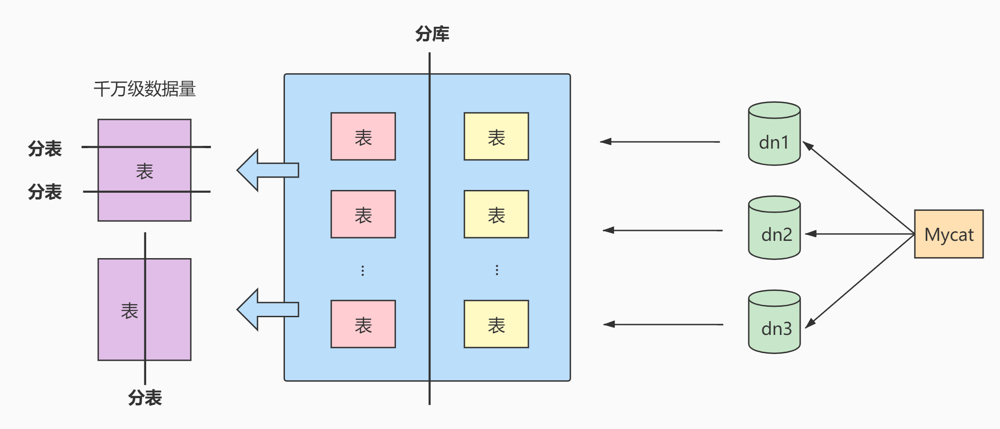

# 数据库的设计规范

## 范式

### 范式简介


### 范式都包括哪些


### 键和相关属性的概念

范式的定义会使用到主键和[候选键](https://so.csdn.net/so/search?q=候选键&spm=1001.2101.3001.7020)，数据库中的键(Key)由一个或者多个属性组成。数据表中常用的几种键和属性的定义:

- `超键`︰能唯─标识元组（记录）的属性集叫做超键。
- `候选键`︰如果超键不包括多余的属性（**不能从中移除任何一个属性而仍然保持唯一性。**），那么这个超键就是候选键。候选键不一定只包含一个属性。
- `主键`：用户可以从候选键中选择一个作为主键
- `外键`∶如果数据表R1中的某属性集不是R1的主键，而是另一个数据表R2的主键，那么这个属性集就是数据表R1的外键。

- `主属性`:包含在任一候选键中的属性称为主属性。
- `非主属性`:与主属性相对，指的是不包含在任何一个候选键中的属性。

通常，我们也将候选键称之为`“码”`，把主键也称为`“主码”`。因为键可能是由多个属性组成的，针对单个属性，我们还可以用主属性和非主属性来进行区分。


**举例，这里有两个表：**

`球员表(player)`：球员编号 | 姓名 | 身份证号 | 年龄 | 球队编号

`球队表(team)`：球队编号 | 主教练 | 球队所在地

- `超键`：对于球员表来说，超键就是包括球员编号或者身份证号的任意组合，比如（球员编号）（球员编号，姓名）（身份证号，年龄）等。
- `候选键`：就是最小的超键，对于球员表来说，候选键就是（球员编号）或者（身份证号）。

- `主键`：我们自己选定，也就是从候选键中选择一个，比如（球员编号）。
- `外键`：球员表中的球队编号。

- `主属性`、`非主属性`：在球员表中，主属性是（球员编号）（身份证号），其他的属性（姓名）（年龄）（球队编号）都是非主属性。


### [第一范式](https://so.csdn.net/so/search?q=第一范式&spm=1001.2101.3001.7020)(1st NF)

第一范式主要是确保数据表中每个字段的值必须具有[原子性](https://so.csdn.net/so/search?q=原子性&spm=1001.2101.3001.7020)，也就是说数据表中每个字段的值为不可再次拆分的最小数据单位。

我们在设计某个字段的时候，对于字段×来说，不能把字段×拆分成字段X_1和字段X_2。事实上，任何的DBMS都会满足第一范式的要求，不会将字段进行拆分。

**举例一：**


**举例二：**


**举例三**


### 第二范式(2nd NF)

第二范式要求，在满足第一范式的基础上，还要满足数据表里的每一条数据记录，都是可唯一标识的（**也就是一定有主键**）。而且所有非主键字段，都必须完全依赖主键，不能只依赖主键的一部分。（**联合主键的情况下必须依赖联合主键的所有属性才能确定每个非主键字段的值**）如果知道主键的所有属性的值，就可以检索到任何元组（行）的任何属性的任何值。(**要求中的主键，其实可以拓展替换为候选键**)

另外 第二范式只能完全函数依赖，不能部分函数依赖

**举例1：**
成绩表 （学号，课程号，成绩）关系中，（学号，课程号）可以决定成绩，但是学号不能决定成绩，课程号也不能决定成绩，所以“`（学号，课程号）→成绩`”就是 完全依赖关系 。


**举例2：**

`比赛表 player_game`，里面包含球员编号、姓名、年龄、比赛编号、比赛时间和比赛场地等属性，这里候选键和主键都为（球员编号，比赛编号），我们可以通过候选键（或主键）来决定如下的关系：

```
(球员编号, 比赛编号) → (姓名, 年龄, 比赛时间, 比赛场地，得分)
```

但是这个数据表不满足第二范式，因为数据表中的字段之间还存在着如下的对应关系：

```
# 姓名和年龄部分依赖球员编号。
(球员编号) → (姓名，年龄)

# 比赛时间, 比赛场地部分依赖(球员编号, 比赛编号)。
(比赛编号) → (比赛时间, 比赛场地)
```

**对于非主属性来说，并非完全依赖候选键。这样会产生怎样的问题呢？(为什么要满足2NF)**

`数据冗余`： 如果一个球员可以参加 m 场比赛，那么球员的姓名和年龄就重复了 m-1 次。一个比赛也可能会有 n 个球员参加，比赛的时间和地点就重复了 n-1 次。

`插入异常`： 如果我们想要添加一场新的比赛，但是这时还没有确定参加的球员都有谁，那么就没
法插入。

`删除异常`： 如果我要删除某个球员编号，如果没有单独保存比赛表的话，就会同时把比赛信息删
除掉。

`更新异常`： 如果我们调整了某个比赛的时间，那么数据表中所有这个比赛的时间都需要进行调
整，否则就会出现一场比赛时间不同的情况。

为了避免出现上述的情况，我们可以把球员比赛表设计为下面的三张表。

| 表名                        | 属性（字段）                       |
| --------------------------- | ---------------------------------- |
| 球员 player 表              | 球员编号、姓名和年龄等属性         |
| 比赛 game 表                | 比赛编号、比赛时间和比赛场地等属性 |
| 球员比赛关系 player_game 表 | 球员编号、比赛编号和得分等属性     |

这样的话，每张数据表都符合第二范式，也就避免了异常情况的发生。

> 1NF告诉我们字段属性需要是原子性的，而2NF告诉我们一张表就是一个独立的对象，一张表只表达一个意思


**举例三**


>  小结: 第二范式(2NF）要求实体的属性完全依赖主关键字。如果存在不完全依赖，那么这个属性和主关键字的这一部分应该分离出来形成一个新的实体，新实体与元实体之间是一对多的关系。


### 第三范式(3rd NF)

第三范式是在第二范式的基础上，确保数据表中的每一个非主键字段都和主键字段直接相关，也就是说，**要求数据表中的所有非主键字段不能依赖于其他非主键字段。**通俗地讲，该规则的意思是所有`非主键属性`之间不能有**传递依赖**关系，必须`相互独立`。（这里的主键可以拓展为候选键）

**举例一**


**举例二**

修改第二范式中的举例三:


> 符合3NF后的数据模型通俗地讲，2NF和3NF通常以这句话概括:“每个非键属性依赖于键，依赖于整个键，并且除了键别无他物”。


### 小结

**范式的优点：**数据的标准化有助于消除数据库中的`数据冗余`，第三范式（3NF）通常被认为在性能、拓展性和数据完整性方面达到了最好的平衡。

**范式的缺点：**范式的使用，可能`降低查询的效率`。因为范式等级越高，设计出来的数据表就越多、越精细，数据的冗余度就越低，进行数据查询的时候就可能需要`关联多张表`，这不但代价昂贵，也可能使一些`索引策略无效`。

范式只是提出了设计的标准，实际上设计数据表时，未必一定要符合这些标准。开发中，我们会出现为了性能和读取效率违反范式化的原则，通过`增加少量的冗余`或重复的数据来提高数据库的`读性能`，减少关联查询，join表的次数，实现`空间换取时间`的目的。因此在实际的设计过程中要理论结合实际，灵活运用。

> 范式本身没有优劣之分，只有适用场景不同。没有完美的设计，只有合适的设计，我们在数据表的设计中，还需要根据需求将范式和反范式混合使用。


## 反范式化

### 概述

有的时候不能简单按照规范要求设计数据表，因为有的数据看似穴余，其实对业务来说十分重要。这个时候，我们就要遵循`业务优先`的原则，首先满足业务需求，再尽量减少冗余。

如果数据库中的数据量比较大，系统的UV和PV访问频次比较高，则完全按照MySQL的三大范式设计数据表，读数据时会产生大量的关联查询，在一定程度上会影响数据库的读性能。如果我们想对查询效率进行优化，反范式化也是一种优化思路。此时，可以通过在数据表中增加冗余字段来提高数据库的读性能。

**规范化 vs 性能**

> 1. 为满足某种商业目标 , 数据库性能比规范化数据库更重要
> 2. 在数据规范化的同时 , 要综合考虑数据库的性能
> 3. 通过在给定的表中添加额外的字段，以大量减少需要从中搜索信息所需的时间
> 4. 通过在给定的表中插入计算列，以方便查询


**举例**

员工的信息存储在 `employees` 表 中，部门信息存储在 `departments` 表 中。通过 employees 表中的department_id字段与 departments 表建立关联关系。如果要查询一个员工所在部门的名称：

```mysql
select employee_id,department_name
from employees e join departments d
on e.department_id = d.department_id;
```

如果经常需要进行这个操作，连接查询就会浪费很多时间。可以在 employees 表中增加一个冗余字段department_name，这样就不用每次都进行连接操作了。


### 反范式的新问题

- 存储`空间变大`了
- 一个表中字段做了修改，另一个表中冗余的字段也需要做同步修改，否则`数据不一致`
- 若采用存储过程来支持数据的更新、删除等额外操作，如果更新频繁，会非常`消耗系统资源`
- 在`数据量小`的情况下，反范式不能体现性能的优势，可能还会让数据库的设计更加`复杂`


###  反范式的适用场景

当冗余信息有价值或者能`大幅度提高查询效率`的时候，我们才会采取反范式的优化。

1. 增加冗余字段的建议

   1）这个冗余字段`不需要经常进行修改`

   2）这个冗余字段`查询的时候不可或缺` (因为经常要用，所以才增加该冗余字段)

2. 历史快照、历史数据的需要

   在现实生活中，我们经常需要一些冗余信息，比如订单中的收货人信息，包括姓名、电话和地址等。每次发生的`订单收货信息`都属于`历史快照`，需要进行保存，但用户可以随时修改自己的信息，这时保存这些冗余信息是非常有必要的。

   反范式优化也常用在`数据仓库`的设计中，因为数据仓库通常`存储历史数据`，对增删改的实时性要求不强，对历史数据的分析需求强。这时适当允许数据的冗余度，更方便进行数据分析。

>  简单总结下数据仓库和数据库在使用上的区别:
>
> 1. 数据库设计的目的在于捕获数据，而数据仓库设计的目的在于分析数据；
> 2. 数据库对数据的增删改实时性要求强，需要存储在线的用户数据，而数据仓库存储的一般是历史数据;
> 3. 数据库设计需要尽量避免冗余，但为了提高查询效率也允许一定的冗余度，而数据仓库在设计上更偏向采用反范式设计

注意：我们的反范式 反的是第二 或 第三范式，第一范式是一定要遵守的

## BCNF巴斯范式

人们在3NF的基础上进行了改进，提出了**巴斯范式(BCNF)**，也叫做**巴斯-科德范式(Boyce-Codd NormalForm)**。BCNF被认为没有新的设计规范加入，只是对第三范式中设计规范要求更强，使得数据库冗余度更小。所以，称为是`修正的第三范式`，或`扩充的第三范式`，BCNF不被称为第四范式

若一个关系达到了第三范式，并且它只有一个候选键，或者它的每个候选键都是单属性，则该关系自然达到BC范式。

一般来说，一个数据库设计符合3NF或BCNF就可以了


**1、案例**

我们分析如下表的范式情况:


在这个表中，**一个仓库只有一个管理员**，同时一个管理员也只管理一个仓库。先来梳理下这些属性之间的依赖关系。

仓库名决定了管理员，管理员也决定了仓库名，同时（仓库名，物品名）的属性集合可以决定数量这个属性。这样，我们就可以找到数据表的候选键。

`候选键` ：是（管理员，物品名）和（仓库名，物品名），然后从候选键中选择一个作为 主键 ，比如（仓库名，物品名）。
`主属性` ：包含在任一候选键中的属性，也就是仓库名，管理员和物品名。

`非主属性` ：数量这个属性

**2、是否符合三范式**

如何判断一张表的范式呢？需要根据范式的等级，从低到高来进行判断

- 首先，数据表每个属性都是原子性的，符合 1NF 的要求；

- 其次，数据表中非主属性”数量“都与候选键全部依赖，（仓库名，物品名）决定数量，（管理员，物品名）决定数量。因此，数据表符合 2NF 的要求；
- 最后，符合 3NF 的要求，非主属性字段之间没有传递依赖。

**3、存在的问题**

既然数据表已经符合了 3NF 的要求，是不是就不存在问题了呢？来看下面的情况：

1. 增加一个仓库，但是还没有存放任何物品。根据数据表实体完整性的要求，主键不能有空值，因此会出现插入异常 ；
2. 如果仓库更换了管理员，就可能会 修改数据表中的多条记录 ；
3. 如果仓库里的商品都卖空了，那么此时仓库名称和相应的管理员名称也会随之被删除。

你能看到，即便数据表符合 3NF 的要求，同样可能存在插入，更新和删除数据的异常情况

**4、问题解决**

首先需要确认造成异常的原因：<mark>主属性仓库名对于候选键（管理员，物品名）是部分依赖的关系，这样就有可能导致上面的异常情况。因此引入BCNF，它在 3NF 的基础上消除了主属性对候选键的部分依赖或者传递依赖关系。</mark>

如果在关系R中，U为主键，A属性是主键的一个属性，若存在A->Y，Y为主属性，则该关系不属于BCNF。

根据 BCNF 的要求，需要把仓库管理关系 warehouse_keeper 表拆分成下面这样：

- `仓库表` ：（仓库名，管理员）
- `库存表` ：（仓库名，物品名，数量）

这样就不存在主属性对于候选键的部分依赖或传递依赖，上面数据表的设计就符合 BCNF。


**以下范式就用的很少了**

## 第四范式

- `函数依赖`

  假设有一个关系模式`Employee(ID, Name, Department)`，表示员工的信息：

  | ID   | Name | Department |
  | ---- | ---- | ---------- |
  | 001  | 张三 | 销售部     |
  | 002  | 李四 | 技术部     |
  | 003  | 王五 | 财务部     |

  在这个例子中，我们可以观察到以下函数依赖：

  - ID→Name：每个员工的ID决定了其唯一的姓名。
  - ID→Department：每个员工的ID也决定了其所属的部门。

  进一步地，如果我们确保没有两个员工有相同的姓名，则还可以有：

  - Name→ID：员工的名字也可以唯一地决定其ID（在这种情况下，姓名也是主键）。

  如果存在某个员工可能在不同的时间属于不同的部门，那么我们就不能说Name→Department成立，因为同一名字可能对应不同的部门。

- `多值依赖`

- `平凡的多值依赖`

  - **定义**：如果属性集 Y⊆X，即 Y 是 X 的子集，那么 X→→Y就是一个**平凡多值依赖**。
  - **理解**：X 决定它自己的一部分，这种依赖总是成立的，没有实际意义。
  - 例子
    - (学号,姓名)→→学号
    - (A,B)→→A

- `非平凡的多值依赖`︰全集（字段的全集）U=K+A+B，一个K可以对应于多个A，也可以对应于多个B，A与B互相独立，即K→→A，K→→B。整个表有多组一对多关系，且有：“一"部分是相同的属性集合，“多”"部分是互相独立的属性集合

  示例表：`SCH(学号, 课程, 爱好)`

  | 学号 | 课程 | 爱好   |
  | ---- | ---- | ------ |
  | 001  | 数学 | 打球   |
  | 001  | 英语 | 打球   |
  | 001  | 数学 | 听音乐 |
  | 001  | 英语 | 听音乐 |

  在这个表中：

  - 多条记录的 **学号和课程** 是相同的（比如两行都有 `001, 数学`）。
  - 但因为 **爱好不同**，所以需要分成多条记录。
  - 换句话说：**课程和爱好都是由学号决定的多个值，但它们之间互不相关。**

  这就说明：

  - `学号 →→ 课程`
  - `学号 →→ 爱好`

  这就是典型的 **非平凡多值依赖**！


**存在非平凡多值依赖时，会导致数据冗余和更新异常**。

比如上面的表，如果你要添加一门新课程“化学”，就必须为每个爱好都加一次，否则数据不对称。

这就是为什么我们要进行 **第四范式（4NF）** 的规范化。

**其中课程和爱好之间存在多对多的关系，第四范式正是要把同一表内的多对多关系删除。**


**举例1：**

职工表(职工编号，职工孩子姓名，职工选修课程)。

在这个表中，同一个职工可能会有多个职工孩子姓名。同样，同一个职工也可能会有多个职工选修课程，即这里存在着多值事实，不符合第四范式。

如果要符合第四范式，只需要将上表分为两个表，使它们只有一个多值事实，例如： `职工表一 (职工编号，职工孩子姓名)`，`职工表二 (职工编号，职工选修课程)`，两个表都只有一个多值事实，所以符合第四范式

**举例2：**

比如建立课程、教师、教材的模型。我们规定，每门课程有对应的一组教师，每门课程也有对应的一组教材，一门课程使用的教材和教师没有关系。我们建立的关系表如下：

课程ID，教师ID，教材ID；这三列作为联合主键。

为了表述方便，我们用Name代替ID，这样更容易看懂：


这个表除了联合主键，就没有其他字段了，所以肯定满足BC范式，但是却存在`多值依赖`导致的异常。

假如下学期想采用一本新的英版高数教材，但是还没确定具体哪个老师来教，那么就无法在这个表中维护Course高数和Book英版高数教材的的关系。

解决办法是把这个多值依赖的表拆解成2个表，分别建立关系。这是拆分后的表：


以及


## 第五范式、键域范式

核心思想：

**所有的连接依赖（Join Dependency）都是由候选键决定的。**

换句话说：

- 如果一个表能被无损地分解成多个子表，那么这些子表之间的连接应该是基于候选键的。
- 否则，就可能存在冗余，就需要进一步分解。


**示例说明：**

假设我们有一个表 `SuppliersPartsProjects(S#, P#, J#, Qty)`，表示：

- S#：供应商编号
- P#：零件编号
- J#：项目编号
- Qty：供应数量

这个表表达了三方关系：某个供应商给某个项目提供了多少某种零件。

| S#   | P#   | J#   | Qty  |
| ---- | ---- | ---- | ---- |
| S1   | P1   | J1   | 200  |
| S1   | P1   | J2   | 300  |
| S2   | P1   | J1   | 400  |

如果我们把这个表分解为三个表：

1. SP(S#, P#)
2. SJ(S#, J#)
3. PJ(P#, J#)

然后再把这些表做自然连接，可能会得到比原表更多的组合（例如 `(S1, P1, J1)` 和 `(S1, P2, J2)` 的组合），从而产生**虚假元组（Spurious Tuples）**。

这就说明原来的表存在**连接依赖（Join Dependency）**，而这个依赖不是由候选键决定的，因此不满足第五范式


**满足第五范式的条件**

> 一个关系模式 R 属于第五范式，当且仅当它的每一个非平凡连接依赖都由候选键所隐含。

通俗理解：

- 如果你把一个表拆分成多个小表，然后通过自然连接还原回来，结果和原来一模一样，而且不会多出任何数据，那么你就达到了第五范式。
- 否则，说明还存在冗余或结构设计问题。


## 案例实战

商超进货系统中的进货单表进行剖析：

部分进货单表：


这个表中的字段很多，表里的数据量也很惊人。大量重复导致表变得庞大，效率极低。如何改造?

> 在实际工作场景中，这种由于数据表结构设计不合理，而导致的数据重复的现象并不少见。往往是系统虽然能够运行，承载能力却很差，稍微有点流量，就会出现内存不足、CUP使用率飙升的情况，甚至会导致整个项目失败

### 迭代一次：1NF

第一范式要求:所有的字段都是基本数据字段，不可进一步拆分。这里需要确认，所有的列中，每个字段只包含—种数据。

这张表里把“property"这一字段，拆分成"specification (规格)“和"unit(单位)”，这2个字段如下:


### 迭代2次:考虑2NF

第二范式要求，在满足第一范式的基础上，**还要满足数据表里的每一条数据记录，都是可唯一标识的。而且所有字段，都必须完全依赖主键，不能只依赖主键的一部分**

第1步，就是要确定这个表的主键。通过观察发现，字段““listnumber(单号)”+"barcode(条码)"可以唯一标识每一条记录，可以作为主键。

第2步，确定好了主键以后，判断哪些字段完全依赖主键，哪些字段只依赖于主键的一部分。把只依赖于主键一部分的字段拆分出去，形成新的数据表。

首先，进货单明细表里面的“goodsname(名称)" "specification(规格)“unit(单位)“这些信息是商品的属性，只依赖于“barcode(条码)”，不完全依赖主键，可以拆分出去。把这3个字段加上它们所依赖的字段”“barcode(条码)”，拆分形成一个新的数据表“商品信息表”。

这样一来，原来的数据表就被拆分成了两个表

商品信息表:


进货单表：


此外，字段“supplierid(供应商编号)”“suppliername(供应商名称)”"stock(仓库)“只依赖于"listnumber(单号)”，不完全依赖于主键，所以，可以把"supplierid”“suppliername"stock"这3个字段拆出去，再加上它们依赖的字段"listnumber(单号)””，就形成了一个新的表“`进货单头表`”。剩下的字段，会组成新的表，我们叫它”进货单明细表”。


原来的数据表就拆分成了3个表

进货单头表:


进货单明细表：


商品信息表：


现在来分析一下拆分后的3个表，保证这3个表都满足第二范式的要求

第3步，在"商品信息表"中，字段"barcode"是有`可能存在重复的`，比如，用户门店可能有散装称重商品和自产商品，会存在条码共用的情况。所以，所有的字段都不能唯一标识表里的记录。这个时候必须给这个表加上一个主键，比如说是自增字段"`itemnumber`”。

现在就可以把进货单明细表里面的字段"barcode"都替换成字段"itemnumber"，这就得到了新的如下表

进货单明细表：


商品信息表：


拆分后的3个数据表就全部满足了第二范式的要求

###  迭代3次:考虑3NF

进货单头表还有数据冗余的可能。因为“supplername "依赖"supplierid"那么，这个时候，就可以按照第三范式的原则进行拆分了。进一步拆分一下进货单头表，把它拆解成供货商表和进货单头表。

供货商表:


进货单头表：


这2个表都满足第三范式的要求了

### 反范式化:业务优先的原则

在进货单明细表中，`quantity * importprice = importvalue`、“importprice"、“quantity"和"importvalue可以通过任意两个计算出第三个来，这就存在冗余字段。如果严格按照第三范式的要求，应该进行进一步优化。优化的办法是删除其中一个字段，只保留另外2个，这样就没有冗余数据了。

可是，真的可以这样做吗? 要回答这个问题就要先了解下实际工作中的**业务优先原则。**

所谓的业务优先原则，就是指一切以业务需求为主，技术服务于业务。**完全按照理论的设计不一定就是最优，还要根据实际情况来决定。**这里就来分析一下不同选择的利与弊。

对于`quantity * importprice =importvalue`，看起来"importvalue"似乎是冗余字段，但并不会导致数据不一致，可是，如果把这个字段取消，是会影响业务的。

因为有的时候，供货商会经常进行一些促销活动，按金额促销，那他们拿来的进货单只有金额，没有价格。而”“importprice"反而是通过“importvalue / quantity"计算出来的，经过四舍五入，会产生较大的误差。这样日积月累，最终会导致查询结果出现较大偏差，影响系统的可靠性。

举例:进货金额(importvalue)是25.5元，数量(quantity)是 34，那么进货价格(importprice)就等于25.5/34=0.74元，但是如果用这个计算出来的进货价格(importprice)来计算进货金额，那么，进货金额(importvalue)就等于0.74x34=25.16元，其中相差了25.5-25.16=0.34元


所以，本着业务优先的原则，在不影响系统可靠性的前提下，可适当增加数据冗余，保留“importvalue"importprice”和“quantity"。

因此，最后我们可以把进货单表拆分成下面的4个表:

进货单明细表：


商品信息表：


供货商表:


进货单头表：


这样一来，我们就避免了冗余，而且还能够满足业务的需求，这样的数据表设计，才是合格的设计。


## ER模型

**ER模型（Entity-Relationship Model，实体-关系模型）是数据库设计中用于描述现实世界数据结构的一个概念性工具。它通过图形化的方式帮助我们理解和设计数据库的逻辑结构。ER模型主要由三个基本元素组成：实体、属性和关系**。

**1. 实体（Entity）**

实体是指现实世界中可以相互区分的事物或对象。在ER图中，实体通常用矩形表示，并且每个实体都有一个唯一标识符称为**主键**（Primary Key），用来区别同一实体集中的不同实例。实体分为两类，分别是`强实体`和`弱实体`。强实体是指不依赖于其他实体的实体;弱实体是指对另一个实体有很强的依赖关系的实体。

- **例子**：在一个学校管理系统中，“学生”、“课程”、“教师”都可以被视为实体。

**2. 属性（Attribute）**

属性是用来描述实体特征的信息。每个实体都有一组属性来描述其具体特性。在ER图中，属性通常用椭圆形表示，并与对应的实体相连。

- **例子**：“学生”实体可能有“学号”、“姓名”、“年龄”等属性；其中，“学号”通常作为主键。

**3. 关系（Relationship）**

关系定义了不同实体之间的联系。在ER图中，关系通常用菱形表示，并通过线条连接相关的实体。关系还可以指定基数（Cardinality），即一个实体实例能与另一个实体实例关联的数量。

- **例子**：“学生”和“课程”之间可能存在“选修”的关系，这表明一个学生可以选修多门课程，而一门课程也可以被多名学生选修。

### ER图的基本符号

- **实体**：用矩形表示。
- **属性**：用椭圆表示，并通过线段连接到相应的实体。
- **关系**：用菱形表示，并通过线段连接相关联的实体。
- **主键**：通常下划线标记属性名称表示为主键。
- **基数**：通过线段两端的标记表示一对多、一对一或多对多的关系。


### 关系的类型

- **一对一关系**：一个实体实例与另一个实体的一个实例相关联。
- **一对多关系**：一个实体实例与另一个实体的多个实例相关联，但后者仅能与前者的一个实例相关联。
- **多对多关系**：两个实体的实例可以彼此互相关联多个实例。
- **递归关系**：同一实体内的实例之间存在关系。

### 建模分析

ER模型看起来比较麻烦，但是对我们把控项目整体非常重要。如果你只是开发一个小应用，或许简单设计几个表够用了，一旦要设计有一定规模的应用，在项目的初始阶段，建立完整的ER模型就非常关键了。开发应用项目的实质，其实就是`建模`

此处设计的案例是`电商业务`，由于电商业务太过庞大且复杂，所以做了业务简化，比如针对SKU(StockKeepingUnit，库存量单位）和SPU(Standard Product Unit，标准化产品单元)的含义上，直接使用了SKU，并没有提及SPU的概念。本次电商业务设计总共有8个实体，如下所示。

- 地址实体
- 用户实体
- 购物车实体
- 评论实体
- 商品实体
- 商品分类实体
- 订单实体
- 订单详情实体

其中，`用户`和`商品分类`是强实体，因为它们不需要依赖其他任何实体。而其他同于弱实体，因为它们虽然都可以独立存在，但是它们都依赖用户这个实体，因此都是弱实体。知道了这些要素就可以给电商业务创建ER模型了，如图:


在这个图中，地址和用户之间的添加关系，是一对多的关系，而商品和商品详情示一对一的关系，商品和订单是多对多的关系。 这个 ER 模型，包括了 8个实体之间的 8种关系。

（1）用户可以在电商平台添加多个地址；

（2）用户只能拥有一个购物车；

（3）用户可以生成多个订单；

（4）用户可以发表多条评论；

（5）一件商品可以有多条评论；

（6）每一个商品分类包含多种商品；

（7）一个订单可以包含多个商品，一个商品可以在多个订单里。

（8）订单中又包含多个订单详情，因为一个订单中可能包含不同种类的商品


###  ER 模型的细化

有了这个 ER 模型就可以从整体上`理解`电商的业务了。刚刚的 ER 模型展示了电商业务的框架，但是只包括了订单，地址，用户，购物车，评论，商品，商品分类和订单详情这八个实体，以及它们之间的关系，还不能对应到具体的表，以及表与表之间的关联。需要`把属性加上`，用`椭圆`来表示，这样得到的 ER 模型就更加完整了。

因此，我们需要进一步去设计一下这个 ER 模型的各个局部，也就是细化下电商的具体业务流程，然后把它们综合到一起，形成一个完整的 ER 模型。这样可以理清数据库的设计思路。

接下来再分析一下各个实体都有哪些属性，如下所示。

（1） `地址实体` 包括用户编号、省、市、地区、收件人、联系电话、是否是默认地址。
（2） `用户实体` 包括用户编号、用户名称、昵称、用户密码、手机号、邮箱、头像、用户级别。
（3） `购物车实体` 包括购物车编号、用户编号、商品编号、商品数量、图片文件url

4）`订单实体` 包括订单编号、收货人、收件人电话、总金额、用户编号、付款方式、送货地址、下单时间。
（5） `订单详情实体` 包括订单详情编号、订单编号、商品名称、商品编号、商品数量。
（6） `商品实体` 包括商品编号、价格、商品名称、分类编号、是否销售，规格、颜色。

（7） `评论实体` 包括评论id、评论内容、评论时间、用户编号、商品编号
（8） `商品分类实体` 包括类别编号、类别名称、父类别编号

这样细分之后就可以重新设计电商业务了，ER 模型如图：


### ER 模型图转换成数据表

通过绘制 ER 模型已经理清了业务逻辑，现在就要进行非常重要的一步了：把绘制好的 ER模型，转换成具体的数据表，下面介绍下转换的原则：

（1）一个`实体`通常转换成一个 `数据表` ；
（2）一个 `多对多的关系` ，通常也转换成一个 `数据表` ；
（3）一个` 1 对 1` ，或者 `1 对多` 的关系，往往通过表的` 外键` 来表达，而不是设计一个新的数据表；

（4） `属性` 转换成表的 `字段 `。

下面结合前面的ER模型，具体讲解一下怎么运用这些转换的原则，把 ER 模型转换成具体的数据表，从而把抽象出来的数据模型，落实到具体的数据库设计当中


**1、一个实体通常转换成一个数据表**

**先来看一下强实体转换成数据表:**

`用户实体`转换成`用户表`(user_info)的代码如下所示

```mysql
CREATE TABLE `user_info`(
    `id` bigint(20)NOT NULL AUTO_INCREMENT COMMENT '编号',
    `user_name` varchar(200)DEFAULT NULL COMMENT '用户名称',
    `nick_name` varchar (200)DEFAULT NULL COMMENT '用户昵称',
    `passwd` varchar (200)DEFAULT NULL COMMENT '用户密码',
    `phone_num` varchar (200) DEFAULT NULL COMMENT '手机号',
    `email` varchar(200) DEFAULT NULL COMMENT '邮箱',
    `head_img` varchar ( 200)DEFAULT NULL COMMENT'头像',
    `user_level` varchar(200) DEFAULT NULL COMMENT '用户级别',
    PRIMARY KEY (id)
) ENGINE=InnoDB AUTO_INCREMENT=4 DEFAULT CHARSET=utf8 COMMENT='用户表';

```

`商品分类实体`转换成商品分类表 (base_category)，由于商品分类可以有一级分类和二级分类，比如一级分类有家居、手机等等分类，二级分类可以根据手机的一级分类分为手机配件，运营商等，这里我们把商品分类实体规划为两张表，分别是一级分类表和二级分类表，之所以这么规划是因为一级分类和二级分类都是有限的，存储为两张表业务结构更加清晰。

```mysql
#一级分类表
  CREATE TABLE`base_category1`(
      `id` bigint(20) NOT NULL AUTO_INCREMENT COMMENT '编号',
      `name` varchar (10) NOT-NULL COMMENT '分类名称',
      PRIMARY KEY (`id`) USING BTREE
  )ENGINE=InnoDB AUTO_INCREMENT=1 DEFAULT CHARSET=utf8 ROW_FORMAT=DYNAMIC COMMENT='一级分类表';

#二级分类表
CREATE TABLE `base_category2`(
    `id` bigint(20) NOT NULL AUTO_INCREMENT COMMENT '编号',
    `name` varchar (208) NOT NULL COMMENT '二级分类名称',
    `category1_id` bigint(20) DEFAULT NULL COMMENT '一级分类编号',
    PRIMARY KEY (`id`) USING BTREE
)ENGINE=InnoDB AUTO_INCREMENT=1 DEFAULT CHARSET=utf8 ROW_FORMAT=DYNAMIC COMMENT='二级分类表';

```

那么如果规划为—张表呢，表结构如下所示。

```mysql
CREATE TABLE `base_category`(
    `id` bigint(20) NOT NULL AUTO_INCREMENT COMMENT '编号',
    `name` varchar (200)NOT NULL COMMENT '分类名不',
    `category_parent_id` bigint(20) DEFAULT NULL COMMENT '父分类编号',
    PRIMARY KEY ( id  ) USING BTREE
)ENGINE=InnoDB AUTO_INCRENENT=1 DEFAULT CHARSET=utf8 ROW_FORMAT=DYNAMIC COMMENT= '分类表';

```

如果这样分类的话，那么查询一级分类时候，就需要判断父分类编号是否为空，但是如果插入二级分类的时候也是空，就容易造成`业务数据混乱`。而且查询二级分类的时候IS NOT NULL条件是无法使用到索引的。同时，这样的设计也不符合第二范式(因为父分类编号并不依赖分类编号ID，因为父分类编号可以有很多数据为NULL)，所以需要进行表的拆分。因此无论是`业务需求`还是`数据库表的规范`来看都应该拆分为两张表。

**下面我们再把弱实体转换成数据表:**

地址实体转换成地址表(user_address) ，如下所示。

```mysql
CREATE TABLE `user_address`(
    `id` bigint(20)NOT NULL AUTO_INCREMENT COMMENT '编号',
    'province' varchar (500)DEFAULT NULL COMMENT'省',
    `city` varchar (500) DEFAULT NULL COMMENT '市',
    `user_address` varchar (500) DEFAULT NULL COMMENT '具体地址',
    `user_id bipint(20)` DEFAULT NULL COMMENT '用户id',
    `consignee` varchar( 40) DEFAULT NULL COMMENT '收件人',
    `phone_num ` varchar(40) DEFAULT NULL COMMENT ‘联系方式',
    `is_default` varchar( 1) DEFAULT NULL COMMENT '是否是默认',
    PRIMARY KEY (`id`)
)ENGINE=InnoDB AUTO_INCREMENT=1 DEFAULT CHARSET=utf8 COMMENT='用户地址表';

```

订单实体转换成订单表（order_info)，如下所示，实际业务中订单的信息会非常多，我们这里做了简化。

```mysql
CREATE TABLE `order_info`(
    `id` bigint(20) NOT NULL AUTO_INCREMENT COMMENT '编号',
    `consignee` varchar (100) DEFAULT NULL COMMENT '收货人',
    `consignee_tel` varchar(20) DEFAULT NULL COMMENT'收件人电话',
    `total_amount` decimal( 10,2)DEFAULT NULL COMMENT '总金额',
    `user_id` bigint(20) DEFAULT NULL COMMENT'用户id',
    `payment_way` varchar(20)DEFAULT NULL COMMENT'付款方式',
    `delivery_address` varchar( 1000) DEFAULT NULL COMMENT'送货地址',
    `create_time` datetime DEFAULT NULL COMMENT'下单时间',
    PRIMARY KEY (`id`) USING BTREE
)ENGINE=InnoDB AUTO_INCRENENT=1 DEFAULT CHARSET=utf8 ROW_FORNAT=DYNAMIC COMMENT= '订单表';

```

订单详情实体转换成订单详情表（order_detail)，如下所示。(用于体现多对多关系的，见下节)

```mysql
#订单详情表
CREATE TABLE `order_detail`(
    `id` bigint(20) NOT NULL AUTO_INCREMENT COMMENT '订单详情编号',
    `order_id` bigint(20) DEFAULT NULL COMMENT '订单编号',
    `sku_id` bigint(20)DEFAULT NULL COMMENT 'sku_id',
    `sku_name` varchar(200) DEFAULT NULL COMMENT 'sku名称',
    `sku_num` varchar(200) DEFAULT NULL COMMENT '购买个数',
    `create_time` datetime DEFAULT NULL COMMENT'操作时间',
    PRIMARY KEY (`id`) USING BTREE
)ENGINE=InnoDB AUTO_INCREMENT=1 DEFAULT CHARSET=utf8 ROW_FORMAT=DYNAMIC COMMENT='订单明细表';

```

购物车实体转换成购物车表(cart_info)，如下所示。

```mysql
CREATE TABLE `cart_info`(
    `cart_id` bigint(20)NOT NULL AUTO_INCREMENT COMMENT'编号',
    `user_id` varchar(200) DEFAULT NULL COMMENT'用户id',
    `sku_id` bigint(20)DEFAULT NULL COMMENT 'skuid' ,
    `sku_num` int( 11)DEFAULT NULL COMMENT '数量',
    `img_url` varchar ( 500) DEFAULT NULL COMMENT '图片文件',
    PRIMARY KEY (`id`) USING BTREE
)ENGINE=InnoDB AUTO_INCRENENT=1 DEFAULT CHARSET=utf8 ROW_FORMAT=DYNAMIC COMMENT='购物车表';

```

评论实体转换成评论表(members)，如下所示。

```mysql
CREATE TABLE `sku_comments`(
    `comment_id` bigint(20) NOT NULL AUTO_INCREMENT COMMENT'评论编号',
    `user_id` bigin)t (20) DEFAULT NULL COMMENT'用户编号',
  `sku_id` decimal( 10,0) DEFAULT NULI COMMENT '商品编号',
  `comment` varchar(2000)DEFAULT NULL COMMENT '评论内容',
  `create_time` datetime DEFAULT NULL COMMENT '评论时间',
  PRIMARY KEY (`id`) USING BTREE
）ENGINE=InnoDB AUTO_INCRENENT=45 DEFAULT CHARSET=utf8 ROW_FORMAT=DYNAMIC COMMNENT='商品评论表';

```

商品实体转换成商品表(members)，如下所示。

```mysql
CREATE TABLE `sku_info`(
    `sku_id` bigint(20) NOT NULL AUTO_INCREMENT COPMENT'商品编号(itemID)',
    `price` decimal(10,0) DEFAULT NULL COMMENT'价格',
    `sku_name` varchar(200) DEFAULT NULL COMMENT 'sku名称',
    `sku_desc` varchar(2000) DEFAULT NULL COMMENT'商品规格描述',
    `category3_id` bigint(20) DEFAULT NULL COMMENT'三级分类id(冗余)',
    `color` varchar (2000) DEFAULT NULL COMMENT '颜色',
    `is_sale` tinyint(3) NOT NULL DEFAULT '0' CONMMENT'是否销售(1:是0:否)',
    PRIMARY KEY (`id`) USING BTREE
)ENGINE=InnoDB AUTO_INCRENENT=45 DEFAULT CHARSET=utf8 ROW_FORMAT=DYNAMIC COMMENT= '商品表';

```


**2、一个多对多的关系转换成一个数据表**

这个ER模型中的多对多的关系有1个，即`商品`和`订单`之间的关系，同品类的商品可以出现在不同的订单中，不同的订单也可以包含同一类型的商品，所以它们之间的关系是多对多。针对这种情况需要设计一个独立的表来表示，这种表一般称为`中间表`。

我们可以设计一个独立的`订单详情表`，来代表商品和订单之间的包含关系。这个表关联到2个实体，分别是订单、商品。所以，表中必须要包括这2个实体转换成的表的主键。除此之外，我们还要包括该关系自有的属性:商品数量，商品下单价格以及商品名称。

```mysql
#订单详情表
CREATE TABLE `order_detail`(
    `id` bigint(20) NOT NULL AUTO_INCREMENT COMMENT '订单详情编号',	 # 本表主键
    `order_id` bigint(20)DEFAULT NULL COMMENT '订单编号',	  # 订单表主键
    `sku_id` bigint(20) DEFAULT NULL COMMENT 'sku_id ', 	# 商品表主键
    `sku_name` varchar(200) DEFAULT NULL COMMENT 'sku名称',
    `sku_num` varchar(200)DEFAULT NULL COMMENT '购买个数',
    `create_time` datetime DEFAULT NULL COMMENT '操作时间',
    PRIMARY KEY (`id`) USING BTREE
)ENGINE=InnoDB AUTO_INCRENENT=1 DEFAULT CHARSET=utf8 ROW_FORMAT=DYNAMIC COMMENT='订单明细表';
```

> 公司的订单相关表主要有：order、order_item、sku、spu…其中order_detail相当于order_item

**3、通过外键来表达1对多的关系**

在上面的表的设计中，我们可以用外键来表达1对多的关系。比如在商品评论表sku_comments中
我们分别把user_id、sku_id定义成外键，以使用下面的语句设置外键。

```
CONSTRAINT fk_comment_user FOREIGN KEY (user_id) REFERENCES user_info (id),

CONSTRAINT fk_comment_sku FOREIGN KEY (sku_id)REFERENCES sku_info (sku_id)
```

外键约束主要是在数据库层面上`保证数据的一致性`，但是因为插入和更新数据需要检查外键，理论上`性能会有所下降`，对性能是负面的影响。

实际的项目，不建议使用外键，一方面是`降低开发的复杂度`(有外键的话主从表类的操作必须先操作主表)，另外是有外键在`处理数据的时候非常麻烦`。在电商平台，由于`并发业务量比较大`，所以一般不设置外键，以免影响数据库`性能`。

在应用层面做数据的`一致性检查`，本来就是一个正常的功能需求。如学生选课的场景，课程肯定不是输入的，而是通过下拉或查找等方式从系统中进行选取，就能够保证是合法的课程ID，因此就不需要靠数据库的外键来检查了。

**4、把属性转换成表的字段**

在刚刚的设计中，我们也完成了把属性都转换成了表的字段，比如把商品属性转换成了商品信息表中的字段。

```mysql
CREATE TABLE `sku_info`(
    `sku_id` bigint(20) NOT NULL AUTO_INCREMENT COPMENT'商品编号(itemID)',
    `price` decimal(10,0) DEFAULT NULL COMMENT'价格',
    `sku_name` varchar(200) DEFAULT NULL COMMENT 'sku名称',
    `sku_desc` varchar(2000) DEFAULT NULL COMMENT'商品规格描述',
    `category3_id` bigint(20) DEFAULT NULL COMMENT'三级分类id(冗余)',
    `color` varchar (2000) DEFAULT NULL COMMENT '颜色',
    `is_sale` tinyint(3) NOT NULL DEFAULT '0' CONMMENT'是否销售(1:是0:否)',
    PRIMARY KEY (`id`) USING BTREE
)ENGINE=InnoDB AUTO_INCRENENT=45 DEFAULT CHARSET=utf8 ROW_FORMAT=DYNAMIC COMMENT= '商品表';

```

到这里，我们通过创建`电商项目业务流程`的ER模型，再把ER模型转换成具体的数据表的过程，完成利用ER模型设计电商项目数据库的工作。

其实，任何一个基于数据库的应用项目，都可以通过这种`先建立ER 模型` ，再`转换成数据表`的方式，完成数据库的设计工作。创建ER模型不是目的，目的是把业务逻辑梳理清楚，设计出优秀的数据库。不是为了建模而建模，要利用创建ER模型的过程来整理思路，这样创建ER模型才有意义。


## 数据库对象编写建议

###  关于库

1. 【强制】库的名称必须控制在32个字符以内，只能使用英文字母、数字和下划线，建议以英文字母开头。
2. 【强制】库名中英文`一律小写`，不同单词采用`下划线`分割。须见名知意。
3. 【强制】库的名称格式：业务系统名称_子系统名。
4. 【强制】库名禁止使用关键字（如type,order等）。
5. 【强制】创建数据库时必须`显式指定字符集`，并且字符集只能是utf8或者utf8mb4。创建数据库SQL举例：CREATE DATABASE crm_fund `DEFAULT CHARACTER SET 'utf8'`;
6. 【建议】对于程序连接数据库账号，遵循`权限最小原则`。使用数据库账号只能在一个DB下使用，不准跨库。程序使用的账号`原则上不准有drop权限`。
7. 【建议】临时库以`tmp_`为前缀，并以日期为后缀；备份库以`bak_`为前缀，并以日期为后缀。

### 关于表、列

1. 【强制】表和列的名称必须控制在32个字符以内，表名只能使用英文字母、数字和下划线，建议以`英文字母开头`。
2. 【强制】 `表名、列名一律小写`，不同单词采用下划线分割。须见名知意。
3. 【强制】表名要求有模块名强相关，同一模块的表名尽量使用`统一前缀`。比如：crm_fund_item
4. 【强制】创建表时必须`显式指定字符集`为utf8或utf8mb4。
5. 【强制】表名、列名禁止使用关键字（如type,order等）。
6. 【强制】创建表时必须`显式指定表存储引擎`类型。如无特殊需求，一律为InnoDB。
7. 【强制】建表必须有`comment`。
8. 【强制】字段命名应尽可能使用表达实际含义的英文单词或`缩写`。如：公司 ID，不要使用 corporation_id, 而用corp_id 即可。
9. 【强制】布尔值类型的字段命名为`is_描述`。如member表上表示是否为enabled的会员的字段命名为 is_enabled。
10. 【强制】禁止在数据库中存储图片、文件等大的二进制数据。通常文件很大，短时间内造成数据量快速增长，数据库进行数据库读取时，通常会进行大量的随机IO操作，文件很大时，IO操作很耗时。通常存储于文件服务器，数据库只存储文件地址信息。
11. 【建议】建表时关于主键：`表必须有主键 `(1)强制要求主键为id，类型为int或bigint，且为auto_increment 建议使用unsigned无符号型。 (2)标识表里每一行主体的字段不要设为主键，建议设为其他字段如user_id，order_id等，并建立unique key索引。因为如果设为主键且主键值为随机插入，则会导致innodb内部页分裂和大量随机I/O，性能下降。
12. 【建议】核心表（如用户表）必须有行数据的`创建时间字段`（create_time）和`最后更新时间字段`（update_time），便于查问题。
13. 【建议】表中所有字段尽量都是`NOT NULL`属性，业务可以根据需要定义`DEFAULT值`。 因为使用NULL值会存在每一行都会占用额外存储空间、数据迁移容易出错、聚合函数计算结果偏差等问题。
14. 【建议】所有存储相同数据的`列名和列类型必须一致`（一般作为关联列，如果查询时关联列类型不一致会自动进行数据类型隐式转换，会造成列上的索引失效，导致查询效率降低）。
15. 【建议】中间表（或临时表）用于保留中间结果集，名称以`tmp_`开头。备份表用于备份或抓取源表快照，名称以`bak_`开头。中间表和备份表定期清理。
16. 【示范】一个较为规范的建表语句：

```mysql
CREATE TABLE user_info ( 
    `id` int unsigned NOT NULL AUTO_INCREMENT COMMENT '自增主键', 
    `user_id` bigint(11) NOT NULL COMMENT '用户id', 
    `username` varchar(45) NOT NULL COMMENT '真实姓名', 
    `email` varchar(30) NOT NULL COMMENT '用户邮箱', 
    `nickname` varchar(45) NOT NULL COMMENT '昵称', 
    `birthday` date NOT NULL COMMENT '生日', 
    `sex` tinyint(4) DEFAULT '0' COMMENT '性别', 
    `short_introduce` varchar(150) DEFAULT NULL COMMENT '一句话介绍自己，最多50个汉字', 
    `user_resume` varchar(300) NOT NULL COMMENT '用户提交的简历存放地址', 
    `user_register_ip` int NOT NULL COMMENT '用户注册时的源ip', 
    `create_time` timestamp NOT NULL DEFAULT CURRENT_TIMESTAMP COMMENT '创建时间', 
    `update_time` timestamp NOT NULL DEFAULT CURRENT_TIMESTAMP ON UPDATE CURRENT_TIMESTAMP COMMENT '修改时间', 
    `user_review_status` tinyint NOT NULL COMMENT '用户资料审核状态，1为通过，2为审核中，3为未 通过，4为还未提交审核',
    PRIMARY KEY (`id`), 
    UNIQUE KEY `uniq_user_id` (`user_id`), 
    KEY `idx_username`(`username`), 
    KEY `idx_create_time_status`(`create_time`,`user_review_status`) 
) ENGINE=InnoDB DEFAULT CHARSET=utf8 COMMENT='网站用户基本信息'
```

1. 【建议】创建表时，可以使用可视化工具。这样可以确保表、字段相关的约定都能设置上。实际上，我们通常很少自己写 DDL 语句，可以使用一些可视化工具来创建和操作数据库和数据表。可视化工具除了方便，还能直接帮我们将数据库的结构定义转化成 SQL 语言，方便数据库和数据表结构的导出和导入。

###  关于索引

1. 【强制】InnoDB表必须主键为id int/bigint auto_increment，且主键值`禁止被更新`。
2. 【建议】主键的名称以`pk_`开头，唯一键以`uni_`或`uk_`开头，普通索引以`idx_`开头，一律使用小写格式，以字段的名称或缩写作为后缀。
3. 【建议】多单词组成的columnname，取前几个单词首字母，加末单词组成column_name。如: sample 表 member_id 上的索引：idx_sample_mid。
4. 【建议】单个表上的索引个数`不能超过6个`。
5. 【建议】在建立索引时，多考虑建立`联合索引`，并把区分度最高的字段放在最前面。
6. 【建议】在多表 JOIN 的SQL里，保证被驱动表的连接列上有索引，这样JOIN 执行效率最高。
7. 【建议】建表或加索引时，保证表里互相不存在`冗余索引`。 比如：如果表里已经存在key(a,b)， 则key(a)为冗余索引，需要删除。

### SQL编写

1. 【强制】程序端SELECT语句必须指定具体字段名称，禁止写成 *。
2. 【建议】程序端insert语句指定具体字段名称，不要写成INSERT INTO t1 VALUES(…)。
3. 【建议】除静态表或小表（100行以内），DML语句必须有WHERE条件，且使用索引查找。
4. 【建议】INSERT INTO…VALUES(XX),(XX),(XX).. 这里XX的值不要超过5000个。 值过多虽然上线很快，但会引起主从同步延迟。
5. 【建议】SELECT语句不要使用UNION，推荐使用UNION ALL，（unionall不用去重，不会产生临时表）并且UNION子句个数限制在5个以内。
6. 【建议】线上环境，多表 JOIN 不要超过5个表。
7. 【建议】减少使用ORDER BY，和业务沟通能不排序就不排序，或将排序放到程序端去做。ORDER BY、GROUP BY、DISTINCT 这些语句较为耗费CPU，数据库的CPU资源是极其宝贵的。
8. 【建议】包含了ORDER BY、GROUP BY、DISTINCT 这些查询的语句，WHERE 条件过滤出来的结果集请保持在1000行以内，否则SQL会很慢。
9. 【建议】对单表的多次alter操作必须合并为一次。对于超过100W行的大表进行alter table，必须经过DBA审核，并在业务低峰期执行，多个alter需整合在一起。 因为alter table会产生`表锁`，期间阻塞对于该表的所有写入，对于业务可能会产生极大影响。
10. 【建议】批量操作数据时，需要控制事务处理间隔时间，进行必要的sleep。
11. 【建议】事务里包含SQL不超过5个。因为过长的事务会导致锁数据较久，MySQL内部缓存、连接消耗过多等问题。
12. 【建议】事务里更新语句尽量基于主键或UNIQUE KEY，如UPDATE… WHERE id=XX;否则会产生间隙锁，内部扩大锁定范围，导致系统性能下降，产生死锁。


# PowerDesigner工具使用

[《MySQL高级篇》数据库建模工具---PowderDesigner的使用教程-CSDN博客](https://blog.csdn.net/LXYDSF/article/details/128489953)


# 数据库其他调优策略

## 数据库调优的措施

### 调优的目标

- 尽可能`节省系统资源`，以便系统可以提供更大负荷的服务（吞吐量更大)
- 合理的结构设计和参数调整，以提高用户`操作响应的速度`（响应速度更快)
- 减少系统的瓶颈，提高MySQL数据库整体的性能

### 如何定位调优问题

不过随着用户量的不断增加，以及应用程序复杂度的提升，我们很难用“`更快`”去定义数据库调优的目标，因为用户在不同时间段访问服务器遇到的瓶颈不同，比如双十一促销的时候会带来大规模的`并发访问`。还有用户在进行不同业务操作的时候，数据库的`事务处理`和`SQL查询`都会有所不同。因此还需要更加精细的定位，去确定调优的目标。

如何确定呢?一般情况下，有如下几种方式：

- **用户的反馈（主要）**
- **日志分析（主要）**
- **服务器资源使用监控**
- **数据库内部状况监控**
- **其它**


### 调优的维度和步骤

需要调优的对象是整个数据库管理系统，它不仅包括[SQL查询](https://so.csdn.net/so/search?q=SQL查询&spm=1001.2101.3001.7020)，还包括数据库的部署配置、架构等。从这个角度来说，思考的维度就不仅仅局限在SQL优化上了。通过如下的步骤进行梳理：

#### 第1步：选择适合的DBMS

如果对`事务性处理`以及`安全性要求高`的话，可以选择商业的数据库产品。这些数据库在事务处理和查询性能上都比较强，比如采用SQL Server、Oracle，那么`单表存储上忆条数据`是没有问题的。如果数据表设计得好，即使不采用`分库分表`的方式，查询效率也不差。

除此以外也可以采用开源的MySQL进行存储，它有很多存储引擎可以选择，如果进行事务处理的话可以选择lnnoDB，非事务处理可以选择MylSAM

NoSQL阵营包括`键值型数据库、文档型数据库、搜索引擎，列式存储`和`图形数据库`。这些数据库的优缺点和使用场景各有不同，比如列式存储数据库可以大幅度降低系统的I/O，适合于分布式文件系统，但如果数据需要频繁地增删改，那么列式存储就不太适用了。


#### 优化表设计

选择了DBMS 之后就需要进行表设计了。而数据表的设计方式也直接影响了后续的SQL查询语句。RDBMS中，每个对象都可以定义为一张表，表与表之间的关系代表了对象之间的关系。如果用的是MySQL，还可以根据不同表的使用需求，选择不同的存储引擎。除此以外，还有一些优化的原则可以参考:

1. 表结构要尽量`遵循三范式`的原则。这样可以让数据结构更加清晰规范，减少冗余字段，同时也减少了在更新，插入和删除数据时等异常情况的发生
2. 如果`查询`应用比较多，尤其是需要进行`多表联查`的时候，可以采用`反范式`进行优化。反范式采用`空间换时间`的方式，通过增加冗余字段提高查询的效率。
3. `表字段的数据类型`选择，关系到了查询效率的高低以及存储空间的大小。一般来说，如果字段可以采用数值类型就不要采用字符类型。字符长度要尽可能设计得短一些。针对字符类型来说，当确定字符长度固定时，就可以采用CHAR 类型。当长度不固定时，通常采用VARCHAR类型。

#### 优化逻辑查询

当建立好数据表之后，就可以对数据表进行增删改查的操作了。这时首先需要考虑的是逻辑查询优化。

SQL查询优化，可以分为`逻辑查询优化`和`物理查询优化`。逻辑查询优化就是通过改变SQL语句的内容让SQL执行效率更高效，采用的方式是对SQL语句进行等价变换，对查询进行重写。

SQL的查询重写包括了子查询优化、等价谓词重写、视图重写、条件简化、连接消除和嵌套连接消除等。

比如在讲解EXISTS子查询和lN子查询的时候，会根据小表驱动大表的原则选择适合的子查询。在WHERE子句中会尽量避免对字段进行函数运算，它们会让字段的索引失效。

**举例：**

查询评论内容开头为abc的内容都有哪些，如果在WHERE子句中使用了函数，语句就会写成下面这样：

```mysql
SELECT comment_id, comment_text,comment_time FROM product_comment 
WHERE SUBSTRING(comnment_text,1,3) = 'abc';
```

采用查询重写的方式进行等价替换：

```mysql
SELECT comment_id, comment_text,comment_time FROM product_comment WHERE comment_text LIKE 'abc%';
```

#### 优化物理查询

物理查询优化是在确定了逻辑查询优化之后，采用物理优化技术(比如索引等)，通过计算代价模型对各种可能的访问路径进行估算，从而找到执行方式中代价最小的作为执行计划。**在这个部分中需要掌握的重点是对索引的创建和使用**

但索引不是万能的，要根据实际情况来创建索引。那么都有哪些情况需要考虑呢?在前面几章中已经进行了细致的剖析。

SQL查询时需要对不同的数据表进行查询，因此在物理查询优化阶段也需要确定这些查询所采用的路径，具体的情况包括:

1. `单表扫描`︰对于单表扫描来说，可以全表扫描所有的数据，也可以局部扫描。
2. `两张表的连接`︰常用的连接方式包括了嵌套循环连接、 HASH连接和合并连接。
3. `多张表的连接`︰多张数据表进行连接的时候，`顺序`很重要，因为不同的连接路径查询的效率不同，搜索空间也会不同。在进行多表连接的时候，搜索空间可能会达到`很高的数据量级`，巨大的搜索空间显然会占用更多的资源，因此需要通过调整连接顺序，将搜索空间调整在一个可接受的范围内。

#### 使用Redis或 Memcached 作为缓存

#### 库级优化

库级优化是站在数据库的维度上进行的优化策略，比如控制一个库中的数据表数量。另外，单一的数据库总会遇到各种限制，不如取长补短，利用"外援"的方式。通过`主从架构`优化读写策略，通过对数据库进行垂直或者水平切分，突破单一数据库或数据表的访问限制，提升查询的性能。

**1.读写分离**

如果读和写的业务量都很大，并且它们都在同一个数据库服务器中进行操作，那么数据库的性能就会出现瓶颈，这时为了提升系统的性能，优化用户体验，可以采用`读写分离`的方式降低主数据库的负载，比如用主数据库(master）完成写操作，用从数据库(slave）完成读操作。


**2、数据分片**

对`数据库分库分表`。当数据量级达到千万级以上时，有时候要把一个数据库切成多份，放到不同的数据库服务器上，减少对单一数据库服务器的访问压力。如果你使用的是 MySQL，就可以使用MySQL自带的分区表功能，当然你也可以考虑自己做`垂直拆分（分库)`、`水平拆分(分表）`、`垂直+水平拆分(分库分表)`


> - 垂直分表：比如按照热数据、冷数据进行分表。
> - 水平分表：比如按照日期范围进行划分。
>
> 但需要注意的是，分拆在提升数据库性能的同时，也会增加维护和使用成本


## 优化MySQL服务器

优化MySQL服务器主要从两个方面来优化，一方面是对`硬件`进行优化。另一方面是对MySQL`服务的参数`进行优化。这部分的内容需要较全面的知识，一般只有`专业的数据库管理员`才能进行这一类的优化。对于可以定制参数的操作系统，也可以针对MySQL进行操作系统优化。

### 优化服务器硬件

服务器的硬件性能直接决定着MySQL数据库的性能。硬件的性能瓶颈直接决定MySQL数据库的运行速度和效率。针对性能瓶颈提高硬件配置，可以提高MySQL数据库查询、更新的速度。

(1）`配置较大的内存`。足够大的内存是提高MySQL数据库性能的方法之一。内存的速度比磁盘I/O快得多，可以通过增加系统的缓冲区容量使数据在内存中停留的时间更长，以`读少磁盘I/O`。

(2）`配置高速磁盘系统`，以减少读盘的等待时间，提高响应速度。磁盘的I/O能力，也就是它的寻道能力，目前的`SCSI`高速旋转的是7200转/分钟，这样的速度，一旦访问的用户量上去，磁盘的压力就会过大，如果是每天的网站pv (page view)在150w，这样的一般的配置就无法满足这样的需求了。现在`SSD`盛行，在SSD上随机访问和顺序访问性能几乎差不多，使用SSD可以减少随机IO带来的性能损耗。

(3)`合理分布磁盘I/O`，把磁盘I/O分散在多个设备上，以减少资源竞争，提高并行操作能力。

(4)`配置多处理器`，MySQL是多线程的数据库，多处理器可同时执行多个线程。

### 优化MySQL的参数

通过优化MySQL的参数可以提高资源利用率，从而达到提高MySQL服务器性能的目的

MySQL服务的配置参数都在`my.cnf`或者`my.ini`文件的[mysqld]组中，配置完参数以后，需要重新启动MySQL服务才会生效。

下面对几个对性能影响比较大的参数进行详细介绍。

- `innodb_buffer_pool_size`∶这个参数是Mysql数据库最重要的参数之一，表示InnoDB类型的`表和索引的最大缓存`。它不仅仅缓存`索引数据`，还会缓存`表的数据`。这个值越大，查询的速度就会越快。但是这个值太大会影响操作系统的性能。

- `key_buffer_size`: 表示`索引缓冲区的大小`。索引缓冲区是所有的`线程共享`。增加索引缓冲区可以得到更好处理的索引（对所有读和多重写)。当然，这个值不是越大越好，它的大小取决于内存的大小。如果这个值太大，就会导致操作系统频繁换页，也会降低系统性能。对于内存在`4GB`左右的服务器该参数可设置为`256M`或`384M`。

- `table_cache`:表示`同时打开的表的个数`。这个值越大，能够同时打开的表的个数越多。物理内存越大，设置就越大。默认为2402，调到512-1024最佳。这个值不是越大越好，因为同时打开的表太多会影响操作系统的性能

- `query_cache_size `:表示查询缓冲区的大小。可以通过在MySQL控制台观察，如果Qcache_lowmem_prunes的值非常大，则表明经常出现缓冲不够的情况，就要增加Query_cache_size的值;如果Qcache_hits的值非常大，则表明查询缓冲使用非常频繁，如果该值较小反而会影响效率，那么可以考虑不用查询缓存;

- `Qcache_free_blocks`，如果该值非常大，则表明缓冲区中碎片很多。MySQL8.0之后失效。该参数需要和query_cache_type配合使用。

- `query_cache_type`的值是0时，所有的查询都不使用查询缓存区。但是query_cache_type=0并不会导致MySQL释放query_cache_size所配置的缓存区内存。
  - 当query_cache_type=1时，所有的查询都将使用查询缓存区，除非在查询语句中指定SQL_NO_CACHE，如SELECT SQL_NO_CACHE FROM tbl_name。

  - 当query_cache_type=2时，只有在查询语句中使用SQL_CACHE 关键字，查询才会使用查询缓存区。使用查询缓存区可以提高查询的速度，这种方式只适用于修改操作少且经常执行相同的查询操作的情况。

- `sort_buffer_size`∶表示每个`需要进行排序的线程分配的缓冲区的大小`。增加这个参数的值可以提高`ORDER BY`或`GROUP BY`操作的速度。默认数值是2097144字节〈约2MB)。对于内存在4GB左右的服务器推荐设置为6-8M，如果有100个连接，那么实际分配的总共排序缓冲区大小为100×6= 600MB

- `join_buffer_size = 8M` :表示`联合查询操作所能使用的缓冲区大小`，和sort_buffer_size一样，该参数对应的分配内存也是每个连接独享。

- `read_buffer_size `:表示`每个线程连续扫描时为扫描的每个表分配的缓冲区的大小(字节）`。**当线程从表中连续读取记录时需要到这个缓冲区**。SET SESSION read_buffer_size=n可以临时设置该参数的值。默认为64K，可以设置为4M。

- `innodb_flush_log_at_trx_commit`∶表示`何时将缓冲区的数据写入日志文件`，并且将日志文件写入磁盘中。该参数对于innoDB引擎非常重要。该参数有3个值，分别为0、1和2。该参数的默认值为1。

  - 值为0时，表示`每秒1次`的频率将数据写入日志文件并将日志文件写入磁盘。每个事务的commit并不会触发前面的任何操作。该模式速度最快，但不太安全，mysqld进程的崩溃会导致上一秒钟所有事务数据的丢失。

  - 值为1时，表示`每次提交事务时`将数据写入日志文件并将日志文件写入磁盘进行同步。该模式是最安全的，但也是最慢的一种方式。因为每次事务提交或事务外的指令都需要把日志写入(flush）硬盘。

  - 值为2时，表示`每次提交事务时`将数据写入日志文件，`每隔1秒`将日志文件写入磁盘。该模式速度较快，也比0安全，只有在操作系统崩溃或者系统断电的情况下，上一秒钟所有事务数据才可能丢失。

- `innodb_log_buffer_size`:这是InnoDB存储引擎的`事务日志使用的缓冲区`。为了提高性能，也是先将信息写入Innodb Log Buffer中，当满足innodb_flush_log_trx_commit参数所设置的相应条件（或者日志缓冲区写满)之后，才会将日志写到文件(或者同步到磁盘〉中

- `max_connections`:表示允`许连接到MySQL数据库的最大数量`，默认值是`151`。如果状态变量 connection_errors_max_connections不为零，并且一直增长，则说明不断有连接请求因数据库连接数已达到允许最大值而失败，这时可以考虑增大max_connections的值，在Linux平台下，性能好的服务器，支持500-1000个连接不是难事，需要根据服务器性能进行评估设定。这个连接数`不是越大越好`，因为这些连接会浪费内存的资源。过多的连接可能会导致MySQL服务器僵死

- `back_log `：用于`控制MySQL监听TCP端口时设置的积压请求栈大小`。如果MySql的连接数达到max_connections时，新来的请求将会被存在堆栈中，以等待某一连接释放资源，该堆栈的数量即back_log，如果等待连接的数量超过back_log，将不被授予连接资源，将会报错。5.6.6 版本之前默认值为 50 ， 之后的版本默认为 50 + （max_connections / 5）， 对于Linux系统推荐设置为小于512的整数，但最大不超过900。

  **如果需要数据库在较短的时间内处理大量连接请求， 可以考虑适当增大back_log 的值。**

- `thread_cache_size `：`线程池缓存线程数量的大小`，当客户端断开连接后将当前线程缓存起来，当在接到新的连接请求时快速响应无需创建新的线程。这尤其对那些使用短连接的应用程序来说可以极大的提高创建连接的效率。那么为了提高性能可以增大该参数的值。默认为60，可以设置为120。

  可以通过如下几个MySQL状态值来适当调整线程池的大小：

```bash
show global status like 'Thread%';
/*
+-------------------+-------+
| Variable_name | Value |
+-------------------+-------+
| Threads_cached | 2 |
| Threads_connected | 1 |
| Threads_created | 3 |
| Threads_running | 2 |
+-------------------+-------+
*/
```

> 当 Threads_cached 越来越少，但 Threads_connected 始终不降，且 Threads_created 持续升高，可适当增加 thread_cache_size 的大小。

- `wait_timeout `：指定 `一个请求的最大连接时间 `，对于4GB左右内存的服务器可以设置为5-10。
- `interactive_timeout `：表示服务器在关闭连接前等待行动的秒数

#### 举例

下面是一个电商平台，类似京东或天猫这样的平台。商家购买服务，入住平台，开通之后，商家可以在系统中上架各种商品，客户通过手机App、微信小程序等渠道购买商品，商家接到订单以后安排快递送货。

`刚刚上线`的时候，系统运行状态良好。但是，随着入住的`商家不断增多`，使用系统的`用户量越来越多`，每天的订单数据达到了5万条以上。这个时候，系统开始出现问题，`CPU使用率不断飙升`。终于，双十一或者618活动高峰的时候，CPU使用率达到`99%`，这实际上就意味着，系统的计算资源已经耗尽，再也无法处理任何新的订单了。换句话说，系统已经崩溃了。

这个时候，我们想到了对系统参数进行调整，因为参数的值决定了资源配置的方式和投放的程度。为了解决这个问题，一共调整3个系统参数，分别是

- `InnoDB_flush_log_at_trx_commit`
- `lnnoDB_buffer_pool_size`
- `lnnoDB_buffer_pool_instances`

下面就说一说调整这三个参数的原因是什么：
**（1）调整系统参数lnnoDB_flush_log_at_trx_commit**

这个参数适用于InnoDB存储引擎，电商平台系统中的表用的存储引擎都是InnoDB。默认的值是1，意思是每次提交事务的时候，都把数据写入日志，并把日志写入磁盘。这样做的好处是`数据安全性最佳`，不足之处在于每次提交事务，都要进行磁盘写入的操作。在`大并发的场景下`，过于频繁的磁盘读写会导致CPU资源浪费，系统效率变低。

这个参数的值还有2个可能的选项，分别是0和2。把这个参数的值改成了2。这样就不用每次提交事务的时候都启动磁盘读写了，在大并发的场景下，可以改善系统效率，降低CPU使用率。即便出现故障，损失的数据也比绞小。

**（2）调整系统参数InnoDB_buffer_pool_size**
这个参数的意思是，InnoDB存储引擎使用`缓存来存储索引和数据`。这个值越大，可以加载到缓存区的索引和数据量就越多，需要的`磁盘读写就越少`。

因为MySQL服务器是数据库`专属服务器`，只用来运行MySQL数据库服务，没有其他应用了，而我们的计算机是64位机器，内存也有128G。于是把这个参数的值调整为64G。这样一来，磁盘读写次数可以大幅降低，就可以充分利用内存，释放出一些CPU的资源

**（3）调整系统参数InnoDB_buffer_pool_instances**
这个参数可以将InnoDB的缓存区分成几个部分，这样可以提高系统的`并行处理能力`，因为可以允许多个进程同时处理不同部分的缓存区。

把InnoDB_buffer_pool_instances的值修改为64，意思就是把 InnoDB的缓存区分成64个分区，这样就可以同时有`多个进程`进行数据操作，CPU的效率就高多了。修改好了系统参数的值，要重启MySQL数据库服务器。

> 总结一下就是遇到CPU资源不足的问题，可以从下面2个思路去解决。
>
> - 疏通拥堵路段，消除瓶颈，让等待的时间更短
> - 开拓新的通道，增加并行处理能力

## 优化数据库结构

### 拆分表:冷热数据分离

拆分表的思路是，把1个包含很多字段的表拆分成2个或者多个相对较小的表，这样做的原因是，这些表中某些字段的操作频率很高（`热数据`），经常要进行查询或者更新操作，而另外一些字段的使用频率却很低（`冷数据`），`冷热数据分离`，可以减小表的宽度。如果放在一个表里面，每次查询都要读取大记录，会消耗较多的资源。

MySQL限制每个表最多存储`4096`列，并且每一行数据的大小不能超过`65535`字节。表越宽，把表装载进内存缓冲池时所占用的内存也就越大，也会消耗更多的IO。冷热数据分离的目的是**:①减少磁盘Io，保证热数据的内存缓存命中率。②更有效的利用缓存，避免读入无用的冷数据。**


如果冷热数据均需要查询，可以使用`联合查询`。

### 增加中间表

对于需要经常联合查询的表，可以建立中间表以提高查询效率。**通过建立中间表，把需要经常联合查询的数据插入中间表中，然后将原来的联合查询改为对中间表的查询，以此来提高查询效率。**

首先，分析经常联合查询表中的字段。然后，使用这些字段建立一个中间表，并将原来联合查询的表的数据插入中间表中。最后，使用中间表来进行查询。

**举例:**学生信息表和班级表的SQL语句如下:

```mysql
CREATE TABLE `class` (
    `id` INT(11) NOT NULL AUTO_INCREMENT,
    `className` VARCHAR(30) DEFAULT NULL,
    `address` VARCHAR(40) DEFAULT NULL,
    `monitor` INT NULL ,
    PRIMARY KEY (`id`)
) ENGINE=INNODB AUTO_INCREMENT=1 DEFAULT CHARSET=utf8;

CREATE TABLE `student` (
    `id` INT(11) NOT NULL AUTO_INCREMENT,
    `stuno` INT NOT NULL ,
    `name` VARCHAR(20) DEFAULT NULL,
    `age` INT(3) DEFAULT NULL,
    `classId` INT(11) DEFAULT NULL,
    PRIMARY KEY (`id`)
) ENGINE=INNODB AUTO_INCREMENT=1 DEFAULT CHARSET=utf8;

```

现在有一个模块需要经常查询带有学生名称（name）、学生所在班级名称（className）、学生班级班长（monitor）的学生信息。根据这种情况可以创建一个 `temp_student `表。temp_student表中存储学生名称（stu_name）、学生所在班级名称（className）和学生班级班长（monitor）信息。创建表的语句如下：

```mysql
CREATE TABLE `temp_student` (
    `id` INT(11) NOT NULL AUTO_INCREMENT,
    `stu_name` INT NOT NULL ,
    `className` VARCHAR(20) DEFAULT NULL,
    `monitor` INT(3) DEFAULT NULL,
    PRIMARY KEY (`id`)
) ENGINE=INNODB AUTO_INCREMENT=1 DEFAULT CHARSET=utf8;

```

接下来，从学生信息表和班级表中查询相关信息存储到临时表中：

```mysql
insert into temp_student(stu_name,className,monitor)
      select s.name,c.className,c.monitor
      from student as s,class as c
      where s.classId = c.id

```

以后，可以直接从temp_student表中查询学生名称、班级名称和班级班长，而不用每次都进行联合查询。这样可以提高数据库的查询速度

> 如果用户信息修改了，是不是会导致temp_student中的数据不一致的问题呢?如何同步数据呢?
>
> 方式1:清空数据->重新添加数据
>
> 方式2:使用视图

###  增加冗余字段

设计数据库表时应尽量遵循范式理论的规约，尽可能减少冗余字段，让数据库设计看起来精致、优雅。但是，合理地加入冗余字段可以提高查询速度。

表的规范化程度越高，表与表之间的关系就越多，需要连接查询的情况也就越多。尤其在数据量大，而且需要频繁进行连接的时候，为了提升效率，我们也可以考虑增加冗余字段来减少连接。

这部分内容在《数据库的设计规范》章节中 `反范式化小节` 中具体展开讲解了。这里省略。

### 优化数据类型

改进表的设计时，可以考虑优化字段的数据类型。这个问题在大家刚从事开发时基本不算是问题。但是，随着你的经验越来越丰富，参与的项目越来越大，数据量也越来越多的时候，你就不能只从系统稳定性的角度来思考问题了，还要考虑到系统整体的稳定性和效率。此时，**优先选择符合存储需要的最小的数据类型。**

列的`字段越大`，建立索引时所需要的`空间也就越大`，这样一页中所能存储的索引节点的`数量就越少`，在遍历时所需要的`IO次数也就越多`，`索引的性能也就越差`。

具体来说:

**情况1：对整数类型数据进行优化。**

遇到整数类型的字段可以用 `INT `型 。这样做的理由是，INT 型数据有足够大的取值范围，不用担心数据超出取值范围的问题。刚开始做项目的时候，首先要保证系统的稳定性，这样设计字段类型是可以的。但在数据量很大的时候，数据类型的定义，在很大程度上会影响到系统整体的执行效率。

对于 `非负型` 的数据（如自增ID、整型IP）来说，要优先使用无符号整型 `UNSIGNED` 来存储。因为无符号相对于有符号，同样的字节数，存储的数值范围更大。如tinyint有符号为-128-127，无符号为0-255，多出一倍的存储空间。

**情况2：既可以使用文本类型也可以使用整数类型的字段，要选择使用整数类型。**

跟文本类型数据相比，大整数往往占用 `更少的存储空间` ，因此，在存取和比对的时候，可以占用更少的内存空间。所以，在二者皆可用的情况下，尽量使用整数类型，这样可以提高查询的效率。如：将IP地址转换成整型数据。

**情况3：避免使用TEXT、BLOB数据类型**

MySQL`内存临时表`不支持TEXT、BLOB这样的大数据类型，如果查询中包含这样的数据，在排序等操作时，就不能使用内存临时表，必须使`用磁盘临时表`进行。并且对于这种数据，Mysql还是要进行`二次查询`，会使SQL性能变得很差，但是不是说一定不能使用这样的数据类型。

如果一定要使用，建议把BLOB或是TEXT列`分离到单独的扩展表`中，查询时一定不要使用select *，而只需要取出必要的列，不需要TEXT列的数据时不要对该列进行查询。

**情况4∶避免使用ENUM类型**

修改ENUM值需要使用ALTER语句。

ENUN类型的ORDER BY操作效率低，需要额外操作。使用TINYINT来代替ENUM类型。

**情况5:使用TIMESTAMP存储时间**

TIMESTAMP存储的时间范围1970-01-0100:00:01~ 2038-01-19-03:14:07。TIMESTAMP使用4字节，DATETIME使用8个字节，同时TIMESTAN1P具有自动赋值以及自动更新的特性

**情况6:用DECIMAL代替FLOAT和DOUBLE存储精确浮点数**

1)非精准浮点: float,double
2)精准浮点: decimal

Decimal类型为精准浮点数，在计算时不会丢失精度，尤其是财务相关的金融类数据。占用空间由定义的宽度决定，每4个字节可以存储3位数字，并且小数点要占用一个字节。可用于存储比bigint更大的整型数据


### 优化插入记录的速度

插入记录时，影响插入速度的主要是索引、唯一性校验、一次插入记录条数等。根据这些情况可以分别进行优化。这里我们分为MyISAM存储引擎和InnoDB存储引擎来讲。

**1. MyISAM引擎的表**

① 禁用索引
对于非空表，插入记录时，MySQL会根据表的索引对插入的记录建立索引。如果插入大量数据，建立索引就会降低插入记录的速度。为了解决这种情况，可以在插入记录之前禁用索引，数据插入完毕后再开启索引。禁用索引的语句如下:

```
ALTER TABLE table_name DISABLE KEYS;
```

重新开启索引的语句如下:

```
ALTER TABLE table_name ENABLE  KEYS;
```

> 若对于空表批量导入数据，则不需要进行此操作，因为MyISAM引擎的表是在导入数据之后才建立索引的

②禁用唯一性检查
插入数据时，MySQL会对插入的记录进行唯一性校验。这种唯一性校验会降低插入记录的速度。为了降低这种情况对查询速度的影响，可以在插入记录之前禁用唯一性检合，等到记录插入完毕后再开启。禁用唯一性检查的语句如下:

```
SET UNIQUE_GHECKS=0;
```

开启唯一性检查的语句如下:

```
SET UNIQUE_GHECKS=1;
```

③使用批量插入
插入多条记录时，可以使用一条INSERT语句插入一条记录，也可以使用一条INSERT语句插入多条记录。插入一条记录的INSERT语句情形如下:

```
insert into student values(1,'zhangsan',18,1);
insert into student values(2,'lisi',17,1);
insert into student values(3,'wangwu',17,1);
insert into student values(4,'zhaoliu',19,1);
```

使用一条INSERT语句插入多条记录的情形如下:

```
insert into student values
(1,'zhangsan',18,1),
(2,'lisi',17,1),
(3,'wangwu',17,1),
(4,'zhaoliu',19,1);
```

第2种情形的插入速度要比第1种情形快。

④ 使用LOAD DATA INFILE 批量导入
当需要批量导入数据时，如果能用LOAD DATA INFILE语句，就尽量使用。因为LOAD DATA INFILE语句导入数据的速度比INSERT语句快。


**2. InnoDB引擎的表：**

① 禁用唯一性检查
插入数据之前执行 `set unique_checks=0`来禁止对唯一索引的检查，数据导入完成之后再运行`set unique_checks=1`。这个和MyISAM引擎的使用方法一样。

② 禁用外键检查
插入数据之前执行禁止对外键的检查，数据插入完成之后再恢复对外键的检查。禁用外键检查的语句如下;

```sql
SET foreign_key_checks=0;
```

恢复对外键的检查语句如下:

```sql
SET foreign_key_checks=1;
```

③ 禁止自动提交
插入数据之前禁止事务的自动提交，数据导入完成之后，执行恢复自动提交操作。禁止自动提交的语句如下:

```
set autocommit=0;
```

恢复自动提交的语句如下:

```sql
set autocommit=1;
```


### 使用非空约束

在设计字段的时候，如果业务允许，建议尽量使用非空约束。这样做的好处是:

①进行比较和计算时，省去要对NULL值的字段判断是否为空的开销，提高存储效率。
②非空字段也容易创建索引。因为索引NULL列需要额外的空间来保存，所以要占用更多的空间。使用非空约束，就可以节省存储空间(每个字段1个bit)

### 分析表、检查表与优化表

MySQL提供了分析表、检查表和优化表的语句。`分析表`主要是分析关键字的分布，`检查表`主要是检查表是否存在错误，`优化表`主要是消除删除或更新造成的空间浪费。

**1.分析表**

MySQL中提供了ANALYZE TABLE语句分析表，ANALYZE TABLE语句的基本语法如下:

```sql
ANALYZE [LOCAL | NO_WRITE_TO_BINLOG] TABLE tbl_name[,tbl_name]…
```

默认的，MySQL服务会将 ANALYZE TABLE语句写到binlog中，以便在主从架构中，从服务能够同步数据。可以添加参数LOCAL 或者 NO_WRITE_TO_BINLOG取消将语句写到binlog中。

使用` ANALYZE TABLE` 分析表的过程中，数据库系统会自动对表加一个 `只读锁` 。在分析期间，只能读取表中的记录，不能更新和插入记录。ANALYZE TABLE语句能够分析InnoDB和MyISAM类型的表，但是不能作用于视图。

ANALYZE TABLE分析后的统计结果会反应到 `cardinality `的值，该值`统计了表中某一键所在的列不重复的值的个数`。该值越接近表中的总行数，则在表连接查询或者索引查询时，就越优先被优化器选择使用。也就是索引列的cardinality的值与表中数据的总条数差距越大，即使查询的时候使用了该索引作为查询条件，存储引擎实际查询的时候使用的概率就越小。下面通过例子来验证下。cardinality可以通过SHOW INDEX FROM 表名查看。

**演示**

1、创建表并添加1000条记录

```mysql
#08-数据库的其他优化策略
CREATE TABLE `user1` (
    `id` INT NOT NULL AUTO_INCREMENT,
    `name` VARCHAR(255) DEFAULT NULL,
    `age` INT DEFAULT NULL,
    `sex` VARCHAR(255) DEFAULT NULL,
    PRIMARY KEY (`id`),
    KEY `idx_name` (`name`) USING BTREE
) ENGINE=INNODB AUTO_INCREMENT=1 DEFAULT CHARSET=utf8mb3;

#######
SET GLOBAL log_bin_trust_function_creators = 1;

DELIMITER //创建函数
CREATE FUNCTION  rand_num (from_num INT ,to_num INT) RETURNS INT(11)
BEGIN   
DECLARE i INT DEFAULT 0;  
SET i = FLOOR(from_num +RAND()*(to_num - from_num+1))   ;
RETURN i;  
END //
DELIMITER ;

### 创建存储过程
DELIMITER 
CREATE PROCEDURE  insert_user( max_num INT )
BEGIN  
DECLARE i INT DEFAULT 0;   
 SET autocommit = 0;    
 REPEAT  
 SET i = i + 1;  
 INSERT INTO `user1` ( NAME,age,sex ) 
 VALUES ("atguigu",rand_num(1,20),"male");  
 UNTIL i = max_num  
 END REPEAT;  
 COMMIT; 
END //
DELIMITER;

## 向表中添加1000条记录
CALL insert_user(1000);
```

2、查看表中的索引

```sql
SHOW INDEX FROM user1;
```


假如我们执行下列语句后：

```sql
UPDATE user1 SET NAME = 'atguigu03' WHERE id = 2;
OPTIMIZE TABLE t1;
SHOW INDEX FROM user1;
```


> 假如说我们把id=3的数据Name修改成atguigudb04，此时直接查看索引，发现Cardinality还是2，但是执行ANALYZE后，在查看发现Cardinality已经变成3了~ 说明ANALYZE启动了刷新数据的作用。


**2.检查表**
MySQL中可以使用 `CHECK TABLE` 语句来检查表。CHECK TABLE语句能够检查InnoDB和MyISAM类型的表是否存在错误。CHECK TABLE语句在执行过程中也会给表加上 `只读锁` 。

对于MyISAM类型的表，CHECK TABLE语句还会更新关键字统计数据。而且，CHECK TABLE也可以检查视图是否有错误，比如在视图定义中被引用的表已不存在。该语句的基本语法如下：

```mysql
CHECK TABLE tbl_name [, tbl_name] ... [option] ...
option = {QUICK | FAST | MEDIUM | EXTENDED |
```

其中，tbl_name是表名；option参数有5个取值，分别是QUICK、FAST、MEDIUM、EXTENDED和CHANGED。各个选项的意义分别是：

- `QUICK `：不扫描行，不检查错误的连接。
- `FAST `：只检查没有被正确关闭的表。
- `CHANGED `：只检查上次检查后被更改的表和没有被正确关闭的表。

- `MEDIUM `：扫描行，以验证被删除的连接是有效的。也可以计算各行的关键字校验和，并使用计算出的校验和验证这一点。
- `EXTENDED `：对每行的所有关键字进行一个全面的关键字查找。这可以确保表是100%一致的，但是花的时间较长。

option只对MyISAM类型的表有效，对InnoDB类型的表无效。比如：


该语句对于检查的表可能会产生多行信息。最后一行有一个状态的 `Msg_type `值，Msg_text 通常为 OK。如果得到的不是 OK，通常要对其进行修复；是 OK 说明表已经是最新的了。表已经是最新的，意味着存储引擎对这张表不必进行检查。

**3. 优化表**

**方式1：OPTIMIZE TABLE**
MySQL中使用 `OPTIMIZE TABLE` 语句来优化表。但是，OPTILMIZE TABLE语句只能优化表中的`VARCHAR` 、 `BLOB `或 `TEXT `类型的字段。一个表使用了这些字段的数据类型，若已经` 删除` 了表的一大部分数据，或者已经对含有可变长度行的表（含有VARCHAR、BLOB或TEXT列的表）进行了很多 `更新 `，则应使用OPTIMIZE TABLE来重新利用未使用的空间，并整理数据文件的 `碎片`

OPTIMIZE TABLE 语句对InnoDB和MyISAM类型的表都有效。该语句在执行过程中也会给表加上 `只读锁`

OPTILMIZE TABLE语句的基本语法如下：

```sql
OPTIMIZE [LOCAL | NO_WRITE_TO_BINLOG] TABLE tbl_name [, tbl_name] ...
```

LOCAL | NO_WRITE_TO_BINLOG关键字的意义和分析表相同，都是指定不写入二进制日志。

在MyISAM中，是先分析这张表，然后会整理相关的MySQL datafile，之后回收未使用的空间；在InnoDB中，回收空间是简单通过Alter table进行整理空间。在优化期间，MySQL会创建一个临时表，优化完成之后会删除原始表，然后会将临时表rename成为原始表。

> 说明： 在多数的设置中，根本不需要运行OPTIMIZE TABLE。即使对可变长度的行进行了大量的更新，也不需要经常运行， 每周一次 或 每月一次 即可，并且只需要对 特定的表 运行。

**方式2：使用mysqlcheck命令**

```sql
# mysqlcheck是Linux中的rompt,-o是代表optimize。
mysqlcheck -o DatabaseName TableName -u root -p******
```

举例：优化所有的表

```sql
mysqlcheck -o DatabaseName -u root -p******
#或
mysqlcheck -o --all-databases -u root -p******
```


### 小结

上述这些方法都是有利有弊的。比如：

- 修改数据类型，节省存储空间的同时，你要考虑到数据不能超过取值范围；
- 增加冗余字段的时候，不要忘了确保数据一致性；
- 把大表拆分，也意味着你的查询会增加新的连接，从而增加额外的开销和运维的成本。

因此，一定要结合实际的业务需求进行权衡。

## 大表优化

当MySQL单表记录数过大时，数据库的CRUD性能会明显下降，一些常见的优化措施如下:

### 限定查询的范围

禁止不带任何限制数据范围条件的查询语句。比如:当用户在查询订单历史的时候，可以控制在一个月的范围内.

### 读/写分离

经典的数据库拆分方案，主库负责写，从库负责读

- 一主一从模式
- 双主双从模式

### 垂直拆分

当数据量级达到 `千万级` 以上时，有时候我们需要把一个数据库切成多份，放到不同的数据库服务器上，减少对单一数据库服务器的访问压力。

- 如果数据库中的数据表过多，可以采用`垂直分库`的方式，将关联的数据表部署在同一个数据库上。
- 如果数据表中的列过多，可以采用`垂直分表`的方式，将一张数据表拆分成多张数据表，把经常一起使用的列放到同一张表里。

**垂直拆分的优点**： 可以使得列数据变小，在查询时减少读取的Block数，减少I/O次数。此外，垂直分区可以简化表的结构，易于维护。
**垂直拆分的缺点**： 主键会出现冗余，需要管理冗余列，并会引起 JOIN 操作。此外，垂直拆分会让事务变得更加复杂。


### 水平拆分

- 尽量控制单表数据量的大小，建议控制在`1000万以内`。1000万并不是MySQL数据库的限制，过大会造成修改表结构、备份、恢复都会有很大的问题。此时可以用`历史数据归挡`(应用于日志数据)，`水平分表`〈应用于业务数据）等手段来控制数据量大小

- 这里主要考虑业务数据的水平分表策略。将大的数据表按照`某个属性维度`分拆成不同的小表，每张小表保持相同的表结构。比如可以按照年份来划分，把不同年份的数据放到不同的数据表中。2017年、2018年和2019年的数据就可以分别放到三张数据表中。

- **水平分表仅是解决了单一表数据过大的问题**，但由于表的数据还是在同一台机器上，其实对于提升MySQL并发能力没有什么意义，所以**水平拆分最好分库**，从而达到分布式的目的



水平拆分能够支持非常大的数据量存储，应用端改造也少，但`分片事务难以解决，跨节点Join性能较差，逻辑复杂`。《Java工程师修炼之道》的作者推荐**尽量不要对数据进行分片，因为拆分会带来逻辑、部署、运维的各种复杂度**，一段的数据表在优化得当的情况下支撑千万以下的数据量是没有太大问题的。如果实在要分片，尽量选择客户端分片架构，这样可以减少一次和中间件的网络l/O。

下面补充一下数据库分片的两种常见方案:

- **客户端代理:分片逻辑在应用端，封装在jar包中，通过修改或者封装JDBC层来实现。**当当网的sharding-JDBC、阿里的TDDL是两种比较常用的实现。

- **中间件代理:在应用和数据中间加了一个代理层。分片逻辑统一维护在中间件服务中。**我们现在谈Mycat、360的Atlas、网易的DDB等等都是这种架构的实现。

## 其他调优策略（8.0）

### 服务器语句超时处理

在MySQL 8.0中可以设置 `服务器语句超时的限制`，单位可以达到 `毫秒级别` 。当中断的执行语句超过设置的毫秒数后，服务器将终止查询影响不大的事务或连接，然后将错误报给客户端。

设置服务器语句超时的限制，可以通过设置系统变量 `MAX_EXECUTION_TIME `来实现。默认情况下，MAX_EXECUTION_TIME的值为0，代表没有时间限制。

例如：

```
SET GLOBAL MAX_EXECUTION_TIME=2000;
SET SESSION MAX_EXECUTION_TIME=2000; #指定该会话中SELECT语句的超时时间
```

### 创建全局通用表空间

MySQL8.0使用`CREATE TABLE SPACE` 语句来创建一个全局通用表空间。全局表空间可以被所有的数据库的表共享，而且相比于独享表空间，使用手动创建共享表空间可以**节约元数据方面的内存**。可以在创建表的时候，指定属于哪个表空间，也可以对已有表进行表空间修改等。

下面创建名为atguigu1的共享表空间，SQL语句如下:

```sql
CREATE TABLESPACE atguigu1 ADD datafile 'atguigu1.ibd' file_block_size=16k;
```

指定表空间，SQL语句如下:

```sql
CREATE TABLE test(id int ,name varchar(18)) engine=innodb default charset utf8mb4 tablespace atguigu1;
```

也可以通过ALTER TABLE语句指定表空间，SQL语句如下:

```sql
ALTER TABLE test TABLESPACE atguigu1;
```

如何删除创建的共享表空间?因为是共享表空间，所以不能直接通过drop table tbname删除，这样操作并不能回收空间。当确定共享表空间的数据都没用，并且依赖该表空间的表均已经删除时，可以通过drop tablespace删除共享表空间来释放空间，如果依赖该共享表空间的表存在，就会删除失败。如下所示。

```sql
mysql> DROP TABLESPACE atguigu1;
Tablespace atguigu1 is not empty.
```

所以应该首先删除依赖该表空间的数据表，SQL语句如下：

```sql
DROP TABLE test;
```

最后即可删除表空间，SQL语句如下：

```sql
DROP TABLESPACE atguigu1 ;
```

### MySQL 8.0新特性：隐藏索引对调优的帮助

不可见索引的特性对于性能调试非常有用。在MySQL 8.0中，索引可以被"隐藏"和“显示”。**当一个索引被隐藏时，它不会被查询优化器所使用**。也就是说。管理员可以隐藏一个索引，然后观察对数据库的影响。如果数据库性能有所下降，就说明这个索引是有用的，于是将其"恢复显示"即可;如果数据库性能看不出变化，就说明这个索引是多余的，可以删掉了。

需要注意的是当索引被隐藏时，它的内容仍然是和正常索引一样`实时更新`的。如果一个索引需要长期被隐藏，那么可以将其删除，因为索引的存在会影响插入、更新和删除的性能。

数据表中的主键不能被设置为`invisible`。


# 事务基础知识

## 概述

事务是数据库区别于文件系统的重要特性之一，当有了事务就会让数据库始终保持`一致性`，同时还能通过事务的机制`恢复到某个时间点`，这样可以保证已提交到数据库的修改不会因为系统崩溃而丢失


mysql支持的存储引擎只有innodb支持事务。

### 基本概念

**事务：**一组逻辑操作单元（一组SQL），使数据从一种状态变换到另一种状态。

**事务处理的原则**：保证所有事务都作为 `一个工作单元` 来执行，即使出现了故障，都不能改变这种执行方式。当在一个事务中执行多个操作时，要么所有的事务都被提交( `commit `)，那么这些修改就 `永久 `地保存下来；要么数据库管理系统将 放弃 所作的所有 `修改 `，整个事务回滚( `rollback `)到最初状态。

### 事务的ACID特性

- 原子性(atomicity)

原子性是指**事务是一个不可分割的工作单位，要么全部提交，要么全部失败回滚**。即要么转账成功，要么转账失败，是不存在中间的状态。如果无法保证原子性会怎么样?就会出现数据不一致的情形，A账户减去100元，而B账户增加100元操作失败，系统将无故丢失100元。

- 一致性(consistency)

(国内很多网站上对一致性的阐述有误，具体你可以参考wikipedia对Consistency的阐述)

事务一致性用于确保数据操作的正确性和可靠性。具体来说，**事务一致性**指的是在执行一个或多个数据库操作时，这些操作要么全部成功完成，并使数据库从一个一致的状态转移到另一个一致的状态；要么全部不执行，保持原有的状态不变。这意味着，在任何给定的时间点，数据库都必须处于一个逻辑上正确的状态。

**事务一致性的关键点**

1. **状态转换**：事务开始之前和结束之后，数据库应该处于一致状态。例如，如果一个银行转账操作被视为一个事务，那么这个操作需要保证资金从一个账户扣除并准确地添加到另一个账户，整个过程不能破坏任何完整性约束（如账户余额不能为负数）。
2. **完整性约束**：包括但不限于主键约束、外键约束、检查约束等。这些规则定义了数据的有效性和相互关系，事务必须遵守这些规则以维护数据的一致性。
3. **业务逻辑一致性**：除了上述的技术层面的一致性要求之外，还有应用层面上的业务逻辑一致性。这涉及到更复杂的规则，比如库存管理中商品数量的增减、订单状态的变化等都需要符合实际业务流程的要求。
4. **防止部分更新**：在一个事务中对多个数据项进行修改时，必须确保所有更改作为一个整体提交或者回滚，避免出现只有一部分更改被应用的情况。

- 隔离性(isolation)

事务的隔离性是指一个事务的执行不能被其他事务干扰 ，即一个事务内部的操作及使用的数据对并发的其他事务是隔离的，并发执行的各个事务之间不能互相干扰。

- 持久性（durability）

持久性是指一个事务一旦被提交，它对数据库中数据的改变就是 永久性的 ，接下来的其他操作和数据库故障不应该对其有任何影响。

持久性是通过 `事务日志` 来保证的。日志包括了 `重做日志` 和 `回滚日志` 。当我们通过事务对数据进行修改的时候，首先会将数据库的变化信息记录到重做日志中，然后再对数据库中对应的行进行修改。这样做的好处是，即使数据库系统崩溃，数据库重启后也能找到没有更新到数据库系统中的重做日志，重新执行，从而使事务具有持久性。


### 事务的状态

我们现在知道 `事务` 是一个抽象的概念，它其实对应着一个或多个数据库操作，MySQL根据这些操作所执行的不同阶段把 `事务` 大致划分成几个状态：

- 活动的（active）

事务对应的数据库操作正在执行过程中时，就说该事务处在 `活动的` 状态。

- 部分提交的（partially committed）

当事务中的最后一个操作执行完成，但由于操作都在内存中执行，所造成的影响并 `没有刷新到磁盘`时，我们就说该事务处在 `部分提交的` 状态。比如转账的事务执行完成，但是还没有进行提交

- 失败的（failed）

当事务处在 `活动的` 或者 `部分提交的` 状态时，可能遇到了某些错误（数据库自身的错误、操作系统错误或者直接断电等）而无法继续执行，或者人为的停止当前事务的执行，就说该事务处在`失败的`状态。 比如正在转账时，银行突然断电了，事务就会被停止。

- 中止的（aborted）

如果事务执行了一部分而变为 `失败的` 状态，那么就需要把已经修改的事务中的操作还原到事务执行前的状态。换句话说，就是要撤销失败事务对当前数据库造成的影响。把这个撤销的过程称之为 `回滚` 。当 `回滚` 操作执行完毕时，也就是数据库恢复到了执行事务之前的状态，就说该事务处在了 `中止的` 状态。比如当事务执行失败后，需要进行回滚，回滚完毕后的状态就是中止态

- 提交的（committed）

当一个处在 `部分提交的`状态的事务将修改过的数据都 `同步到磁盘` 上之后，就可以说该事务处在了 `提交的` 状态。


**一个基本的状态转换图如下所示：**


图中可见，只有当事务处于 `提交的 `或者 `中止的` 状态时，一个事务的生命周期才算是结束了。对于已经提交的事务来说，该事务对数据库所做的修改将永久生效，对于处于中止状态的事务，该事务对数据库所做的所有修改被回滚到没执行该事务之前的状态。


## 如何使用事务

使用事务有两种方式，分别为`显式事务`和`隐式事务`

### 显式事务

**事务的完成过程**

- 步骤1：开启事务：
- 步骤2：一系列的DML操作

- …
- 步骤3：结束的状态：提交的状态（COMMIT）、中止的状态（ROLLBACK）

**步骤1：` START TRANSACTION` 或者 `BEGIN `，作用是显式开启一个事务。**

```sql
BEGIN;
#或者
START TRANSACTION;
```

`START TRANSACTION` 语句相较于 `BEGIN `特别之处在于，后边能跟随几个 `修饰符` ：

① `READ ONLY` ：标识当前事务是一个 `只读事务` ，也就是属于该事务的数据库操作只能读取数据，而不能修改数据。

> 补充:只读事务中只是不允许修改那些其他事务也能访问到的表中的数据，对于临时表来说(使用CREATE TMEPORARY TABLE创建的表)，由于它们只能在当前会话中可见，所以只读事务其实也是可以对临时表进行增、删、改操作的

② `READ WRITE` ：标识当前事务是一个`读写事务` ，也就是属于该事务的数据库操作既可以读取数据，也可以修改数据。

③ `WITH CONSISTENT SNAPSHOT` ：启动一致性读。

>  如果不显式指定事务的访问模式，那么该事务的访问模式就是`读写`模式。

**步骤2：一系列事务中的操作（主要是DML，不含DDL）**

一系列事务中的操作（主要是DML，不含DDL）

**步骤3：提交事务 或 中止事务（即回滚事务）**

```
# 提交事务。当提交事务后，对数据库的修改是永久性的
COMMIT;
# 回滚事务。即撤销正在进行的所有没有提交的修改
ROLLBACK;
# 将事务回滚到某个保存点
ROLLBACK TO [SAVEPOINT]
```

其中关于SAVEPOINT相关操作有：

```sql
#在事务中创建保存点，方便后续针对保存点进行回滚。一个事务中可么存在多个保存点
SAVEPOINT 保存点名称;
#删除某个保存点
RELEASE SAVEPOINT保存点名称；
```

### 隐式事务

MySQL中有一个系统变量 `autocommit`

默认情况下，如果不显式的使用`START TRANSACTION`或者`BEGIN`语句开启一个事务，那么每一条语句都算是一个独立的事务，这种特性称之为事务的`自动提交`。

当然，如果想关闭这种 `自动提交` 的功能，可以使用下边两种方法之一：

- 显式的的使用 `START TRANSACTION` 或者`BEGIN`语句开启一个事务。这样在本次事务提交或者回滚前会暂时关闭掉自动提交的功能。
- 把系统变量`autocommit `的值设置为`OFF `

这样的话，写入的多条语句就算是属于同一个事务了，直到我们显式的写出`COMMIT`语句来把这个事务提交掉，或者显式的写出`ROLLBACK`语句来把这个事务回滚掉。

> 补充: Oracle 默认不自动提交，需要手写COMMIT命令，而MySQL 默认自动提交。


### 隐式提交数据的情况

- **数据定义语言**(Data definition language，缩写为:DDL)
  数据库对象，指的就是`数据库`、`表`、`视图`、`存储过程`等结构。当使用`CREATE `、`ALTER`、`DROP`等语句去修改数据库对象时，就会隐式的提交前边语句所属于的事务。即:

```mysql
BEGIN;

SELECT ... #事务中的一条语句
UPDATE ...#事务中的一条语句
...  #事务中的其它语句

CREATE TABLE ...# 此语句会隐式的提交前边语句所属于的事务
```

- **隐式使用或修改mysql数据库中的表**
  当使用`ALTER USER`、`CREATE USER`、`DROP USER` 、`GRANT`、`RENAME USER`、`REVOKE`、`SET PASSWORD`等语句时也会隐式的提交前边语句所属于的事务

- **事务控制或关于锁定的语句**

  ① 当在一个事务还没提交或者回滚时就又使用`START TRANSACTION`或者`BEGIN`语句开启了另一个事务时，会`隐式的提交`上—个事务。即:

  ```sql
  BEGIN;
  
  SELECT ... #事务中的一条语句
  UPDATE ... #事务中的一条语句
  ...       #事务中的其它语句
  
  BEGIN;   #此语句会隐式的提交前面语句所属于的事务
  ```

  ② 当前的 `autocommit `系统变量的值为 `OFF `，我们手动把它调为 `ON `时，也会 `隐式的提交` 前边语句所属的事务。
  ③ 使用 `LOCK TABLES` 、 `UNLOCK TABLES` 等关于锁定的语句也会 `隐式的提交` 前边语句所属的事务。

- **加载数据的语句**
  使用`LOAD DATA`语句来批量往数据库中导入数据时，也会`隐式的提交`前边语句所属的事务。

- **关于MySQL复制的一些语句**
  使用`START SLAVE`、`STOP SLAVE`、`RESET SLAVE`、`CHANGE MASTER TO`等语句时会`隐式的提交`前边语句所属的事务。

- **其它的一些语句**

  使用`ANALYZE TABLE`、`CACHE INDEX`、`CHECK TABLE`、`FLUSH`、`LOAD INDEX INTO CACHE `、`OPTIMIZE TABLE`、`REPAIR TABLE`、`RESET `等语句也会隐式的提交前边语句所属的事务。


### Completiontype

- `completion=0`，这是`默认情况`。当执行COMNIT的时候会提交事务，在执行下一个事务时，还需要使`START TRANSACTION `或者`BEGIN`来开启。

- `completion=1`，这种情况下，当提交事务后，相当于执行了`COMMIT AND CHAIN`，也就是开启一个链式事务，即提交事务之后会开启一个相同隔离级别的事务。

- `completion=2`，这种情况下`CONMMIT=COMMIT AND RELEASE`，也就是提交后，会自动与服务器断开连接

## 事务隔离级别

MySQL是一个 `客户端／服务器` 架构的软件，对于同一个服务器来说，可以有若干个客户端与之连接，每个客户端与服务器连接上之后，就可以称为一个会话（ `Session `）。每个客户端都可以在自己的会话中向服务器发出请求语句，一个请求语句可能是某个事务的一部分，也就是对于服务器来说可能同时处理多个事务。事务有 `隔离性` 的特性，理论上在某个事务 `对某个数据进行访问` 时，其他事务应该进行 `排队` ，当该事务提交之后，其他事务才可以继续访问这个数据。但是这样对 `性能影响太大` ，我们既想保持事务的隔离性，又想让服务器在处理访问同一数据的多个事务时` 性能尽量高些` ，那就看二者如何权衡取舍了


### 数据并发问题

1、脏写（ `Dirty Write` ）

对于两个事务 transactionA、transaction B，如果事务transaction A `修改了` 另一个 `未提交` 事务transaction B `修改过` 的数据，那就意味着发生了 `脏写`


Session A和SessionB各开启了一个事务，Session B中的事务先将studentno列为1的记录的name列更新为李四，然后Session A中的事务接着又把这条studentno列为1的记录的name列更新为张三’。如果之后Session B中的事务进行了回滚，那么Session A中的更新也将不复存在，这科现象就称之为脏写。

这时Session A中的事务就没有效果了，明明把数据更新了，最后也提交事务了，最后看到的数据什么变化也没有。这里大家对事务的隔离级比较了解的话，会发现默认隔离级别下，上面SessionA中的更新语句会处于等待状态，这里只是跟大家说明一下会出现这样现象。


2、脏读（ `Dirty Read` ）

对于两个事务 transaction  A、transaction  B，transaction  A `读取` 了已经被 transaction  B `更新` 但还 `没有被提交` 的字段。之后若 transaction B `回滚` ，transaction  A `读取` 的内容就是 `临时且无效` 的。

3、不可重复读（ `Non-Repeatable Read` ）

对于两个事务transaction  A、transaction  B，transaction A `读取` 了一个字段，然后 transaction  B `更新` 了该字段。 之后transaction  A `再次读取`同一个字段，` 值就不同` 了。那就意味着发生了不可重复读。

4、幻读（ `Phantom` ）

对于两个事务transaction  A、transaction  B, transaction  A 从一个表中 `读取` 了一个字段, 然后 transaction B 在该表中 `插入` 了一些新的行。 之后, 如果 transaction  A `再次读取` 同一个表, 就会多出几行。那就意味着发生了幻读。我们把新插入的那些记录称之为`幻影记录`。（由于在mysql的innodb存储引擎中，当使用rr级别时，采取了措施比如next-key locks来避免部分幻读现象，select时验证不了幻读现象，但可以用insert验证插入了重复数据，使用insert时，会自动使用select检查数据是否存在冲突（比如主键约束发生了重复），select出来发现并不冲突，准备插入记录，但是Insert时数据已存在，无法插入，这就验证了幻读现象）

**注意1:**
有的同学会有疑问，那如果transaction B中删除了一些符合studentno > 的记录而不是插入新记录，那transaction A之后再根据`studentno > 0`的条件读取的记录变少了，这种现象算不算幻读呢?

这种现象`不属于幻读`，幻读强调的是一个事务按照某个`相同条件多次读取`记录时，后读取时读到了之前`没有读到的记录`。

**注意2:**
那对于先前已经读到的记录，之后又读取不到这种情况，算啥呢? 这相当于对每一条记录都发生了`不可重复读`的现象。幻读只是重点强调了读取到了之前读取没有获取到的记录


**其实RR（Mysql默认隔离级别）也是可以避免幻读的**，通过对select操作手动加行X锁(独占锁) (SELECT … FOR UPDATE这也正是SERIALIZABLE 隔离级别下会隐式为你做的事情)，同时，即便当前记录不存在，比如id = 3是不存在的，当前事务也会获得一把记录锁（因为InnoDB的行锁锁定的是索引，故记录实体存在与否没关系，存在就加`行X锁`，不存在就加`间隙锁`），其他事务则无法插入此索引的记录，故杜绝了幻读。

在`SERIALIZABLE隔离级别`下，step1执行时是会隐式的添加`行(X)锁/gap(X)锁`的，从而step2会被阻塞，step3 会正常执行，待事务1提交后，事务2才能继续执行（主键冲突执行失败)，对于事务1来说业务是正确的，成功的阻塞扼杀了扰乱业务的事务2，对于事务1来说他前期读取的结果是可以支撑其后续业务的。

所以MySQL的幻读并非什么读取两次返回结果集不同，而是事务**在插入事先检测不存在的记录时，惊奇的发现这些数据已经存在了**，之前的检测读获取到的数据如同鬼影一般


### SQL中的四种隔离级别

上面介绍了几种并发事务执行过程中可能遇到的一些问题，这些问题有轻重缓急之分，我们给这些问题按照严重性来排一下序：

**脏写 > 脏读 > 不可重复读 > 幻读**

我们愿意舍弃一部分隔离性来换取一部分性能在这里就体现在：设立一些隔离级别，隔离级别越低，并发问题发生的就越多。 `SQL标准` 中设立了4个 `隔离级别` ：

- `READ UNCOMMITTED` ：**读未提交**，在该隔离级别，所有事务都可以看到其他未提交事务的执行结果。**不能避免脏读、不可重复读、幻读**。

- `READ COMMITTED` ：**读已提交**，它满足了隔离的简单定义：一个事务只能看见已经提交事务所做的改变。这是大多数数据库系统的默认隔离级别（但不是MySQL默认的）。**可以避免脏读，但不可重复读、幻读问题仍然存在**。
- `REPEATABLE READ` ：**可重复读**，事务A在读到一条数据之后，此时事务B对该数据进行了修改并提交，那么事务A再读该数据，读到的还是原来的内容。**可以避免脏读、不可重复读，但幻读问题仍然存在**。**这是MySQL的默认隔离级别。**

- `SERIALIZABLE `：**可串行化**，确保事务可以从一个表中读取相同的行。在这个事务持续期间，禁止其他事务对该表执行插入、更新和删除操作**。所有的并发问题都可以避免，但性能十分低下。能避免脏读、不可重复读和幻读。**

`SQL标准` 中规定，针对不同的隔离级别，并发事务可以发生不同严重程度的问题，具体情况如下：


(YES表示没有解决)

`脏写` 怎么没涉及到？因为脏写这个问题太严重了，不论是哪种隔离级别，都不允许脏写的情况发生。

不同的隔离级别有不同的现象，并有不同的锁和并发机制，隔离级别越高，数据库的并发性能就越差，4种事务隔离级别与并发性能的关系如下：


### MySQL支持的四种隔离级别

不同的数据库厂商对SQL标准中规定的四种隔离级别支持不一样。比如,`Oracle就只支持READ COMNITTED（默认隔离级别）和SERIALIZABLE隔离级别`。MySQL虽然支持4种隔离级别，但与SQL标准中所规定的各级隔离级别允许发生的问题却有些出入，MySQL在REPEATABLE READ隔离级别下，是可以禁止幻读问题的发生的，禁止幻读的原因在第16章讲解。

MySQL的默认隔离级别为`REPEATABLE READ`，可以手动修改一下事务的隔离级别

### 如何设置事务的隔离级别

1、通过下面的语句修改事务的隔离级别：

```mysql
SET [GLOBAL|SESSION] TRANSACTION ISOLATION LEVEL 隔离级别;
#其中，隔离级别格式：
> READ UNCOMMITTED
> READ COMMITTED
> REPEATABLE READ
> SERIALIZABLE
```

2、关于设置时使用GLOBAL或SESSION的影响：

①使用`GLOBAL`关键字（在全局范围影响）：

则：

- 当前已经存在的会话无效
- 只对执行完该语句之后产生的会话起作用

②使用 `SESSION` 关键字（在会话范围影响）：

则：

- 对当前会话的所有后续的事务有效
- 如果在事务之间执行，则对后续的事务有效
- 该语句可以在已经开启的事务中间执行，但不会影响当前正在执行的事务

如果在服务器启动时想改变事务的默认隔离级别，可以修改启动参数`transaction_isolation`的值。比如，在启动服务器时指定了`transaction_isolation=SERIALIZABLE`,那么事务的默认隔离级别就从原来的`REPEATABLE-READ`变成了 `SERIALIZABLE`。

> 小结：
>
> 数据库规定了多种事务隔离级别，不同隔离级别对应不同的干扰程度，隔离级别越高，数据一致性就越好，但并发性越弱。


## 事务常见分类

从事务理论的角度来看，可以把事务分为以下几种类型：

- 扁平事务（Flat Transactions）
- 带有保存点的扁平事务（Flat Transactions with Savepoints）
- 链事务（Chained Transactions）

- 嵌套事务（Nested Transactions）
- 分布式事务（Distributed Transactions）

下面简单介绍这几种类型：

1）`扁平事务`是事务类型中最简单的一种，但是在实际生产环境中，这可能是使用最频繁的事务，在扁平事务中，所有操作都处于同一层次，其由`BEGIN WORK`开始，由`COMMIT WORK`或`ROLLBACK WORK`结束，其间的操作是原子的，要么都执行，要么都回滚，因此，扁平事务是应用程序成为原子操作的基本组成模块。扁平事务虽然简单，但是在实际环境中使用最为频繁，也正因为其简单，使用频繁，故每个数据库系统都实现了对扁平事务的支持。扁平事务的主要限制是不能提交或者回滚事务的某一部分，或分几个步骤提交。

扁平事务一般有三种不同的结果：①事务成功完成。在平常应用中约占所有事务的96%。②应用程序要求停止事务。比如应用程序在捕获到异常时会回滚事务，约占事务的3%。③外界因素强制终止事务。如连接超时或连接断开，约占所有事务的1%。

2）`带有保存点的扁平事务`除了支持扁平事务支持的操作外，还允许在事务执行过程中回滚到同一事务中较早的一个状态。这是因为某些事务可能在执行过程中出现的错误并不会导致所有的操作都无效，放弃整个事务不合乎要求，开销太大。

`保存点（Savepoint）`用来通知事务系统应该记住事务当前的状态，以便当之后发生错误时，事务能回到保存点当时的状态。对于扁平的事务来说，隐式的设置了一个保存点，然而在整个事务中，只有这一个保存点，因此，回滚只能会滚到事务开始时的状态。

3）`链事务`是指一个事务由多个子事务链式组成，它可以被视为保存点模式的一个变种。带有保存点的扁平事务，当发生系统崩溃时，所有的保存点都将消失，这意味着当进行恢复时，事务需要从开始处重新执行，而不能从最近的一个保存点继续执行。链事务的思想是：在提交一个事务时，释放不需要的数据对象，将必要的处理上下文隐式地传给下一个要开始的事务，**前一个子事务的提交操作和下一个子事务的开始操作合并成一个原子操作**，这意味着下一个事务将看到上一个事务的结果，就好像在一个事务中进行一样。这样，**在提交子事务时就可以释放不需要的数据对象，而不必等到整个事务完成后才释放**。其工作方式如下：


链事务与带有保存点的扁平事务的不同之处体现在：

①带有保存点的扁平事务能回滚到**任意**正确的保存点，而链事务中的回滚仅限于当前事务，即只能恢复到最近的一个保存点。

②对于锁的处理，两者也不相同，链事务在执行COMMIT后即释放了当前所持有的锁，而带有保存点的扁平事务不影响迄今为止所持有的锁。

4）`嵌套事务`是个层次结构框架，由一个顶层事务（Top-Level Transaction）控制着各个层次的事务，顶层事务之下嵌套的事务被称为子事务（Subtransaction），其控制着每一个局部的变换，子事务本身也可以是嵌套事务。因此，嵌套事务的层次结构可以看成是一棵树。

5）`分布式事务`通常是在一个分布式环境下运行的扁平事务，因此，需要根据数据所在位置访问网络中不同节点的数据库资源。例如，一个银行用户从招商银行的账户向工商银行的账户转账1000元，这里需要用到分布式事务，因为不能仅调用某一家银行的数据库就完成任务。