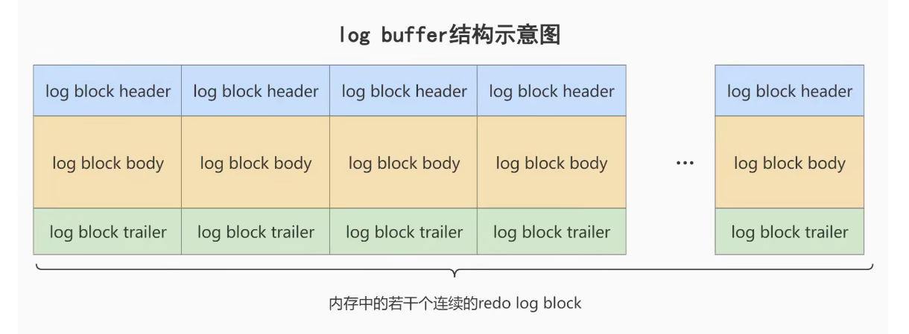
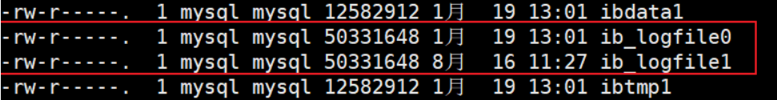
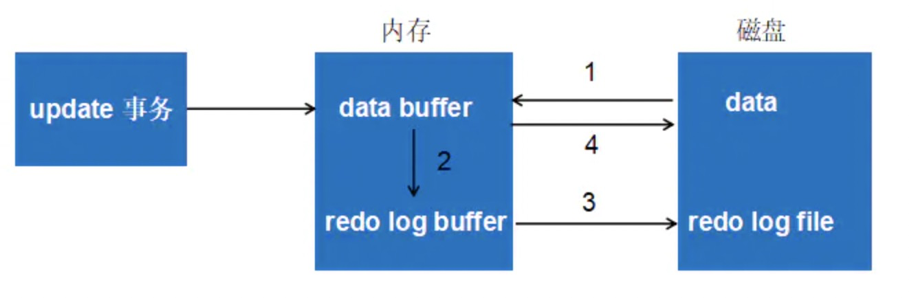
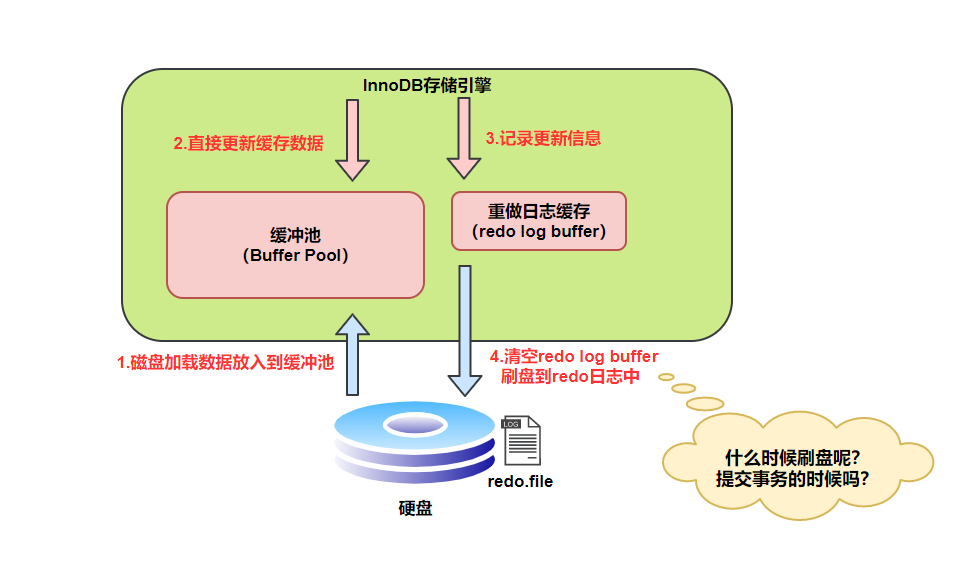
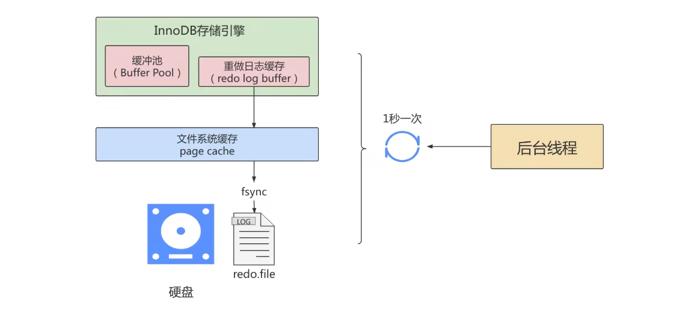
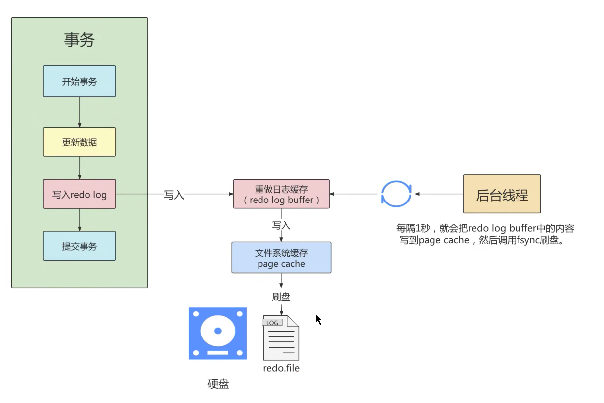
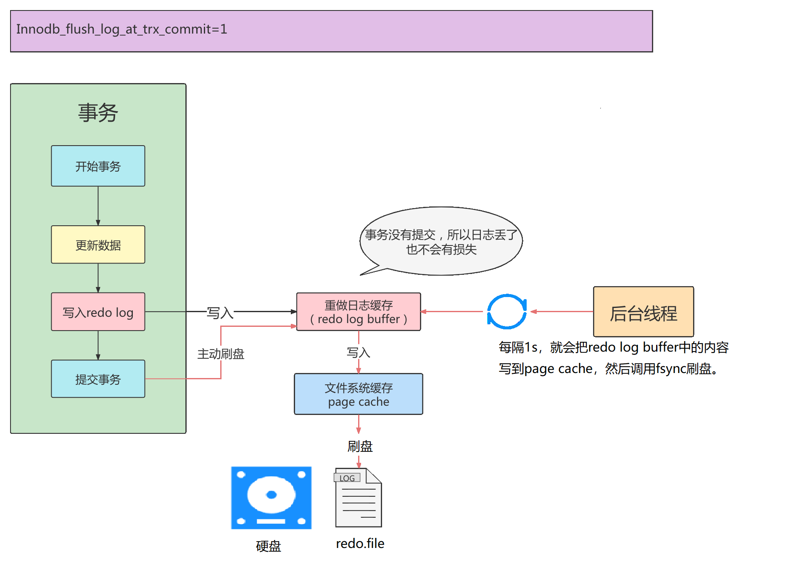
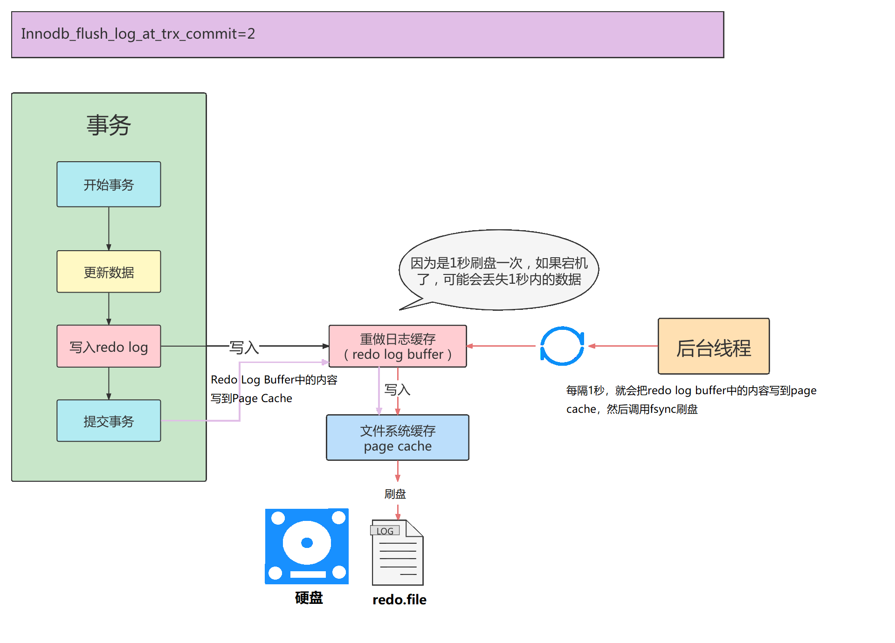
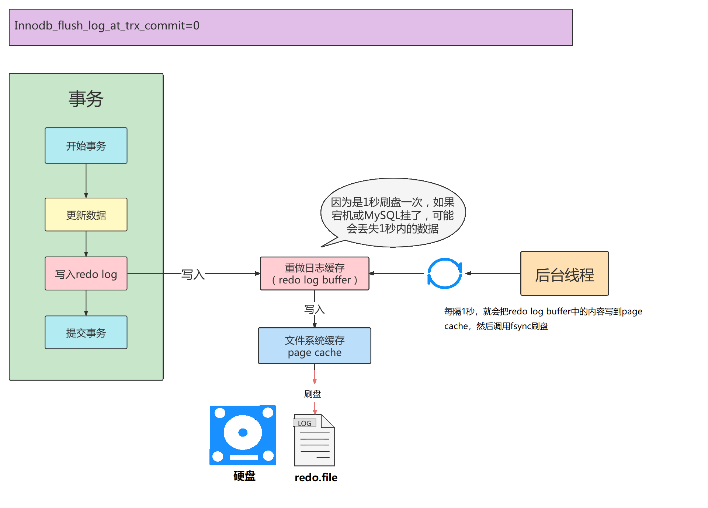

# MySQL事务日志

事务有4种特性 `:原子性`、 `一致性`、 `隔离性`和 `持久性`。那么事务的四种特性到底是基于什么机制实现呢?

- 事务的隔离性由`锁机制`实现

- 而事务的原子性、一致性和持久性由事务的`redo`日志和`undo`日志来保证。
  - REDO LOG称为`重做日志`，提供再写入操作，恢复提交事务修改的页操作，用来保证事务的特久性。
  - UNDO LOG称为`回滚日志`，回滚行记录到某个特定版本，用来保证事务的原子性、一致性。

有的DBA或许会认为UNDO是REDO的逆过程，其实不然。REDO和UNDO都可以视为是一种`恢复操作`。但是:

- redo log：是存储引擎层(innodb)生成的日志，记录的是"`物理级别`"上的页修改操作，比如页号xxx、偏移量yyy写入了’zzz’数据。主要为了保证数据的可靠性

- undo log:是存储引擎层(innodb)生成的日志，记录的是`逻辑操作`日志，比如对某一行数据进行了[INSERT语句](https://so.csdn.net/so/search?q=INSERT语句&spm=1001.2101.3001.7020)操作，那么undo log就记录一条与之相反的DELETE操作。**主要用于事务的回滚**(undo log 记录的是每个修改操作的`逆操作`)和`一致性非锁定读`(undo log回滚行记录到某种特定的版本–MVCC，即多版本并发控制）

## redo日志

InnoDB存储引擎是以`页为单位`来管理存储空间的。在真正访问页面之前，需要把在`磁盘上`的页缓存到内存中的`Buffer Pool`之后才可以访问。**所有的变更都必须先更新缓冲池中的数据，然后缓冲池中的脏页会以一定的频率被刷入磁盘**（ `checkPoint机制`），通过缓冲池来优化CPU和磁盘之间的鸿沟，这样就可以保证整体的性能不会下降太快。

###  为什么需要REDO日志

一方面，缓冲池可以帮助我们消除CPU和磁盘之间的鸿沟，checkpoint机制可以保证数据的最终落盘，然而由于checkpoint `并不是每次变更的时候就触发 的`，而是master线程隔一段时间去处理的。所以最坏的情况就是事务提交后，刚写完缓冲池，数据库宕机了，那么这段数据就是丢失的，无法恢复。

另一方面，事务包含 `持久性` 的特性，就是说对于一个已经提交的事务，在事务提交后即使系统发生了崩溃，这个事务对数据库中所做的更改也不能丢失。

那么如何保证这个持久性呢？` 一个简单的做法` ：在事务提交完成之前把该事务所修改的所有页面都刷新到磁盘，但是这个简单粗暴的做法有些问题：

- **修改量与刷新磁盘工作量严重不成比例**

有时候仅仅修改了某个页面中的一个字节，但是我们知道在InnoDB中是以页为单位来进行磁盘IO的，也就是说在该事务提交时不得不将一个完整的页面从内存中刷新到慈盘，我们又知道一个页面默认是16KB大小，只修改一个字节就要刷新16KB的数据到磁盘上显然是太小题大做了。

- **随机IO刷新较慢**

一个事务可能包含很多语句，即使是一条语句也可能修改许多页面，假如该事务修改的这些页面可能并不相邻，这就意味着在将某个事务修改的Buffer Pool中的页面刷新到磁盘时，需要进行很多的随机IO，随机IO比顺序IO要慢，尤其对于传统的机械硬盘来说。

`另一个解决的思路`∶我们只是想让已经提交了的事务对数据库中数据所做的修改永久生效，即使后来系统崩溃，在重启后也能把这种修改恢复出来。所以其实没有必要在每次事务提交时就把该事务在内存中修改过的全部页面刷新到磁盘，只需要把修改了哪些东西记录一下就好。比如，某个事务将0号系统表空间中`第10号`页面中偏移量为`100`处的值`1`改成`2 `。我们只需记录一下：将第0号表空间的`第10号`页面中偏移量为100处的值更新为2。

InnoDB引擎的事务采用了WAL技术（`Write-Ahead Logging` )，这种技术的思想就是`先写日志，再写磁盘`，只有日志写入成功，才算事务提交成功，这里的日志就是redo log。当发生宕机且数据未刷到磁盘的时候，可以通过redo log来恢复，保证ACID中的D，这就是redo log的作用。

### REDO日志的好处、特点

**1. 好处**

- redo日志降低了刷盘频率
- redo日志占用的空间非常小

存储`表空间ID`、`页号`、`偏移量`以及`需要更新的值`，所需的存储空间是很小的，刷盘快。

**2. 特点**

- redo日志是顺序写入磁盘的

在执行事务的过程中，每执行一条语句，就可能产生若干条redo日志，**这些日志是按照产生的顺序写入磁盘的，也就是使用顺序IO，效率比随机lO快。**

- 事务执行过程中，redo log不断记录

redo log跟bin log的区别，redo log是`存储引擎层`产生的，而bin log是`数据库层`产生的。假设一个事务，对表做10万行的记录插入，在这个过程中，一直不断的往redo log顺序记录，而bin log不会记录，直到这个事务提交，才会一次写入到bin log文件中（bin log是记录主从复制的~）

### redo的组成

Redo log可以简单分为以下两个部分：

- `重做日志的缓冲 (redo log buffer)` ，保存在内存中，是易失的。

在服务器启动时就向操作系统申请了一大片称之为redo log buffer的`连续内存`空间，翻译成中文就是redo日志缓冲区。这片内存空间被划分成若干个连续的`redo log block`。一个redo log block占用`512字节`大小



**参数设置：innodb_log_buffer_size：**
redo log buffer 大小，默认 16M ，最大值是4096M，最小值为1M。

- 重做日志文件 (redo log file) ，保存在硬盘中，是持久的。

REDO日志文件如图所示，其中的`ib_logfile0`和`ib_logfile1`即为REDO日志




### redo的整体流程

以一个更新事务为例，redo log 流转过程，如下图所示：



`第1步`：先将原始数据从磁盘中读入内存中来，修改数据的内存拷贝
`第2步`：生成一条重做日志并写入redo log buffer，记录的是数据被修改后的值

`第3步`：当事务commit时，将redo log buffer中的内容刷新到 redo log file，对 redo log file采用追加写的方式
`第4步`：定期将内存中修改的数据刷新到磁盘中

> **体会：**`Write-Ahead Log`(预先日志持久化)：在持久化一个数据页之前，先将内存中相应的日志页持久化。

###  redo log的刷盘策略

redo log的写入并不是直接写入磁盘的，InnoDB引擎会在写redo log的时候先写redo log buffer，之后以 `一定的频率`刷到真正的redo log file 中。这里的一定频率怎么看待呢？这就是我们要说的刷盘策略。也就是上图的3过程。



注意，redo log buffer刷盘到redo log file的过程并不是真正的刷到磁盘中去，只是刷入到 `文件系统缓存`（`page cache`）中去（这是现代操作系统为了提高文件写入效率做的一个优化），真正的写入会交给`系统自己来决定`（比如page cache足够大了）。那么对于InnoDB来说就存在一个问题，如果交给系统来同步，同样如果系统宕机，那么数据也丢失了（虽然整个系统宕机的概率还是比较小的）。

针对这种情况，InnoDB给出`innodb_flush_log_at_trx_commit `参数，该参数控制 commit提交事务时，如何将 redo log buffer 中的日志刷新到 redo log file 中。它支持三种策略：

- `设置为0` ：表示每次事务提交时不进行刷盘操作。（系统默认master thread(后台线程)每隔1s进行一次重做日 志的同步）
- `设置为1` ：表示每次事务提交时都将进行同步，刷盘操作（`默认值` ）

- `设置为2` ：表示每次事务提交时都只把 redo log buffer 内容写入 page cache，不进行同步。由os自己决定什么时候同步到磁盘文件。

```
show variables like 'innodb_flush_log_at_trx_commit';
```

另外，InnoDB存储引擎有一个后台线程，每隔`1秒`，就会把 `redo log buffer` 中的内容写到文件系统缓存( `page cache` ) ，然后调用刷盘操作。



也就是说，一个没有提交事务的`redo log` 记录，也可能会刷盘。因为在事务执行过程redo log记录是会写入redo log buffer中，这些redo log记录会被后台线程刷盘



除了后台线程每秒`1次`的轮询操作，还有一种情况，当`redo log buffer`占用的空间即将达到`innodb_log_buffer_size`(这个参数默认是16M）的一半的时候，后台线程会主动刷盘。

### 不同刷盘策略演示

**1. 刷盘策略分析**

1、innodb_flush_log_at_trx_commit=1



> **总结**
>
> innodb_flush_log_at_trx_commit=1时，只要事务提交成功，（都会主动同步刷盘，这个速度是很快的），最终redo log记录就一定在硬盘里，不会有任何数据丢失。
>
> 如果事务执行期间MySQL挂了或宕机，这部分日志丢了，但是事务并没有提交，所以日志丢了也不会有损失。可以保证ACID的D，数据绝对不会丢失，但是这种`效率是最差的`。
>
> 建议使用默认值，虽然操作系统宕机的概率理论小于数据库宕机的概率，但是一般既然使用了事务，那么数据的安全相对来说更重要些

2、innodb_flush_log_at_trx_commit=2



> **总结**
>
> innodb_flush_log_at_trx_commit=2时，只要事务提交成功，redo log buffer中的内容就会写入文件系统缓存（page cache）
>
> 如果仅仅只是`MySQL挂了不会有任何数据丢失`，但是`操作系统宕机`可能会有1秒数据的丢失，这种情况下无法满足ACID中的D。但是数值2是一种折中的做法，它的IO效率理论是高于1的，低于0的
>
> 当进行调优时，为了降低CPU的使用率，可以从1降成2。因为OS出现故障的概率很小~

3、innodb_flush_log_at_trx_commit=0



> **总结**
>
> innodb_flush_log_at_trx_commit=0时,master thread中每1秒进行一次重做日志的fsync操作，因此实例crash`最多丢失1秒钟内的事务`。( master thread是负责将缓冲池中的数据异步刷新到磁盘，保证数据的一致性)
>
> 数值0话，是一种效率最高的做法，这种策略也有丢失数据的风险，也无法保证D。

**一句话就是：`0：延迟写，延迟刷`，`1：实时写，实时刷`，`2：实时写，延迟刷`**


##### 举例

```mysql
#################################数据准备####################################
USE atguigudb3;

CREATE TABLE test_load(
    a INT,
    b CHAR(80)
)ENGINE=INNODB;

#创建存储过程，用于向test_load中添加数据
DELIMITER//
CREATE PROCEDURE p_load(COUNT INT UNSIGNED)
BEGIN
DECLARE s INT UNSIGNED DEFAULT 1;
DECLARE c CHAR(80)DEFAULT REPEAT('a',80);
WHILE s<=COUNT DO
INSERT INTO test_load SELECT NULL,c;
COMMIT;
SET s=s+1;
END WHILE;
END //
DELIMITER;

###########################测试1：###########################################
#设置并查看：innodb_flush_log_at_trx_commit

SHOW VARIABLES LIKE 'innodb_flush_log_at_trx_commit';

#set GLOBAL innodb_flush_log_at_trx_commit = 1;

#调用存储过程
CALL p_load(30000); #1min 28sec

############################测试2：#########################################
TRUNCATE TABLE test_load;

SELECT COUNT(*) FROM test_load;

SET GLOBAL innodb_flush_log_at_trx_commit = 0;

SHOW VARIABLES LIKE 'innodb_flush_log_at_trx_commit';

#调用存储过程
CALL p_load(30000); #37.945 sec

##########################测试3：###########################################
TRUNCATE TABLE test_load;

SELECT COUNT(*) FROM test_load;

SET GLOBAL innodb_flush_log_at_trx_commit = 2;

SHOW VARIABLES LIKE 'innodb_flush_log_at_trx_commit';

#调用存储过程
CALL p_load(30000); #45.173 sec
```

| innodb_flush_logat_trx_commit | 执行所用的时间 |
| ----------------------------- | -------------- |
| 0                             | 37.945 sec     |
| 1                             | 1min 28sec     |
| 2                             | 45.173 sec     |

而针对上述存储过程，为了提高事务的提交性能，应该在将3万行记录插入表后进行一次的COMMIT操作，而不是每插入一条记录后进行一次COMMIT操作。这样做的好处是可以使事务方法在rollback时回滚到事务最开始的确定状态。

> 虽然用户可以通过设置参数innodb_flush_log_at_trx_commit为0或2来提高事务提交的性能，但需清楚，这种设置方法丧失了事务的ACID特性。