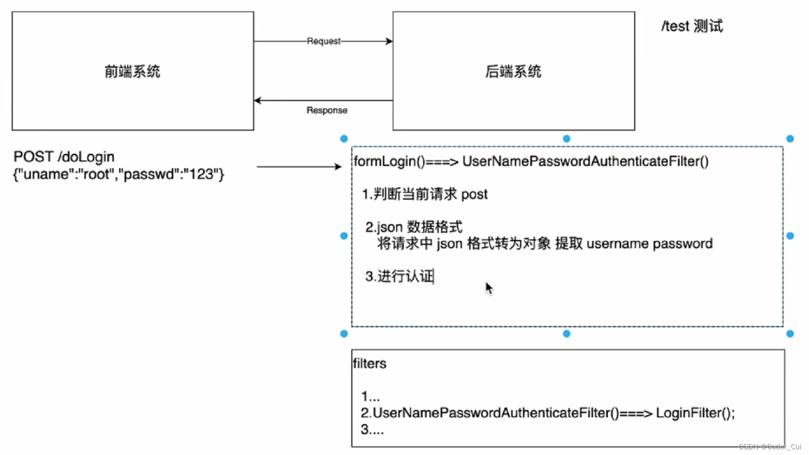
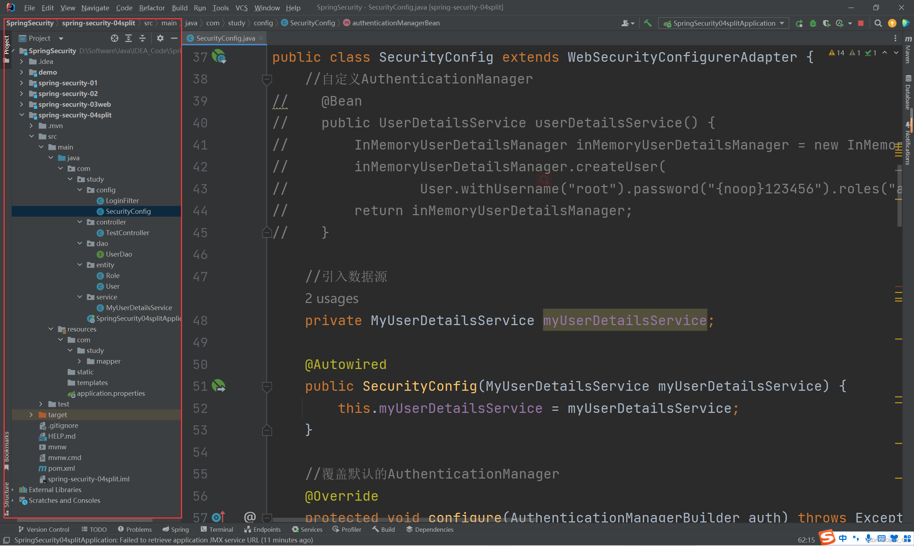
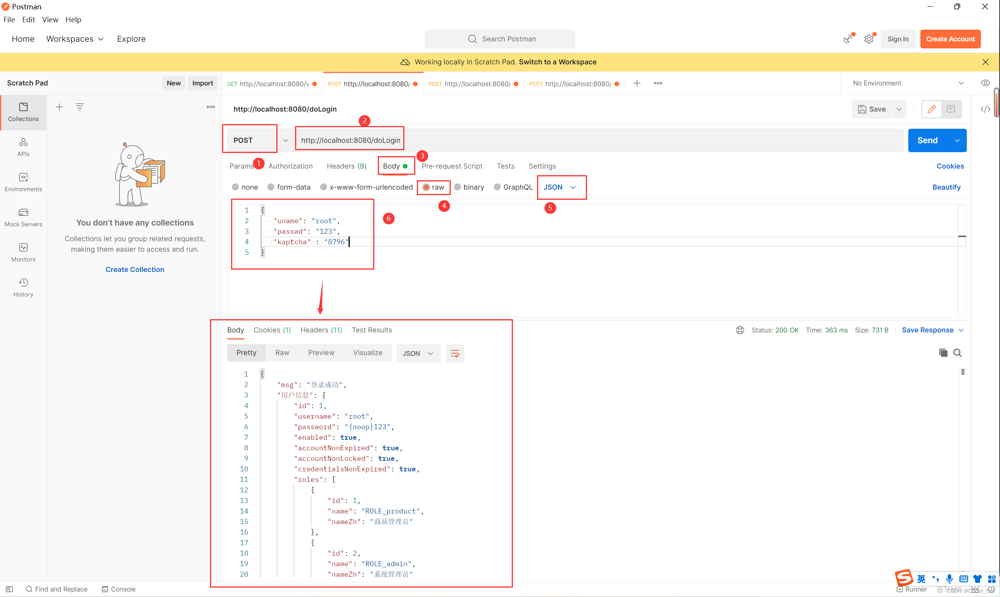

# 认证



## 新建项目

**新建module：spring-security-04split，勾选Spring Web，创建项目（注意：此处SpringBoot使用的是2.6.2版本），启动服务，查看服务是否能够正常启动！**


## 新建controller进行测试

```java
@RestController
public class TestController {
    @GetMapping("/test")
    public String test() {
        System.out.println("test is ok!");
        return "Test is Ok!";
    }
```

**启动服务，浏览器访问：http://localhost:8080/test，浏览器输出：Test is Ok!"，IDEA控制台输出：test is ok!，表示项目创建成功！**


## 依赖

```xml
<!--引入Spring Security依赖-->
<dependency>
    <groupId>org.springframework.boot</groupId>
    <artifactId>spring-boot-starter-security</artifactId>
</dependency>
```

刷新maven，重启启动服务，浏览器再次访问：http://localhost:8080/test，此时需要进行登录认证，用户名为：user，密码为引入SpringSecurity框架后IDEA控制台产生的随机密码，输入正确的用户名和密码登录成功后，浏览器输出：Test is Ok!"，IDEA控制台输出：test is ok!，表示项目创建成功！


## 编写springSecurity配置类

```java
@Configuration
public class SecurityConfig extends WebSecurityConfigurerAdapter {
    @Override
    protected void configure(HttpSecurity http) throws Exception {
        http.authorizeRequests()
            .anyRequest().authenticated()//所有请求必须认证
            .and()
            .formLogin();//form表单认证登录
    }
}
```


##  编写前后端分离认证Filter

在进行前后端分离认证时，后端接收到的是前端发送过来的post形式的json数据，此时需要在json格式中获取用于登录的用户名和密码，而SpringSecurity中用于对用户名和密码进行拦截的过滤器为UsernamePasswordAuthenticationFilter，此时需要对此Filter进行覆盖，重写attemptAuthentication()方法后得到用户名和密码，从而进行认证。

```java
public class LoginFilter extends UsernamePasswordAuthenticationFilter {
    @Override
    public Authentication attemptAuthentication(HttpServletRequest request, HttpServletResponse response) throws AuthenticationException {
        System.out.println("========================================");
        //1.判断是否是 post 方式请求
        if (!request.getMethod().equals("POST")) {
            throw new AuthenticationServiceException("Authentication method not supported: " + request.getMethod());
        }
        //2.判断是否是 json 格式请求类型
        if (request.getContentType().equalsIgnoreCase(MediaType.APPLICATION_JSON_VALUE)) {
            //3.从 json 数据中获取用户输入用户名和密码进行认证 {"uname":"xxx","password":"xxx"}
            try {
                Map<String, String> userInfo = new ObjectMapper().readValue(request.getInputStream(), Map.class);
                String username = userInfo.get(getUsernameParameter());
                String password = userInfo.get(getPasswordParameter());
                System.out.println("用户名: " + username + " 密码: " + password);
                UsernamePasswordAuthenticationToken authRequest = new UsernamePasswordAuthenticationToken(username, password);
                setDetails(request, authRequest);
                return this.getAuthenticationManager().authenticate(authRequest);
            } catch (IOException e) {
                e.printStackTrace();
            }
        }
        return super.attemptAuthentication(request, response);
    }
}
```


## 完善SpringSecurity配置类

```java
@Configuration
public class SecurityConfig extends WebSecurityConfigurerAdapter {
    //自定义AuthenticationManager
    @Bean
    public UserDetailsService userDetailsService() {
        InMemoryUserDetailsManager inMemoryUserDetailsManager = new InMemoryUserDetailsManager();
        inMemoryUserDetailsManager.createUser(
            User.withUsername("root").password("{noop}123456").roles("admin").build());
        return inMemoryUserDetailsManager;
    }

    //覆盖默认的AuthenticationManager
    @Override
    protected void configure(AuthenticationManagerBuilder auth) throws Exception {
        auth.userDetailsService(userDetailsService());
    }

    //从工厂中暴露出来
    @Override
    @Bean
    public AuthenticationManager authenticationManagerBean() throws Exception {
        return super.authenticationManagerBean();
    }

    //把自定义Filter交给工厂，用以替换UsernamePasswordAuthenticationFilter
    @Bean
    public LoginFilter loginFilter() throws Exception {
        LoginFilter loginFilter = new LoginFilter();
        loginFilter.setFilterProcessesUrl("/doLogin");//指定认证url
        loginFilter.setUsernameParameter("uname");//指定接收json用户名key
        loginFilter.setPasswordParameter("pwd");//指定接收json密码key
        loginFilter.setAuthenticationManager(authenticationManagerBean());
        //认证成功处理
        loginFilter.setAuthenticationSuccessHandler(new AuthenticationSuccessHandler() {
            @Override
            public void onAuthenticationSuccess(HttpServletRequest request, HttpServletResponse response, Authentication authentication) throws IOException, ServletException {
                Map<String, Object> result = new HashMap<String, Object>();
                result.put("msg", "登录成功");//打印登录成功信息
                //result.put("status", 200);//打印状态码   此处改为setStatus
                result.put("用户信息", authentication.getPrincipal());//获得身份信息
                result.put("authentication", authentication);//打印认证信息
                response.setContentType("application/json;charset=UTF-8");//设置响应类型
                response.setStatus(HttpStatus.OK.value());//设置登录成功之后的状态
                String s = new ObjectMapper().writeValueAsString(result);//json格式转字符串
                response.getWriter().println(s);//打印json格式数据
            }
        });
        //认证失败处理
        loginFilter.setAuthenticationFailureHandler((request, response, exception) -> {
            Map<String, Object> result = new HashMap<String, Object>();
            result.put("msg", "登录失败：" + exception.getMessage());
            //result.put("status", 500);//打印状态码   此处改为setStatus
            response.setContentType("application/json;charset=UTF-8");
            response.setStatus(HttpStatus.INTERNAL_SERVER_ERROR.value());//设置登录失败之后的状态
            String s = new ObjectMapper().writeValueAsString(result);
            response.getWriter().println(s);
        });
        return loginFilter;
    }

    @Override
    protected void configure(HttpSecurity http) throws Exception {
        http.authorizeRequests()
            .anyRequest().authenticated()//所有请求必须认证
            .and()
            .formLogin()//form表单认证时默认采用UsernamePasswordAuthenticationFilter进行拦截
            // 此处使用LoginFilter进行替换
            .and()
            .exceptionHandling()
            .authenticationEntryPoint(new AuthenticationEntryPoint() {
                @Override
                public void commence(HttpServletRequest request, HttpServletResponse response, AuthenticationException authException) throws IOException, ServletException {
                    response.setContentType("application/json;charset=UTF-8");
                    response.setStatus(HttpStatus.UNAUTHORIZED.value());
                    response.getWriter().println("请认证之后再去处理！");
                }
            })
            .and()
            .logout()
            //.logoutUrl("/logout")
            .logoutRequestMatcher(new OrRequestMatcher(
                new AntPathRequestMatcher("/logout", HttpMethod.DELETE.name()),
                new AntPathRequestMatcher("/logout", HttpMethod.GET.name())
            ))
            .logoutSuccessHandler((request, response, authentication) -> {
                Map<String, Object> result = new HashMap<String, Object>();
                result.put("msg", "注销成功");//打印登录成功信息
                //result.put("status", 200);//打印状态码   此处改为setStatus
                result.put("用户信息", authentication.getPrincipal());//获得身份信息
                result.put("authentication", authentication);//打印认证信息
                response.setContentType("application/json;charset=UTF-8");//设置响应类型
                response.setStatus(HttpStatus.OK.value());//设置登录成功之后的状态
                String s = new ObjectMapper().writeValueAsString(result);//json格式转字符串
                response.getWriter().println(s);//打印json格式数据
            })
            .and()
            .csrf().disable();
        /**
          * addFilterAt:用某个filter替换掉过滤器链中的某个filter
          * addFilterBefore():将某个过滤器放在过滤器链中某个filter之前
          * addFilterAfter():将某个过滤器放在过滤器链中某个filter之后
          */
        http.addFilterAt(loginFilter(), UsernamePasswordAuthenticationFilter.class);
    }
}
```


## 启动服务测试

**启动服务，打开Postman进行测试：**

**（1）GET http://localhost:8080/test**

**（2）POST http://localhost:8080/doLogin**

**（3）GET或DELETE http://localhost:8080/logout**


## 引入数据源+整合mybatis

设计表结构

```sql
-- 用户表 共有多个用户
 CREATE TABLE `user`
 (
     `id`                    int(11) NOT NULL AUTO_INCREMENT,
     `username`              varchar(32)  DEFAULT NULL,
     `password`              varchar(255) DEFAULT NULL,
     `enabled`               tinyint(1) DEFAULT NULL,
     `accountNonExpired`     tinyint(1) DEFAULT NULL,
     `accountNonLocked`      tinyint(1) DEFAULT NULL,
     `credentialsNonExpired` tinyint(1) DEFAULT NULL,
     PRIMARY KEY (`id`)
 ) ENGINE=InnoDB AUTO_INCREMENT=4 DEFAULT CHARSET=utf8;
 ​
 -- 角色表 共有多个角色，其中，_zh表示中文
 CREATE TABLE `role`
 (
     `id`      int(11) NOT NULL AUTO_INCREMENT,
     `name`    varchar(32) DEFAULT NULL,
     `name_zh` varchar(32) DEFAULT NULL,
     PRIMARY KEY (`id`)
 ) ENGINE=InnoDB AUTO_INCREMENT=4 DEFAULT CHARSET=utf8;

 -- 用户角色关系表：用户与角色为多对多关系，需要建立中间表
 CREATE TABLE `user_role`
 (
     `id`  int(11) NOT NULL AUTO_INCREMENT,
     `uid` int(11) DEFAULT NULL,
     `rid` int(11) DEFAULT NULL,
     PRIMARY KEY (`id`),
     KEY   `uid` (`uid`),
     KEY   `rid` (`rid`)
 ) ENGINE=InnoDB AUTO_INCREMENT=5 DEFAULT CHARSET=utf8;
```

**插入测试数据**

```sql
-- 插入用户数据
 BEGIN;
   INSERT INTO `user`
   VALUES (1, 'root', '{noop}123', 1, 1, 1, 1);
   INSERT INTO `user`
   VALUES (2, 'admin', '{noop}123', 1, 1, 1, 1);
   INSERT INTO `user`
   VALUES (3, 'blr', '{noop}123', 1, 1, 1, 1);
 COMMIT;
 ​
 -- 插入角色数据 授权时ROLE_进行处理，RBAC
 BEGIN;
   INSERT INTO `role`
   VALUES (1, 'ROLE_product', '商品管理员');
   INSERT INTO `role`
   VALUES (2, 'ROLE_admin', '系统管理员');
   INSERT INTO `role`
   VALUES (3, 'ROLE_user', '用户管理员');
 COMMIT;
 ​
 -- 插入用户角色数据
 BEGIN;
   INSERT INTO `user_role`
   VALUES (1, 1, 1);
   INSERT INTO `user_role`
   VALUES (2, 1, 2);
   INSERT INTO `user_role`
   VALUES (3, 2, 2);
   INSERT INTO `user_role`
   VALUES (4, 3, 3);
 COMMIT;
```


**接下来进行SpringBoot整合mybatis**

- **项目的pom.xml中引入依赖**

```xml
<!--引入数据源-->
 <dependency>
     <groupId>com.alibaba</groupId>
     <artifactId>druid</artifactId>
     <version>1.2.7</version>
 </dependency>
 ​
 <!--引入mysql-->
 <dependency>
     <groupId>mysql</groupId>
     <artifactId>mysql-connector-java</artifactId>
     <version>5.1.38</version>
 </dependency>
 ​
 <!--引入mybatis-->
 <dependency>
     <groupId>org.mybatis.spring.boot</groupId>
     <artifactId>mybatis-spring-boot-starter</artifactId>
     <version>2.2.0</version>
 </dependency>
```

**application.properties进行数据源、mybatis、日志配置**

```properties
# datasource：类型、驱动名、用户名、密码
 spring.datasource.type=com.alibaba.druid.pool.DruidDataSource
 spring.datasource.driver-class-name=com.mysql.jdbc.Driver
 spring.datasource.url=jdbc:mysql://localhost:3306/security?characterEncoding=UTF-8&useSSL=false
 spring.datasource.username=root
 spring.datasource.password=root
 ​
 # mybatis配置mapper文件的位置和别名设置
 # 注意mapper目录（包）新建时必须使用"/"，而不是.
 mybatis.mapper-locations=classpath:com/study/mapper/*.xml
 mybatis.type-aliases-package=com.study.entity
 ​
 # log:为了显示mybatis运行SQL语句
 logging.level.com.study=debug
```

创建 entity实体类包

创建User 对象

```java
import
    //@Description 用户类，对应表user，为了与UserDetails中的User对应，此处进行实现
    public class User implements UserDetails {
        private Integer id;
        private String username;
        private String password;
        private Boolean enabled;
        private Boolean accountNonExpired;
        private Boolean accountNonLocked;
        private Boolean credentialsNonExpired;
        private List<Role> roles = new ArrayList<>();//关系属性，用来存储当前用户所有角色信息

        //返回权限信息
        @Override
        public Collection<? extends GrantedAuthority> getAuthorities() {
            Set<SimpleGrantedAuthority> authorities = new HashSet<>();
            roles.forEach(role -> {
                SimpleGrantedAuthority simpleGrantedAuthority = new SimpleGrantedAuthority(role.getName());
                authorities.add(simpleGrantedAuthority);
            });
            return authorities;
        }

        //getter/setter
    }
```

**创建 Role 对象**

```java
public class Role {
    private Integer id;
    private String name;
    private String nameZh;
}
```


**创建 UserDao 接口**

```java
@Mapper
public interface UserDao {
    //根据用户名查找用户
    User loadUserByUsername(String username);
    ​
    //根据用户id查询一个角色，注意一个用户可能不止一种角色
    List<Role> getRolesByUid(Integer uid);
}
```

**创建 UserMapper 实现**

```xml
<?xml version="1.0" encoding="UTF-8"?>
<!DOCTYPE mapper
    PUBLIC "-//mybatis.org//DTD Mapper 3.0//EN"
    "http://mybatis.org/dtd/mybatis-3-mapper.dtd" >
​
<mapper namespace="com.study.dao.UserDao">
    <!--loadUserByUsername-->
    <select id="loadUserByUsername" resultType="User">
        select id,
        username,
        password,
        enabled,
        accountNonExpired,
        accountNonLocked,
        credentialsNonExpired
        from user
        where username = #{username}
    </select>
    ​
    <!--getRolesByUid
    需要将角色表和用户-角色表进行关联查询，查询条件为role.id=user_role.uid
    其中，uid是外界传入的参数
    -->
    <select id="getRolesByUid" resultType="Role">
        select r.id,
        r.name,
        r.name_zh nameZh
        from role r,
        user_role ur
        where r.id = ur.rid
        and ur.uid = #{uid}
    </select>
</mapper>
```

**创建 UserDetailService 实例**

```java
@Service
public class MyUserDetailsService implements UserDetailsService {
    private UserDao userDao;
    ​
        @Autowired
        public MyUserDetailsService(UserDao userDao) {
        this.userDao = userDao;
    }
    ​
        @Override
        public UserDetails loadUserByUsername(String username) throws UsernameNotFoundException {
        //1.查询用户
        User user = userDao.loadUserByUsername(username);
        if (ObjectUtils.isEmpty(user))
            throw new RuntimeException("用户不存在");
        //2.查询权限信息
        List<Role> roles = userDao.getRolesByUid(user.getId());
        user.setRoles(roles);
        return user;
    }
}
```

**配置 authenticationManager 使用自定义UserDetailService**

```java
@Configuration
public class SecurityConfig extends WebSecurityConfigurerAdapter {
    //引入数据源
    private MyUserDetailsService myUserDetailsService;
    ​
        @Autowired
        public SecurityConfig(MyUserDetailsService myUserDetailsService) {
        this.myUserDetailsService = myUserDetailsService;
    }
    ​
        //覆盖默认的AuthenticationManager
        @Override
        protected void configure(AuthenticationManagerBuilder auth) throws Exception {
        auth.userDetailsService(myUserDetailsService);
    }
    ​
        //从工厂中暴露出来
        @Override
        @Bean
        public AuthenticationManager authenticationManagerBean() throws Exception {
        return super.authenticationManagerBean();
    }
    ​
        //把自定义Filter交给工厂，用以替换UsernamePasswordAuthenticationFilter
        @Bean
        public LoginFilter loginFilter() throws Exception {
        LoginFilter loginFilter = new LoginFilter();
        loginFilter.setFilterProcessesUrl("/doLogin");//指定认证url
        loginFilter.setUsernameParameter("uname");//指定接收json用户名key
        loginFilter.setPasswordParameter("pwd");//指定接收json密码key
        loginFilter.setAuthenticationManager(authenticationManagerBean());
        //认证成功处理
        loginFilter.setAuthenticationSuccessHandler(new AuthenticationSuccessHandler() {
            @Override
            public void onAuthenticationSuccess(HttpServletRequest request, HttpServletResponse response, Authentication authentication) throws IOException, ServletException {
                Map<String, Object> result = new HashMap<String, Object>();
                result.put("msg", "登录成功");//打印登录成功信息
                //result.put("status", 200);//打印状态码   此处改为setStatus
                result.put("用户信息", authentication.getPrincipal());//获得身份信息
                result.put("authentication", authentication);//打印认证信息
                response.setContentType("application/json;charset=UTF-8");//设置响应类型
                response.setStatus(HttpStatus.OK.value());//设置登录成功之后的状态
                String s = new ObjectMapper().writeValueAsString(result);//json格式转字符串
                response.getWriter().println(s);//打印json格式数据
            }
        });
        //认证失败处理
        loginFilter.setAuthenticationFailureHandler((request, response, exception) -> {
            Map<String, Object> result = new HashMap<String, Object>();
            result.put("msg", "登录失败：" + exception.getMessage());
            //result.put("status", 500);//打印状态码   此处改为setStatus
            response.setContentType("application/json;charset=UTF-8");
            response.setStatus(HttpStatus.INTERNAL_SERVER_ERROR.value());//设置登录失败之后的状态
            String s = new ObjectMapper().writeValueAsString(result);
            response.getWriter().println(s);
        });
        return loginFilter;
    }
    ​
        @Override
        protected void configure(HttpSecurity http) throws Exception {
        http.authorizeRequests()
            .anyRequest().authenticated()//所有请求必须认证
            .and()
            .formLogin()//form表单认证时默认采用UsernamePasswordAuthenticationFilter进行拦截
            // 此处使用LoginFilter进行替换
            .and()
            .exceptionHandling()
            .authenticationEntryPoint(new AuthenticationEntryPoint() {
                @Override
                public void commence(HttpServletRequest request, HttpServletResponse response, AuthenticationException authException) throws IOException, ServletException {
                    response.setContentType("application/json;charset=UTF-8");
                    response.setStatus(HttpStatus.UNAUTHORIZED.value());
                    response.getWriter().println("请认证之后再去处理！");
                }
            })
            .and()
            .logout()
            //.logoutUrl("/logout")
            .logoutRequestMatcher(new OrRequestMatcher(
                new AntPathRequestMatcher("/logout", HttpMethod.DELETE.name()),
                new AntPathRequestMatcher("/logout", HttpMethod.GET.name())
            ))
            .logoutSuccessHandler((request, response, authentication) -> {
                Map<String, Object> result = new HashMap<String, Object>();
                result.put("msg", "注销成功");//打印登录成功信息
                //result.put("status", 200);//打印状态码   此处改为setStatus
                result.put("用户信息", authentication.getPrincipal());//获得身份信息
                result.put("authentication", authentication);//打印认证信息
                response.setContentType("application/json;charset=UTF-8");//设置响应类型
                response.setStatus(HttpStatus.OK.value());//设置登录成功之后的状态
                String s = new ObjectMapper().writeValueAsString(result);//json格式转字符串
                response.getWriter().println(s);//打印json格式数据
            })
            .and()
            .csrf().disable();
        /**
          * addFilterAt:用某个filter替换掉过滤器链中的某个filter
          * addFilterBefore():将某个过滤器放在过滤器链中某个filter之前
          * addFilterAfter():将某个过滤器放在过滤器链中某个filter之后
          */
        http.addFilterAt(loginFilter(), UsernamePasswordAuthenticationFilter.class);
    }
}
```


## 启动服务测试

启动服务，打开Postman进行测试：

（1）GET http://localhost:8080/test 登录失败

（2）POST http://localhost:8080/doLogin

uname：root，pwd：123

uname：blr，pwd：123

uname：admin，pwd：123

均可成功登录

（3）GET或DELETE http://localhost:8080/logout 成功注销


## 最终项目结构目录




## 添加验证码实现

### 依赖

```xml
<dependency>
    <groupId>com.github.penggle</groupId>
    <artifactId>kaptcha</artifactId>
    <version>2.3.2</version>
</dependency>
```


### 验证码

- KaptchaConfigurer配置

```java
@Configuration
public class KaptchaConfigurer {
    @Bean
    public Producer kaptcha() {
        Properties properties = new Properties();
        //1.验证码宽度
        properties.setProperty("kaptcha.image.width", "150");
        //2.验证码高度
        properties.setProperty("kaptcha.image.height", "50");
        //3.验证码字符串
        properties.setProperty("kaptcha.textproducer.char.string", "0123456789");
        //4.验证码长度
        properties.setProperty("kaptcha.textproducer.char.length", "4");
        Config config = new Config(properties);
        DefaultKaptcha defaultKaptcha = new DefaultKaptcha();
        defaultKaptcha.setConfig(config);
        return defaultKaptcha;
    }
}
```


- **VerityCodeController** 控制器

```java
@RestController //一定是RestController而非Controller
public class VerifyCodeController {
    private final Producer producer;
    ​
        @Autowired
        public VerifyCodeController(Producer producer) {
        this.producer = producer;
    }
    ​
        @GetMapping("/vc.jpg")
        public String getVerifyCode(HttpSession session) throws IOException {
        //1.生成验证码
        String verifyCode = producer.createText();
        //2.存入Session或Redis
        session.setAttribute("kaptcha", verifyCode);
        //3.生成图片
        BufferedImage bi = producer.createImage(verifyCode);
        //图片转化为字节
        FastByteArrayOutputStream fbaos = new FastByteArrayOutputStream();
        ImageIO.write(bi, "jpg", fbaos);//将bi以jpg格式出入进fbaos中
        //4.返回base64
        return Base64.encodeBase64String(fbaos.toByteArray());
    }
}
```


- **LoginKaptchaFilter** 过滤器

```java
public class LoginKaptchaFilter extends UsernamePasswordAuthenticationFilter {
    //默认值
    public static final String FORM_KAPTCHA_KEY = "kaptcha";
    private String kaptchaParameter = FORM_KAPTCHA_KEY;

    public String getKaptchaParameter() {
        return kaptchaParameter;
    }

    public void setKaptchaParameter(String kaptchaParameter) {
        this.kaptchaParameter = kaptchaParameter;
    }

    @Override
    public Authentication attemptAuthentication(HttpServletRequest request, HttpServletResponse response) throws AuthenticationException {
        //1.判断是否是POST请求
        if (!request.getMethod().equals("POST")) {
            throw new AuthenticationServiceException("Authentication method not supported: " + request.getMethod());
        }
        try {
            //2.获取请求数据
            Map<String, String> userInfo = new ObjectMapper().readValue(request.getInputStream(), Map.class);
            String kaptcha = userInfo.get(getKaptchaParameter());//用来获取数据中验证码
            String username = userInfo.get(getUsernameParameter());//用来接收用户名
            String password = userInfo.get(getPasswordParameter());//用来接收密码
            //3.获取session中验证码
            String sessionVerifyCode = (String) request.getSession().getAttribute("kaptcha");
            if (!ObjectUtils.isEmpty(kaptcha) && !ObjectUtils.isEmpty(sessionVerifyCode) &&
                kaptcha.equalsIgnoreCase(sessionVerifyCode)) {
                //4.获取用户名和密码认证（参考父类实现）
                UsernamePasswordAuthenticationToken authRequest = new UsernamePasswordAuthenticationToken(username, password);
                setDetails(request, authRequest);
                return this.getAuthenticationManager().authenticate(authRequest);
            }
        } catch (IOException e) {
            e.printStackTrace();
        }
        throw new KaptchaNotMatchException("验证码不匹配");
    }
}
```


- **定义验证码异常类**

  ```java
  public class KaptchaNotMatchException extends AuthenticationException {
      public KaptchaNotMatchException(String msg) {
          super(msg);
      }
  
      public KaptchaNotMatchException(String msg, Throwable cause) {
          super(msg, cause);
      }
  }
  ```

  

### Security配置

```java
@Configuration
public class SecurityConfig extends WebSecurityConfigurerAdapter {

    //自定义内存数据源
    private MyUserDetailsService myUserDetailsService;

    @Autowired
    public SecurityConfig(MyUserDetailsService myUserDetailsService) {
        this.myUserDetailsService = myUserDetailsService;
    }

    @Override
    protected void configure(AuthenticationManagerBuilder auth) throws Exception {
        auth.userDetailsService(myUserDetailsService);
    }
	//暴露
    @Override
    @Bean
    public AuthenticationManager authenticationManagerBean() throws Exception {
        return super.authenticationManagerBean();
    }

    //配置
    @Bean
    public LoginKaptchaFilter loginKaptchaFilter() throws Exception {
        LoginKaptchaFilter loginKaptchaFilter = new LoginKaptchaFilter();
        //1.拦截登录界面的url
        loginKaptchaFilter.setFilterProcessesUrl("/doLogin");
        //2.接收参数
        loginKaptchaFilter.setUsernameParameter("uname");
        loginKaptchaFilter.setPasswordParameter("passwd");
        loginKaptchaFilter.setKaptchaParameter("kaptcha");
        //3.指定认证管理器
        loginKaptchaFilter.setAuthenticationManager(authenticationManagerBean());
        //4.指定成功时处理
        loginKaptchaFilter.setAuthenticationSuccessHandler((req, resp, authentication) -> {
            Map<String, Object> result = new HashMap<String, Object>();
            result.put("msg", "登录成功");
            result.put("用户信息", authentication.getPrincipal());
            resp.setContentType("application/json;charset=UTF-8");
            resp.setStatus(HttpStatus.OK.value());
            String s = new ObjectMapper().writeValueAsString(result);
            resp.getWriter().println(s);
        });
        //5.认证失败处理
        loginKaptchaFilter.setAuthenticationFailureHandler((req, resp, ex) -> {
            Map<String, Object> result = new HashMap<String, Object>();
            result.put("msg", "登录失败: " + ex.getMessage());
            resp.setStatus(HttpStatus.INTERNAL_SERVER_ERROR.value());
            resp.setContentType("application/json;charset=UTF-8");
            String s = new ObjectMapper().writeValueAsString(result);
            resp.getWriter().println(s);
        });
        return loginKaptchaFilter;
    }

    @Override
    protected void configure(HttpSecurity http) throws Exception {
        http.authorizeRequests()
            .mvcMatchers("/vc.jpg").permitAll()
            .anyRequest().authenticated()
            .and()
            .formLogin()
            .and()
            .exceptionHandling()
            .authenticationEntryPoint((req, resp, ex) -> {
                resp.setContentType("application/json;charset=UTF-8");
                resp.setStatus(HttpStatus.UNAUTHORIZED.value());
                resp.getWriter().println("必须认证之后才能访问!");
            })
            .and()
            .logout()
            .and()
            .csrf().disable();

        http.addFilterAt(loginKaptchaFilter(), UsernamePasswordAuthenticationFilter.class);
    }
}
```


### 测试

**启动服务，打开postman，测试过程如下：**

**（1）生成验证码：**http://localhost:8080/vc.jpg

**破解base64格式的验证码：**[图片Base64编码互转工具-在线工具](https://www.qtool.net/picconvert)，复制上面的数据到输入框内，前面加上前缀：**data:image/png;base64**,得到对应的4位验证码数字。

**（2）测试登录**：http://localhost:8080/doLogin




# 实现rememberMe

## 新建controller进行测试

```java
@RestController
public class TestController {
    @GetMapping("/test")
    public String test() {
        System.out.println("test is ok!");
        return "Test is Ok!";
    }
```

**启动服务，浏览器访问：http://localhost:8080/test，浏览器输出：Test is Ok!"，IDEA控制台输出：test is ok!，表示项目创建成功！**


## 依赖

```xml
<!--引入Spring Security依赖-->
<dependency>
    <groupId>org.springframework.boot</groupId>
    <artifactId>spring-boot-starter-security</artifactId>
</dependency>
```

刷新maven，重启启动服务，浏览器再次访问：http://localhost:8080/test，此时需要进行登录认证，用户名为：user，密码为引入SpringSecurity框架后IDEA控制台产生的随机密码，输入正确的用户名和密码登录成功后，浏览器输出：Test is Ok!"，IDEA控制台输出：test is ok!，表示项目创建成功！


##  编写前后端分离认证Filter

在进行前后端分离认证时，后端接收到的是前端发送过来的post形式的json数据，此时需要在json格式中获取用于登录的用户名和密码，而SpringSecurity中用于对用户名和密码进行拦截的过滤器为UsernamePasswordAuthenticationFilter，此时需要对此Filter进行覆盖，重写attemptAuthentication()方法后得到用户名和密码，从而进行认证。

```java
public class LoginFilter extends UsernamePasswordAuthenticationFilter {
    @Override
    public Authentication attemptAuthentication(HttpServletRequest request, HttpServletResponse response) throws AuthenticationException {
        System.out.println("========================================");
        //1.判断是否是 post 方式请求
        if (!request.getMethod().equals("POST")) {
            throw new AuthenticationServiceException("Authentication method not supported: " + request.getMethod());
        }
        //2.判断是否是 json 格式请求类型
        if (request.getContentType().equalsIgnoreCase(MediaType.APPLICATION_JSON_VALUE)) {
            //3.从 json 数据中获取用户输入用户名和密码进行认证 {"uname":"xxx","password":"xxx"}
            try {
                Map<String, String> userInfo = new ObjectMapper().readValue(request.getInputStream(), Map.class);
                String username = userInfo.get(getUsernameParameter());
                String password = userInfo.get(getPasswordParameter());
                System.out.println("用户名: " + username + " 密码: " + password);
                UsernamePasswordAuthenticationToken authRequest = new UsernamePasswordAuthenticationToken(username, password);
                setDetails(request, authRequest);
                return this.getAuthenticationManager().authenticate(authRequest);
            } catch (IOException e) {
                e.printStackTrace();
            }
        }
        return super.attemptAuthentication(request, response);
    }
}
```


## SpringSecurity配置类

```java
@Configuration
public class SecurityConfig extends WebSecurityConfigurerAdapter {
    //自定义AuthenticationManager
    @Bean
    public UserDetailsService userDetailsService() {
        InMemoryUserDetailsManager inMemoryUserDetailsManager = new InMemoryUserDetailsManager();
        inMemoryUserDetailsManager.createUser(
            User.withUsername("root").password("{noop}123456").roles("admin").build());
        return inMemoryUserDetailsManager;
    }

    //覆盖默认的AuthenticationManager
    @Override
    protected void configure(AuthenticationManagerBuilder auth) throws Exception {
        auth.userDetailsService(userDetailsService());
    }

    //从工厂中暴露出来
    @Override
    @Bean
    public AuthenticationManager authenticationManagerBean() throws Exception {
        return super.authenticationManagerBean();
    }

    //把自定义Filter交给工厂，用以替换UsernamePasswordAuthenticationFilter
    @Bean
    public LoginFilter loginFilter() throws Exception {
        LoginFilter loginFilter = new LoginFilter();
        loginFilter.setFilterProcessesUrl("/doLogin");//指定认证url
        loginFilter.setUsernameParameter("uname");//指定接收json用户名key
        loginFilter.setPasswordParameter("pwd");//指定接收json密码key
        loginFilter.setAuthenticationManager(authenticationManagerBean());
        //认证成功处理
        loginFilter.setAuthenticationSuccessHandler(new AuthenticationSuccessHandler() {
            @Override
            public void onAuthenticationSuccess(HttpServletRequest request, HttpServletResponse response, Authentication authentication) throws IOException, ServletException {
                Map<String, Object> result = new HashMap<String, Object>();
                result.put("msg", "登录成功");//打印登录成功信息
                //result.put("status", 200);//打印状态码   此处改为setStatus
                result.put("用户信息", authentication.getPrincipal());//获得身份信息
                result.put("authentication", authentication);//打印认证信息
                response.setContentType("application/json;charset=UTF-8");//设置响应类型
                response.setStatus(HttpStatus.OK.value());//设置登录成功之后的状态
                String s = new ObjectMapper().writeValueAsString(result);//json格式转字符串
                response.getWriter().println(s);//打印json格式数据
            }
        });
        //认证失败处理
        loginFilter.setAuthenticationFailureHandler((request, response, exception) -> {
            Map<String, Object> result = new HashMap<String, Object>();
            result.put("msg", "登录失败：" + exception.getMessage());
            //result.put("status", 500);//打印状态码   此处改为setStatus
            response.setContentType("application/json;charset=UTF-8");
            response.setStatus(HttpStatus.INTERNAL_SERVER_ERROR.value());//设置登录失败之后的状态
            String s = new ObjectMapper().writeValueAsString(result);
            response.getWriter().println(s);
        });
        return loginFilter;
    }

    @Override
    protected void configure(HttpSecurity http) throws Exception {
        http.authorizeRequests()
            .anyRequest().authenticated()//所有请求必须认证
            .and()
            .formLogin()//form表单认证时默认采用UsernamePasswordAuthenticationFilter进行拦截
            // 此处使用LoginFilter进行替换
            .and()
            .exceptionHandling()
            .authenticationEntryPoint(new AuthenticationEntryPoint() {
                @Override
                public void commence(HttpServletRequest request, HttpServletResponse response, AuthenticationException authException) throws IOException, ServletException {
                    response.setContentType("application/json;charset=UTF-8");
                    response.setStatus(HttpStatus.UNAUTHORIZED.value());
                    response.getWriter().println("请认证之后再去处理！");
                }
            })
            .and()
            .logout()
            //.logoutUrl("/logout")
            .logoutRequestMatcher(new OrRequestMatcher(
                new AntPathRequestMatcher("/logout", HttpMethod.DELETE.name()),
                new AntPathRequestMatcher("/logout", HttpMethod.GET.name())
            ))
            .logoutSuccessHandler((request, response, authentication) -> {
                Map<String, Object> result = new HashMap<String, Object>();
                result.put("msg", "注销成功");//打印登录成功信息
                //result.put("status", 200);//打印状态码   此处改为setStatus
                result.put("用户信息", authentication.getPrincipal());//获得身份信息
                result.put("authentication", authentication);//打印认证信息
                response.setContentType("application/json;charset=UTF-8");//设置响应类型
                response.setStatus(HttpStatus.OK.value());//设置登录成功之后的状态
                String s = new ObjectMapper().writeValueAsString(result);//json格式转字符串
                response.getWriter().println(s);//打印json格式数据
            })
            .and()
            .csrf().disable();
        /**
          * addFilterAt:用某个filter替换掉过滤器链中的某个filter
          * addFilterBefore():将某个过滤器放在过滤器链中某个filter之前
          * addFilterAfter():将某个过滤器放在过滤器链中某个filter之后
          */
        http.addFilterAt(loginFilter(), UsernamePasswordAuthenticationFilter.class);
    }
}
```


## 自定义RememberMeServices

以上是跟第一个案例相同的，接下来需要开启remember功能

````java
.and()
.rememberMe()
````


认证是由 UsernamePasswordAuthenticationFilter负责的，而UsernamePasswordAuthenticationFilter则继承了AbstractAuthenticationProcessingFilter。

在AbstractAuthenticationProcessingFilter中的doFilter方法中，又调用了attemptAuthentication方法（UsernamePasswordAuthenticationFilter实现），此方法传入一个不完整的Authentication对象，给AbstractAuthenticationProcessingFilter返回了一个完整的Authentication对象authResult。

接着调用了`successfulAuthentication`方法，执行了如下逻辑：

```java
SecurityContext context = this.securityContextHolderStrategy.createEmptyContext();
context.setAuthentication(authResult);
this.securityContextHolderStrategy.setContext(context);
```

接着在此方法中调用了AbstractRememberMeServices的`loginSuccess`方法，`loginSuccess`方法又调用了本类的rememberMeRequested方法，用于判断是否是一个记住我的请求，从而决定是否写入cookie。


而rememberMeRequested方法默认是从请求参数中获取rememberMe参数，而由于是前后段分离，使用json进行交互，**所以需要对此方法进行覆盖，也就是自定义RememberMeServices的实现：**

在LoginFilter的attemptAuthentication方法的try代码块中获取remember-me参数并写入request（因为request.getInputStream()只能使用一次，所以在这里将json转为对象时顺便进行处理）：

```java
    try {
        Map<String, String> userInfo = new ObjectMapper().readValue(request.getInputStream(), Map.class);
        String username = userInfo.get(getUsernameParameter());
        String password = userInfo.get(getPasswordParameter());
        //这里是获取并放入request
        String rememberValue=userInfo.get(AbstractRememberMeServices.DEFAULT_PARAMETER);
        if (!ObjectUtils.isEmpty(rememberValue)) {
            request.setAttribute(AbstractRememberMeServices.DEFAULT_PARAMETER, rememberValue);
        }
        System.out.println("用户名: " + username + " 密码: " + password+"是否记住我"+rememberValue);
        UsernamePasswordAuthenticationToken authRequest = new UsernamePasswordAuthenticationToken(username, password);
        setDetails(request, authRequest);
        return this.getAuthenticationManager().authenticate(authRequest);
```

自定义rememberMeServices:

```java
public class MyPersistentTokenBasedRememberMeServices extends PersistentTokenBasedRememberMeServices {
    //构造方法
    public MyPersistentTokenBasedRememberMeServices(String key, UserDetailsService userDetailsService, PersistentTokenRepository tokenRepository) {
        super(key, userDetailsService, tokenRepository);
    }
    
    //自定义前后端分离获取 remember-me 方式
    @Override
    protected boolean rememberMeRequested(HttpServletRequest request, String parameter) {
        String paramValue = request.getAttribute(parameter).toString();
        if (paramValue != null) {
            if (paramValue.equalsIgnoreCase("true") || paramValue.equalsIgnoreCase("on")
                || paramValue.equalsIgnoreCase("yes") || paramValue.equals("1")) {
                return true;
            }
        }
        return false;
    }
}
```


## 完善SpringSecurity配置类

```java
//这里就简单的基于内存实现token存储
@Bean
public RememberMeServices rememberMeServices() {
    return new MyPersistentTokenBasedRememberMeServices(UUID.randomUUID().toString(), userDetailsService(), new InMemoryTokenRepositoryImpl());
}
```

```java
//设置自动登录使用哪个 rememberMeServices
.rememberMeServices(rememberMeServices())  
```

上面这个设置只是设置了使用自定义rememberMeServices进行自动登录

还要设置将cookie写回前端使用的rememberMeServices：

```java
//(loginFilter方法中)设置认证成功时使用自定义rememberMeService
loginFilter.setRememberMeServices(rememberMeServices()); 
```


# 使用csrf&&原理分析

 **注意：**前后端分离开发时，由于前后端分别属于两个不同的系统，所以前端系统没法使用这种操作作用域(${_csrf})的，因此前后端请求都是通过Ajax处理的。在服务端开启csrf后，默认开启的csrf是保存在Session作用域的，不适用于前后端分离开发的系统，因此要重新指定令牌的存储方式。

**解决办法：**前后端分离开发时，只需要将生成 csrf 放入到cookie 中，并在请求时获取 cookie 中令牌信息进行提交即可，即令牌在浏览器本身进行保存。


## 开发

### 自定义filter

```java
public class LoginFilter extends UsernamePasswordAuthenticationFilter {
    @Override
    public Authentication attemptAuthentication(HttpServletRequest request, HttpServletResponse response) throws AuthenticationException {
        System.out.println("========================================");
        //1.判断是否是 post 方式请求
        if (!request.getMethod().equals("POST")) {
            throw new AuthenticationServiceException("Authentication method not supported: " + request.getMethod());
        }
        //2.判断是否是 json 格式请求类型
        if (request.getContentType().equalsIgnoreCase(MediaType.APPLICATION_JSON_VALUE)) {
            //3.从 json 数据中获取用户输入用户名和密码进行认证 {"uname":"xxx","password":"xxx"}
            try {
                Map<String, String> userInfo = new ObjectMapper().readValue(request.getInputStream(), Map.class);
                String username = userInfo.get(getUsernameParameter());
                String password = userInfo.get(getPasswordParameter());
                System.out.println("用户名: " + username + " 密码: " + password);
                UsernamePasswordAuthenticationToken authRequest = new UsernamePasswordAuthenticationToken(username, password);
                setDetails(request, authRequest);
                return this.getAuthenticationManager().authenticate(authRequest);
            } catch (IOException e) {
                e.printStackTrace();
            }
        }
        return super.attemptAuthentication(request, response);
    }
}
```


### securityConfig配置

```java
@Configuration
public class SecurityConfig extends WebSecurityConfigurerAdapter {
    // 使用内置的数据源
    @Bean
    public UserDetailsService userDetailsService() {
        InMemoryUserDetailsManager inMemoryUserDetailsManager = new InMemoryUserDetailsManager();
        inMemoryUserDetailsManager.createUser(User.withUsername("root").password("{noop}123456").roles("admin").build());
        return inMemoryUserDetailsManager;
    }

    // 使用内置的数据源指定AuthenticationManager
    @Override
    protected void configure(AuthenticationManagerBuilder auth) throws Exception {
        auth.userDetailsService(userDetailsService());
    }

    // 指定全局的authenticationManagerBean，并对外暴露
    @Override
    @Bean
    public AuthenticationManager authenticationManagerBean() throws Exception {
        return super.authenticationManagerBean();
    }

    // 自定义filter，并交给工厂管理
    @Bean
    public LoginFilter loginFilter() throws Exception {
        LoginFilter loginFilter = new LoginFilter();
        loginFilter.setFilterProcessesUrl("/doLogin");//指定认证 url
        loginFilter.setUsernameParameter("uname");//指定接收json 用户名 key
        loginFilter.setPasswordParameter("passwd");//指定接收 json 密码 key
        loginFilter.setAuthenticationManager(authenticationManagerBean());
        //认证成功处理
        loginFilter.setAuthenticationSuccessHandler((req, resp, authentication) -> {
            Map<String, Object> result = new HashMap<String, Object>();
            result.put("msg", "登录成功");
            result.put("用户信息", authentication.getPrincipal());
            resp.setContentType("application/json;charset=UTF-8");
            resp.setStatus(HttpStatus.OK.value());
            String s = new ObjectMapper().writeValueAsString(result);
            resp.getWriter().println(s);
        });
        //认证失败处理
        loginFilter.setAuthenticationFailureHandler((req, resp, ex) -> {
            Map<String, Object> result = new HashMap<String, Object>();
            result.put("msg", "登录失败: " + ex.getMessage());
            resp.setStatus(HttpStatus.INTERNAL_SERVER_ERROR.value());
            resp.setContentType("application/json;charset=UTF-8");
            String s = new ObjectMapper().writeValueAsString(result);
            resp.getWriter().println(s);
        });
        return loginFilter;
    }

    // Security基本配置
    @Override
    protected void configure(HttpSecurity http) throws Exception {
        http.authorizeRequests().anyRequest().authenticated()
            .and()
            .formLogin()
            .and()
            .csrf()            .csrfTokenRepository(CookieCsrfTokenRepository.withHttpOnlyFalse());// 作用：1.将令牌保存到cookie中; 2.允许cookie被前端获取
        http.addFilterAt(loginFilter(), UsernamePasswordAuthenticationFilter.class);// 使用LoginFilter替换UsernamePasswordAuthenticationFilter
    }
}
```


### 测试类

```java
@RestController
public class HelloController {
    @PostMapping("/hello")
    public String hello() {
        System.out.println("hello");
        return "hello";
    }
}
```

## 测试

**（1）启动服务，打开Postman，以Post方式请求路径：http://localhost:8080/doLogin，请求体内容为：**

```json
{
     "uname": "root",
     "passwd": "123456"
 }
```

**通过返回信息可知，没有登录成功，是因为没有携带token令牌信息。**

**（2）在上面请求的结果中打开Cookies，获得令牌信息：XSCF-TOKEN：value：**

添加header:

```
X-XSRF-TOKEN   值
```


## 传递令牌的两种方式

- **方式1：请求参数中携带令牌**

```json
_csrf="xxx"
```

- **方式2：请求头中携带令牌**

```
X-XSRF-TOKEN:value
```


## 原理

进入csrfFilter的doFilterInternal方法:

```java
protected void doFilterInternal(HttpServletRequest request, HttpServletResponse response, FilterChain filterChain) throws ServletException, IOException {
    DeferredCsrfToken deferredCsrfToken = this.tokenRepository.loadDeferredToken(request, response);
    request.setAttribute(DeferredCsrfToken.class.getName(), deferredCsrfToken);
    CsrfTokenRequestHandler var10000 = this.requestHandler;
    Objects.requireNonNull(deferredCsrfToken);
    var10000.handle(request, response, deferredCsrfToken::get);
    if (!this.requireCsrfProtectionMatcher.matches(request)) {
        if (this.logger.isTraceEnabled()) {
            this.logger.trace("Did not protect against CSRF since request did not match " + String.valueOf(this.requireCsrfProtectionMatcher));
        }

        filterChain.doFilter(request, response);
    } else {
        CsrfToken csrfToken = deferredCsrfToken.get();
        String actualToken = this.requestHandler.resolveCsrfTokenValue(request, csrfToken);
        if (!equalsConstantTime(csrfToken.getToken(), actualToken)) {
            boolean missingToken = deferredCsrfToken.isGenerated();
            this.logger.debug(LogMessage.of(() -> "Invalid CSRF token found for " + UrlUtils.buildFullRequestUrl(request)));
            AccessDeniedException exception = (AccessDeniedException)(!missingToken ? new InvalidCsrfTokenException(csrfToken, actualToken) : new MissingCsrfTokenException(actualToken));
            this.accessDeniedHandler.handle(request, response, exception);
        } else {
            filterChain.doFilter(request, response);
        }
    }
}
```


### 方法概览

- 方法签名：

  ```
  protected void doFilterInternal(HttpServletRequest request, HttpServletResponse response, FilterChain filterChain)
  ```

  - 这个方法是 `OncePerRequestFilter` 类的一部分，确保每个请求只被处理一次。
  - 它接收三个参数：`HttpServletRequest`、`HttpServletResponse` 和 `FilterChain`。

### 主要步骤

1. **加载延迟的CSRF Token**：

   ```java
   DeferredCsrfToken deferredCsrfToken = this.tokenRepository.loadDeferredToken(request, response);
   ```

   - 使用 `tokenRepository` 加载一个“延迟”的 CSRF token (`DeferredCsrfToken`)。这个 token 可能是从 session 或者其他存储中获取的，也可能是新生成的。

2. **将延迟的CSRF Token设置为请求属性**：

   ```java
   request.setAttribute(DeferredCsrfToken.class.getName(), deferredCsrfToken);
   ```

   - 将获取到的 `DeferredCsrfToken` 设置为请求的一个属性，以便后续处理可以访问到它。

3. **处理CSRF Token**：

   ```java
   CsrfTokenRequestHandler var10000 = this.requestHandler;
   Objects.requireNonNull(deferredCsrfToken);
   var10000.handle(request, response, deferredCsrfToken::get);
   ```

   - 调用 `requestHandler` 的 `handle` 方法来处理请求。这里使用了 `deferredCsrfToken::get` 作为参数，意味着会从 `DeferredCsrfToken` 获取实际的 `CsrfToken`。

4. **检查是否需要进行CSRF保护**：

   ```java
   if (!this.requireCsrfProtectionMatcher.matches(request)) {
       // 如果请求不需要 CSRF 保护，则直接调用 filterChain.doFilter 继续处理请求
       if (this.logger.isTraceEnabled()) {
           this.logger.trace("Did not protect against CSRF since request did not match " + String.valueOf(this.requireCsrfProtectionMatcher));
       }
       filterChain.doFilter(request, response);
   } else {
       // 否则继续进行 CSRF 验证
       CsrfToken csrfToken = deferredCsrfToken.get();
       String actualToken = this.requestHandler.resolveCsrfTokenValue(request, csrfToken);
       if (!equalsConstantTime(csrfToken.getToken(), actualToken)) {
           boolean missingToken = deferredCsrfToken.isGenerated();
           this.logger.debug(LogMessage.of(() -> "Invalid CSRF token found for " + UrlUtils.buildFullRequestUrl(request)));
           AccessDeniedException exception = (AccessDeniedException)(!missingToken ? new InvalidCsrfTokenException(csrfToken, actualToken) : new MissingCsrfTokenException(actualToken));
           this.accessDeniedHandler.handle(request, response, exception);
       } else {
           filterChain.doFilter(request, response);
       }
   }
   ```

   - **判断是否需要对当前请求应用 CSRF 保护**：通过 `requireCsrfProtectionMatcher.matches(request)` 判断请求是否匹配需要 CSRF 保护的模式。如果不需要保护，则直接放行请求 (`filterChain.doFilter(request, response);`)。
   - **验证 CSRF Token**：
     - 获取 `CsrfToken` 实例和实际的 token 值。
     - 使用 `equalsConstantTime` 方法比较 `CsrfToken` 中的 token 值与请求中提供的 token 值是否相等。
     - 如果不匹配，根据情况抛出 `InvalidCsrfTokenException` 或 `MissingCsrfTokenException`，并通过 `accessDeniedHandler` 处理异常。
     - 如果匹配，则调用 `filterChain.doFilter(request, response);` 继续处理请求。

### 关键点总结

- **延迟加载的CSRF Token**：通过 `DeferredCsrfToken` 提供了一种机制，可以在稍后的时间点获取实际的 `CsrfToken`。
- **CSRF Token验证**：在请求到达时，首先尝试加载或生成一个 CSRF token，并且必须确保请求中携带的 token 与服务器端存储的 token 匹配。
- **安全处理**：使用恒定时间比较 (`equalsConstantTime`) 来防止基于时间的侧信道攻击。
- **灵活的配置**：通过 `requireCsrfProtectionMatcher` 允许开发者定义哪些类型的请求需要进行 CSRF 保护，这增加了灵活性。


# 授权实战（动态管理权限规则）

基于方法的权限管理只需要在方法上进行配置即可，而url的配置则更为复杂：

在【springsecrity.md--授权】中讲解的案例中, 我们配置的URL拦截规则和请求URL所需要的权限都是通过代码来配置的，这样就比较死板，如果想要调整访问某一个URL所需要的权限，就需要修改代码。

 **动态管理权限规则**就是我们将URL拦截规则和访问URL所需要的权限都保存在数据库中，这样，在不修改源代码的情况下，只需要修改数据库中的数据，就可以对权限进行调整。


由于SecurityMetadataSource用于获取请求的安全元数据。这个接口的主要实现类是`FilterInvocationSecurityMetadataSource`，它专门用于基于URL的安全配置。这些安全元数据通常包括访问特定资源所需的权限或角色信息。

**所以要想动态管理权限规则就要自定义一个`FilterInvocationSecurityMetadataSource`类**


## 库表设计

我们就以基于用户的权限管理为例

**`库表关系：用户表<--中间表--> 角色表 <--中间表--> 菜单表`**

而用户和角色、角色和菜单都是多对多的关系，所以要设置中间表


sql语句如下：

```sql
SET NAMES utf8mb4;
 SET FOREIGN_KEY_CHECKS = 0;
 -- ----------------------------
 -- Table structure for menu
 -- ----------------------------
 DROP TABLE IF EXISTS `menu`;
 CREATE TABLE `menu` (
   `id` int(11) NOT NULL AUTO_INCREMENT,
   `pattern` varchar(128) DEFAULT NULL,
   PRIMARY KEY (`id`)
 ) ENGINE=InnoDB AUTO_INCREMENT=4 DEFAULT CHARSET=utf8;
 
 -- ----------------------------
 -- Records of menu
 -- ----------------------------
 BEGIN;
 INSERT INTO `menu` VALUES (1, '/admin/**');
 INSERT INTO `menu` VALUES (2, '/user/**');
 INSERT INTO `menu` VALUES (3, '/guest/**');
 COMMIT;
 
 -- ----------------------------
 -- Table structure for menu_role
 -- ----------------------------
 DROP TABLE IF EXISTS `menu_role`;
 CREATE TABLE `menu_role` (
   `id` int(11) NOT NULL AUTO_INCREMENT,
   `mid` int(11) DEFAULT NULL,
   `rid` int(11) DEFAULT NULL,
   PRIMARY KEY (`id`),
   KEY `mid` (`mid`),
   KEY `rid` (`rid`),
   CONSTRAINT `menu_role_ibfk_1` FOREIGN KEY (`mid`) REFERENCES `menu` (`id`),
   CONSTRAINT `menu_role_ibfk_2` FOREIGN KEY (`rid`) REFERENCES `role` (`id`)
 ) ENGINE=InnoDB AUTO_INCREMENT=5 DEFAULT CHARSET=utf8;
 
 -- ----------------------------
 -- Records of menu_role
 -- ----------------------------
 BEGIN;
 INSERT INTO `menu_role` VALUES (1, 1, 1);
 INSERT INTO `menu_role` VALUES (2, 2, 2);
 INSERT INTO `menu_role` VALUES (3, 3, 3);
 INSERT INTO `menu_role` VALUES (4, 3, 2);
 COMMIT;
 
 -- ----------------------------
 -- Table structure for role
 -- ----------------------------
 DROP TABLE IF EXISTS `role`;
 CREATE TABLE `role` (
   `id` int(11) NOT NULL AUTO_INCREMENT,
   `name` varchar(32) DEFAULT NULL,
   `nameZh` varchar(32) DEFAULT NULL,
   PRIMARY KEY (`id`)
 ) ENGINE=InnoDB AUTO_INCREMENT=4 DEFAULT CHARSET=utf8;
 
 -- ----------------------------
 -- Records of role
 -- ----------------------------
 BEGIN;
 INSERT INTO `role` VALUES (1, 'ROLE_ADMIN', '系统管理员');
 INSERT INTO `role` VALUES (2, 'ROLE_USER', '普通用户');
 INSERT INTO `role` VALUES (3, 'ROLE_GUEST', '游客');
 COMMIT;
 
 -- ----------------------------
 -- Table structure for user
 -- ----------------------------
 DROP TABLE IF EXISTS `user`;
 CREATE TABLE `user` (
   `id` int(11) NOT NULL AUTO_INCREMENT,
   `username` varchar(32) DEFAULT NULL,
   `password` varchar(255) DEFAULT NULL,
   `enabled` tinyint(1) DEFAULT NULL,
   `locked` tinyint(1) DEFAULT NULL,
   PRIMARY KEY (`id`)
 ) ENGINE=InnoDB AUTO_INCREMENT=4 DEFAULT CHARSET=utf8;
 
 -- ----------------------------
 -- Records of user
 -- ----------------------------
 BEGIN;
 INSERT INTO `user` VALUES (1, 'admin', '{noop}123', 1, 0);
 INSERT INTO `user` VALUES (2, 'user', '{noop}123', 1, 0);
 INSERT INTO `user` VALUES (3, 'blr', '{noop}123', 1, 0);
 COMMIT;
 
 -- ----------------------------
 -- Table structure for user_role
 -- ----------------------------
 DROP TABLE IF EXISTS `user_role`;
 CREATE TABLE `user_role` (
   `id` int(11) NOT NULL AUTO_INCREMENT,
   `uid` int(11) DEFAULT NULL,
   `rid` int(11) DEFAULT NULL,
   PRIMARY KEY (`id`),
   KEY `uid` (`uid`),
   KEY `rid` (`rid`),
   CONSTRAINT `user_role_ibfk_1` FOREIGN KEY (`uid`) REFERENCES `user` (`id`),
   CONSTRAINT `user_role_ibfk_2` FOREIGN KEY (`rid`) REFERENCES `role` (`id`)
 ) ENGINE=InnoDB AUTO_INCREMENT=5 DEFAULT CHARSET=utf8;
 
 -- ----------------------------
 -- Records of user_role
 -- ----------------------------
 BEGIN;
 INSERT INTO `user_role` VALUES (1, 1, 1);
 INSERT INTO `user_role` VALUES (2, 1, 2);
 INSERT INTO `user_role` VALUES (3, 2, 2);
 INSERT INTO `user_role` VALUES (4, 3, 3);
 COMMIT;
 SET FOREIGN_KEY_CHECKS = 1;
```


## 项目实践（此节视频中会出现各种报错，注意及时作出对应修改）

[69.授权实战之动态权限实现(二)_哔哩哔哩_bilibili](https://www.bilibili.com/video/BV1z44y1j7WZ?p=69)

- **新建SpringBoot项目：spring-security-dynamic-authorize，spring boot选择2.7以下版本，勾选Spring Web、Spring Security依赖。**

- **引入其它相关依赖：**

```xml
<dependency>
   <groupId>mysql</groupId>
   <artifactId>mysql-connector-java</artifactId>
   <version>5.1.38</version>
 </dependency>
 <dependency>
   <groupId>com.alibaba</groupId>
   <artifactId>druid</artifactId>
   <version>1.2.8</version>
 </dependency>
 <dependency>
   <groupId>org.mybatis.spring.boot</groupId>
   <artifactId>mybatis-spring-boot-starter</artifactId>
   <version>2.2.2</version>
 </dependency>
```

- **配置配置文件**

```properties
server.port=8080
spring.datasource.type=com.alibaba.druid.pool.DruidDataSource
spring.datasource.driver-class-name=com.mysql.jdbc.Driver
spring.datasource.url=jdbc:mysql://localhost:3306/security_authorize?characterEncoding=UTF-8&useSSL=false
spring.datasource.username=root
spring.datasource.password=root
mybatis.mapper-locations=classpath:com/study/mapper/*.xml
mybatis.type-aliases-package=com.study.entity
```

- 创建实体类

**（1）User**

```java
public class User implements UserDetails { // 注意此处实现了UserDetails，并重写了其中方法
    private Integer id;
    private String password;
    private String username;
    private boolean enabled;
    private boolean locked;
    private List<Role> roles;

    @Override
    public Collection<? extends GrantedAuthority> getAuthorities() {
        return roles.stream().map(r -> new SimpleGrantedAuthority(r.getName())).collect(Collectors.toList());
    }

    @Override
    public String getPassword() {
        return password;
    }

    public void setPassword(String password) {
        this.password = password;
    }

    @Override
    public String getUsername() {
        return username;
    }

    public void setUsername(String username) {
        this.username = username;
    }

    @Override
    public boolean isAccountNonExpired() {
        return true;
    }

    @Override
    public boolean isAccountNonLocked() {
        return !locked;
    }

    @Override
    public boolean isCredentialsNonExpired() {
        return true;
    }

    @Override
    public boolean isEnabled() {
        return enabled;
    }

    public void setEnabled(boolean enabled) {
        this.enabled = enabled;
    }

    public void setLocked(boolean locked) {
        this.locked = locked;
    }

    public Integer getId() {
        return id;
    }

    public void setId(Integer id) {
        this.id = id;
    }

    public List<Role> getRoles() {
        return roles;
    }

    public void setRoles(List<Role> roles) {
        this.roles = roles;
    }
}
```

**（2）Role**

```java
public class Role {
    private Integer id;
    private String name;
    private String nameZh;
}
```

**（3）Menu**

```java
public class Menu {
    private Integer id;
    private String pattern;
    private List<Role> roles;
}
```

- **创建mapper接口**

**（1）UserMapper**

```java
@Mapper
public interface UserMapper {
    // 根据用户id获取角色信息
    List<Role> getUserRoleByUid(Integer uid);

    // 根据用户名获取用户信息
    User loadUserByUsername(String username);
}
```


**（2）MenuMapper**

```java
@Mapper
public interface MenuMapper {
    List<Menu> getAllMenu();
}
```

- 创建mapper文件

**（1）UserMapper**

```xml
<!DOCTYPE mapper
       PUBLIC "-//mybatis.org//DTD Mapper 3.0//EN"
       "http://mybatis.org/dtd/mybatis-3-mapper.dtd">
<mapper namespace="com.study.mapper.UserMapper">

    <select id="loadUserByUsername" resultType="com.study.entity.User">
        select *
        from user
        where username = #{username};
    </select>

    <select id="getUserRoleByUid" resultType="com.study.entity.Role">
        select r.*
        from role r,
        user_role ur
        where ur.uid = #{uid}
        and ur.rid = r.id
    </select>
</mapper>
```

**（2）MenuMapper**

```xml
<!DOCTYPE mapper
       PUBLIC "-//mybatis.org//DTD Mapper 3.0//EN"
       "http://mybatis.org/dtd/mybatis-3-mapper.dtd">
<mapper namespace="com.study.mapper.MenuMapper">
    <resultMap id="MenuResultMap" type="com.study.entity.Menu">
        <id property="id" column="id"/>
        <result property="pattern" column="pattern"></result>
        <collection property="roles" ofType="com.study.entity.Role">
            <id column="rid" property="id"/>
            <result column="rname" property="name"/>
            <result column="rnameZh" property="nameZh"/>
        </collection>
    </resultMap>

    <select id="getAllMenu" resultMap="MenuResultMap">
        select m.*, r.id as rid, r.name as rname, r.nameZh as rnameZh
        from menu m
        left join menu_role mr on m.`id` = mr.`mid`
        left join role r on r.`id` = mr.`rid`
    </select>
</mapper>

```

- 创建service接口

**（1）UserService**

```java
@Service
public class UserService implements UserDetailsService {
    private final UserMapper userMapper;

    @Autowired
    public UserService(UserMapper userMapper) {
        this.userMapper = userMapper;
    }

    @Override
    public UserDetails loadUserByUsername(String username) throws UsernameNotFoundException {
        // 1.根据用户名查询用户信息
        User user = userMapper.loadUserByUsername(username);
        if (user == null) {
            throw new UsernameNotFoundException("用户不存在");
        }
        user.setRoles(userMapper.getUserRoleByUid(user.getId()));
        return user;
    }
}
```

**（2）MenuService**

```java
@Service
public class MenuService {
    private final MenuMapper menuMapper;

    @Autowired
    public MenuService(MenuMapper menuMapper) {
        this.menuMapper = menuMapper;
    }

    public List<Menu> getAllMenu() {
        return menuMapper.getAllMenu();
    }
}
```


- 创建测试controller

```java
@RestController
public class HelloController {
    /**
 * 数据库表中菜单与角色关系：
 * /admin/**   ROLE_ADMIN
 * /user/**    ROLE_USER
 * /guest/**   ROLE_USER ROLE_GUEST
 * <p>
 
 * 数据库表中用户与角色关系：
 * admin      ADMIN USER
 * user       USER
 * blr        GUEST
   */
    @GetMapping("/admin/hello")
    public String admin() {
        return "hello admin";
    }

    @GetMapping("/user/hello")
    public String user() {
        return "hello user";
    }

    @GetMapping("/guest/hello")
    public String guest() {
        return "hello guest";
    }

    @GetMapping("/hello")
    public String hello() {
        return "hello";
    }
}
```


- 创建CustomSecurityMetadataSource

```java
@Component
public class CustomSecurityMetadataSource implements FilterInvocationSecurityMetadataSource {
    private final MenuService menuService;
    AntPathMatcher antPathMatcher = new AntPathMatcher();

    @Autowired
    public CustomSecurityMetadataSource(MenuService menuService) {
        this.menuService = menuService;
    }

    /**

 * 自定义动态资源权限元数据信息
   *
 * @param object
 * @return
 * @throws IllegalArgumentException
   */
    //获取此次请求支持的roles
    @Override
    public Collection<ConfigAttribute> getAttributes(Object object) throws IllegalArgumentException {
        // 1.当前请求对象
        String requestURI = ((FilterInvocation) object).getRequest().getRequestURI();
        // 2.查询所有菜单
        List<Menu> allMenu = menuService.getAllMenu();
        for (Menu menu : allMenu) {
            if (antPathMatcher.match(menu.getPattern(), requestURI)) {
                String[] roles = menu.getRoles().stream().map(r -> r.getName()).toArray(String[]::new);
                return SecurityConfig.createList(roles);
            }
        }
        return null;
    }
	//暂不重写
    @Override
    public Collection<ConfigAttribute> getAllConfigAttributes() {
        return null;
    }
	//参考源码
    @Override
    public boolean supports(Class<?> clazz) {
        return FilterInvocation.class.isAssignableFrom(clazz);
    }
}
```


- 配置Security配置

```java
@Configuration
public class SecurityConfig extends WebSecurityConfigurerAdapter {
    private final CustomSecurityMetadataSource customSecurityMetadataSource;
    private final UserService userService;

    @Autowired
    public SecurityConfig(CustomSecurityMetadataSource customSecurityMetadataSource, UserService userService) {
        this.customSecurityMetadataSource = customSecurityMetadataSource;
        this.userService = userService;
    }

    // 注入
    @Override
    protected void configure(AuthenticationManagerBuilder auth) throws Exception {
        auth.userDetailsService(userService);
    }

    // 基本配置
    @Override
    protected void configure(HttpSecurity http) throws Exception {
        // 1.获取工厂对象
        ApplicationContext applicationContext = http.getSharedObject(ApplicationContext.class);
        // 2.设置自定义的url权限处理
        http.apply(new UrlAuthorizationConfigurer<>(applicationContext))
            .withObjectPostProcessor(new ObjectPostProcessor<FilterSecurityInterceptor>() {
                @Override
                public <O extends FilterSecurityInterceptor> O postProcess(O object) {
                    object.setSecurityMetadataSource(customSecurityMetadataSource);
                    // 是否拒绝公共资源访问
                    object.setRejectPublicInvocations(false);
                    return object;
                }
            });
        http.formLogin()
            .and()
            .csrf().disable();
    }
}
```

