# Redis最佳实践

## Redis键值设计

### key结构

Redis的key虽然可以自定义，但最好遵循下面几个最佳实践约定

- 遵循基本格式：[业务名称]：[数据名]：[id]
- 不包含特殊字符


### 拒绝BigKey

**BigKey的定义（不绝对）**


**BigKey的危害：**


**发现BigKey：**


**删除bigkey:**

非字符串的bigkey，不要使用del删除，而是使用hscan、sscan、zscan方式渐进式删除。

**同时要防止bigkey过期时间自动删除问题（比如200万的zset设置1小时过期，会触发del操作，造成阻塞）**

- String：一般用del，如果过于庞大用unlink

  `UNLINK` 是 Redis 中用于异步删除键的一个命令，它在 Redis 4.0 版本中被引入。与传统的 `DEL` 命令不同，`UNLINK` 不会阻塞 Redis 主线程来执行键的删除操作，而是将键的删除任务放到后台线程池中异步处理。这使得 `UNLINK` 在处理大键（Bigkey）或需要大量时间来删除的键时特别有用，因为它可以显著减少对 Redis 性能的影响。


对于list、set、hash、sorted set则采用分批删除

- hash：

  ```lua
  -- Lua 脚本：分批删除 Hash 的字段
  local key = KEYS[1]
  local count = tonumber(ARGV[1])
  local fields = redis.call("HKEYS", key)
  for i = 1, math.min(count, #fields) do
      redis.call("HDEL", key, fields[i])
  end
  return #fields
  ```

- list：

  ```
  # 每次从 List 的头部弹出 100 个元素
  LPOP bigkey 100
  ```

- set:

  ```
  # 每次从 Set 中随机移除 100 个成员
  SPOP bigkey 100
  ```

- sortedset：

  ```
  # 每次从 Sorted Set 中移除最小的 100 个成员
  ZPOPMIN bigkey 100
  ```

  

### 选择恰当数据类型


**hash的entry数量不要超过500，如果想增大这个值，需要修改：`config set hash-max-ziplist-entries`，但不应过大，否则可能出现bigkey**


## 批处理优化

### 单机批处理（管道）


而redis执行命令的耗时是远小于网络传输耗时的，所以我们自然而然的想到将大量数据进行批量发送并处理。


**不能一次传输太多命令，可能会将带宽占满，导致网络阻塞，时间会更长**


mset/hmset虽然可以批处理，但是却只能操作部分数据类型，因此如果有对复杂数据类型的批处理需要，建议使用Pipeline功能：


stringredistemplate也有pipeline，叫做executePipeline，这里不做演示了。


- 如果不能用mset/hmset，则用pipeline
- pipeline的多个命令之间不具备原子性


#### linux下进行批处理（不进入redis-cli）

将要执行的命令写入txt文件

`cat 文件 | redis-cli -a 密码 --pipe`

即可执行


#### pipeline与原生批量命令对比

- 原生命令具备原子性（如mset），pipeline非原子性
- 原生批量命令无法跨类型，pipeline支持跨类型
- 原生命令是服务端实现，pipeline需要服务端和客户端共同实现


#### pipeline与事务对比

- 事务具备原子性（但不保证），pipeline非原子性
- 管道一次性将多条命令发送到服务器，事务是一条一条发，有事务队列
- 事务只有在接收到exec命令才执行
- 执行事务时阻塞其他命令执行，而执行管道中的命令不会


### 集群下批处理

集群下的批处理执行的命令操作的key必须落在同一个插槽中，否则会执行失败。

解决方案：


推荐使用并行slot


spring集成的redis支持批处理，直接使用即可。


## 服务端优化

### 慢查询

redis执行时耗时超过某个阈值的命令，成为慢查询


慢查询的问题：
由于redis命令是单线程执行的，执行慢查询时，其他命令会在队列里等待执行，如果慢查询时间太长，可能队列中命令会因为超时而报错。


相关配置:


慢查询日志操作：


### 命令及安全配置

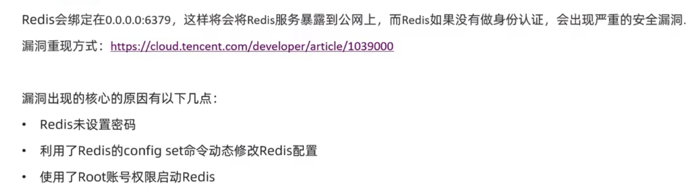


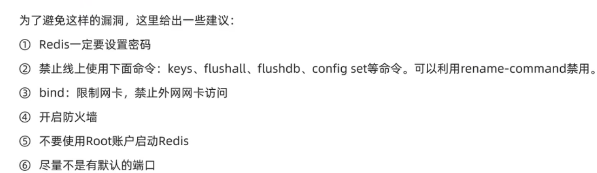


### 内存配置


查看内存使用情况：

`info memory`（info 查看整体情况）

`memory stats`（memory help查看帮助）


可以用`client list`查看输入缓冲区、输出缓冲区的占用情况。


## 集群最佳实践

### 集群完整性问题

在Redis默认配置中，如果发现任意一个插槽不可用，则整个集群都会停止对外服务。

为了保证高可用性，建议将`cluster-require-full-coverage`配置为false


### 集群带宽问题


# Redis原理篇

## Redis数据结构

### 动态字符串SDS


-------------------


其中uint8代表无符号整数，最大长度为8个bit位(255)，不包括\0

-----------------


内存预分配是为了减少内存分配的操作，因为这个操作非常消耗资源。


### IntSet

**元素不重复**


--------------------


----------------------


-------------------------------


**IntSet在数据量不多的情况下使用**


### Dict

#### DictHashTable和DictEntry


哈希表的size总等于2^n，跟哈希运算有关。

used可能大于size


h&sizemark其实就是h对size求余（因为sizemark低位全是1，进行与操作就能得到h的低位，这个低位就是模size的余数）


#### **Dict**


#### Dict的渐进式rehash

##### **Dict扩容**


（由于bgsave  、bgrewriteaof占用资源大，所以在进行它们时不会扩容，除非大于5。）


##### **Dict收缩**


**无论收缩还是扩容，都需要用到dictExpand函数，有需要可以自行查阅源码。**

分析可知：实际上是先创建了一个空的哈希表，并在健壮性检查后，对它的大小进行设置。

​					如果是Dict的初始化，那么会直接返回创建的哈希表给dict->ht[0]。

​				    如果是扩容或收缩，最后会将扩容且为空的哈希表赋值给dict->[1]，然后返回，把后续操作（元素迁移等）留给rehash。


##### **Dict的rehash**

Rehash 是指将现有的哈希表中的所有键值对重新映射到一个新的更大的或更小的哈希表中。这个过程的主要目的是：

- **扩容**：当哈希表的负载因子过高时，增加哈希表的大小以减少哈希冲突。
- **缩容**：当哈希表的负载因子过低时，减少哈希表的大小以节省内存。

如果一次性进行rehash，主线程是阻塞的，Redis 使用 **渐进式 rehash** 来避免一次性 rehash 带来的性能问题。


#### 总结


### ZipList

Dict的内存分配是不连续的，需要通过指针进行指向，指针本身占用了很大内存（一般为8字节），会造成内存浪费。且不连续的内存空间容易形成内存碎片。

而ZipList是一种为了节省内存而设计的数据结构。

#### ZipList结构

ZipList可以看成一种特殊的双向链表（实际不是），有一系列特殊编码的连续内存块组成。可以在任意一端进行压入/弹出操作，并且该操作的时间复杂度位O(1)。


既然每个entry占用的内存大小是不固定的，那么是如何进行遍历的呢？

#### entry结构

ZipList中的entry不像链表那样记录前后节点的指针，因为两个指针占用16个字节，浪费内存。而是采用了下面的结构：


- previous_entry_length：前一个节点的长度，占1或5个字节。
  - 如果前一个字节的长度小于254字节，1个字节来保存长度
  - 大于等于254字节，5个字节保存长度。第一个字节为0xfe，后四个字节才是真实长度。（不建议一个entry存储太多数据而用5个字节来保存长度）
- encoding：编码属性，记录content的数据类型（字符串还是整数）以及长度，占用1、2、或5个字节
- content：负责保存节点的数据，可以是字符串或整数

所以正序遍历时，下一个entry的地址就是本节点的地址加上这三个的长度。逆序遍历时，上一个节点的地址就是本节点的地址减去本节点记录的上一个节点的长度。

##### **Encoding编码**

ZipList中所有存储长度的数值均采用小端字节序，即低位字节在前，高位字节在后。例如0x1234，采用小端字节序后实际存储值为0x3412（两个16进制位占用一个字节）。

**字符串编码：**


**整数编码**


其中，最后一种能表示0-12，也省略了content：


#### 限制

##### 性能问题

当遍历时，ZipList只能从前向后或从后向前一个一个遍历，如果entry很多，而查找的位置在中间，查询就会较慢。（也就是说查询方式与链表类似，只是更加节省内存）。

#####  连锁更新问题

假设有N个连续的、长度在250~253字节之间的entry，因此每个entry的previous_entry_length属性用一个字节就能表示。

比如就是ZipList的前N个entry长度都为250。在此时向队首插入了一个254个字节的entry，那么原本的第一个entry的previous_entry_length占用的空间就从1字节变成了5字节，因而此entry的大小也从250字节变成了254字节，然后再下一个的previous_entry_length占用空间就从1字节变成了5字节，因而此entry的大小也从250字节变成了254字节。。。。。。


ZipList这种特殊情况下产生连续多次空间扩展操作称为**连锁更新**。这种情况下需要进行多次内存申请，占用资源较大。新增、删除、修改都可能导致连锁更新的产生。


#### 总结


### ListPack

为了解决ZipList连锁更新（级联更新）的问题，redis7中将ZipList数据结构换成了ListPack。


ListPck与ziplist的重大区别在head与每个entry结构上，表示列表结束的end与ziplist的zlend是相同的，都占一个字节，且8位全为1。

#### head

head由两部分组成：

- totalBytes：占4个字节，用于存放lisPack列表整体数据结构所占的字节数，包括totalBytes本身的长度。
- elemNum：占2个字节，用于存放列表包含的entry个数，其意义与ziplist中的zllen相同。


与ziplist相比，没有了记录最后一个entry偏移量的zltail。


#### entries

entries也是listPack中真正的列表，由很多的列表元素entry构成。由于不同的元素类型、数值的不同，从而导致了每个entry长度的不同。但与ziplist的entry结构相比，listPack的entry结构发生了较大的变化。


其中最大的变化就是**没有了记录前一个entry长度的prevlength，而增加了记录当前节点长度的element-total-len。**这个改变仍然可以实现逆序遍历，但却避免了级联更新。

entry结构：

- encoding：用于标志后面data的类型。如果data为整数类型，encoding长度可能为1、2、3、4、5或9字节。不同的字节长度，其标识位不同。如果data为字符串类型，则encoding的长度可能为1、2或5字节。data字符串不同的长度，对应着不同的encoding长度。

  - 整数编码：

    

  - 字符串编码:
    

- data:存储真正的数据。数据类型只能是整数类型或字符串类型。不同的数据占用的字节长度不同。

- element-total-len：用于记录当前节点的长度（不包括本身，是encoding+data），用于实现逆序遍历。由于其特殊的记录方式，使其本身占用的字节数可能会是1、2、3、4、5字节。

  

### QuickList

因为ZipList申请的是连续的内存，如果申请的内存空间不大，还好。如果需要的空间比较大，那么申请内存的时候就比较麻烦。因为内存是碎片化的，想找到大块连续内存比较困难。所以ZipList往往不能添加过多的数据。

那么如果数据比较多怎么办？

--引入QuickList，它是一个双端链表，只不过链表中的每一个节点都是ZipList。


--------------


------------

结构源码：


---------------------

示意图：

其中中间两个ZipList是被压缩之后的格式


**特点**


### SkipList

ZipList和QuickList都很节省内存，但是在遍历元素的时候，只能从头到尾、从尾到头遍历，在查询首尾元素时性能不错。如果想在中间查询，性能就不怎么样了。

如果想要从中间查询并且提高性能的话，就要用到--SkipList


跳表首先是链表，但与传统链表相比有几点差异：

- 元素按照升序排列存储
- 节点可能包含多个指针，指针跨度（层级）不同，最多支持32级指针。


每个节点有一个属性是多级索引数组，比如上图的1号节点的数组中有四个元素。每个元素有两个值：下一个节点的指针和索引跨度。

标准的跳表只有正向查询才有多级指针。


源码：


---------

结构演示：


**注意：虽然上图用level进行互相指，但是实际指向的是节点**


总结：


### RedisObject

以上学习的六种数据结构都是底层的实现，它们都会被封装成RedisObject的结构。


Redis中任意数据类型的键和值都会被封装成一个RedisObject，也叫做Redis对象，源码如下：


整个对象占用16个字节。

因此数据量大不太推荐用String，因为每个String都有一个对象头（上图），内存就被浪费了，此时可以考虑封装成一个集合。


#### Redis编码方式


数据类型对应的编码方式:


**之前学习的bitmap、hll等底层都是string类型，geo是sortedset，并不是新类型**


### 五种数据类型

#### String

String是redis中最常见的数据存储类型：

- 其基本编码方式是raw，基于简单动态字符串（SDS）实现，存储上限为512mb

  

- 如果存储的SDS长度小于44字节，则会采用EMBSTR编码，此时object head 与SDS是一段连续空间。申请内存时只需要调用一次内存分配函数，效率更高。

  

  为什么是44？
  长度44字节时，SDS的len、alloc、flags各一个字节，加上结束标识一个字节，再加上object head，一共64字节。redis在内存分配时会以2^n进行内存分配，64刚好，不会产生内存分片。

- 存储的字符串是整数值，并且大小在LONG_MAX范围内（long范围内），会采用INT编码：直接将数据保存在RedisObject的ptr指针位置（刚好8字节），不再需要SDS了。

  


#### List

Redis采用QuickList来实现List。

`pushGenericCommand`函数源码实现较为简单，建议看一下。

给出此函数的一个片段：

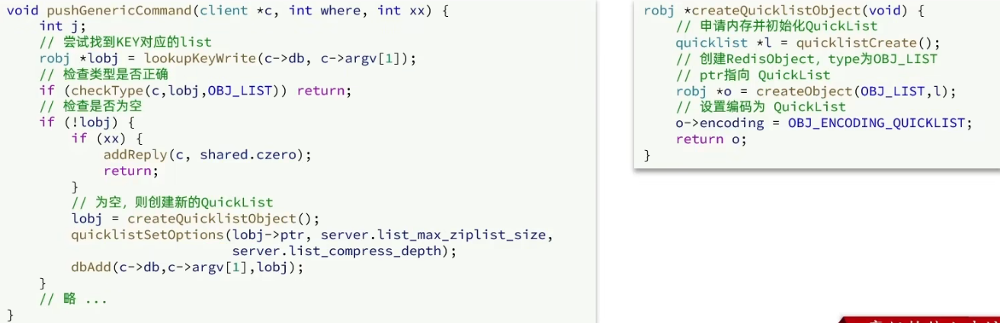


list内存结构:


（其实就是在QuickList基础上包了一层object head）


#### Set

Set是Redis中的单列集合，满足以下特点：

- 不保证有序性
- 保证元素唯一（可以判断元素是否存在）
- 求交集、并集、差集

Set的很多命令都需要去判断元素是否存在，那么他对查询元素的效率要求就非常高。满足查询效率高的数据结构有Dict和SkipList，而SkipList是有序的（且用数值排序，而set不一定存储的是数值），不符合set的无序性。

- 因此底层采用的是**Dict**来实现的，采用的是HT编码。

  **Dict中的key用来存储元素，value统一为null。**

- 当存储的所有数据都是整数，且元素数量不超过set-max-intset-entries（默认512，可设置）时，Set会采用IntSet编码，以节省内存。


当采用IntSet时，每一次插入新元素都会检查符不符合要求，违背了就会转化成HT编码。


#### ZSet

##### 第一种实现

ZSet也就是SortedSet，其中每一个元素都需要指定一个score和member值：

- 可以根据score值排序
- member必须唯一
- 可以根据member查询分数

因此，ZSet底层数据结构必须满足**键值存储、键必须唯一、可排序**这几个需求。哪种数据结构可以满足：

- skiplist：可以排序，并且可以同时存储score和ele值（member）。但是想要根据ele找score效率较低。并不能保证key唯一。
- HT（Dict）：可以键值存储、可以根据key找value。但是不能排序


所以，Zset两者结合：


结构图：


所以Zset的key找value很快（hash运算），本身也是排好序的。且性能非常好。

但是，非常占用内存。


##### 第二种实现

当元素不多时，HT和SkipList的优势不明显，而且更耗内存。因此zset还会采用ZipList结构来节省内存，不过需要满足两个条件：

- 元素数量小于zset_max_ziplist_entries，默认128。设置为0则禁用ziplist
- 每个元素都小于zset_max_ziplist_value字节，默认64

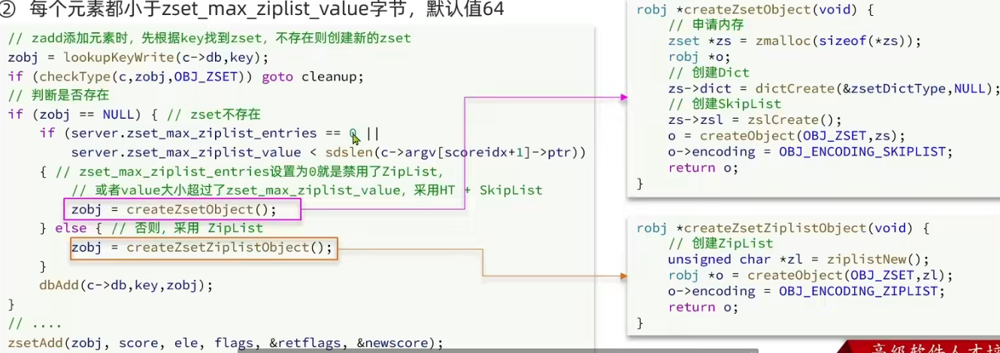


ZipList本身不支持排序，需要通过编码实现：

- ZipList是连续内存，因此score和member是紧挨在一起的两个entry，member在前，score在后
- score越小越接近队首，score越大越接近队尾，按照score值升序排列


结构图：


##### 转换实现方式


redis兼顾内存和性能，数据量小时查询的性能没有太大波动，采用ziplist节省内存。数据量大了之后以空间换时间。


#### Hash

Hash结构与Redis中的Zset非常类似：

- 都是键值存储
- 都需求根据键获取值
- 键必须唯一

区别：

- zset值为数值，hash键和值都是任意值
- zset要根据score排序；hash则无需排序

因此，Hash底层采用的编码与Zset基本一致，只需要把排序有关的SkipList去掉即可


------------

ZipList：


---------------

HT：


源码片段：
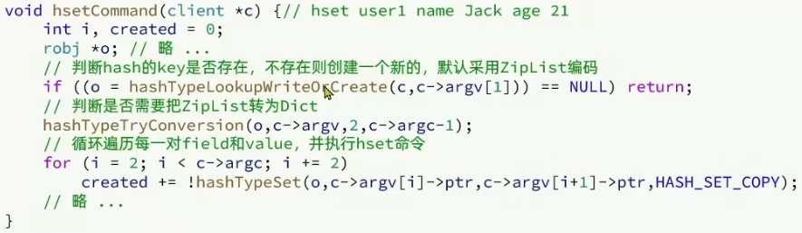

--------------


-------------------


-----------------


## Redis网络模型

### 网络请求的工作流程

当应用程序需要发送网络请求时，通常会经历以下步骤：

(1) **应用层准备数据**

应用程序构造好要发送的数据（例如 HTTP 请求的内容），并通过编程语言提供的网络库（如 Python 的 `socket` 模块）发起请求。

(2) **调用系统 I/O 接口**

应用程序通过系统调用（如 `write` 或 `send`）将数据传递给操作系统。这是用户态到内核态的切换。

- 用户态 vs 内核态
  - 用户态：应用程序运行的状态，无法直接访问硬件。
  - 内核态：操作系统运行的状态，可以直接访问硬件资源。

(3) **操作系统处理数据**

操作系统接收到数据后，会进行以下操作：

- 将数据封装成符合 TCP/IP 协议的数据包。
- 使用路由表确定数据包的目标地址。
- 将数据包交给网卡驱动程序，由网卡将其发送到网络中。

(4) **硬件发送数据**

网卡将数据包转换为电信号或光信号，通过物理介质（如以太网线或无线信号）发送到目标设备。


### 网络请求需要调用系统IO

(1) **硬件访问权限**

现代计算机体系结构设计中，应用程序运行在用户态，无法直接访问硬件资源（如网卡）。只有操作系统运行在内核态，才有权限直接与硬件交互。

(2) **协议栈实现**

网络通信需要遵循复杂的协议（如 TCP/IP），这些协议的实现由操作系统内核完成。如果应用程序需要自己实现协议栈，则会增加开发难度和维护成本。

(3) **资源管理**

网络带宽、连接数等资源是有限的，操作系统负责公平分配这些资源。如果每个应用程序都直接访问硬件，可能会导致资源竞争、死锁等问题。

(4) **安全性**

直接访问硬件可能导致安全漏洞。例如，恶意程序可能通过直接访问网卡窃取其他程序的数据，或者伪造网络流量攻击其他设备。操作系统通过系统调用接口限制了这种行为。


### 用户空间和内核空间

任何linux发行版，其系统内核都是linux，我们的应用都需要通过linux内核与硬件交互。

应用需要基于发行版去访问内核，然后基于内核操作计算机硬件。


内核本质也是应用，运行也需要消耗硬件资源。

所以要将用户应用和内核隔离开，防止用户应用与内核冲突甚至造成内核崩溃。


进程运行在用户空间称为用户态，运行在内核空间称为内核态。

两个状态的切换流程举例：


影响性能的主要点是**数据wait的过程以及buffer拷贝的过程。**

那么想要提高io的效率，就要针对这两个点作优化，而下面linux五种io模型就是针对这两点的不同优化。


### 阻塞IO

顾名思义，阻塞IO就是两个阶段都必须阻塞等待：


由于阻塞，性能较差。


### 非阻塞IO

非阻塞IO的recvfrom操作会立即返回结果而不是阻塞用户进程。

但这个非阻塞仅仅是一阶段等待数据时不阻塞，二阶段拷贝数据时仍然是阻塞的：


### IO多路复用


提高效率的办法：

- 多线程（cpu要在多个线程之间进行上下文的切换，线程多了可能性能不增反降，不推荐这种方案）
- 数据就绪了，用户应用才去读取数据


那么用户进程如何知道内核中数据是否就绪呢？

**文件描述符：**简称FD，是一个从0开始递增的无符号整数，用来关联Linux中的一个文件。在Linux中，一切皆文件，例如常规文件、视频、硬件设备等，当然也包括网络套接字（Socket）

**IO多路复用：**是利用单个线程来同时监听多个FD，并在某个FD可读、可写时得到通知，从而避免无效的等待，充分利用CPU资源。

示意图：


#### **IO多路复用分类**

主要三种：select、poll、epoll

差异：

- select和poll只会通知用户进程有FD就绪，但不确定具体是哪个FD，需要用户进程逐个遍历FD来确认
- epoll则会在通知用户进程FD就绪的同时，把已就绪的FD写入用户空间，用户就知道哪些FD是就绪的了


##### select

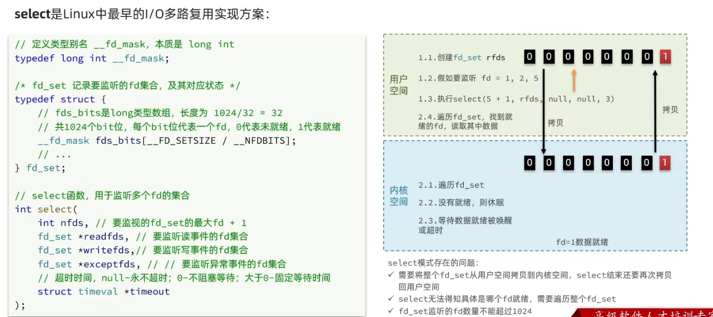

将要监听的位置置为1，拷贝给内核，内核将未就绪的fd置为0，再拷贝给用户。

问题：图中


##### poll


##### epoll

 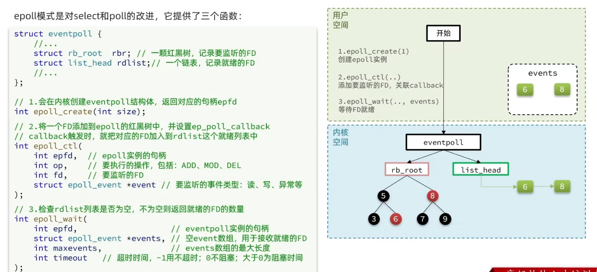


select模式存在的三大问题：

- 能监听的FD最大不超过1024
- 每次select都需要把所有要监听的FD都拷贝到内核空间，完事了再拷贝回去
- 每次都要遍历所有FD来判断就绪情况

poll模式问题：

- 利用链表解决了select中监听FD上限的问题。但是FD多了性能下滑
- 其他问题没有解决

epoll解决问题：

- 基于红黑树保存要监听的FD，理论上无限。且性能高
- 只需要拷贝一次eventpoll到内核空间，之后只需要增删改FD；只需要拷贝已就绪的FD回去
- 返回已就绪的FD，无需遍历所有FD获得就绪情况


#### epoll的ET和LT模式

当FD有数据可读时，我们调用epoll_wait就可以得到通知。但是事件通知的模式有两种：

- LevelTriggered：简称LT。当FD有数据可读时，会重复通知多次，直至数据处理完成。是epoll的默认模式。
- EdgeTriggered：简称ET。当FD有数据可读时，只会被通知一次，不管数据是否处理完成。

其实现也就是LT模式在数据未处理完成会将FD继续放在list_head中。而ET模式只要被处理就会从list_head中移除FD。


结论：

- ET模式避免了LT模式可能导致的惊群现象（如果有多个进程或线程都在监听同一个文件描述符上的事件，当该文件描述符变为就绪时，所有这些进程或线程都会被唤醒。）
- ET模式想要处理完整的数据：（相比LT更复杂）
  - 手动将FD再放入list_head
  - 结合非阻塞式IO循环读取FD数据。


#### 基于epoll的服务端流程

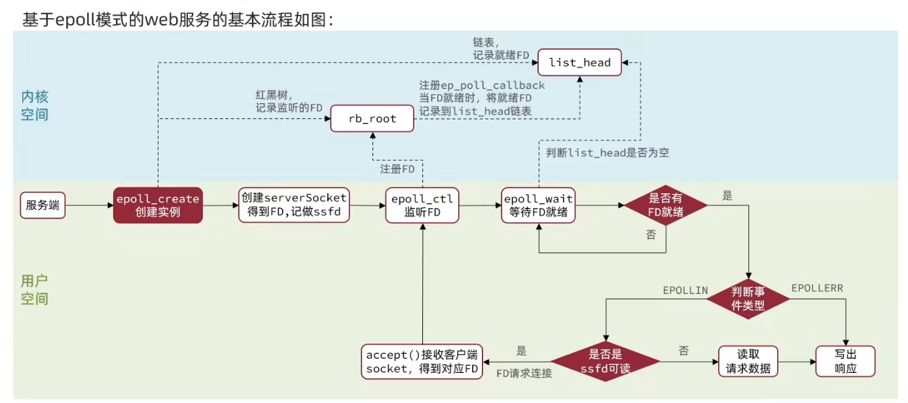


### 信号驱动IO

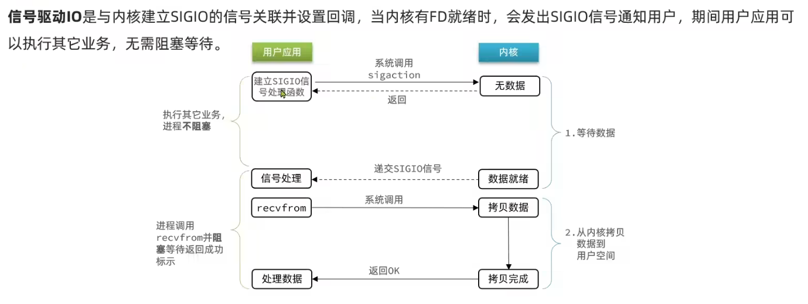

当有大量IO操作时，信号较多，SIGIO处理函数不能及时处理可能导致信号队列溢出

且内核空间与用户空间的频繁信号交互性能也较低


### 异步IO

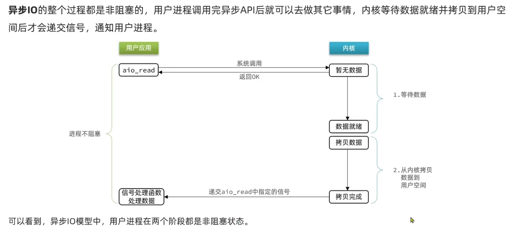

在高并发的情况下，异步IO交给内核的任务过多，无法及时处理。

要想正常使用，要对用户的请求进行限流，但这样实现复杂度又加大了。


IO操作同步还是异步，关键在于数据在内核空间和用户空间的拷贝过程（数据读写的IO操作），也就是阶段二

所以只有异步IO是真正的异步


### *Redis网络模型及事件循环

Redis到底是单线程还是多线程？

- 如果是Redis的核心业务部分（命令处理），单线程
- 如果整个Redis，多线程


#### Redis单线程网络模型

Redis通过IO多路复用来提高网络性能，并且支持各种不同的多路复用实现，并且将这些实现进行封装，提供了统一的高性能事件库API库AE：

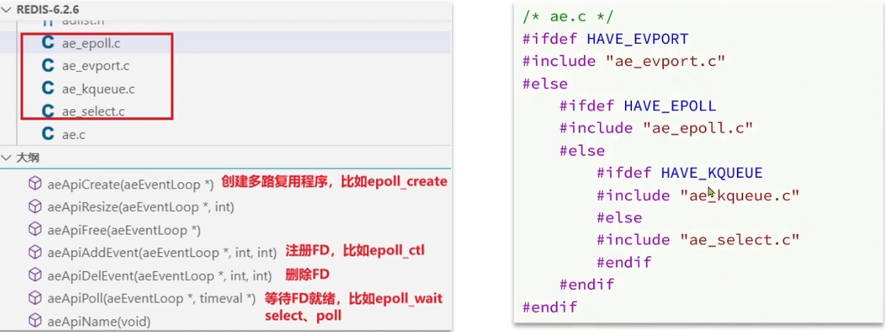

右边的图是根据当前的操作系统选择合适的库。


**Redis单线程网络模型的整个流程：**（事件循环）


-----------------

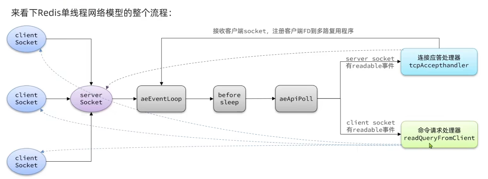

可以把redis看成服务端，redis启动时，

会创建一个server socket （监听套接字，永远不会触发可写事件），

redis在内核中创建一个epoll实例，使用epoll_ctl()将套接字添加进epoll，并指定感兴趣的事件类型。对于服务器套接字，感兴趣的是可读事件（EPOOLLIN），这意味着有新的客户端尝试建立连接。同时指定一个处理器，定义了收到连接请求后该怎么做。

在将服务端套接字注册进epoll的同时，增加一个处理器（监听可读事件，也就是客户端发来连接请求），在收到客户端连接请求时调用，如下：

（下面那张图调用的这张图）


在 Redis 的主循环中，会调用 `epoll_wait()` 来等待已注册的文件描述符上的事件发生。一旦某个文件描述符（包括服务器套接字）上有事件发生，`epoll_wait()` 会返回，并提供关于哪些文件描述符变为就绪状态的信息。

- **处理新连接**：如果服务器套接字变得可读，说明有一个或多个新的客户端连接请求到达。此时，Redis 会调用 `accept()` 接受这些连接，并为每个新连接创建一个新的客户端套接字。
- **为新连接注册事件**：随后，Redis 会将这些新的客户端套接字(client socket)也添加到 `epoll` 实例中，以便监听来自客户端的数据读取或其他事件。并添加处理器（监听读事件），在收到请求时进行回调。(参考上图)


**请求处理**：在client socket变为可读状态时，代表有新的请求（如命令），这时会调用命令请求处理器(readQueryFromClient)进行处理（读取请求信息，写返回等）

在源码中可以看到，每个客户端socket只要跟服务端连接，redis就会把它封装成一个client实例，这个实例包括客户端的所有信息甚至请求信息，这也是我们之前的源码中能使用client对象来获取命令的原因。


这时还没有将返回的结果写出，只是添加到队列中等待写出。

在什么时候写出？---beforeSleep


可以看到，这里又给客户端套接字定义了一个处理器，上面已经给他定义了读事件的处理器，而这里是写事件的处理器。处理器会将队列中的客户端的缓冲区中的数据取出来，写道客户端socket中，客户端就拿到结果了。


Redis6.0模块中引入了多线程，目的是提高IO读写效率。因此在性能瓶颈的地方采用了多线程（解析客户端命令、写响应结果时）。核心的命令执行、IO多路复用模块仍然由主线程执行（他们都很快，不是性能瓶颈，不需要多线程进行提升）

在多个客户端socket变成可读状态的时候，会使用轮询的方式将客户端分发给不同的线程进行解析，当然执行命令还是由主线程执行。在出发了写事件要写出数据的时候，多线程从队列里取并写。

(注：性能瓶颈的地方始终是IO，因为涉及到网络IO)


总结：

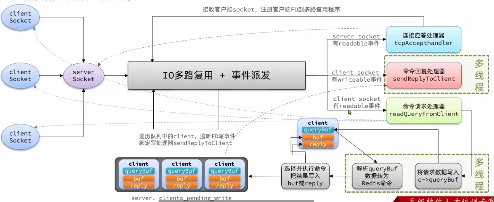


## Redis通信协议

### RESP协议


RESP数据类型：


未来在客户端向服务端发送命令时，命令就是用数组进行发送的，数组中都是字符串形式的命令片段（如上图左下角）


### 基于socket的自定义redis客户端

```java
public class Main {
        static Socket s;
        static PrintWriter writer;
        static BufferedReader reader;

        public static void main(String[] args) {
        //1.跟redis建立连接
        try {
            String host = "192.168.14.128";
            int port = 6379;
            s = new Socket(host, port);
            //2.获取输出流、输入流
            writer= new PrintWriter(new OutputStreamWriter(s.getOutputStream(), StandardCharsets.UTF_8));
            //输入流理论上应该用字节流（因为响应可能含有特殊字符，不应该一行一行读）
            //这里为了方便（这里目的仅仅是演示RESP协议）采用字符流
            reader=new BufferedReader(new InputStreamReader(s.getInputStream(), StandardCharsets.UTF_8));
            //获取授权 auth abc123
            sendRequest("auth","abc123");
            Object obj=handleResponse();
            System.out.println("obj="+obj);
            //3.发出请求 set name muite
            sendRequest("get","name");
            //4.解析响应
            obj=handleResponse();
            System.out.println("obj="+obj);
        } catch (Exception e) {
            e.printStackTrace();
        }
        finally{
            //5.释放连接
            if(reader!=null) {
                try {
                    reader.close();
                } catch (IOException e) {
                    throw new RuntimeException(e);
                }
            }
            if(writer!=null)
                try {
                    writer.close();
                } catch (Exception e) {
                    throw new RuntimeException(e);
                }
            if(s!=null) {
                try {
                    s.close();
                } catch (IOException e) {
                    throw new RuntimeException(e);
                }
            }
        }

    }

    private static void sendRequest(String ... args) {
        writer.println("*"+args.length);
        for (String arg : args) {
            writer.println("$"+arg.getBytes(StandardCharsets.UTF_8).length);
            writer.println(arg);
        }
        writer.flush();
    }

    private static Object handleResponse() throws IOException {
        //读取首字节
        int prefix = reader.read();
        //判断RESP数据类型标识
        switch(prefix) {
            case '+'://单行字符串，直接读一行
                return reader.readLine();
            case '-'://异常，也读一行
                throw new RuntimeException(reader.readLine());
            case ':'://数字
                return Long.parseLong(reader.readLine());
            case '$'://多行字符串
                //先读长度
                int len=Integer.parseInt(reader.readLine());
                if(len==-1){
                    return null;
                }
                if (len==0){
                    return "";
                }
                //再读数据，读len个字节。
                // 我们为了简化采用的是字符流，所以假设没有特殊字符，所以读一行
                return reader.readLine();
            case '*':
                return readBulkString();
            default:
                throw new RuntimeException("错误的数据格式！");
        }
    }
    private static Object readBulkString() throws IOException {
        //获取数组大小
        int len=Integer.parseInt(reader.readLine());
        if(len<=0){
            return null;
        }
        //定义集合，接收多个元素
        List<Object> list=new ArrayList<>(len);
        //遍历，依次读取每个元素
        for(int i=0;i<len;i++){
            //数组中的元素又可能是五种数据格式的一种，采用递归
            list.add(handleResponse());
        }
        return list;
    }

}
```


## Redis内存回收

### 过期key处理

Redis是如何知道一个key是否过期呢？

--利用两个Dict分别记录key-value和key-ttl（见下面的DB结构）

是不是TTL到期就立即删除了呢？

--惰性删除

--周期删除

#### DB结构


其中expires中存放了所有存在expire的key及其TTL，key存储的就是key，val存储的是TTL。


结构：

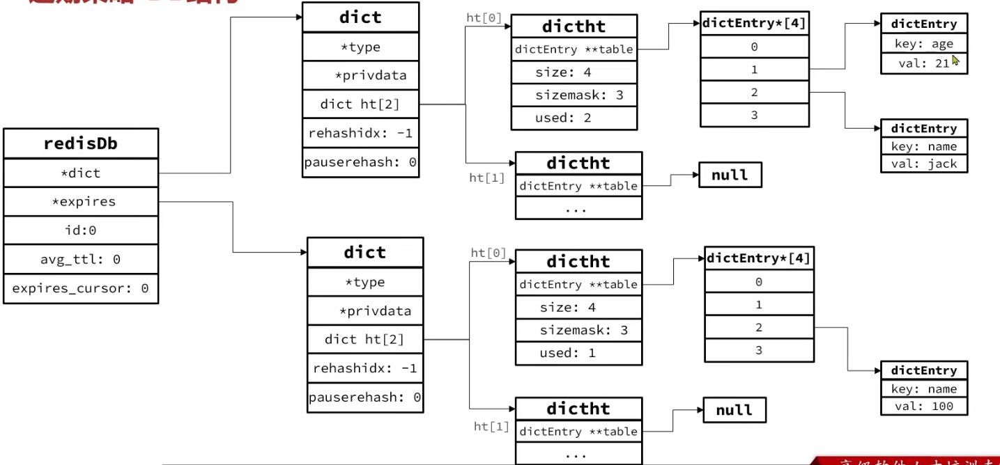

其中上面的dictEntry中的val其实是指向各种数据类型的value的指针，这里做了简化。


#### 惰性删除

不是在TTL到期后就立即删除，而是在访问一个key的时候，检查该key的存活时间，如果已经过期才删除。

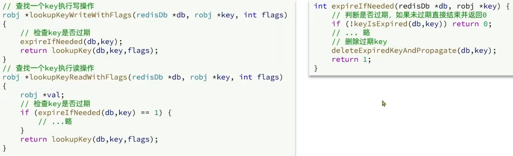

但是如果只有惰性删除，在某个key长时间没有被访问时，就不会删除


#### 周期删除

通过一个定时任务，周期性的抽样部分过期的key，然后执行删除。执行周期有两种：

- Redis会设置一个定时任务serverCron（），按照server.hz的频率执行过期key清理，模式为SLOW
- Redis的每个事件循环前调用beforeSleep（）函数，执行过期key清理，模式为FAST


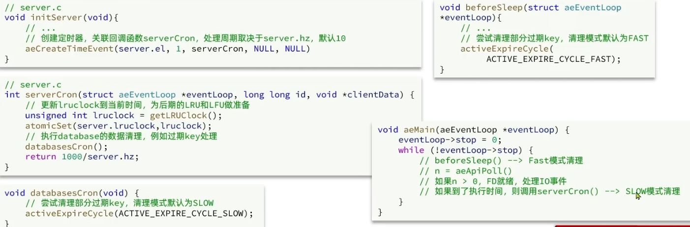


### 内存淘汰策略

内存淘汰：

当Redis内存使用达到设置的阈值时，Redis主动挑选部分key删除以释放更多内存的流程。


Redis在任何命令执行前作内存检查：


淘汰哪一部分内存：

八种策略：


如何统计最近使用时间和使用频率？


其中lru属性根据淘汰策略的不同配置会存储不同信息（lru或lfu）


performEvictions方法源码的简单示意图：

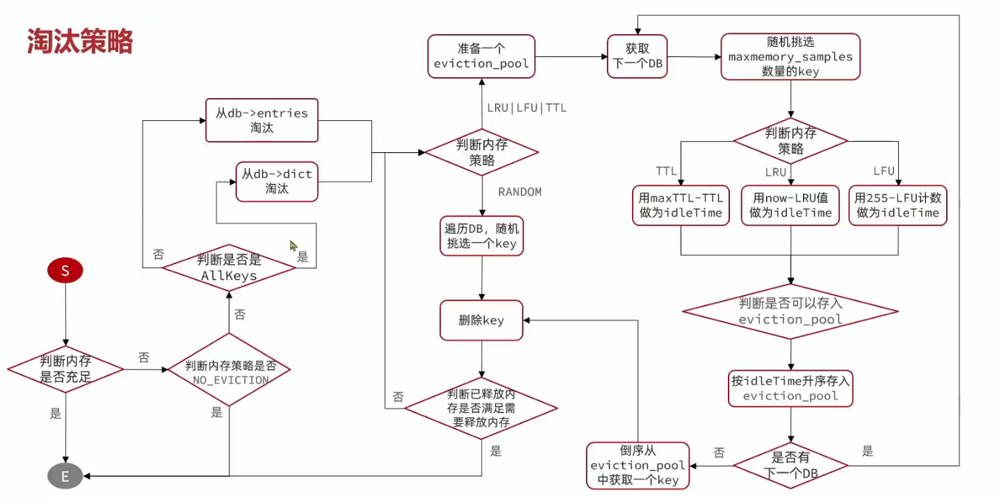

其中应该是db->expires不是db->entries。


