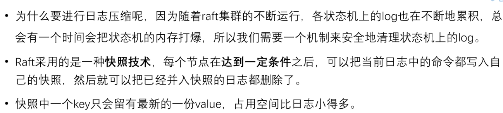
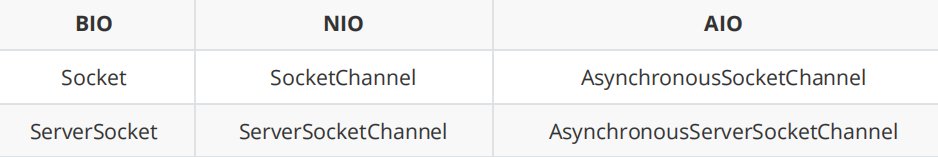

# Redis事务

在 Redis 中，事务通过 `MULTI`、`EXEC`、`DISCARD` 和 `WATCH` 四个命令来实现。Redis 的事务允许以原子方式执行一系列命令，这意味着这些命令要么全部执行成功，要么一个也不执行。

- **MULTI**：标记事务的开始。之后的所有命令将不会立即执行，而是被放入队列中。
- **EXEC**：执行所有在 `MULTI` 后面入队的命令，并且以原子的方式执行。如果在这个过程中有命令出错，则其他命令仍然会被执行，但是错误的命令不会被执行。
- **DISCARD**：清除队列中的所有命令，并退出事务状态。
- **WATCH**：用于检测键是否被修改。如果在 `WATCH` 之后和 `EXEC` 之前，某个被 WATCH 的键被修改了，那么整个事务将会失败（即 `EXEC` 返回空响应）。可以使用**UNWATCH**取消

Redis 事务不支持回滚机制，这意味着一旦事务中的命令开始执行，即使后续命令出现错误，之前的命令也不会被撤销。


Redis事务和MySQL事务的区别：

1. **原子性**
   - **Redis**: Redis 事务不具备真正的原子性，虽然事务内的命令会按顺序执行，但如果某些命令失败，其他命令依然会执行，不会自动回滚。
   - **MySQL**: MySQL 事务具有完全的原子性，要么所有命令都成功，要么全部失败并回滚。
2. **隔离性**
   - **Redis**: Redis 提供了简单的隔离级别，通过 `WATCH` 可以监控某些键的变化，防止并发冲突，但并没有复杂的隔离级别如读未提交、读已提交等。
   - **MySQL**: MySQL 支持多种事务隔离级别（读未提交、读已提交、可重复读、串行化），可以根据需求调整隔离级别来控制并发访问的行为。
3. **持久性**
   - **Redis**: 持久化依赖于配置，如 RDB 快照或 AOF 日志，但默认情况下并不是每次写操作都会同步到磁盘上。
   - **MySQL**: 事务提交后，更改会被立即写入日志文件，并根据配置决定何时刷盘，通常来说，MySQL 更注重数据的持久性和安全性。
4. **回滚机制**
   - **Redis**: 不支持回滚，一旦事务开始执行，即使中途出错，已完成的部分也会保留。
   - **MySQL**: 完全支持事务回滚，可以在任何时候撤销尚未提交的更改。


**redis事务错误类型：**

- 用MULTI开启事务后，输入的命令有误，在此命令回车后立即报错。再执行exec所有命令都无法执行。
- 输入命令时错误并没有发现（语法没有问题，比如自增了一个字符串类型的值）。使用exec执行命令了才发现错误，此时执行成功的命令不会回滚，执行错误的会报错。


Redis使用Watch来提供乐观锁定，类似于CAS（Check-and-Set）。

先使用Watch监视key，再开启MULTI，在MULTI和EXEC期间如果key发生改变，则此事务所有命令都失败

exec后，所有watch取消；当客户端连接丢失（比如退出连接），也会取消监视


# BigKey

## MoreKey

**问题：**

如何遍历海量数据？keys *可以吗？

-- 建议禁用keys *，由于redis单线程，keys复杂度为O（n），如果key过多，使用此命令会造成Redis阻塞，可能引起缓存雪崩甚至数据库宕机

此外flushdb / flushall等命令也应限制或禁用

（注意：如果持久化文件中有要禁用的命令，可能导致redis启动失败，应先删除这些命令或者删除持久化文件）


那么keys *用不了，应该用什么呢？

--scan、sscan、hscan、zscan等


`scan cursor [match pattern] [count count]`

cursor：游标

pattern：匹配的模式

count：指定从数据集里返回多少元素，默认值为10


scan命令是一个基于游标的迭代器，每次被调用之后，都会向用户返回一个新的游标，用户在下次迭代时需要使用这个新游标作为scan命令的游标参数。

scan返回包含两个元素的数组，第一个元素是用于进行下一次迭代的新游标；第二个元素则是一个数组，这个数组包含了元素。如果新游标返回0，代表迭代已达到末尾。

scan的遍历顺序非常特别，它不是从第零位一直遍历到末尾，而是采用了高位进位加法来遍历。之所以使用这样的特殊方式进行遍历，是考虑到字典的扩容和缩容造成传统游标的改变。具体原理：

```
假设哈希表的大小为 8（即有 8 个槽位，编号为 0 到 7）。我们通过高位进位加法计算游标的变化过程：

初始状态
当前游标值 c = 0（二进制 0b000）。
第一次迭代
找到最高有效位：c = 0，没有有效位。
加1：将最低有效位设为1，得到新的游标值 c = 1（二进制 0b001）。
第二次迭代
找到最高有效位：c = 1（二进制 0b001），最高有效位是第0位。
加1：将第0位加1，得到新的游标值 c = 2（二进制 0b010）。
第三次迭代
找到最高有效位：c = 2（二进制 0b010），最高有效位是第1位。
加1：将第1位加1，得到新的游标值 c = 4（二进制 0b100）。
第四次迭代
找到最高有效位：c = 4（二进制 0b100），最高有效位是第2位。
加1：将第2位加1，得到新的游标值 c = 0（二进制 0b000，溢出后回绕到0）。
总结
完整的游标变化序列是：0 -> 1 -> 2 -> 4 -> 0。

4. 为什么高位进位加法能避免重复和遗漏？
(1) 均匀分布
高位进位加法生成的游标序列并不是简单的线性递增，而是基于二进制的高位优先规则，这使得游标的变化更加随机化且均匀分布在整个哈希表的索引空间中。即使哈希表发生扩容或缩容，这种均匀分布的特性仍然能够保证每个槽位被访问一次且仅一次。

(2) 动态调整兼容性
扩容：当哈希表扩容时，新的槽位数量是原来的两倍，Redis 会将旧槽位中的元素重新分配到新槽位中。高位进位加法的游标变化模式天然适应这种变化，因为它总是基于当前哈希表的大小进行计算。
缩容：当哈希表缩容时，槽位数量减少一半，但高位进位加法的游标计算方式仍然能够正确映射到新的槽位范围。
```


## BigKey（在最佳实践笔记中已提到）


## BigKey生产调优

在 Redis 中，Bigkey 的处理和调优是一个重要的运维任务，尤其是在高并发场景下。Redis 提供了一些机制来优化 Bigkey 的删除操作，其中 **Lazy Free** 是一个关键的特性。它通过异步释放内存的方式减少对 Redis 主线程的影响，从而避免阻塞问题。

以下是关于 Bigkey 调优和 Lazy Free 的详细解析：


**1. 什么是 Lazy Free？**

**Lazy Free** 是 Redis 提供的一种机制，用于异步释放键占用的内存。它的核心思想是将资源释放的操作从主线程中移出，交给后台线程执行，从而避免阻塞 Redis 的主线程。

- **适用场景**：主要用于删除 Bigkey 或者需要大量时间来释放内存的操作。

- 优点

  - 避免 Redis 主线程被阻塞。
- 提高 Redis 的响应速度和吞吐量。


**2. Lazy Free 的实现原理**

Redis 的 Lazy Free 机制依赖于以下两个核心组件：

1. **引用计数**：Redis 使用引用计数来管理对象的生命周期。当一个对象的引用计数降为 0 时，表示该对象不再被使用，可以安全地释放。
2. **后台线程池**：Redis 在内部维护了一个或多个后台线程（默认是单线程），用于执行异步的内存释放操作。

工作流程

1. 当调用 `UNLINK` 或启用 Lazy Free 特性时，Redis 会将目标键从数据库的数据结构中移除，并将其标记为“待释放”状态。
2. 后台线程池接管这些“待释放”的对象，并逐步释放它们占用的内存。
3. 主线程无需等待内存释放完成，直接返回结果给客户端。


**3. Lazy Free 的配置**

Redis 提供了几个配置选项来控制 Lazy Free 的行为。这些选项可以通过修改 `redis.conf` 文件或者在运行时使用 `CONFIG SET` 命令动态调整。

**(1) lazyfree-lazy-eviction**

- **作用**：是否在内存不足时（触发淘汰策略）启用 Lazy Free。
- **默认值**：`no`
- **建议**：如果 Redis 实例中存在大量大键，建议开启此选项以避免淘汰操作导致的阻塞。

**(2) lazyfree-lazy-expire**

- **作用**：是否在过期键被删除时启用 Lazy Free。
- **默认值**：`no`
- **建议**：如果设置了 TTL 的键较大，建议开启此选项。

**(3) lazyfree-lazy-server-del**

- **作用**：是否在服务器端显式删除键时（如 `RENAME`、`FLUSHDB` 等命令）启用 Lazy Free。
- **默认值**：`no`
- **建议**：如果频繁执行这些命令并涉及大键，建议开启此选项。

**(4) replica-lazy-flush**

- **作用**：是否在从节点执行全量同步后的 `FLUSHALL` 或 `FLUSHDB` 操作时启用 Lazy Free。
- **默认值**：`no`
- **建议**：如果从节点数据量较大，建议开启此选项。


**4. 如何启用 Lazy Free？**

Lazy Free 功能可以通过以下两种方式启用：

**(1) 修改配置文件**

在 `redis.conf` 文件中添加或修改以下配置项：

```
lazyfree-lazy-eviction yes
lazyfree-lazy-expire yes
lazyfree-lazy-server-del yes
replica-lazy-flush yes
```

**(2) 动态设置**

使用 `CONFIG SET` 命令动态调整配置：

```
CONFIG SET lazyfree-lazy-eviction yes
CONFIG SET lazyfree-lazy-expire yes
CONFIG SET lazyfree-lazy-server-del yes
CONFIG SET replica-lazy-flush yes
```


**5. 使用 UNLINK 替代 DEL**

`UNLINK` 是 Redis 提供的一个命令，专门用于异步删除键。它是 Lazy Free 的典型应用场景。

**示例**

假设有一个 Bigkey `bigkey`，你可以使用以下命令异步删除它：

```
UNLINK bigkey
```

与 `DEL` 不同，`UNLINK` 不会阻塞 Redis 主线程，而是将删除操作交给后台线程执行。


**6. 分批删除 Bigkey**

对于包含大量元素的数据结构（如 `List`、`Set`、`Hash` 或 `Sorted Set`），可以直接使用分批删除的方式来避免一次性删除带来的性能问题。

**示例**

(1) 分批删除 Hash 的字段

```
# 每次删除 100 个字段
HSCAN bigkey 0 COUNT 100
HDEL bigkey field1 field2 ... field100
```

(2) 分批删除 List 的元素

```
# 每次弹出 100 个元素
LPOP bigkey 100
```

(3) 分批删除 Set 的成员

```
# 每次随机移除 100 个成员
SPOP bigkey 100
```

(4) 分批删除 Sorted Set 的成员

```
# 每次移除最小的 100 个成员
ZPOPMIN bigkey 100
```


**7. 监控和检测 Bigkey**

为了有效管理 Bigkey，定期监控和检测是非常重要的。

**(1) 使用 redis-cli --bigkeys**

Redis 提供了一个内置工具 `--bigkeys` 来扫描数据库并报告 Bigkey。

```
redis-cli --bigkeys
```

**(2) 使用 MEMORY USAGE**

可以使用 `MEMORY USAGE` 命令查看某个键占用的内存量。

```
MEMORY USAGE bigkey
```

**(3) 使用 Redis 模块**

一些 Redis 模块（如 [RedisGears](https://redis.io/modules/redisgears/) 或 [RedisInsight](https://redis.com/redis-enterprise/redis-insight/)）提供了更强大的功能来分析和处理 Bigkey。


**8. 总结**

通过结合 **Lazy Free** 和其他优化手段，可以有效管理和优化 Bigkey，从而提升 Redis 的性能和稳定性。以下是具体建议：

1. **启用 Lazy Free**：根据业务需求调整相关配置选项（如 `lazyfree-lazy-eviction` 和 `lazyfree-lazy-expire`）。
2. **使用 UNLINK 替代 DEL**：尽量避免直接使用 `DEL` 删除大键，改用 `UNLINK`。
3. **分批删除**：对于复杂数据结构，采用分批删除的方式逐步清理数据。
4. **定期检测 Bigkey**：使用 `redis-cli --bigkeys` 或其他工具定期检查和优化 Bigkey。

通过这些方法，可以显著减少 Bigkey 对 Redis 性能的影响，确保系统的高效运行。


# 布隆过滤器

## 概述

- 布隆过滤器（Bloom Filter）是一种空间效率非常高的概率型数据结构，主要用于判断一个元素是否在一个集合中。它能够快速地告诉你某个元素“可能在集合中”或“绝对不在集合中”。布隆过滤器通过允许一定程度的误报（即报告某个元素可能存在但实际上不存在的情况），以换取极低的存储需求和高效的查询速度。

  **布隆过滤器的工作原理**

  1. **初始化**：创建一个长度为 m 的位数组，并将其所有位初始化为 0。
  2. **哈希函数**：选择 k 个独立的哈希函数，这些哈希函数将输入元素映射到位数组的不同位置上。
  3. 插入元素
     - 当要向布隆过滤器中添加一个元素时，使用这 k个哈希函数对该元素进行哈希计算，得到 k个不同的哈希值。
     - 将这些哈希值对应到位数组的位置上的位设置为 1。
  4. 查询元素
     - 要检查一个元素是否存在于布隆过滤器中，同样使用这 k 个哈希函数对该元素进行哈希计算并取模得到k个位。
     - 如果所有对应的位都是 1，则该元素可能存在于集合中；如果有任何一个位是 0，则该元素绝对不在集合中。

  **主要特点**

  - **空间高效**：相比直接存储元素，布隆过滤器只需要少量的位来表示大量元素的存在情况。
  - **时间高效**：无论是插入还是查询操作的时间复杂度均为 O(k)，其中 k 是哈希函数的数量，通常是一个小常数。
  - **存在误报率**：布隆过滤器可能会错误地认为一个不在集合中的元素存在于集合中，但不会漏报（即将存在的元素报告为不存在）。
  - **无法删除元素**：由于多个元素可能共享同一个位，因此不能简单地通过将位重置为 0 来实现删除操作。


​	布隆过滤器优点：内存占用少，没有多余key

​	缺点：

		- 实现复杂
	
		- 存在误判可能（因为哈希函数本身就是散列函数，可能会有碰撞）
		- 不能删除元素


## 原理&使用场景

哈希碰撞：输出值相同，输入值不一定相同；输出值不同，输入值一定不同。

如果只用一个哈希函数，很容易发生哈希碰撞。


建议：

- 使用时不要让实际元素数量远大于初始化bitmap的位数
- 当实际元素数量超过初始化数量时，应该对布隆过滤器进行重建，创建一个更大的过滤器，再将所有历史元素批量add进行


**使用场景:**

由于“有不一定有，无一定无”，场景为：

- 放在redis前解决缓存穿透问题
- 黑名单校验，识别垃圾邮件
- 存放安全连接网址，访问时如果不在过滤器里则不允许访问。


# 布谷鸟过滤器

**1. 基本原理**

布谷鸟过滤器基于**布谷哈希（Cuckoo Hashing）**技术。其核心思想是利用两个哈希函数来确定元素可以放置的位置，并通过“踢出”机制解决冲突问题。每个元素的指纹（fingerprint）被存储在一个或另一个位置上，如果这两个位置都已满，则会随机选择一个位置的元素进行替换并尝试将其重新定位到它的另一个可能位置。


**主要组成部分**

- **桶（Bucket）**：布谷鸟过滤器的基本存储单元，通常每个桶可以存储多个指纹。
- **指纹（Fingerprint）**：每个元素通过哈希计算得到的一个较短的二进制串，用来代表该元素。
- **哈希函数**：使用两个独立的哈希函数生成两个不同的索引位置。


**2. 工作流程**

**（1）插入**

1. 对于要插入的元素，首先计算其两个哈希值，从而确定两个可能的桶位置。
2. 检查这两个位置是否有一个未满。如果有，则将该元素的指纹插入其中。
3. 如果两个位置都满了，则随机选择一个位置的现有指纹进行“踢出”，并将新元素的指纹放入这个位置。
4. 被踢出的指纹需要根据其自身的哈希值找到新的位置，并重复上述过程。
5. 如果经过多次尝试后仍无法完成插入（达到最大迭代次数），则认为过滤器已满，可能需要扩展容量或调整参数。

**（2）查找**

1. 计算待查找元素的两个哈希值。
2. 检查对应的两个桶中是否有匹配的指纹存在。
3. 如果任何一个桶中找到了匹配的指纹，则认为该元素可能存在；否则，确认该元素不存在。

**（3）删除**

1. 同样计算元素的两个哈希值。
2. 在对应的两个桶中寻找匹配的指纹。
3. 找到后直接从桶中移除该指纹即可。


- **指纹长度的影响**：布谷鸟过滤器中使用的指纹长度是一个关键因素。较短的指纹意味着更高的碰撞几率，从而导致较高的误报率。相反，较长的指纹虽然降低了误报率，但增加了存储开销。
- **负载因子**：布谷鸟过滤器的性能和误报率还受其负载因子（即填充程度）的影响。高负载因子可能导致更多的踢出操作，进而增加误报的可能性。


# 分布式的CAP和BASE理论

## CAP theorem

**CAP** 也就是 **Consistency（一致性）**、**Availability（可用性）**、**Partition Tolerance（分区容错性）** 这三个单词首字母组合。

在理论计算机科学中，CAP 定理（CAP theorem）指出对于一个分布式系统来说，当设计读写操作时，每种策略只能同时满足以下三点中的两个：

- **一致性（Consistency）** : 所有节点访问同一份最新的数据副本。
- **可用性（Availability）**: 向任意健康节点发送请求都能获取到响应,而不是超时或拒绝--但不能保证获取的数据为最新数据
- **分区容错性（Partition Tolerance）** : 即使出现网络分区的情况，系统也能继续运行，仍然能够对外提供服务。
  - 网络分区：网络分区（Network Partition）是指在一个分布式系统中，由于网络故障或其他原因导致系统被分割成两个或多个独立的部分，这些部分之间无法进行通信。换句话说，网络分区就是指原本互相连接的节点群组因为网络问题被分隔开来，形成了若干个孤立的子群组，而这些子群组内部的节点可以正常通信，但不同子群组之间的节点无法相互通信。


**在分布式的情况下，P是一定要存在的，因为网络分区故障是难以完全避免的。那么可用性和一致性就一定要抛弃一个。**

**举例：**

多写模式下（每个选定的主节点都能够处理数据的写入请求，并负责将这些更改同步到其他相关节点）：

**如果选择保持强一致性（C）**：在多主节点架构中，当发生网络分区时，为了确保所有副本之间的一致性，系统可能需要阻止某些节点接受写请求，直到网络恢复并能够同步数据。这实际上降低了系统的可用性（A）

**如果选择保持高可用性（A）**：在这种情况下，每个主节点都可以独立地接受写请求，即使在网络分区的情况下也是如此。然而，这种做法可能导致数据不一致的问题，因为不同的分区可能会对相同的数据进行冲突的更新。


- 对于NoSQL数据库，更加注重可用性，所以会是一个AP系统

- 分布式关系型数据库，必须要保证一致性，所以会是一个CP系统

- 但分布式关系型数据库仍有高可用性需求，虽然达不到CAP理论中100%的可用性，但一般都具备五个9（99.999%）以上的高可用。即CP+HA(high availability)，由此产生了两个广泛应用的指标：

  - RPO(Recovery Point Objective)：恢复点目标，指数据库在发生灾难后会丢失多长时间的数据。分布式关系型数据库RPO=0。--对应C

  - RTO(Recovery Time Objective)：恢复时间目标，指数据库在灾难发生后到整个系统恢复正常所需要的时间。分布式关系型数据库RTO<几分钟。--对应A

    

### 目前成熟的分布式解决方案

#### Quorum Replication（仲裁复制）

- **R（Read Quorum）**
- **W（Write Quorum）**
- **N：总节点数**

**强一致性要保证R+W>N**

工作原理

1. **写操作**：当客户端发起一个写请求时，系统会将该请求发送给所有持有数据副本的节点。只有当至少 W* 个节点确认已成功写入数据后，整个写操作才被视为成功。
2. **读操作**：对于读请求，系统会查询至少 *R* 个节点的数据副本。
3. **保证一致性**：由于 R+W>N，每次读操作至少会接触到一个参与最近写操作的节点。这样可以确保读取到的数据是最新的，避免了旧数据覆盖新数据的问题。


**如果R+W<=N，那么就牺牲了一定的一致性来换取更高可用性**


#### 共识算法

包括Paxos、Raft、Zab等共识算法

Raft:

- Raft 是为了提高理解和实现的简易性而设计的一种共识算法。它的目标是比 Paxos 更容易理解，同时提供相同级别的容错能力。
- Raft 通过清晰地划分不同角色（如领导者、跟随者、候选人）以及定义状态转换规则来简化共识过程。
- 这使得只有短暂的选举过程是不可用的

## BASE

**BASE 理论本质上是对 CAP 的延伸和补充，更具体地说，是对 CAP 中 AP 方案的一个补充。**

**为什么这样说呢？**

AP 方案只是在系统发生分区的时候放弃一致性，而不是永远放弃一致性。在分区故障恢复后，系统应该达到最终一致性。这一点其实就是 BASE 理论延伸的地方。


**BASE 理论三要素**

- **Basically Available（基本可用）**
  - 基本可用意味着分布式系统在面对故障时仍能保持部分功能的可用性，而不是完全不可用。即使某些组件出现故障，系统仍然能够处理大部分请求。
  - 在实践中，这通常通过将数据和服务分布到多个节点上来实现，使得即使某些节点发生故障，其他节点也能够继续提供服务。
- **soft state（软状态）**
  - 软状态指允许系统中的数据存在中间状态（**CAP 理论中的数据不一致**），即允许系统在不同节点的数据副本之间进行数据同步的过程存在延时。
- **Eventually consistent（最终一致性）**
  - 最终一致性表示系统不需要立即反映所有更新操作的结果；相反，系统允许一段时间内的不一致性存在，但保证最终所有的副本都会收敛到相同的状态。
  - 这种方法允许系统在牺牲即时一致性的同时提高性能和扩展性，特别是在跨数据中心部署的情况下尤为重要。
  - 业界比较推崇是最终一致性级别，但是某些对数据一致要求十分严格的场景比如银行转账还是要保证强一致性。


实现最终一致性的方法：

- **读时修复** : 在读取数据时，检测数据的不一致，进行修复。比如 Cassandra 的 Read Repair 实现，具体来说，在向 Cassandra 系统查询数据的时候，如果检测到不同节点的副本数据不一致，系统就自动修复数据。
- **写时修复**：写修复就是在执行写操作时，确保所有相关的副本都被更新，并且如果发现某些副本与主副本或其他副本不一致(这可以通过比较版本号、时间戳或其他形式的元数据来完成)，则同时进行修复的过程。
- **异步修复**：主节点接收到写请求后立即将其确认给客户端，然后异步地将数据复制到其他副本节点。


# raft算法

## raft

Raft算法是一种通过对日志复制管理来达到集群节点一致性的算法。这个日志复制管理发生在集群节点中的Leader和Follower之间。Raft通过选举出的Leader节点负责管理日志复制的过程，以实现各个节点间数据的一致性。


在Raft算法中，有三种角色：

- Leader：唯一负责处理客户端**写**请求的节点；也可以处理客户端读请求；同时负责日志复制工作。
- Candidate：Leader选举的候选人。是一个选举中的过程角色，过程结束角色消失。
- Follower：可以处理读请求；负责同步来自于Leader的日志


## 前置知识

### 复制状态机

状态机，全称为有限状态机（Finite State Machine, FSM），是一种计算模型，用于表示系统可以处于的有限数量的状态，以及这些状态之间的转换规则。每个状态代表系统在某一时刻的行为模式，而状态之间的转换则由特定的事件或条件触发。

基本组成部分包括：

- **状态（States）**：系统可能处于的不同情况。
- **输入（Inputs）**：导致状态转换的外部事件或条件。
- **转换（Transitions）**：从一个状态到另一个状态的变化过程。
- **输出（Outputs）**（可选）：某些状态机中，特定状态下可能会产生输出。


Replicated state machine

复制状态机（Replicated State Machine）是分布式系统中的一种设计模式，旨在通过多个节点维护相同的状态机副本，并确保所有副本最终达到一致的状态。这种机制通常用于实现高可用性和容错性，特别是在面对硬件故障或网络问题时保证系统的正常运行。

- 相同的初始状态+相同的输入=相同的结束状态
- 多个节点上，从相同的初始状态开始，执行相同的一串命令，会产生相同的最终状态
- 在Raft中，leader将客户端请求（command）封装到一个个log entry（日志条目）中，将这些log entries复制到所有follower节点，然后大家按相同顺序应用log entries中的command，根据复制状态机的理论，大家的结束状态肯定是一致的

可以说，我们使用共识算法，就是为了实现复制状态机。一个分布式场景下的各节点间，就是通过共识算法来保证命令序列的一致性，从而始终保持它们的状态一致，从而实现高可用的。


### term（任期号）

在 Raft 共识算法中，`term`（任期）是一个核心概念，用于帮助管理分布式系统中的时间顺序和选举过程。每个 `term` 都是一个严格递增的整数，用来区分不同的选举周期，并确保所有节点能够就哪个节点是当前的 leader 达成一致。以下是 `term` 的主要用途和作用：


1. 管理选举周期

- **任期号（Term）** 是一个单调递增的计数器，用来标记不同的时间段。
- 每当一个新的选举周期开始时，`term` 就会增加。例如，当 follower 在一段时间内没有收到 leader 的心跳信息时，它会认为当前 leader 可能已经失效，并将自己提升为 candidate，同时将自己的 `term` 值加 1。

2. 确定消息的有效性

- 所有通信（如心跳、日志复制请求、投票请求等）都会携带发送者的 `term` 值。
- 如果接收方发现消息中的 `term` 值小于自己的 `term` 值，则认为这条消息是过期的，并忽略该消息。这有助于防止旧的 leader 或其他节点试图重新接管控制权。

3. 保证唯一性

- 在任何给定的时间点，最多只能有一个有效的 leader，且该 leader 的 `term` 值是集群中最高的。
- 当一个 node 成为 leader 后，它会在其任期内的所有通信中使用这个 `term` 值。如果另一个 node 在更高的 `term` 中被选为 leader，前一个 leader 将失去领导地位。

4. 协调状态转换

- 节点的状态（follower, candidate, leader）通常与term密切相关。
  - **Follower**：被动地接收来自 leader 或 candidate 的请求，不主动发起任何操作。
  - **Candidate**：在一个新的 `term` 中尝试竞选成为 leader。
  - **Leader**：负责处理客户端请求，并向其他节点发送心跳以维持自己的领导地位。

5. 投票机制

- 每个节点在一个term内只能投一票。这意味着：
  - 当 follower 收到一个合法的投票请求（来自 candidate），它会将选票投给该 candidate，并更新自己的状态。
  - 如果 follower 已经在这个 `term` 内投过票，则不会再为其他 candidate 投票。

6. 解决分裂脑问题

- `term` 的递增性质有助于解决网络分区导致的“分裂脑”问题。即使网络分区导致多个 nodes 同时认为自己是 leader，通过比较 `term` 值可以确定哪个 leader 是有效的。


示例说明

假设我们有一个由三个节点组成的 Raft 集群（A, B, C），初始时 A 是 leader，`term = 1`。

1. **正常情况**：
   - A 定期向 B 和 C 发送心跳（包含 `term = 1`），B 和 C 接受这些心跳并保持 follower 状态。
2. **A 失效**：
   - 如果 B 和 C 在一段时间内没有收到 A 的心跳，它们会认为 A 已经失效。
   - B 和 C 将自己的 `term` 值加 1（变为 `term = 2`），然后转变为 candidate 并发起选举请求。
3. **选举过程**：
   - B 和 C 向对方发送 RequestVote RPC 请求，要求投票。
   - 如果 B 获得了多数票（例如 B 自己的一票加上 C 的一票），它将成为新的 leader，并在其后续的心跳和日志复制请求中使用 `term = 2`。
4. **处理旧 leader**：
   - 如果 A 重新上线并尝试发送心跳（仍然带有 `term = 1`），B 和 C 将忽略这些心跳，因为它们现在处于 `term = 2`。


### RPC通信


## Leader选举

- Raft内部有一种**心跳机制**，如果存在leader，那么leader就会周期性的向所有follower发送心跳，如果在超时时间内没有收到心跳，就会认为leader挂掉，然后开始进行选举。
- 开始一个选举过程后，follower先增加自己的当前`term`,并转换到candidate状态，然后投票给自己，并且并行地向集群中地其他服务器节点发送投票请求（RequestVote RPC）

最终会有三种结果：

- 它获得了超半数的选票赢得了选举->成为leader并开始发送心跳
- 其他节点赢得了选举->收到新leader的心跳后，如果新leader的任期号不小于自己当前的任期号，那么就从candidate回到follower状态
- 一段时间之后没有任何获胜者->每个candidate都在一个自己的选举超时时间（随机的）后增加任期号开始新一轮投票（无需等待其他节点）
  - 为什么没有获胜者？
    比如多个follower同时成为candidate，得票太过分散，没有任何一个candidate，得票太过分散，没有任何一个candidate得票超过半数
  - 随机选举超时时间在150~300ms。


RequestVote RPC：


- 对于没有成为candidate的follower节点，对于同一个任期，会按照先来先得的原则投出自己的选票（投票条件是candidate的term大于等于自己的term；第二个条件是关于后两个字段的，在【安全性】笔记中进行说明）
- 为什么RequestVote RPC中要有candidate最后一个日志的信息呢？见【安全性】


## 日志复制

客户端怎么知道新leader是哪个节点呢？解决方法有很多，举一个最简单的例子：

客户端随机向一个节点（或者就向老leader）发送请求，这时有三种情况

- 这个节点刚好为leader，直接执行指令
- 为follower，通过心跳得知leader的ID，然后告知client
- 节点宕机，没有响应；再去找另一个节点，重复过程（因为只要集群中超过半数的节点仍然可用，raft集群就能正常提供服务，总能找到可用节点）


leader接收到客户端的指令后，会把指令作为一个新的条目追加到日志中去，一条日志中需要具有三个信息：

- 状态机指令(通常是对某个值进行某个操作)
- leader的term
- 日志号（日志索引）

leader并行发送AppendEntries RPC 给follower，让它们复制该条目。当该条目被**超过半数**的follower复制后，leader就可以在本地执行该指令并把结果返回给客户端

当Leader发现某个日志条目的索引已经被大多数节点（包括自己）持久化存储时，这个日志条目就被认为是**已提交**；日志条目被实际应用到状态机（state machine）中，执行其中的操作并产生副作用（如更新数据库、修改文件等）被称为**应用**。

下图中可以提交的日志直到index=7


可以看到有些follower是落后leader很多的，甚至遗漏了整个任期（每一个小格子中的数字是任期号，也就是一个颜色），如何让这些follower追上leader，并保证所有节点的日志都是完整且顺序一致的呢？

分三种情况：

- follower缓慢
- follower宕机
- leader宕机

（作为一个共识算法，我们的目的是让集群中的每个节点都可用，也就是具备完整且正确的日志，在分布式系统中，故障是常见现象，当一个机器出现故障，那么他在短时间内不可用，但我们需要在它恢复正常后，依旧在一定大的时间内恢复可用，也就是raft要有机制让它能获得完整且正确的日志，下面来讨论这种机制）

1. 如果有follower因为某些原因没有给leader响应（大概率因为follower慢了），那么leader会不断重发追加条目请求（AppendEntries RPC），哪怕leader已经回复了客户端（即已经有超过半数follower写入，且leader已经响应了客户端）。

2. 如果有follower崩溃后恢复，这时Raft追加条目的**一致性检查**生效，保证follower能按顺序恢复崩溃后的缺失的日志。（和第一种区别在于follower崩溃期间可能发生了很多事，有可能经历了多次选举，leader已经换了好几个了；并且follower恢复后的状态也都是未知的，当前leader可能并不知道它在宕机前日志复制到哪了）

   一致性检查：
   leader在每一个发往f的追加条目RPC中，会放入前一个日志条目的索引位置和任期号，如果f在它的日志中找不到前一个日志，那么它就会拒绝此日志，l收到f的拒绝后，会发送前一个日志条目，从而逐渐向前定位到f第一个缺失的日志。(一个一个向前推很慢，可以优化，但是被raft开发者认为没有必要，因为失败不经常发生，并且也不太可能有很多不一致的日志条目）

3. 如果leader宕机，那么崩溃的leader可能已经复制了日志到部分follower但还没有提交，而被选出的新leader又不可能不具备这些日志，这样就有部分f中的日志和新l的日志不相同，在执行上述一致性检查的时候，会发现对不上，

   这时会通过强制f复制l的日志来解决不一致的问题，这意味着f中跟l冲突的日志条目会被新l的日志条目覆盖（因为没有提交，所以不违背外部一致性原则）


通过这种机制，leader在当权之后就不需要任何特殊的操作来使日志恢复到一致状态。leader只需要正常运行，然后日志就能在回复AppendEntries一致性检查失败的时候**自动**趋于一致。

leader从来不会覆盖或删除自己的日志条目（append-only）

这样的日志复制就能够保持一致性特性：

- 只要过半的服务器能够正常运行，raft就能够接收、复制应用新的日志条目；
- 在正常情况下，新的日志条目可以在一个RPC来回中被复制给集群中过半的机器
- 单个运行慢的f不会影响整体的性能


AppendEntries RPC：


- 对f来说，接收到l的日志，并不能立即提交，只有过半数复制成功，l会提交，返回leadcommit，f才能将日志设置为已提交，就可以应用到状态机里了。

- 对于response来说，只有request的term大于本f的term，且request通过一致性检查后，才会返回true

  


## 安全性

安全性规则确保了

-  **已经commit的消息，一定会存在于后续的Leader节点上，并且绝对不会在后续操作中被删除。** 
-  对于并未commit的消息，可能会丢失。


领导者选举和日志复制已经涵盖了共识算法的全程，但这两点不能保证每一个状态机会按照相同的顺序执行相同的命令。

所以，raft通过几个补充规则完善整个算法，使算法可以在各类宕机问题下都不出错。

这些规则包括：

- leader宕机处理：
  - 选举限制
  - 新leader是否提交之前任期内的日志条目
- follower和candidate宕机处理
- 时间与可用性限制


1. leader宕机处理：选举限制


在【日志复制】的一致性检查的第三点中，仅仅解决了新leader处理老leader未提交日志的情况，这里写的是处理已经提交的情况。


2. leader宕机处理：新leader是否提交之前任期内的日志条目


follower应用的触发条件：心跳or新日志（因为带有leadercommit）

因为心跳是一种特殊的AppendEntries，相对于普通的AppendEntries没有日志体，但也包含了leadercommit，所以，心跳也可以控制follower的应用。

（那么leader和follower的应用就会差一点时间，如果在这一段时间内leader宕机了，那不就会出现leader应用成功，成功向client返回，但是集群没有全部应用完成的情况吗？对于这个问题，通常会设置一个集群应用的概念（这里的提交包括应用），只有半数以上节点应用成功，才认为集群应用成功。但是，**raft并没有对此问题进行解决**）


上面说到，只要日志在多数结点上存在，那么 Leader 就可以应用该操作。但是**Raft额外限制了 Leader只对自己任期内的日志条目适用该规则，先前任期的条目只能由当前任期的应用而间接被应用。** 也就是说，当前任期的Leader，不会去负责之前term的日志应用，之前term的日志应用，只会随着当前term的日志提交而间接应用。

这样理解起来还是比较抽象，下面举一个例子，该集群中有S1到S5共5个节点，


-  初始状态如 (a) 所示，之后 S1 下线； 
-  (b) 中 S5 从 S3 和 S4 处获得了投票成为了 Leader 并收到了一条来自客户端的消息，之后 S5 下线。 
-  **(c) 中 S1 恢复并成为了 Leader，并且将日志复制给了多数结点，之后进行了一个致命操作，将 index 为 2 的日志提交了，然后 S1 下线。** 
-  (d) 中 S5 恢复，并从 S2、S3、S4 处获得了足够投票，然后将已提交的 index 为 2 的日志覆盖了。 

这个例子中，在c状态，由于Leader直接根据日志在多数节点存在的这个规则，将之前term的日志应用了，当该Term下线后，后续的Leader S5上线，就将之前已经commit的日志清空了，导致commit过的日志丢失了。

为了避免这种已应用的日志丢失，Raft只允许提交自己任期内的日志，也就是不会允许c中这种操作。（c）中可能出现的情况有如下两类：

-  （c）中S1有新的客户端消息4，然后S1作为Leader将4同步到S1、S2、S3节点，并成功应用后下线。此时在新一轮的Leader选举中，S5不可能成为新的Leader，保证了commit的消息2和4不会被覆盖。 
-  （c）中S1有新的消息，但是在S1将[数据同步](https://cloud.tencent.com/product/datainlong?from_column=20065&from=20065)到其他节点并且commit之前下线，也就是说2和4都没commit成功，这种情况下如果S5成为了新Leader，则会出现（d）中的这种情况，2和4会被覆盖，这也是符合Raft规则的，因为2和4并未应用。 


那么之前leader的已经复制到半数以上节点但未应用的日志要怎么被应用呢？

-- 只有当新任期的leader的某个新条目被应用了，老日志就可以应用了。原理就不做说明了。


3. follower和candidate宕机处理

   


4. 时间与可用性限制


## 集群成员变更

在Raft中有一个很重要的安全性保证就是只有一个Leader，如果我们在不加任何限制的情况下，动态的向集群中添加成员，那么就可能导致同一个任期下存在多个Leader的情况，这是非常危险的。

如下图所示，从Cold迁移到Cnew的过程中，因为各个节点收到最新配置的实际不一样，那么可能导致在同一任期下多个Leader同时存在。

比如图中此时Server3宕机了，然后Server1和Server5同时超时发起选举：

-  Server1：此时Server1中的配置还是Cold，只需要Server1和Server2就能够组成集群的Majority，因此可以被选举为Leader 
-  Server5：已经收到Cnew的配置，使用Cnew的配置，此时只需要Server3，Server4，Server5就可以组成集群的Majority，因为可以被选举为Leader 

也就是说，以Cold和Cnew作为配置的节点在同一任期下可以分别选出Leader。


为了安全地进行成员变更，Raft提出了一个称为**联合共识（Joint Consensus）**的方法。这种方法允许集群从一个配置平滑过渡到另一个新配置，而无需停机或影响系统的可用性。联合共识的基本思想是在旧配置和新配置之间创建一个中间状态，这个状态要求日志条目必须被旧配置和新配置中的大多数节点接受才能被认为是已提交的。

1. **两阶段提交成员变更**

- 第一阶段：进入联合共识状态
  - 当需要进行成员变更时，Leader会生成一个新的配置，称为`joint consensus configuration`（联合共识配置），它包含了旧配置和新配置的所有成员。
  - 这个联合共识配置被作为一条特殊的日志条目发送给所有节点，并且只有当这条日志条目被旧配置和新配置中的大多数节点接受后，才被认为已提交。


为什么不会产生**脑裂**：

- 在联合共识的第一阶段，任何日志条目要被提交，必须获得

  C-old和C-new中的大多数节点

  的认可。这意味着：

  - 对于旧配置（C-old），至少有`|C-old| / 2 + 1`个节点同意。
  - 对于新配置（C-new），至少有`|C-new| / 2 + 1`个节点同意。

  因此，在这个阶段，任何试图成为Leader的节点都必须得到这两个多数派的支持，这实际上意味着它必须得到整个集群的大多数支持（因为任何一个多数派都会覆盖另一个多数派）。


- 第二阶段：转换为最终的新配置
  - 一旦联合共识配置被提交，Leader就会产生另一条日志条目，表示新的配置（不包括旧配置的成员）。
  - 同样地，这条日志条目也必须被新配置中的大多数节点接受后才能被认为是已提交。
  - 在此之后，集群就完全切换到了新的配置。


**实际应用中的简化**

尽管联合共识提供了一种安全的方式来执行成员变更，但在实际部署中，有时会采用更简单的策略来减少复杂度，例如：

- **单步变更**：某些实现可能选择直接从旧配置跳转到新配置，但这通常要求额外的机制来防止脑裂问题。
- **静态重配置**：在某些场景下，如果可以容忍短暂的服务中断，则可以直接停止服务，更新配置文件，然后重启整个集群。


## 日志压缩




# Java中BIO、NIO

## BIO

- Java BlO就是传锤的Java IO编程，其相关的类和接口在Java.io 包中

- BIO(blocking I/O)同步阻塞，服务器实现模式为一个连接一个线程，即客户端有连接请求时服务器

  端就需要启动一个线程进行处理，如果这个连接不做任何事情会造成不必要的线程开销，可以通过

  **线程池机制**改善 （实现多个客户连接服务器）.


## NIO

- java NlO (New lO）也有人称之为java non-blocking IO是脚ava 1.4版本开始引入的一个新的IO

  API，可以 替代标准的ava lO API。 NIO与原来的IO有同样的作用和目的，但是使用的方式完全不

  同，NIO支持**面向缓冲区**的、**基于通道**的IO操作。NIO将以更加高效的方式进行文件的读写操作。

  NIO可以理解为非阻塞IO，传统的IO 的read和write只能阻塞执行，线程在读写期间不能干其他事

  倩，比如调用socket. read(）时，如果服务器一 直没有数据传输过来，线程就一直阻塞，而NIO中

  可以配置socket为非阻塞模式。

- NIO相关类都被放在java.nio包及子包下，并且对原」ava.io包中的很多类进行改写。

- NIO有三大核心部分：**Channel****（通道）****,Buffer(****缓冲区）****,Selector****（选择器）**

- Java NIO的非阻塞模式，使一个线程从某通道发送请求或者读取数据，但是它仅能得到目前可用的

  数据；如 果目前没有数据可用时，就什么都不会获取，而不是保持线程阻塞，所以直至数据变的可以读取之前，该线程 可以继续做其他的事情。非阻塞写也是如此，一个线程请求写入一些数据到某

  通道，但不需要等待它完全写 入，这个线程同时可以去做别的事情。

- 通俗理解：NIO是可以做到用一个线程来处理多个操作的。假设有1000个请求过来，根据实际情

  况，可以分酉己 20或者80个线程来处理。不像之前的阻塞IO那样，非得分配1000个。


比较：

- BlO以流的方式处理数据，而NIO以块的方式处理数据，块I/O的效率比流I/O高很多

- BlO是阻塞的，NIO则是非阴塞的

- BlO基于字节流和字符流进行操作，而NIO基于Channel(通道）和Buffer(缓冲区）进行操作，数据

  总是**从通道 读取到缓冲区中，或者从缓冲区写入到通道中**。Selector(选择器）用于监听多个通道

  的事件（比如：连接请 求，数据到达等），因此使用单个线程就可以监听多个客户端通道


### Buffer

一个用于特定基本数据类型的容器。由Java.nio包定义的，所有缓冲区都是Buffer抽象类的子类．Java

NIO中 的Buffer主要用于与NIO通道进行交互，数据是从通道读入缓冲区，从缓冲区写入通道中的


**Buffer**就像一个数组，可以保存多个相同类型的数据。根据数据类型不同，有以下Buffer常用子类：

- ByteBuffer

- CharBuffer

- ShortBuffer

- IntBuffer

- LongBuffer

- FloatBuffer

- DoubleBuffer

上述Buffer类 他们都采用相似的方法进行管理数据，只是各自管理的数据类型不同而已。都是通过如下

方法获取一个Buffer对象：

```
static XxxBuffer allocate(int capacity)  创建一个容量为capacity的XxxBuffer对象
```

Buffer中的重要概念：

- **容量（****capacity)**：作为一个内存块，Buffer具有一定的固定大小，也称为”容量”，缓冲区容量不能

  为负，并且 创建后不能更改。

- **限制（****limit)**：表示缓冲区中可以操作数据的大小（limit后数据不能进行读写）。缓冲区的限制不

  能为负，并且不能大于其容量**。写入模式，限制等于****buffer****的容量。读取模式下，****limit****等于写入**

  **的数据量。**

- **位置****‘(position)**：下一个要读取或写入的数据的索引。缓’中区的位置不能为负，并且不能大于其限

  制

- **标记（**mark）与重置（reset)：标记是一个索弓l，通过Buffer中的mark(）方法指定Buffer中一

  个特定的 position，之后可以通过调用reset(）方法恢复到这个position。**标记、位置、限制、容**

  **量遵守以**T不变式：0<=mark<=position<=limit<=capacity


**Buffer**常见方法

```java
Buffer clear(）清空缓冲区并返回对缓冲区的引用

Buffer flip(）为将缓冲区的界限设置为当前位置，并将当前位置重置为0

int capacity(）返回Buffer的capacity大小

boolean hasRemaining(）判断缓冲区中是否还有元素

int limit(）返回Buffer的界限（limit）的位置

Buffer limit(int n）将设置缓冲区界限为n，并返回一个具有新limit的缓冲区对象

Buffer mark(）对缓冲区设置标记

int position(）返回缓冲区的当前位置position

Buffer position(int n）将设置缓冲区的当前位置为n，并返回修改后的Buffer对象

int remaining()返回position和limit之间的元素个数

Buffer reset(）将位置position转到以前设置的mark所在的位置

Buffer rewind();将位置设为为0．取消设置的mark
```

**缓存区的数据操作**

```java
Buffer 所有子类提供了两个用于数据操作的方法：get() put()方法

取获取Buffer中的数据
get()：读取单个字节
get (byte［〕dst)：批量读取多个字节到dst中
get(int index)：读取指定索引位置的字节（不会移动position)

放数据到Buffer中
put(byte b):将给定单个字节写入缓冲区的当前位置
put (byte[] src):将src中的字节写入缓存区的当前位置
put(int index,byte b)L将指定字节写入缓存区的索引位置（不会移动position）
```


**直接与非直接缓存区**

什么是直接内存与非直接内存

根据官方文档的描述：

byte buffer。可以是两种类型，一种是基于直接内存（也就是非堆内存）；另一种是非直接内存（也就

是堆内 存）。对于直接内存来说，JVM将会在IO操作上具有更高的性能，因为它直接作用于本地系统的

IO操作。而非直接 内存，也就是堆内存中的数据，如果要作IO操作，会先从本进程内存复制到直接内

存，再利用本地IO处理。

从数据流的角度，非直接内存是下面这样的作用链：

```
本地IO--->直接内存--->非直接内存--->直接内存--->本地IO
```

而直接内存是：

```
本地IO--->直接内存--->本地IO
```

很明显，在做IO处理时，比如网络发送大量数据时，直接内存会具有更高的效率。直接内存使用

allocateDirect创建，但是它比申请普通的堆内存需要耗费更高的性能。不过，这部分的数据是在JVM之

外的，因此它不会占用应用 的内存。所以呢，当你有很大的数据要缓存，并且它的生命周期又很长，那

么就比较适合使用直接内存。只是一般 来说，如果不是能带来很明显的性能提升，还是推荐直接使用堆

内存。字节缓冲区是直接缓冲区还是非直接缓冲区 可通过调用其isDirect()方法来确定。

```java
@Test
public void test03(){
//创建一个非直接内存的缓存区
ByteBuffer buffer = ByteBuffer.allocate(1024);
//buffer.isDirect()用于判断是否为直接内存
System.out.println(buffer.isDirect());
System.out.println("----------------");
//创建一个直接内存的缓存区
ByteBuffer buffer2 = ByteBuffer.allocateDirect(1024);
System.out.println(buffer2.isDirect());
}
输出：
false
----------------
true
```


### Channel

通道（Channel)：由java.nio.channels包定义的。Channel表示IO源与目标打开的连接。Channel类似

于传统的“流”。只不过Channel本身不能直接访问数据，Channel只能与Buffer进行交互。


Channel在NIO中是一个接口

```java
public interface Channel extends Closeable()
```


### Selector

选择器（Selector）是SeIectabIeC hannIe对象的**多路复用器**，Selector可以同时监控多个

SelectableChannel 的IO状况，也就是说，利用Selector可使一个单独的线程管理多个Channel。

Selector是非阻塞IO的核心


- java的NIO，用非阻塞的IO方式。可以用一个线程，处理多个的客户端连接，就会使用到Selector

  （选择器）

- Selector能够检测多个注册的通道上若有事件发生（注意：多个Channel以事件的方式可以注册

  到同一个 Selector)，如果有事件发生，便获取事件然后针对每个事件进行相应的处理。这样就可

  以只用一个单线程去管 理多个通道，也就是管理多个连接和请求。

- 只有在连接／通道真正有读写事件发生时，才会进行读写，就大大地减少了系统开销，并且不必为

  每个连接都 创建一个线程，不用去维护多个线程 避免了多线程之间的上下文切换导致的开销


**选择器（Selector）的应用**

创建Selector：通过Selector.open()方法创建一个Selector。

```java
Selector selector = Selector.open();
```


向选择器注册通道：SelectableChannel.register(Selector sel,int ops);

```java
//1.获取通道
ServerSocketChannel ssChannel = ServerSocketChannel.open();
//2.切换非阻塞模式
ssChannel.configureBlocking(false);
//3.绑定连接
ssChannel.bind(new InetSocketAddress(9898));
//4.获取选择器
Selector selector = Selector.open();
//5.将通道注册到选择器上，并且指定“监听接收事件”
ssChannel.register(select,SelectionKey.OP_ACCEPT);
```

当调用register(Selector sel, mt ops)将通道注册选择器时，选择器对通道的监听事件，需要通过第二个

参数。ops指定。可以监听的事件类型（用可使用Selection Key的四个常量表示）:

- 读：SelectionKey.OP_READ (1)

- 写：SelectionKey.OP_WRITE (4)

- 连接：SelectionKey.OP_CONNECT (8)

- 接收：SelectionKey.OP_ACCEPT (16)

- 若注册时不止监听一个事件，则可以使用‘位或”操作符连接。

```java
int interestSet = selectionKey.OP_READ | SelectionKey.OP_WERITE
```


## AIO

- Java AIO(NIO.2)：异步非阻塞，服务器实现模式为一个有效请求一个线程，客户端的I/O请求都是

  由OS先完成了再通知服务器应用去启动线程进行处理。

- AIO是异步非阻塞，基于NIO，可以称之为NIO2.0




与NIO不同，当进行读写操作时，只须直接调用API的read或write方法即可，这两种方法均为异步的，

对于读操作而言，当有流可读时，操作系统会将可读的流传入read方法的缓冲区，对于写操作而言，当

操作系统将 write方法传递的流写入完毕时，操作系统主动通知应用程序 。

即可以理解为，read/write方法都是异步的，完成后会主动调用回调函数。在JDK1.7中，这部分内容被

称作 NIO.2，主要在java.nio.channel包下增加了下面四个异步通道：

- AsynchronousSocketChannel

- AsynchronousServerSocketChannel

- AsynchronousFileChannel

- AsynchronousDatagramChannel


## 总结

- Java BlO：同步并阻塞，服务器实现模式为一个连接一个线程，即客户端有连接请求时服务器端就

  需要启动 一个线程进行处理，如果这个连接不做任何事情会造成不必要的线程开销，当然可以通过

  线程池机制改善。

- Java NIO：同步非阻塞，服务器实现模式为一个请求一个线程，即客户端发送的连接请求都会注册

  到多路复用器上，多路复用器轮询到连接有I/O请求时才启动一个线程进行处理。

- Java AIO(N 10.2)：异步非阻塞，服务器实现模式为一个有效请求一个线程，客户端的I/O请求都是

  由OS先完成了再通知服务器应用去启动线程进行处理。


**BIO、NIO、AIO适用场景分析：**

- BlO方式适用于连接数目比较小且固定的架构，这种方式对服务器资源要求比较高，并发局限于应

  用中， JDK1.4以前的唯一选择，但程序直观简单易理解。

- NIO方式适用于连接数目多且连接比较短（轻操作）的架构，比如聊天服务器，并发局限于应用

  中，编程比较 复杂，JDK1 .4开始支持。

- AlO方式使用于连接数目多且连接比较长（重操作）的架构，比如相册服务器，充分调用OS参与并

  发操作，编 程比较复杂，JDK7开始支持。