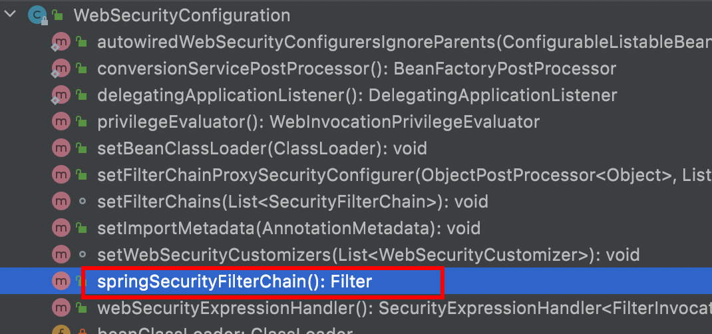
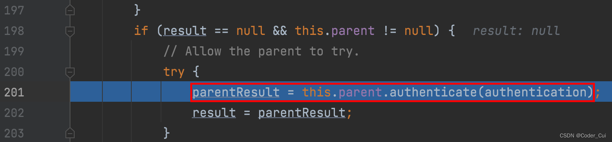
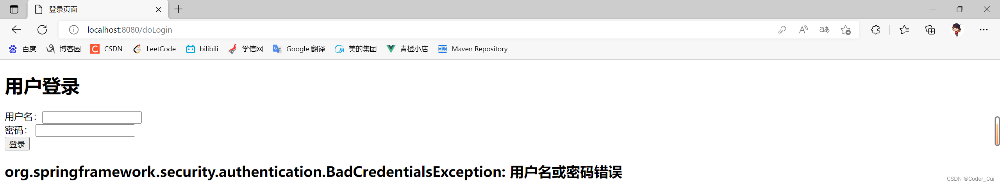
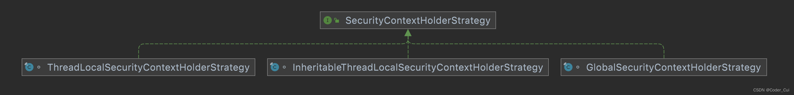
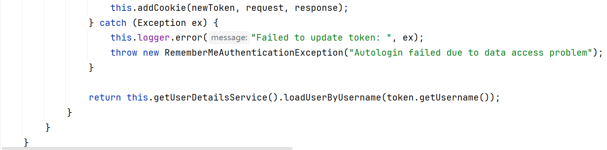

# 基本概念及原理

## 权限管理

基本上涉及到用户参与的系统都要进行权限管理，权限管理属于系统安全的范畴，权限管理实现`对用户访问系统的控制`，按照`安全规则`或者`安全策略`控制用户`可以访问而且只能访问自己被授权的资源`。

权限管理包括用户**身份认证**和**授权**两部分，简称**认证授权**。对于需要访问控制的资源用户首先经过身份认证，认证通过后用户具有该资源的访问权限方可访问。

### 认证

**`身份认证`** ，就是判断一个用户是否为合法用户的处理过程。最常用的简单身份认证方式是系统通过核对用户输入的用户名和口令，看其是否与系统中存储的该用户的用户名和口令一致，来判断用户身份是否正确。对于采用[指纹](http://baike.baidu.com/view/5628.htm)等系统，则出示指纹；对于硬件Key等刷卡系统，则需要刷卡。


### 授权

授权，即访问控制，控制谁能访问哪些资源。主体进行身份认证后需要分配权限方可访问系统的资源，对于某些资源没有权限是无法访问的


### 解决方案

和其他领域不同，在 Java 企业级开发中，安全管理框架非常少，目前比较常见的就是：

- Shiro
  - Shiro 本身是一个老牌的安全管理框架，有着众多的优点，例如轻量、简单、易于集成、可以在JavaSE环境中使用等。不过，在微服务时代，Shiro 就显得力不从心了，在微服务面前和扩展方面，无法充分展示自己的优势。
- 开发者自定义
  - 也有很多公司选择自定义权限，即自己开发权限管理。但是一个系统的安全，不仅仅是登录和权限控制这么简单，我们还要考虑种各样可能存在的网络政击以及防彻策略，从这个角度来说，开发者白己实现安全管理也并非是一件容易的事情，只有大公司才有足够的人力物力去支持这件事情。
- Spring Security
  - Spring Security,作为spring 家族的一员，在和 Spring 家族的其他成员如 Spring Boot Spring Clond等进行整合时，具有其他框架无可比拟的优势，同时对 OAuth2 有着良好的支持，再加上Spring Cloud对 Spring Security的不断加持（如推出 Spring Cloud Security )，让 Spring Securiy 不知不觉中成为微服务项目的首选安全管理方案。


## 整体架构

在的架构设计中，**`认证`**和**`授权`** 是分开的，无论使用什么样的认证方式。都不会影响授权，这是两个独立的存在，这种独立带来的好处之一，就是可以非常方便地整合一些外部的解决方案。


### 认证

#### AuthenticationManager

在Spring Security中认证是由`AuthenticationManager`接口来负责的，接口定义为：

```java
public interface AuthenticationManager { 
    Authentication authenticate(Authentication authentication) 
                                  throws AuthenticationException;
}
```

- 返回 Authentication 表示认证成功
- 返回 AuthenticationException 异常，表示认证失败。

`AuthenticationManager` 主要实现类为 `ProviderManager`，在 `ProviderManager` 中管理了众多 `AuthenticationProvider` 实例。在一次完整的认证流程中，Spring Security 允许存在多个 `AuthenticationProvider` ，用来实现多种认证方式，这些 `AuthenticationProvider` 都是由 `ProviderManager` 进行统一管理的。

#### Authentication

要认证以及认证成功的信息主要是由 Authentication 的实现类进行保存的，其接口定义为：


```java
public interface Authentication extends Principal, Serializable {
    Collection<? extends GrantedAuthority> getAuthorities();
    Object getCredentials();
    Object getDetails();
    Object getPrincipal();
    boolean isAuthenticated();
    void setAuthenticated(boolean isAuthenticated) throws IllegalArgumentException;
}
```

- getAuthorities 获取用户权限信息
- getCredentials 获取用户凭证信息，一般指密码
- getDetails 获取用户详细信息
- getPrincipal 获取用户身份信息，用户名、用户对象等
- isAuthenticated 用户是否认证成功


#### SecurityContextHolder

SecurityContextHolder 用来获取登录之后用户信息。Spring Security 会将登录用户数据保存在 Session 中。但是，为了使用方便,Spring Security在此基础上还做了一些改进，其中最主要的一个变化就是**线程绑定**。当用户登录成功后,Spring Security 会将登录成功的用户信息保存到 SecurityContextHolder 中。SecurityContextHolder 中的数据保存**默认是通过ThreadLocal 来实现**的，使用 ThreadLocal 创建的变量只能被当前线程访问，不能被其他线程访问和修改，也就是用户数据和请求线程绑定在一起。

当登录请求处理完毕后，Spring Security 会将 SecurityContextHolder 中的数据拿出来保存到 Session 中，同时将 SecurityContexHolder 中的数据清空。以后每当有请求到来时，Spring Security 就会先从 Session 中取出用户登录数据，保存到 SecurityContextHolder 中，方便在该请求的后续处理过程中使用，同时在请求结束时将 SecurityContextHolder 中的数据拿出来保存到 Session 中，然后将SecurityContextHolder 中的数据清空。这一策略非常方便用户在 Controller、Service 层以及任何代码中获取当前登录用户数据。


### 授权

当完成认证后，接下米就是授权了。在 Spring Security 的授权体系中，有两个关键接口

#### AccessDecisionManager

>  AccessDecisionManager (访问决策管理器)，用来决定此次访问是否被允许。


#### AccessDecisionVoter

> AccessDecisionVoter (访问决定投票器)，投票器会检查用户是否具备应有的角色，进而投出赞成、反对或者弃权票。


AccesDecisionVoter 和 AccessDecisionManager 都有众多的实现类，在 AccessDecisionManager 中会挨个遍历 AccessDecisionVoter，进而决定是否允许用户访问，因而 AccessDecisionVoter 和 AccessDecisionManager 两者的关系类似于 AuthenticationProvider 和 ProviderManager 的关系。


#### ConfigAttribute

>  ConfigAttribute，用来保存授权时的角色信息


在 Spring Security 中，用户请求一个资源(通常是一个接口或者一个 Java 方法)需要的角色会被封装成一个 ConfigAttribute 对象，在 ConfigAttribute 中只有一个 getAttribute方法，该方法返回一个 String 字符串，就是角色的名称。一般来说，角色名称都带有一个 `ROLE_` 前缀，投票器 AccessDecisionVoter 所做的事情，其实就是**比较用户所具各的角色和请求某个 资源所需的 ConfigAtuibute 之间的关系。**


## 实现原理

### 配置相关

加载默认配置的类**`SpringBootWebSecurityConfiguration`**，这个类是 spring boot 自动配置类，通过这个源码得知，默认情况下对所有请求进行权限控制:

```java
@Configuration(proxyBeanMethods = false)
@ConditionalOnDefaultWebSecurity
@ConditionalOnWebApplication(type = Type.SERVLET)
class SpringBootWebSecurityConfiguration {
    @Bean
    @Order(SecurityProperties.BASIC_AUTH_ORDER)
    SecurityFilterChain defaultSecurityFilterChain(HttpSecurity http) 
    throws Exception {
    //要求所有请求都要认证
    http.authorizeRequests().anyRequest().authenticated()
    .and().formLogin().and().httpBasic();
        return http.build();
    }
}
```


**这就是为什么在引入 Spring Security 中没有任何配置情况下，请求会被拦截的原因！**

通过上面对自动配置分析，我们也能看出默认生效条件为:

```java
class DefaultWebSecurityCondition extends AllNestedConditions {

    DefaultWebSecurityCondition() {
        super(ConfigurationPhase.REGISTER_BEAN);
    }

    @ConditionalOnClass({ SecurityFilterChain.class, HttpSecurity.class })
    static class Classes {

    }

    @ConditionalOnMissingBean({ WebSecurityConfigurerAdapter.class, SecurityFilterChain.class })
    static class Beans {

    }

}
```

- 条件一 classpath中存在 SecurityFilterChain.class, HttpSecurity.class
- 条件二 没有自定义 WebSecurityConfigurerAdapter.class, SecurityFilterChain.class

**结论：**只要我们不自定义配置类(比如WebSecurityConfigurerAdapter) ，条件都是满足的，也就加载默认的配置。否则如果要进行自定义配置，就要继承这个WebSecurityConfigurerAdapter类，通过覆盖类中方法达到修改默认配置的目的。**WebSecurityConfigurerAdapter** 这个类极其重要，Spring Security 核心配置都在这个类中：（虽然也可以覆盖SecurityFilterChain中方法来自定义，但官方更推荐WebSecurityConfigurerAdapter）


### 执行流程（即SecurityFilter的使用情况和调用顺序）

在springsecurity中`认证、授权`等功能都是基于**过滤器**完成的。


Spring Security自己实现了很多filter，然后通过spring框架提供的`DelegatingFilterProxy`，将这些filter整合到web原生的filter中（因为只有原生的filter能拦截web请求）


DelegatingFilterProxy不仅可以管理一个filter，还可以管理一个FilterChainProxy，通过FilterChainProxy来管理SecurityFilterChain


而SecurityFilterChain也可能不止一组，而是多组。可以基于不同路径的请求使用不同的FilterChain


**需要注意的是**，默认过滤器并不是直接放在 Web 项目的原生过滤器链中，而是通过一个 FilterChainProxy 来统一管理。Spring Security 中的过滤器链通过 FilterChainProxy 嵌入到 Web项目的原生过滤器链中。FilterChainProxy 作为一个顶层的管理者，将统一管理 Security Filter。FilterChainProxy 本身是通过 Spring 框架提供的 DelegatingFilterProxy 整合到原生的过滤器链中。


SecurityFilter的使用情况和调用顺序如下

| 过滤器                                          | 过滤器作用                                               | 默认是否加载 |
| ----------------------------------------------- | -------------------------------------------------------- | ------------ |
| ChannelProcessingFilter                         | 过滤请求协议 HTTP 、HTTPS                                | NO           |
| `WebAsyncManagerIntegrationFilter`              | 将 WebAsyncManger 与 SpringSecurity 上下文进行集成       | YES          |
| `SecurityContextPersistenceFilter`              | 在处理请求之前,将安全信息加载到 SecurityContextHolder 中 | YES          |
| `HeaderWriterFilter`                            | 处理头信息加入响应中                                     | YES          |
| CorsFilter                                      | 处理跨域问题                                             | NO           |
| `CsrfFilter`                                    | 处理 CSRF 攻击                                           | YES          |
| `LogoutFilter`                                  | 处理注销登录                                             | YES          |
| OAuth2AuthorizationRequestRedirectFilter        | 处理 OAuth2 认证重定向                                   | NO           |
| Saml2WebSsoAuthenticationRequestFilter          | 处理 SAML 认证                                           | NO           |
| X509AuthenticationFilter                        | 处理 X509 认证                                           | NO           |
| AbstractPreAuthenticatedProcessingFilter        | 处理预认证问题                                           | NO           |
| CasAuthenticationFilter                         | 处理 CAS 单点登录                                        | NO           |
| OAuth2LoginAuthenticationFilter                 | 处理 OAuth2 认证                                         | NO           |
| Saml2WebSsoAuthenticationFilter                 | 处理 SAML 认证                                           | NO           |
| `UsernamePasswordAuthenticationFilter`          | 处理表单登录(formLogin())                                | YES          |
| OpenIDAuthenticationFilter                      | 处理 OpenID 认证                                         | NO           |
| `DefaultLoginPageGeneratingFilter`              | 配置默认登录页面                                         | YES          |
| `DefaultLogoutPageGeneratingFilter`             | 配置默认注销页面                                         | YES          |
| ConcurrentSessionFilter                         | 处理 Session 有效期                                      | NO           |
| DigestAuthenticationFilter                      | 处理 HTTP 摘要认证                                       | NO           |
| BearerTokenAuthenticationFilter                 | 处理 OAuth2 认证的 Access Token                          | NO           |
| `BasicAuthenticationFilter`                     | 处理 HttpBasic 登录                                      | YES          |
| `RequestCacheAwareFilter`                       | 处理请求缓存                                             | YES          |
| `SecurityContextHolder<br />AwareRequestFilter` | 包装原始请求                                             | YES          |
| JaasApiIntegrationFilter                        | 处理 JAAS 认证                                           | NO           |
| RememberMeAuthenticationFilter                  | 处理 RememberMe 登录                                     | NO           |
| `AnonymousAuthenticationFilter`                 | 配置匿名认证                                             | YES          |
| OAuth2AuthorizationCodeGrantFilter              | 处理OAuth2认证中授权码                                   | NO           |
| `SessionManagementFilter`                       | 处理 session 并发问题                                    | YES          |
| `ExceptionTranslationFilter`                    | 处理认证/授权中的异常                                    | YES          |
| `FilterSecurityInterceptor`                     | 处理授权相关                                             | YES          |
| SwitchUserFilter                                | 处理账户切换                                             | NO           |

（其中加代码块的是默认加载的filter）

可以看出，Spring Security 提供了 30 多个过滤器。默认情况下Spring Boot 在对 Spring Security 进入自动化配置时，会创建一个名为 SpringSecurityFilerChain 的过滤器，并注入到 Spring 容器中，这个过滤器将负责所有的安全管理，包括用户认证、授权、重定向到登录页面等。具体可以参考WebSecurityConfiguration的源码:




### 流程分析


这就是spring security**提供默认登录页面的原因。**  


### 默认用户生成

1. 查看 SpringBootWebSecurityConfiguration#defaultSecurityFilterChain 方法表单登录


2. 处理登录为 FormLoginConfigurer 类中 调用 UsernamePasswordAuthenticationFilter这个类实例


3.查看类中 UsernamePasswordAuthenticationFilter#attempAuthentication 方法得知实际调用 AuthenticationManager 中 authenticate 方法 


4. 由于AuthenticationManager 是一个接口，所以实际调用 ProviderManager 类中方法 authenticate 



在ProviderManager 中调用了父类（AuthenticationManager）的authenticate方法，又由于父类是一个接口，所以又调用了本类的authenticate方法

5.第二次调用ProviderManager 类的authenticate方法时，进入了abstractUserDetailsAuthenticationProvider类的authenticate方法。


可以看到此次调用会进入retrieveUser方法，因为此方法在本类中没有定义，所以实际调用的是实现类中重写的方法。

6.调用实现类 DaoAuthenticationProvider 类中retrieveUser方法


可以看到实际根据用户名找到用户是调用了InMemoryUserDetailsManager（默认）的loadUserByUsername方法。也就是说，**此时数据源的存储是在内存中的。**


#### UserDetailService

 通过刚才源码分析也能得知 UserDetailService 是顶层父接口，接口中 loadUserByUsername 方法是用来在认证时进行用户名认证方法，**默认实现使用是内存实现**，如果想要修改数据库实现我们只需要自定义 UserDetailService 实现，最终返回 UserDetails 实例即可。

```java
public interface UserDetailsService {
    UserDetails loadUserByUsername(String username) throws 	          									UsernameNotFoundException;
}
```


#### UserDetailServiceAutoConfigutation

下面来看一下UserDetailService的自动配置源码，这个源码非常多，这里梳理了关键部分：

```java
@Configuration(proxyBeanMethods = false)
@ConditionalOnClass(AuthenticationManager.class)
@ConditionalOnBean(ObjectPostProcessor.class)
@ConditionalOnMissingBean(
    value = { AuthenticationManager.class, AuthenticationProvider.class, UserDetailsService.class,
             AuthenticationManagerResolver.class },
    type = { "org.springframework.security.oauth2.jwt.JwtDecoder",
            "org.springframework.security.oauth2.server.resource.introspection.OpaqueTokenIntrospector",
            "org.springframework.security.oauth2.client.registration.ClientRegistrationRepository" })
public class UserDetailsServiceAutoConfiguration {
    //....
    @Bean
    @Lazy
    public InMemoryUserDetailsManager inMemoryUserDetailsManager(SecurityProperties properties,
                                                                 ObjectProvider<PasswordEncoder> passwordEncoder) {
        SecurityProperties.User user = properties.getUser();
        List<String> roles = user.getRoles();
        return new InMemoryUserDetailsManager(
            User.withUsername(user.getName()).password(getOrDeducePassword(user, passwordEncoder.getIfAvailable()))
            .roles(StringUtils.toStringArray(roles)).build());
    }
    //...
}
```

默认情况下是会满足注解中的条件的，所以Spring Security会提供一个InMemoryUserDetailManager实例。


```java
@ConfigurationProperties(prefix = "spring.security")
public class SecurityProperties {
    private final User user = new User();
    public User getUser() {
        return this.user;
    }
    //....
    public static class User {
        private String name = "user";
        private String password = UUID.randomUUID().toString();
        private List<String> roles = new ArrayList<>();
        private boolean passwordGenerated = true;
        //get set ...
    }
}
```

这就是默认生成 user 以及 uuid 密码过程!

另外看明白源码之后，就知道只要在配置文件中加入如下配置可以对内存中用户和密码进行覆盖。

```properties
 spring.security.user.name=root
 spring.security.user.password=root
 #角色信息
 spring.security.user.roles=admin,users
```

重新启动项目后输入配置文件中的用户名和密码即可正常访问


## 总结

- AuthenticationManager、ProviderManger、以及 AuthenticationProvider 关系：


- **WebSecurityConfigurerAdapter** 扩展 Spring Security 所有默认配置：


- **UserDetailService** 用来修改默认认证的数据源信息


# 自定义认证

## 自定义资源权限规则

在一个应用中，并非所有资源都需要认证授权后登录。因此我们需要自定义资源权限规则。

其中不需要认证授权的叫做**公共资源**，需要的叫做**受限资源**。


假设我们需要实现如下规则

- /index：公共资源
- /hello：受保护资源

```java
@Configuration
public class WebSecurityConfigurer extends WebSecurityConfigurerAdapter {
    @Override
    /**
      * 说明: SpringBoot2.6.2版本
      *    permitAll() 代表放行该资源,该资源为公共资源，无需认证和授权可以直接访问
      *    anyRequest().authenticated() 代表所有请求,必须认证之后才能访问
      *    formLogin() 代表开启表单认证
      * 注意: 放行资源必须放在所有认证请求之前!
      */
    protected void configure(HttpSecurity http) throws Exception {
        http.authorizeHttpRequests()
            .mvcMatchers("/index").permitAll() //放行资源写在任何前面
            .anyRequest().authenticated()
            .and() 
            .formLogin();
    }
}
```

注意：在SpringBoot 2.7.1 中的spring-security-config-5.7.2.RELEASE中已提到WebSecurityConfigurerAdapter已过时被弃用，替代方法如下：

1. 使用 SecurityFilterChain Bean 来配置 HttpSecurity；

2. 使用 WebSecurityCustomizer Bean 来配置 WebSecurity。
   

**替代后新代码为：**

```java
package com.study.config;
import...

    @Configuration
    @EnableWebSecurity //添加security过滤器，此处一定要加入此注解，否则下面的httpSecurity无法装配
    public class WebSecurityConfig {
        /**
      * 说明: SpringBoot2.7.1版本
      *    permitAll() 代表放行该资源,该资源为公共资源，无需认证和授权可以直接访问
      *    anyRequest().authenticated() 代表所有请求,必须认证之后才能访问
      *    formLogin() 代表开启表单认证
      * 注意: 放行资源必须放在所有认证请求之前!
      */
        @Bean
        SecurityFilterChain filterChain(HttpSecurity httpSecurity) throws Exception {
            return httpSecurity
                .authorizeHttpRequests()
                .mvcMatchers("/index").permitAll()
                .anyRequest().authenticated()
                .and().formLogin()
                .and().build();
        }
    }
```

总结：新替代方案中Spring Security 就不需要再去继承WebSecurityConfigurerAdapter，然后重写 configure()方法了，直接通过 filterChain() 方法就能使用 HttpSecurity 来配置相关信息。

重启项目，测试访问index请求时直接放行，访问hello请求时需要登录后才能正常访问！！！


## 自定义登录界面

默认登录页面是由DefaultLoginPageGeneratingFilter生成的。


**pom.xml引入Thymeleaf模板依赖**

```
<!--引入Thymeleaf依赖-->
 <dependency>
     <groupId>org.springframework.boot</groupId>
     <artifactId>spring-boot-starter-thymeleaf</artifactId>
 </dependency>
```

**application.properties配置Thymeleaf**

```
# Thymeleaf配置
 # 关闭缓存
 spring.thymeleaf.cache=false 
 # 默认前缀路径，可不配置
 spring.thymeleaf.prefix=classpath:/templates/
 # 默认文件后缀，可不配置
 spring.thymeleaf.suffix=.html 
```

**定义登录页面LoginController**

```java
package com.study.controller;
import org.springframework.stereotype.Controller;
import org.springframework.web.bind.annotation.RequestMapping;

@Controller
public class LoginController {
    @RequestMapping("/login.html") //注意此处是login.html而不是login
    public String login() {
        return "login";//封装为login.html
    }
}
```

**在 templates 中定义登录界面login.html**

```html
<!DOCTYPE html>
 <html lang="en" xmlns:th="https://www.thymeleaf.org">
 <head>
     <meta charset="UTF-8">
     <title>登录页面</title>
 </head>
 <body>
 <h1>用户登录</h1>
 <form method="post" th:action="@{/doLogin}">
     用户名：<input name="uname" type="text"/><br> <!--此处的name属性可指定其它名称，但需要在配置文件中配置-->
     密码： <input name="pwd" type="password"/><br> <!--此处的name属性可指定其它名称，但需要在配置文件中配置-->
     <input type="submit" value="登录"/>
 </form>
 </body>
 </html>
```

需要注意的是：

- 登录表单 method 必须为 post，action 的请求路径可以定义为 /doLogin

- 用户名的 name 属性为 username，用户名可以指定为除username外的其他名称

- 密码的 name 属性为 password，密码可以指定为除password外的其他名称

**配置 Spring Security 配置类WebSecurityConfigurer**

```java
package com.study.config;
import

    @Configuration
    public class WebSecurityConfigurer extends WebSecurityConfigurerAdapter {
        @Override
        protected void configure(HttpSecurity http) throws Exception {
            http.authorizeRequests()
                .mvcMatchers("/index").permitAll() //放行/index请求
                .mvcMatchers("/login.html").permitAll() //放行/login.html请求
                .anyRequest().authenticated() //其它请求需要登录认证后才能访问
                .and()
                .formLogin() //默认form表单页面登录
                .loginPage("/login.html") //使用自定义登录页面登录页面登录
                .loginProcessingUrl("/doLogin") //使用自定义登录页面时需要重新指定url，对应login.html中的action路径
                .usernameParameter("uname") //重新指定用户名名称，需要与login.html中表单的name相对应
                .passwordParameter("pwd") //重新指定密码名称，需要与login.html中表单的name相对应
                .successForwardUrl("/index") //认证成功后跳转路径，请求转发,地址栏不变
                //.defaultSuccessUrl("/hello") 认证成功后跳转路径,重定向,地址栏改变
                //.defaultSuccessUrl("/hello",true) //第二个参数设置为true时总是跳转，效果同successForwardUrl一致；默认false:会优先跳转之前的请求路径 
                .failureUrl("/login.html") //登录失败后跳转路径
                .and()
                .csrf().disable();//此处先关闭CSRF跨站保护
        }
    }
```

注意：successForwardUrl 、defaultSuccessUrl 这两个方法都可以实现成功之后跳转，其中：

- successForwardUrl 默认使用 forward跳转 注意:不会跳转到之前请求路径

- defaultSuccessUrl 默认使用 redirect 跳转 注意:如果之前请求路径,会优先跳转之前请求路径,可以传入第二个参数进行修改
  

## 自定义登录成功处理

successForwardUrl 和defaultSuccessUrl 适用于传统开发， 有时候页面跳转并不能满足我们，特别是在前后端分离开发中就不需要成功之后跳转页面，只需要给前端返回一个 JSON数据通知登录成功还是失败与否，这个时候可以通过自定义 `AuthenticationSucccessHandler` 实现。

```java
public interface AuthenticationSuccessHandler {
    /**
      * Called when a user has been successfully authenticated.
      * @param request the request which caused the successful authentication
      * @param response the response
      * @param authentication the <tt>Authentication</tt> object which was created during
      * the authentication process.
      */
    void onAuthenticationSuccess(HttpServletRequest request, HttpServletResponse response,
                                 Authentication authentication) throws IOException, ServletException;
}
```

**根据接口的描述信息也可以得知，登录成功后会自动回调这个方法，进一步查看它的默认实现，你会发现successForwardUrl、defaultSuccessUrl也是由它的子类实现的：**


其中successForwardUrl与ForwardAuthenticationSuccessHandler有关。defaultSuccessUrl与SavedRequestAwareAuthenticationSuccessHandler有关。


**实现:**

- **在config包中自定义 AuthenticationSuccessHandler接口实现类MyAuthenticationSuccessHandler**

```java
public class MyAuthenticationSuccessHandler implements AuthenticationSuccessHandler {
    @Override
    public void onAuthenticationSuccess(HttpServletRequest request, HttpServletResponse response, Authentication authentication) throws IOException, ServletException {
        Map<String, Object> result = new HashMap<String, Object>();
        result.put("msg", "登录成功");//打印登录成功信息
        result.put("status", 200);//打印状态码
        result.put("authentication", authentication);//打印认证信息
        response.setContentType("application/json;charset=UTF-8");//设置响应类型
        String s = new ObjectMapper().writeValueAsString(result);//json格式转字符串
        response.getWriter().println(s);//打印json格式数据
    }
}
```

- **在WebSecurityConfigurer中配置MyAuthenticationSuccessHandler**

```java
@Configuration
public class WebSecurityConfigurer extends WebSecurityConfigurerAdapter {
    @Override
    protected void configure(HttpSecurity http) throws Exception {
        ......
            //.successForwardUrl("/index")
            //.defaultSuccessUrl("/hello") 
            //.defaultSuccessUrl("/hello",true) 
            .successHandler(new MyAuthenticationSuccessHandler())//认证成功时处理，前后端分离解决方案
            .and()
            .csrf().disable();//此处先关闭CSRF跨站保护
    }
}
```


## 显示登录失败信息

为了能更直观地在登录页面看到异常错误信息，可以在登录页面中直接获取异常信息。Spring Security 在登录失败之后会将异常信息存储到 request(forward) 或session(redirect)中key为 SPRING_SECURITY_LAST_EXCEPTION 命名属性中，源码可以参考 SimpleUrlAuthenticationFailureHandler 


**login.html中添加显示异常信息代码**

```html
<!DOCTYPE html>
 <html lang="en" xmlns:th="https://www.thymeleaf.org">
 <head>
     <meta charset="UTF-8">
     <title>登录页面</title>
 </head>
 <body>
 <h1>用户登录</h1>
 ...
 <h2>
     <!--    <div th:text="${SPRING_SECURITY_LAST_EXCEPTION}"></div>--><!--request作用域：forward跳转-->
     <div th:text="${session.SPRING_SECURITY_LAST_EXCEPTION}"></div><!--session作用域：redirect跳转-->
 </h2>
 </body>
 </html>
```

添加了h2标签中的代码，获取异常信息

**WebSecurityConfigurer配置登录失败处理**

```java
@Configuration
public class WebSecurityConfigurer extends WebSecurityConfigurerAdapter {
    @Override
    protected void configure(HttpSecurity http) throws Exception {
        http.authorizeRequests()
            .......
            .successHandler(new MyAuthenticationSuccessHandler())
            //.failureForwardUrl("/login.html")//认证失败之后，forward跳转
            .failureUrl("/login.html") //默认认证失败之后，redirect跳转
            .and()
            .csrf().disable();//此处先关闭CSRF跨站保护
    }
}
```

注意：failureUrl、failureForwardUrl 关系类似于之前提到的 successForwardUrl 、defaultSuccessUrl 方法

- failureUrl：失败以后的重定向跳转(默认)

- failureForwardUrl：失败以后的 forward 跳转

注意:因此获取 request 中异常信息,这里只能使用failureForwardUrl


启动项目，测试路径：http://localhost:8080/hello，输入错误的用户名和密码时会输出如下错误信息，注意login.html与WebSecurityConfigurer对failureForwardUrl或failureUrl的配置一致：

**（1）failureForwardUrl：forward跳转，request作用域**


**（2）failureUrl：redirect跳转，session作用域**


## 自定义登陆失败处理

和自定义登录成功处理一样，Spring Security 同样为前后端分离开发提供了登录失败的处理，这个类就是 AuthenticationFailureHandler，源码为：

```java
public interface AuthenticationFailureHandler {
    ​
        /**
      * Called when an authentication attempt fails.
      * @param request the request during which the authentication attempt occurred.
      * @param response the response.
      * @param exception the exception which was thrown to reject the authentication
      * request.
      */
        void onAuthenticationFailure(HttpServletRequest request, HttpServletResponse response,
                                     AuthenticationException exception) throws IOException, ServletException;
    ​
}
```

**根据接口的描述信息,也可以得知登录失败会自动回调这个方法，进一步查看它的默认实现，你会发现failureUrl、failureForwardUrl也是由它的子类实现的。**


自定义：

- **config包中自定义 AuthenticationFailureHandler接口实现类MyAuthenticationFailureHandler**

```java
public class MyAuthenticationFailureHandler implements AuthenticationFailureHandler {
    @Override
    public void onAuthenticationFailure(HttpServletRequest request, HttpServletResponse response, AuthenticationException exception) throws IOException, ServletException {
        Map<String, Object> result = new HashMap<String, Object>();
        result.put("msg", "登录失败：" + exception.getMessage());
        result.put("status", 500);
        response.setContentType("application/json;charset=UTF-8");
        String s = new ObjectMapper().writeValueAsString(result);
        response.getWriter().println(s);
    }
}
```

- **WebSecurityConfigurer配置MyAuthenticationFailureHandler**

```java
@Configuration
public class WebSecurityConfigurer extends WebSecurityConfigurerAdapter {
    @Override
    protected void configure(HttpSecurity http) throws Exception {
        http.authorizeRequests()
            .......
            //.failureForwardUrl("/login.html")
            //.failureUrl("/login.html") 
            .failureHandler(new MyAuthenticationFailureHandler())//认证失败时处理，前后端解决方案
            .and()
            .csrf().disable();//此处先关闭CSRF跨站保护
    }
}
```


## 注销登录

Spring Security 中也提供了默认的注销登录配置，在开发时也可以按照自己需求对注销进行个性化定制。

**开启注销登录（默认开启）**

```java
@Configuration
public class WebSecurityConfigurer extends WebSecurityConfigurerAdapter {
    @Override
    protected void configure(HttpSecurity http) throws Exception {
        http.authorizeRequests()
            .......
            .failureHandler(new MyAuthenticationFailureHandler())//认证失败时处理，前后端解决方案
            .and()
            .logout()
            .logoutUrl("/logout")//指定注销登录URL
            .invalidateHttpSession(true)//默认开启会话失效
            .clearAuthentication(true)//默认清除认证标志
            .logoutSuccessUrl("/login.html")//注销登录成功后跳转的页面
            .and()
            .csrf().disable();//此处先关闭CSRF跨站保护
    }
}
```

- 通过 logout() 方法开启注销配置（默认开启）

- logoutUrl 指定退出登录请求地址，默认路径为 /logout

- invalidateHttpSession 退出时是否使session 失效，默认值为 true

- clearAuthentication 退出时是否清除认证信息，默认值为 true

- logoutSuccessUrl 退出登录时跳转地址
  


**配置多个注销登录请求**

如果项目中有需要，开发者还可以配置多个注销登录的请求，同时还可以指定请求的方式：

```java
@Configuration
public class WebSecurityConfigurer extends WebSecurityConfigurerAdapter {
    @Override
    protected void configure(HttpSecurity http) throws Exception {
        http.authorizeRequests()
            .......
            .failureHandler(new MyAuthenticationFailureHandler())//认证失败时处理，前后端解决方案
            .and()
            .logout()
            .logoutRequestMatcher(new OrRequestMatcher(
                new AntPathRequestMatcher("/aaa", "GET"),
                new AntPathRequestMatcher("/bbb", "POST")
            ))
            .invalidateHttpSession(true)//默认开启会话失效
            .clearAuthentication(true)//默认清除认证标志
            .logoutSuccessUrl("/login.html")//注销登录成功后跳转的页面
            .and()
            .csrf().disable();//此处先关闭CSRF跨站保护
    }
}
```

注意：

- GET请求直接在地址栏访问，注销登录路径：http://localhost:8080/aaa

- POST方式需要新建表单及对应的Controller，注销登录路径：http://localhost:8080/logout.html

  - logout.html:

    ```html
    <!DOCTYPE html>
     <html lang="en" xmlns:th="https://www.thymeleaf.org">
     <head>
         <meta charset="UTF-8">
         <title>注销页面</title>
     </head>
     <body>
     <h1>用户注销</h1>
     <form method="post" th:action="@{/bbb}">
         <input type="submit" value="注销登录"/>
     </form>
     </body>
     </html>
    ```

  - LogoutController

    ```java
    @Controller
    public class LogoutController {
        @RequestMapping("logout.html")
        public String logout() {
            return "logout";
        }
    }
    ```

    

**前后端分离注销登录配置**

如果是前后端分离开发，注销成功之后就不需要页面跳转了，只需要将注销成功的信息返回前端即可，此时我们可以通过自定义 LogoutSuccessHandler 实现来返回注销之后信息：

- **编写LogoutSuccessHandler接口实现类MyLogoutSuccessHandler**

```java
public class MyLogoutSuccessHandler implements LogoutSuccessHandler {
    @Override
    public void onLogoutSuccess(HttpServletRequest request, HttpServletResponse response, Authentication authentication) throws IOException, ServletException {
        Map<String, Object> result = new HashMap<String, Object>();
        result.put("msg", "注销成功，当前认证对象为：" + authentication);//打印认证信息
        result.put("status", 200);//打印状态码
        response.setContentType("application/json;charset=UTF-8");//设置响应类型
        String s = new ObjectMapper().writeValueAsString(result);//json格式转字符串
        response.getWriter().println(s);//打印json格式数据
    }
}
```

- **WebSecurityConfigurer配置MyLogoutSuccessHandler**

```JAVA
@Configuration
public class WebSecurityConfigurer extends WebSecurityConfigurerAdapter {
    @Override
    protected void configure(HttpSecurity http) throws Exception {
        http.authorizeRequests()
            .......
            .failureHandler(new MyAuthenticationFailureHandler())//认证失败时处理，前后端解决方案
            .and()
            .logout()
            //.logoutUrl("/logout")//指定注销登录URL，默认请求方式必须为GET
            .logoutRequestMatcher(new OrRequestMatcher(
                new AntPathRequestMatcher("/aaa", "GET"),
                new AntPathRequestMatcher("/bbb", "POST")
            ))
            .invalidateHttpSession(true)//默认开启会话失效
            .clearAuthentication(true)//默认清除认证标志
            //.logoutSuccessUrl("/login.html")//注销登录成功后跳转的页面
            .logoutSuccessHandler(new MyLogoutSuccessHandler())
            .and()
            .csrf().disable();//此处先关闭CSRF跨站保护
    }
}
```


## 登录用户数据获取

### SecurityContextHolder

 Spring Security 会将登录用户数据保存在 Session 中，但是，为了使用方便，Spring Security在此基础上还做了一些改进，其中最主要的一个变化就是**线程绑定**：当用户登录成功后，Spring Security 会将登录成功的用户信息保存到 SecurityContextHolder 中。

SecurityContextHolder 中的数据保存默认是通过ThreadLocal 来实现的，使用 ThreadLocal 创建的变量只能被当前线程访问，不能被其他线程访问和修改，也就是用户数据和请求线程绑定在一起。**当登录请求处理完毕后，Spring Security 会将 SecurityContextHolder 中的数据拿出来保存到 Session 中，同时将 SecurityContexHolder 中的数据清空**。以后每当有请求到来时，Spring Security 就会先从 Session 中取出用户登录数据，保存到SecurityContextHolder 中，方便在该请求的后续处理过程中使用，同时在请求结束时将 SecurityContextHolder 中的数据拿出来保存到 Session 中，然后将SecurityContextHolder 中的数据清空。

 

**实际上 SecurityContextHolder 中存储是 SecurityContext，在 SecurityContext 中存储是 Authentication。**


**这种设计是典型的策略设计模式：**

```java
public class SecurityContextHolder {
    public static final String MODE_THREADLOCAL = "MODE_THREADLOCAL";
    public static final String MODE_INHERITABLETHREADLOCAL = "MODE_INHERITABLETHREADLOCAL";
    public static final String MODE_GLOBAL = "MODE_GLOBAL";
    private static final String MODE_PRE_INITIALIZED = "MODE_PRE_INITIALIZED";
    private static SecurityContextHolderStrategy strategy;
    //....
    private static void initializeStrategy() {
        if (MODE_PRE_INITIALIZED.equals(strategyName)) {
            Assert.state(strategy != null, "When using " + MODE_PRE_INITIALIZED
                         + ", setContextHolderStrategy must be called with the fully constructed strategy");
            return;
        }
        if (!StringUtils.hasText(strategyName)) {
            // Set default
            strategyName = MODE_THREADLOCAL;
        }
        if (strategyName.equals(MODE_THREADLOCAL)) {
            strategy = new ThreadLocalSecurityContextHolderStrategy();
            return;
        }
        if (strategyName.equals(MODE_INHERITABLETHREADLOCAL)) {
            strategy = new InheritableThreadLocalSecurityContextHolderStrategy();
            return;
        }
        if (strategyName.equals(MODE_GLOBAL)) {
            strategy = new GlobalSecurityContextHolderStrategy();
            return;
        }
        //.....
    }
}
```

**三种策略详细解释：**（虽然有四个，但只要关注这三个就可以了）

1. `MODE THREADLOCAL`：这种存放策略是将 SecurityContext 存放在 ThreadLocal中，大家知道 Threadlocal 的特点是在哪个线程中存储就要在哪个线程中读取，这其实非常适合 web 应用，因为在**默认情况下，一个请求无论经过多少 Filter 到达 Servlet，都是由一个线程来处理的**，**这也是 SecurityContextHolder 的默认存储策略**，这种存储策略意味着如果在具体的业务处理代码中，开启了子线程，在子线程中去获取登录用户数据，就会获取不到。

2. `MODE INHERITABLETHREADLOCAL`：这种存储模式适用于多线程环境，如果希望在子线程中也能够获取到登录用户数据，那么就可以使用这种存储模式，使用时需要在VM Options单独进行配置（实际上是将父线程的用户数据复制一份到子线程）。

3. `MODE GLOBAL`：这种存储模式实际上是将数据保存在一个静态变量中，在 JavaWeb开发中，这种模式很少使用到（了解即可）。


### SecurityContextHolderStrategy

通过 SecurityContextHolder 可以得知，SecurityContextHolderStrategy 接口用来定义存储策略方法：

```java
public interface SecurityContextHolderStrategy {
    void clearContext();
    SecurityContext getContext();
    void setContext(SecurityContext context);
    SecurityContext createEmptyContext();
}
```

接口中一共定义了四个方法：

- clearContext：该方法用来清除存储的 SecurityContext对象。

- getContext：该方法用来获取存储的 SecurityContext 对象。

- setContext：该方法用来设置存储的 SecurityContext 对象。

- createEmptyContext：该方法则用来创建一个空的 SecurityContext 对象。



**从上面可以看出每一个实现类对应一种策略的实现。**


### 代码中获取认证之后的用户数据

```java
@RestController
public class HelloController {
    @RequestMapping("/hello")
    public String hello() {
        System.out.println("Hello Spring Security!");
        Authentication authentication = SecurityContextHolder.getContext().getAuthentication();//获得认证信息
        System.out.println("authentication.getName() = " + authentication.getName());
        System.out.println("authentication.getAuthorities() = " + authentication.getAuthorities());
        System.out.println("authentication.getCredentials() = " + authentication.getCredentials());
        System.out.println("authentication.getDetails() = " + authentication.getDetails());
        System.out.println("authentication.getPrincipal() = " + authentication.getPrincipal());
        ​
            User principal = (User) authentication.getPrincipal();//返回值类型为User时需要进行强制转换 org.springframework.security.core.userdetails.User
        System.out.println("principal.getUsername() = " + principal.getUsername());
        System.out.println("principal.getPassword() = " + principal.getPassword());
        System.out.println("principal.getAuthorities() = " + principal.getAuthorities());
        return "hello spring security!";
    }
}
```


### 多线程情况下获取用户数据

```java
@RestController
public class HelloController {
    @RequestMapping("/hello")
    public String hello() {
        System.out.println("Hello Spring Security!");
        new Thread(() -> {
            Authentication Authentication = SecurityContextHolder.getContext().getAuthentication();
            User childPrincipal = (User) Authentication.getPrincipal();
            System.out.println("Principal.getUsername() = " + Principal.getUsername());
            System.out.println("Principal.getPassword() = " + Principal.getPassword());
            System.out.println("Principal.getAuthorities() = " + Principal.getAuthorities());
        }).start();
        return "hello spring security!";
    }
}
```

**启动服务，访问：http://localhost:8080/hello，获得认证之后的用户数据。**

报错。

**从上面可以看到默认策略，是无法在子线程中获取用户信息，如果需要在子线程中获取必须使用第二种策略，默认策略是通过 System.getProperty 加载的，因此我们可以通过增加 VM Options 参数进行修改。**

`-Dspring.security.strategy=MODE_INHERITABLETHREADLOCAL`


## 自定义认证数据源

### 流程分析


- 发起认证请求，请求中携带用户名、密码，该请求会被UsernamePasswordAuthenticationFilter 拦截

- 在UsernamePasswordAuthenticationFilter的attemptAuthentication方法中将请求中用户名和密码，封装为Authentication对象，并交给AuthenticationManager 进行认证

- 认证成功，将认证信息存储到 SecurityContextHodler 以及调用记住我等，并回调 AuthenticationSuccessHandler 处理

- 认证失败，清除 SecurityContextHodler 以及 记住我中信息，回调 AuthenticationFailureHandler 处理


### AuthenticationManager、ProviderManager 、AuthenticationProvider三者关系

从上面分析中得知，AuthenticationManager 是认证的核心类，但实际上在底层真正认证时还离不开 ProviderManager 以及 AuthenticationProvider 。他们三者关系是样的呢？

- AuthenticationManager：是一个认证管理器，它定义了 Spring Security 过滤器要执行认证操作。

- ProviderManager：AuthenticationManager接口的实现类，Spring Security 认证时默认使用就是的 ProviderManager。

- AuthenticationProvider：就是针对不同的身份类型执行的具体的身份认证。
  


**1）AuthenticationManager 与 ProviderManager**：父子关系


ProviderManager 是 AuthenticationManager 的唯一实现（其它实现要么是私有的，要么是静态的，不能被使用），也是 Spring Security 默认使用的实现。从这里不难看出，默认情况下AuthenticationManager 就是一个ProviderManager。

**（2）ProviderManager 与 AuthenticationProvider**


在 Spring Security 中，允许系统同时支持多种不同的认证方式，例如同时支持用户名/密码认证、RememberMe 认证、手机号码动态认证等，而**不同的认证方式对应了不同的 AuthenticationProvider**，所以一个完整的认证流程可能由多个 AuthenticationProvider 来提供。

多个 AuthenticationProvider 将组成一个列表，这个列表将由 ProviderManager 代理。换句话说，在**ProviderManager 中存在一个 AuthenticationProvider 列表**，在Provider Manager 中遍历列表中的每一个 AuthenticationProvider 去执行身份认证（只要有一个能进行身份认证就行），最终得到认证结果。

   ProviderManager 本身也可以再配置一个 AuthenticationManager 作为 parent，这样当ProviderManager 认证失败之后，就可以进入到 parent 中再次进行认证。理论上来说，ProviderManager 的 parent 可以是任意类型的 AuthenticationManager，但是通常都是由ProviderManager 来扮演 parent 的角色，也就是 ProviderManager 是 ProviderManager 的 parent。

   **ProviderManager 本身也可以有多个，多个ProviderManager 共用同一个 parent**。有时，一个应用程序有受保护资源的逻辑组（例如，所有符合路径模式的网络资源，如/api/），**每个组可以有自己的专用 AuthenticationManager。通常，每个组都是一个ProviderManager，**它们共享一个父级。然后，父级ProviderManager是一种 全局资源，作为所有提供者的后备资源。

   根据上面的介绍，我们绘出新的 AuthenticationManager、ProvideManager 和 AuthentictionProvider 关系：


弄清楚认证原理之后我们来看下具体认证时数据源的获取:默认情况下，AuthenticationProvider是由DaoAuthenticationProvider类来实现认证的，在DaoAuthenticationProvider认证时又通过UserDetailsService(默认InMemoryUserDetailManager)完成数据源的校验。他们之间调用关系如下：


总结: AuthenticationManager 是认证管理器，在 Spring Security 中有全局AuthenticationManager，也可以有局部AuthenticationManager。全局的AuthenticationManager用来对全局认证进行处理，局部的AuthenticationManager用来对某些特殊资源认证处理。当然无论是全局认证管理器还是局部认证管理器都是由 ProviderManger 进行实现。 每一个ProviderManger中都代理一个AuthenticationProvider的列表，列表中每一个实现代表一种身份认证方式，认证时底层数据源需要调用 UserDetailService 来实现。


**如果需要自定义数据源，那么就要给全局的ProviderManager配置一个自定义的UserDetailService**


### 配置全局 AuthenticationManager

两种方式：

- 对springboot自动配置的AuthenticationManager进行修改

```java
@Bean
public UserDetailsService userDetailsService(){
    InmemoryUserDetailsManager userDetailsService=new InmemoryUserDetailsManager();
    userDetailsService.createUser(User.withUsername("aaa").password("{noop}123").roles("admin").build());
    return userDetailsService;
}
```

1. 只需要创建一个UserDetailsService的Bean，springboot会自动用它将默认AuthenticationManager中的UserDetailsService覆盖
2. 可以在任何位置进行注入


- 自定义(推荐)

```java
@Configuration
public class WebSecurityConfigurer extends WebSecurityConfigurerAdapter {
    @Bean
    public UserDetailsService userDetailsService(){
        InmemoryUserDetailsManager userDetailsService=new InmemoryUserDetailsManager();
        userDetailsService.createUser(User.withUsername("aaa").password("{noop}123").roles("admin").build());
        return userDetailsService;
    }

    //1.自定义AuthenticationManager  推荐使用这种方式，而不是直接使用默认自动配置的，但这种方式并没有在工厂中暴露出来
    @Override
    public void configure(AuthenticationManagerBuilder builder) throws Exception {
        System.out.println("自定义AuthenticationManager: " + builder);
        builder.userDetailsService(userDetailsService());
    }

    //作用: 用来将自定义AuthenticationManager在工厂中进行暴露,使其可以在任何位置注入
    @Override
    @Bean //记得加上此注解，将对象注入工厂
    public AuthenticationManager authenticationManagerBean() throws Exception {
        return super.authenticationManagerBean();
    }
}
```

一旦通过 configure 方法自定义AuthenticationManager的实现

1. 就会将工厂中自动配置的AuthenticationManager进行覆盖；

2. 需要在实现中指定认证数据源对象UserDetaiService实例；

3. 这种方式创建的AuthenticationManager对象是工厂内部本地的一个 AuthenticationManager对象，不允许在其他自定义组件中进行注入。（相当于是new的一个对象）如果需要进行注入，那么需要重写authenticationManagerBean方法（如上）
   


(这里上面所说的工厂是指AuthenticationManagerBuilder)


### 自定义内存数据源

**通过上面分析可以重点在于UserDetailsService，查看UserDetailsService接口如下：**

```java
public interface UserDetailsService {
    UserDetails loadUserByUsername(String username) throws UsernameNotFoundException;
}
```

**里面只有一个要实现的方法loadUserByUsername，返回类型为UserDetails，查看UserDetails定义如下：**

```java
public interface UserDetails extends Serializable {
    Collection<? extends GrantedAuthority> getAuthorities();
    String getPassword();
    String getUsername();
    boolean isAccountNonExpired();
    boolean isAccountNonLocked();
    boolean isCredentialsNonExpired();
    boolean isEnabled();
}
```

**通过在UserDetails上Ctrl+H可以在右侧查看其实现类User：**


**主要关注User的几个成员变量：**

```java
private String password;
private final String username;
private final Set<GrantedAuthority> authorities;
private final boolean accountNonExpired;
private final boolean accountNonLocked;
private final boolean credentialsNonExpired;
private final boolean enabled;
```


使用：

```java
@Configuration
public class WebSecurityConfigurer extends WebSecurityConfigurerAdapter {

    @Bean
    public UserDetailsService userDetailsService(){
        InMemoryUserDetailsManager inMemoryUserDetailsManager
            = new InMemoryUserDetailsManager();
        UserDetails u1 = User.withUsername("zhangs")
            .password("{noop}111").roles("USER").build();
        inMemoryUserDetailsManager.createUser(u1);
        return inMemoryUserDetailsManager;
    }

    @Override
    protected void configure(AuthenticationManagerBuilder auth) 
        throws Exception {
        auth.userDetailsService(userDetailsService());
    }   
}
```


### 自定义数据库数据源

设计表结构

```sql
-- 用户表 共有多个用户
 CREATE TABLE `user`
 (
     `id`                    int(11) NOT NULL AUTO_INCREMENT,
     `username`              varchar(32)  DEFAULT NULL,
     `password`              varchar(255) DEFAULT NULL,
     `enabled`               tinyint(1) DEFAULT NULL,
     `accountNonExpired`     tinyint(1) DEFAULT NULL,
     `accountNonLocked`      tinyint(1) DEFAULT NULL,
     `credentialsNonExpired` tinyint(1) DEFAULT NULL,
     PRIMARY KEY (`id`)
 ) ENGINE=InnoDB AUTO_INCREMENT=4 DEFAULT CHARSET=utf8;
 ​
 -- 角色表 共有多个角色，其中，_zh表示中文
 CREATE TABLE `role`
 (
     `id`      int(11) NOT NULL AUTO_INCREMENT,
     `name`    varchar(32) DEFAULT NULL,
     `name_zh` varchar(32) DEFAULT NULL,
     PRIMARY KEY (`id`)
 ) ENGINE=InnoDB AUTO_INCREMENT=4 DEFAULT CHARSET=utf8;

 -- 用户角色关系表：用户与角色为多对多关系，需要建立中间表
 CREATE TABLE `user_role`
 (
     `id`  int(11) NOT NULL AUTO_INCREMENT,
     `uid` int(11) DEFAULT NULL,
     `rid` int(11) DEFAULT NULL,
     PRIMARY KEY (`id`),
     KEY   `uid` (`uid`),
     KEY   `rid` (`rid`)
 ) ENGINE=InnoDB AUTO_INCREMENT=5 DEFAULT CHARSET=utf8;
```

**插入测试数据**

```sql
-- 插入用户数据
 BEGIN;
   INSERT INTO `user`
   VALUES (1, 'root', '{noop}123', 1, 1, 1, 1);
   INSERT INTO `user`
   VALUES (2, 'admin', '{noop}123', 1, 1, 1, 1);
   INSERT INTO `user`
   VALUES (3, 'blr', '{noop}123', 1, 1, 1, 1);
 COMMIT;
 ​
 -- 插入角色数据 授权时ROLE_进行处理，RBAC
 BEGIN;
   INSERT INTO `role`
   VALUES (1, 'ROLE_product', '商品管理员');
   INSERT INTO `role`
   VALUES (2, 'ROLE_admin', '系统管理员');
   INSERT INTO `role`
   VALUES (3, 'ROLE_user', '用户管理员');
 COMMIT;
 ​
 -- 插入用户角色数据
 BEGIN;
   INSERT INTO `user_role`
   VALUES (1, 1, 1);
   INSERT INTO `user_role`
   VALUES (2, 1, 2);
   INSERT INTO `user_role`
   VALUES (3, 2, 2);
   INSERT INTO `user_role`
   VALUES (4, 3, 3);
 COMMIT;
```


**接下来进行SpringBoot整合mybatis**

- **项目的pom.xml中引入依赖**

```xml
<!--引入数据源-->
 <dependency>
     <groupId>com.alibaba</groupId>
     <artifactId>druid</artifactId>
     <version>1.2.7</version>
 </dependency>
 ​
 <!--引入mysql-->
 <dependency>
     <groupId>mysql</groupId>
     <artifactId>mysql-connector-java</artifactId>
     <version>5.1.38</version>
 </dependency>
 ​
 <!--引入mybatis-->
 <dependency>
     <groupId>org.mybatis.spring.boot</groupId>
     <artifactId>mybatis-spring-boot-starter</artifactId>
     <version>2.2.0</version>
 </dependency>
```

**application.properties进行数据源、mybatis、日志配置**

```properties
# datasource：类型、驱动名、用户名、密码
 spring.datasource.type=com.alibaba.druid.pool.DruidDataSource
 spring.datasource.driver-class-name=com.mysql.jdbc.Driver
 spring.datasource.url=jdbc:mysql://localhost:3306/security?characterEncoding=UTF-8&useSSL=false
 spring.datasource.username=root
 spring.datasource.password=root
 ​
 # mybatis配置mapper文件的位置和别名设置
 # 注意mapper目录（包）新建时必须使用"/"，而不是.
 mybatis.mapper-locations=classpath:com/study/mapper/*.xml
 mybatis.type-aliases-package=com.study.entity
 ​
 # log:为了显示mybatis运行SQL语句
 logging.level.com.study=debug
```

创建 entity实体类包

创建User 对象

```java
import
    //@Description 用户类，对应表user，为了与UserDetails中的User对应，此处进行实现
    public class User implements UserDetails {
        private Integer id;
        private String username;
        private String password;
        private Boolean enabled;
        private Boolean accountNonExpired;
        private Boolean accountNonLocked;
        private Boolean credentialsNonExpired;
        private List<Role> roles = new ArrayList<>();//关系属性，用来存储当前用户所有角色信息

        //返回权限信息
        @Override
        public Collection<? extends GrantedAuthority> getAuthorities() {
            Set<SimpleGrantedAuthority> authorities = new HashSet<>();
            roles.forEach(role -> {
                SimpleGrantedAuthority simpleGrantedAuthority = new SimpleGrantedAuthority(role.getName());
                authorities.add(simpleGrantedAuthority);
            });
            return authorities;
        }

        //getter/setter
    }
```

**创建 Role 对象**

```java
public class Role {
    private Integer id;
    private String name;
    private String nameZh;
}
```


**创建 UserDao 接口**

```java
@Mapper
public interface UserDao {
    //根据用户名查找用户
    User loadUserByUsername(String username);
    ​
    //根据用户id查询一个角色，注意一个用户可能不止一种角色
    List<Role> getRolesByUid(Integer uid);
}
```

**创建 UserMapper 实现**

```xml
<?xml version="1.0" encoding="UTF-8"?>
<!DOCTYPE mapper
    PUBLIC "-//mybatis.org//DTD Mapper 3.0//EN"
    "http://mybatis.org/dtd/mybatis-3-mapper.dtd" >
​
<mapper namespace="com.study.dao.UserDao">
    <!--loadUserByUsername-->
    <select id="loadUserByUsername" resultType="User">
        select id,
        username,
        password,
        enabled,
        accountNonExpired,
        accountNonLocked,
        credentialsNonExpired
        from user
        where username = #{username}
    </select>
    ​
    <!--getRolesByUid
    需要将角色表和用户-角色表进行关联查询，查询条件为role.id=user_role.uid
    其中，uid是外界传入的参数
    -->
    <select id="getRolesByUid" resultType="Role">
        select r.id,
        r.name,
        r.name_zh nameZh
        from role r,
        user_role ur
        where r.id = ur.rid
        and ur.uid = #{uid}
    </select>
</mapper>
```

**创建 UserDetailService 实例**

```java
@Service
public class MyUserDetailsService implements UserDetailsService {
    private UserDao userDao;
    ​
        @Autowired
        public MyUserDetailsService(UserDao userDao) {
        this.userDao = userDao;
    }
    ​
        @Override
        public UserDetails loadUserByUsername(String username) throws UsernameNotFoundException {
        //1.查询用户
        User user = userDao.loadUserByUsername(username);
        if (ObjectUtils.isEmpty(user))
            throw new RuntimeException("用户不存在");
        //2.查询权限信息
        List<Role> roles = userDao.getRolesByUid(user.getId());
        user.setRoles(roles);
        return user;
    }
}
```

**配置 authenticationManager 使用自定义UserDetailService**

```java
@Configuration
public class WebSecurityConfigurer extends WebSecurityConfigurerAdapter {

    private final UserDetailsService userDetailsService;
    ​
        @Autowired
        public WebSecurityConfigurer(UserDetailsService userDetailsService) {
        this.userDetailsService = userDetailsService;
    }
    ​
        @Override
        protected void configure(AuthenticationManagerBuilder builder) throws Exception {
        builder.userDetailsService(userDetailsService);
    }


    @Override
    protected void configure(HttpSecurity http) throws Exception {
        //web security..
    }
}
```


# 密码加密

## 常见加密方案

- Hash 算法
         最早我们使用类似 SHA-256 、SHA-512 、MD5等这样的单向 Hash 算法。用户注册成功后，保存在数据库中不再是用户的明文密码，而是经过 SHA-256 加密计算的一个字符串，当用户进行登录时，用户输入的明文密码用 SHA-256 进行加密，加密完成之后，再和存储在数据库中的密码进行比对，进而确定用户登录信息是否有效。如果系统遭遇攻击，最多也只是存储在数据库中的密文被泄漏（相同密码加密多次后结果均一致）。

       这样就绝对安全了吗？由于彩虹表这种攻击方式的存在以及随着计算机硬件的发展，每秒执行数十亿次HASH计算己经变得轻轻松松，这意味着即使给密码加密加盐也不再安全。


- 单向自适应函数
         在Spring Security 中，我们现在是用一种自适应单向函数 (Adaptive One-way Functions)来处理密码问题，这种自适应单向函数在进行密码匹配时，**会有意占用大量系统资源（例如CPU、内存等），这样可以增加恶意用户攻击系统的难度**。在Spring Securiy 中，开发者可以通过 bcrypt、PBKDF2、sCrypt 以及 argon2 来体验这种自适应单向函数加密。由于自适应单向函数有意占用大量系统资源，因此每个登录认证请求都会大大降低应用程序的性能，但是 Spring Secuity 不会采取任何措施来提高密码验证速度，因为它正是通过这种方式来增强系统的安全性（每次密码加密后结果均不一致）。

  -  BCryptPasswordEncoder**（首推+默认）**
           BCryptPasswordEncoder 使用 bcrypt 算法对密码进行加密，为了提高密码的安全性，bcrypt算法故意降低运行速度，以增强密码破解的难度。同时 BCryptPasswordEncoder 为自己带盐，开发者不需要额外维护一个“盐” 字段，使用 BCryptPasswordEncoder 加密后的字符串就已经“带盐”了，即使相同的明文每次生成的加密字符串都不相同。
  - Argon2PasswordEncoder
           Argon2PasswordEncoder 使用 Argon2 算法对密码进行加密，Argon2 曾在 Password Hashing Competition 竞赛中获胜。为了解决在定制硬件上密码容易被破解的问题，Argon2也是故意降低运算速度，同时需要大量内存，以确保系统的安全性。

  - Pbkdf2PasswordEncoder
           Pbkdf2PasswordEncoder 使用 PBKDF2 算法对密码进行加密，和前面几种类似，PBKDF2算法也是一种故意降低运算速度的算法，当需要 FIPS (Federal Information Processing Standard，美国联邦信息处理标准）认证时，PBKDF2 算法是一个很好的选择。

  - SCryptPasswordEncoder
           SCryptPasswordEncoder 使用scrypt 算法对密码进行加密，和前面的几种类似，scrypt 也是一种故意降低运算速度的算法，而且需要大量内存。


## PasswordEncoder

在【SpringSecurity实战--实现原理--默认用户生成】中继续向下分析，

在abstractUserDetailsAuthenticationProvider类的authenticate方法中调用了DaoAuthenticationProvider中的additionalAuthenticationChecks方法。此方法又调用了`this.passwordEncoder.matches()`

passwordEncoder实际上是DaoAuthenticationProvider中定义的一个PasswordEncoder类型的成员变量。

实际密码比较是由PasswordEncoder完成的，因此只需要使用PasswordEncoder不同实现就可以实现不同方式加密，PasswordEncoder源码如下：

```java
package org.springframework.security.crypto.password;

public interface PasswordEncoder {
    String encode(CharSequence rawPassword);

    boolean matches(CharSequence rawPassword, String encodedPassword);

    default boolean upgradeEncoding(String encodedPassword) {
        return false;
    }
}
```

其中：

- **encode方法用来进行明文加密**
- **matches方法用来比较密码**
- **upgradeEncoding方法用来给密码进行升级**


### DelegatingPasswordEncoder

根据上面 PasswordEncoder的介绍，可能会以为 Spring Security中默认的密码加密方案应该是四种自适应单向加密函数中的一种，其实不然，在 spring Security 5.0之后，**默认的密码加密方案其实是 DelegatingPasswordEncoder**。从名字上来看，DelegatingPaswordEncoder是一个**代理类**，而并非一种全新的密码加密方案，DelegatingPasswordEncoder主要用来代理上面介绍的不同的密码加密方案。为什么采用DelegatingPasswordEncoder而不是某一个具体加密方式作为默认的密码加密方案呢？主要考虑了如下两方面的因素：

- **兼容性**：使用 DelegatingPasswordEncoder可以帮助许多使用旧密码加密方式的系统顺利迁移到 Spring security 中，它允许在同一个系统中同时存在多种不同的密码加密方案。

- **便捷性**：密码存储的最佳方案不可能一直不变，如果使用 DelegatingPasswordEncoder作为默认的密码加密方案，当需要修改加密方案时，只需要修改很小一部分代码就可以实现。


也就是说DelegatingPasswordEncoder可以根据当前密码的不同加密方式选择不同的passwordEncoder对用户进行认证。

之前的`{noop}密码`就是使用明文方式的。

**源码：**

```java
package org.springframework.security.crypto.password;

import java.util.HashMap;
import java.util.Iterator;
import java.util.Map;

public class DelegatingPasswordEncoder implements PasswordEncoder {
    private static final String PREFIX = "{";
    private static final String SUFFIX = "}";
    private final String idForEncode;
    private final PasswordEncoder passwordEncoderForEncode;
    private final Map<String, PasswordEncoder> idToPasswordEncoder;
    private PasswordEncoder defaultPasswordEncoderForMatches = new UnmappedIdPasswordEncoder();

    public DelegatingPasswordEncoder(String idForEncode, Map<String, PasswordEncoder> idToPasswordEncoder) {
        if (idForEncode == null) {
            throw new IllegalArgumentException("idForEncode cannot be null");
        } else if (!idToPasswordEncoder.containsKey(idForEncode)) {
            throw new IllegalArgumentException("idForEncode " + idForEncode + "is not found in idToPasswordEncoder " + idToPasswordEncoder);
        } else {
            Iterator var3 = idToPasswordEncoder.keySet().iterator();

            while(var3.hasNext()) {
                String id = (String)var3.next();
                if (id != null) {
                    if (id.contains("{")) {
                        throw new IllegalArgumentException("id " + id + " cannot contain " + "{");
                    }

                    if (id.contains("}")) {
                        throw new IllegalArgumentException("id " + id + " cannot contain " + "}");
                    }
                }
            }

            this.idForEncode = idForEncode;
            this.passwordEncoderForEncode = (PasswordEncoder)idToPasswordEncoder.get(idForEncode);
            this.idToPasswordEncoder = new HashMap(idToPasswordEncoder);
        }
    }

    public void setDefaultPasswordEncoderForMatches(PasswordEncoder defaultPasswordEncoderForMatches) {
        if (defaultPasswordEncoderForMatches == null) {
            throw new IllegalArgumentException("defaultPasswordEncoderForMatches cannot be null");
        } else {
            this.defaultPasswordEncoderForMatches = defaultPasswordEncoderForMatches;
        }
    }

    public String encode(CharSequence rawPassword) {
        return "{" + this.idForEncode + "}" + this.passwordEncoderForEncode.encode(rawPassword);
    }

    public boolean matches(CharSequence rawPassword, String prefixEncodedPassword) {
        if (rawPassword == null && prefixEncodedPassword == null) {
            return true;
        } else {
            String id = this.extractId(prefixEncodedPassword);
            PasswordEncoder delegate = (PasswordEncoder)this.idToPasswordEncoder.get(id);
            if (delegate == null) {
                return this.defaultPasswordEncoderForMatches.matches(rawPassword, prefixEncodedPassword);
            } else {
                String encodedPassword = this.extractEncodedPassword(prefixEncodedPassword);
                return delegate.matches(rawPassword, encodedPassword);
            }
        }
    }

    private String extractId(String prefixEncodedPassword) {
        if (prefixEncodedPassword == null) {
            return null;
        } else {
            int start = prefixEncodedPassword.indexOf("{");
            if (start != 0) {
                return null;
            } else {
                int end = prefixEncodedPassword.indexOf("}", start);
                return end < 0 ? null : prefixEncodedPassword.substring(start + 1, end);
            }
        }
    }

    public boolean upgradeEncoding(String prefixEncodedPassword) {
        String id = this.extractId(prefixEncodedPassword);
        if (!this.idForEncode.equalsIgnoreCase(id)) {
            return true;
        } else {
            String encodedPassword = this.extractEncodedPassword(prefixEncodedPassword);
            return ((PasswordEncoder)this.idToPasswordEncoder.get(id)).upgradeEncoding(encodedPassword);
        }
    }

    private String extractEncodedPassword(String prefixEncodedPassword) {
        int start = prefixEncodedPassword.indexOf("}");
        return prefixEncodedPassword.substring(start + 1);
    }

    private class UnmappedIdPasswordEncoder implements PasswordEncoder {
        private UnmappedIdPasswordEncoder() {
        }

        public String encode(CharSequence rawPassword) {
            throw new UnsupportedOperationException("encode is not supported");
        }

        public boolean matches(CharSequence rawPassword, String prefixEncodedPassword) {
            String id = DelegatingPasswordEncoder.this.extractId(prefixEncodedPassword);
            throw new IllegalArgumentException("There is no PasswordEncoder mapped for the id \"" + id + "\"");
        }
    }
}
```

其中：

- **encode方法用来进行明文加密**
- **matches方法用来比较密码**
- **upgradeEncoding方法用来给密码进行升级**


## 自定义加密方式

以BCryptPasswordEncoder为例

### 一（推荐）

```java
@Configuration
public class SecurityConfig extends WebSecurityConfigurerAdapter {
    @Bean
    public UserDetailsService userDetailsService() {
        InMemoryUserDetailsManager inMemoryUserDetailsManager = new InMemoryUserDetailsManager();
        inMemoryUserDetailsManager.createUser(User.withUsername("root").password("{bcrypt}$2a$10$WGFkRsZC0kzafTKOPcWONeLvNvg2jqd3U09qd5gjJGSHE5b0yoy6a").roles("xxx").build());//使用默认的密码加密器  一定要返回id：bcrypt
        return inMemoryUserDetailsManager;
    }
}
```

也就是在{}中更改加密方式


### 二

源码：

```java
static class LazyPasswordEncoder implements PasswordEncoder {
    private PasswordEncoder passwordEncoder;
    ...

    private PasswordEncoder getPasswordEncoder() {
        ...
        if (passwordEncoder == null) {
            passwordEncoder = PasswordEncoderFactories.createDelegatingPasswordEncoder();
        }
        ...
    }
    ...
}
```

通过源码分析得知，如果在工厂中指定了PasswordEncoder，就会使用指定PasswordEncoder，否则就会使用默认的DelegatingPasswordEncoder。


**使用：**

```java
@Configuration
public class SecurityConfig extends WebSecurityConfigurerAdapter {
    //使用自定义密码加密器替代默认的密码加密器
    @Bean
    public PasswordEncoder BcryptPasswordEncoder() {
        return new BCryptPasswordEncoder();
    }
}
```

这样就连`{bcrypt}`也不需要写了。


## 密码自动升级

在加密方案更换时，除了DelegatingPasswordEncoder可以兼容不同的加密方案（也就是不改变老的密码的加密方案），也可以对加密方案进行升级。这个功能在整合一些老的系统时非常有用。


在abstractUserDetailsAuthenticationProvider类的authenticate方法中调用了DaoAuthenticationProvider中的createSuccessAuthentication()方法

```java
protected Authentication createSuccessAuthentication(Object principal, Authentication authentication, UserDetails user) {
    String presentedPassword = authentication.getCredentials().toString();
    boolean isPasswordCompromised = this.compromisedPasswordChecker != null && this.compromisedPasswordChecker.check(presentedPassword).isCompromised();
    if (isPasswordCompromised) {
        throw new CompromisedPasswordException("The provided password is compromised, please change your password");
    } else {
        //这里
        boolean upgradeEncoding = this.userDetailsPasswordService != null && this.passwordEncoder.upgradeEncoding(user.getPassword());
        if (upgradeEncoding) {
            String newPassword = this.passwordEncoder.encode(presentedPassword);
            user = this.userDetailsPasswordService.updatePassword(user, newPassword);
        }

        return super.createSuccessAuthentication(principal, authentication, user);
    }
}
```

所以只要自定义UserDetailsService时，不仅实现UserDetailsService接口，也实现userDetailsPasswordService接口。


### 举例

准备库表

```sql
-- 用户表
 CREATE TABLE `user`
 (
     `id`                    int(11) NOT NULL AUTO_INCREMENT,
     `username`              varchar(32)  DEFAULT NULL,
     `password`              varchar(255) DEFAULT NULL,
     `enabled`               tinyint(1) DEFAULT NULL,
     `accountNonExpired`     tinyint(1) DEFAULT NULL,
     `accountNonLocked`      tinyint(1) DEFAULT NULL,
     `credentialsNonExpired` tinyint(1) DEFAULT NULL,
     PRIMARY KEY (`id`)
 ) ENGINE=InnoDB AUTO_INCREMENT=4 DEFAULT CHARSET=utf8;

 -- 角色表
 CREATE TABLE `role`
 (
     `id`      int(11) NOT NULL AUTO_INCREMENT,
     `name`    varchar(32) DEFAULT NULL,
     `name_zh` varchar(32) DEFAULT NULL,
     PRIMARY KEY (`id`)
 ) ENGINE=InnoDB AUTO_INCREMENT=4 DEFAULT CHARSET=utf8;

 -- 用户角色关系表
 CREATE TABLE `user_role`
 (
     `id`  int(11) NOT NULL AUTO_INCREMENT,
     `uid` int(11) DEFAULT NULL,
     `rid` int(11) DEFAULT NULL,
     PRIMARY KEY (`id`),
     KEY   `uid` (`uid`),
     KEY   `rid` (`rid`)
 ) ENGINE=InnoDB AUTO_INCREMENT=5 DEFAULT CHARSET=utf8;
```

插入数据

```sql
-- 插入用户数据
 BEGIN;
   INSERT INTO `user`
   VALUES (1, 'root', '{noop}123', 1, 1, 1, 1);
   INSERT INTO `user`
   VALUES (2, 'admin', '{noop}123', 1, 1, 1, 1);
   INSERT INTO `user`
   VALUES (3, 'blr', '{noop}123', 1, 1, 1, 1);
 COMMIT;
 ​
 -- 插入角色数据
 BEGIN;
   INSERT INTO `role`
   VALUES (1, 'ROLE_product', '商品管理员');
   INSERT INTO `role`
   VALUES (2, 'ROLE_admin', '系统管理员');
   INSERT INTO `role`
   VALUES (3, 'ROLE_user', '用户管理员');
 COMMIT;
 ​
 -- 插入用户角色数据
 BEGIN;
   INSERT INTO `user_role`
   VALUES (1, 1, 1);
   INSERT INTO `user_role`
   VALUES (2, 1, 2);
   INSERT INTO `user_role`
   VALUES (3, 2, 2);
   INSERT INTO `user_role`
   VALUES (4, 3, 3);
 COMMIT;
```

整合mybatis

```xml
<dependency>
     <groupId>mysql</groupId>
     <artifactId>mysql-connector-java</artifactId>
     <version>5.1.38</version>
 </dependency>
 
 <dependency>
   <groupId>org.mybatis.spring.boot</groupId>
   <artifactId>mybatis-spring-boot-starter</artifactId>
   <version>2.2.0</version>
 </dependency>
 
 <dependency>
   <groupId>com.alibaba</groupId>
   <artifactId>druid</artifactId>
   <version>1.2.8</version>
 </dependency>

```

```properties
# datasource：类型、驱动名、用户名、密码
 spring.datasource.type=com.alibaba.druid.pool.DruidDataSource
 spring.datasource.driver-class-name=com.mysql.jdbc.Driver
 spring.datasource.url=jdbc:mysql://localhost:3306/security?characterEncoding=UTF-8&useSSL=false
 spring.datasource.username=root
 spring.datasource.password=root
 # mybatis配置mapper文件的位置和别名设置
 # 注意mapper目录（包）新建时必须使用"/"，而不是.
 mybatis.mapper-locations=classpath:com/study/mapper/*.xml
 mybatis.type-aliases-package=com.study.entity
 # log:为了显示mybatis运行SQL语句
 logging.level.com.study=debug
```

```
实体类User、Role
```


DAO:

```java
@Mapper
public interface UserDao {
    //根据用户id查询角色
    List<Role> getRolesByUid(Integer uid);

    //根据用户名查询用户
    User loadUserByUsername(String username);

    //@Description 根据用户名更新密码
    Integer updatePassword(@Param("username") String username, @Param("password") String password);
}
```

```xml
<!DOCTYPE mapper
         PUBLIC "-//mybatis.org//DTD Mapper 3.0//EN"
         "http://mybatis.org/dtd/mybatis-3-mapper.dtd">
 <mapper namespace="com.study.dao.UserDao">
     <!--loadUserByUsername-->
     <select id="loadUserByUsername" resultType="User">
         select id,
                username,
                password,
                enabled,
                accountNonExpired,
                accountNonLocked,
                credentialsNonExpired
         from `user`
         where username = #{username}
     </select>
     <!--getRolesByUid-->
     <select id="getRolesByUid" resultType="Role">
         select r.id,
                r.name,
                r.name_zh nameZh
         from `role` r,
              `user_role` ur
         where r.id = ur.rid
           and ur.uid = #{uid}
     </select>
     <!--updatePassword-->
     <update id="updatePassword">
         update `user`
         set password=#{password}
         where username = #{username}
     </update>
 </mapper>
```

service:

```java
@Service
public class MyUserDetailService implements UserDetailsService, UserDetailsPasswordService {
    //注入UserDao
    private final UserDao userDao;
    @Autowired
    public MyUserDetailService(UserDao userDao) {
        this.userDao = userDao;
    }

    //@Description 重写UserDetailsService接口中的loadUserByUsername，从数据库中加载用户
    @Override
    public UserDetails loadUserByUsername(String username) throws UsernameNotFoundException {
        User user = userDao.loadUserByUsername(username);
        if (ObjectUtils.isEmpty(user)) {
            throw new RuntimeException("用户不存在!");
        }
        List<Role> roles = userDao.getRolesByUid(user.getId());
        user.setRoles(roles);
        return user;
    }

    //@Description 重写UserDetailsPasswordService接口中的updatePassword，进行密码更新
    @Override
    public UserDetails updatePassword(UserDetails user, String newPassword) {
        Integer result = userDao.updatePassword(user.getUsername(), newPassword);
        //根据更新的受影响的行数判断是否进行了更新，为1时表示更新成功
        if (result == 1) {
            ((User) user).setPassword(newPassword);//更新内存中用户的密码
        }
        return user;
    }
}
```

配置securityconfig

```java
@Configuration
public class WebSecurityConfig extends WebSecurityConfigurerAdapter {
    //使用自定义数据源
    private final MyUserDetailService myUserDetailService;
    @Autowired
    public WebSecurityConfig(MyUserDetailService myUserDetailService) {
        this.myUserDetailService = myUserDetailService;
    }

    //使用自定义的AuthenticationManager
    @Override
    protected void configure(AuthenticationManagerBuilder auth) throws Exception {
        auth.userDetailsService(myUserDetailService);
    }

    //配置登录认证流程
    @Override
    protected void configure(HttpSecurity http) throws Exception {
        http.authorizeRequests()
            .anyRequest().authenticated()
            .and()
            .formLogin()
            .and()
            .csrf().disable();
    }
}
```


# RememberMe

## 简介

 RememberMe (记住我、记住密码下次自动登录) 这个功能非常常见，下图就是QQ邮箱登录时的“记住我” 选项。

提到 RememberMe，一些初学者往往会有一些误解，认为RememberMe功能就是把用户名/密码用Cookie保存在浏览器中，下次登录时不用再次输入用户名/密码，这个理解显然是不对的。我们这里所说的 RememberMe是一种服务器端的行为，传统的登录方式基于 Session会话，一旦用户的会话超时过期（一般为会话时间为30分钟），就要再次登录，这样太过于烦琐。如果能有一种机制，**让用户会话过期之后，还能继续保持认证状态**，就会方便很多，RememberMe 就是为了解决这一需求而生的。


 **具体的实现思路**

就是通过 Cookie 来记录当前用户身份，当用户登录成功之后，会通过一定算法，将用户信息、时间戳等进行加密，加密完成后，通过响应头返回前端**存储在cookie**中，当浏览器会话过期之后，如果再次访问该网站，会自动将 Cookie 中的信息发送给服务器，服务器对 Cookie中的信息进行校验分析，进而确定出用户的身份，Cookie中所保存的用户信息也是有时效的，例如三天、一周等（时间越长，风险越大，没有绝对的安全）。
（也就是服务端不仅返回JSESSIONID，还返回加密后的信息存储在客户端的cookie中，当session过期，通过JSESSIONID找不到用户信息时，就调用解密算法通过cookie进行验证）


## 基本使用

### 开启RememberMe

默认界面开启：

```java
@Configuration
public class SecurityConfig extends WebSecurityConfigurerAdapter {
    @Override
    protected void configure(HttpSecurity http) throws Exception {
        http.
            ...
            .and()
            .rememberMe()//开启RememberMe功能，重启服务之后登录页面出现Remember me on this computer.选择框
         	...
    }
}
```

某个资源开启：（如/index）

```
.mvcMatchers("/index").rememberMe()
```


自定义界面开启：（传统web开发）

```html
<input type='checkbox' name='remember-me'/> Remember me on this computer.
```


### RememberMe原理分析

#### RememberMeAuthenticationFilter

开启RememberMe功能后，启用了RememberMeAuthenticationFilter


具体过程如下：

       (1）请求到达过滤器之后，首先判断 SecurityContextHolder中是否有值，没值的话表示用户尚未登录，此时调用 autoLogin方法进行自动登录。
    
       (2）当自动登录成功后返回的rememberMeAuth不为null时，表示自动登录成功，此时调用authenticate方法对 key 进行校验，并且将登录成功的用户信息保存到 SecurityContextHolder 对象中，然后调用登录成功回调，并发布登录成功事件。需要注意的是，登录成功的回调并不包含 RememberMeServices 中的 loginSuccess 方法。
    
       (3）如果自动登录失败，则调用 remenberMeServices.loginFail方法处理登录失败回调。onUnsuccessfulAuthentication 和 onSuccessfulAuthentication 都是该过滤器中定义的空方法，并没有任何实现。这就是 RememberMeAuthenticationFilter 过滤器所做的事情，成功将 RememberMeServices的服务集成进来。


#### RememberMeServices

```java
public interface RememberMeServices {
    Authentication autoLogin(HttpServletRequest request, HttpServletResponse response);

    void loginFail(HttpServletRequest request, HttpServletResponse response);

    void loginSuccess(HttpServletRequest request, HttpServletResponse response, Authentication successfulAuthentication);
}
```

**这里一共定义了三个方法：**

1. autoLogin 方法：可以从请求中提取出需要的参数，完成自动登录功能。
2. loginFail 方法：自动登录失败的回调。
3. 1oginSuccess 方法：自动登录成功的回调。

RememberMeServices的实现类为AbstractRememberMeServices，AbstractRememberMeServices的子类为PersistentTokenBasedRememberMeServices和TokenBasedRememberMeServices，**默认实现的是TokenBasedRememberMeServices**：


#### TokenBasedRememberMeServices

在开启RememberMe后，如果没有加入额外配置，默认实现就是由TokenBasedRememberMeServices进行的实现。在authLogin()方法中调用了processAutoLoginCookie ,查看这个类源码中 processAutoLoginCookie 方法实现:


**processAutoLoginCookie 方法主要用来验证 Cookie 中的令牌信息是否合法：**

1. 首先判断cookieTokens的长度是否为3，不为3时说明格式不对，直接抛出异常。

2. 从cookieTokens 数组中提取出第 1项，也就是过期时间，判断令牌是否过期，如果己经过期，则拋出异常。

3. 根据用户名 （cookieTokens 数组的第0项）查询出当前用户对象。

4. 调用 makeTokenSignature 方法生成一个签名，签名的生成过程如下：首先将用户名、令牌过期时间、用户密码以及 key 组成一个宇符串，中间用“：”隔开，然后通过 MD5 消息摘要算法对该字符串进行加密，并将加密结果转为一个字符串返回。

5. 判断第4 步生成的签名和通过 Cookie 传来的签名是否相等（即 cookieTokens 数组的第2项），如果相等，表示令牌合法，则直接返回用户对象，否则拋出异常。


#### onLoginSuccess


1. 在这个回调中，首先获取用户名和密码信息，如果用户密码在用户登录成功后从successfulAuthentication对象中擦除，则从数据库中重新加载出用户密码。

2. 计算出令牌的过期时间，令牌默认有效期是两周。

3. 根据令牌的过期时间、用户名以及用户密码，计算出一个签名。

4. 调用 setCookie 方法设置 Cookie， 第一个参数是一个数组，数组中一共包含三项：用户名、过期时间以及签名，在setCookie 方法中会将数组转为字符串，并进行 Base64编码后响应给前端。


#### *图示（含cookie生成原理）


下半部分上面已经讲过了，然后对上半部分（cookie写入原理）进行分析：

在上面的学习中可知,认证是由 UsernamePasswordAuthenticationFilter负责的，而UsernamePasswordAuthenticationFilter则继承了AbstractAuthenticationProcessingFilter。

在AbstractAuthenticationProcessingFilter中的doFilter方法中，又调用了attemptAuthentication方法（UsernamePasswordAuthenticationFilter实现），此方法传入一个不完整的Authentication对象，给AbstractAuthenticationProcessingFilter返回了一个完整的Authentication对象authResult。

接着调用了`successfulAuthentication`方法，执行了如下逻辑：

```java
SecurityContext context = this.securityContextHolderStrategy.createEmptyContext();
context.setAuthentication(authResult);
this.securityContextHolderStrategy.setContext(context);
```

接着在此方法中调用了AbstractRememberMeServices的`loginSuccess`方法，`loginSuccess`方法又调用了本类的onLoginSuccess方法，默认调用的是TokenBasedRememberMeService的onLoginSuccess方法。此方法在上面已经讲过了。


#### 总结

当用户通过用户名/密码的形式登录成功后，系统会根据用户的用户名、密码以及令牌的过期时间计算出一个签名，这个签名使用 MD5 消息摘要算法生成，是不可逆的。然后再将用户名、令牌过期时间以及签名拼接成一个字符串，中间用“:” 隔开，对拼接好的字符串进行Base64 编码，然后将编码后的结果返回到前端，也就是我们在浏览器中看到的令牌。

当会话过期之后，访问系统资源时会自动携带上Cookie中的令牌，服务端拿到 Cookie中的令牌后，先进行 Bae64解码，解码后分别提取出令牌中的三项数据；接着根据令牌中的数据判断令牌是否已经过期，如果没有过期，则根据令牌中的用户名查询出用户信息；接着再计算出一个签名和令牌中的签名进行对比，如果一致，表示会牌是合法令牌，自动登录成功，否则自动登录失败。

但是：


以上过程中可以在浏览器的cookies中获得token信息，说明还不安全，下面会围绕此进行展开。


### 提高安全性

PersistentTokenBasedRememberMeServices

 基于TokenBasedRememberMeServices生成的Cookie信息是固定的，容易被不法分子拦截，而基于PersistentTokenBasedRememberMeServices生成的Cookie信息是不断更新的，生成新的Cookie信息后，之前的Cookie信息会过期，不能再利用。从而提高了安全性。


onLoginSucess方法源码：


认证成功后进行回调，生成token存入cookie


自动登录时processAutoLoginCookie方法源码片段：




**源码分析：**

1. 不同于 TokonBasedRemornberMeServices 中的 processAutologinCookie 方法，这里cookieTokens 数组的长度为2，第一项是series，第二项是 token。

2. 从cookieTokens数组中分到提取出 series和token，然后根据 series 去内存中查询出一个 PersistentRememberMeToken对象。如果查询出来的对象为null，表示内存中并没有series对应的值，本次自动登录失败。如果查询出来的 token 和从 cookieTokens 中解析出来的token不相同，说明自动登录会牌已经泄漏（恶意用户利用令牌登录后，内存中的token变了)，此时移除当前用户的所有自动登录记录并抛出异常。

3. 根据数据库中查询出来的结果判断令牌是否过期，如果过期就抛出异常。

4. 生成一个新的 PersistentRememberMeToken 对象，用户名和series 不变，token 重新生成，date 也使用当前时间。newToken生成后，根据 series 去修改内存中的 token和 date(即每次自动登录后都会产生新的 token和 date）。

5. 调用 addCookie 方法添加 Cookie， 在addCookie 方法中，会调用到我们前面所说的setCookie 方法，但是要注意第一个数组参数中只有两项：series 和 token（即返回到前端的令牌是通过对 series 和 token 进行 Base64 编码得到的）。

6. 最后将根据用户名查询用户对象并返回。
   


### 内存令牌实现

```java
@Configuration
public class SecurityConfig extends WebSecurityConfigurerAdapter {
    ......
        //重写认证登录默认配置
        @Override
        protected void configure(HttpSecurity http) throws Exception {
        http.authorizeRequests()
            //.mvcMatchers("/index").rememberMe()//指定资源开启记住我功能，其它不开启，需要认证
            .anyRequest().authenticated()
            .and()
            .formLogin()
            .and()
            .rememberMe()
            //这里
            .rememberMeServices(rememberMeServices())
            .and()
            .csrf().disable();
    }

    //使用PersistentTokenBasedRememberMeServices更新Cookie，提高安全性
    @Bean
    public RememberMeServices rememberMeServices() {
        return new PersistentTokenBasedRememberMeServices(UUID.randomUUID().toString(), userDetailsService(), new InMemoryTokenRepositoryImpl());
    }
}
```


###  持久化令牌

内存令牌是保存在内存中的，内存中的令牌在应用程序重启之后，即使之前做过“记住我”操作，之后也无法再实现记住我功能。所以尝试基于数据库实现持久化令牌。

**PersistentTokenRepository源码如下**

```java
public interface PersistentTokenRepository {
    void createNewToken(PersistentRememberMeToken token);

    void updateToken(String series, String tokenValue, Date lastUsed);

    PersistentRememberMeToken getTokenForSeries(String seriesId);

    void removeUserTokens(String username);
}
```

该接口主要实现类为InMemoryTokenRepositoryImpl（基于内存）和JdbcTokenRepositoryImpl（基于数据库），接下来主要使用JdbcTokenRepositoryImpl实现代替InMemoryTokenRepositoryImpl（默认），JdbcTokenRepositoryImpl源码如下：


#### pom.xml引入依赖

```xml
<dependency>
   <groupId>com.alibaba</groupId>
   <artifactId>druid</artifactId>
   <version>1.2.8</version>
 </dependency>
 <dependency>
   <groupId>mysql</groupId>
   <artifactId>mysql-connector-java</artifactId>
   <version>5.1.38</version>
 </dependency>
 <dependency>
   <groupId>org.mybatis.spring.boot</groupId>
   <artifactId>mybatis-spring-boot-starter</artifactId>
   <version>2.2.0</version>
 </dependency>
```

#### 配置数据源

```properties
spring.datasource.type=com.alibaba.druid.pool.DruidDataSource
spring.datasource.driver-class-name=com.mysql.jdbc.Driver
spring.datasource.url=jdbc:mysql://localhost:3306/security?characterEncoding=UTF-8&useSSL=false
spring.datasource.username=root
spring.datasource.password=root
mybatis.mapper-locations=classpath:com/study/mapper/*.xml
mybatis.type-aliases-package=com.study.entity
```


#### 配置持久化令牌

这里仅仅是将token的存储持久化，User、role等的持久化未融合进来。

- **方式1：使用RememberMeServices**

需要自己创建表结构

```sql
create table persistent_logins (username varchar(64) not null, series varchar(64) primary key, token varchar(64) not null, last_used timestamp not null)
```

配置：

```java
@Configuration
public class SecurityConfig extends WebSecurityConfigurerAdapter {
    //注入数据源
    private final DataSource dataSource;

    @Autowired
    public SecurityConfig(DataSource dataSource) {
        this.dataSource = dataSource;
    }

    //使用内存中的数据源
    @Bean
    public UserDetailsService userDetailsService() {
        InMemoryUserDetailsManager inMemoryUserDetailsManager = new InMemoryUserDetailsManager();
        inMemoryUserDetailsManager.createUser(User.withUsername("root").password("{noop}123").roles("ADMIN").build());
        return inMemoryUserDetailsManager;
    }

    //使用全局自定义配置AuthenticationManager
    @Override
    protected void configure(AuthenticationManagerBuilder auth) throws Exception {
        auth.userDetailsService(userDetailsService());
    }

    //重写认证登录默认配置
    @Override
    protected void configure(HttpSecurity http) throws Exception {
        http.authorizeRequests()
            .anyRequest().authenticated()
            .and()
            .formLogin()
            .and()
            .rememberMe()
            .rememberMeServices(rememberMeServices())//方式一
            .and()
            .csrf().disable();
    }

    //使用PersistentTokenBasedRememberMeServices更新Cookie，提高安全性
    //方式1：
    @Bean
    public RememberMeServices rememberMeServices() {
        //基于数据库实现，使用JdbcTokenRepository
        JdbcTokenRepositoryImpl jdbcTokenRepository = new JdbcTokenRepositoryImpl();
        //指定数据源
        jdbcTokenRepository.setDataSource(dataSource);
        return new PersistentTokenBasedRememberMeServices(UUID.randomUUID().toString(), userDetailsService(), jdbcTokenRepository);
    }
}
```


- **方式2：直接指定tokenRepository**

```java
@Configuration
public class SecurityConfig extends WebSecurityConfigurerAdapter {
    //注入数据源
    private final DataSource dataSource;

    @Autowired
    public SecurityConfig(DataSource dataSource) {
        this.dataSource = dataSource;
    }

    //使用内存中的数据源
    @Bean
    public UserDetailsService userDetailsService() {
        InMemoryUserDetailsManager inMemoryUserDetailsManager = new InMemoryUserDetailsManager();
        inMemoryUserDetailsManager.createUser(User.withUsername("root").password("{noop}123").roles("ADMIN").build());
        return inMemoryUserDetailsManager;
    }

    //使用全局自定义配置AuthenticationManager
    @Override
    protected void configure(AuthenticationManagerBuilder auth) throws Exception {
        auth.userDetailsService(userDetailsService());
    }

    //重写认证登录默认配置
    @Override
    protected void configure(HttpSecurity http) throws Exception {
        http.authorizeRequests()
            //.mvcMatchers("/index").rememberMe()//指定资源开启记住我功能，其它不开启，需要认证
            .anyRequest().authenticated()
            .and()
            .formLogin()
            .and()
            .rememberMe()
            .tokenRepository(persistentTokenRepository())//方式2
            .and()
            .csrf().disable();
    }

    //方式2：指定数据库持久化
    @Bean
    public PersistentTokenRepository persistentTokenRepository() {
        JdbcTokenRepositoryImpl jdbcTokenRepository = new JdbcTokenRepositoryImpl();
        jdbcTokenRepository.setDataSource(dataSource);
        jdbcTokenRepository.setCreateTableOnStartup(false);//第一次新建表结构时需要设置为true，第二次之后表已经存在需要设置为false，需要手动改一下
        return jdbcTokenRepository;
    }
}
```


### 自定义rememberMe

传统web开发只需要在登陆界面Html添加以下代码，并且开启rememberMe即可。

```html
<input type='checkbox' name='remember-me'/> Remember me on this computer.
```

前后端分离自定义rememberMe见【spring security前后端分离案例.md--实现rememberMe】


# 会话管理

当浏览器调用登录接口登录成功后，服务端会和浏览器之间建立一个会话 (Session) ，浏览器在每次发送请求时都会携带一个 Sessionld，服务端则根据这个 Sessionld 来判断用户身份。当浏览器关闭后，服务端的 Session 并不会自动销毁，需要开发者手动在服务端调用 Session销毁方法，或者等 Session 过期时间到了自动销毁（默认在Java Web中Tomcat的session过期时间为30分钟）。

在Spring Security 中，与HttpSession相关的功能由 SessionManagementFilter 和SessionAuthenticationStrategy 接口来处理，SessionManagementFilter 过滤器将 Session 相关操作委托给 SessionAuthenticationStrategy 接口去完成。


## 会话并发管理

会话并发管理就是指在当前系统中，同一个用户可以同时创建多少个会话。如果一个设备对应一个会话，那么也可以简单理解为同一个用户可以同时在多少台设备上进行登录。默认情况下，同一用户在多少台设备上登录并没有限制，不过开发者可以在 Spring Security 中对此进行配置。举例：比如某某会员，一个账号可以在多个设备上进行登录。

```java
.sessionManagement()// 开启会话管理
.maximumSessions(1);// 允许会话最大并发数为1个，即只有一个客户端能正常访问
```


## 会话失效处理

**传统web开发**

```java
//用户被挤下线后的跳转路径
.expiredUrl("")
```


**前后端分离开发**

```java
.expiredSessionStrategy(event -> {
    HttpServletResponse response = event.getResponse();
    // map转json进行输出
    Map<String, Object> result = new HashMap<>();
    result.put("status", 500);
    result.put("msg", "当前会话已经失效,请重新登录!");
    String s = new ObjectMapper().writeValueAsString(result);
    response.setContentType("application/json;charset=UTF-8");
    response.getWriter().println(s);
    response.flushBuffer();
})
```


## 禁止再次登录

上面的并发管理，在超出并发上限时，后面登录的用户会将之前登录的用户挤下线。

而禁止再次登录则是 , 一旦当前用户登录成功，后来者无法再次使用相同的用户登录，直到当前用户主动注销登录。

```java
.maxSessionsPreventsLogin(true)
```


## 会话共享（结合redis）

并发管理的原理是在底层创建map结构用来存储用户开启的会话个数，那么就会在分布式系统下出现问题。（比如集群中A应用和A应用的副本存储map是不共享的，就会造成并发管理出现问题，如超过允许登录上限）

**此时可以利用redis或者memcached来解决，此处通过spring-session 结合 redis 实现 session 共享。**也就是将map交给redis进行存储。

### 依赖

```xml
<!--操作redis-->
 <dependency>
     <groupId>org.springframework.boot</groupId>
     <artifactId>spring-boot-starter-data-redis</artifactId>
 </dependency>
 <!--session序列化到redis-->
 <dependency>
     <groupId>org.springframework.session</groupId>
     <artifactId>spring-session-data-redis</artifactId>
 </dependency>
```

### 配置

```properties
# 配置redis
 spring.redis.host=localhost
 spring.redis.port=6379
 spring.redis.database=0
#如果redis有密码
#spring.redis.password=
```


### 配置security

```java
@Configuration
public class SecurityConfig extends WebSecurityConfigurerAdapter {
    // 注入FindByIndexNameSessionRepository，操作session
    private final FindByIndexNameSessionRepository findByIndexNameSessionRepository;

    @Autowired
    public SecurityConfig(FindByIndexNameSessionRepository findByIndexNameSessionRepository) {
        this.findByIndexNameSessionRepository = findByIndexNameSessionRepository;
    }

    @Override
    protected void configure(HttpSecurity http) throws Exception {
        http.authorizeRequests()
            .anyRequest().authenticated()
            .and()
            .formLogin()
            .and()
            .logout() // 退出登录
            .and()
            .csrf().disable()
            .sessionManagement()// 开启会话管理
            .maximumSessions(1)// 允许会话最大并发数为1个，即只有一个客户端能正常访问
            .expiredSessionStrategy(event -> {
                HttpServletResponse response = event.getResponse();
                // map转json进行输出
                Map<String, Object> result = new HashMap<>();
                result.put("status", 500);
                result.put("msg", "当前会话已经失效,请重新登录!");
                String s = new ObjectMapper().writeValueAsString(result);
                response.setContentType("application/json;charset=UTF-8");
                response.getWriter().println(s);
                response.flushBuffer();
            })
            .maxSessionsPreventsLogin(true)// 一旦一个登录成功，禁止其它再次登录
            .sessionRegistry(sessionRegistry());// 将session交给谁管理
    }

    // 创建session同步到redis中的方案
    @Bean
    public SpringSessionBackedSessionRegistry sessionRegistry() {
        return new SpringSessionBackedSessionRegistry(findByIndexNameSessionRepository);
    }
}
```


# CSRF漏洞保护

 CSRF (Cross-Site Request Forgery 跨站请求伪造)，也可称为一键式攻击 (one-click-attack），通常缩写为 CSRF 或者 XSRF。

   CSRF 攻击是一种挟持用户在当前已登录的浏览器上发送恶意请求的攻击方法。相对于XSS利用用户对指定网站的信任而言，CSRF则是利用网站对用户网页浏览器的信任。简单来说，CSRF是攻击者通过一些技术手段欺骗用户的浏览器，去访问一个用户曾经认证过的网站，并执行恶意请求，例如发送邮件、发消息、甚至财产操作 (如转账和购买商品）。由于客户端(浏览器)已经在该网站上认证过，所以该网站会认为是真正用户在操作而执行请求，实际上这个并非用户的本意。

**举个简单的例子：**

假设 blr 现在登录了某银行的网站准备完成一项转账操作，转账的链接如下：

```
https: //bank .xxx .com/withdraw?account=blr&amount=1000&for=zhangsan
```

   可以看到，这个链接是想从 blr 这个账户下转账 1000 元到 zhangsan 账户下，假设blr 没有注销登录该银行的网站，就在同一个浏览器新的选项卡中打开了一个危险网站，这个危险网站中有一幅图片，代码如下：

```

```

​        一旦用户打开了这个网站，这个图片链接中的请求就会自动发送出去。由于是同一个浏览器，并且用户尚未注销登录，所以该请求会自动携带上对应的有效的 Cookie 信息，进而完成一次转账操作，这就是跨站请求伪造。

注意：应用工作时无法区分哪些是用用户自己想要执行的，哪些是攻击的，只要有请求来，它就会执行。


## CSRF防御

CSRF攻击的根源在于浏览器默认的身份验证机制(自动携带当前网站的Cookie信息)，这种机制虽然可以保证请求是来自用户的某个浏览器，但是无法确保这请求是用户授权发送。攻击者和用户发送的请求一模一样，这意味着我们没有办法去直接拒绝这里的某一个请求。如果能在合法清求中额外携带一个攻击者无法获取的参数，就可以成功区分出两种不同的请求，进而直接拒绝掉恶意请求。在 SpringSecurity 中就提供了这种机制来防御 CSRF 攻击，这种机制我们称之为**令牌同步模式。**


### 令牌同步模式

这是目前主流的 CSRF 攻击防御方案。具体的操作方式就是在每一个 HTTP 请求中，除了默认自动携带的 Cookie 参数之外，再提供一个安全的、随机生成的字符串，我们称之为 CSRF 令牌。这个 CSRF 令牌由服务端生成，生成后在 HttpSession 中保存一份。当前端请求到达后，将请求携带的 CSRF 令牌信息和服务端中保存的令牌进行对比，如果两者不相等，则拒绝掉该 Http 请求。

       注意: 考虑到会有一些外部站点链接到我们的网站，所以我们要求请求是幂等的(多次请求结果一致)，这样对于HEAD、OPTIONS、TRACE 等方法就没有必要使用 CSRF 令牌了，强行使用可能会导致令牌泄露！


#### 传统token

- **生成Token**：Spring Security 自动为每一个会话生成一个 CSRF token。
- **包含Token**：前端应用程序需要确保所有适用的请求都包含了这个token。对于HTML表单，可以使用 `<input type="hidden" name="${_csrf.parameterName}" value="${_csrf.token}"/>` 来包含token。
- **验证Token**：当收到请求时，Spring Security 会自动检查请求中的 CSRF token 是否有效。


#### 前后端分离token（ajax）

对于AJAX请求，通常需要手动设置请求头以包含 CSRF token。例如，在JavaScript中可以这样操作：

```js
var csrfHeader = $("meta[name='_csrf_header']").attr("content");
var csrfToken = $("meta[name='_csrf']").attr("content");

$.ajax({
    url: 'your-url',
    method: 'POST',
    beforeSend: function(xhr) {
        xhr.setRequestHeader(csrfHeader, csrfToken);
    },
    success: function(result) {
        // Handle the result
    }
});
```

同时，在你的HTML页面中应该包含以下meta标签以便于获取token值：

```html
<meta name="_csrf" content="${_csrf.token}"/>
<meta name="_csrf_header" content="${_csrf.headerName}"/>
```


### 开启csrf

```java
@Configuration
public class SecurityConfig extends WebSecurityConfigurerAdapter {
    @Override
    protected void configure(HttpSecurity http) throws Exception {
        http.
            ...
            formLogin()
            .and()
            .csrf(); // 开启csrf
    }
}
```


## 原理

见【spring security前后端分离案例.md--使用csrf&&原理分析】


# 跨域

## 简介

**跨域问题**是实际应用开发中一个非常常见的需求，在Spring 框架中对于跨域问题的处理方案有好几种，在引入Spring Security之后，跨域问题的处理方案又增加了。

## 什么是CORS

 CORS (Cross-Origin Resource Sharing 或称 同源策略、同源共享）是由 W3C制定的一种跨域资源共享技术标准，其目的就是为了解决前端的跨域请求。在JavaEE开发中，最常见的前端跨域请求解决方案是早期的JSONP，但是JSONP只支持GET请求，这是一个很大的缺陷；而CORS则支特多种HTTP请求方法，也是目前主流的跨域解决方案。

CORS中新增了一组HTTP请求头字段，通过这些字段，服务器告诉浏览器，哪些网站通过浏览器有权限去访问哪些资源。同时规定，对那些可能修改服务器数据的HTTP请求方法 （如GET以外的HTTP 请求等)，浏览器必须首先使用 OPTIONS 方法发起一个预检请求(prenightst），预检请求的目的是查看服务端是否支持即将发起的跨域请求，如果服务端允许，才会发送实际的HTTP请求（2次请求：OPTION预检/预警请求+实际/真实请求）。在预检请求的返回中，服务器端也可以通知客户端，是否需要携带身份凭证（如Cookies、HTTP认证信息等）。

> 同域=协议+域名+端口全部一致


### 简单请求

这里以GET请求为例，如果需要发起一个跨域请求，则请求头如下：

```properties
 Host: localhost:8080	
 Origin: http://localhost:8081
 Referer:http://localhost:8081/index.html
```

如果服务端支持该跨域请求，那么返回的响应头中将包含如下字段：

```properties
 //值为被允许访问本服务端的网址
 Access-Control-Allow-Origin:http://localhost: 8081
```

​        Access-Control-Allow-Origin字段：用来告诉浏览器可以访问该资源的域，当浏览器收到这样的响应头信息之后，提取出Access-Control-Allow-Origin字段中的值，发现该值包含当前页面所在的域，就知道这个跨域是被允许的，因此就不再对前端的跨域请求进行限制。这属于简单请求，即不需要进行预检请求的跨域（GET请求）。


### 非简单请求

对于一些非简单请求，会首先发送一个预检请求。预检请求类似下面这样：

```properties
 OPTIONS /put HTTP/1.1
 Host: localhost:8080
 Connection: keep-alive
 Accept: */*
 Access-Control-Request-Method:PUT
 Origin: http://localhost: 8081
 Referer:http://localhost:8081/index.html
```

​        请求方法是OPTIONS，请求头Origin就告诉服务端当前页面所在域，请求头 Access-Control-Request-Methods 告诉服务器端即将发起的跨域请求所使用的万法。服务端对此进行判断，如果允许即将发起的跨域请求，则会给出如下响应：

```properties
 HTTP/1.1 200
 Access-Control-Allow-Origin:http://localhost: 8081
 Access-Control-Request-Methods: PUT
 Access-Control-Max-Age: 3600 # 周期 秒/s
```

Access-Control-Allow-Metbods 字段表示允许的跨域方法；

Access-Control-Max-Age 字段表示预检请求的有效期，单位为秒，在有效期内如果发起该跨域请求，则不用再次发起预检请求。

预检请求结朿后，接下来就会发起一个真正的跨域请求，跨域请求和前面的简单请求跨域步骤类似。


## Spring框架中跨域的3种解决方案

### 使用@CrossOrigin注解--- 解决局部跨域问题

Spring中第一种处理跨域的方式是通过@CrossOrigin注解来标记支持跨域，该注解可以添加在方法上，也可以添加在Controller上。当添加在Controller上时，表示Controller类中的所有接口都支持跨域，具体配置如下：

```java
@RestController
public Class HelloController{
    @CrossOrigin (origins ="http://localhost:8081")
    @PostMapping ("/post")
    public String post (){
        return "hello post";
    }
}
```

@CrossOrigin 注解各属性含义如下：

- allowCredentials：是否允许在跨域请求中包含凭据（如Cookies、HTTP认证信息等）

- allowedHeaders： 指定哪些请求头可以通过跨域请求发送到服务器。默认情况下，只有简单的头部字段（如 `Cache-Control`, `Content-Language`, `Content-Type`, `Expires`, `Last-Modified`, `Pragma`）是被允许的。如果需要支持自定义头部或其他非简单头部，则必须明确列出这些头部。

- exposedHeaders：哪些响应头可以作为响应的一部分暴露给前端。

  注意：这里只可以一一列举，通配符 * 在这里是无效的。

- maxAge：预检请求的有效期，有效期内不必再次发送预检请求，默认是1800秒。

- methods：允许的请求方法，* 表示允许所有方法。

- origins：允许的域，*表示允许所有域。一般采用默认值。

缺点：每个Controller上都需要添加此注解，不能起到全局配置作用。


### 重写addCrosMapping方法

 @CrossOrigin注解需要添加在不同的Controller上，不能进行全局使用，为此SpringMVC提供了一种全局配置方法，就是通过重写 WebMvcConfigurerComposite#addCorsMappings方法来实现，具体配置如下：

```java
@Configuration
public class WebMvcConfig implements WebMvcConfigurer{
    @Override
    public void addCorsMappings (CorsRegistry registry){
        registry.addMapping("/**") //处理的请求地址
            .allowedMethods ("*")
            .allowedorigins("*")
            .allowedHeaders ("*")
            .allowCredentials (false)
            .exposedHeaders ("")
            .maxAge (3600) ;
    }
}
```


### 使用CrosFilter过滤器---解决全局跨域问题

 CosrFilter 是Spring Web 中提供的一个处理跨域的过滤器，开发者也可以通过该过该过滤器处理跨域，具体方案如下：

```java
@Configuration
public class WebMvcConfig {
    @Bean
    FilterRegistrationBean<CorsFilter> corsFilter() {
        FilterRegistrationBean<CorsFilter> registrationBean = new FilterRegistrationBean<>();
        CorsConfiguration corsConfiguration = new CorsConfiguration();
        corsConfiguration.setAllowedHeaders(Arrays.asList("*"));
        corsConfiguration.setAllowedMethods(Arrays.asList("*"));
        corsConfiguration.setAllowedOrigins(Arrays.asList("*"));
        corsConfiguration.setMaxAge(3600L);
        UrlBasedCorsConfigurationSource source = new UrlBasedCorsConfigurationSource();
        source.registerCorsConfiguration("/**", corsConfiguration);
        registrationBean.setFilter(new CorsFilter(source));
        registrationBean.setOrder(-1);//filter 0 1 自然顺序，-1表示优先执行
        return registrationBean;
    }
}
```


## Spring Security跨域解决方案

### 原理分析

 当我们为项目添加了Spring Security依赖之后，发现上面三种跨域方式有的失效了，有的则可以继续使用，这是怎么回事？通过@CrossOrigin注解或者重写addCorsMappings方法配置跨域，统统失效了（因为这两种方法都是在Interceptor这里执行，而Spring Security过滤器优先级高于Interceptor。Spring Security 默认情况下不会自动应用任何 CORS 配置，所以跨域请求被拦截）；通过CorsFilter配置的跨域，是否失效则要看过滤器的优先级，如果过滤器优先级高于Spring Security过滤器，即先于Spring Security过滤器执行，则CorsFiter所配置的跨域处理依然有效；如果过滤器优先级低于Spring Security过滤器，则CorsFilter所配置的跨域处理就会失效。


为了理清楚这个问题，我们先简略了解一下Filter、DispatchserServlet以及Interceptor执行顺序：


### 解决方案

Spring Security中也提供了更专业的方式来解决预检请求所面临的问题。

```java
@Configuration
public class SecurityConfig extends WebSecurityConfigurerAdapter {
    @Override
    protected void configure(HttpSecurity http) throws Exception {
        http.authorizeRequests().anyRequest()
            .authenticated()
            .and()
            .formLogin()
            .and()
            .cors() //跨域处理方案
            .configurationSource(configurationSource()) // 开启跨域配置，使此处配置的跨域Filter优先于其它所有的Filter执行，并按照配置进行处理
            .and()
            .csrf().disable();
    }

    CorsConfigurationSource configurationSource() {
        CorsConfiguration corsConfiguration = new CorsConfiguration();
        corsConfiguration.setAllowedHeaders(Arrays.asList("*"));
        corsConfiguration.setAllowedMethods(Arrays.asList("*"));
        corsConfiguration.setAllowedOrigins(Arrays.asList("*"));
        corsConfiguration.setMaxAge(3600L);
        UrlBasedCorsConfigurationSource source = new UrlBasedCorsConfigurationSource();
        source.registerCorsConfiguration("/**", corsConfiguration);
        return source;
    }
}
```

使用springsecurity配置跨域，会将负责跨域的filter放在所有filter之前，从而达到效果。


# 异常处理

## 异常体系

Spring Security 中异常主要分为两大类:

- AuthenticationException: 认证异常
- AccessDeniedException: 授权异常

其中认证所涉及异常类型比较多，默认提供的异常类型如下：


相比于认证异常，权限异常类就要少了很多，默认提供的权限异常如下：


在实际项目开发中，如果默认提供异常无法满足需求时，就需要根据实际需要来自定义异常类。


## 自定义异常处理配置

```java
@Configuration
public class SecurityConfig extends WebSecurityConfigurerAdapter {
    @Override
    protected void configure(HttpSecurity http) throws Exception {
        http.authorizeRequests().anyRequest()
            .authenticated()
            //.....
            .and()
            .exceptionHandling()//异常处理
            .authenticationEntryPoint((request, response, e) -> { // 处理认证异常
                response.setContentType("application/json;charset=UTF-8");
                response.setStatus(HttpStatus.UNAUTHORIZED.value());
 response.getWriter().write("尚未认证，请进行认证操作！");
            })
            .accessDeniedHandler((request, response, e) -> { // 处理授权异常
                response.setContentType("application/json;charset=UTF-8");
                response.setStatus(HttpStatus.FORBIDDEN.value());
                response.getWriter().write("无权访问!");
            });
    }
}
```


# 授权

## 权限管理

### 认证

**`身份认证`**，就是判断一个用户是否为系统合法用户的处理过程。Spring Security中支持多种不同方式的认证，但是无论开发者使用哪种方式认证，都不会影响授权功能的使用，这是因为Spring Security很好地做到了认证和授权的解耦。


### 授权

**`授权`**，即访问控制，控制谁可以访问哪些资源。简单的理解授权就是根据系统提前设置好的规则，给用户分配可以访问某一个资源的权限，用户根据自己所具有的权限，去执行相应的操作。

#### 授权核心概念

在前面学习认证的过程中，我们知道认证成功之后会将当前登录的用户信息保存到Authentication对象中，Authentication对象中有一个getAuthorities()方法，用来返回当前登录用户所具备的权限信息，也就是当前用户所具有的权限信息。该方法的返回值为 Collection<? extends GrantedAuthority>，当用户需要进行权限判断时，就会根据集合返回权限信息调用相应的方法进行判断。


那么问题来了，对于GrantedAuthority这个返回值应该如何理解呢?

我们认为授权可以是**基于角色的权限管理**，也可以是**基于资源的权限管理** （**RBAC**：Role/Resource Base Access Control），从**设计层面**上来说，角色和权限是两个完全不同的东西：权限是一些具体的操作，而角色则是某些权限的集合，例如：READ_BOOK 和 ROLE_ADMIN 是完全不同的，因此返回值是什么取决于具体的业务设计情况：

- 基于角色地权限设计就是: `用户<=>角色<=>资源` 三者关系 返回就是用户的角色

- 基于资源的权限设计就是: `用户<=>权限<=>资源` 三者关系 返回就是用户的权限  --- 权限字符串

- 基于角色和资源的权限设计就是: `用户<=>角色<=>权限<=>资源` 返回统称为用户的权限

为什么可以统称为权限？是因为从**代码层面**看，角色和权限没有太大的不同都是权限，特别是在 Spring Security 中，角色和权限处理方式基本上都是一样的。唯一区别 Spring Security 在很多时候会自动给角色添加一个ROLE_前缀，而权限字符串则不会自动添加。


## 权限管理策略

Spring Security中提供的权限管理策略主要有两种类型（授权就是指定可以访问系统中哪些资源（url、method等））

- **基于过滤器(URL)的权限管理 (Filter Security Interceptor)：**请求未到达方法之前就进行校验
  - 主要是用来拦截HTTP请求，拦截下来之后，根据HTTP请求地址进行权限校验。

- **基于AOP(方法)的权限管理 (Method Security Interceptor)**：请求已经到达方法之后，在进行方法调用的过程中通过切面的方式进行权限管理
  - 主要是用来处理方法级别的权限问题。当需要调用某一个方法时，通过AOP将操作拦截下来，然后判断用户是否具备相关的权限。
    

### 基于url权限管理

controller:

```java
@RestController
public class DemoController {
    @GetMapping("/admin") // ROLE_ADMIN
    public String admin() {
        return "admin ok";
    }

    @GetMapping("/user") // ROLE_USER
    public String user() {
        return "user ok";
    }

    @GetMapping("/getInfo") // READ_INFO
    public String getInfo() {
        return "info ok";
    }
}
```

SecurityConfig

```java
@Override
protected void configure(HttpSecurity http) throws Exception {
    http.authorizeRequests()
        .anyRequest().authenticated()
        .and().formLogin()
        .and().csrf().disable();
}
```

目前的情况是只要登录就可以访问所有资源，而我们的**目标是**具有`ROLE_ADMIN`**角色**才能访问/admin，具有`ROLE_USER`**角色**才能访问/user，具有`READ_INFO`**权限**才能访问/info


**所以修改sercurityConfig:**

```java
@Configuration
public class SecurityConfig extends WebSecurityConfigurerAdapter {
    // 创建内存数据源
    @Bean
    public UserDetailsService userDetailsService() {
        InMemoryUserDetailsManager inMemoryUserDetailsManager = new InMemoryUserDetailsManager();
        inMemoryUserDetailsManager.createUser(User.withUsername("root").password("{noop}123").roles("ADMIN", "USER").build());
        inMemoryUserDetailsManager.createUser(User.withUsername("cjn").password("{noop}123").roles("USER").build());
        inMemoryUserDetailsManager.createUser(User.withUsername("xiaocui").password("{noop}123").authorities("READ_INFO").build());
        return inMemoryUserDetailsManager;
    }

    // 配置到AuthenticationManager中
    @Override
    protected void configure(AuthenticationManagerBuilder auth) throws Exception {
        auth.userDetailsService(userDetailsService());
    }

    // 基本配置
    @Override
    protected void configure(HttpSecurity http) throws Exception {
        http.authorizeRequests()
            .mvcMatchers("/admin").hasRole("ADMIN") // 匹配路径，具有ADMIN角色，角色前自动加ROLE_
            .mvcMatchers("/user").hasRole("USER")   // 匹配路径，具有USER角色，角色前自动加ROLE_
            .mvcMatchers("/getInfo").hasAuthority("READ_INFO")  // 匹配路径，具有READ_INFO权限
            .anyRequest().authenticated()
            .and().formLogin()
            .and().csrf().disable();
    }
}
```


#### 权限表达式


#### antMatchers、mvcMathers与regexMatchers的区别

- 先有的antMatchers；

- Spring 4版本之后新增的mvcMatchers：特点是强大、通用，先按照mvcMathers匹配规则进行匹配，匹配不到的再按照antMatchers匹配方式进行匹配；

- regexMatchers：正则matchers，与上面两种方式相比，好处是支持正则表达式。
  

### 基于方法权限管理

基于方法的权限管理主要是通过A0P来实现的，Spring Security中通过Method Security Interceptor来提供相关的实现。不同在于，Filter Security Interceptor只是在请求之前进行前置处理，Method Security Interceptor除了前置处理之外，还可以进行后置处理。前置处理就是在请求之前判断是否具备相应的权限，后置处理则是对方法的执行结果进行二次过滤。前置处理和后置处理分别对应了不同的实现类。


#### @EnableGlobalMethodSecurity

EnableGlobalMethodSecurity注解是用来开启全局权限的注解，用法如下：

```java
@Configuration
@EnableGlobalMethodSecurity(prePostEnabled=true,securedEnabled=true, jsr250Enabled=true) 
// 此处一般只需要设置prePostEnabled=true就可以了，即仅开启prePostEnabled，其余两个注解用的很少
public class SecurityConfig extends WebsecurityConfigurerAdapter{}
```

- perPostEnabled: 开启 Spring Security提供的四个权限注解，@PostAuthorize、@PostFilter、@PreAuthorize 以及@PreFilter，这些原生注解**支持权限表达式**；

- securedEnabled: 开启 Spring Security提供的@Secured 注解支持，仅支持角色的校验，该注解不支持权限表达式；

以上两种是spring Security官方提供的

- jsr250Enabled: 开启 JSR-250提供的注解，主要是@DenyAll、@PermitAll、@RolesAll，仅支持角色的校验，同样这些注解也不支持权限表达式。

```
 # 以上注解含义如下:
 - @PostAuthorize： 在目标方法执行之后进行权限校验。
 - @PostFiter： 在目标方法执行之后对方法的返回结果进行过滤。
 - @PreAuthorize：在目标方法执行之前进行权限校验。（常用）
 - @PreFiter：在目标方法执行之前对方法参数进行过滤。
 - @Secured：访问目标方法必须具备相应的角色。
 - @DenyAll：拒绝所有访问。
 - @PermitAll：允许所有访问。
 - @RolesAllowed：访问目标方法必须具备相应的角色。
```

这些基于方法的权限管理相关的注解，一般来说只要设置 **`prePostEnabled=true`** 就够用了。


#### 基本用法

- **在SecurityConfig类上添加EnableGlobalMethodSecurity注解，使全局权限注解作用生效**：

  ```java
  @Configuration
  @EnableGlobalMethodSecurity(prePostEnabled = true, securedEnabled = true, jsr250Enabled = true)
  public class SecurityConfig extends WebSecurityConfigurerAdapter {
      // 创建内存数据源
      @Bean
      public UserDetailsService userDetailsService() {
          InMemoryUserDetailsManager inMemoryUserDetailsManager = new InMemoryUserDetailsManager();
          inMemoryUserDetailsManager.createUser(User.withUsername("root").password("{noop}123").roles("ADMIN", "USER").build());
          inMemoryUserDetailsManager.createUser(User.withUsername("cjn").password("{noop}123").roles("USER").build());
          inMemoryUserDetailsManager.createUser(User.withUsername("xiaocui").password("{noop}123").authorities("READ_INFO").build());
          return inMemoryUserDetailsManager;
      }
  
      // 配置到AuthenticationManager中
      @Override
      protected void configure(AuthenticationManagerBuilder auth) throws Exception {
          auth.userDetailsService(userDetailsService());
      }
  
      // 基本配置
      @Override
      protected void configure(HttpSecurity http) throws Exception {
          http.authorizeRequests()
              .anyRequest().authenticated()
              .and().formLogin()
              .and().csrf().disable();
      }
  }
  ```

- **编写测试相关注解的测试类AuthorizeMethodController：**

这里将注解都标注在controller的方法上了，实际开发时可以标注在业务层中

```java
@RestController
@RequestMapping("/hello")
public class AuthorizeMethodController {
    /**
      * @PreAuthorize：既可以验证角色，又可以验证权限字符串 支持and、or等连接符
      */
    //    @PreAuthorize("hasRole('ADMIN')  and authentication.name =='root'") // 验证具有ADMIN角色，且用户名是root
    //    @PreAuthorize("hasRole('ADMIN')  and authentication.name =='cjn'") // 验证具有ADMIN角色，且用户名是cjn
    @PreAuthorize("hasAuthority('READ_INFO')") // 验证READ_INFO权限
    @GetMapping
    public String hello() {
        return "hello";
    }

    @PreAuthorize("authentication.name==#name") // EL表达式
    @GetMapping("/name")
    public String hello(String name) {
        return "hello:" + name;
    }

    @PreFilter(value = "filterObject.id % 2 != 0", filterTarget = "users") // filterTarget指定过滤的参数，参数类型必须是数组、集合类型;filterObject为数组元素对象
    @PostMapping("/users")
    public void addUsers(@RequestBody List<User> users) {
        System.out.println("users = " + users);
    }
	
    //在这里代表只有查询id为1的用户才能成功
    @PostAuthorize("returnObject.id==1")
    @GetMapping("/userId")
    public User getUserById(Integer id) {
        return new User(id, "blr");
    }

    @PostFilter("filterObject.id % 2 == 0")// 用来对方法返回值进行过滤
    @GetMapping("/lists")
    public List<User> getAll() {
        List<User> users = new ArrayList<>();
        for (int i = 0; i < 10; i++) {
            users.add(new User(i, "blr:" + i));
        }
        return users;
    }

    /**
      * 以下这些注解用的比较少，了解即可：
      */
    @Secured({"ROLE_USER"}) // 只能判断角色
    @GetMapping("/secured")
    public User getUserByUsername() {
        return new User(99, "secured");
    }

    @Secured({"ROLE_ADMIN", "ROLE_USER"}) //具有其中一个即可
    @GetMapping("/username")
    public User getUserByUsername2(String username) {
        return new User(99, username);
    }

    @PermitAll
    @GetMapping("/permitAll")
    public String permitAll() {
        return "PermitAll";
    }

    @DenyAll
    @GetMapping("/denyAll")
    public String denyAll() {
        return "DenyAll";
    }

    @RolesAllowed({"ROLE_ADMIN", "ROLE_USER"}) // 具有其中一个角色即可
    @GetMapping("/rolesAllowed")
    public String rolesAllowed() {
        return "RolesAllowed";
    }
}
```

- **上面涉及的User实体类：**

  ```java
  public class User {
      private Integer id;
      private String name;
  }
  ```

  

### 原理分析

**注：新版本已启用FilterSecurityInterceptor，改用AuthorizationFilter**


- ConfigAttribute：在 Spring Security 中，用户请求一个资源(通常是一个接口或者一个 Java 方法)需要的角色会被封装成一个 ConfigAttribute 对象，在 ConfigAttribute 中只有一个 getAttribute方法，该方法返回一个 String 字符串，就是角色的名称。一般来说，角色名称都带有一个 ROLE_ 前缀，投票器 AccessDecisionVoter 所做的事情，其实就是比较用户所具备的角色和请求某个资源所需的 ConfigAtuibute 之间的关系。

- AccesDecisionVoter 和 AccessDecisionManager 都有众多的实现类，在AccessDecisionManager中会逐个遍历 AccessDecisionVoter，进而决定是否允许用户访问，因而 AccesDecisionVoter 和 AccessDecisionManager 两者的关系类似于 AuthenticationProvider 和 ProviderManager的关系。

**注：新版本已弃用AccesDecisionVoter 和AccessDecisionManager ，改为AuthorizationManager**


# OAuth2

   OAuth2作为一个非常重要的授权协议，在当今的很多互联网应用、很多场景下都会使用到它，Spring Security对OAuth2协议也提供了相应的支持，开发者可以非常方便的在Spring Security使用OAuth2协议。

## 简介

 OAuth是一个开放的、非常重要的认证标准/协议，该标准允许用户让第三方应用（例如：Ruby China）访问该用户在某一网站（例如：GitHub）上存储的私密资源（如头像、照片、视频等），并且在这个过程中**无需将用户名和密码提供给第三方应用**（例如：Ruby China）。

通过**令牌（token）**可以实现这一功能，每一个令牌授权一个特定的网站在特定的时段内可获取特定的资源。OAuth让用户可以授权第三方网站灵活访问它们存储在另外一些资源服务器上的特定信息，而非所有内容。对于用户而言，我们在互联网应用中最常见的 OAuth 应用就是各种第三方登录，例如QQ授权登录、微信授权登录、微博授权登录、GitHub授权登录等。

例如用户想登录Ruby China，传统方式是使用用户名、密码登录，但是这样并不安全，因为网站会存储你的用户名、密码，这样可能会导致你的账号、密码泄露。因此，这种授权方式安全隐患很大，**如果使用OAuth协议就能很好地解决这一问题。**


>  **注意**：OAuth 2是OAuth 1.0协议的下一版本，但并不兼容OAuth 1.0。 OAuth2关注客户端开发者的简易性，同时为Web应用、桌面应用、移动设备、IoT设备提供专门的认证流程。


## OAuth2授权总体流程

**OAuth2 协议一共支持4种不同的授权模式：**

1. 授权码模式：常见的第三方平台登录功能基本上都是使用的这种模式。

2. 简化模式：简化模式是不需要第三方服务端参与，直接在浏览器中向授权服务器申请令牌 （token），如果网站是纯静态页面，则可以采用这种方式。

3. 密码模式：密码模式是用户把用户名/密码直接告诉客户端，客户端使用这些信息向授权服务器申请令牌(token）。这需要用户对客户端高度信任，例如客户端应用和服务提供商就是同一家公司。

4. 客户端模式：客户端模式是指客户端使用自己的名义而不是用户的名义向服务提供者申请授权。严格来说，客户端模式并不能算作OAuth 协议解决问题的一种解决方案，但是对于开发者而言，在一些为移动端提供的授权服务器上使用这种模式还是非常方便的。

无论哪种授权模式，其授权流程都是相似的，只不过是在个别步骤上有所差异而已。


**OAuth2 中包含了四种不同的角色：**

- **Client：**第三方应用。
- **Resource Owner**：资源所有者。
- **Authorization Server** ：授权服务器。
- **Resource Server**： 资源服务器。

**角色梳理:** `第三方应用 <----> 存储用户私密信息应用 ----> 授权服务器 ----> 资源服务器`

**具体流程如下：**

```
 - （A）用户打开客户端以后，客户端要求用户给予授权。
 - （B）用户同意给予客户端授权（即：用户点击允许授权）。****
 - （C）客户端使用上一步获得的授权，向授权服务器申请令牌。
 - （D）授权服务器对客户端进行认证以后，确认无误，同意发放令牌。
 - （E）客户端使用令牌，向资源服务器申请获取资源。
 - （F）资源服务器确认令牌无误，同意向客户端开放资源。
```


或：


**为了方便理解，以客户端（Ruby China）、服务器（GitHub）为例进行说明：**

```
 - （A）用户打开Ruby China以后，要求用户给予授权。
 - （B）用户同意给予Ruby China授权。
 - （C）Ruby China使用上一步获得的授权，向GitHub授权服务器申请令牌。
 - （D）GitHub授权服务器对Ruby China进行授权以后，确认无误，同意发放令牌（即：GitHub确认Ruby China是GitHub下的合法授权伙伴）。
 - （E）Ruby China使用令牌，向GitHub资源服务器申请获取资源。
 - （F）GitHub资源服务器确认令牌无误，同意向Ruby China开放资源。
```

 从上图中我们可以看出6个步骤之中，B是关键，即：用户怎样才能给于客户端授权。


## 四种授权模式

### 授权码模式

 **授权码模式（`Authorization Code`）** 是功能最完整、流程最严密、最安全并且使用最广泛的一种OAuth2授权模式。同时也是最复杂的一种授权模式，它的特点就是通过客户端的后台服务器，与`服务提供商`的授权服务器进行互动。

**其中涉及的角色如下：**

- Third-party application：第三方应用程序，简称"客户端"（client）；

- Resource Owner：资源所有者，简称"用户"（user）；

- User Agent：用户代理，是指浏览器；

- Authorization Server：授权服务器，即服务端专门用来处理授权的服务器；

- Resource Server：资源服务器，即服务端存放用户生成的资源的服务器。它与授权服务器，可以是同一台服务器，也可以是不同的服务器。
  


具体流程如下:

- （A）用户访问第三方应用，第三方应用通过浏览器导向授权服务器。

- （B）用户选择是否给予客户端授权。

- （C）假设用户给予授权，授权服务器将用户导向客户端事先指定的"重定向URI"（redirection URI），同时附上一个授权码。

- （D）客户端收到授权码，附上早先的"重定向URI"，向授权服务器申请令牌。这一步是在客户端的后台的服务器上完成的，对用户不可见。

- （E）授权服务器核对了授权码和重定向URI，确认无误后，向客户端发送访问令牌（access token）和更新令牌（refresh token）。

接下来，客户端就可以拿着token向Resource Server获取资源


**核心参数:**

```http
 https://wx.com/oauth/authorize?response_type=code&client_id=CLIENT_ID&redirect_uri=http://www.baidu.com&scope=read
```


### 简化模式（了解即可）

   简化模式（implicit grant type）不通过第三方应用程序的服务器，直接在浏览器中向授权服务器申请令牌，跳过了"授权码"这个步骤，因此得名。所有步骤在浏览器中完成，令牌对访问者是可见的，且客户端不需要认证。

具体步骤如下:

（A）第三方应用将用户导向授权服务器。

（B）用户决定是否给于客户端授权。

（C）假设用户给予授权，授权服务器将用户导向客户端指定的"重定向URI"，并在URI的Hash部分包含了访问令牌。#token

（D）浏览器向资源服务器发出请求，其中不包括上一步收到的Hash值。

（E）资源服务器返回一个网页，其中包含的代码可以获取Hash值中的令牌。

（F）浏览器执行上一步获得的脚本，提取出令牌。

（G）浏览器将令牌发给客户端。
**其具体的授权流程如图所示**


**核心参数:**

```
https://wx.com/oauth/authorize?response_type=token&client_id=CLIENT_ID&redirect_uri=http://www.baidu.com&scope=read
```


### 密码模式（了解即可）

密码模式（Resource Owner Password Credentials Grant）中，用户向客户端提供自己的用户名和密码。客户端使用这些信息，向"服务商提供商"索要授权。在这种模式中，用户必须把自己的密码给客户端，但是客户端不得储存密码。这通常用在用户对客户端高度信任的情况下，比如客户端是操作系统的一部分，或者由一个相同公司出品。而授权服务器只有在其他授权模式无法执行的情况下，才能考虑使用这种模式。


**具体步骤如下:**

- （A）用户向客户端提供用户名和密码。
- （B）客户端将用户名和密码发给认证服务器，向后者请求令牌。
- （C）授权服务器确认无误后，向客户端提供访问令牌。

**其具体的授权流程如图所示**


**核心参数:**

```
https://wx.com/token?grant_type=password&username=USERNAME&password=PASSWORD&client_id=CLIENT_ID
```


### 客户端模式（了解即可）

客户端模式（Client Credentials Grant）指客户端以自己的名义，而不是以用户的名义，向"服务提供商"进行认证。严格地说，客户端模式并不属于OAuth框架所要解决的问题。在这种模式中，用户直接向客户端注册，客户端以自己的名义要求"服务提供商"提供服务，其实不存在授权问题。


**具体步骤如下:**

- （A）客户端向授权服务器进行身份认证，并要求一个访问令牌。
- （B）授权服务器确认无误后，向客户端提供访问令牌。

**其具体的授权流程如图所示**


```
https://wx.com/token?grant_type=client_credentials&client_id=CLIENT_ID&client_secret=CLIENT_SECRET
```


## OAuth2 标准接口

- /oauth/authorize：授权端点

- /oauth/token：获取令牌端点

- /oauth/confirm_access：用户确认授权提交端点

- /oauth/error：授权服务错误信息端点

- /oauth/check_token：用于资源服务访问的令牌解析端点

- /oauth/token_key：如果使用JWT令牌的话，提供公有密匙的端点
  

## GitHub 授权登录示例

### 创建OAuth应用（客户端）

github--Developer settings--OAuth Apps

填写相关参数：

- Application name：oauth-client

- Homepage URL：http://localhost:8080/index

- Authorization callback URL：http://localhost:8080/login/oauth2/code/github（这个url从/github前面，跟springsecurity配置有关）

- 创建application后生成ClientId、Client secrets：刚创建时0 users，授权之后这里数目会变，可在这里解除授权。
  

### 项目开发

####  创建SpringBoot应用

**项目名：spring-security-oauth-client-github，boot选2.7以下版本，并引入如下依赖：**

```xml
<dependencies>
    <dependency>
        <groupId>org.springframework.boot</groupId>
        <artifactId>spring-boot-starter-security</artifactId>
    </dependency>
    <dependency>
        <groupId>org.springframework.boot</groupId>
        <artifactId>spring-boot-starter-web</artifactId>
    </dependency>

    <dependency>
        <groupId>org.springframework.boot</groupId>
        <artifactId>spring-boot-starter-test</artifactId>
        <scope>test</scope>
    </dependency>
    <dependency>
        <groupId>org.springframework.security</groupId>
        <artifactId>spring-security-test</artifactId>
        <scope>test</scope>
    </dependency>
    <dependency>
        <groupId>org.springframework.boot</groupId>
        <artifactId>spring-boot-starter-oauth2-client</artifactId>
    </dependency>
</dependencies>
```

#### 创建测试controller：HelloController

```java
@RestController
public class HelloController {
    @GetMapping("/hello")
    public DefaultOAuth2User hello() {
        System.out.println("hello ");
        Authentication authentication = SecurityContextHolder.getContext().getAuthentication();
        return (DefaultOAuth2User) authentication.getPrincipal();
    }
}
```

#### SecurityConfig

```java
@Configuration
public class SecurityConfig extends WebSecurityConfigurerAdapter {
    /**
      * 基本配置：此处只是使用Oauth协议作认证，具体还要在配置文件中配置认证服务
      */
    @Override
    protected void configure(HttpSecurity http) throws Exception {
        http.authorizeRequests()
            .anyRequest().authenticated()
            .and()
            .oauth2Login();
    }
}
```


#### 在application.properties中配置认证服务

```properties
 # 应用名称
 spring.application.name=spring-security-oauth-client-github
 # 访问端口
 server.port=8080
 # clientId：按照自己注册的Oauth App来
 spring.security.oauth2.client.registration.github.client-id=ece9e1fed1c0bed58398
 # clientSecret：按照自己注册的Oauth App来
 spring.security.oauth2.client.registration.github.client-secret=da7dce999aa9d7391a6f1f81c740fc22ba2ac0c7
 # redirectURL，注意： 一定要与重定向回调URL一致
 spring.security.oauth2.client.registration.github.redirect-uri=http://localhost:8080/login/oauth2/code/github
```


#### index页面

```html
<!DOCTYPE html>
<html lang="en">
    <head>
        <meta charset="UTF-8">
        <title>主页</title>
    </head>
    <body>
        Hello，你好！
    </body>
</html>
```


#### 启动测试

**访问：http://localhost:8080/login，弹出Oauth2默认认证页面：**


**点击上图中的“GitHub”，同意授权：**


**请求网址后含有请求参数的详细信息：**

```
https://github.com/login/oauth/authorize?response_type=code&client_id=ece9e1fed1c0bed58398&scope=read:user&state=Zqhb164c_QCcpkmRPRCELLSvpi99GVJL4PGE_5IC1RU%3D&redirect_uri=http://localhost:8080/login/oauth2/code/github
```

**授权成功：**


**自动跳转到主页：**


**之后再访问：http://localhost:8080/hello得到授权信息**


### 原理

【创建OAuth应用（客户端)】中的

http://localhost:8080/login/oauth2/code/githubz这个格式就跟OAuth2LoginAuthenticationFilter有关

[75.OAuth Client 案例原理解析说明_哔哩哔哩_bilibili](https://www.bilibili.com/video/BV1z44y1j7WZ?p=75)

## 搭建授权、资源服务器

前面的 GitHub 授权登录主要向大家展示了 OAuth2 中客户端的工作模式。对于大部分的开发者而言，日常接触到的 OAuth2 都是开发客户端，例如接入 QQ 登录、接入微信登录等。不过也有少量场景，可能需要开发者提供授权服务器与资源服务器，接下来我们就通过一个完整的案例演示如何搭建授权服务器与资源服务器。

搭建授权服务器，我们可以选择一些现成的开源项目，直接运行即可，例如：

- Keycloak： RedFat 公司提供的开源工具，提供了很多实用功能，倒如单点登录、支持OpenID、可视化后台管理等。

- xApache Oltu: Apache 上的开源项目，最近几年没怎么维护了。
  

# 补充

## SpringBoot2.7后WebSecurityConfigurerAdapter过期问题

我们来看下 WebSecurityConfigurerAdapter 的注释：


以前我们自定义类继承自 WebSecurityConfigurerAdapter 来配置我们的 Spring Security，我们主要是配置两个东西：

- configure(HttpSecurity)
- configure(WebSecurity)

前者主要是配置 Spring Security 中的过滤器链，后者则主要是配置一些路径放行规则。

现在在 WebSecurityConfigurerAdapter 的注释中，人家已经把意思说的很明白了：

1. 以后如果想要配置过滤器链，可以通过自定义 SecurityFilterChain Bean 来实现。
2. 以后如果想要配置 WebSecurity，可以通过 WebSecurityCustomizer Bean 来实现。

### 示例

#### 基本代码

首先我们新建一个 Spring Boot 工程，引入 Web 和 Spring Security 依赖，注意 Spring Boot 选择最新的 2.7。

接下来我们提供一个简单的测试接口，如下：


```java
@RestController
public class HelloController {
    @GetMapping("/hello")
    public String hello() {
        return "hello 江南一点雨!";
    }
}
```

小伙伴们知道，在 Spring Security 中，默认情况下，只要添加了依赖，我们项目的所有接口就已经被统统保护起来了，现在启动项目，访问 `/hello` 接口，就需要登录之后才可以访问，登录的用户名是 user，密码则是随机生成的，在项目的启动日志中。

现在我们的第一个需求是使用自定义的用户，而不是系统默认提供的，这个简单，我们只需要向 Spring 容器中注册一个 UserDetailsService 的实例即可，像下面这样：

```java
@Configuration
public class SecurityConfig {
    @Bean
    UserDetailsService userDetailsService() {
        InMemoryUserDetailsManager users = new InMemoryUserDetailsManager();
        users.createUser(User.withUsername("javaboy").password("{noop}123").roles("admin").build());
        users.createUser(User.withUsername("江南一点雨").password("{noop}123").roles("admin").build());
        return users;
    }

}
```


#### configure(WebSecurity)改写

假如说我希望 `/hello` 这个接口能够匿名访问，并且我希望这个匿名访问还不经过 Spring Security 过滤器链，要是在以前，我们可以重写 `configure(WebSecurity)` 方法进行配置，但是现在，得换一种玩法：

```java
@Configuration
public class SecurityConfig {

    @Bean
    UserDetailsService userDetailsService() {
        InMemoryUserDetailsManager users = new InMemoryUserDetailsManager();
        users.createUser(User.withUsername("javaboy").password("{noop}123").roles("admin").build());
        users.createUser(User.withUsername("江南一点雨").password("{noop}123").roles("admin").build());
        return users;
    }

    @Bean
    WebSecurityCustomizer webSecurityCustomizer() {
        return new WebSecurityCustomizer() {
            @Override
            public void customize(WebSecurity web) {
                web.ignoring().antMatchers("/hello");
            }
        };
    }
}
```

以前位于 `configure(WebSecurity)` 方法中的内容，现在位于 WebSecurityCustomizer Bean 中，该配置的东西写在这里就可以了。


#### configure(HtttpSecurity)改写

```java
@Configuration
public class SecurityConfig {

    @Bean
    UserDetailsService userDetailsService() {
        InMemoryUserDetailsManager users = new InMemoryUserDetailsManager();
        users.createUser(User.withUsername("javaboy").password("{noop}123").roles("admin").build());
        users.createUser(User.withUsername("江南一点雨").password("{noop}123").roles("admin").build());
        return users;
    }

    @Bean
    SecurityFilterChain securityFilterChain() {
        List<Filter> filters = new ArrayList<>();
        return new DefaultSecurityFilterChain(new AntPathRequestMatcher("/**"), filters);
    }

}
```

Spring Security 的底层实际上就是一堆过滤器，所以我们之前在 configure(HttpSecurity) 方法中的配置，实际上就是配置过滤器链。现在过滤器链的配置，我们通过提供一个 SecurityFilterChain Bean 来配置过滤器链，SecurityFilterChain 是一个接口，这个接口只有一个实现类 DefaultSecurityFilterChain，构建 DefaultSecurityFilterChain 的第一个参数是拦截规则，也就是哪些路径需要拦截，第二个参数则是过滤器链，这里我给了一个空集合，也就是我们的 Spring Security 会拦截下所有的请求，然后在一个空集合中走一圈就结束了，相当于不拦截任何请求。

此时重启项目，你会发现 `/hello` 也是可以直接访问的，就是因为这个路径不经过任何过滤器。


```
其实，换一个写法，我们就可以将这个配置成以前那种样子：
```

```java
@Configuration
public class SecurityConfig {

    @Bean
    UserDetailsService userDetailsService() {
        InMemoryUserDetailsManager users = new InMemoryUserDetailsManager();
        users.createUser(User.withUsername("javaboy").password("{noop}123").roles("admin").build());
        users.createUser(User.withUsername("江南一点雨").password("{noop}123").roles("admin").build());
        return users;
    }

    @Bean
    SecurityFilterChain securityFilterChain(HttpSecurity http) throws Exception {
        http.authorizeRequests()
            .anyRequest().authenticated()
            .and()
            .formLogin()
            .permitAll()
            .and()
            .csrf().disable();
        return http.build();
    }
}
```


