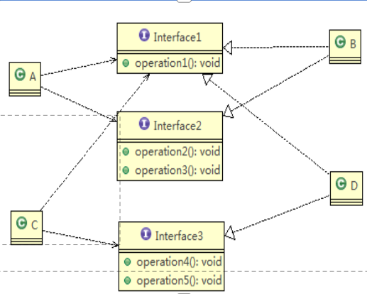

# 设计原则


## 单一职责原则

一个类只负责一项职责 ；类中方法足够少时，可以让一个方法只负责一项职责


## 接口隔离原则

客户端不应该依赖它不需要的接口，即一个类对另一个类的依赖应该建立在最小的接口上

错误做法：


改进：




## 依赖倒转原则

1)高层模块不应该依赖低层模块，二者都应该依赖其抽象

2)抽象不应该依赖细节，细节应该依赖抽象

3)依赖倒转(倒置)的中心思想是面向接口编程

4)依赖倒转原则是基于这样的设计理念：相对于细节的多变性，抽象的东西要稳定的多。以抽象为基础搭建的架构比以细节为基础的架构要稳定的多。在java中，抽象指的是接口或抽象类，细节就是具体的实现类

5)使用接口或抽象类的目的是制定好规范，而不涉及任何具体的操作，把展现细节的任务交给他们的实现类去完成


简单来说，低层实现接口、高层依赖接口（利用多态创建接口类的对象）。service层和dao层可以作为例子。


## 里氏替换原则

1)继承包含这样一层含义：父类中凡是已经实现好的方法，实际上是在设定规范和契约，虽然它不强制要求所有的子类必须遵循这些契约，但是如果子类对这些已经实现的方法任意修改，就会对整个继承体系造成破坏。

2)继承在给程序设计带来便利的同时，也带来了弊端。比如使用继承会给程序带来侵入性，程序的可移植性降低，增加对象间的耦合性，如果一个类被其他的类所继承，则当这个类需要修改时，必须考虑到所有的子类，并且父类修改后，所有涉及到子类的功能都有可能产生故障。


所以：

- 所有引用基类的地方必须能透明地使用其子类的对象。
- 在使用继承时，遵循里氏替换原则，在子类中**尽量**不要重写父类的方法


## 开闭原则

1. 一个软件实体如类，模块和函数应该对扩展开放(对提供方)，对修改关闭(对使用方)。用抽象构建框架，用实现扩展细节。
2. 当软件需要变化时，尽量**通过扩展**软件实体的行为来实现变化，而**不是通过修改**已有的代码来实现变化。
3. 编程中遵循其它原则，以及使用设计模式的目的就是遵循**开闭原则**。


简单来说，就是方法的使用方不应该编写具体的业务逻辑，业务逻辑应该在提供方中编写


## 迪米特法则

简单的定义：只与直接的朋友通信

**直接的朋友**：每个对象都会与其他对象有耦合关系，只要两个对象之间有耦合关系，我们就说这两个对象之间是朋友关系。耦合的方式很多，依赖，关联，组合，聚合等。其中，我们称出现成员变量，方法参数，方法返回值中的类为直接的朋友，而出现在局部变量中的类不是直接的朋友。也就是说，陌生的类最好不要以局部变量的形式出现在类的内部。


比如在一个方法中用了另一个类的对象作为局部变量，而这个类不是本类的直接朋友，那么我们就可以将有关这个类的逻辑在封装成一个方法，使其变成直接朋友，再完善业务逻辑。


## 合成复用原则

尽量使用合成/聚合的方式，而不是使用继承


# 类与类的关系

## 依赖关系

**Dependence**

通过方法参数、局部变量或者返回值 引用了另一个类

是一种较弱的关系，表示一个类的方法临时使用另一个类的对象来完成某些操作，但并不长期持有这个对象


## 泛化（继承）

**generalization**

依赖关系的特例

## 实现

**Implementation**

依赖关系的特例

## 关联

**Association**

依赖关系的特例

两个类之间较为持久的关系，其中一个类的对象会持有另一个类的对象作为成员变量（属性）。这种关系通常意味着这两个对象之间的交互是长期且稳定的，并且可以在对象的整个生命周期内访问对方。例如，一个`Car`对象可能持有一个`Engine`对象作为其成员变量，这表明两者之间存在一种关联关系。

具有导航性：双向关系或单向关系

## 聚合

**Aggregation**

整体与部分可以分开。关联关系的特例

## 组合

**Composition**

整体与部分不可以分开。关联关系的特例


# 设计模式概述

设计模式是程序员在面对同类软件工程设计问题所总结出来的有用的经验，是模式不是代码，而是某类问题的通用解决方案，设计模式（Design pattern）代表了**最佳的实践**。这些解决方案是众多软件开发人员经过相当长的一段时间的试验和错误总结出来的。

设计模式的本质提高软件的维护性，通用性和扩展性，并降低软件的复杂度。


设计模式分为三种类型，共23种

1)创建型模式：**单例模式**、抽象工厂模式、原型模式、建造者模式、**工厂模式**。

2)结构型模式：适配器模式、桥接模式、**装饰模式**、组合模式、外观模式、享元模式、**代理模式**。

3)行为型模式：模版方法模式、命令模式、访问者模式、迭代器模式、**观察者模式**、中介者模式、备忘录模式、解释器模式（Interpreter模式）、状态模式、策略模式、职责链模式(责任链模式)。


# 单例模式

所谓类的单例设计模式，就是采取一定的方法保证在整个的软件系统中，对某个类**只能存在一个对象实例**，并且该类只提供一个取得其对象实例的方法(静态方法)。

比如Hibernate的SessionFactory，它充当数据存储源的代理，并负责创建Session 对象。SessionFactory并不是轻量级的，一般情况下，一个项目通常只需要一个SessionFactory就够，这是就会使用到单例模式。


**单例设计模式八种方式**

**1)饿汉式(静态常量)**

**2)饿汉式（静态代码块）**

3)懒汉式(线程不安全)

4)懒汉式(线程安全，同步方法)

5)懒汉式(线程安全，同步代码块)

**6)双重检查**

**7)静态内部类**

**8)枚举**


## 饿汉式(静态常量)

步骤：

- 构造方法私有化
- 在类的内部创建对象(private final static)
- 提供公共静态方法获取对象(getInstance)

```java
class Singleton {
	
	//1. 构造器私有化, 外部不能new
	private Singleton() {
		
	}
	
	//2.本类内部创建对象实例
	private final static Singleton instance = new Singleton();
	
	//3. 提供一个公有的静态方法，返回实例对象
	public static Singleton getInstance() {
		return instance;
	}
	
}
```


1)优点：这种写法比较简单，就是在类装载的时候就完成实例化。避免了线程同步问题。

2)缺点：在类装载的时候就完成实例化，没有达到Lazy Loading的效果。如果从始至终从未使用过这个实例，则会造成内存的浪费

## 饿汉式（静态代码块）

将final去掉，并将new的过程放在静态代码块中。在类中只对其进行声名。

```java
class Singleton {
	
	//1. 构造器私有化, 外部能new
	private Singleton() {
		
	}
	

	//2.本类内部创建对象实例
	private  static Singleton instance;
	
	static { // 在静态代码块中，创建单例对象
		instance = new Singleton();
	}
	
	//3. 提供一个公有的静态方法，返回实例对象
	public static Singleton getInstance() {
		return instance;
	}
	
}
```


这种单例模式可用，但是可能造成内存浪费


## 线程不安全懒汉式

```java
class Singleton {
	private static Singleton instance;
	
	private Singleton() {}
	
	//提供一个静态的公有方法，当使用到该方法时，才去创建 instance
	//即懒汉式
	public static Singleton getInstance() {
		if(instance == null) {
			instance = new Singleton();
		}
		return instance;
	}
}
```

如果在多线程下，一个线程进入了if (singleton == null)判断语句块，还未来得及往下执行，另一个线程也通过了这个判断语句，这时便会产生多个实例。所以在多线程环境下不可使用这种方式


结论：在实际开发中，不要使用这种方式.

## 同步方法懒汉式

```java
class Singleton {
	private static Singleton instance;
	
	private Singleton() {}
	
	//提供一个静态的公有方法，当使用到该方法时，才去创建 instance
	//即懒汉式
	public static synchronized Singleton getInstance() {
		if(instance == null) {
			instance = new Singleton();
		}
		return instance;
	}
}
```

1)解决了线程不安全问题

2)效率太低了，每个线程在想获得类的实例时候，执行getInstance()方法都要进行同步。而其实这个方法只执行一次实例化代码就够了，后面的想获得该类实例，直接return就行了。方法进行同步效率太低

3)结论：在实际开发中，不推荐使用这种方式

## 同步代码块懒汉式

不能使用

```java
class Singleton {
	private static Singleton instance;
	
	private Singleton() {}
	
	//提供一个静态的公有方法，当使用到该方法时，才去创建 instance
	//即懒汉式
	public static Singleton getInstance() {
		if(instance == null) {
			synchronized{
				instance = new Singleton();
			}
		}
		return instance;
	}
}
```

syn加在if里面，不能保证线程安全


## DoubleCheck

- 双重检查锁定的基本形式	

  ```java
  public class Singleton {
      private static Singleton instance;
  
      public static Singleton getInstance() {
          if (instance == null) { // 第一次检查
              synchronized (Singleton.class) {
                  if (instance == null) { // 第二次检查
                      instance = new Singleton();
                  }
              }
          }
          return instance;
      }
  }
  ```

  

- 为什么要加`volatile`

  在上述代码中，如果没有将`instance`变量声明为`volatile`，可能会遇到指令重排序带来的问题。具体来说，在Java内存模型中，编译器和处理器可以对指令进行重排序以优化性能，只要这种重排序不会改变程序的执行结果（即遵循as-if-serial语义）。然而，在某些情况下，这种重排序可能会破坏多线程程序的正确性。

- 指令重排序的问题

  当执行`instance = new Singleton();`这行代码时，实际上发生了三个步骤：

  - 分配内存空间。

  - 初始化对象。

  - 将`instance`指向分配的内存地址。

  由于重排序的存在，步骤2和步骤3可能被重新排序，导致其他线程在第一个线程尚未完成对象初始化之前就能看到`instance`不为`null`，从而可能导致未完全初始化的对象被访问。

- 使用`volatile`解决重排序问题

  通过将`instance`声明为`volatile`，可以防止步骤2和步骤3之间的重排序，因为`volatile`变量具有两个重要特性：

  - **可见性**：确保一个线程对`volatile`变量的修改对其他线程是立即可见的。

  - **禁止重排序**：禁止对`volatile`变量的读写操作与其它变量的操作进行重排序，确保了特定顺序的执行。

  因此，正确的双重检查锁定应该如下所示：

  ```java
  public class Singleton {
      private static volatile Singleton instance;
  
      public static Singleton getInstance() {
          if (instance == null) {
              synchronized (Singleton.class) {
                  if (instance == null) {
                      instance = new Singleton();
                  }
              }
          }
          return instance;
      }
  ```


1)Double-Check概念是多线程开发中常使用到的，如代码中所示，我们进行了两次if (singleton == null)检查，这样就可以保证线程安全了。

2)这样，实例化代码只用执行一次，后面再次访问时，判断if (singleton == null)，直接return实例化对象，也避免的反复进行方法同步.

3)线程安全；延迟加载；效率较高

4)结论：在实际开发中，推荐使用这种单例设计模式


## 静态内部类

静态内部类只有在被首次使用时会进行类装载，不会随着外部类的装载而装载。

而且，类装载的时候，线程是安全的。

所以在调用getInstance方法时，进行装载，并且线程安全；我们只要把对象的创建写在静态代码块中，就可以保证懒加载和线程安全。

```java
public class Singleton {
    // 私有构造函数，防止外部实例化
    private Singleton() {}

    // 静态内部类，包含单例实例
    private static class SingletonHolder {
        private static final Singleton INSTANCE = new Singleton();
    }

    // 提供全局访问点获取实例
    public static Singleton getInstance() {
        return SingletonHolder.INSTANCE;
    }
}
```


1)这种方式采用了类装载的机制来保证初始化实例时只有一个线程。

2)静态内部类方式在Singleton类被装载时并不会立即实例化，而是在需要实例化时，调用getInstance方法，才会装载SingletonInstance类，从而完成Singleton的实例化。

3)类的静态属性只会在第一次加载类的时候初始化，所以在这里，JVM帮助我们保证了线程的安全性，在类进行初始化时，别的线程是无法进入的。

4)优点：避免了**线程不安全**，利用静态内部类特点实现延迟加载，效率高

5)结论：推荐使用.

相比其他实现方式（如双重检查锁定），这种方式不需要显式的同步代码块或使用`volatile`关键字，代码更加简洁。


## 枚举方式

```java
//使用枚举，可以实现单例, 推荐
enum Singleton {
	INSTANCE; //属性
	public void sayOK() {
		System.out.println("ok~");
	}
}
```

1)这借助JDK1.5中添加的枚举来实现单例模式。不仅能避免多线程同步问题，而且还能防止反序列化重新创建新的对象。

2)这种方式是Effective Java作者Josh Bloch 提倡的方式

3)结论：推荐使用


## 推荐使用的方式

- 枚举
- 静态内部类
- 双重检查

如果确定对象一定会使用，可以用饿汉式


单例模式注意事项和细节说明

1)单例模式保证了系统内存中该类只存在一个对象，节省了系统资源，对于一些需要频繁创建销毁的对象，使用单例模式可以提高系统性能

2)当想实例化一个单例类的时候，必须要记住使用相应的获取对象的方法，而不是使用new

3)单例模式使用的场景：需要频繁的进行创建和销毁的对象、创建对象时耗时过多或耗费资源过多(即：重量级对象)，但又经常用到的对象、工具类对象、频繁访问数据库或文件的对象(比如数据源、session工厂等)


## 解决序列化破坏单例的问题

通过提供一个 `readResolve()` 方法，可以在对象反序列化时替换生成的对象。这个方法会在反序列化过程完成后、将对象返回给调用者之前被调用。你可以在这个方法中返回现有的单例实例，从而避免创建新的实例。


```java
import java.io.ObjectStreamException;
import java.io.Serializable;

public class Singleton implements Serializable {
    // 私有构造函数防止外部实例化
    private Singleton() {}

    // 静态内部类实现单例模式
    private static class SingletonHolder {
        private static final Singleton INSTANCE = new Singleton();
    }

    public static Singleton getInstance() {
        return SingletonHolder.INSTANCE;
    }

    // readResolve方法确保反序列化时返回的是唯一的实例
    protected Object readResolve() throws ObjectStreamException {
        return SingletonHolder.INSTANCE;
    }
}
```

通过实现 `readResolve` 方法，可以在对象反序列化时控制返回的对象，确保返回的是已有的单例实例而不是新创建的实例。这种方法简单有效，是解决序列化破坏单例模式问题的标准做法


## 解决反射破坏单例的问题

```java
public class Singleton {
    // 静态变量保存单例实例
    private static final Singleton instance = new Singleton();
    
    // 私有构造函数，防止外部实例化
    private boolean initialized = false; // 标志位，用于防止反射攻击

    private Singleton() {
        if (initialized) {
            throw new RuntimeException("Use getInstance() method to get the single instance of this class.");
        }
        synchronized (Singleton.class) {
            if (!initialized) {
                initialized = true;
            } else {
                throw new RuntimeException("Use getInstance() method to get the single instance of this class.");
            }
        }
    }

    public static Singleton getInstance() {
        return instance;
    }
}
```

`initialized` 布尔变量用于标记构造函数是否已经被调用过。如果发现构造函数被第二次调用（可能是通过反射），则抛出异常以阻止创建新实例。

为了确保多线程环境下只有一个实例被创建，在设置 `initialized` 标志时使用了同步块。虽然在这个例子中由于单例实例是静态初始化的，所以实际上不需要这个同步块，但在其他情况下（例如懒加载单例），这一步是必要的。


# 简单工厂模式

不是23种设计模式之一

简单工厂包含如下角色：

- **工厂类（Creator）**：负责实现创建所有类型实例的逻辑。通常包含一个静态方法，根据传入的参数来决定并返回相应类型的实例。
- **抽象产品类（Product）**：定义产品的公共接口或基类，所有的具体产品类都实现了这个接口或继承自该基类。
- **具体产品类（Concrete Product）**：实现了抽象产品类所定义的接口或继承自抽象产品类的具体类。每个具体产品类代表一种类型的产品。

```java
// 抽象产品类
abstract class Shape {
    abstract void draw();
}

// 具体产品类 - 圆形
class Circle extends Shape {
    @Override
    void draw() {
        System.out.println("Drawing a Circle");
    }
}

// 具体产品类 - 方形
class Square extends Shape {
    @Override
    void draw() {
        System.out.println("Drawing a Square");
    }
}

// 工厂类
class ShapeFactory {
    // 使用 getShape 方法获取形状类型的对象
    public static Shape getShape(String shapeType) {
        if (shapeType == null) {
            return null;
        }
        if (shapeType.equalsIgnoreCase("CIRCLE")) {
            return new Circle();
        } else if (shapeType.equalsIgnoreCase("SQUARE")) {
            return new Square();
        }
        return null;
    }
}

// 客户端代码
public class FactoryPatternDemo {
    public static void main(String[] args) {
        Shape shape1 = ShapeFactory.getShape("CIRCLE");
        shape1.draw();

        Shape shape2 = ShapeFactory.getShape("SQUARE");
        shape2.draw();
    }
}
```

优点

- **封装性好**：创建逻辑被封装在工厂类中，客户端不需要了解如何创建对象。
- **易于扩展**：如果需要添加新产品，只需修改工厂类即可，符合开闭原则（对扩展开放，对修改关闭）。
- **分离关注点**：将对象的创建和使用分离开来，降低了系统的耦合度。

缺点

- **违背开闭原则**：每次添加新的产品时都需要修改工厂类，这要求重新编译原有的工厂类代码。
- **工厂类职责过重**：当产品种类较多时，工厂类的业务逻辑可能会变得过于复杂，不易维护。

简单工厂模式适用于产品种类较少且不经常变动的情况，它为客户端隐藏了对象创建的细节，简化了客户端的调用过程。然而，在面对大量产品类型或频繁的产品类型变化时，可能需要考虑其他更灵活的设计模式，如工厂方法模式或抽象工厂模式。


# 工厂方法模式

简单工厂模式违反了开闭原则。

而工厂方法模式完全遵循了开闭原则


- 概念：

  定义一个用于创建对象的接口，让子类决定实例化哪个对象。工厂方法使一个产品类的实例化延迟到其工厂的子类。


- 主要角色：

  抽象工厂：提供了创建产品的接口，调用者通过它访问具体工厂的工厂方法来创建产品

  具体工厂：实现抽象工厂中的抽象方法，完成具体产品的创建

  抽象产品：定义了产品的规范，描述了产品的主要特性和功能

  具体产品：实现了抽象产品的接口，有具体工厂来创建，它和具体工厂一一对应

- 实现

  假设我们需要创建不同类型的文档对象（如PDF文档和Word文档），可以使用工厂方法模式来实现：

  抽象产品：

  ```java
  // 抽象产品类
  abstract class Document {
      abstract void open();
  }
  ```

  具体产品:

  ```java
  // 具体产品 - PDF文档
  class PDFDocument extends Document {
      @Override
      void open() {
          System.out.println("Opening a PDF document.");
      }
  }
  
  // 具体产品 - Word文档
  class WordDocument extends Document {
      @Override
      void open() {
          System.out.println("Opening a Word document.");
      }
  }
  ```

  抽象工厂:

  ```java
  // 抽象工厂类
  abstract class DocumentFactory {
      // 工厂方法
      abstract Document createDocument();
  }
  ```

  具体工厂：

  ```java
  // 具体工厂 - 创建PDF文档
  class PDFDocumentFactory extends DocumentFactory {
      @Override
      Document createDocument() {
          return new PDFDocument();
      }
  }
  
  // 具体工厂 - 创建Word文档
  class WordDocumentFactory extends DocumentFactory {
      @Override
      Document createDocument() {
          return new WordDocument();
      }
  }
  ```

  测试：

  ```java
  public class FactoryMethodPatternDemo {
      public static void main(String[] args) {
          // 使用PDF文档工厂
          DocumentFactory pdfFactory = new PDFDocumentFactory();
          Document pdfDocument = pdfFactory.createDocument();
          pdfDocument.open();
  
          // 使用Word文档工厂
          DocumentFactory wordFactory = new WordDocumentFactory();
          Document wordDocument = wordFactory.createDocument();
          wordDocument.open();
      }
  }
  ```

- 优点：

  - **符合开闭原则**：添加新产品**只需添加新的具体产品类和相应的具体工厂类**，无需修改现有的工厂代码。
  - **增加灵活性**：将选择具体产品实现的责任转移到了具体工厂类中，增加了系统的灵活性。
  - **解耦客户端代码与产品类**：客户端代码不依赖于具体产品类，而是依赖于抽象产品接口，降低了系统之间的耦合度。

- 缺点：

  - **增加系统复杂度**：每增加一种产品都需要编写新的具体产品类和具体工厂类，可能会导致类的数量增多。
  - **需要管理多个工厂类**：随着产品种类的增加，管理这些工厂类也会变得复杂。


ArrayList的iterator（）方法就使用了工厂方法模式。还有DateFormat类的getInstance（）方法；Calendar类的getInstance（）方法


# 抽象工厂模式

示例说明

假设我们正在开发一个跨平台UI库，支持Windows和Mac两种风格的组件。我们可以使用抽象工厂模式来确保每个平台上使用的都是对应风格的组件。

- 抽象产品

```java
// 抽象按钮
interface Button {
    void paint();
}

// 抽象文本框
interface TextBox {
    void displayText();
}
```

- 具体产品

```java
// Windows风格按钮
class WindowsButton implements Button {
    @Override
    public void paint() {
        System.out.println("Render a Windows button.");
    }
}

// Windows风格文本框
class WindowsTextBox implements TextBox {
    @Override
    public void displayText() {
        System.out.println("Display text in a Windows textbox.");
    }
}

// Mac风格按钮
class MacButton implements Button {
    @Override
    public void paint() {
        System.out.println("Render a Mac button.");
    }
}

// Mac风格文本框
class MacTextBox implements TextBox {
    @Override
    public void displayText() {
        System.out.println("Display text in a Mac textbox.");
    }
}
```

- 抽象工厂

```java
// 抽象工厂
interface GUIFactory {
    Button createButton();
    TextBox createTextBox();
}
```

- 具体工厂

```java
// Windows风格工厂
class WindowsFactory implements GUIFactory {
    @Override
    public Button createButton() {
        return new WindowsButton();
    }

    @Override
    public TextBox createTextBox() {
        return new WindowsTextBox();
    }
}

// Mac风格工厂
class MacFactory implements GUIFactory {
    @Override
    public Button createButton() {
        return new MacButton();
    }

    @Override
    public TextBox createTextBox() {
        return new MacTextBox();
    }
}
```

- 客户端

```java
public class Application {
    private Button button;
    private TextBox textBox;

    public Application(GUIFactory factory) {
        button = factory.createButton();
        textBox = factory.createTextBox();
    }

    public void paint() {
        button.paint();
        textBox.displayText();
    }

    public static void main(String[] args) {
        GUIFactory factory;
        if (args.length == 0 || args[0].equalsIgnoreCase("windows")) {
            factory = new WindowsFactory();
        } else {
            factory = new MacFactory();
        }

        Application app = new Application(factory);
        app.paint();
    }
}
```

- 优点

  - **一致性和隔离性**：抽象工厂模式确保了产品的一致性，即一组相关的产品总是被一起使用，而不会出现混用的情况。

  - **易于扩展**：添加新产品族时，只需添加新的具体工厂和具体产品类，不需要修改现有代码。

  - **提高灵活性**：允许客户端代码独立于如何创建、组合和表示产品对象。

- 缺点
  - **复杂度增加**：对于每一个产品族都需要引入一个新的抽象产品接口和相应的具体产品类，这会增加系统的复杂性。
  - **限制新产品的添加**：当需要支持新的产品类型时，不仅需要添加新的具体产品类，还需要更新抽象工厂接口，这可能会影响现有的工厂实现。

# 简单工厂+配置文件解除耦合

- 实现思路

1. **简单工厂**：负责根据传入的参数决定创建哪个具体的产品实例。
2. **配置文件**：存储用于确定创建哪个具体产品实例的信息。可以是`.properties`文件、XML文件、JSON文件等格式。
3. **反射机制**：利用Java的反射机制根据配置文件中的信息动态加载和实例化具体的类。

- 示例实现

  假设我们需要创建不同类型的支付方式（如支付宝、微信支付等），并希望通过配置文件来指定使用哪种支付方式。

  

- 抽象产品

```java
// 支付接口
public interface Payment {
    void pay(double amount);
}
```

- 具体产品

```java
// 支付宝支付
public class Alipay implements Payment {
    @Override
    public void pay(double amount) {
        System.out.println("Paid " + amount + " using Alipay.");
    }
}

// 微信支付
public class WeChatPay implements Payment {
    @Override
    public void pay(double amount) {
        System.out.println("Paid " + amount + " using WeChat Pay.");
    }
}
```

- 简单工厂结合配置文件

  首先，创建一个配置文件（例如`payment.properties`）：

```java
payment.class=com.example.payment.Alipay
```

​	然后，编写简单工厂类来读取配置文件并根据配置创建相应的对象：

```java
import java.io.InputStream;
import java.util.Properties;

public class PaymentFactory {
    private static Properties properties = new Properties();

    static {
        try (InputStream input = PaymentFactory.class.getClassLoader().getResourceAsStream("payment.properties")) {
            if (input == null) {
                System.out.println("Sorry, unable to find payment.properties");
                return;
            }
            // 加载配置文件
            properties.load(input);
        } catch (Exception ex) {
            ex.printStackTrace();
        }
    }

    public static Payment createPayment() throws Exception {
        String className = properties.getProperty("payment.class");
        if (className == null || className.isEmpty()) {
            throw new IllegalArgumentException("Payment class not specified in configuration file.");
        }
        // 使用反射创建实例
        Class<?> clazz = Class.forName(className);
        return (Payment) clazz.getDeclaredConstructor().newInstance();
    }
}
```

- 客户端代码

```java
public class Client {
    public static void main(String[] args) {
        try {
            Payment payment = PaymentFactory.createPayment();
            payment.pay(100);
        } catch (Exception e) {
            e.printStackTrace();
        }
    }
}
```

解除耦合的效果

- **灵活性**：只需更改配置文件中的`payment.class`属性值，就可以在运行时切换不同的支付方式，而不需要修改任何业务逻辑代码。
- **扩展性**：当需要添加新的支付方式时，只需要实现`Payment`接口，并在配置文件中添加相应的类名即可，无需修改现有代码。
- **维护性**：将创建对象的逻辑从客户端代码中分离出来，并通过配置文件进行管理，使得系统更加易于维护。


# 建造者模式

- 建造者模式的主要角色

1. **产品（Product）**：要构建的复杂对象。
2. **抽象建造者（Builder）**：定义了创建产品各个部分的接口或抽象类，但通常不提供具体的实现。
3. **具体建造者（Concrete Builder）**：实现了抽象建造者的接口，提供了构建产品各部分的具体实现。
4. **指挥者（Director）**：负责使用建造者接口来构建产品。它隔离了客户端与创建过程，使得相同的构建过程可以创建不同的产品表示。
5. **客户端（Client）**：通过指挥者和具体建造者来创建复杂对象。

- 实现示例

假设我们要构建一个`Meal`（套餐），每个套餐可能包含饮料、主菜、甜点等。我们可以使用建造者模式来简化这个过程：

- 产品

```java
public class Meal {
    private String drink;
    private String mainCourse;
    private String dessert;

    // Getters
    public String getDrink() { return drink; }
    public String getMainCourse() { return mainCourse; }
    public String getDessert() { return dessert; }

    // Setters (private to enforce builder pattern)
    private void setDrink(String drink) { this.drink = drink; }
    private void setMainCourse(String mainCourse) { this.mainCourse = mainCourse; }
    private void setDessert(String dessert) { this.dessert = dessert; }

    @Override
    public String toString() {
        return "Meal{" +
                "drink='" + drink + '\'' +
                ", mainCourse='" + mainCourse + '\'' +
                ", dessert='" + dessert + '\'' +
                '}';
    }
}
```

- 抽象建造者

```java
public abstract class MealBuilder {
    protected Meal meal = new Meal();

    public Meal getMeal() { return meal; }

    public abstract void buildDrink();
    public abstract void buildMainCourse();
    public abstract void buildDessert();
}
```

- 具体建造者

```java
public class VegMealBuilder extends MealBuilder {
    @Override
    public void buildDrink() {
        meal.setDrink("Coke");
    }

    @Override
    public void buildMainCourse() {
        meal.setMainCourse("Vegetable Pizza");
    }

    @Override
    public void buildDessert() {
        meal.setDessert("Ice Cream");
    }
}

public class NonVegMealBuilder extends MealBuilder {
    @Override
    public void buildDrink() {
        meal.setDrink("Pepsi");
    }

    @Override
    public void buildMainCourse() {
        meal.setMainCourse("Chicken Burger");
    }

    @Override
    public void buildDessert() {
        meal.setDessert("Chocolate Cake");
    }
}
```

- 指挥者

```java
public class Waiter {
    private MealBuilder mealBuilder;

    public void setMealBuilder(MealBuilder mb) { this.mealBuilder = mb; }

    public Meal constructMeal() {
        mealBuilder.buildDrink();
        mealBuilder.buildMainCourse();
        mealBuilder.buildDessert();
        return mealBuilder.getMeal();
    }
}
```

- 客户端代码

```java
public class Client {
    public static void main(String[] args) {
        Waiter waiter = new Waiter();

        MealBuilder vegMealBuilder = new VegMealBuilder();
        waiter.setMealBuilder(vegMealBuilder);
        Meal vegMeal = waiter.constructMeal();
        System.out.println("Veg Meal: " + vegMeal);

        MealBuilder nonVegMealBuilder = new NonVegMealBuilder();
        waiter.setMealBuilder(nonVegMealBuilder);
        Meal nonVegMeal = waiter.constructMeal();
        System.out.println("Non-Veg Meal: " + nonVegMeal);
    }
}
```

优点

- **易于修改和扩展**：可以通过添加新的建造者类来支持新类型的对象构建，而无需修改现有的代码。
- **清晰的构建流程**：建造者模式提供了一种逐步构建复杂对象的方法，使构建过程更加清晰明了。
- **避免了大量的构造函数参数**：对于需要多个参数来构造的对象，特别是当很多参数是可选的时候，建造者模式可以有效减少构造函数的数量和复杂度。

缺点

- **增加类的数量**：为了支持建造者模式，需要引入额外的类（如抽象建造者和具体建造者），这可能会使系统变得稍微复杂一些。
- **适用性有限**：仅适用于需要构建步骤较多且复杂的对象，对于简单的对象构建可能显得过于繁琐。

总的来说，建造者模式非常适合用于构建具有许多属性的对象，尤其是当这些属性中有很多是可选的情况下。通过使用建造者模式，可以有效地提高代码的可读性和灵活性。


## 静态内部类实现建造者模式

假设我们要构建一个表示计算机的类`Computer`，它包含多个属性，例如CPU、内存、硬盘等。由于这些属性较多且有些是可选的，直接使用构造函数可能会导致参数过多的问题。因此，我们可以使用建造者模式来简化对象的创建过程。

-  定义产品类（`Computer`）

```java
public class Computer {
    // 必填属性
    private final String cpu;
    private final String memory;

    // 可选属性
    private String storage;
    private String graphicsCard;
    private String os;

    // 私有构造函数，只能通过Builder类访问
    private Computer(Builder builder) {
        this.cpu = builder.cpu;
        this.memory = builder.memory;
        this.storage = builder.storage;
        this.graphicsCard = builder.graphicsCard;
        this.os = builder.os;
    }

    // Getter方法
    public String getCpu() { return cpu; }
    public String getMemory() { return memory; }
    public String getStorage() { return storage; }
    public String getGraphicsCard() { return graphicsCard; }
    public String getOs() { return os; }

    @Override
    public String toString() {
        return "Computer{" +
                "cpu='" + cpu + '\'' +
                ", memory='" + memory + '\'' +
                ", storage='" + storage + '\'' +
                ", graphicsCard='" + graphicsCard + '\'' +
                ", os='" + os + '\'' +
                '}';
    }

    // 静态内部类 - Builder
    public static class Builder {
        // 必填属性
        private final String cpu;
        private final String memory;

        // 可选属性
        private String storage;
        private String graphicsCard;
        private String os;

        // 构造函数只初始化必填属性
        public Builder(String cpu, String memory) {
            this.cpu = cpu;
            this.memory = memory;
        }

        // 设置可选属性的方法，返回this以支持链式调用
        public Builder setStorage(String storage) {
            this.storage = storage;
            return this;
        }

        public Builder setGraphicsCard(String graphicsCard) {
            this.graphicsCard = graphicsCard;
            return this;
        }

        public Builder setOs(String os) {
            this.os = os;
            return this;
        }

        // 构建方法，返回最终的Computer对象
        public Computer build() {
            return new Computer(this);
        }
    }
}
```

-  客户端代码

  以下是客户端如何使用`Computer`类及其静态内部类`Builder`来构建对象的示例：

```java
public class Client {
    public static void main(String[] args) {
        // 使用Builder创建Computer对象
        Computer computer = new Computer.Builder("Intel i7", "16GB")
                .setStorage("512GB SSD")
                .setGraphicsCard("NVIDIA RTX 3080")
                .setOs("Windows 11")
                .build();

        // 打印结果
        System.out.println(computer);
    }
}
```

运行上述代码后，输出结果如下：

```java
Computer{cpu='Intel i7', memory='16GB', storage='512GB SSD', graphicsCard='NVIDIA RTX 3080', os='Windows 11'}
```

- 优点分析

1. **清晰的构建流程**：
   - 使用静态内部类作为建造者，将复杂对象的构建过程分解为多个步骤，每个步骤对应一个方法，逻辑清晰。
2. **灵活性**：
   - 可选属性可以通过链式调用来设置，而不需要为每个可能的组合编写不同的构造函数。
3. **封装性**：
   - `Computer`类的构造函数是私有的，外部无法直接实例化`Computer`对象，必须通过`Builder`类来完成。这确保了对象的完整性。
4. **可读性**：
   - 链式调用的方式使得代码更易读，尤其是当需要设置多个可选属性时。